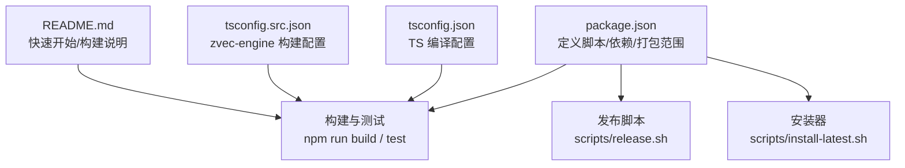
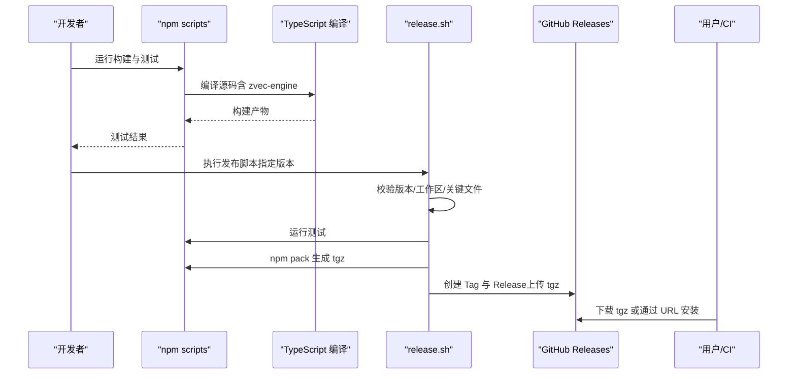
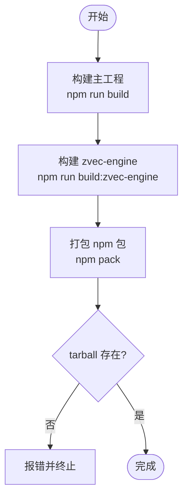
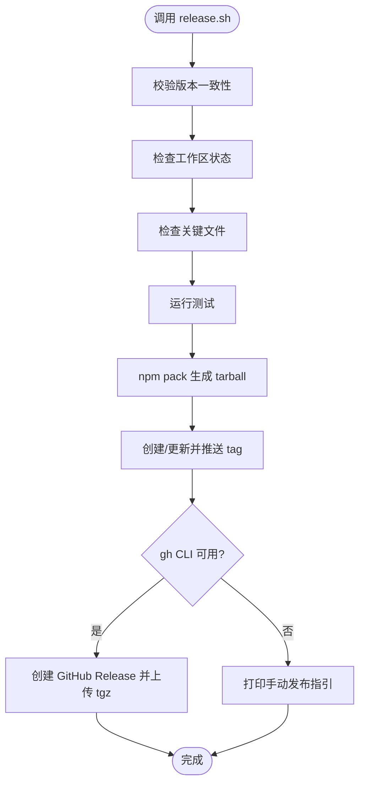
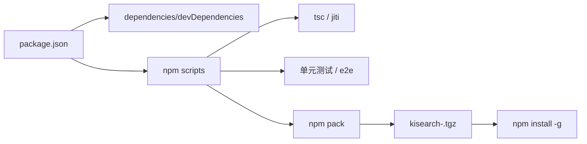

# 构建与发布

<cite>
**本文引用的文件**
- [package.json](file://package.json)
- [tsconfig.json](file://tsconfig.json)
- [tsconfig.src.json](file://tsconfig.src.json)
- [README.md](file://README.md)
- [scripts/release.sh](file://scripts/release.sh)
- [scripts/install-latest.sh](file://scripts/install-latest.sh)
- [zvec-mcp-server/.github/workflows/ci.yml](file://zvec-mcp-server/.github/workflows/ci.yml)
- [zvec-mcp-server/.github/workflows/release.yml](file://zvec-mcp-server/.github/workflows/release.yml)
</cite>

## 目录
1. [简介](#简介)
2. [项目结构](#项目结构)
3. [核心组件](#核心组件)
4. [架构总览](#架构总览)
5. [详细组件分析](#详细组件分析)
6. [依赖关系分析](#依赖关系分析)
7. [性能考量](#性能考量)
8. [故障排查指南](#故障排查指南)
9. [结论](#结论)
10. [附录](#附录)

## 简介
本指南面向 kisearch（CLI：ki）的构建、打包与发布流程，覆盖版本管理策略、Changelog 维护建议、npm 包发布、CI/CD 流水线配置、自动化测试集成、生产部署步骤以及回滚与兼容性处理。仓库采用 TypeScript + jiti 直接执行模式，并通过 npm scripts 组织构建与测试；发布脚本将生成 npm tarball 并创建 GitHub Release，便于通过 URL 安装或 CI 分发。

## 项目结构
- 顶层 package.json 定义了 CLI 入口、构建与测试脚本、打包文件清单与 Node 引擎要求。
- tsconfig.json 用于整体编译目标与模块解析；tsconfig.src.json 专门构建 zvec-engine 子工程产物到 dist/zvec-engine。
- README 提供快速开始、MCP 启动、Web 前端构建等使用指引。
- scripts 目录包含 release.sh（发布）与 install-latest.sh（一键安装最新版本）。
- zvec-mcp-server 子项目包含 Python 服务的 CI 与 Release 工作流，可作为参考。

图表来源
- [package.json:1-68](file://package.json#L1-L68)
- [tsconfig.json:1-16](file://tsconfig.json#L1-L16)
- [tsconfig.src.json:1-24](file://tsconfig.src.json#L1-L24)
- [README.md:105-167](file://README.md#L105-L167)

章节来源
- [package.json:1-68](file://package.json#L1-L68)
- [tsconfig.json:1-16](file://tsconfig.json#L1-L16)
- [tsconfig.src.json:1-24](file://tsconfig.src.json#L1-L24)
- [README.md:105-167](file://README.md#L105-L167)

## 核心组件
- 构建与测试脚本：通过 npm scripts 统一入口，支持构建 zvec 引擎、运行单测与端到端测试。
- 发布脚本：校验版本与工作区状态，运行测试，打包 tarball，创建并推送 tag，自动创建 GitHub Release（可选 gh CLI），输出安装命令。
- 安装器：自动查询最新 release（GitHub API/gh CLI/页面重定向），下载 tgz 并全局安装 ki。
- TS 编译配置：分别针对主工程与 zvec-engine 子工程，确保产物路径正确。
- 文档与快速开始：README 提供本地构建 Web 前端、启动 MCP HTTP 服务与安装方式。

章节来源
- [package.json:9-33](file://package.json#L9-L33)
- [scripts/release.sh:1-142](file://scripts/release.sh#L1-L142)
- [scripts/install-latest.sh:1-205](file://scripts/install-latest.sh#L1-L205)
- [tsconfig.json:1-16](file://tsconfig.json#L1-L16)
- [tsconfig.src.json:1-24](file://tsconfig.src.json#L1-L24)
- [README.md:105-167](file://README.md#L105-L167)

## 架构总览
下图展示从代码到可安装包的完整链路：开发者触发构建与测试，发布脚本生成 tarball 并创建 GitHub Release；用户可通过 npm 直接安装 tgz 或使用安装器自动获取最新版本。

图表来源
- [package.json:9-33](file://package.json#L9-L33)
- [scripts/release.sh:18-137](file://scripts/release.sh#L18-L137)
- [README.md:105-167](file://README.md#L105-L167)

## 详细组件分析

### 构建流程与打包配置
- 构建入口：npm run build 与 npm run build:zvec-engine，分别编译主工程与 zvec-engine 子工程。
- 编译配置：
  - 主工程：tsconfig.json 设置目标 ES2022、模块解析为 bundler，输出至 dist。
  - zvec-engine：tsconfig.src.json 输出至 dist/zvec-engine，启用声明与 SourceMap。
- 打包范围：package.json 的 files 字段限定发布的目录与文件，确保仅包含必要资源。
- 运行时依赖：Node >= 18，使用 jiti 直接执行 TS，无需额外运行时转换。

图表来源
- [package.json:9-33](file://package.json#L9-L33)
- [package.json:50-62](file://package.json#L50-L62)
- [tsconfig.json:1-16](file://tsconfig.json#L1-L16)
- [tsconfig.src.json:1-24](file://tsconfig.src.json#L1-L24)

章节来源
- [package.json:9-33](file://package.json#L9-L33)
- [package.json:50-62](file://package.json#L50-L62)
- [tsconfig.json:1-16](file://tsconfig.json#L1-L16)
- [tsconfig.src.json:1-24](file://tsconfig.src.json#L1-L24)

### 发布脚本使用
- 用法：./scripts/release.sh <version> [prerelease]
- 流程要点：
  - 校验传入版本与 package.json 一致。
  - 检查工作区干净（无未提交变更）。
  - 检查关键文件存在。
  - 运行测试，失败即中止。
  - 生成 tarball 并列出内容大小。
  - 创建/覆盖 git tag 并推送到远程。
  - 若已认证 gh CLI，则自动创建 GitHub Release 并上传 tgz；否则提示手动操作。
  - 输出安装命令以便用户直接使用。

图表来源
- [scripts/release.sh:18-137](file://scripts/release.sh#L18-L137)

章节来源
- [scripts/release.sh:1-142](file://scripts/release.sh#L1-L142)

### 版本管理策略与 Changelog 维护
- 版本管理：
  - 使用语义化版本号（如 0.2.0-beta），通过 npm version 更新 package.json 后，再执行发布脚本。
  - 发布脚本会强制校验命令行版本与 package.json 一致，避免误发。
- Changelog 维护：
  - 建议在每次发布前维护 CHANGELOG.md，记录新增特性、修复与破坏性变更。
  - 发布脚本内置 Release Notes 模板，可在 GitHub Release 中作为简要说明；更详细的变更记录请维护在仓库文档中。
- 预发布与正式：
  - 支持 prerelease 参数，发布时标记为预发布；正式版不传该参数。

章节来源
- [package.json:1-10](file://package.json#L1-L10)
- [scripts/release.sh:10-24](file://scripts/release.sh#L10-L24)
- [scripts/release.sh:80-116](file://scripts/release.sh#L80-L116)

### npm 包发布
- 本地发布：
  - 执行 ./scripts/release.sh <version> 生成 tarball 并创建 GitHub Release。
  - 用户可通过 URL 安装：npm install -g https://github.com/<repo>/releases/download/v<version>/kisearch-<version>.tgz
- 自动发布：
  - 若 gh CLI 已认证，脚本自动创建 Release 并上传 tgz。
  - 未认证时，按脚本提示手动创建 Release 并上传 tgz。

章节来源
- [scripts/release.sh:51-137](file://scripts/release.sh#L51-L137)
- [README.md:107-119](file://README.md#L107-L119)

### CI/CD 流水线配置与自动化测试集成
- 当前仓库根目录未提供 GitHub Actions 配置文件；但 zvec-mcp-server 子项目提供了 Python 服务的 CI 与 Release 工作流，可作为参考：
  - CI：在 push/PR 到 main/master 分支时，多矩阵运行测试与 lint，并上报覆盖率。
  - Release：当推送 v* 标签时，构建并发布到 PyPI。
- 建议在本仓库根目录增加 CI 以统一流程：
  - 触发条件：push/PR 到 main/master，以及 v* 标签。
  - 步骤：检出代码 → 安装依赖 → 构建（含 zvec-engine）→ 运行测试 → 可选：构建 Web 前端 → 发布制品（tarball）。
  - 缓存：缓存 node_modules 与构建产物以提升速度。
  - 安全：使用 secrets 管理敏感信息（如 npm token、gh token）。

章节来源
- [zvec-mcp-server/.github/workflows/ci.yml:1-52](file://zvec-mcp-server/.github/workflows/ci.yml#L1-L52)
- [zvec-mcp-server/.github/workflows/release.yml:1-42](file://zvec-mcp-server/.github/workflows/release.yml#L1-L42)

### 部署到生产环境
- 服务端部署（MCP HTTP 模式）：
  - 构建 Web 前端：cd web && npm install && npm run build
  - 启动服务：ki mcp --http --web
  - 访问地址：浏览器打开 http://127.0.0.1:7423/
- 客户端安装：
  - 使用安装器：curl -fsSL https://raw.githubusercontent.com/HACK-WU/kisearch/master/scripts/install-latest.sh | bash
  - 或直接安装 tgz：npm install -g <release-url>/kisearch-<version>.tgz

章节来源
- [README.md:56-62](file://README.md#L56-L62)
- [README.md:107-119](file://README.md#L107-L119)
- [scripts/install-latest.sh:1-205](file://scripts/install-latest.sh#L1-L205)

### 回滚策略与版本兼容性处理
- 回滚策略：
  - 通过 GitHub Release 的 tag 与 tgz 进行回滚：重新安装历史版本的 tgz。
  - 若使用安装器，可修改脚本中的 REPO 与下载逻辑指向历史版本 URL。
- 版本兼容性：
  - Node 引擎要求：>= 18，升级需评估兼容性与迁移成本。
  - 依赖升级：谨慎升级 major 版本，先在 CI 中验证测试通过。
  - 数据格式：JSON 文件含 version 字段，读取旧格式时具备自动迁移能力。
  - 向量维度：Embedding 维度必须与建库时一致，升级需确保模型与维度匹配。

章节来源
- [scripts/release.sh:65-137](file://scripts/release.sh#L65-L137)
- [scripts/install-latest.sh:42-125](file://scripts/install-latest.sh#L42-L125)
- [package.json:60-62](file://package.json#L60-L62)
- [README.md:121-141](file://README.md#L121-L141)

## 依赖关系分析
- 构建与测试依赖：
  - TypeScript 编译器用于构建 zvec-engine。
  - jiti 用于直接执行 TS 脚本，简化开发体验。
- 运行时依赖：
  - Node >= 18。
  - 外部工具：gh CLI（可选，用于自动创建 Release）、curl/jq（安装器依赖）。
- 打包范围：
  - 仅包含 bin、src、_template、dist/zvec-engine 等必要目录，减少包体积。

图表来源
- [package.json:42-66](file://package.json#L42-L66)
- [package.json:9-33](file://package.json#L9-L33)

章节来源
- [package.json:42-66](file://package.json#L42-L66)
- [package.json:9-33](file://package.json#L9-L33)

## 性能考量
- 构建优化：
  - 缓存 node_modules 与 dist 目录，减少重复安装与编译时间。
  - 并行执行任务：在 CI 中并行运行不同测试集。
- 运行时优化：
  - 使用 jiti 直接执行 TS，避免额外转译开销。
  - 合理设置 chunkSize 与 overlap，平衡导入速度与检索质量。
- 网络与安装：
  - 安装器优先使用 GitHub API，失败时降级到 gh CLI 或页面重定向，提升稳定性。

[本节为通用指导，不涉及具体文件分析]

## 故障排查指南
- 版本不一致：
  - 现象：发布脚本提示 package.json 版本与传入版本不一致。
  - 解决：先执行 npm version <version> --no-git-tag-version 更新版本后再发布。
- 工作区不干净：
  - 现象：脚本拒绝发布，提示有未提交变更。
  - 解决：提交或暂存变更后再执行发布。
- 关键文件缺失：
  - 现象：脚本检查 bin/ki.mjs、src/mcp-server.ts、README.md、package.json 失败。
  - 解决：确保这些文件存在且路径正确。
- 测试失败：
  - 现象：npm test 失败导致发布中止。
  - 解决：修复测试用例或环境问题后重试。
- gh CLI 未认证：
  - 现象：无法自动创建 Release。
  - 解决：执行 gh auth login 或按提示手动创建 Release。

章节来源
- [scripts/release.sh:18-49](file://scripts/release.sh#L18-L49)
- [scripts/release.sh:65-137](file://scripts/release.sh#L65-L137)

## 结论
kisearch 的构建与发布流程围绕 npm scripts 与自定义发布脚本展开，结合 TypeScript 编译与 jiti 直接执行，实现了简洁高效的开发与发布体验。通过 release.sh 与 install-latest.sh，团队可以稳定地生成可安装的 tarball 并分发到 GitHub Releases；同时建议在本仓库根目录引入统一的 CI/CD 流水线，以实现自动化测试、构建与发布的一体化。版本管理与兼容性方面，应严格遵循语义化版本、维护 Changelog，并在升级依赖与数据格式时充分评估影响。

## 附录
- 快速开始与 MCP 启动请参考 README 中的“快速开始”与“MCP 集成”章节。
- 如需进一步定制构建流程，可在 package.json 的 scripts 中扩展命令，或在 CI 中添加相应步骤。