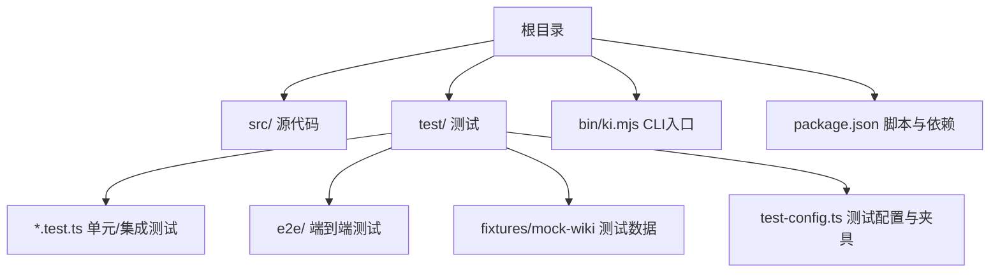
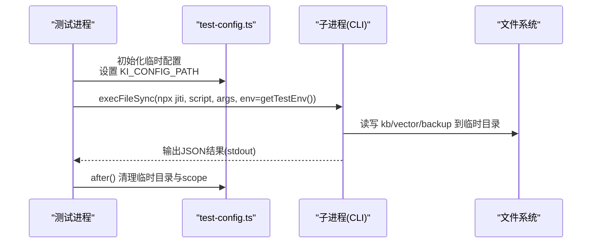
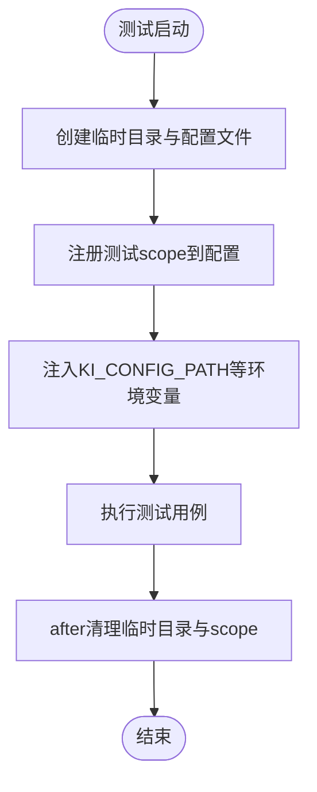
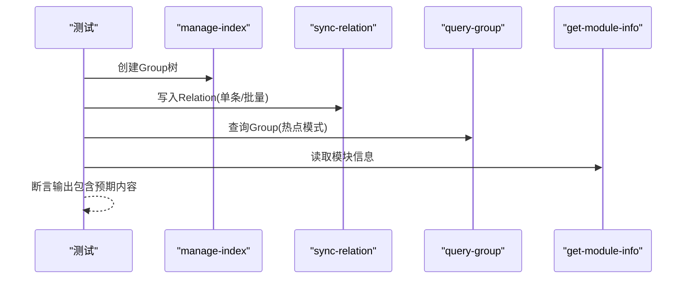
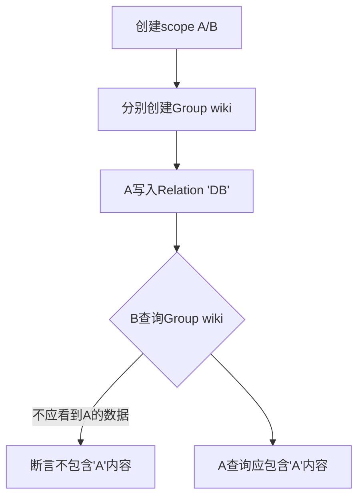
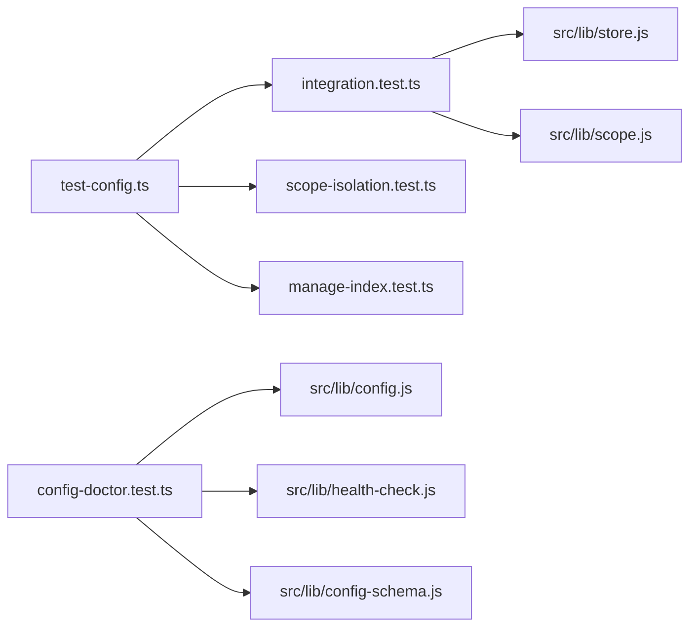

# 单元测试

<cite>
**本文引用的文件**
- [package.json](file://package.json)
- [README.md](file://README.md)
- [test/test-config.ts](file://test/test-config.ts)
- [test/integration.test.ts](file://test/integration.test.ts)
- [test/manage-index.test.ts](file://test/manage-index.test.ts)
- [test/scope-isolation.test.ts](file://test/scope-isolation.test.ts)
- [test/config-doctor.test.ts](file://test/config-doctor.test.ts)
- [test/chunker.test.ts](file://test/chunker.test.ts)
- [test/lib.test.ts](file://test/lib.test.ts)
- [test/e2e-guide.md](file://test/e2e-guide.md)
</cite>

## 目录
1. [简介](#简介)
2. [项目结构](#项目结构)
3. [核心组件](#核心组件)
4. [架构总览](#架构总览)
5. [详细组件分析](#详细组件分析)
6. [依赖关系分析](#依赖关系分析)
7. [性能与覆盖率](#性能与覆盖率)
8. [故障排查指南](#故障排查指南)
9. [结论](#结论)
10. [附录](#附录)

## 简介
本指南面向 kisearch 项目的测试实践，聚焦如何编写高质量的单元测试、集成测试与端到端测试。内容涵盖：
- 测试框架与运行方式（Node.js 内置 test 模块 + jiti）
- 测试文件命名规范与组织方式
- Mock 策略与环境隔离（临时配置、子进程注入环境变量）
- 异步测试处理与错误断言
- CLI 命令测试、配置验证测试、Scope 隔离测试等核心场景的最佳实践
- 测试数据准备、断言风格与调试方法
- 覆盖率与性能测试建议

## 项目结构
仓库采用“源码在 src，测试在 test”的布局；测试用例以 .test.ts 或 .test.mjs 结尾，按功能域划分；E2E 测试位于 test/e2e；共享测试夹具与配置集中在 test/test-config.ts。

**图表来源**
- [package.json:1-68](file://package.json#L1-L68)
- [README.md:396-405](file://README.md#L396-L405)

**章节来源**
- [package.json:9-32](file://package.json#L9-L32)
- [README.md:396-405](file://README.md#L396-L405)

## 核心组件
- 测试运行器：Node.js 内置 test 模块（describe/it），通过 npx jiti 直接执行 TypeScript 测试文件。
- 配置与隔离：test/test-config.ts 为每个测试进程创建临时配置文件，动态注册 scope，并通过 getTestEnv 向子进程注入 KI_CONFIG_PATH 等环境变量，确保测试间完全隔离。
- CLI 调用封装：测试中通过 execFileSync('npx', ['jiti', scriptPath, ...args], { env }) 调用 CLI 脚本，统一捕获 stdout/stderr 并解析 JSON 输出。
- 断言库：node:assert/strict，提供强类型断言与异常断言。
- 测试数据：fixtures/mock-wiki 提供稳定的 Markdown 文档集合用于导入测试。

**章节来源**
- [test/test-config.ts:1-92](file://test/test-config.ts#L1-L92)
- [test/integration.test.ts:1-80](file://test/integration.test.ts#L1-L80)
- [test/manage-index.test.ts:1-60](file://test/manage-index.test.ts#L1-L60)
- [test/e2e-guide.md:51-99](file://test/e2e-guide.md#L51-L99)

## 架构总览
下图展示测试执行时，测试进程如何通过 Node test 运行器加载测试文件，使用 test-config.ts 提供的夹具与工具函数，启动子进程执行 CLI 脚本，并在临时配置下完成数据写入与清理。

**图表来源**
- [test/test-config.ts:15-79](file://test/test-config.ts#L15-L79)
- [test/integration.test.ts:21-40](file://test/integration.test.ts#L21-L40)

## 详细组件分析

### 测试框架与运行方式
- 使用 Node.js 内置 test 模块：describe/it/before/after，无需额外 Jest/Vitest 配置。
- 通过 package.json scripts 批量运行测试：
  - npm test：运行单个测试
  - npm run test:all：遍历 test/*.test.ts 逐个执行
  - npm run test:zvec-engine：使用 node --test 运行 zvec 引擎测试
- 所有测试通过 jiti 直接执行 TypeScript，避免编译步骤。

**章节来源**
- [package.json:9-32](file://package.json#L9-L32)
- [README.md:396-405](file://README.md#L396-L405)

### 测试文件命名与组织
- 命名规范：以 .test.ts 或 .test.mjs 结尾，文件名体现被测模块或场景，如 manage-index.test.ts、config-doctor.test.ts、scope-isolation.test.ts。
- 组织方式：
  - 单元/集成测试集中于 test/ 根目录，按功能域拆分文件
  - E2E 测试置于 test/e2e/，网络相关用例带 .network.mjs 后缀
  - 公共夹具与配置集中在 test/test-config.ts，供多测试复用

**章节来源**
- [test/manage-index.test.ts:1-14](file://test/manage-index.test.ts#L1-L14)
- [test/scope-isolation.test.ts:1-13](file://test/scope-isolation.test.ts#L1-L13)
- [test/config-doctor.test.ts:1-42](file://test/config-doctor.test.ts#L1-L42)

### 测试数据准备与隔离
- 临时配置：test/test-config.ts 在每个测试进程创建唯一临时目录与配置文件，避免污染用户环境。
- Scope 注册：registerTestScope 将随机 scope 名写入测试配置，确保 ensureScopeDir 校验通过。
- 环境变量注入：getTestEnv 剥离 IDE 注入的环境变量，强制设置 KI_CONFIG_PATH，保证子进程读取同一配置。
- 数据隔离：向量库、备份、KB 均指向临时目录，after 钩子统一清理。

**图表来源**
- [test/test-config.ts:15-79](file://test/test-config.ts#L15-L79)
- [test/integration.test.ts:46-80](file://test/integration.test.ts#L46-L80)

**章节来源**
- [test/test-config.ts:15-79](file://test/test-config.ts#L15-L79)
- [test/integration.test.ts:46-80](file://test/integration.test.ts#L46-L80)

### Mock 策略
- 子进程黑盒调用：通过 execFileSync 调用 CLI 脚本，屏蔽内部实现细节，仅断言输入输出契约。
- 外部依赖替换：
  - 无 API Key 时走离线路径（embedding 失败项），避免真实网络请求
  - 向量引擎测试通过 mockEmbedding 固定维度与嵌入行为
- 文件系统隔离：所有写操作落在临时目录，避免跨测试干扰。

**章节来源**
- [test/config-doctor.test.ts:523-596](file://test/config-doctor.test.ts#L523-L596)
- [test/zvec-engine.test.mjs:42-80](file://test/zvec-engine.test.mjs#L42-L80)

### 异步测试处理
- 使用 async/await 与 describe/it 组合，配合 before/after 管理生命周期。
- 对可能抛错的 CLI 调用进行 try/catch，捕获 stderr/stdout 并解析 JSON，便于断言错误分支。
- 对于并发或资源竞争场景（如向量锁、WAL），通过独立临时目录与 scope 隔离降低耦合。

**章节来源**
- [test/integration.test.ts:21-40](file://test/integration.test.ts#L21-L40)
- [test/manage-index.test.ts:24-42](file://test/manage-index.test.ts#L24-L42)

### CLI 命令测试最佳实践
- 统一封装 runScript/runJson 辅助函数，标准化参数传递与输出解析。
- 覆盖快速路径与回退路径：
  - 快速路径：manage-index → sync-relation → query-group → get-module-info
  - 回退路径：查询不存在 Group/Relation 时的空结果或错误信息
- 幂等性验证：重复导入应增量更新，不产生副作用。

**图表来源**
- [test/integration.test.ts:82-210](file://test/integration.test.ts#L82-L210)

**章节来源**
- [test/integration.test.ts:82-210](file://test/integration.test.ts#L82-L210)

### 配置验证测试最佳实践
- 覆盖 YAML/JSON 双格式、默认值合并、字段校验、废弃字段告警。
- 通过 writeAndLoad 构造临时配置并加载，resetConfigCache 避免缓存串扰。
- 断言范围包括：
  - scope 数据目录语义（default/kbDir 嵌套）
  - scopeMode 枚举校验
  - resolveScope 护栏（default/strict 模式）
  - health-check 渲染与状态图标

**章节来源**
- [test/config-doctor.test.ts:55-219](file://test/config-doctor.test.ts#L55-L219)
- [test/config-doctor.test.ts:445-499](file://test/config-doctor.test.ts#L445-L499)
- [test/config-doctor.test.ts:503-596](file://test/config-doctor.test.ts#L503-L596)

### Scope 隔离测试最佳实践
- 验证相同 Group/Relation 名称在不同 scope 下物理隔离，互不影响。
- 磁盘路径隔离：不同 scope 的 KB 目录严格分离。
- 删除操作互不影响：删除 A scope 节点不影响 B scope。
- scan-kb import 直导在不同 scope 下隔离：A 导入后 B 仍为空。

**图表来源**
- [test/scope-isolation.test.ts:50-153](file://test/scope-isolation.test.ts#L50-L153)

**章节来源**
- [test/scope-isolation.test.ts:50-153](file://test/scope-isolation.test.ts#L50-L153)

### 单元逻辑测试示例
- chunker 切分算法：验证触发条件、切分点偏好、overlap 生效、硬切兜底、MAX_CHUNKS_PER_FILE 上限。
- lib 模块：WAL 写入一致性、tmp 清理、scope 校验、评分公式、recordUse 防刷、hybridPartition 分区、boundaryDecay 边界衰减。

**章节来源**
- [test/chunker.test.ts:17-99](file://test/chunker.test.ts#L17-L99)
- [test/lib.test.ts:48-324](file://test/lib.test.ts#L48-L324)

## 依赖关系分析
测试与源码之间的关键依赖：
- test-config.ts 被多个测试引用，提供统一的配置与清理能力
- integration.test.ts 依赖 store/scope 模块进行 scope 初始化与路径解析
- config-doctor.test.ts 依赖 config/health-check/config-schema 进行配置与诊断验证
- scope-isolation.test.ts 依赖 manage-index/sync-relation/query-group/get-module-info CLI 脚本

**图表来源**
- [test/integration.test.ts:17-58](file://test/integration.test.ts#L17-L58)
- [test/config-doctor.test.ts:25-42](file://test/config-doctor.test.ts#L25-L42)

**章节来源**
- [test/integration.test.ts:17-58](file://test/integration.test.ts#L17-L58)
- [test/config-doctor.test.ts:25-42](file://test/config-doctor.test.ts#L25-L42)

## 性能与覆盖率
- 性能测试技巧：
  - 使用临时目录与 scope 隔离，避免 I/O 竞争
  - 批量操作（如 sync-relation 批量写入）优先使用批量接口减少开销
  - 向量引擎测试通过 mockEmbedding 固定维度与嵌入行为，避免真实网络延迟
- 覆盖率建议：
  - 当前仓库未集成覆盖率工具，可考虑引入 c8 或 istanbul 生成覆盖率报告
  - 重点覆盖 CLI 命令、配置验证、Scope 隔离、WAL 写入、评分与分区逻辑
- 调试方法：
  - 通过 NODE_NO_WARNINGS=1 抑制警告，聚焦错误输出
  - 捕获子进程 stderr/stdout，结合断言定位问题
  - 使用 after 钩子清理临时目录，避免残留影响后续测试

[本节为通用指导，不直接分析具体文件]

## 故障排查指南
- 常见问题：
  - 子进程挂起：检查是否保留了 IDE 注入的 NODE_OPTIONS，使用 getTestEnv 剥离
  - 配置冲突：确保 resetConfigCache 在每次加载新配置前调用
  - 向量库锁残留：确保 after 钩子正确清理临时目录与 scope
- 断言失败定位：
  - CLI 输出非 JSON 时，先判断 ok 字段再解析 content/raw
  - 错误信息通常包含“不存在”“relations-cache 不存在”等关键字，便于断言

**章节来源**
- [test/test-config.ts:63-79](file://test/test-config.ts#L63-L79)
- [test/integration.test.ts:231-263](file://test/integration.test.ts#L231-L263)

## 结论
kisearch 的测试体系基于 Node.js 内置 test 模块与 jiti，通过严格的配置隔离、子进程调用封装与丰富的断言，覆盖了 CLI 命令、配置验证、Scope 隔离、WAL 写入、评分与分区等核心功能。遵循本文的命名规范、Mock 策略与最佳实践，可有效提升测试质量与可维护性。

[本节为总结，不直接分析具体文件]

## 附录
- 运行测试命令：
  - npm test：运行单个测试
  - npm run test:all：运行全部单元测试
  - npm run test:zvec-engine：运行 zvec 引擎测试
- 参考文档：
  - README 中的开发流程与测试说明
  - e2e-guide.md 中的 E2E 测试数据与初始化步骤

**章节来源**
- [package.json:9-32](file://package.json#L9-L32)
- [README.md:396-405](file://README.md#L396-L405)
- [test/e2e-guide.md:51-99](file://test/e2e-guide.md#L51-L99)