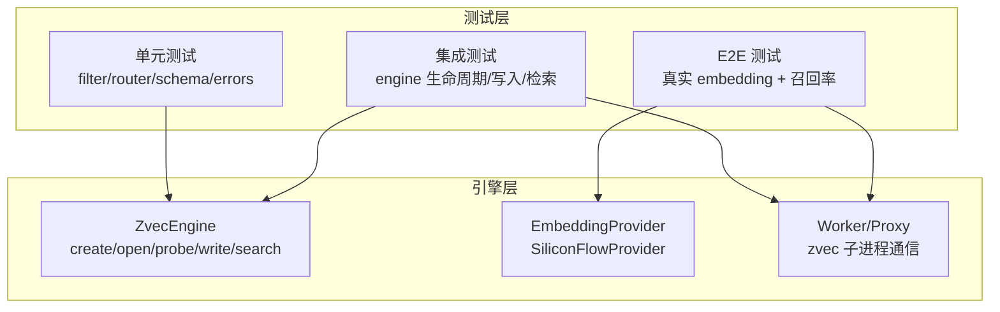
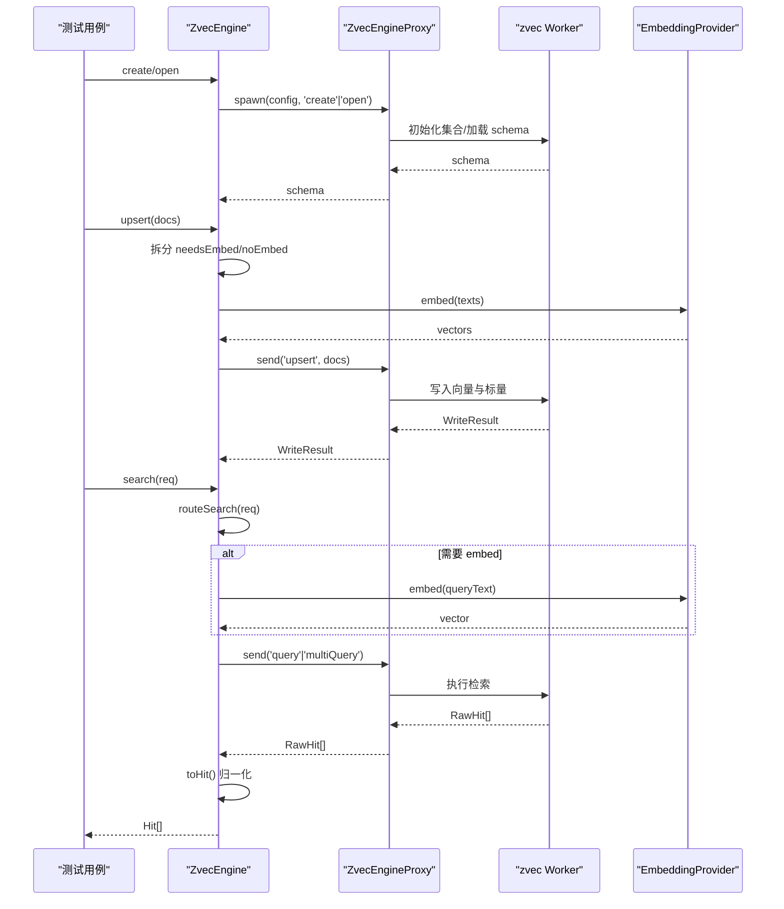
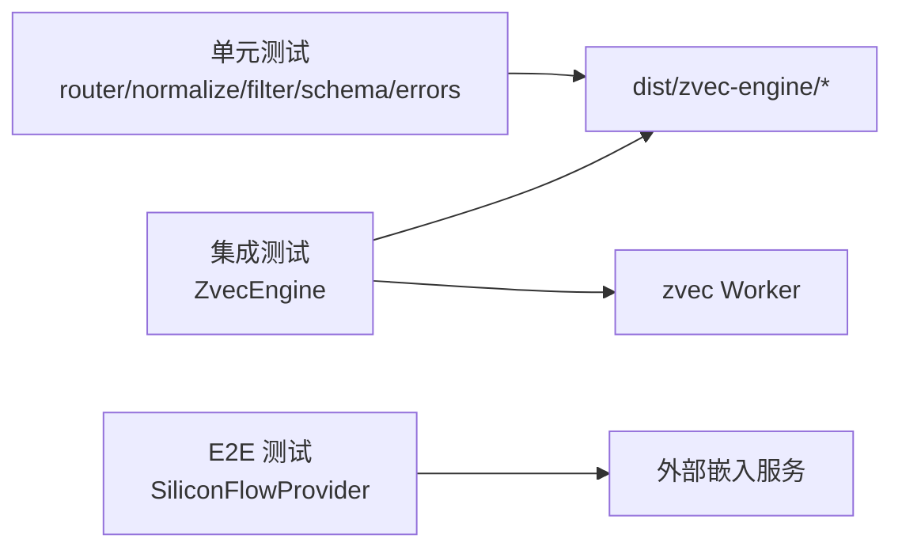

# 向量引擎测试

<cite>
**本文引用的文件**
- [engine.ts](file://src/zvec-engine/engine.ts)
- [types.ts](file://src/zvec-engine/types.ts)
- [zvec-engine.test.mjs](file://test/zvec-engine.test.mjs)
- [zvec-engine-fixtures.mjs](file://test/zvec-engine-fixtures.mjs)
- [zvec-engine-embedding.test.mjs](file://test/zvec-engine-embedding.test.mjs)
- [zvec-engine-search.test.mjs](file://test/zvec-engine-search.test.mjs)
- [zvec-engine-schema.test.mjs](file://test/zvec-engine-schema.test.mjs)
- [zvec-engine-filter.test.mjs](file://test/zvec-engine-filter.test.mjs)
- [zvec-engine-errors.test.mjs](file://test/zvec-engine-errors.test.mjs)
- [zvec-engine-e2e.network.mjs](file://test/e2e/zvec-engine-e2e.network.mjs)
- [vector-idle-race.test.ts](file://test/vector-idle-race.test.ts)
- [sync-relation-bulk-vector.test.ts](file://test/sync-relation-bulk-vector.test.ts)
- [test-config.ts](file://test/test-config.ts)
</cite>

## 目录
1. [简介](#简介)
2. [项目结构](#项目结构)
3. [核心组件](#核心组件)
4. [架构总览](#架构总览)
5. [详细组件分析](#详细组件分析)
6. [依赖关系分析](#依赖关系分析)
7. [性能与基准测试](#性能与基准测试)
8. [故障排查指南](#故障排查指南)
9. [结论](#结论)
10. [附录：测试清单与示例路径](#附录测试清单与示例路径)

## 简介
本指南面向 zvec 向量引擎的测试策略，覆盖嵌入模型测试、搜索算法测试、Schema 验证测试；系统说明测试夹具（fixtures）的使用、测试数据准备与 Mock 策略；给出性能基准、并发与错误场景测试方法；并提供具体测试示例，涵盖向量索引操作、相似度计算、过滤查询等。最后包含测试结果分析、性能指标收集与调试方法建议。

## 项目结构
zvec 引擎测试围绕“纯函数 + 集成 + 端到端”三层展开：
- 纯函数层：Filter 编译、Search 路由与分数归一化、Schema 构建/校验、异常类型体系。
- 集成层：Engine 门面（create/open/probe/upsert/search/delete/fetch）、Embedding Provider 行为。
- 端到端层：真实 embedding 网络调用、检索召回率、更新/删除一致性。

图表来源
- [engine.ts:97-199](file://src/zvec-engine/engine.ts#L97-L199)
- [zvec-engine-embedding.test.mjs:54-117](file://test/zvec-engine-embedding.test.mjs#L54-L117)
- [zvec-engine-search.test.mjs:65-170](file://test/zvec-engine-search.test.mjs#L65-L170)

章节来源
- [zvec-engine.test.mjs:1-333](file://test/zvec-engine.test.mjs#L1-L333)
- [zvec-engine-fixtures.mjs:1-66](file://test/zvec-engine-fixtures.mjs#L1-L66)
- [zvec-engine-embedding.test.mjs:1-225](file://test/zvec-engine-embedding.test.mjs#L1-L225)
- [zvec-engine-search.test.mjs:1-171](file://test/zvec-engine-search.test.mjs#L1-L171)
- [zvec-engine-schema.test.mjs:1-274](file://test/zvec-engine-schema.test.mjs#L1-L274)
- [zvec-engine-filter.test.mjs:1-102](file://test/zvec-engine-filter.test.mjs#L1-L102)
- [zvec-engine-errors.test.mjs:1-69](file://test/zvec-engine-errors.test.mjs#L1-L69)
- [zvec-engine-e2e.network.mjs:1-279](file://test/e2e/zvec-engine-e2e.network.mjs#L1-L279)

## 核心组件
- ZvecEngine 门面：负责 create/open/probe、写入 upsert/insert/update/delete、检索 semanticSearch/vectorSearch/ftsSearch/hybridSearch、索引管理 createIndex/dropIndex/optimize、生命周期 close/destroy/isOpen/isHealthy。
- EmbeddingProvider：抽象嵌入提供者，当前实现 SiliconFlowProvider，支持分批、重试、进度回调、超时、维度对齐。
- Filter 编译器：将结构化 filter 编译为 SQL-like 表达式，并基于白名单校验字段。
- Search Router：根据请求参数路由到 vector/fts/hybrid，处理互斥、topk、退化路径、rerank 配置。
- Schema 构建与校验：buildCollectionSchema/assertSchemaMatch/mapZvecOpenError，确保创建/打开时 schema 一致性与合法性。
- 异常体系：统一继承自 ZvecEngineError，携带 code/data/cause，便于序列化与分类处理。

章节来源
- [engine.ts:68-509](file://src/zvec-engine/engine.ts#L68-L509)
- [types.ts:17-187](file://src/zvec-engine/types.ts#L17-L187)
- [zvec-engine-errors.test.mjs:24-69](file://test/zvec-engine-errors.test.mjs#L24-L69)

## 架构总览
zvec 引擎通过主线程编排与 worker 子进程协作完成向量存储与检索。测试覆盖从纯函数到端到端的完整链路。

图表来源
- [engine.ts:97-199](file://src/zvec-engine/engine.ts#L97-L199)
- [engine.ts:243-495](file://src/zvec-engine/engine.ts#L243-L495)
- [zvec-engine-search.test.mjs:65-170](file://test/zvec-engine-search.test.mjs#L65-L170)

## 详细组件分析

### 嵌入模型测试（SiliconFlowProvider）
- 目标：验证配置校验、分批嵌入、重试退避、超时、响应维度/长度校验、乱序对齐、非可重试错误。
- 关键断言：
  - 缺 apiKey → EmbeddingConfigError
  - baseURL 非 https → EmbeddingConfigError
  - dimension 非正整数 → EmbeddingConfigError
  - 正常分批 + onProgress 回调
  - 空数组不触发网络
  - 5xx 指数退避重试成功
  - 429 带 Retry-After 优先退避（含 HTTP 日期格式）
  - 4xx（非 429）不重试直接抛
  - 超时 → EmbeddingError(code=TIMEOUT) 可重试
  - 响应维度不符/数量不符 → EmbeddingError(nonRetryable)
  - 响应乱序按 index 对齐
  - 网络错误 → EmbeddingError(NETWORK) 可重试
- Mock 策略：使用自定义 fetchImpl 返回序列化的响应或抛出错误，避免真实网络。

章节来源
- [zvec-engine-embedding.test.mjs:54-217](file://test/zvec-engine-embedding.test.mjs#L54-L217)

### 搜索算法测试（Router + Normalize）
- 目标：验证 score 归一化、toHit 过滤、路由退化矩阵、互斥约束、topk 校验、文本长度限制、rerank 配置。
- 关键断言：
  - normalizeVectorScore 对 COSINE 距离 clamp [0,2] → 1/(1+d)
  - 非 COSINE 度量 → SchemaMismatchError
  - toHit 对 NaN/undefined 分数过滤
  - includeVector 控制是否返回向量
  - hybridSearch queryText + vector 同传 → InvalidSearchError
  - 三者皆缺 → InvalidSearchError
  - 无 fts 时 queryText 退化为单路 vector
  - 仅 fts 退化为单路 fts
  - ftsSearch/hybrid 在无 fts 配置时 → InvalidSearchError
  - vector 维度不符 → InvalidSearchError
  - topk 非正整数/超上限 → InvalidSearchError；默认 topk=10
  - queryText 空串/超长 → InvalidSearchError
  - weighted rerank 缺 weights → InvalidSearchError；带 weights 正常路由
  - rrf 自定义 rankConstant
  - 直接 vector 检索（VectorSearchReq）
- 无需 worker/zvec，纯函数测试。

章节来源
- [zvec-engine-search.test.mjs:19-170](file://test/zvec-engine-search.test.mjs#L19-L170)

### Schema 验证测试
- 目标：验证 create/open 的 schema 构建与匹配、持久化 schema 一致性、非法集合名/路径、FTS 配置校验。
- 关键断言：
  - mapZvecOpenError 将底层错误映射为 CollectionLockedException/NotFoundError/CorruptedException
  - assertSchemaMatch 校验 dimension/metric/scalarFields/fts 一致性
  - buildCollectionSchema 支持 FP16/FP32、indexed 字段生成 INVERT 索引、非 COSINE metric 拒绝
  - create 正常建库 + info；metric 非 COSINE 拒绝；集合名非法字符拒绝；denseField 与标量重名拒绝；标量字段重复拒绝；fts.field 非 STRING 拒绝；fts.tokenizer 缺失拒绝；dbPath 已存在拒绝；相对路径/含 ".." 拒绝
  - open 维度不符 → DimensionMismatchError；schemaAssert 不符 → SchemaMismatchError；完全匹配 → 成功

章节来源
- [zvec-engine-schema.test.mjs:27-274](file://test/zvec-engine-schema.test.mjs#L27-L274)

### Filter 编译器测试
- 目标：验证白名单拒绝未声明字段、SQL 注入防护（单引号转义）、反斜杠转义、and/or/not 嵌套、深度限制、空 and/or、非法值、操作符变体、布尔渲染、数字原样输出、fts.field 加入白名单。
- 关键断言：
  - 未知字段 → InvalidFilterError
  - 字符串值单引号转义防注入
  - 反斜杠翻倍
  - and/or 嵌套编译正确
  - 嵌套过深 → InvalidFilterError
  - 空 and/or → InvalidFilterError
  - null/undefined/NaN/Infinity 值 → InvalidFilterError
  - op 变体 ==→=、!=、>、<、>=、<=
  - boolean true/false 渲染
  - not 子句
  - 数字原样输出
  - buildAllowedFields 包含 fts.field

章节来源
- [zvec-engine-filter.test.mjs:12-102](file://test/zvec-engine-filter.test.mjs#L12-L102)

### 异常类型体系测试
- 目标：所有导出异常均继承 ZvecEngineError，携带 code/data/cause；ERROR_CONSTRUCTORS 反序列化覆盖。
- 关键断言：
  - 每个异常 instanceof ZvecEngineError
  - 构造器携带 code/data/cause
  - 默认 code/data 为 undefined
  - ERROR_CONSTRUCTORS 包含全部异常类型

章节来源
- [zvec-engine-errors.test.mjs:24-69](file://test/zvec-engine-errors.test.mjs#L24-L69)

### 引擎冒烟测试（生命周期与全链路）
- 目标：create 校验、filter 编译、全链路 create→upsert→四类检索→close→reopen→probe、probe 状态（NOT_FOUND/健康/locked）、open/tryOpen 行为、update 一致性保护、部分 embedding 失败粒度、预计算 vector 不受影响。
- 关键断言：
  - create 维度不符 → DimensionMismatchError；集合名过短/前导下划线 → InvalidSchemaError；fts.field 未声明 → InvalidSchemaError
  - listIds 带 filter 拒绝未声明字段
  - upsert 后 vectorSearch/semanticSearch/ftsSearch/hybridSearch 结果正确
  - hybridSearch queryText + vector 同传 → 互斥错误
  - listIds 过滤 tag=A 得到预期 id 列表
  - fetch 取回文档；delete 删除；info 信息正确
  - close 后 isOpen=false；reopen 后 docCount 保持
  - probe 不存在/空目录/健康/被持锁 状态正确
  - open 不存在 → CollectionNotFoundError；tryOpen 失败返回 null
  - update 仅 vector 且配 FTS → InconsistentUpdateError
  - upsert 部分 embedding 失败 → errors 中 EMBEDDING_FAILED；预计算 vector 不受影响

章节来源
- [zvec-engine.test.mjs:66-333](file://test/zvec-engine.test.mjs#L66-L333)

### 端到端测试（真实 embedding）
- 目标：真实 SiliconFlowProvider 建库、批量 upsert、语义检索自命中、不相关查询得分对比、fts 精确召回、hybrid 双路融合、Recall@5 ≥ 90%、fetch 字段、update(text) 重嵌、update(仅 fields) 抛错、delete 计数同步。
- 关键断言：
  - info 维度/度量/fts 配置正确
  - upsert 全部成功，docCount 等于语料数
  - 自检索 top1 命中自己，score≈1，distance≈0
  - 不相关查询 score 明显低于自检索（相对比值断言）
  - fts(jieba) 代码符号精确召回
  - hybrid 召回包含目标文档
  - Recall@5 ≥ 90%，Recall@1 观察
  - fetch 取回字段
  - update(text) 重嵌后新文本可自检索
  - update(仅 fields) 抛 InconsistentUpdateError
  - delete 后 docCount 下降，已删除不可取回

章节来源
- [zvec-engine-e2e.network.mjs:106-279](file://test/e2e/zvec-engine-e2e.network.mjs#L106-L279)

### 并发与竞态测试（idle close 与在途操作）
- 目标：验证 idle close 不会中断在途 embedding 操作，避免 worker 关闭导致后续 proxy.send 失败。
- 关键点：
  - 使用真实 engine + 真实 embedding，设置 idle 窗口小于 embedding 耗时
  - 验证 withEngine 包装的 _inFlightOps 计数与 idle 判定逻辑
  - 需 SILICONFLOW_API_KEY；无 key 时跳过

章节来源
- [vector-idle-race.test.ts:1-25](file://test/vector-idle-race.test.ts#L1-L25)

### 向量化路径集成测试（批量同步）
- 目标：mock 向量层，覆盖全成功/部分失败/重复 relation/向量服务不可用/hints 透出等场景。
- 关键点：
  - 先 import vector-client 模块再 patch 导出函数（ESM live binding）
  - 验证旧向量清理、顶层 vectorStored 语义、逐条 vectorStored 语义

章节来源
- [sync-relation-bulk-vector.test.ts:1-34](file://test/sync-relation-bulk-vector.test.ts#L1-L34)

## 依赖关系分析
- 测试与源码依赖：
  - 单元测试依赖 dist/zvec-engine 下的 router/normalize/filter/compiler/schema/builder/errors 等模块。
  - 集成测试依赖 ZvecEngine 门面与 types 定义。
  - E2E 测试依赖 SiliconFlowProvider 与真实网络。
- 外部依赖：
  - zvec worker（RocksDB/HNSW 等）通过 proxy 通信。
  - 嵌入服务（SiliconFlow OpenAI 兼容端点）。

图表来源
- [zvec-engine-search.test.mjs:8-12](file://test/zvec-engine-search.test.mjs#L8-L12)
- [zvec-engine-embedding.test.mjs:7-10](file://test/zvec-engine-embedding.test.mjs#L7-L10)
- [zvec-engine.test.mjs:19-25](file://test/zvec-engine.test.mjs#L19-L25)

章节来源
- [zvec-engine-search.test.mjs:8-12](file://test/zvec-engine-search.test.mjs#L8-L12)
- [zvec-engine-embedding.test.mjs:7-10](file://test/zvec-engine-embedding.test.mjs#L7-L10)
- [zvec-engine.test.mjs:19-25](file://test/zvec-engine.test.mjs#L19-L25)

## 性能与基准测试
- 现有测试中的性能相关点：
  - 嵌入小批大小：EMBED_BATCH_SIZE=64，与 provider 默认 batchSize 对齐，使失败粒度恰好对应一次 HTTP 调用。
  - 写入批次：DEFAULT_WRITE_BATCH_SIZE=100。
  - E2E 测试包含 Recall@5 ≥ 90% 的召回率验收，可作为质量基线。
- 建议的基准测试方法：
  - 使用固定规模数据集（如 1k/10k/100k 文档），测量 upsert 吞吐（docs/s）、search P95/P99 延迟、hybrid 融合耗时。
  - 记录 CPU/内存占用、worker 子进程资源消耗。
  - 对比不同 topk、rerank 策略（rrf vs weighted）、includeVector 开关对性能的影响。
  - 使用 node:test 的计时 API 或外部工具（如 autocannon/wrk 针对 HTTP 暴露的接口）采集指标。
- 指标收集建议：
  - 在测试中打印关键指标（ok/failed/errors、docCount、score、recall）。
  - 将结果输出到 JSON/CSV，便于回归对比。
  - 结合 CI 环境固定硬件与网络条件，减少噪声。

[本节为通用指导，不直接分析具体文件]

## 故障排查指南
- 常见错误与定位：
  - 维度不匹配：DimensionMismatchError，检查 collection.dimension 与输入 vector/text 经 embed 后的维度。
  - Schema 不一致：SchemaMismatchError，检查 open 的 schemaAssert 与持久化 schema。
  - 非法搜索参数：InvalidSearchError，检查 queryText/vector/fts/topk 互斥与边界。
  - 非法过滤器：InvalidFilterError，检查字段白名单与值合法性。
  - 更新不一致：InconsistentUpdateError，当集合配置 FTS 时，仅传 vector 不传 text 会破坏 FTS 一致性。
  - 集合状态：probe 返回 NOT_FOUND/locked/CORRUPTED/UNKNOWN，用于自愈与降级。
- 调试技巧：
  - 使用 includeVector=true 获取原始向量辅助诊断。
  - 通过 info() 查看集合元数据（dimension/metric/fts/tokenizer/docCount）。
  - 在 E2E 中打印 selfScore 与不相关 ratio，快速判断模型质量。
  - 对于 worker 相关问题，关注 probe 超时与 locked 状态，避免进程泄漏。

章节来源
- [zvec-engine.test.mjs:66-333](file://test/zvec-engine.test.mjs#L66-L333)
- [zvec-engine-schema.test.mjs:27-274](file://test/zvec-engine-schema.test.mjs#L27-L274)
- [zvec-engine-search.test.mjs:65-170](file://test/zvec-engine-search.test.mjs#L65-L170)
- [zvec-engine-filter.test.mjs:12-102](file://test/zvec-engine-filter.test.mjs#L12-L102)
- [zvec-engine-errors.test.mjs:24-69](file://test/zvec-engine-errors.test.mjs#L24-L69)

## 结论
zvec 引擎测试采用分层策略，覆盖从纯函数到端到端的完整链路。通过 fixtures 与 mock 策略，保证测试稳定可重复；通过 E2E 召回率与自检索得分，保障模型与检索质量；通过异常体系与 probe 机制，提升健壮性与自愈能力。建议在新增功能时遵循现有模式：优先补充纯函数单测，再扩展集成/E2E 用例，并持续完善性能基准与故障排查指引。

[本节为总结，不直接分析具体文件]

## 附录：测试清单与示例路径
- 嵌入模型测试
  - 配置校验、分批、重试、超时、维度/长度校验、乱序对齐、非可重试错误
  - 示例路径：[zvec-engine-embedding.test.mjs:54-217](file://test/zvec-engine-embedding.test.mjs#L54-L217)
- 搜索算法测试
  - score 归一化、toHit、路由退化、互斥、topk、文本长度、rerank
  - 示例路径：[zvec-engine-search.test.mjs:19-170](file://test/zvec-engine-search.test.mjs#L19-L170)
- Schema 验证测试
  - create/open 校验、持久化 schema 匹配、非法集合名/路径、FTS 配置
  - 示例路径：[zvec-engine-schema.test.mjs:27-274](file://test/zvec-engine-schema.test.mjs#L27-L274)
- Filter 编译器测试
  - 白名单、转义、嵌套、深度限制、非法值、操作符变体、布尔/数字渲染
  - 示例路径：[zvec-engine-filter.test.mjs:12-102](file://test/zvec-engine-filter.test.mjs#L12-L102)
- 异常类型体系测试
  - 继承关系、code/data/cause、反序列化覆盖
  - 示例路径：[zvec-engine-errors.test.mjs:24-69](file://test/zvec-engine-errors.test.mjs#L24-L69)
- 引擎冒烟测试
  - 生命周期、全链路、probe 状态、update 一致性、部分失败粒度
  - 示例路径：[zvec-engine.test.mjs:66-333](file://test/zvec-engine.test.mjs#L66-L333)
- 端到端测试
  - 真实 embedding、召回率、更新/删除一致性
  - 示例路径：[zvec-engine-e2e.network.mjs:106-279](file://test/e2e/zvec-engine-e2e.network.mjs#L106-L279)
- 并发与竞态测试
  - idle close 与在途操作竞态
  - 示例路径：[vector-idle-race.test.ts:1-25](file://test/vector-idle-race.test.ts#L1-L25)
- 向量化路径集成测试
  - mock 向量层、批量同步场景
  - 示例路径：[sync-relation-bulk-vector.test.ts:1-34](file://test/sync-relation-bulk-vector.test.ts#L1-L34)
- 测试配置与夹具
  - 临时配置、scope 注册、环境变量隔离
  - 示例路径：[test-config.ts:24-47](file://test/test-config.ts#L24-L47)
  - 共享 fixtures：DIM/hashVector/mockEmbedding/makeConfig/makeDbPath
  - 示例路径：[zvec-engine-fixtures.mjs:11-65](file://test/zvec-engine-fixtures.mjs#L11-L65)