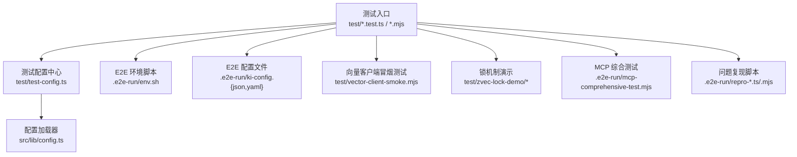
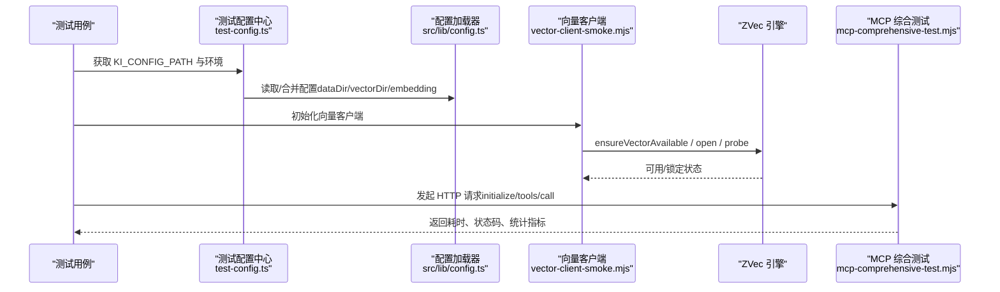
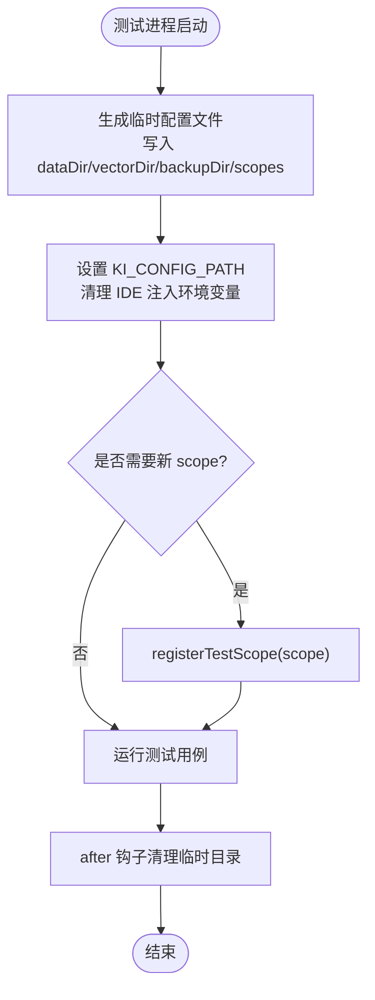
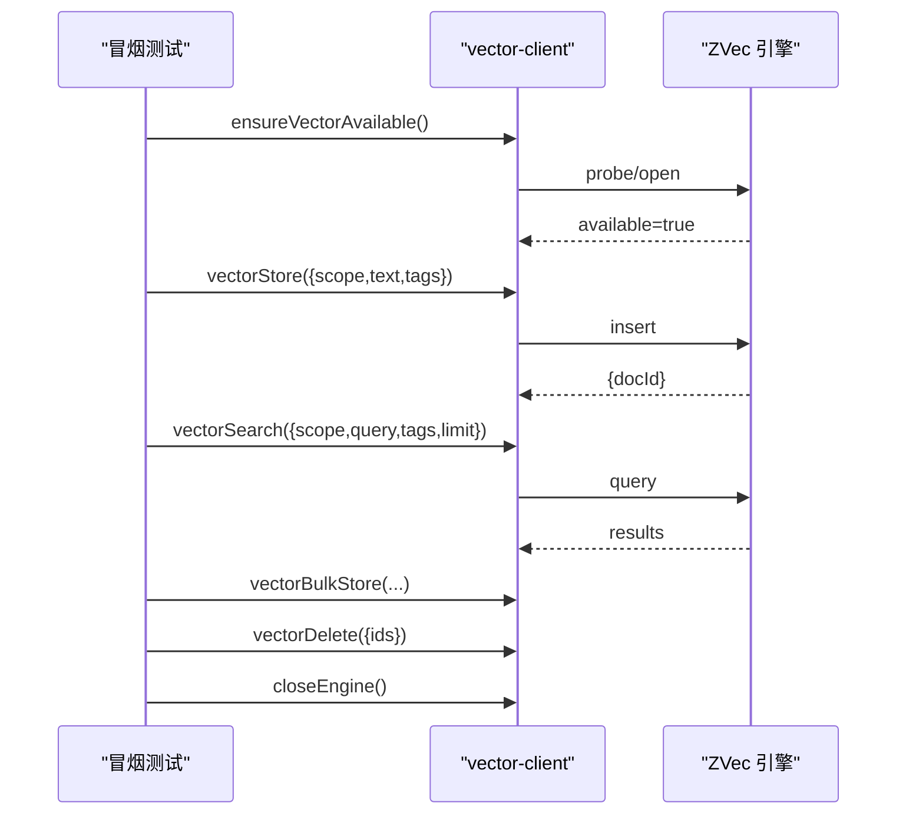
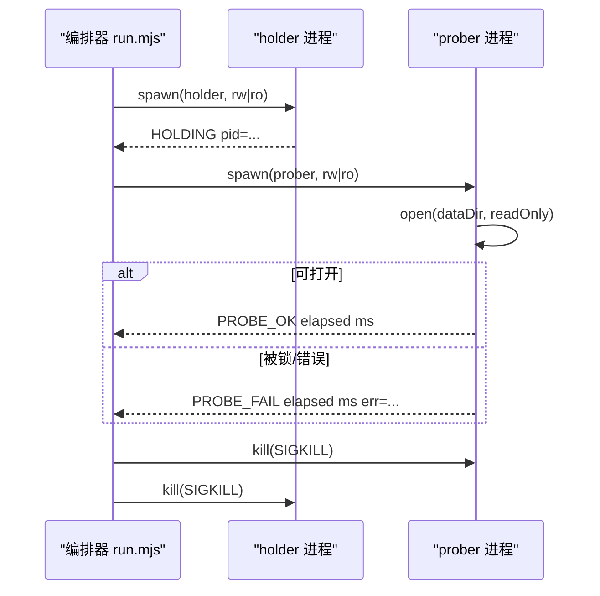
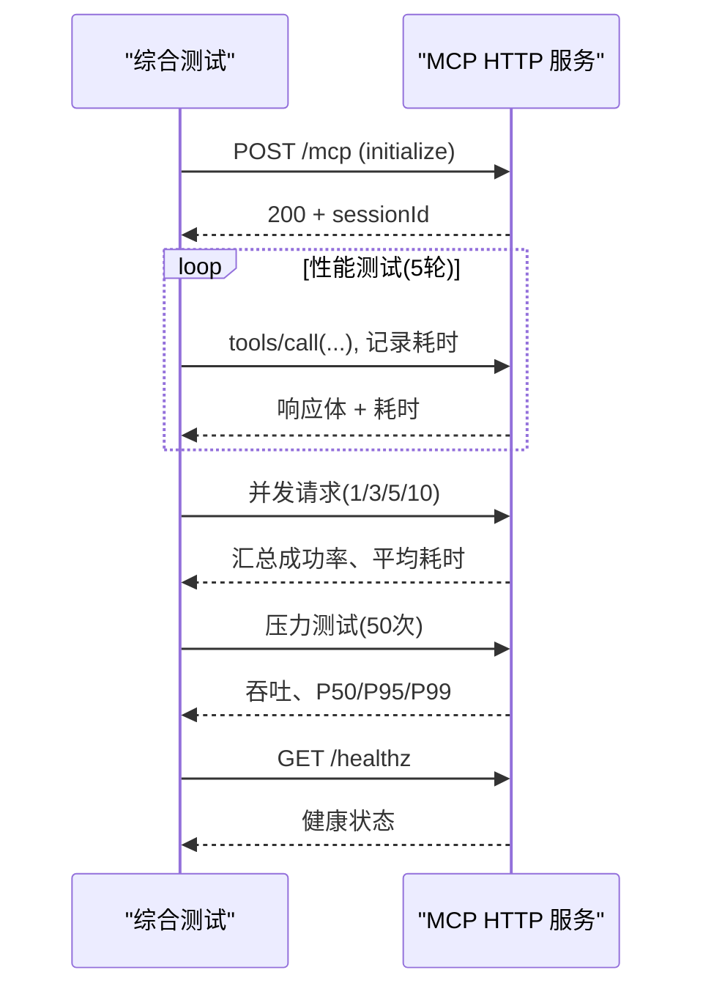
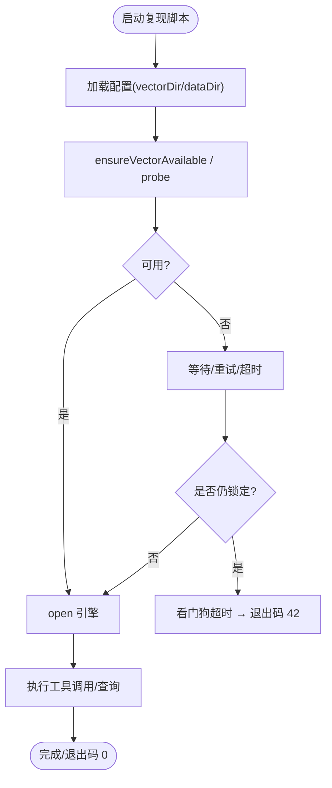
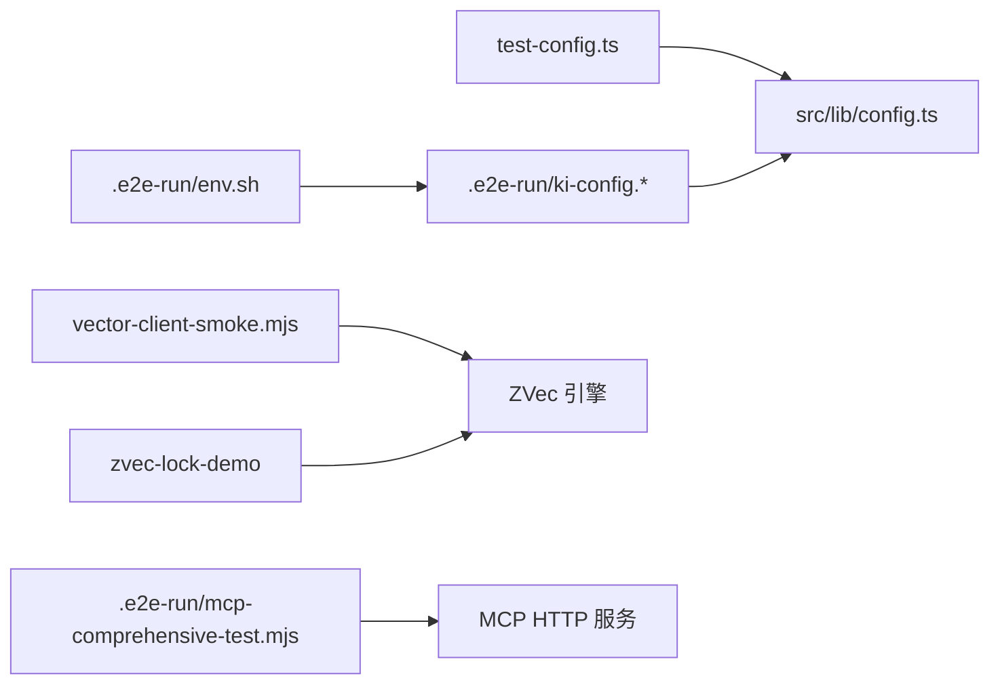

# 测试工具与辅助

<cite>
**本文引用的文件**
- [test-config.ts](file://test/test-config.ts)
- [env.sh](file://.e2e-run/env.sh)
- [ki-config.json](file://.e2e-run/ki-config.json)
- [ki-config.yaml](file://.e2e-run/ki-config.yaml)
- [vector-client-smoke.mjs](file://test/vector-client-smoke.mjs)
- [run.mjs](file://test/zvec-lock-demo/run.mjs)
- [worker.mjs](file://test/zvec-lock-demo/worker.mjs)
- [mcp-comprehensive-test.mjs](file://.e2e-run/mcp-comprehensive-test.mjs)
- [repro-hang.mjs](file://.e2e-run/repro-hang.mjs)
- [repro-vc.ts](file://.e2e-run/repro-vc.ts)
- [repro-vc-config.yaml](file://.e2e-run/repro-vc-config.yaml)
- [integration.test.ts](file://test/integration.test.ts)
- [config.ts](file://src/lib/config.ts)
</cite>

## 目录
1. [简介](#简介)
2. [项目结构](#项目结构)
3. [核心组件](#核心组件)
4. [架构总览](#架构总览)
5. [详细组件分析](#详细组件分析)
6. [依赖关系分析](#依赖关系分析)
7. [性能考量](#性能考量)
8. [故障排查指南](#故障排查指南)
9. [结论](#结论)
10. [附录](#附录)

## 简介
本文件面向“测试工具与辅助”能力，系统化说明仓库中的测试配置、端到端脚本、向量客户端冒烟测试、锁机制演示、MCP 服务综合测试等。目标是帮助读者快速理解：
- 如何准备隔离的测试环境（数据目录、向量库、备份目录、嵌入模型）；
- 如何使用现有工具进行快速验证、问题复现和性能评估；
- 如何基于现有模式创建自定义测试工具并遵循最佳实践。

## 项目结构
测试相关资产主要分布在以下位置：
- test：单元测试、集成测试、向量客户端冒烟测试、锁机制演示等；
- .e2e-run：端到端运行环境、E2E 配置、MCP 综合测试、问题复现脚本；
- src/lib/config.ts：配置加载与默认值解析（含 vectorDir、embedding 等）。

图表来源
- [test-config.ts:1-92](file://test/test-config.ts#L1-L92)
- [env.sh:1-7](file://.e2e-run/env.sh#L1-L7)
- [ki-config.json:1-17](file://.e2e-run/ki-config.json#L1-L17)
- [ki-config.yaml:1-18](file://.e2e-run/ki-config.yaml#L1-L18)
- [vector-client-smoke.mjs:1-95](file://test/vector-client-smoke.mjs#L1-L95)
- [run.mjs:1-78](file://test/zvec-lock-demo/run.mjs#L1-L78)
- [worker.mjs:1-39](file://test/zvec-lock-demo/worker.mjs#L1-L39)
- [mcp-comprehensive-test.mjs:1-317](file://.e2e-run/mcp-comprehensive-test.mjs#L1-L317)
- [config.ts:280-308](file://src/lib/config.ts#L280-L308)

章节来源
- [test-config.ts:1-92](file://test/test-config.ts#L1-L92)
- [env.sh:1-7](file://.e2e-run/env.sh#L1-L7)
- [ki-config.json:1-17](file://.e2e-run/ki-config.json#L1-L17)
- [ki-config.yaml:1-18](file://.e2e-run/ki-config.yaml#L1-L18)
- [config.ts:280-308](file://src/lib/config.ts#L280-L308)

## 核心组件
- 测试配置中心（test/test-config.ts）
  - 为每个测试进程生成临时配置文件，隔离 dataDir、vectorDir、backupDir；
  - 动态注册 scope，避免 ensureScopeDir 校验失败；
  - 提供 getTestEnv() 剥离 IDE 注入的环境变量，确保子进程行为一致；
  - 支持可选 embedding 配置（通过环境变量注入密钥，不写死到配置中）。
- E2E 环境与配置（.e2e-run）
  - env.sh：设置 Node 版本、API Key、指向 ki-config；
  - ki-config.json / ki-config.yaml：定义 dataDir、backupDir、vectorDir、embedding、scopeMode 与 scopes；
  - repro-vc-config.yaml：针对特定复现场景的隔离配置（如 vectorDir 指向 /tmp）。
- 向量客户端冒烟测试（test/vector-client-smoke.mjs）
  - 单进程闭环验证 vectorStore/vectorSearch/vectorBulkStore/vectorDelete/ensureVectorAvailable/closeEngine；
  - 验证 scope 隔离、tag 大小写规范化、幂等 upsert、删除后不可检索等关键路径。
- 锁机制演示（test/zvec-lock-demo）
  - run.mjs：编排 holder/prober 四种组合场景，判定跨进程锁行为；
  - worker.mjs：以只读或读写模式打开集合，输出探测结果。
- MCP 综合测试（.e2e-run/mcp-comprehensive-test.mjs）
  - 覆盖 initialize、tools/list、tools/call、并发、压力、healthz；
  - 统计平均、P95/P99、吞吐等指标，便于回归对比。
- 问题复现脚本（.e2e-run/repro-*.ts/.mjs）
  - repro-hang.mjs：模拟首轮并行双工具调用导致的 probe/open 竞态；
  - repro-vc.ts：走 vector-client 真实链路，验证串行化与超时修复后的自愈。

章节来源
- [test-config.ts:1-92](file://test/test-config.ts#L1-L92)
- [env.sh:1-7](file://.e2e-run/env.sh#L1-L7)
- [ki-config.json:1-17](file://.e2e-run/ki-config.json#L1-L17)
- [ki-config.yaml:1-18](file://.e2e-run/ki-config.yaml#L1-L18)
- [vector-client-smoke.mjs:1-95](file://test/vector-client-smoke.mjs#L1-L95)
- [run.mjs:1-78](file://test/zvec-lock-demo/run.mjs#L1-L78)
- [worker.mjs:1-39](file://test/zvec-lock-demo/worker.mjs#L1-L39)
- [mcp-comprehensive-test.mjs:1-317](file://.e2e-run/mcp-comprehensive-test.mjs#L1-L317)
- [repro-hang.mjs:1-55](file://.e2e-run/repro-hang.mjs#L1-L55)
- [repro-vc.ts:1-45](file://.e2e-run/repro-vc.ts#L1-L45)
- [repro-vc-config.yaml:1-15](file://.e2e-run/repro-vc-config.yaml#L1-L15)

## 架构总览
测试工具围绕“隔离配置 + 可重复执行 + 指标采集”展开：
- 配置层：通过 test-config.ts 与 .e2e-run/* 配置，将数据、向量库、备份、嵌入模型全部隔离到临时或专用目录；
- 执行层：按功能域拆分为冒烟测试、锁演示、MCP 综合测试、问题复现脚本；
- 观测层：统一打印耗时、成功率、吞吐、分位点，便于回归与对比。

图表来源
- [test-config.ts:1-92](file://test/test-config.ts#L1-L92)
- [config.ts:280-308](file://src/lib/config.ts#L280-L308)
- [vector-client-smoke.mjs:1-95](file://test/vector-client-smoke.mjs#L1-L95)
- [mcp-comprehensive-test.mjs:1-317](file://.e2e-run/mcp-comprehensive-test.mjs#L1-L317)

## 详细组件分析

### 测试配置中心（test/test-config.ts）
- 作用
  - 为每个测试进程创建临时配置文件，隔离 dataDir、vectorDir、backupDir；
  - 动态注册 scope，避免 ensureScopeDir 校验失败；
  - 提供 getTestEnv() 剥离 IDE 注入的环境变量，确保子进程行为一致；
  - 支持可选 embedding 配置（从环境变量注入密钥，未注入时向量化用例跳过）。
- 使用方式
  - 在测试套件中引入 registerTestScope/getTestEnv/cleanupTestConfig；
  - 通过 KI_CONFIG_PATH 指向生成的临时配置文件；
  - 需要向量化能力时，注入 SILICONFLOW_API_KEY/GITNEXUS_EMBEDDING_API_KEY。

图表来源
- [test-config.ts:1-92](file://test/test-config.ts#L1-L92)

章节来源
- [test-config.ts:1-92](file://test/test-config.ts#L1-L92)

### E2E 环境与配置（.e2e-run）
- env.sh
  - 设置 Node 版本、SILICONFLOW_API_KEY、KI_CFG 指向 YAML 配置；
  - 切换工作目录至仓库根。
- ki-config.json / ki-config.yaml
  - 定义 dataDir、backupDir、vectorDir、embedding、scopeMode、scopes；
  - JSON/YAML 两种格式，字段一一对应，便于不同场景切换。
- repro-vc-config.yaml
  - 针对复现场景的隔离配置，vectorDir 指向 /tmp 下的副本，便于带 LOCK 的回归验证。

章节来源
- [env.sh:1-7](file://.e2e-run/env.sh#L1-L7)
- [ki-config.json:1-17](file://.e2e-run/ki-config.json#L1-L17)
- [ki-config.yaml:1-18](file://.e2e-run/ki-config.yaml#L1-L18)
- [repro-vc-config.yaml:1-15](file://.e2e-run/repro-vc-config.yaml#L1-L15)

### 向量客户端冒烟测试（test/vector-client-smoke.mjs）
- 目标
  - 单进程跑完所有断言，避免反复冷启动；
  - 验证 ensureVectorAvailable、vectorStore、vectorSearch、vectorBulkStore、vectorDelete、closeEngine 等关键路径。
- 关键断言
  - 全新 dbPath 可用；
  - 写入返回 docId（sha256 截32）；
  - tag 大写写入被小写规范化；
  - 语义召回 top1 命中；
  - tag 查询大小写不敏感；
  - scope 隔离（B 查不到 A 的文档）；
  - 不传 tags 搜索全部 tag；
  - 批量写入成功计数；
  - 幂等 upsert（同 text+scope 重复写入不报错且同 id）；
  - 删除后可搜不到。
- 运行方式
  - node test/vector-client-smoke.mjs

图表来源
- [vector-client-smoke.mjs:1-95](file://test/vector-client-smoke.mjs#L1-L95)

章节来源
- [vector-client-smoke.mjs:1-95](file://test/vector-client-smoke.mjs#L1-L95)

### 锁机制演示（test/zvec-lock-demo）
- 目标
  - 验证跨进程锁行为：常驻 holder 持锁，CLI prober 探测读写；
  - 覆盖四种组合：holder(rw)+prober(ro)、holder(rw)+prober(rw)、holder(ro)+prober(ro)、holder(ro)+prober(rw)。
- 运行方式
  - node test/zvec-lock-demo/run.mjs
- 输出解读
  - PROBE_OK/PROBE_FAIL 表示探测是否成功及耗时；
  - 若长时间无输出，可能处于阻塞等待锁释放。

图表来源
- [run.mjs:1-78](file://test/zvec-lock-demo/run.mjs#L1-L78)
- [worker.mjs:1-39](file://test/zvec-lock-demo/worker.mjs#L1-L39)

章节来源
- [run.mjs:1-78](file://test/zvec-lock-demo/run.mjs#L1-L78)
- [worker.mjs:1-39](file://test/zvec-lock-demo/worker.mjs#L1-L39)

### MCP 综合测试（.e2e-run/mcp-comprehensive-test.mjs）
- 目标
  - 基本功能：initialize、tools/list、tools/call；
  - 性能：多次测量取平均、最小、最大、P95；
  - 并发：多客户端独立 session 同时调用；
  - 压力：连续高频请求统计吞吐与分位点；
  - healthz：服务健康检查。
- 运行方式
  - 需先启动 MCP HTTP 服务，并确保 /root/.ki/mcp-token 存在；
  - node .e2e-run/mcp-comprehensive-test.mjs

图表来源
- [mcp-comprehensive-test.mjs:1-317](file://.e2e-run/mcp-comprehensive-test.mjs#L1-L317)

章节来源
- [mcp-comprehensive-test.mjs:1-317](file://.e2e-run/mcp-comprehensive-test.mjs#L1-L317)

### 问题复现脚本（.e2e-run/repro-*.ts/.mjs）
- repro-hang.mjs
  - 模拟首轮并行双工具调用导致 probe/open 竞态，看门狗 25s 判定是否永久挂起；
  - 用于定位 getEngine 单例与 ensureVectorAvailable 的并发问题。
- repro-vc.ts
  - 走 vector-client 真实链路，验证串行化与超时修复后的自愈；
  - 覆盖 P0（首轮并行不再永久挂死）与 P1（后续多次 ensureVectorAvailable 不被自家 LOCK 挡住）。
- repro-vc-config.yaml
  - 指定 vectorDir 指向 /tmp 下的副本，便于带 LOCK 的回归验证。

图表来源
- [repro-hang.mjs:1-55](file://.e2e-run/repro-hang.mjs#L1-L55)
- [repro-vc.ts:1-45](file://.e2e-run/repro-vc.ts#L1-L45)
- [repro-vc-config.yaml:1-15](file://.e2e-run/repro-vc-config.yaml#L1-L15)

章节来源
- [repro-hang.mjs:1-55](file://.e2e-run/repro-hang.mjs#L1-L55)
- [repro-vc.ts:1-45](file://.e2e-run/repro-vc.ts#L1-L45)
- [repro-vc-config.yaml:1-15](file://.e2e-run/repro-vc-config.yaml#L1-L15)

### 集成测试（test/integration.test.ts）
- 目标
  - 快速路径：manage-index → sync-relation → query-group → get-module-info；
  - 检索回退路径：查询不存在的 Group/Relation；
  - 知识缺失路径：本地 KB 缺失；
  - 导入路径：scan-kb import --source 直导（full/incremental）。
- 使用方式
  - npx jiti test/integration.test.ts；
  - 自动使用 test-config.ts 提供的隔离配置与临时目录。

章节来源
- [integration.test.ts:1-200](file://test/integration.test.ts#L1-L200)

## 依赖关系分析
- 配置依赖
  - test-config.ts 通过 KI_CONFIG_PATH 指向临时配置文件；
  - src/lib/config.ts 负责解析 dataDir、backupDir、vectorDir、embedding，并提供默认值；
  - .e2e-run/ki-config.* 提供 E2E 隔离配置，env.sh 设置运行时环境变量。
- 运行时依赖
  - vector-client-smoke.mjs 依赖 vector-client 模块与 ZVec 引擎；
  - zvec-lock-demo 依赖 @zvec/zvec 原生绑定；
  - mcp-comprehensive-test.mjs 依赖已启动的 MCP HTTP 服务与 token。
- 潜在耦合
  - 多个测试共享同一 KI_CONFIG_PATH，需确保进程级隔离；
  - 向量库目录需隔离以避免 LOCK 冲突。

图表来源
- [test-config.ts:1-92](file://test/test-config.ts#L1-L92)
- [config.ts:280-308](file://src/lib/config.ts#L280-L308)
- [env.sh:1-7](file://.e2e-run/env.sh#L1-L7)
- [ki-config.json:1-17](file://.e2e-run/ki-config.json#L1-L17)
- [ki-config.yaml:1-18](file://.e2e-run/ki-config.yaml#L1-L18)
- [vector-client-smoke.mjs:1-95](file://test/vector-client-smoke.mjs#L1-L95)
- [run.mjs:1-78](file://test/zvec-lock-demo/run.mjs#L1-L78)
- [mcp-comprehensive-test.mjs:1-317](file://.e2e-run/mcp-comprehensive-test.mjs#L1-L317)

章节来源
- [test-config.ts:1-92](file://test/test-config.ts#L1-L92)
- [config.ts:280-308](file://src/lib/config.ts#L280-L308)
- [env.sh:1-7](file://.e2e-run/env.sh#L1-L7)
- [ki-config.json:1-17](file://.e2e-run/ki-config.json#L1-L17)
- [ki-config.yaml:1-18](file://.e2e-run/ki-config.yaml#L1-L18)
- [vector-client-smoke.mjs:1-95](file://test/vector-client-smoke.mjs#L1-L95)
- [run.mjs:1-78](file://test/zvec-lock-demo/run.mjs#L1-L78)
- [mcp-comprehensive-test.mjs:1-317](file://.e2e-run/mcp-comprehensive-test.mjs#L1-L317)

## 性能考量
- 向量客户端冒烟测试
  - 单进程闭环减少冷启动开销；
  - 关注 tag 大小写规范化与 scope 隔离对性能的影响。
- MCP 综合测试
  - 性能测试采用 5 轮采样，统计平均、最小、最大、P95；
  - 并发测试覆盖 1/3/5/10 并发度，观察成功率与平均耗时；
  - 压力测试统计吞吐与 P50/P95/P99，便于回归对比。
- 锁机制演示
  - 通过 PROBE_OK/PROBE_FAIL 耗时判断锁竞争程度；
  - 长时阻塞提示可能存在锁持有时间过长或释放不及时。

[本节为通用指导，不直接分析具体文件]

## 故障排查指南
- 常见问题
  - 向量库锁定：使用 zvec-lock-demo 复现并观察 PROBE_ 输出；
  - 首轮并行挂起：使用 repro-hang.mjs 与 repro-vc.ts 验证串行化与超时修复；
  - MCP 鉴权失败：检查 /root/.ki/mcp-token 与 Authorization 头；
  - 配置路径错误：确认 KI_CONFIG_PATH 指向正确的临时或 E2E 配置文件。
- 建议步骤
  - 优先运行 vector-client-smoke.mjs 验证向量链路；
  - 再运行 mcp-comprehensive-test.mjs 验证 MCP 服务；
  - 若出现锁问题，运行 zvec-lock-demo 定位 holder/prober 组合；
  - 使用 repro-* 脚本复现已知问题，结合日志与退出码判断。

章节来源
- [vector-client-smoke.mjs:1-95](file://test/vector-client-smoke.mjs#L1-L95)
- [mcp-comprehensive-test.mjs:1-317](file://.e2e-run/mcp-comprehensive-test.mjs#L1-L317)
- [run.mjs:1-78](file://test/zvec-lock-demo/run.mjs#L1-L78)
- [repro-hang.mjs:1-55](file://.e2e-run/repro-hang.mjs#L1-L55)
- [repro-vc.ts:1-45](file://.e2e-run/repro-vc.ts#L1-L45)

## 结论
本仓库提供了完善的测试工具与辅助能力：
- 通过 test-config.ts 与 .e2e-run/* 实现环境隔离与可重复执行；
- 向量客户端冒烟测试覆盖核心 CRUD 与隔离性；
- 锁机制演示与问题复现脚本帮助定位并发与锁问题；
- MCP 综合测试提供功能、性能、并发、压力的完整度量；
- 建议在新功能开发中复用这些模式，保持测试的可维护性与可观测性。

[本节为总结，不直接分析具体文件]

## 附录
- 快速开始
  - 向量客户端冒烟测试：node test/vector-client-smoke.mjs
  - 锁机制演示：node test/zvec-lock-demo/run.mjs
  - MCP 综合测试：node .e2e-run/mcp-comprehensive-test.mjs（需 MCP 服务与 token）
  - 问题复现：node .e2e-run/repro-vc.ts（配合 repro-vc-config.yaml）
- 自定义测试工具最佳实践
  - 使用 test-config.ts 生成临时配置，隔离 dataDir/vectorDir/backupDir；
  - 通过 getTestEnv() 剥离 IDE 注入环境变量，确保子进程一致性；
  - 如需向量化能力，注入 SILICONFLOW_API_KEY/GITNEXUS_EMBEDDING_API_KEY；
  - 在 after 钩子中清理临时目录，避免污染；
  - 对于 MCP 测试，确保服务已启动并正确配置 token。

[本节为操作指引，不直接分析具体文件]