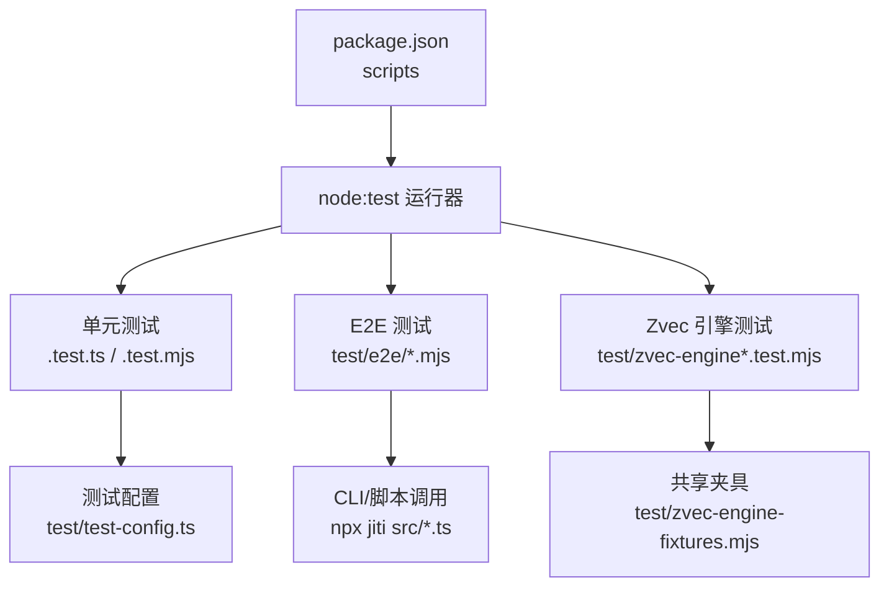
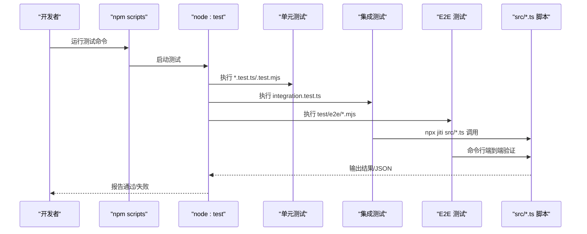
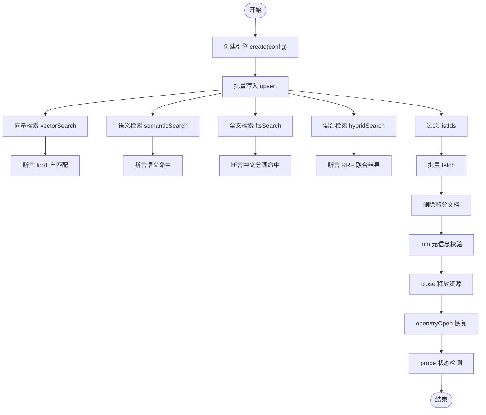
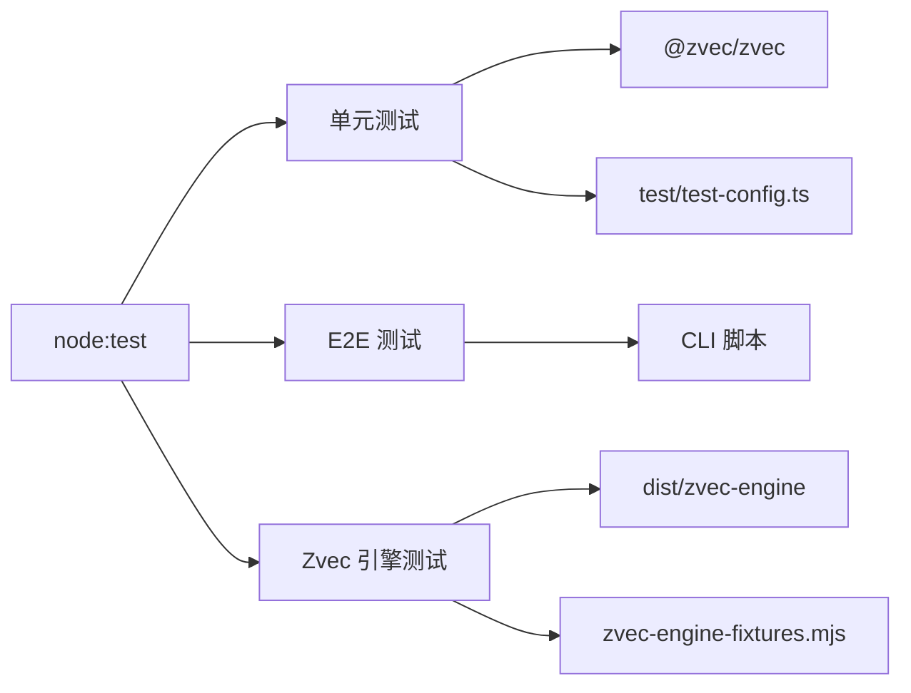

# 测试指南

<cite>
**本文引用的文件**
- [package.json](file://package.json)
- [test/e2e-guide.md](file://test/e2e-guide.md)
- [test/test-config.ts](file://test/test-config.ts)
- [test/integration.test.ts](file://test/integration.test.ts)
- [test/error-handling.test.ts](file://test/error-handling.test.ts)
- [test/zvec-engine.test.mjs](file://test/zvec-engine.test.mjs)
- [test/zvec-engine-fixtures.mjs](file://test/zvec-engine-fixtures.mjs)
- [test/zvec-engine-embedding.test.mjs](file://test/zvec-engine-embedding.test.mjs)
- [.e2e-run/mcp-comprehensive-test.mjs](file://.e2e-run/mcp-comprehensive-test.mjs)
</cite>

## 目录
1. [简介](#简介)
2. [项目结构](#项目结构)
3. [核心组件](#核心组件)
4. [架构总览](#架构总览)
5. [详细组件分析](#detailed-component-analysis)
6. [依赖分析](#依赖分析)
7. [性能考虑](#性能考虑)
8. [故障排查指南](#故障排查指南)
9. [结论](#结论)
10. [附录](#appendices)

## 简介
本指南面向 knowledge-indexer 项目的测试实践，覆盖单元测试编写规范、端到端（E2E）执行流程、zvec 引擎测试方法，以及测试数据准备、Mock 策略、异步测试处理。同时给出如何运行测试套件、查看测试结果、调试失败用例的方法，并总结性能测试与集成测试的最佳实践。

## 项目结构
仓库采用 Node.js + TypeScript 工程组织，测试代码集中在 test 目录：
- 单元测试：以 .test.ts/.test.mjs 结尾，使用 node:test 框架
- E2E 测试：位于 test/e2e，通过 node --test 执行
- zvec 引擎测试：位于 test/zvec-engine*.test.mjs，基于编译产物 dist/zvec-engine
- 测试配置与夹具：test/test-config.ts、test/zvec-engine-fixtures.mjs
- 脚本入口与命令：package.json scripts

**图表来源**
- [package.json:9-32](file://package.json#L9-L32)
- [test/test-config.ts:1-92](file://test/test-config.ts#L1-L92)
- [test/zvec-engine-fixtures.mjs:1-66](file://test/zvec-engine-fixtures.mjs#L1-L66)

**章节来源**
- [package.json:9-32](file://package.json#L9-L32)

## 核心组件
- 测试运行器与命令
  - 使用 node:test 作为测试框架，通过 package.json scripts 暴露统一入口
  - 常用命令：
    - 全部单测：npm run test:all
    - 指定模块单测：如 npm run test:integration、test:error-handling
    - Zvec 引擎测试：npm run test:zvec-engine
    - E2E 测试：npm run test:e2e:*
- 测试配置隔离
  - test/test-config.ts 为每个进程创建临时配置文件，设置 KI_CONFIG_PATH，避免污染用户环境
  - 提供 registerTestScope、getTestEnv、cleanupTestConfig 等工具函数
- 共享夹具
  - test/zvec-engine-fixtures.mjs 提供 hashVector、mockEmbedding、makeConfig、makeDbPath 等通用能力

**章节来源**
- [package.json:9-32](file://package.json#L9-L32)
- [test/test-config.ts:1-92](file://test/test-config.ts#L1-L92)
- [test/zvec-engine-fixtures.mjs:1-66](file://test/zvec-engine-fixtures.mjs#L1-L66)

## 架构总览
测试体系由三层组成：
- 单元测试层：针对具体模块/函数的行为验证，强调快速、稳定、可重复
- 集成测试层：通过 CLI/脚本串联 manage-index → sync-relation → query-group → get-module-info 等链路
- E2E 层：端到端验证真实场景，包括导入、查询、导出、增量差异检测等

**图表来源**
- [package.json:9-32](file://package.json#L9-L32)
- [test/integration.test.ts:1-356](file://test/integration.test.ts#L1-L356)

## 详细组件分析

### 单元测试编写规范
- 框架与断言
  - 使用 node:test 的 describe/it/test 与 assert/strict
  - 示例参考：integration.test.ts、error-handling.test.ts
- 测试隔离
  - 通过 test/test-config.ts 生成临时配置与临时目录，确保测试互不干扰
  - 在 after 钩子中清理 scope 与临时目录
- 异步测试
  - 所有异步操作使用 async/await，并在 t.after 或 after 中释放资源（关闭引擎、删除目录）
- 错误路径
  - 对异常分支进行显式断言，如 InvalidSchemaError、InvalidFilterError、CollectionNotFoundError 等
- 建议
  - 每个测试聚焦单一职责，命名清晰
  - 对外部依赖（网络、文件系统）进行 Mock 或隔离
  - 避免硬编码密钥，通过环境变量注入

**章节来源**
- [test/integration.test.ts:1-356](file://test/integration.test.ts#L1-L356)
- [test/error-handling.test.ts:1-36](file://test/error-handling.test.ts#L1-L36)
- [test/test-config.ts:1-92](file://test/test-config.ts#L1-L92)

### 端到端测试执行流程
- 前置准备
  - 确认 Node.js >= 18，安装依赖
  - 确认 mock-wiki 已初始化（git 仓库）
- 初始化配置
  - 使用 ki config init 生成配置，修改 dataDir 指向临时目录
- 典型流程
  - manage-index：Group 树管理（创建/删除/列出）
  - scan-kb import：全量导入（--source 直导），支持增量模式（git diff 驱动）
  - query-group：索引查询（支持 depth、mode full/hot 等）
  - get-module-info：读取本地 KB
  - sync-relation：关系写入（单条/批量），可选 wikiSync 写回
  - search：语义搜索（需 memory 服务）
  - export：反向导出为 Markdown
  - scan-kb diff：增量差异检测
- 验证要点
  - 检查 JSON 输出字段（ok、stats、groups、source.commit 等）
  - 检查生成的 group-index.json、relations-cache.json、local KB index.json
  - 检查 Wiki 写回文件结构与 frontmatter

**章节来源**
- [test/e2e-guide.md:1-800](file://test/e2e-guide.md#L1-L800)

### zvec 引擎测试方法
- 测试目标
  - Schema 校验（维度、集合名、FTS 字段）
  - Filter 编译（白名单、转义）
  - 全链路：create → upsert → 检索（vector/semantic/fts/hybrid）→ close → reopen → probe
  - probe 状态：NOT_FOUND、健康、locked
  - 异常：DimensionMismatchError、InvalidSchemaError、InvalidFilterError、CollectionNotFoundError
- 夹具与 Mock
  - 使用 zvec-engine-fixtures.mjs 中的 makeConfig、mockEmbedding、hashVector
  - 自定义 EmbeddingProvider 模拟失败、乱序响应等场景
- 关键断言
  - upsert 成功数/失败数、检索 top1 自匹配、fetch/delete/info 一致性
  - tryOpen 返回 null、open 不存在抛错
  - 预计算 vector 不受 embed 失败影响
- 运行方式
  - 使用 node --test 执行 test/zvec-engine*.test.mjs

**图表来源**
- [test/zvec-engine.test.mjs:1-333](file://test/zvec-engine.test.mjs#L1-L333)
- [test/zvec-engine-fixtures.mjs:1-66](file://test/zvec-engine-fixtures.mjs#L1-L66)

**章节来源**
- [test/zvec-engine.test.mjs:1-333](file://test/zvec-engine.test.mjs#L1-L333)
- [test/zvec-engine-fixtures.mjs:1-66](file://test/zvec-engine-fixtures.mjs#L1-L66)
- [test/zvec-engine-embedding.test.mjs:173-197](file://test/zvec-engine-embedding.test.mjs#L173-L197)

### 测试数据准备与 Mock 策略
- 测试数据
  - 使用 test/fixtures/mock-wiki 作为模拟外部 wiki，无需真实仓库即可完整验证
  - 通过临时目录与随机 scope 名隔离数据，避免污染
- Mock 策略
  - 向量嵌入：使用 mockEmbedding（hashVector）替代真实网络调用
  - 外部服务：通过环境变量控制 embedding provider，未注入时走 fail-loud
  - 子进程环境：getTestEnv 剥离 IDE 注入变量，确保子进程行为一致
- 异步测试处理
  - 使用 t.after/after 清理资源（关闭引擎、删除目录）
  - 对可能失败的步骤进行容错与重试（如 embedding 失败场景）

**章节来源**
- [test/test-config.ts:1-92](file://test/test-config.ts#L1-L92)
- [test/zvec-engine-fixtures.mjs:1-66](file://test/zvec-engine-fixtures.mjs#L1-L66)
- [test/zvec-engine-embedding.test.mjs:173-197](file://test/zvec-engine-embedding.test.mjs#L173-L197)

### 运行测试套件与查看结果
- 运行命令
  - 全部单测：npm run test:all
  - 指定单测：npm run test:integration、test:error-handling、test:lib 等
  - Zvec 引擎测试：npm run test:zvec-engine
  - E2E 测试：npm run test:e2e:kisearch、test:e2e:step-c、test:e2e:scan-kb
- 查看结果
  - 控制台输出通过/失败详情
  - E2E 测试可通过 JSON 输出解析结果（如 stats、errors、groups）
- 调试失败用例
  - 增加日志输出（stdout/stderr）
  - 缩小范围：仅运行单个测试文件
  - 检查临时目录与配置文件（KI_CONFIG_PATH）

**章节来源**
- [package.json:9-32](file://package.json#L9-L32)
- [test/integration.test.ts:1-356](file://test/integration.test.ts#L1-L356)

### 性能测试与集成测试最佳实践
- 性能测试
  - 使用 .e2e-run/mcp-comprehensive-test.mjs 进行工具调用性能基准（平均/最小/最大/P95）
  - 对关键路径（向量检索、FTS、混合检索）进行多次采样
- 集成测试
  - 覆盖快速路径（manage-index → sync-relation → query-group → get-module-info）
  - 覆盖回退路径（查询不存在 Group/Relation）
  - 覆盖知识缺失路径（本地 KB 缺失、relations-cache 缺失）
  - 覆盖导入路径（scan-kb import --source 直导，full/incremental）

**章节来源**
- [.e2e-run/mcp-comprehensive-test.mjs:123-154](file://.e2e-run/mcp-comprehensive-test.mjs#L123-L154)
- [test/integration.test.ts:1-356](file://test/integration.test.ts#L1-L356)

## 依赖分析
- 测试框架依赖
  - node:test（内置）
  - assert/strict（内置）
- 外部依赖
  - @zvec/zvec（向量引擎）
  - commander（CLI）
  - yaml、zod（配置与校验）
- 测试间耦合
  - test/test-config.ts 被多个测试复用，确保配置隔离
  - zvec 引擎测试依赖编译产物 dist/zvec-engine

**图表来源**
- [package.json:42-48](file://package.json#L42-L48)
- [test/test-config.ts:1-92](file://test/test-config.ts#L1-L92)
- [test/zvec-engine-fixtures.mjs:1-66](file://test/zvec-engine-fixtures.mjs#L1-L66)

**章节来源**
- [package.json:42-48](file://package.json#L42-L48)

## 性能考虑
- 向量化性能
  - 使用 mockEmbedding 避免网络开销，提升测试速度
  - 对大文档进行切分，减少单次处理负载
- 并发与锁
  - 注意 zvec 引擎的锁机制（probe locked 状态），避免并发冲突
  - 在测试中使用独立 dbPath，避免竞争条件
- 资源清理
  - 及时关闭引擎、删除临时目录，防止资源泄漏
  - 在 after 钩子中集中清理，确保测试幂等

[本节为通用指导，不直接分析具体文件]

## 故障排查指南
- 常见问题
  - 配置路径错误：检查 KI_CONFIG_PATH 是否指向测试配置
  - 向量服务不可用：检查 embedding apiKey 与环境变量
  - 锁冲突：检查是否有其他进程持有 zvec 引擎锁
- 调试技巧
  - 启用详细日志（stdout/stderr）
  - 单独运行失败用例，逐步定位问题
  - 检查临时目录内容（group-index.json、relations-cache.json、local KB）
- 错误类型
  - DimensionMismatchError、InvalidSchemaError、InvalidFilterError、CollectionNotFoundError
  - EMBEDDING_FAILED（嵌入失败）、InconsistentUpdateError（FTS 不一致）

**章节来源**
- [test/zvec-engine.test.mjs:68-94](file://test/zvec-engine.test.mjs#L68-L94)
- [test/zvec-engine.test.mjs:260-333](file://test/zvec-engine.test.mjs#L260-L333)

## 结论
本指南系统化梳理了 knowledge-indexer 项目的测试体系，涵盖单元测试、集成测试、E2E 测试与 zvec 引擎测试。通过统一的测试配置、共享夹具与清晰的运行命令，开发者可以快速编写、运行与调试测试用例。结合性能测试与故障排查指南，可有效保障代码质量与系统稳定性。

[本节为总结性内容，不直接分析具体文件]

## 附录
- 常用命令速查
  - npm run test:all
  - npm run test:integration
  - npm run test:zvec-engine
  - npm run test:e2e:kisearch
- 关键文件
  - test/test-config.ts：测试配置与隔离
  - test/zvec-engine-fixtures.mjs：zvec 引擎测试夹具
  - test/integration.test.ts：集成测试示例
  - test/e2e-guide.md：E2E 测试指南

[本节为补充信息，不直接分析具体文件]