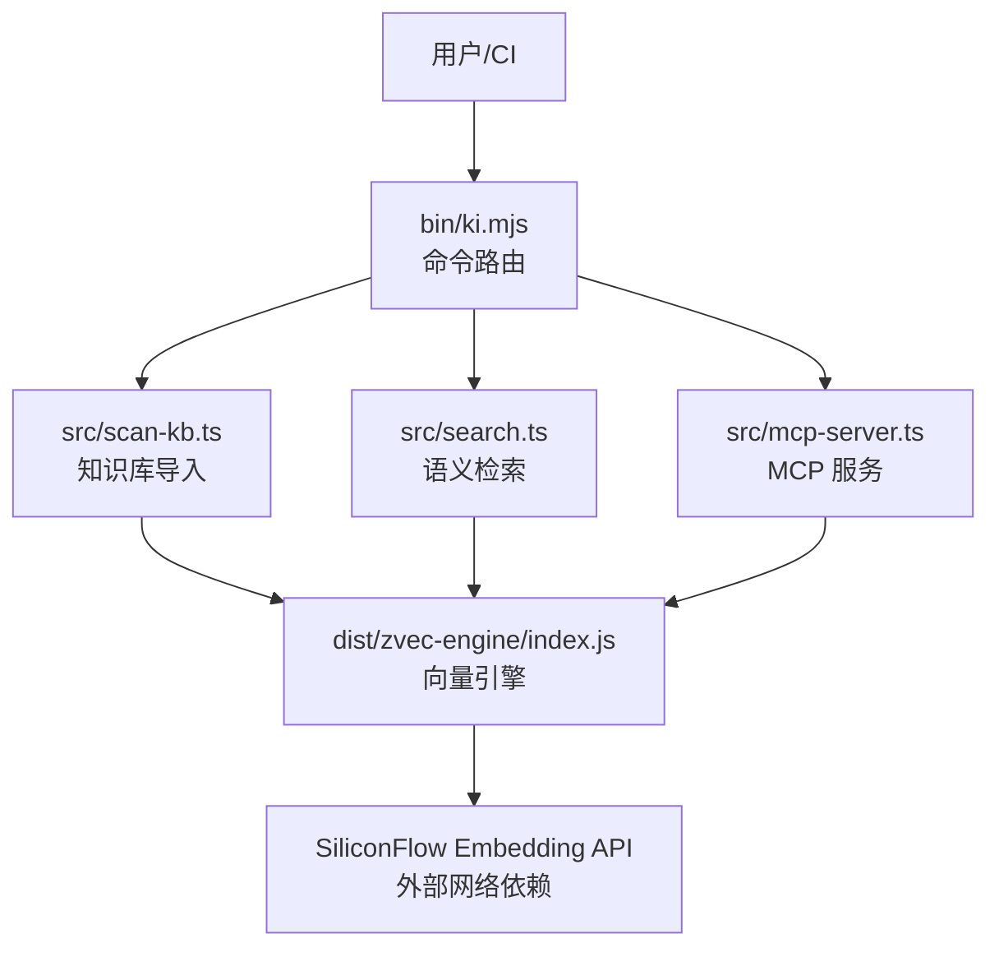
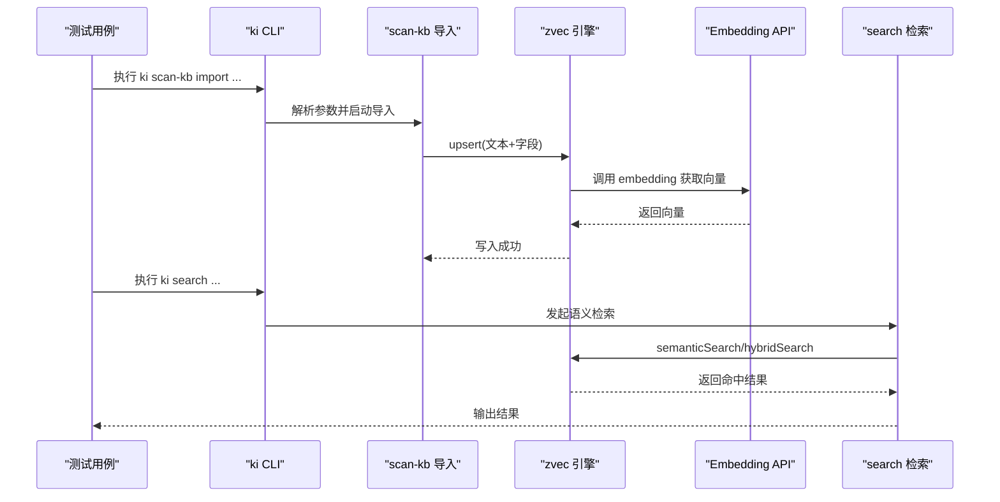
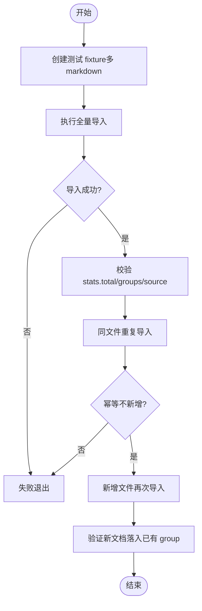
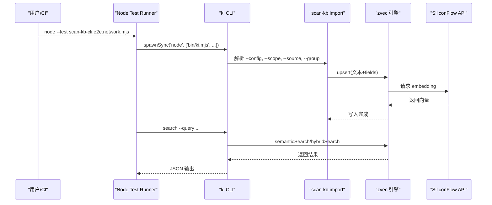
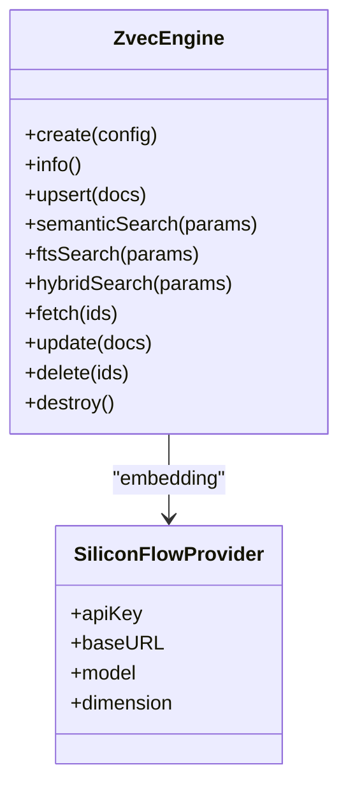
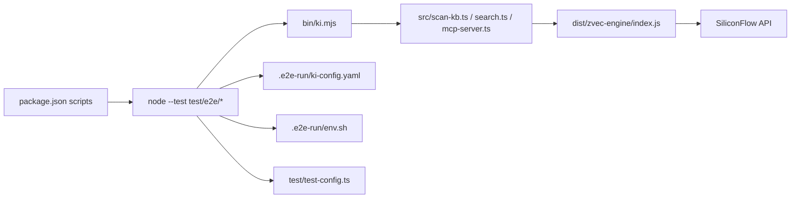

# 端到端测试

<cite>
**本文引用的文件**
- [README.md](file://README.md)
- [package.json](file://package.json)
- [bin/ki.mjs](file://bin/ki.mjs)
- [.e2e-run/env.sh](file://.e2e-run/env.sh)
- [.e2e-run/ki-config.yaml](file://.e2e-run/ki-config.yaml)
- [.e2e-run/manifest.json](file://.e2e-run/manifest.json)
- [test/e2e-guide.md](file://test/e2e-guide.md)
- [test/test-config.ts](file://test/test-config.ts)
- [test/e2e/e2e-bulk-import.test.mjs](file://test/e2e/e2e-bulk-import.test.mjs)
- [test/e2e/scan-kb-cli.e2e.network.mjs](file://test/e2e/scan-kb-cli.e2e.network.mjs)
- [test/e2e/zvec-engine-e2e.network.mjs](file://test/e2e/zvec-engine-e2e.network.mjs)
</cite>

## 目录
1. [简介](#简介)
2. [项目结构](#项目结构)
3. [核心组件](#核心组件)
4. [架构总览](#架构总览)
5. [详细组件分析](#详细组件分析)
6. [依赖关系分析](#依赖关系分析)
7. [性能与稳定性考量](#性能与稳定性考量)
8. [故障排查指南](#故障排查指南)
9. [结论](#结论)
10. [附录：命令速查](#附录命令速查)

## 简介
本指南面向“端到端（E2E）测试”，覆盖环境准备、数据初始化、外部依赖模拟，以及网络相关的 E2E 实现（MCP 服务器集成、向量引擎网络测试、CLI 命令端到端验证）。文档基于仓库中现有 E2E 用例与配置，提供可操作的执行流程、结果查看方法与排障技巧。

## 项目结构
仓库的 E2E 能力由三部分构成：
- CLI 入口与命令路由：通过 bin/ki.mjs 分发到各子命令脚本。
- E2E 测试套件：位于 test/e2e，包含批量导入、CLI 端到端、Zvec 引擎端到端等网络型用例。
- 运行环境与配置：.e2e-run 下提供隔离的环境变量、配置文件与示例数据清单。

图表来源
- [bin/ki.mjs:29-49](file://bin/ki.mjs#L29-L49)
- [test/e2e/scan-kb-cli.e2e.network.mjs:145-186](file://test/e2e/scan-kb-cli.e2e.network.mjs#L145-L186)
- [test/e2e/zvec-engine-e2e.network.mjs:106-137](file://test/e2e/zvec-engine-e2e.network.mjs#L106-L137)

章节来源
- [bin/ki.mjs:29-49](file://bin/ki.mjs#L29-L49)
- [package.json:9-32](file://package.json#L9-L32)

## 核心组件
- CLI 入口与命令映射：统一入口解析 --config，转发至具体命令脚本；支持守护模式与信号透传。
- 测试配置与隔离：为每个测试进程生成临时配置，避免污染全局 ~/.ki；支持动态注册 scope。
- E2E 用例：
  - 批量导入幂等性：验证原文直导、切分、source 块持久化与重复追加不冲突。
  - CLI 端到端（网络）：真实 embedding + zvec worker，验证 import → search 召回链路。
  - Zvec 引擎端到端（网络）：真实 SiliconFlowProvider 建库、upsert、semanticSearch、ftsSearch、hybridSearch、update/delete 全链路。
- 运行环境：.e2e-run/env.sh 设置 Node 版本、API Key、KI_CFG；ki-config.yaml 定义 dataDir/vectorDir/embedding/scopes。

章节来源
- [test/test-config.ts:24-47](file://test/test-config.ts#L24-L47)
- [.e2e-run/env.sh:1-7](file://.e2e-run/env.sh#L1-L7)
- [.e2e-run/ki-config.yaml:1-18](file://.e2e-run/ki-config.yaml#L1-L18)
- [test/e2e/e2e-bulk-import.test.mjs:67-113](file://test/e2e/e2e-bulk-import.test.mjs#L67-L113)
- [test/e2e/scan-kb-cli.e2e.network.mjs:100-141](file://test/e2e/scan-kb-cli.e2e.network.mjs#L100-L141)
- [test/e2e/zvec-engine-e2e.network.mjs:106-147](file://test/e2e/zvec-engine-e2e.network.mjs#L106-L147)

## 架构总览
E2E 测试围绕“导入—索引—检索”闭环展开，关键路径如下：
- 导入：scan-kb import 读取 source 目录，进行原文切分、向量化并写入本地 KB 与向量库。
- 检索：search 调用向量引擎进行语义召回，必要时结合全文与 RRF 融合。
- MCP：mcp-server 暴露工具集，Agent 可通过 stdio/HTTP 访问；E2E 可验证 HTTP 单例与鉴权。

图表来源
- [test/e2e/scan-kb-cli.e2e.network.mjs:145-186](file://test/e2e/scan-kb-cli.e2e.network.mjs#L145-L186)
- [test/e2e/zvec-engine-e2e.network.mjs:162-236](file://test/e2e/zvec-engine-e2e.network.mjs#L162-L236)

## 详细组件分析

### 批量导入 E2E（幂等追加）
- 目标：验证原文直导、chunk 切分、source 块持久化、重复追加幂等、新增文档自动归入已有 group。
- 关键点：
  - 使用 npx jiti 直接执行 src/scan-kb.ts，传入 --scope/--source/--group。
  - 断言 stats.total、groups、source.chunkSize/chunkOverlap 与 relations-cache 中的 relation 命名规则。
  - after 清理 scope 目录与 .json 状态，保证隔离。

图表来源
- [test/e2e/e2e-bulk-import.test.mjs:67-113](file://test/e2e/e2e-bulk-import.test.mjs#L67-L113)
- [test/e2e/e2e-bulk-import.test.mjs:115-161](file://test/e2e/e2e-bulk-import.test.mjs#L115-L161)

章节来源
- [test/e2e/e2e-bulk-import.test.mjs:67-161](file://test/e2e/e2e-bulk-import.test.mjs#L67-L161)

### CLI 端到端（网络）
- 目标：黑盒验证 ki CLI 的 import → search 完整链路，使用真实 embedding 与 zvec worker。
- 关键点：
  - 从 .env.e2e/.env 或进程环境变量加载 apiKey；无密钥时整套跳过（CI 安全）。
  - before 创建临时 dataDir/vectorDir/config.json，注入 embedding 配置。
  - 旅程：full import → recall 验证 → append 幂等 → verify 新增可召回。

图表来源
- [test/e2e/scan-kb-cli.e2e.network.mjs:40-96](file://test/e2e/scan-kb-cli.e2e.network.mjs#L40-L96)
- [test/e2e/scan-kb-cli.e2e.network.mjs:100-141](file://test/e2e/scan-kb-cli.e2e.network.mjs#L100-L141)
- [test/e2e/scan-kb-cli.e2e.network.mjs:145-186](file://test/e2e/scan-kb-cli.e2e.network.mjs#L145-L186)

章节来源
- [test/e2e/scan-kb-cli.e2e.network.mjs:40-186](file://test/e2e/scan-kb-cli.e2e.network.mjs#L40-L186)

### Zvec 引擎端到端（网络）
- 目标：以真实 SiliconFlowProvider 构建集合，验证 create/info/upsert/semanticSearch/ftsSearch/hybridSearch/fetch/update/delete/destroy。
- 关键点：
  - 从环境变量读取 URL/model/dimension/apiKey；无密钥则跳过。
  - 建库时声明 scalarFields 与 fts（jieba），确保代码符号精确召回。
  - 自检索 score≈1、不相关查询相对比值断言、Recall@5≥90%。

图表来源
- [test/e2e/zvec-engine-e2e.network.mjs:35-68](file://test/e2e/zvec-engine-e2e.network.mjs#L35-L68)
- [test/e2e/zvec-engine-e2e.network.mjs:106-137](file://test/e2e/zvec-engine-e2e.network.mjs#L106-L137)

章节来源
- [test/e2e/zvec-engine-e2e.network.mjs:106-279](file://test/e2e/zvec-engine-e2e.network.mjs#L106-L279)

### MCP 服务器集成测试（概念说明）
- 在仓库中，MCP 服务器通过 ki mcp 命令启动，支持 stdio 与 HTTP 共享单例；E2E 可验证 HTTP 模式下的启动、状态查询与鉴权。
- 建议实践：
  - 使用 ki mcp --http 启动后，通过 ki mcp --status 确认 host/port。
  - 生成 Token 并配置客户端 headers.Authorization。
  - 在 CI 中仅做“启动存活探测 + 健康检查”，避免长耗时网络调用。

[本节为概念性说明，未直接分析具体文件]

## 依赖关系分析
- CLI 命令路由：bin/ki.mjs 将命令映射到 src/*.ts，并通过 jiti 执行 TypeScript。
- 测试配置：test/test-config.ts 为每个测试进程生成临时配置，动态注册 scope，剥离 IDE 注入的环境变量以避免阻塞。
- 运行环境：.e2e-run/env.sh 指定 Node 版本、API Key、KI_CFG；ki-config.yaml 定义数据与向量目录及 embedding 配置。
- 外部依赖：SiliconFlow Embedding API（通过环境变量注入），zvec 引擎（本地持久化）。

图表来源
- [package.json:9-32](file://package.json#L9-L32)
- [bin/ki.mjs:29-49](file://bin/ki.mjs#L29-L49)
- [.e2e-run/env.sh:1-7](file://.e2e-run/env.sh#L1-L7)
- [.e2e-run/ki-config.yaml:1-18](file://.e2e-run/ki-config.yaml#L1-L18)
- [test/test-config.ts:24-47](file://test/test-config.ts#L24-L47)

章节来源
- [package.json:9-32](file://package.json#L9-L32)
- [bin/ki.mjs:29-49](file://bin/ki.mjs#L29-L49)
- [.e2e-run/env.sh:1-7](file://.e2e-run/env.sh#L1-L7)
- [.e2e-run/ki-config.yaml:1-18](file://.e2e-run/ki-config.yaml#L1-L18)
- [test/test-config.ts:24-47](file://test/test-config.ts#L24-L47)

## 性能与稳定性考量
- 幂等导入：重复执行同一 source 目录不会新增重复 chunk，减少冗余写入与向量计算。
- 向量维度一致性：embedding dimension 必须与集合定义一致，否则拒绝写入。
- 超时与资源隔离：E2E 用例设置较长 timeout；before/after 严格清理临时目录，避免磁盘与句柄泄漏。
- 网络容错：无 apiKey 时整套跳过，保障 CI 安全与稳定。

[本节提供通用指导，不直接分析具体文件]

## 故障排查指南
- 缺失 API Key：
  - 现象：E2E 用例打印“缺少 embedding apiKey，整套真实联网用例已跳过”。
  - 处理：导出 SILICONFLOW_API_KEY 或 GITNEXUS_EMBEDDING_API_KEY；或在 .env.e2e 中配置。
- 端口冲突（MCP HTTP 模式）：
  - 现象：ki mcp --http 启动失败或后台启动早期退出。
  - 处理：使用 ki mcp --status 查看占用；更换 host/port 或停止旧进程。
- 向量维度不匹配：
  - 现象：upsert/update 报错维度不一致。
  - 处理：确保 embedding.dimension 与集合定义一致。
- 导入中断与锁残留：
  - 现象：WAL 锁残留导致后续操作挂起。
  - 处理：清理临时目录与锁文件；确保 SIGTERM/SIGINT 正确转发给子进程。

章节来源
- [test/e2e/scan-kb-cli.e2e.network.mjs:58-68](file://test/e2e/scan-kb-cli.e2e.network.mjs#L58-L68)
- [test/e2e/zvec-engine-e2e.network.mjs:61-68](file://test/e2e/zvec-engine-e2e.network.mjs#L61-L68)
- [bin/ki.mjs:155-198](file://bin/ki.mjs#L155-L198)

## 结论
本项目的 E2E 体系以 CLI 为入口，串联知识库导入、向量索引与语义检索，并通过真实网络依赖（SiliconFlow）验证端到端链路。批量导入幂等、Zvec 引擎全链路、CLI 黑盒验收共同构成高可信度的质量保障。配合隔离配置与环境变量管理，可在本地与 CI 中稳定执行。

[本节为总结，不直接分析具体文件]

## 附录：命令速查
- 安装与构建
  - npm install
  - npm run build:zvec-engine
- 初始化与诊断
  - ki config init
  - ki doctor
- 导入与检索
  - ki scan-kb import --scope <scope> --source <wiki> --group <group>
  - ki search --scope <scope> --query "<自然语言>"
- MCP 服务
  - ki mcp --http --web
  - ki mcp --status
  - ki mcp token generate --scope <scope>
- 测试执行
  - npm run test:e2e:scan-kb
  - npm run test:e2e:step-c
  - npm run test:zvec-engine
  - node --test test/e2e/scan-kb-cli.e2e.network.mjs
  - node --test test/e2e/zvec-engine-e2e.network.mjs
  - node --test test/e2e/e2e-bulk-import.test.mjs

章节来源
- [package.json:9-32](file://package.json#L9-L32)
- [README.md:105-167](file://README.md#L105-L167)