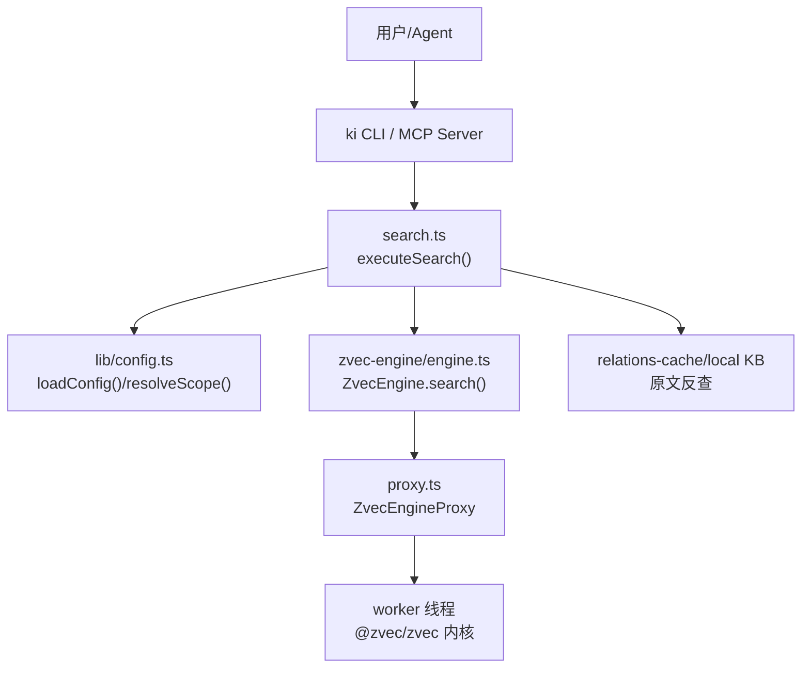
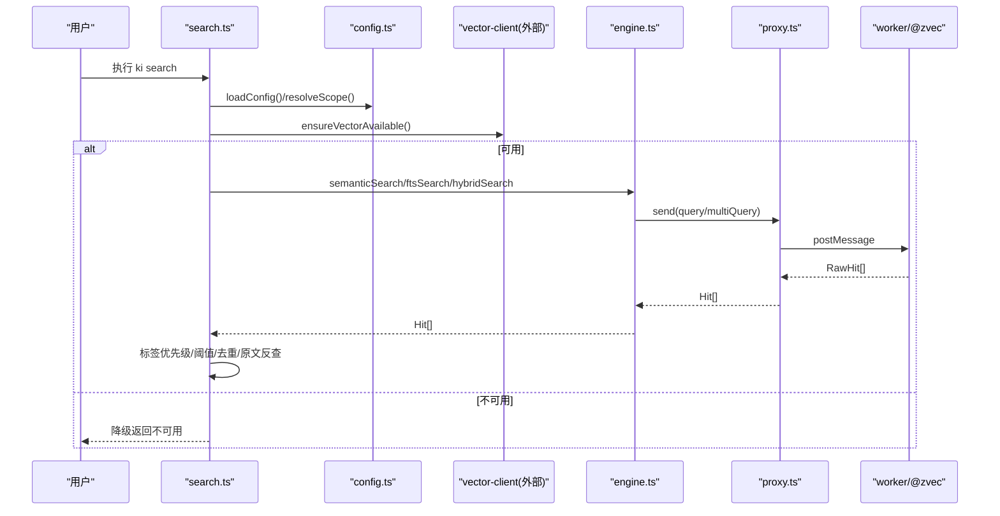
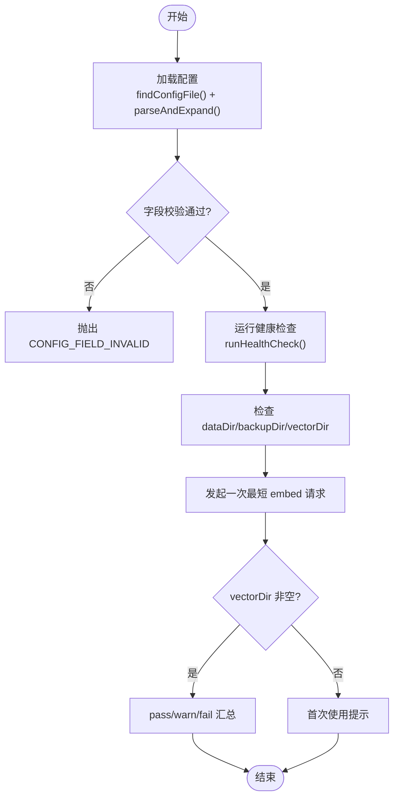
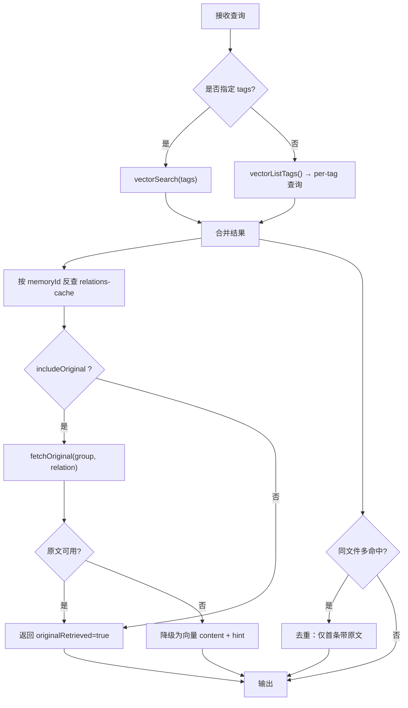
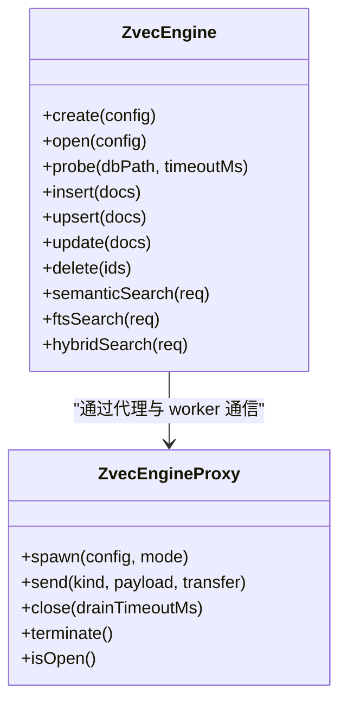
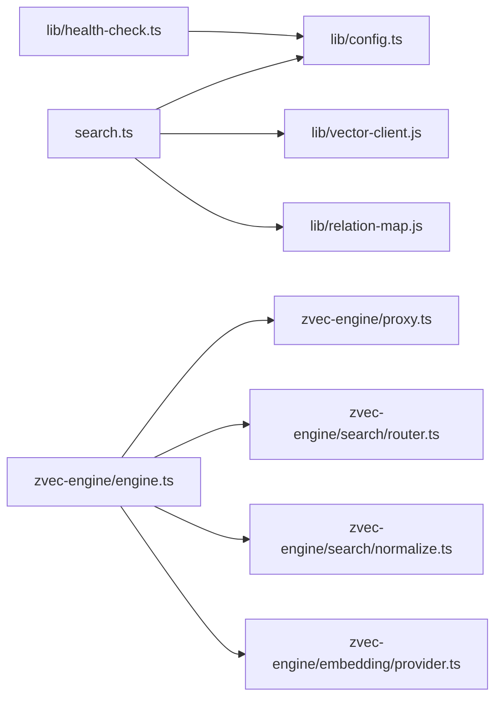

# 调试与性能分析

<cite>
**本文引用的文件**
- [README.md](file://README.md)
- [配置指南](file://docs/configuration.md)
- [异常处理与恢复](file://docs/error-handling.md)
- [向量引擎实现原理（基于 zvec 引擎）](file://docs/vector-engine-mem.md)
- [src/config.ts](file://src/config.ts)
- [src/lib/config.ts](file://src/lib/config.ts)
- [src/search.ts](file://src/search.ts)
- [src/zvec-engine/engine.ts](file://src/zvec-engine/engine.ts)
- [src/zvec-engine/proxy.ts](file://src/zvec-engine/proxy.ts)
- [src/zvec-engine/errors.ts](file://src/zvec-engine/errors.ts)
- [src/lib/health-check.ts](file://src/lib/health-check.ts)
- [test/vector-cli-functions.test.ts](file://test/vector-cli-functions.test.ts)
- [test/zvec-engine-search.test.mjs](file://test/zvec-engine-search.test.mjs)
</cite>

## 目录
1. [简介](#简介)
2. [项目结构](#项目结构)
3. [核心组件](#核心组件)
4. [架构总览](#架构总览)
5. [详细组件分析](#详细组件分析)
6. [依赖关系分析](#依赖关系分析)
7. [性能考量](#性能考量)
8. [故障排查指南](#故障排查指南)
9. [结论](#结论)
10. [附录](#附录)

## 简介
本指南面向 kisearch（ki）的调试与性能分析，覆盖日志级别与诊断、内存/CPU/网络问题定位、向量检索性能分析与搜索算法调优。kisearch 将结构化知识索引与向量语义检索结合，底层使用进程内 zvec 引擎，提供混合检索（语义 + BM25 + RRF 融合），并通过 MCP/CLI 暴露能力。

## 项目结构
- 配置与诊断：配置文件加载、字段校验、健康检查
- 检索入口：search CLI 与 executeSearch 编排
- 向量引擎：ZvecEngine 门面、Worker 代理、错误体系、检索路由与归一化
- 测试：纯函数与路由/归一化验证

图表来源
- [src/search.ts:70-199](file://src/search.ts#L70-L199)
- [src/lib/config.ts:156-183](file://src/lib/config.ts#L156-L183)
- [src/zvec-engine/engine.ts:454-495](file://src/zvec-engine/engine.ts#L454-L495)
- [src/zvec-engine/proxy.ts:56-126](file://src/zvec-engine/proxy.ts#L56-L126)

章节来源
- [README.md:35-54](file://README.md#L35-L54)
- [配置指南:7-18](file://docs/configuration.md#L7-L18)

## 核心组件
- 配置系统：YAML/JSON 配置加载、路径展开、字段级校验、scope 护栏
- 健康检查：启动前只读诊断（目录、apiKey、embedding 连通性/维度、collection）
- 检索编排：标签优先级、per-tag 限流、原文反查与去重、阈值过滤
- 向量引擎：创建/打开/探测、写入批处理与失败隔离、检索路由与结果归一化
- Worker 代理：消息派发、在途请求 drain、崩溃处理、超时保护

章节来源
- [src/lib/config.ts:156-183](file://src/lib/config.ts#L156-L183)
- [src/lib/config.ts:252-385](file://src/lib/config.ts#L252-L385)
- [src/lib/health-check.ts:150-240](file://src/lib/health-check.ts#L150-L240)
- [src/search.ts:70-199](file://src/search.ts#L70-L199)
- [src/zvec-engine/engine.ts:97-143](file://src/zvec-engine/engine.ts#L97-L143)
- [src/zvec-engine/engine.ts:330-450](file://src/zvec-engine/engine.ts#L330-L450)
- [src/zvec-engine/proxy.ts:131-173](file://src/zvec-engine/proxy.ts#L131-L173)

## 架构总览
kisearch 通过 search 命令编排“标签分查 → 向量检索 → 原文反查 → 去重”流程；向量层由 ZvecEngine 统一封装，内部通过 proxy 与 worker 通信，调用 Rust 内核完成 dense/FTS/hybrid 检索与索引维护。

图表来源
- [src/search.ts:70-199](file://src/search.ts#L70-L199)
- [src/zvec-engine/engine.ts:454-495](file://src/zvec-engine/engine.ts#L454-L495)
- [src/zvec-engine/proxy.ts:114-126](file://src/zvec-engine/proxy.ts#L114-L126)

## 详细组件分析

### 配置与诊断
- 配置加载优先级：命令行 --config > 环境变量 KI_CONFIG_PATH > ~/.ki/config.yaml/yml/json > 内置默认
- 字段级校验：语法通过后仍进行字段名/类型/取值校验，非法直接 fail-loud
- scope 护栏：default 允许未注册 scope；strict 必须显式传入且白名单内
- 健康检查：检查 dataDir/backupDir/vectorDir 可写、apiKey 解析、embedding 连通/密钥/维度、collection 存在性

图表来源
- [src/lib/config.ts:193-213](file://src/lib/config.ts#L193-L213)
- [src/lib/config.ts:252-385](file://src/lib/config.ts#L252-L385)
- [src/lib/health-check.ts:150-240](file://src/lib/health-check.ts#L150-L240)

章节来源
- [配置指南:7-18](file://docs/configuration.md#L7-L18)
- [配置指南:234-260](file://docs/configuration.md#L234-L260)
- [src/lib/config.ts:156-183](file://src/lib/config.ts#L156-L183)
- [src/lib/config.ts:252-385](file://src/lib/config.ts#L252-L385)
- [src/lib/health-check.ts:150-240](file://src/lib/health-check.ts#L150-L240)

### 检索编排与原文反查
- 标签优先级：ki-search > ki-relation > ki-path；不传 tags 时按 tag 分查并组内限流
- 阈值过滤：threshold 控制融合得分下限
- 原文反查：通过 relations-cache 定位 group/relation，读取 local KB 原文；缺失则降级为向量文档并提示
- 多 chunk 去重：同一文件多次命中仅保留首条原文，其余标记 deduplicated

图表来源
- [src/search.ts:70-199](file://src/search.ts#L70-L199)

章节来源
- [src/search.ts:20-47](file://src/search.ts#L20-L47)
- [src/search.ts:70-199](file://src/search.ts#L70-L199)
- [test/vector-cli-functions.test.ts:176-244](file://test/vector-cli-functions.test.ts#L176-L244)

### 向量引擎：写入与检索
- 写入批处理：按是否需要 embed 拆分；embed 按 EMBED_BATCH_SIZE=64 切小批，批内文本去重减少重复 HTTP 调用；失败项进入 errors 不影响成功项
- 更新约束：update 要求提供 vector 或 text；若集合有 FTS，禁止只传 vector 不传 text
- 检索路由：根据输入选择 vector/fts/hybrid；必要时主线程 embed 后注入 payload；filter 编译为 SQL WHERE
- 结果归一化：COSINE 距离归一化为 1/(1+distance)，FTS 保持 BM25，hybrid 支持 RRF/weighted

图表来源
- [src/zvec-engine/engine.ts:97-143](file://src/zvec-engine/engine.ts#L97-L143)
- [src/zvec-engine/engine.ts:330-450](file://src/zvec-engine/engine.ts#L330-L450)
- [src/zvec-engine/engine.ts:454-495](file://src/zvec-engine/engine.ts#L454-L495)
- [src/zvec-engine/proxy.ts:56-126](file://src/zvec-engine/proxy.ts#L56-L126)

章节来源
- [src/zvec-engine/engine.ts:330-450](file://src/zvec-engine/engine.ts#L330-L450)
- [src/zvec-engine/engine.ts:454-495](file://src/zvec-engine/engine.ts#L454-L495)
- [src/zvec-engine/proxy.ts:131-173](file://src/zvec-engine/proxy.ts#L131-L173)
- [test/zvec-engine-search.test.mjs:65-171](file://test/zvec-engine-search.test.mjs#L65-L171)

### 错误体系与健壮性
- 类型化异常：DimensionMismatchError、InvalidSchemaError、InconsistentUpdateError、CollectionLockedException 等
- Worker 生命周期：spawn/open/close/destroy/crash 状态机；drain 等待在途请求；超时保护避免阻塞
- 探针探测：probe 对空目录/锁/损坏做快速判定，避免误判 locked

章节来源
- [src/zvec-engine/errors.ts:17-99](file://src/zvec-engine/errors.ts#L17-L99)
- [src/zvec-engine/engine.ts:145-199](file://src/zvec-engine/engine.ts#L145-L199)
- [src/zvec-engine/proxy.ts:131-173](file://src/zvec-engine/proxy.ts#L131-L173)

## 依赖关系分析
- search.ts 依赖 lib/config.ts（配置与 scope）、lib/vector-client.js（向量可用性检测）、relation-map/store（原文反查）
- engine.ts 依赖 proxy.ts（worker 通信）、search/router.ts（路由）、search/normalize.ts（归一化）、embedding/provider.ts（向量化）
- health-check.ts 依赖 config.ts 与 SiliconFlowProvider（连通性/维度验证）

图表来源
- [src/search.ts:11-18](file://src/search.ts#L11-L18)
- [src/zvec-engine/engine.ts:27-33](file://src/zvec-engine/engine.ts#L27-L33)
- [src/lib/health-check.ts:17-21](file://src/lib/health-check.ts#L17-L21)

章节来源
- [src/search.ts:11-18](file://src/search.ts#L11-L18)
- [src/zvec-engine/engine.ts:27-33](file://src/zvec-engine/engine.ts#L27-L33)
- [src/lib/health-check.ts:17-21](file://src/lib/health-check.ts#L17-L21)

## 性能考量
- 冷启动与常驻：MCP 模式下引擎常驻，查询延迟从秒级降至毫秒级
- 写入优化：embed 小批大小与批内文本去重降低 HTTP 调用次数；失败粒度控制在小批
- 检索优化：混合检索（dense + FTS + RRF）提升召回与排序质量；metadata filter 硬过滤减少无效扫描
- 资源释放：close/terminate 保证 worker 句柄与文件锁释放，避免泄漏

章节来源
- [向量引擎实现原理（基于 zvec 引擎）:7-14](file://docs/vector-engine-mem.md#L7-L14)
- [向量引擎实现原理（基于 zvec 引擎）:233-245](file://docs/vector-engine-mem.md#L233-L245)
- [src/zvec-engine/engine.ts:62-67](file://src/zvec-engine/engine.ts#L62-L67)
- [src/zvec-engine/engine.ts:330-450](file://src/zvec-engine/engine.ts#L330-L450)
- [src/zvec-engine/proxy.ts:131-173](file://src/zvec-engine/proxy.ts#L131-L173)

## 故障排查指南
- 参数与配置
  - 非法 scope、缺失参数、字段校验失败（CONFIG_FIELD_INVALID）会快速失败并给出修复建议
- 数据文件
  - relations-cache/group-index 损坏或缺失需重新初始化或恢复备份
- 增量导入
  - 删除失败记录 warning 继续；缓存未找到 sourcePath 记录 warning 继续清理
- 推荐顺序
  - 先补齐参数 → 确认路径 → 注册 scope → 生成索引 → 再执行下一步

章节来源
- [异常处理与恢复:13-52](file://docs/error-handling.md#L13-L52)
- [异常处理与恢复:55-130](file://docs/error-handling.md#L55-L130)
- [异常处理与恢复:144-160](file://docs/error-handling.md#L144-L160)

## 结论
kisearch 以“结构化索引 + 向量检索”双路径为核心，配合健康检查、严格字段校验与类型化异常，形成高可用的知识检索系统。通过常驻引擎、批处理与混合检索策略，显著降低延迟并提升召回质量。调试时应优先关注配置与 scope 护栏、embedding 连通性与维度、以及向量层路由与归一化逻辑。

## 附录

### 常用调试技巧
- 启动预检：使用健康检查（ki doctor 或 mcp 启动预检）一次性验证配置、目录、apiKey、embedding 连通性与维度、collection 状态
- 最小请求验证：embedding 三合一检查通过一次最短 embed 请求同时验证 URL 连通性、密钥有效性、维度匹配
- 向量可用性：ensureVectorAvailable 前置检测，不可用时走降级路径并提示

章节来源
- [src/lib/health-check.ts:50-144](file://src/lib/health-check.ts#L50-L144)
- [src/lib/health-check.ts:150-240](file://src/lib/health-check.ts#L150-L240)
- [src/search.ts:84-92](file://src/search.ts#L84-L92)

### 内存泄漏与资源管理
- Worker 关闭：close 会 drain 在途请求后再 closeSync 释放 LOCK，最后 terminate；destroy 强制销毁
- 探针关闭：probe 临时 proxy 限时关闭，避免原生 ZVecOpen 阻塞导致泄漏
- 进程退出：CLI 每次调用后 closeEngine，确保 worker 与 LOCK 释放

章节来源
- [src/zvec-engine/proxy.ts:131-173](file://src/zvec-engine/proxy.ts#L131-L173)
- [src/zvec-engine/engine.ts:145-199](file://src/zvec-engine/engine.ts#L145-L199)
- [src/search.ts:234-236](file://src/search.ts#L234-L236)

### CPU 性能分析
- 热点识别：嵌入阶段按 EMBED_BATCH_SIZE=64 切批，批内去重减少重复 HTTP 调用；失败隔离避免整批失败
- 检索路径：router 选择最优路径（vector/fts/hybrid），filter 编译为 SQL WHERE 减少无效扫描
- 指标参考：zvec 引擎相比旧 mem CLI 在延迟与召回上全面领先

章节来源
- [src/zvec-engine/engine.ts:62-67](file://src/zvec-engine/engine.ts#L62-L67)
- [src/zvec-engine/engine.ts:330-450](file://src/zvec-engine/engine.ts#L330-L450)
- [向量引擎实现原理（基于 zvec 引擎）:233-245](file://docs/vector-engine-mem.md#L233-L245)

### 网络请求调试
- embedding 连通性：health-check 通过最短请求验证 baseURL 可达、鉴权与维度
- 超时与重试：embedding 检查设置超时与重试，容忍瞬时抖动
- 错误分类：区分网络不可达、超时、鉴权失败、维度不匹配等场景

章节来源
- [src/lib/health-check.ts:50-144](file://src/lib/health-check.ts#L50-L144)

### 向量检索性能与搜索算法调优
- 标签与限流：不传 tags 时按 tag 分查，每个 tag 限流 limit，并按优先级排序（ki-search 优先）
- 阈值过滤：threshold 控制融合得分下限，过滤低相关结果
- 混合检索：queryText + fts 走 hybrid，支持 RRF/weighted 融合；无 fts 时退化为单路 vector
- 原文反查：命中后通过 relations-cache 定位 group/relation 取原文，缺失时降级并提示

章节来源
- [src/search.ts:20-47](file://src/search.ts#L20-L47)
- [src/search.ts:70-199](file://src/search.ts#L70-L199)
- [test/vector-cli-functions.test.ts:176-244](file://test/vector-cli-functions.test.ts#L176-L244)
- [test/zvec-engine-search.test.mjs:65-171](file://test/zvec-engine-search.test.mjs#L65-L171)