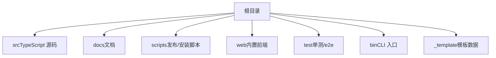
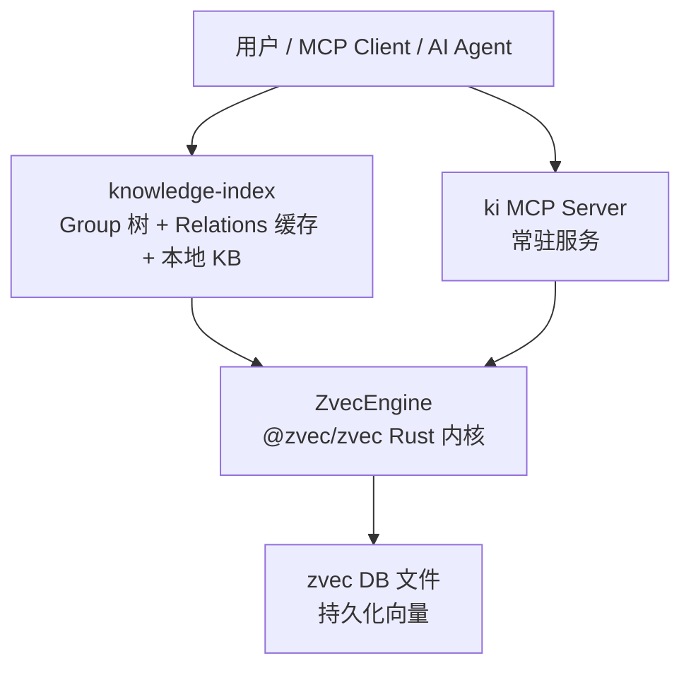
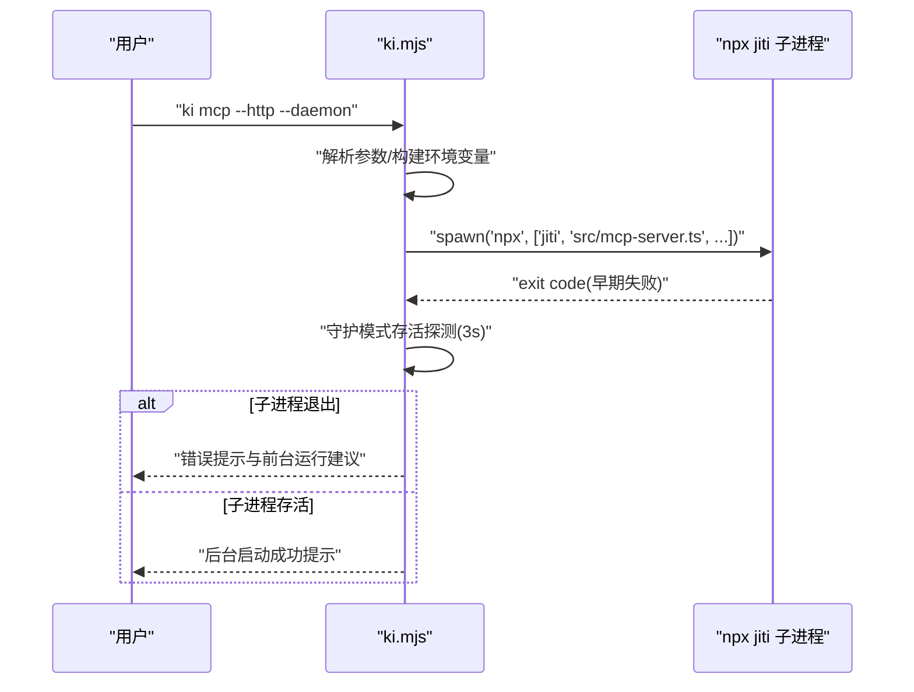
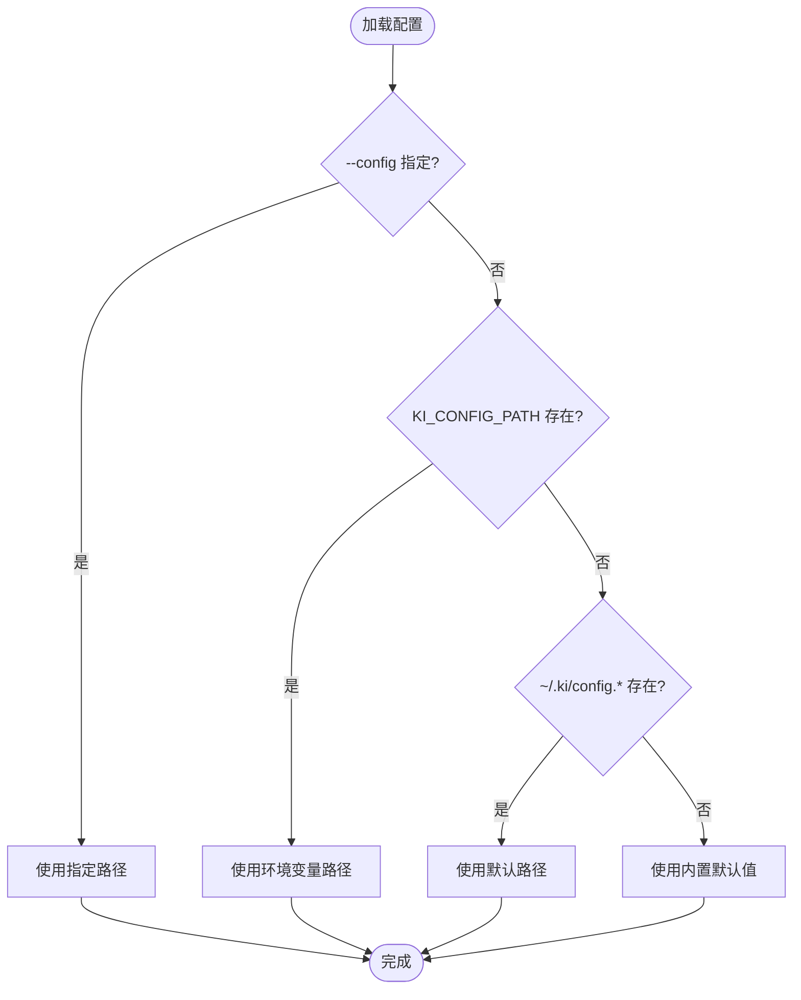
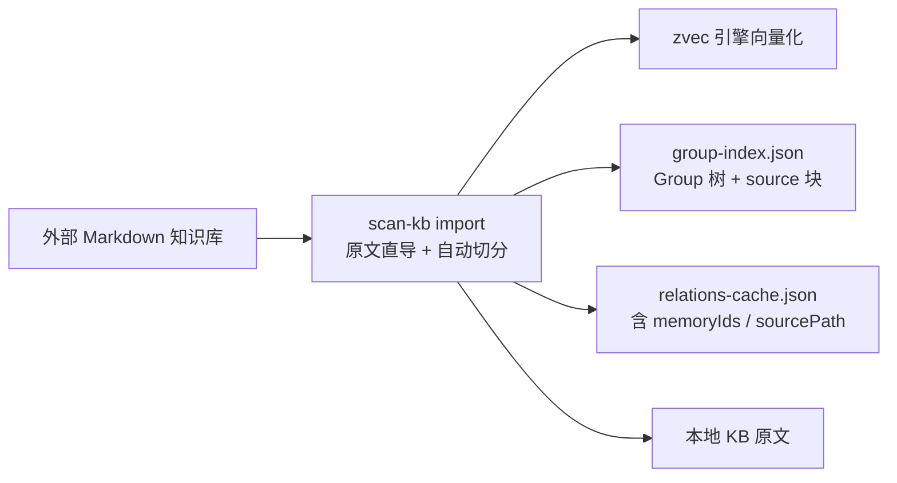
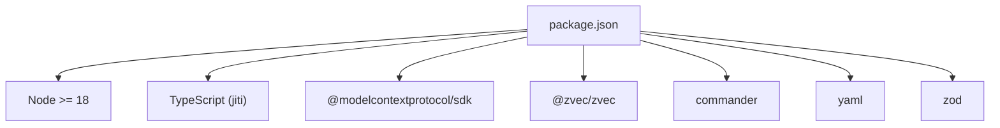
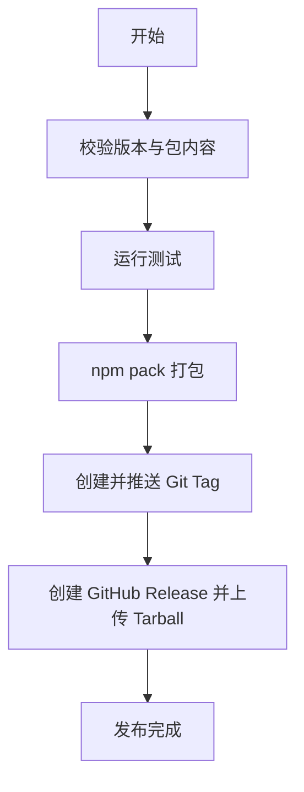

# 开发者指南

<cite>
**本文引用的文件**
- [README.md](file://README.md)
- [package.json](file://package.json)
- [tsconfig.json](file://tsconfig.json)
- [bin/ki.mjs](file://bin/ki.mjs)
- [docs/architecture.md](file://docs/architecture.md)
- [docs/configuration.md](file://docs/configuration.md)
- [scripts/release.sh](file://scripts/release.sh)
- [test/test-config.ts](file://test/test-config.ts)
</cite>

## 目录
1. [简介](#简介)
2. [项目结构](#项目结构)
3. [核心组件](#核心组件)
4. [架构总览](#架构总览)
5. [详细组件分析](#详细组件分析)
6. [依赖关系分析](#依赖关系分析)
7. [性能与内存优化](#性能与内存优化)
8. [故障排查指南](#故障排查指南)
9. [版本发布流程](#版本发布流程)
10. [贡献规范与代码审查](#贡献规范与代码审查)
11. [新功能开发与扩展点](#新功能开发与扩展点)
12. [调试技巧与常用工具](#调试技巧与常用工具)
13. [结论](#结论)

## 简介
本指南面向希望参与 kisearch（knowledge-indexer）开发的工程师，覆盖开发环境搭建、工具链配置、代码规范与贡献流程、调试与性能分析方法、版本发布流程、新功能开发与扩展点说明，以及项目架构与设计原则。kisearch 提供结构化知识索引与向量语义检索能力，通过 CLI 与 MCP 协议对外暴露，底层使用 zvec 引擎进行混合检索。

## 项目结构
仓库采用多模块组织：
- 根目录包含 CLI 入口、源码、文档、脚本、测试与前端等
- src 为 TypeScript 源码，按功能划分命令与库
- docs 为架构、配置、工作流等文档
- scripts 包含发布等运维脚本
- web 为内置可视化前端
- test 包含单元测试与 e2e 用例

**章节来源**
- [README.md:105-166](file://README.md#L105-L166)
- [package.json:9-32](file://package.json#L9-L32)

## 核心组件
- CLI 入口与命令路由：通过 bin/ki.mjs 将 ki <command> 分发到对应 src/*.ts 脚本执行
- 配置系统：集中管理数据目录、向量库、Embedding、scope 映射与导入行为
- 向量引擎集成：基于 @zvec/zvec 的混合检索（dense + FTS + RRF）
- MCP 服务：支持 stdio 与 HTTP 模式，暴露查询、写入与管理工具
- 本地 KB 与索引：Group 树、Relation 缓存、原文存储与幂等更新

**章节来源**
- [bin/ki.mjs:28-49](file://bin/ki.mjs#L28-L49)
- [docs/configuration.md:27-37](file://docs/configuration.md#L27-L37)
- [README.md:35-50](file://README.md#L35-L50)

## 架构总览
kisearch 由“发现层”（zvec 向量引擎）与“交付层”（Group 导航、Relation 缓存、原文交付）组成，并通过 MCP Server 对外暴露工具。运行时主链路优先命中本地热区 Relation，未命中则走记忆系统语义兜底，最终返回原文或定位信息。

**图表来源**
- [docs/architecture.md:11-26](file://docs/architecture.md#L11-L26)

**章节来源**
- [docs/architecture.md:11-26](file://docs/architecture.md#L11-L26)

## 详细组件分析

### CLI 入口与命令路由
- 入口脚本解析全局参数（如 --config），并转发至子进程执行对应 TypeScript 脚本
- 支持守护进程模式（仅 HTTP 模式），启动期存活探测避免假成功
- 信号透传确保中断时子进程能正确清理

**图表来源**
- [bin/ki.mjs:148-197](file://bin/ki.mjs#L148-L197)

**章节来源**
- [bin/ki.mjs:51-133](file://bin/ki.mjs#L51-L133)
- [bin/ki.mjs:148-197](file://bin/ki.mjs#L148-L197)

### 配置系统
- 配置文件优先级：命令行 --config > 环境变量 KI_CONFIG_PATH > ~/.ki/config.yaml/yml/json > 内置默认值
- 顶层字段包括 dataDir、backupDir、vectorDir、embedding、scopeMode、scopes、mcp
- embedding 支持 provider/baseURL/model/dimension/apiKey；apiKey 推荐通过环境变量引用
- scopeMode 控制是否严格校验 scope 白名单
- scopes 可独立配置 kbDir、wikiSync、clean、import 等行为

**图表来源**
- [docs/configuration.md:7-18](file://docs/configuration.md#L7-L18)

**章节来源**
- [docs/configuration.md:27-177](file://docs/configuration.md#L27-L177)

### 向量引擎与导入链路
- 外部 Markdown 知识库导入：原文直导 + 自动切分 → 向量化 → 写 Group 树与 Relation 缓存 → 写本地 KB 原文
- 增量更新：幂等追加，同 sourcePath 覆盖更新，同名不同 sourcePath 跳过
- 运行时主链路：先查本地热区 Relation，未命中再走记忆系统语义兜底

**图表来源**
- [docs/architecture.md:128-147](file://docs/architecture.md#L128-L147)

**章节来源**
- [docs/architecture.md:109-147](file://docs/architecture.md#L109-L147)

### 测试配置隔离
- 测试为每个进程创建临时配置文件，避免污染用户默认数据目录
- 向量库与备份目录指向临时目录，保证离线优雅降级
- 注入环境变量 KI_CONFIG_PATH 使子进程与主进程共享配置

**章节来源**
- [test/test-config.ts:15-47](file://test/test-config.ts#L15-L47)
- [test/test-config.ts:61-79](file://test/test-config.ts#L61-L79)

## 依赖关系分析
- Node.js ≥ 18，TypeScript 直接执行（jiti 运行时）
- 关键依赖：@modelcontextprotocol/sdk（MCP）、@zvec/zvec（向量引擎）、commander（CLI）、yaml（配置解析）、zod（校验）
- 构建输出：dist/zvec-engine 为 zvec 引擎产物，需提前构建以避免运行时找不到模块

**图表来源**
- [package.json:60-66](file://package.json#L60-L66)
- [package.json:42-49](file://package.json#L42-L49)

**章节来源**
- [package.json:1-68](file://package.json#L1-L68)
- [tsconfig.json:1-16](file://tsconfig.json#L1-L16)

## 性能与内存优化
- 批量写入优先：使用批量接口一次 embed + 一次向量写入，显著降低网络与序列化开销
- 本地热区优先：热门 Relation 命中直接返回原文，减少向量检索与网络调用
- 增量幂等导入：重复执行同命令即同步变更，避免全量重建
- 向量维度一致性：embedding.dimension 必须与 collection.dimension 一致，否则需重建 vectorDir
- 资源隔离：测试与运行数据分离，避免污染与锁竞争

[本节为通用指导，不直接分析具体文件]

## 故障排查指南
- 启动预检：ki mcp 启动前自动健康检查（等价 ki doctor），报告写入 stderr，失败项拒绝启动
- Token 与安全：HTTP 模式跨机访问需绑定 0.0.0.0 并使用 Bearer Token；回环绑定免鉴权时可省略 headers
- 常见错误：
  - 缺少 Embedding API Key：在配置中通过环境变量引用，缺失时报错
  - 向量维度不匹配：需重建 vectorDir 并重新导入
  - 端口冲突：ki mcp --status 查看占用情况
- 日志与诊断：使用 ki doctor 检查 apiKey/连通性/维度/目录；使用 ki mcp --status 查看连接信息

**章节来源**
- [README.md:219-237](file://README.md#L219-L237)
- [docs/configuration.md:67-88](file://docs/configuration.md#L67-L88)

## 版本发布流程
- 前置条件：工作区干净、关键文件存在、测试通过
- 步骤：
  1) 确认版本号与 package.json 一致
  2) 运行测试
  3) npm pack 生成 tarball
  4) 创建/推送 git tag
  5) 创建 GitHub Release 并上传 tarball（可选 gh CLI 自动化）
- 安装方式：通过 GitHub Releases 下载 tarball 并 npm install -g

**图表来源**
- [scripts/release.sh:18-137](file://scripts/release.sh#L18-L137)

**章节来源**
- [scripts/release.sh:1-142](file://scripts/release.sh#L1-L142)

## 贡献规范与代码审查
- 提交前准备：
  - 安装依赖：npm install
  - 构建 zvec 引擎：npm run build:zvec-engine
  - 运行测试：npm test / npm run test:all / npm run test:zvec-engine
- 提交规范：
  - 保持工作区干净，无未提交变更
  - 遵循快速失败与幂等安全原则，避免静默降级
- 代码审查：
  - 关注 scope 隔离、WAL 原子写入、向量维度一致性
  - 验证新增命令/工具的输入校验与错误处理
  - 确保测试覆盖关键路径与边界场景

**章节来源**
- [README.md:395-404](file://README.md#L395-L404)
- [README.md:384-393](file://README.md#L384-L393)

## 新功能开发与扩展点
- 新命令扩展：
  - 在 bin/ki.mjs 的 COMMANDS 映射中添加新命令到对应 src/*.ts 脚本
  - 在帮助文本中补充命令说明与示例
- 新配置项扩展：
  - 在 docs/configuration.md 描述新增字段、默认值与作用域
  - 在实现中读取并应用配置，保持向后兼容
- 新向量能力扩展：
  - 确保 embedding.dimension 与 collection.dimension 一致
  - 提供降级策略与可用性检测（如依赖缺失时的明确提示）
- 新 MCP 工具扩展：
  - 在 MCP Server 中注册新工具，遵循零破坏性约束（不含 delete/force）
  - 提供清晰的参数校验与错误响应

[本节为通用指导，不直接分析具体文件]

## 调试技巧与常用工具
- 直接执行任意命令：npx jiti src/<command>.ts --help
- 配置诊断：ki doctor 检查 apiKey/连通性/维度/目录
- MCP 状态查看：ki mcp --status 查看持锁进程与绑定地址
- 守护模式调试：ki mcp --http --daemon 启动后，若失败会提示前台运行以查看详细错误
- 前端调试：构建 web/dist 后通过 ki mcp --http --web 启动，浏览器访问 http://127.0.0.1:7423/

**章节来源**
- [README.md:105-166](file://README.md#L105-L166)
- [bin/ki.mjs:155-197](file://bin/ki.mjs#L155-L197)

## 结论
kisearch 通过结构化知识索引与向量语义检索的结合，为 AI Agent 提供了高效、精准的知识获取能力。开发者应遵循配置与命令规范，利用批量写入与本地热区优化性能，借助诊断与调试工具快速定位问题，并按发布流程稳定交付新版本。新功能扩展需关注兼容性、安全性与可观测性，确保系统在复杂环境下稳定运行。