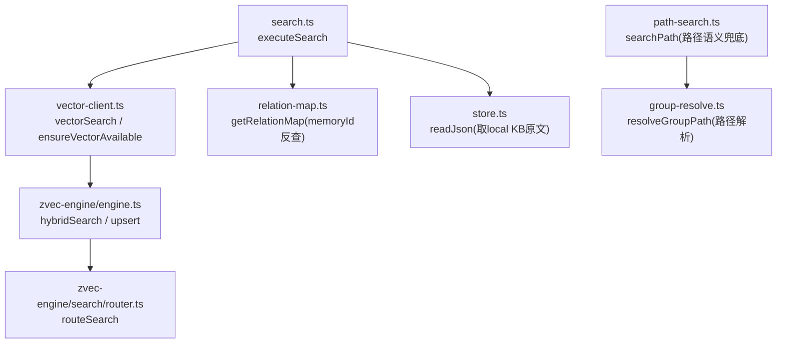
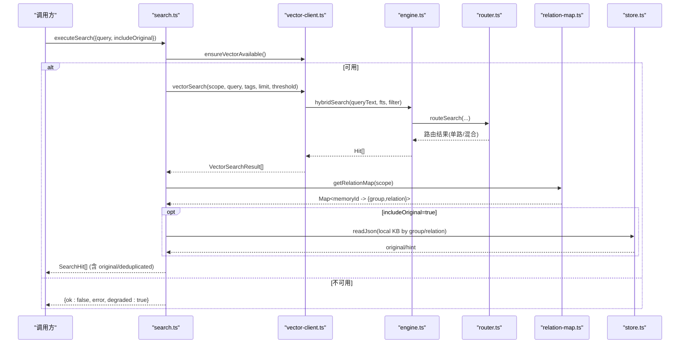
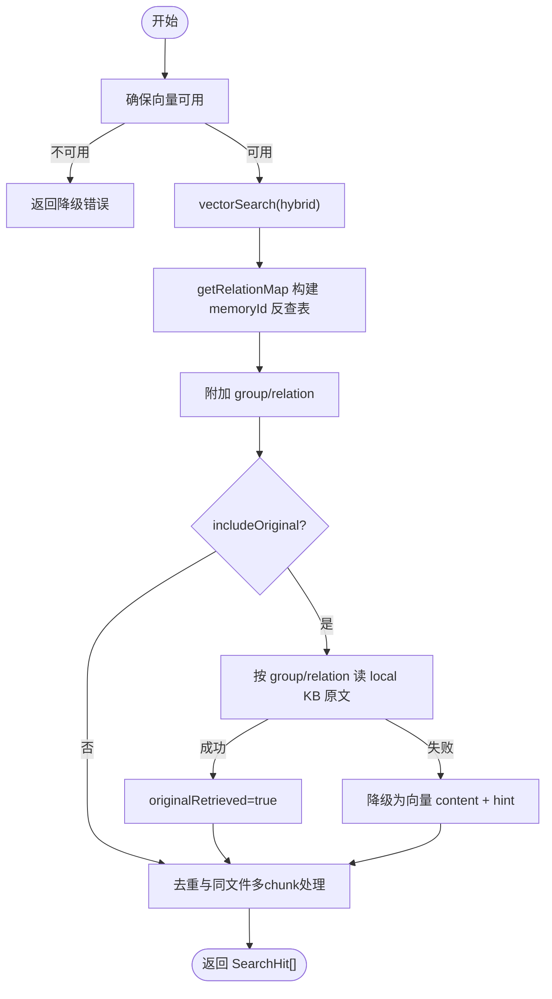
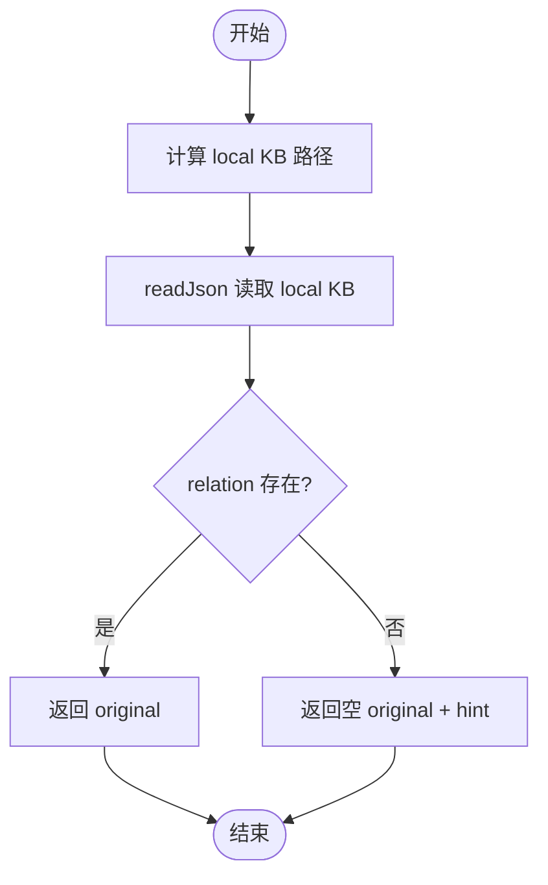
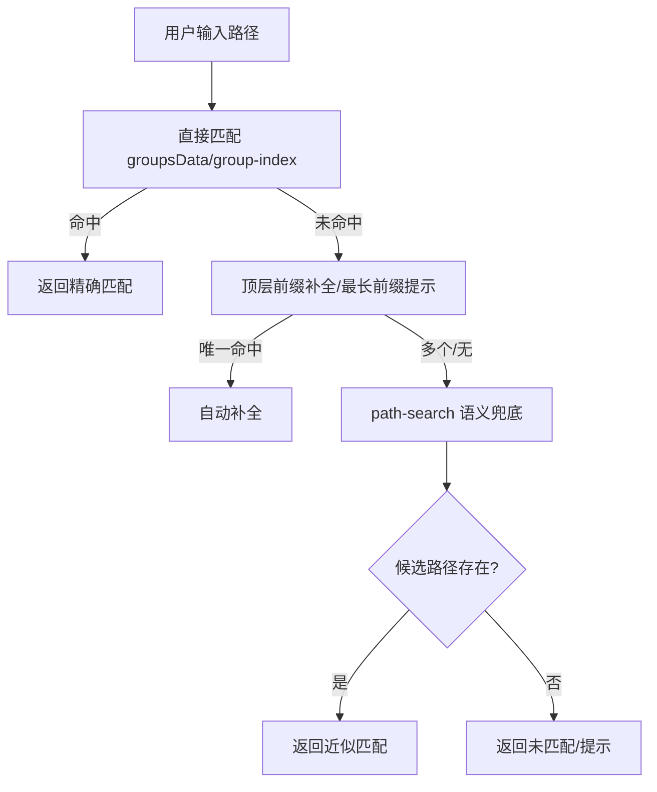
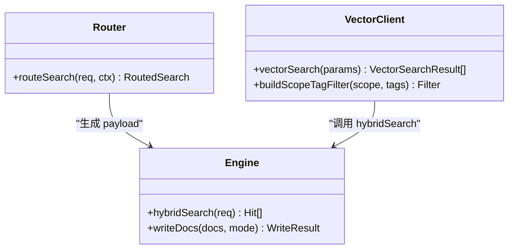
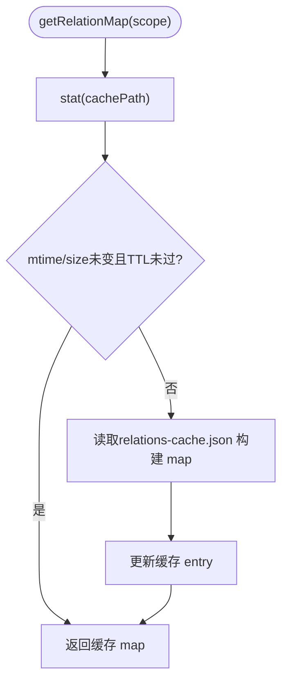
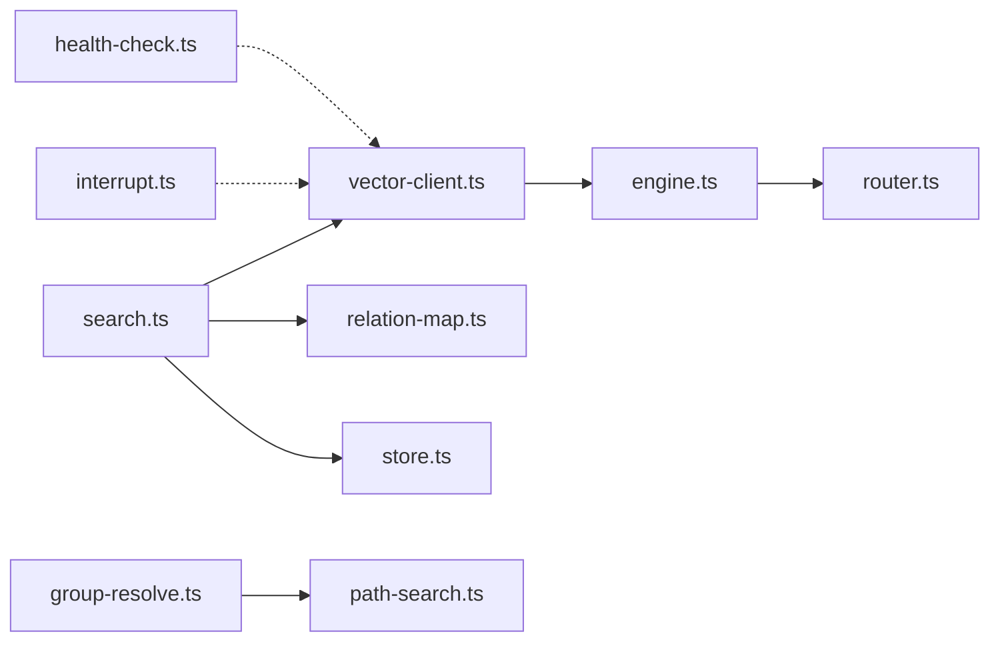
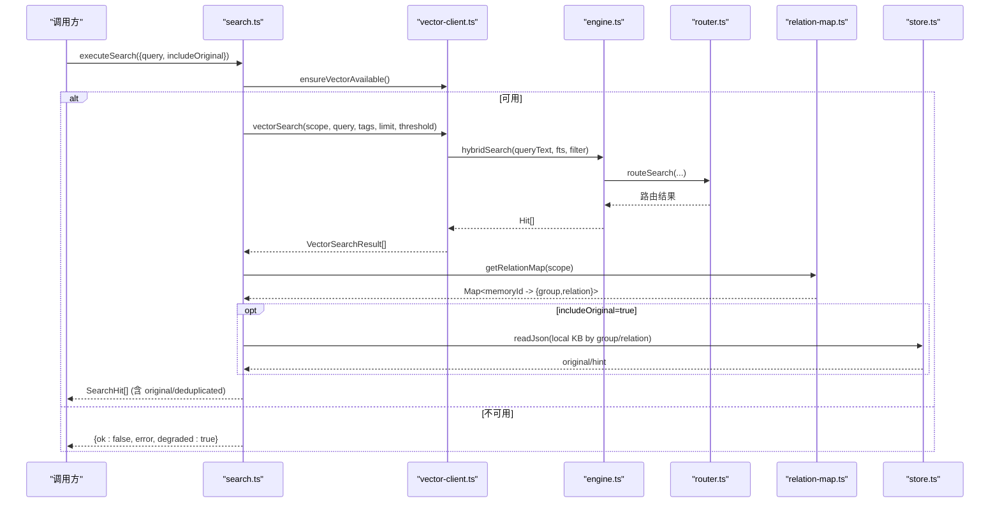

# 双路径查询机制

<cite>
**本文引用的文件列表**
- [search.ts](file://src/search.ts)
- [vector-client.ts](file://src/lib/vector-client.ts)
- [engine.ts](file://src/zvec-engine/engine.ts)
- [router.ts](file://src/zvec-engine/search/router.ts)
- [path-search.ts](file://src/lib/path-search.ts)
- [relation-map.ts](file://src/lib/relation-map.ts)
- [group-resolve.ts](file://src/lib/group-resolve.ts)
- [store.ts](file://src/lib/store.ts)
- [interrupt.ts](file://src/lib/interrupt.ts)
- [health-check.ts](file://src/lib/health-check.ts)
</cite>

## 目录
1. [引言](#引言)
2. [项目结构](#项目结构)
3. [核心组件](#核心组件)
4. [架构总览](#架构总览)
5. [详细组件分析](#详细组件分析)
6. [依赖关系分析](#依赖关系分析)
7. [性能考量](#性能考量)
8. [故障处理与恢复](#故障处理与恢复)
9. [结论](#结论)
10. [附录：代码级流程图](#附录代码级流程图)

## 引言
本文件聚焦“双路径查询机制”的核心实现，系统性解析两种查询路径：
- 索引直查（已知路径→原文）：通过 Group/Relation 定位文件级原文。
- 语义检索（自然语言→向量→反查原文）：通过 hybridSearch 召回，再按 memoryId 反查 relations-cache 定位原文。

我们将说明路径解析算法、向量检索过程、memoryId 反查机制、适用场景与性能特点、数据一致性保证、降级策略以及故障处理与监控细节。

## 项目结构
围绕双路径查询的关键模块分布如下：
- 入口与编排：search.ts 提供 executeSearch，统一调度向量检索与原文召回。
- 向量层：vector-client.ts 封装 ZvecEngine，提供 vectorSearch、ensureVectorAvailable、批量存储等能力。
- 引擎层：zvec-engine/engine.ts 负责 create/open/probe、写入与检索编排、路由到 worker。
- 检索路由：zvec-engine/search/router.ts 将请求路由为单路或混合检索（hybrid）。
- 路径语义兜底：lib/path-search.ts 对 Group/Relation 进行近似匹配。
- 原文定位：lib/relation-map.ts 维护 memoryId → {group, relation} 的反查映射（带 TTL 缓存）。
- 本地 KB 读取：lib/store.ts 提供 readJson 等 JSON 读写与 scope 初始化。
- 健康与中断：lib/health-check.ts 与 lib/interrupt.ts 提供健康诊断与导入中断引导。

图表来源
- [search.ts:70-199](file://src/search.ts#L70-L199)
- [vector-client.ts:477-506](file://src/lib/vector-client.ts#L477-L506)
- [engine.ts:298-312](file://src/zvec-engine/engine.ts#L298-L312)
- [router.ts:43-127](file://src/zvec-engine/search/router.ts#L43-L127)
- [relation-map.ts:48-78](file://src/lib/relation-map.ts#L48-L78)
- [store.ts:23-49](file://src/lib/store.ts#L23-L49)
- [path-search.ts:47-87](file://src/lib/path-search.ts#L47-L87)
- [group-resolve.ts:117-219](file://src/lib/group-resolve.ts#L117-L219)

章节来源
- [search.ts:70-199](file://src/search.ts#L70-L199)
- [vector-client.ts:477-506](file://src/lib/vector-client.ts#L477-L506)
- [engine.ts:298-312](file://src/zvec-engine/engine.ts#L298-L312)
- [router.ts:43-127](file://src/zvec-engine/search/router.ts#L43-L127)
- [relation-map.ts:48-78](file://src/lib/relation-map.ts#L48-L78)
- [store.ts:23-49](file://src/lib/store.ts#L23-L49)
- [path-search.ts:47-87](file://src/lib/path-search.ts#L47-L87)
- [group-resolve.ts:117-219](file://src/lib/group-resolve.ts#L117-L219)

## 核心组件
- 搜索编排器（search.ts）
  - 负责 scope 校验、向量可用性检测、多 tag 分查与优先级合并、memoryId 反查、原文召回与去重。
- 向量客户端（vector-client.ts）
  - 封装 ZvecEngine，提供 hybridSearch、ensureVectorAvailable、批量存储、锁重试与空闲释放等。
- 引擎门面（engine.ts）
  - 管理 create/open/probe、写入批处理与失败粒度、检索路由、worker 通信。
- 检索路由（router.ts）
  - 根据是否含 queryText/vector/fts 选择单路向量、单路 FTS 或混合两路 RRF。
- 路径语义兜底（path-search.ts）
  - 对 Group/Relation 文本做近似匹配，用于路径解析的兜底。
- 原文反查（relation-map.ts）
  - 构建 memoryId → {group, relation} 的映射，支持 TTL 与 mtime/size 失效。
- 本地存储（store.ts）
  - 提供 JSON 读取与 WAL 写入，支撑 local KB 原文获取。
- 健康与中断（health-check.ts, interrupt.ts）
  - 健康检查三合一（连通性/密钥/维度），导入中断标记与并发锁。

章节来源
- [search.ts:70-199](file://src/search.ts#L70-L199)
- [vector-client.ts:477-506](file://src/lib/vector-client.ts#L477-L506)
- [engine.ts:298-312](file://src/zvec-engine/engine.ts#L298-L312)
- [router.ts:43-127](file://src/zvec-engine/search/router.ts#L43-L127)
- [path-search.ts:47-87](file://src/lib/path-search.ts#L47-L87)
- [relation-map.ts:48-78](file://src/lib/relation-map.ts#L48-L78)
- [store.ts:23-49](file://src/lib/store.ts#L23-L49)
- [health-check.ts:148-213](file://src/lib/health-check.ts#L148-L213)
- [interrupt.ts:71-78](file://src/lib/interrupt.ts#L71-L78)

## 架构总览
双路径查询在 search.ts 中汇聚：
- 语义检索路径：调用 vectorSearch（hybridSearch），得到 memoryId/content/score，再通过 getRelationMap 反查 group/relation，必要时从 local KB 读取原文。
- 索引直查路径：当已知 group/relation 时，直接通过 store.readJson 定位并返回原文；若缺失则提示重建。

图表来源
- [search.ts:70-199](file://src/search.ts#L70-L199)
- [vector-client.ts:477-506](file://src/lib/vector-client.ts#L477-L506)
- [engine.ts:298-312](file://src/zvec-engine/engine.ts#L298-L312)
- [router.ts:43-127](file://src/zvec-engine/search/router.ts#L43-L127)
- [relation-map.ts:48-78](file://src/lib/relation-map.ts#L48-L78)
- [store.ts:23-49](file://src/lib/store.ts#L23-L49)

## 详细组件分析

### 语义检索路径（自然语言→向量→反查原文）
- 入口与参数
  - executeSearch 接收 query、limit、threshold、tags、includeOriginal。
  - 先 ensureVectorAvailable 检测服务可用性，失败返回降级结果。
- 向量检索
  - vectorSearch 使用 hybridSearch：queryText 语义 + fts 关键词 + RRF 融合。
  - 支持按 scope + tag 过滤；未传 tags 时默认搜索全部 tag。
- 多 tag 优先级与合并
  - 未传 tags 时，先列出所有 tag，分别检索并按 TAG_PRIORITY 排序合并（ki-search > ki-relation > ki-path）。
- memoryId 反查
  - getRelationMap 构建 memoryId → {group, relation} 映射（TTL+mtime/size 失效）。
  - 命中后附加 group/relation，便于后续原文定位。
- 原文召回与降级
  - includeOriginal=true 时，按 group/relation 读取 local KB 原文；缺失则返回 hint 并降级为向量 content。
- 去重
  - 同一 (group, relation) 多 tag 重复命中保留最高 score。
  - 同一文件多 chunk 命中仅首次携带 original，其余标注 deduplicated。

图表来源
- [search.ts:70-199](file://src/search.ts#L70-L199)
- [vector-client.ts:477-506](file://src/lib/vector-client.ts#L477-L506)
- [relation-map.ts:48-78](file://src/lib/relation-map.ts#L48-L78)
- [store.ts:23-49](file://src/lib/store.ts#L23-L49)

章节来源
- [search.ts:70-199](file://src/search.ts#L70-L199)
- [vector-client.ts:477-506](file://src/lib/vector-client.ts#L477-L506)
- [relation-map.ts:48-78](file://src/lib/relation-map.ts#L48-L78)
- [store.ts:23-49](file://src/lib/store.ts#L23-L49)

### 索引直查路径（已知路径→原文）
- 适用场景
  - 已知 group/relation（例如从 UI 选择或上游命令传入），需要快速返回文件级原文。
- 执行流程
  - 通过 getLocalKbDir(scope, group) 定位 local KB 目录。
  - readJson 读取 relations-cache 或对应文件映射，按 relation 键取值。
  - 存在则返回 original；不存在则返回空 original 与 hint（建议 sync-relation 或 rebuild-vector）。
- 与语义检索的关系
  - 语义检索命中后，若 includeOriginal=true，也会走此路径取原文；若反查缺失，则回退向量 content。

图表来源
- [search.ts:54-68](file://src/search.ts#L54-L68)
- [store.ts:23-49](file://src/lib/store.ts#L23-L49)

章节来源
- [search.ts:54-68](file://src/search.ts#L54-L68)
- [store.ts:23-49](file://src/lib/store.ts#L23-L49)

### 路径解析算法（Group/Relation 语义兜底）
- 目标
  - 当精确匹配失败时，通过向量语义搜索找到最接近的真实路径或 Relation 名称。
- 算法要点
  - 使用 path-search.searchPath 以 ki-path/ki-relation 标签检索 top-1。
  - 阈值默认 0（RRF 融合分量级远小于 1），由下游存在性二次校验保证质量。
  - 提取 rawText 中的路径/名称，供 resolveGroupPath 决策。
- 集成点
  - group-resolve.resolveGroupPath 在直接匹配、整段补全、部分匹配均失败后，尝试向量兜底，若候选路径存在于 group-index/groupsData 则接受。

图表来源
- [path-search.ts:47-87](file://src/lib/path-search.ts#L47-L87)
- [group-resolve.ts:117-219](file://src/lib/group-resolve.ts#L117-L219)

章节来源
- [path-search.ts:47-87](file://src/lib/path-search.ts#L47-L87)
- [group-resolve.ts:117-219](file://src/lib/group-resolve.ts#L117-L219)

### 向量检索过程（hybridSearch 与路由）
- 路由规则
  - 同时有 fts 与 queryText/vector → multiQuery 两路 RRF（hybrid）。
  - 缺 fts → 退单路向量。
  - 缺 queryText/vector → 退单路 FTS。
  - 三者皆缺 → 报错。
  - queryText 与 vector 互斥。
- 嵌入与批处理
  - engine.writeDocs 对需 embed 的文本按 EMBED_BATCH_SIZE 切小批，批内去重减少重复 HTTP 调用。
  - 失败项进入 errors，成功项继续写入，保证最小失败单元。
- 过滤与输出
  - vector-client 构建 scope+tag 过滤条件，hybridSearch 返回 Hit，映射为 VectorSearchResult。

图表来源
- [router.ts:43-127](file://src/zvec-engine/search/router.ts#L43-L127)
- [engine.ts:330-450](file://src/zvec-engine/engine.ts#L330-L450)
- [vector-client.ts:621-628](file://src/lib/vector-client.ts#L621-L628)

章节来源
- [router.ts:43-127](file://src/zvec-engine/search/router.ts#L43-L127)
- [engine.ts:330-450](file://src/zvec-engine/engine.ts#L330-L450)
- [vector-client.ts:621-628](file://src/lib/vector-client.ts#L621-L628)

### memoryId 反查机制
- 作用
  - 将向量命中的 memoryId 映射回 {group, relation}，以便定位原文。
- 缓存策略
  - 模块级 Map<scope, entry>，entry 包含 builtAt/mtimeMs/size/map。
  - 失效条件：文件被写入（mtime/size 变化）、TTL 过期。
  - 懒构建：首次访问 O(N)，后续 O(1)。
- 兼容旧数据
  - 优先读取 memoryIds 多值数组，回退到 memoryId 单值。

图表来源
- [relation-map.ts:48-78](file://src/lib/relation-map.ts#L48-L78)
- [relation-map.ts:80-114](file://src/lib/relation-map.ts#L80-L114)

章节来源
- [relation-map.ts:48-78](file://src/lib/relation-map.ts#L48-L78)
- [relation-map.ts:80-114](file://src/lib/relation-map.ts#L80-L114)

### 适用场景与性能特点
- 语义检索
  - 适合自然语言查询、模糊意图、跨文档关联发现。
  - 性能：hybridSearch 融合语义与关键词，RRF 提升召回质量；多 tag 分查可能增加开销，但可通过 tags 参数精准过滤。
- 索引直查
  - 适合已知路径/关系的快速原文定位。
  - 性能：O(1) 文件读取，极快；依赖 relations-cache/local KB 完整性。
- 数据一致性
  - vectorStore/vectorBulkStore 幂等 upsert（docId 含 text+scope+tag），避免重复。
  - relation-map 通过 mtime/size/TTL 保障反查映射新鲜度。
  - 多 tag 写入导致重复命中时，search.ts 按 (group, relation) 去重保留最高 score。

章节来源
- [search.ts:94-121](file://src/search.ts#L94-L121)
- [search.ts:159-194](file://src/search.ts#L159-L194)
- [vector-client.ts:240-242](file://src/lib/vector-client.ts#L240-L242)
- [relation-map.ts:60-78](file://src/lib/relation-map.ts#L60-L78)

### 路径选择与降级策略
- 路径选择
  - 若 includeOriginal=true 且能定位 group/relation，优先走索引直查取原文；否则走语义检索后再反查。
  - 若向量服务不可用，返回降级结果（degraded=true），上层可提示用户。
- 降级策略
  - 原文不可用：返回向量 content 作为兜底，并附带 originalHint。
  - 路径解析失败：path-search 静默降级返回 null，group-resolve 继续原有流程。
  - 向量库占用/损坏：ensureVectorAvailable 返回 LOCKED/CORRUPTED，给出修复引导。

章节来源
- [search.ts:84-92](file://src/search.ts#L84-L92)
- [search.ts:137-155](file://src/search.ts#L137-L155)
- [path-search.ts:82-86](file://src/lib/path-search.ts#L82-L86)
- [vector-client.ts:420-467](file://src/lib/vector-client.ts#L420-L467)

## 依赖关系分析
- search.ts 依赖 vector-client.ts 进行向量检索与可用性检测，依赖 relation-map.ts 进行 memoryId 反查，依赖 store.ts 读取 local KB。
- vector-client.ts 依赖 zvec-engine/engine.ts 完成底层操作，依赖 router.ts 进行检索路由。
- group-resolve.ts 依赖 path-search.ts 进行路径语义兜底。
- health-check.ts 与 interrupt.ts 提供健康诊断与导入中断引导，贯穿向量服务可用性判断。

图表来源
- [search.ts:70-199](file://src/search.ts#L70-L199)
- [vector-client.ts:477-506](file://src/lib/vector-client.ts#L477-L506)
- [engine.ts:298-312](file://src/zvec-engine/engine.ts#L298-L312)
- [router.ts:43-127](file://src/zvec-engine/search/router.ts#L43-L127)
- [group-resolve.ts:117-219](file://src/lib/group-resolve.ts#L117-L219)
- [path-search.ts:47-87](file://src/lib/path-search.ts#L47-L87)
- [health-check.ts:148-213](file://src/lib/health-check.ts#L148-L213)
- [interrupt.ts:71-78](file://src/lib/interrupt.ts#L71-L78)

章节来源
- [search.ts:70-199](file://src/search.ts#L70-L199)
- [vector-client.ts:477-506](file://src/lib/vector-client.ts#L477-L506)
- [engine.ts:298-312](file://src/zvec-engine/engine.ts#L298-L312)
- [router.ts:43-127](file://src/zvec-engine/search/router.ts#L43-L127)
- [group-resolve.ts:117-219](file://src/lib/group-resolve.ts#L117-L219)
- [path-search.ts:47-87](file://src/lib/path-search.ts#L47-L87)
- [health-check.ts:148-213](file://src/lib/health-check.ts#L148-L213)
- [interrupt.ts:71-78](file://src/lib/interrupt.ts#L71-L78)

## 性能考量
- 向量检索
  - hybridSearch 融合语义与关键词，RRF 提升召回质量；topk 限制控制返回量。
  - embedding 批大小 EMBED_BATCH_SIZE=64，失败粒度小，避免整批失败。
  - 多 tag 分查可能带来额外开销，建议显式传入 tags 缩小范围。
- 原文定位
  - 索引直查为 O(1) 文件读取，极快；依赖 relations-cache/local KB 完整性。
- 缓存与复用
  - relation-map 带 TTL+mtime/size 失效，避免频繁重建。
  - vector-client 进程内 engine 单例，CLI per-call 关闭，常驻 MCP 支持空闲释放锁。
- 锁与并发
  - probeWithRetry 撞锁重试；enableIdleClose 空闲超时释放锁，错开共享向量库。

章节来源
- [engine.ts:62-66](file://src/zvec-engine/engine.ts#L62-L66)
- [engine.ts:351-384](file://src/zvec-engine/engine.ts#L351-L384)
- [vector-client.ts:93-104](file://src/lib/vector-client.ts#L93-L104)
- [vector-client.ts:164-181](file://src/lib/vector-client.ts#L164-L181)
- [relation-map.ts:60-78](file://src/lib/relation-map.ts#L60-L78)

## 故障处理与恢复
- 向量服务不可用
  - ensureVectorAvailable 返回 available=false，并给出 reason/code（LOCKED/CORRUPTED/PROBE_ERROR）。
  - CLI 返回 {ok:false, error, degraded:true}，上层可提示用户。
- 原文不可用
  - fetchOriginal 失败返回空 original 与 hint；search.ts 降级为向量 content 并标注 originalRetrieved=false。
- 路径解析失败
  - path-search 捕获异常静默降级返回 null；group-resolve 继续原有流程。
- 导入中断与并发锁
  - interruptGuidance 检测未完成导入并给出重建引导；acquireImportLock/releaseImportLock 防止并发导入。
- 健康检查
  - runHealthCheck 三合一验证 embedding（URL/密钥/维度），zvec collection 非空判定，scopes.default 配置检查。

章节来源
- [vector-client.ts:420-467](file://src/lib/vector-client.ts#L420-L467)
- [search.ts:137-155](file://src/search.ts#L137-L155)
- [path-search.ts:82-86](file://src/lib/path-search.ts#L82-L86)
- [interrupt.ts:71-78](file://src/lib/interrupt.ts#L71-L78)
- [interrupt.ts:92-130](file://src/lib/interrupt.ts#L92-L130)
- [health-check.ts:148-213](file://src/lib/health-check.ts#L148-L213)

## 结论
双路径查询机制通过“语义检索 + 索引直查”的组合，兼顾了灵活性与性能：
- 语义检索适合自然语言与模糊意图，借助 hybridSearch 与 RRF 提升召回质量。
- 索引直查适合已知路径的快速原文定位，O(1) 读取，极致性能。
- memoryId 反查机制结合 TTL 与 mtime/size 失效，保证定位准确性与时效性。
- 多层降级策略（原文不可用、向量不可用、路径解析失败）确保系统健壮性。
- 健康检查与中断标记提供可观测性与自愈引导，便于运维与排障。

## 附录：代码级流程图

### 语义检索主流程（search.ts）

图表来源
- [search.ts:70-199](file://src/search.ts#L70-L199)
- [vector-client.ts:477-506](file://src/lib/vector-client.ts#L477-L506)
- [engine.ts:298-312](file://src/zvec-engine/engine.ts#L298-L312)
- [router.ts:43-127](file://src/zvec-engine/search/router.ts#L43-L127)
- [relation-map.ts:48-78](file://src/lib/relation-map.ts#L48-L78)
- [store.ts:23-49](file://src/lib/store.ts#L23-L49)