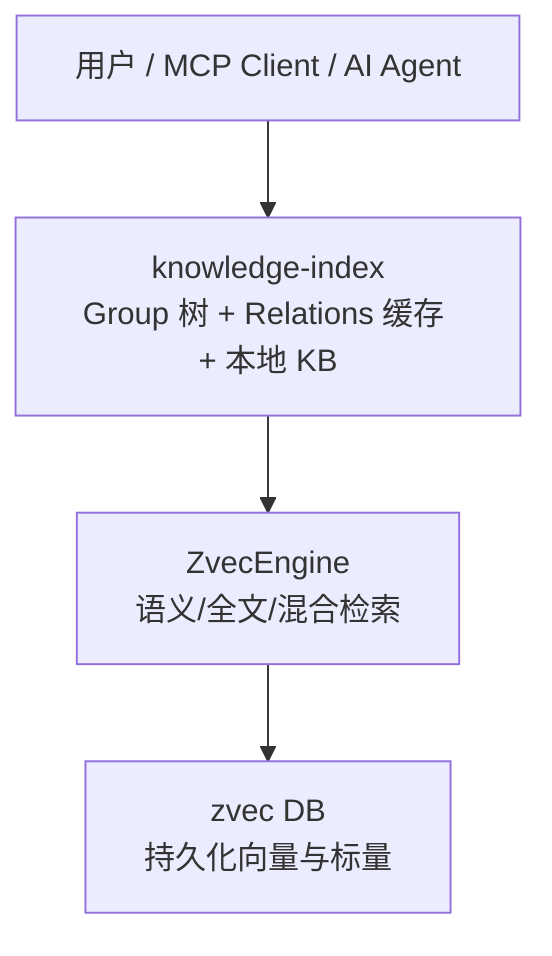
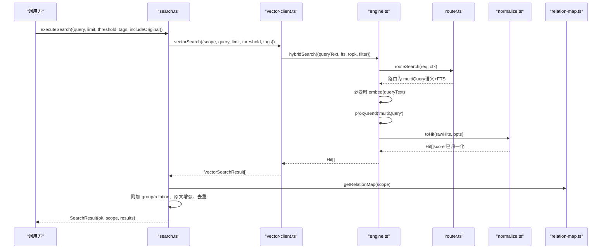
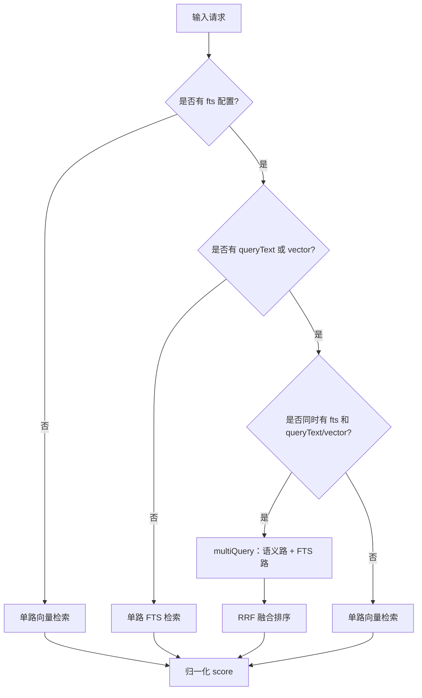
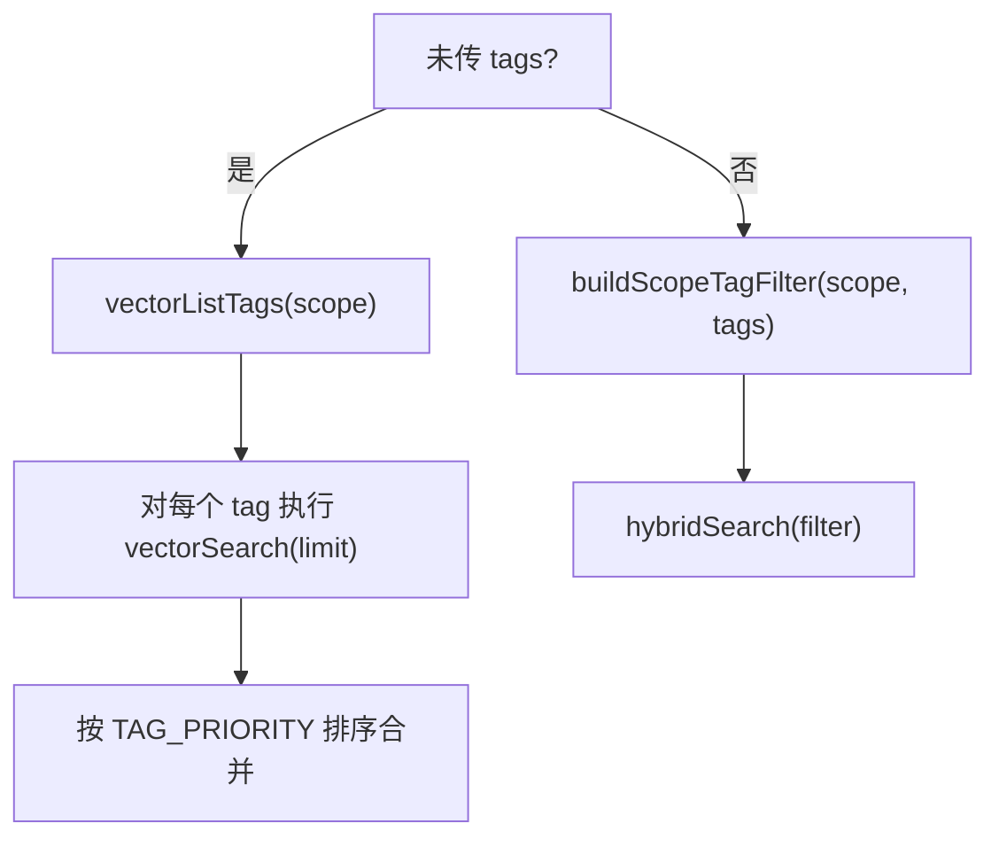
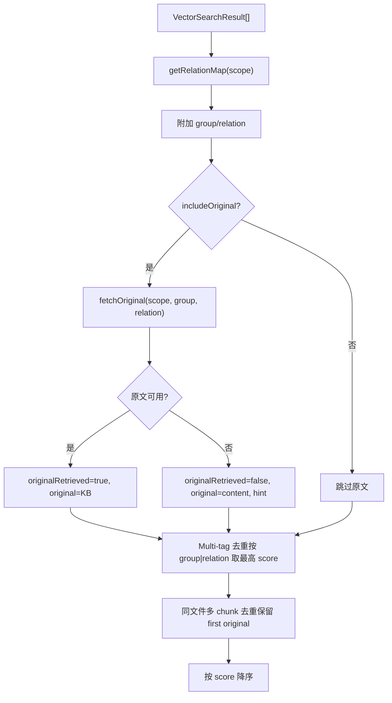
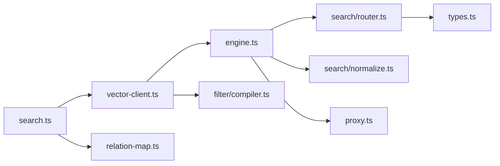

# 搜索与检索系统

<cite>
**本文引用的文件**
- [src/search.ts](file://src/search.ts)
- [src/lib/vector-client.ts](file://src/lib/vector-client.ts)
- [src/zvec-engine/engine.ts](file://src/zvec-engine/engine.ts)
- [src/zvec-engine/search/router.ts](file://src/zvec-engine/search/router.ts)
- [src/zvec-engine/search/normalize.ts](file://src/zvec-engine/search/normalize.ts)
- [src/zvec-engine/filter/compiler.ts](file://src/zvec-engine/filter/compiler.ts)
- [src/zvec-engine/types.ts](file://src/zvec-engine/types.ts)
- [src/lib/relation-map.ts](file://src/lib/relation-map.ts)
- [src/lib/scoring.ts](file://src/lib/scoring.ts)
- [README.md](file://README.md)
- [docs/architecture.md](file://docs/architecture.md)
</cite>

## 目录
1. [引言](#引言)
2. [项目结构](#项目结构)
3. [核心组件](#核心组件)
4. [架构总览](#架构总览)
5. [详细组件分析](#详细组件分析)
6. [依赖关系分析](#依赖关系分析)
7. [性能考量](#性能考量)
8. [故障排查指南](#故障排查指南)
9. [结论](#结论)
10. [附录](#附录)

## 引言
本文件系统性地解析知识索引与检索系统的架构与实现，重点说明双路径查询机制、混合检索算法（语义向量检索、BM25 全文检索、RRF 融合排序）、标签过滤与优先级策略、结果增强（原文定位、去重、相关性评分），并给出性能优化建议、最佳实践与实际使用示例。

## 项目结构
系统由三层构成：
- 交付层（knowledge-index）：Group 树导航、Relation 热缓存、本地 KB 原文交付、CLI/MCP 命令。
- 引擎层（zvec 引擎）：进程内向量引擎，提供语义检索、BM25 全文检索、混合检索与 RRF 融合。
- 存储层（zvec DB）：持久化向量与标量字段，支持过滤与多路召回。

图表来源
- [docs/architecture.md:11-26](file://docs/architecture.md#L11-L26)

章节来源
- [docs/architecture.md:1-169](file://docs/architecture.md#L1-169)
- [README.md:35-104](file://README.md#L35-L104)

## 核心组件
- 搜索入口与流程编排：search.ts 负责 CLI/MCP 入口、标签优先级、原文增强、去重等。
- 向量客户端：vector-client.ts 封装 zvec 引擎，构建 scope/tag 过滤、hybridSearch 调用、可用性检测与空闲锁释放。
- 引擎门面：engine.ts 统一 upsert/insert/update/delete/fetch/listIds，以及 search 路由与 embed 批处理。
- 检索路由：router.ts 将请求映射为单路或两路 multiQuery，决定是否需要 embed、是否走 FTS。
- 分数归一化：normalize.ts 将向量距离转换为 score，FTS/hybrid 直通。
- 过滤器编译：compiler.ts 将结构化 Filter 编译为类 SQL 字符串，带白名单与深度限制。
- 类型定义：types.ts 定义配置、文档、Filter、检索请求、Hit、WriteResult 等。
- 原文反查映射：relation-map.ts 提供 memoryId → {group, relation} 的 TTL 缓存映射。
- 评分与冷热分区：scoring.ts 提供 useCount 衰减、冷热分区、边界衰减等。

章节来源
- [src/search.ts:1-248](file://src/search.ts#L1-L248)
- [src/lib/vector-client.ts:1-754](file://src/lib/vector-client.ts#L1-L754)
- [src/zvec-engine/engine.ts:1-569](file://src/zvec-engine/engine.ts#L1-L569)
- [src/zvec-engine/search/router.ts:1-191](file://src/zvec-engine/search/router.ts#L1-L191)
- [src/zvec-engine/search/normalize.ts:1-64](file://src/zvec-engine/search/normalize.ts#L1-L64)
- [src/zvec-engine/filter/compiler.ts:1-102](file://src/zvec-engine/filter/compiler.ts#L1-L102)
- [src/zvec-engine/types.ts:1-187](file://src/zvec-engine/types.ts#L1-L187)
- [src/lib/relation-map.ts:1-120](file://src/lib/relation-map.ts#L1-L120)
- [src/lib/scoring.ts:1-275](file://src/lib/scoring.ts#L1-L275)

## 架构总览
系统采用“双路径查询”：
- 索引直查：已知 Group/Relation 路径时，直接读取本地 KB 原文，零误差、无噪声。
- 语义检索：自然语言查询 → 向量化 → 混合检索（语义+BM25+RRF）→ 按 memoryId 反查 relations-cache → 定位 group/relation → 可选返回原文。

图表来源
- [src/search.ts:70-199](file://src/search.ts#L70-L199)
- [src/lib/vector-client.ts:477-506](file://src/lib/vector-client.ts#L477-L506)
- [src/zvec-engine/engine.ts:454-495](file://src/zvec-engine/engine.ts#L454-L495)
- [src/zvec-engine/search/router.ts:43-127](file://src/zvec-engine/search/router.ts#L43-L127)
- [src/zvec-engine/search/normalize.ts:38-63](file://src/zvec-engine/search/normalize.ts#L38-L63)
- [src/lib/relation-map.ts:48-78](file://src/lib/relation-map.ts#L48-L78)

## 详细组件分析

### 双路径查询机制
- 索引直查（已知路径→原文）
  - 通过 Group/Relation 直接读取本地 KB 原文，无需向量检索，保证 100% 命中与零噪声。
  - 适用于精确路径场景，如“项目/告警系统设计/告警处理服务”。
- 语义检索（自然语言→向量→反查原文）
  - 通过 vector-client.ts 的 vectorSearch 调用 engine.hybridSearch，同时传入 queryText 与 fts=queryText，触发两路召回。
  - 结果经 normalize.ts 归一化为统一 score；再通过 relation-map.ts 反查 memoryId 对应的 group/relation，按需返回原文。

章节来源
- [README.md:64-104](file://README.md#L64-L104)
- [src/lib/vector-client.ts:477-506](file://src/lib/vector-client.ts#L477-L506)
- [src/search.ts:123-199](file://src/search.ts#L123-L199)

### 混合检索算法（语义向量 + BM25 + RRF）
- 语义向量检索
  - 通过 router.ts 判定是否需要 embed；若传入 queryText，则主线程调用 embedding.embed 生成 dense vector。
  - 向量路 score = 1/(1+distance)，distance ∈ [0,2]，score ∈ [1/3, 1]。
- BM25 全文检索
  - 当集合配置了 fts 字段（content 字段，jieba 分词），可走 FTS 路；queryText 同时作为 fts 串进行关键词匹配。
- RRF 融合排序
  - 当同时具备 queryText/vector 与 fts 时，router.ts 输出 multiQuery，携带 rerank.rerankRrf.rankConstant（默认 60）。
  - 融合基于排名位置而非原始分数，适合不同度量/尺度的多路结果合并。

图表来源
- [src/zvec-engine/search/router.ts:43-127](file://src/zvec-engine/search/router.ts#L43-L127)
- [src/zvec-engine/search/normalize.ts:16-25](file://src/zvec-engine/search/normalize.ts#L16-L25)
- [src/zvec-engine/engine.ts:454-495](file://src/zvec-engine/engine.ts#L454-L495)

章节来源
- [src/zvec-engine/search/router.ts:43-127](file://src/zvec-engine/search/router.ts#L43-L127)
- [src/zvec-engine/search/normalize.ts:16-63](file://src/zvec-engine/search/normalize.ts#L16-L63)
- [src/zvec-engine/engine.ts:454-495](file://src/zvec-engine/engine.ts#L454-L495)

### 标签过滤机制与优先级策略
- 标签过滤
  - vector-client.ts 构建 scope + tag 过滤：scope 必等；tags 非空时以 OR 组合；tag 写入/查询均小写化，实现大小写不敏感。
  - 过滤条件经 compiler.ts 编译为类 SQL 字符串，带字段白名单与嵌套深度限制，防止注入与 DoS。
- 优先级策略
  - search.ts 定义 TAG_PRIORITY = ['ki-search', 'ki-relation', 'ki-path']。
  - 未显式传 tags 时，先枚举所有 tag，逐 tag 执行 vectorSearch（每个 tag 最多取 limit 条），再按优先级拼接结果，确保内容优先。

图表来源
- [src/search.ts:20-29](file://src/search.ts#L20-L29)
- [src/search.ts:94-121](file://src/search.ts#L94-L121)
- [src/lib/vector-client.ts:618-628](file://src/lib/vector-client.ts#L618-L628)
- [src/zvec-engine/filter/compiler.ts:31-78](file://src/zvec-engine/filter/compiler.ts#L31-L78)

章节来源
- [src/search.ts:20-29](file://src/search.ts#L20-L29)
- [src/search.ts:94-121](file://src/search.ts#L94-L121)
- [src/lib/vector-client.ts:618-628](file://src/lib/vector-client.ts#L618-L628)
- [src/zvec-engine/filter/compiler.ts:31-78](file://src/zvec-engine/filter/compiler.ts#L31-L78)

### 结果增强过程（原文定位、去重、相关性评分）
- 原文定位
  - 通过 relation-map.ts 的 TTL 缓存 Map<memoryId, {group, relation}>，将向量结果关联到 Group 与文件级 relation。
  - 若 includeOriginal=true，则按 (group, relation) 从 local KB 读取原文；失败时降级返回向量 content 并提示。
- 去重处理
  - Multi-tag 去重：同一 (group, relation) 因多 tag 写入产生多条命中，保留 score 最高的一条。
  - 同文件多 chunk 去重：同一文件多个 chunk 命中时，仅第一条返回 original，其余标记 deduplicated。
- 相关性评分
  - 向量路：distance → score = 1/(1+distance)。
  - FTS 路：BM25 原值。
  - 混合路：RRF 融合分。
  - 最终结果按 score 降序排列。

图表来源
- [src/search.ts:123-199](file://src/search.ts#L123-L199)
- [src/lib/relation-map.ts:48-78](file://src/lib/relation-map.ts#L48-L78)
- [src/zvec-engine/search/normalize.ts:38-63](file://src/zvec-engine/search/normalize.ts#L38-L63)

章节来源
- [src/search.ts:123-199](file://src/search.ts#L123-L199)
- [src/lib/relation-map.ts:48-78](file://src/lib/relation-map.ts#L48-L78)
- [src/zvec-engine/search/normalize.ts:38-63](file://src/zvec-engine/search/normalize.ts#L38-L63)

### 检索路由与嵌入批处理
- 路由决策
  - 若存在 fts 且同时有 queryText/vector → multiQuery（两路 RRF）。
  - 缺 fts → 退化为单路向量。
  - 缺 queryText/vector → 退化为单路 FTS。
  - 三者皆缺 → 抛出无效搜索错误。
  - queryText 与 vector 互斥。
- 嵌入批处理
  - engine.ts 将需要 embed 的文本按 EMBED_BATCH_SIZE 切分，批内去重相同 text，减少重复 HTTP 调用。
  - 失败粒度控制：某批失败仅标记该批 doc，不影响其他批次与 noEmbed 组。

章节来源
- [src/zvec-engine/search/router.ts:43-127](file://src/zvec-engine/search/router.ts#L43-L127)
- [src/zvec-engine/engine.ts:330-450](file://src/zvec-engine/engine.ts#L330-L450)

### 过滤器编译与安全
- 字段白名单：仅允许 schema 声明的 scalarFields 与 fts.field。
- 值校验：禁止 null/undefined/NaN/Infinity，类型限定 string/number/boolean。
- 嵌套深度限制：MAX_DEPTH=32，防 DoS。
- 转义渲染：字符串值单引号包裹，内部 ' → \'。

章节来源
- [src/zvec-engine/filter/compiler.ts:21-102](file://src/zvec-engine/filter/compiler.ts#L21-L102)

### 评分与冷热治理（辅助能力）
- calculateScore：useCount / (1 + hoursSinceLastUse / halfLifeHours)。
- recordUse：5 分钟防刷 + MAX_USE_COUNT 上限。
- hybridPartition/partitionByScore：新兴热区 + 历史热门 + 常温/冷区比例分配 + 上限截断。
- boundaryDecay：新内容进入热区时的边界衰减，避免热区膨胀。

章节来源
- [src/lib/scoring.ts:40-275](file://src/lib/scoring.ts#L40-L275)

## 依赖关系分析
- search.ts 依赖 vector-client.ts（向量检索）、relation-map.ts（原文定位）、config/scope（范围解析）。
- vector-client.ts 依赖 engine.ts（zvec 引擎）、filter/compiler.ts（过滤编译）、embedding provider（SiliconFlowProvider）。
- engine.ts 依赖 router.ts（检索路由）、normalize.ts（分数归一化）、proxy.ts（worker 通信）。
- router.ts 依赖 types.ts（请求/响应类型）、errors.js（异常类型）。
- relation-map.ts 依赖 scoring.ts（Relation 类型）、scope.ts（relations-cache 路径）。

图表来源
- [src/search.ts:1-248](file://src/search.ts#L1-L248)
- [src/lib/vector-client.ts:1-754](file://src/lib/vector-client.ts#L1-L754)
- [src/zvec-engine/engine.ts:1-569](file://src/zvec-engine/engine.ts#L1-L569)
- [src/zvec-engine/search/router.ts:1-191](file://src/zvec-engine/search/router.ts#L1-L191)
- [src/zvec-engine/search/normalize.ts:1-64](file://src/zvec-engine/search/normalize.ts#L1-L64)
- [src/zvec-engine/filter/compiler.ts:1-102](file://src/zvec-engine/filter/compiler.ts#L1-L102)
- [src/zvec-engine/types.ts:1-187](file://src/zvec-engine/types.ts#L1-L187)
- [src/lib/relation-map.ts:1-120](file://src/lib/relation-map.ts#L1-L120)

章节来源
- [src/search.ts:1-248](file://src/search.ts#L1-L248)
- [src/lib/vector-client.ts:1-754](file://src/lib/vector-client.ts#L1-L754)
- [src/zvec-engine/engine.ts:1-569](file://src/zvec-engine/engine.ts#L1-L569)
- [src/zvec-engine/search/router.ts:1-191](file://src/zvec-engine/search/router.ts#L1-L191)
- [src/zvec-engine/search/normalize.ts:1-64](file://src/zvec-engine/search/normalize.ts#L1-L64)
- [src/zvec-engine/filter/compiler.ts:1-102](file://src/zvec-engine/filter/compiler.ts#L1-L102)
- [src/zvec-engine/types.ts:1-187](file://src/zvec-engine/types.ts#L1-L187)
- [src/lib/relation-map.ts:1-120](file://src/lib/relation-map.ts#L1-L120)

## 性能考量
- 嵌入批处理与去重
  - 批大小 EMBED_BATCH_SIZE=64，批内相同 text 去重，减少重复 HTTP 调用。
  - 失败粒度控制：单批失败不影响其他批次。
- 向量库锁与并发
  - 单例 engine 管理，serializeEngineOp 串行化 probe/create/open/close，避免原生竞态阻塞。
  - 空闲释放锁（enableIdleClose）：常驻 MCP 空闲超时自动 closeEngine，让其他实例/CLI 错开抢锁。
  - 撞锁重试：probeWithRetry 检测到 locked 时等待并重试，最多 LOCK_RETRY_MAX=3 次。
- 过滤与路由优化
  - 过滤条件预编译，减少运行时开销。
  - 路由退化：缺 fts 退单路向量，缺 queryText/vector 退单路 FTS，降低不必要计算。
- 结果增强成本
  - relation-map 带 TTL 与 mtime/size 失效，首次 O(N) 构建，后续 O(1) 查找。
  - 原文获取仅在 includeOriginal=true 时执行，避免额外 IO。

章节来源
- [src/zvec-engine/engine.ts:330-450](file://src/zvec-engine/engine.ts#L330-L450)
- [src/lib/vector-client.ts:129-181](file://src/lib/vector-client.ts#L129-L181)
- [src/lib/vector-client.ts:187-216](file://src/lib/vector-client.ts#L187-L216)
- [src/lib/vector-client.ts:420-467](file://src/lib/vector-client.ts#L420-L467)
- [src/lib/relation-map.ts:8-17](file://src/lib/relation-map.ts#L8-L17)

## 故障排查指南
- 向量服务不可用
  - ensureVectorAvailable 检测 locked/corrupted/probe_error，返回 code 便于上层区分。
  - 常见原因：其他进程持锁、向量库损坏、初始化失败。
  - 处置：停止冲突进程、稍后重试、执行 rebuild-vector 或 restore 重建。
- worker 不可用自愈
  - withEngine 包装在途保护与空闲续期；检测到 worker not open 时重置 engine 并重试一次。
- 过滤非法
  - InvalidFilterError：字段不在白名单、值为 null/undefined/NaN/Infinity、嵌套过深。
- 更新不一致
  - InconsistentUpdateError：update 必须提供 dense vector 或 text；fts 开启时不能只传 vector。
- 原文不可用
  - fetchOriginal 失败时返回 hint，search 结果降级为向量 content，并标注 originalRetrieved=false。

章节来源
- [src/lib/vector-client.ts:420-467](file://src/lib/vector-client.ts#L420-L467)
- [src/lib/vector-client.ts:389-407](file://src/lib/vector-client.ts#L389-L407)
- [src/zvec-engine/filter/compiler.ts:31-78](file://src/zvec-engine/filter/compiler.ts#L31-L78)
- [src/zvec-engine/engine.ts:251-273](file://src/zvec-engine/engine.ts#L251-L273)
- [src/search.ts:54-68](file://src/search.ts#L54-L68)

## 结论
本系统通过“索引直查 + 语义检索”的双路径设计，结合混合检索（语义向量 + BM25 + RRF）与严格的标签过滤与优先级策略，实现了高召回、高精准、可定位原文的知识检索能力。结果增强阶段提供原文定位、去重与相关性评分，保障用户体验。性能层面通过嵌入批处理、锁管理与过滤优化，兼顾吞吐与延迟。建议在大规模数据下合理设置 topk、threshold、rankConstant，并结合标签过滤提升准确率。

## 附录

### 实际搜索场景与调优指南
- 场景一：自然语言查询，需返回原文
  - 使用 ki search --scope <scope> --query "查询文本" --limit 10 --threshold 0 --original
  - 调优：提高 threshold 过滤低相关结果；根据业务调整 rankConstant（默认 60）平衡语义与关键词权重。
- 场景二：符号精确召回（类名/方法名）
  - 利用 BM25 全文路，queryText 与 fts 同传，确保 camelCase 符号精确匹配。
- 场景三：按标签过滤
  - 使用 --tags 指定 ki-search/ki-relation/ki-path，逗号分隔多标签（OR 组合）。
  - 未传 tags 时，系统按 TAG_PRIORITY 分 tag 检索并合并，内容优先。
- 场景四：大库性能优化
  - 适当减小 topk；启用 includeOriginal 仅在需要时；利用 relation-map TTL 减少 IO。
  - 监控向量库锁状态，避免多进程争抢；必要时调整 idleMs 释放锁。

章节来源
- [README.md:143-166](file://README.md#L143-L166)
- [src/search.ts:206-237](file://src/search.ts#L206-L237)
- [src/lib/vector-client.ts:477-506](file://src/lib/vector-client.ts#L477-L506)
- [src/zvec-engine/search/router.ts:74-101](file://src/zvec-engine/search/router.ts#L74-L101)