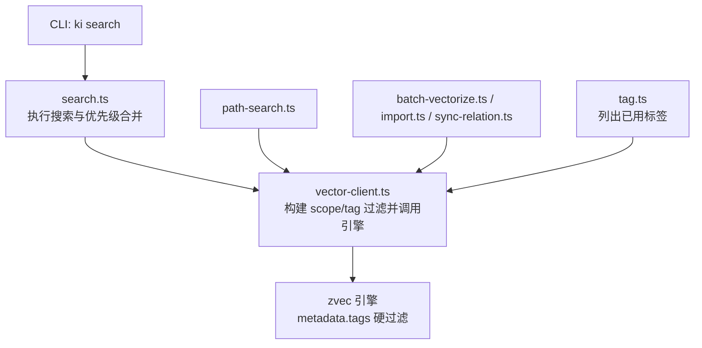
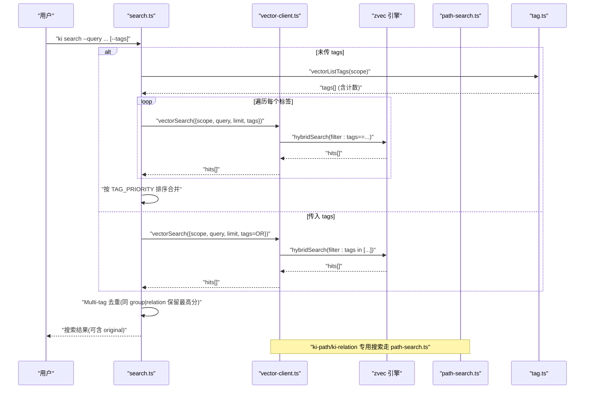
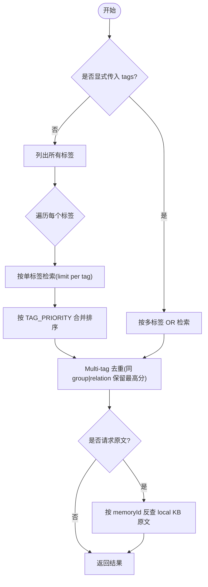
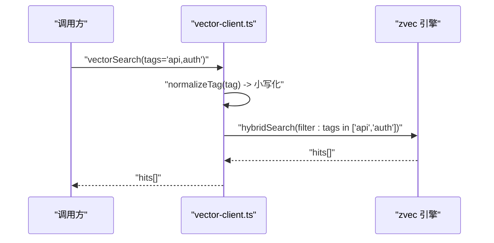
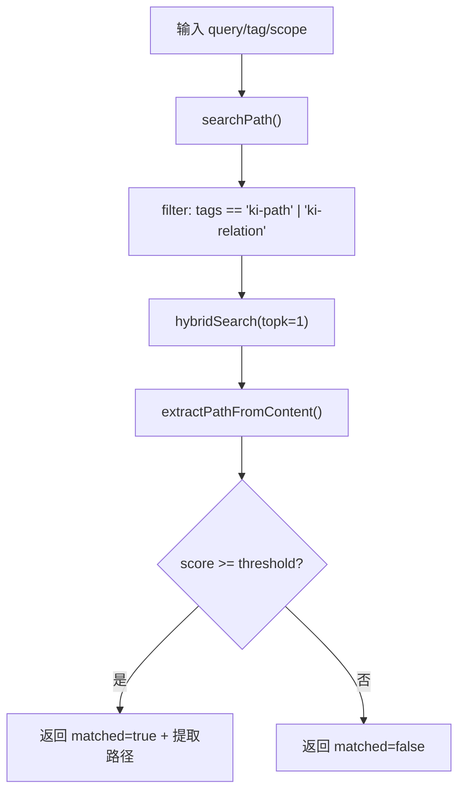
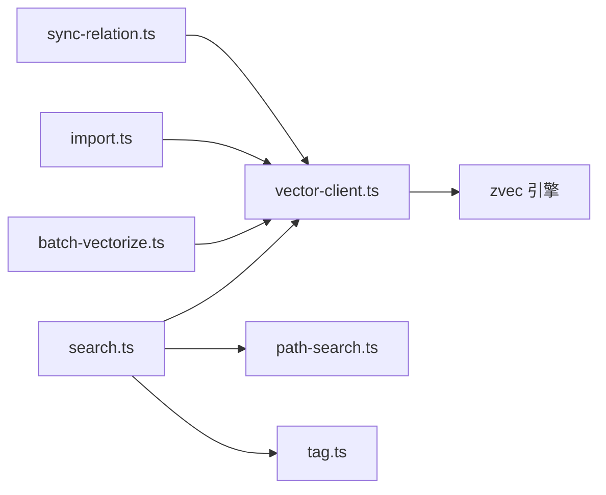

# 标签过滤与优先级

<cite>
**本文引用的文件**
- [src/search.ts](file://src/search.ts)
- [src/lib/path-search.ts](file://src/lib/path-search.ts)
- [src/lib/vector-client.ts](file://src/lib/vector-client.ts)
- [docs/tags-design.md](file://docs/tags-design.md)
- [src/tag.ts](file://src/tag.ts)
- [src/lib/batch-vectorize.ts](file://src/lib/batch-vectorize.ts)
- [src/sync-relation.ts](file://src/sync-relation.ts)
- [src/lib/import.ts](file://src/lib/import.ts)
</cite>

## 目录
1. [简介](#简介)
2. [项目结构](#项目结构)
3. [核心组件](#核心组件)
4. [架构总览](#架构总览)
5. [详细组件分析](#详细组件分析)
6. [依赖关系分析](#依赖关系分析)
7. [性能考量](#性能考量)
8. [故障排查指南](#故障排查指南)
9. [结论](#结论)
10. [附录：最佳实践与示例](#附录：最佳实践与示例)

## 简介
本文聚焦知识索引系统中的“标签过滤机制与优先级策略”，围绕三类内置标签 ki-path、ki-relation、ki-search 的设计与实现，解释 TAG_PRIORITY 的排序逻辑、多标签 OR 组合查询的执行流程、按标签分组搜索的性能优化策略，以及自定义标签的处理方式、继承与冲突解决。文末提供标签设计最佳实践、使用示例与常见问题解决方案。

## 项目结构
本仓库通过 zvec 引擎的 metadata 字段 tags 实现标签隔离与过滤；上层 CLI/MCP 通过 vector-client 封装检索与写入能力；search.ts 负责默认搜索时的标签优先级与合并；path-search.ts 为路径/关系类标签的统一向量搜索入口；batch-vectorize.ts、import.ts、sync-relation.ts 等负责不同来源的数据写入。

图表来源
- [src/search.ts:20-121](file://src/search.ts#L20-L121)
- [src/lib/vector-client.ts:218-242](file://src/lib/vector-client.ts#L218-L242)
- [src/lib/path-search.ts:47-87](file://src/lib/path-search.ts#L47-L87)
- [docs/tags-design.md:131-152](file://docs/tags-design.md#L131-L152)

章节来源
- [src/search.ts:20-121](file://src/search.ts#L20-L121)
- [src/lib/vector-client.ts:218-242](file://src/lib/vector-client.ts#L218-L242)
- [src/lib/path-search.ts:47-87](file://src/lib/path-search.ts#L47-L87)
- [docs/tags-design.md:131-152](file://docs/tags-design.md#L131-L152)

## 核心组件
- 标签体系与隔离
  - 三类内置标签：ki-path（路径层级索引）、ki-relation（关系名称索引）、ki-search（通用语义搜索）。
  - 写入时通过 metadata.tags 隔离；查询时通过 engine filter 硬过滤，避免客户端后处理。
- 搜索与优先级
  - 未显式指定 tags 时，按标签分组搜索，组内取 top-k，再按 TAG_PRIORITY 排序合并。
  - 显式指定 tags 时，以逗号分隔的多标签进行 OR 组合召回。
- 路径/关系向量搜索
  - path-search.ts 统一封装 ki-path/ki-relation 的向量搜索，阈值与解析逻辑针对 RRF 融合分调整。
- 标签发现
  - tag.ts 提供只读扫描，列出当前 scope 下出现过的标签及计数，辅助定位数据分布。

章节来源
- [docs/tags-design.md:1-14](file://docs/tags-design.md#L1-L14)
- [docs/tags-design.md:159-196](file://docs/tags-design.md#L159-L196)
- [src/search.ts:20-121](file://src/search.ts#L20-L121)
- [src/lib/path-search.ts:47-87](file://src/lib/path-search.ts#L47-L87)
- [src/tag.ts:34-51](file://src/tag.ts#L34-L51)

## 架构总览
下图展示从 CLI 到引擎的完整链路，包括标签过滤、优先级合并与原文召回增强。

图表来源
- [src/search.ts:70-121](file://src/search.ts#L70-L121)
- [src/lib/vector-client.ts:218-242](file://src/lib/vector-client.ts#L218-L242)
- [src/lib/path-search.ts:47-87](file://src/lib/path-search.ts#L47-L87)
- [src/tag.ts:34-51](file://src/tag.ts#L34-L51)

## 详细组件分析

### 标签优先级与默认搜索流程
- 内置标签优先级数组 TAG_PRIORITY = ['ki-search', 'ki-relation', 'ki-path']，用于在未显式指定 tags 时，对“按标签分组”的结果进行最终排序，确保内容型结果优先于路径/关系类基础设施结果。
- 默认搜索流程：
  1) 若未传 tags：先 list tags，再对每个标签分别执行一次检索（limit 为每组上限），收集 hits 并按 priority 排序合并。
  2) 若传 tags：将多个标签以 OR 组合进行一次检索。
  3) Multi-tag 去重：同一文档因多标签写入可能重复命中，按 (group, relation) 键保留最高分的一条。
  4) 可选原文召回：根据 memoryId 反查 relations-cache 获取文件级原文，失败则降级返回向量 content。

图表来源
- [src/search.ts:20-121](file://src/search.ts#L20-L121)
- [src/search.ts:123-196](file://src/search.ts#L123-L196)

章节来源
- [src/search.ts:20-121](file://src/search.ts#L20-L121)
- [src/search.ts:123-196](file://src/search.ts#L123-L196)

### 多标签 OR 组合查询的执行流程
- 当传入多个标签（如 api,auth）时，vector-client 会将其规范化为小写，并在引擎层以 OR 条件过滤 tags 字段，单次检索即完成多标签召回。
- 该模式适用于“自定义业务标签”的场景，例如 sync-relation 可为同一内容叠加多个业务标签，检索时以 OR 召回。

图表来源
- [src/lib/vector-client.ts:218-242](file://src/lib/vector-client.ts#L218-L242)

章节来源
- [src/lib/vector-client.ts:218-242](file://src/lib/vector-client.ts#L218-L242)

### 按标签分组搜索的性能优化策略
- 分组限制：未传 tags 时，对每个标签单独检索并设置 per-tag limit，避免全量扫描导致开销过大。
- 优先级合并：仅对存在结果的标签组进行合并，减少无效计算。
- 去重优化：在内存中以 Map/Set 做 key 去重，时间复杂度近似 O(n)，空间复杂度 O(n)。
- 原文召回按需开启：仅在 includeOriginal=true 时触发 relations-cache 反查与文件读取，降低默认路径成本。

章节来源
- [src/search.ts:94-121](file://src/search.ts#L94-L121)
- [src/search.ts:159-196](file://src/search.ts#L159-L196)

### 路径/关系向量搜索（ki-path、ki-relation）
- 统一接口 searchPath(query, tag, scope, threshold?)：
  - 使用 tags 过滤 ki-path/ki-relation，避免与 kb-import 内容向量混淆。
  - 底层 hybridSearch 返回 RRF 融合分，默认阈值 0，由下游做存在性二次校验保证质量。
  - extractPathFromContent 针对不同标签格式提取路径或名称。
- 典型消费场景：
  - group-resolve/query-group：路径模糊匹配与语义兜底。
  - get-module-info：Relation 名称模糊匹配。

图表来源
- [src/lib/path-search.ts:47-87](file://src/lib/path-search.ts#L47-L87)
- [src/lib/path-search.ts:100-115](file://src/lib/path-search.ts#L100-L115)

章节来源
- [src/lib/path-search.ts:47-87](file://src/lib/path-search.ts#L47-L87)
- [src/lib/path-search.ts:100-115](file://src/lib/path-search.ts#L100-L115)

### 自定义标签的处理方式、继承与冲突解决
- 写入模型：
  - 标签为单值 STRING 字段；“一个内容多标签”通过“同内容多条 doc”实现，docId 由 sha256(text + scope + tag) 生成，tag 不同则 docId 不同，天然支持幂等 upsert。
- 继承机制：
  - 系统未定义标签继承；如需“父标签包含子标签”语义，应在写入侧显式复制或在上层查询侧构造 OR 列表。
- 冲突解决：
  - 多标签 OR 召回后，search.ts 对同一文档（group|relation）的去重策略为保留最高分条目，避免重复输出。
  - 内部标签（ki-search/ki-relation/ki-path）与自定义业务标签共存时，通过 filter 精确限定范围，互不干扰。

章节来源
- [src/lib/vector-client.ts:225-242](file://src/lib/vector-client.ts#L225-L242)
- [src/search.ts:159-177](file://src/search.ts#L159-L177)
- [docs/tags-design.md:118-121](file://docs/tags-design.md#L118-L121)

### 写入路径与数据来源
- ki-search：批量导入（batch-vectorize.ts）、手动存储（store.ts）、MCP 工具、同步模块信息（sync-relation.ts）等写入。
- ki-path/ki-relation：scan-kb 导入（import.ts）与增量同步（sync-relation.ts）写入，用于路径/关系模糊匹配。
- 标签隔离：写入时 fields.tags 明确指定，查询时通过 filter 硬过滤，避免误召回。

章节来源
- [docs/tags-design.md:108-121](file://docs/tags-design.md#L108-L121)
- [docs/tags-design.md:159-196](file://docs/tags-design.md#L159-L196)
- [src/lib/import.ts:410-410](file://src/lib/import.ts#L410-L410)
- [src/sync-relation.ts:1-1](file://src/sync-relation.ts#L1-L1)

## 依赖关系分析
- search.ts 依赖 vector-client.ts 进行检索与标签发现，依赖 path-search.ts 进行路径/关系专用搜索。
- vector-client.ts 封装 zvec 引擎，负责标签规范化、docId 生成、engine 生命周期管理。
- batch-vectorize.ts、import.ts、sync-relation.ts 作为写入端，向不同标签写入数据。
- tag.ts 提供只读标签发现能力，便于运维与诊断。

图表来源
- [src/search.ts:70-121](file://src/search.ts#L70-L121)
- [src/lib/vector-client.ts:218-242](file://src/lib/vector-client.ts#L218-L242)
- [src/lib/path-search.ts:47-87](file://src/lib/path-search.ts#L47-L87)
- [src/tag.ts:34-51](file://src/tag.ts#L34-L51)

章节来源
- [src/search.ts:70-121](file://src/search.ts#L70-L121)
- [src/lib/vector-client.ts:218-242](file://src/lib/vector-client.ts#L218-L242)
- [src/lib/path-search.ts:47-87](file://src/lib/path-search.ts#L47-L87)
- [src/tag.ts:34-51](file://src/tag.ts#L34-L51)

## 性能考量
- 默认搜索采用“按标签分组 + 每标签 limit”的策略，显著降低全量扫描成本。
- 多标签 OR 组合通过引擎层 filter 一次性完成，避免多次往返。
- 去重阶段使用 Map/Set，时间复杂度近似 O(n)，适合常见规模结果集。
- 原文召回按需开启，避免不必要的 I/O。
- 标签规范化（小写）与标量索引提升过滤效率。

[本节为通用性能建议，无需特定文件引用]

## 故障排查指南
- 向量服务不可用：search.ts 在 ensureVectorAvailable 失败时返回 degraded 状态，提示检查向量服务。
- 标签不生效：确认写入时 fields.tags 是否正确；查询时 filter 是否匹配；必要时使用 tag.ts 列出实际存在的标签。
- 结果重复：检查是否存在“同内容多标签”写入；search.ts 已做 Multi-tag 去重，若仍重复，请检查 group/relation 元数据是否一致。
- 原文不可用：relations-cache 缺失或本地 KB 文件不存在时会降级返回向量 content，并附带 hint。

章节来源
- [src/search.ts:84-92](file://src/search.ts#L84-L92)
- [src/search.ts:135-155](file://src/search.ts#L135-L155)
- [src/tag.ts:34-51](file://src/tag.ts#L34-L51)

## 结论
本系统通过三类内置标签与严格的 metadata 过滤实现物理隔离与高效检索；TAG_PRIORITY 确保默认搜索的内容优先；多标签 OR 组合与分组限流兼顾灵活性与性能；自定义标签通过“一内容多 doc”的方式自然扩展。配合按需原文召回与去重策略，整体满足高可用、高性能的知识检索需求。

[本节为总结性内容，无需特定文件引用]

## 附录：最佳实践与示例

### 标签设计最佳实践
- 命名规范
  - 使用小写、短横线或下划线分隔的英文标识，避免大小写不一致导致的过滤失效。
  - 内置标签（ki-search/ki-relation/ki-path）不要复用为自定义标签名。
- 层次结构设计
  - 系统无标签继承；如需层次语义，建议在写入侧展开为多个独立标签，或在查询侧构造 OR 列表。
  - 将“领域/子系统/功能”拆分为独立标签，便于精准过滤与统计。
- 性能考虑
  - 控制标签基数与单标签数据量；对高频查询的标签保持较小集合。
  - 合理使用 per-tag limit，避免大结果集合并带来的内存压力。
  - 谨慎开启原文召回，仅在需要时启用。

### 使用示例
- 默认搜索（不限标签）：ki search “如何配置告警”
  - 行为：列出所有标签，按标签分组检索，按 TAG_PRIORITY 合并排序。
- 多标签 OR 搜索：ki search “告警配置” --tags "api,auth"
  - 行为：对 api、auth 两个标签进行 OR 召回。
- 路径/关系模糊匹配：通过 group-resolve/get-module-info 间接使用 ki-path/ki-relation 向量搜索。
- 标签发现：ki tag list --scope <scope>
  - 行为：列出当前 scope 下出现过的标签及其计数，辅助定位数据分布。

章节来源
- [src/search.ts:210-236](file://src/search.ts#L210-L236)
- [src/tag.ts:58-72](file://src/tag.ts#L58-L72)
- [docs/tags-design.md:108-121](file://docs/tags-design.md#L108-L121)