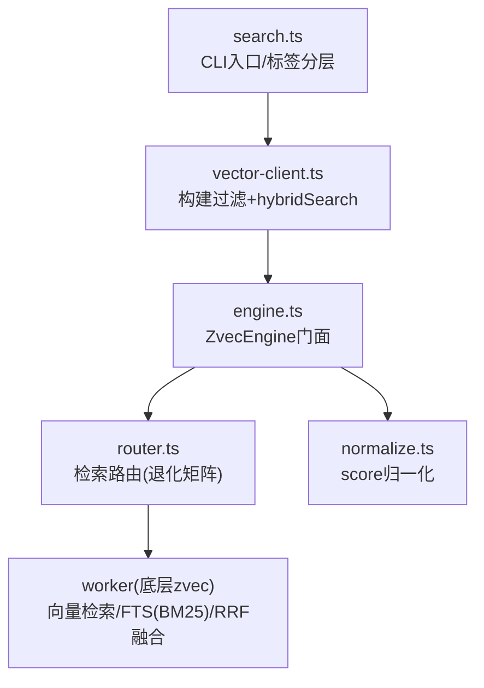
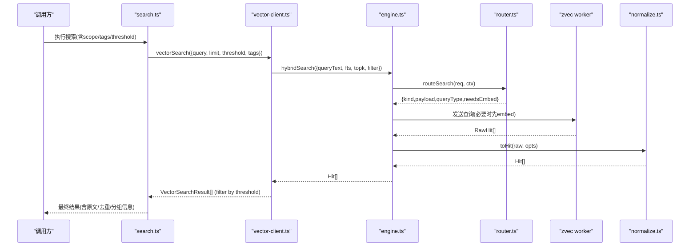
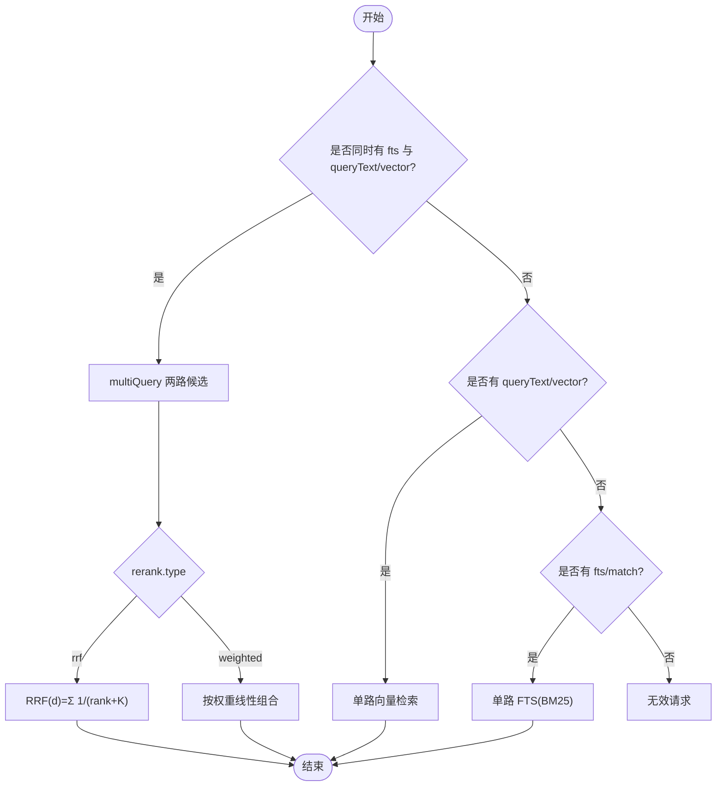
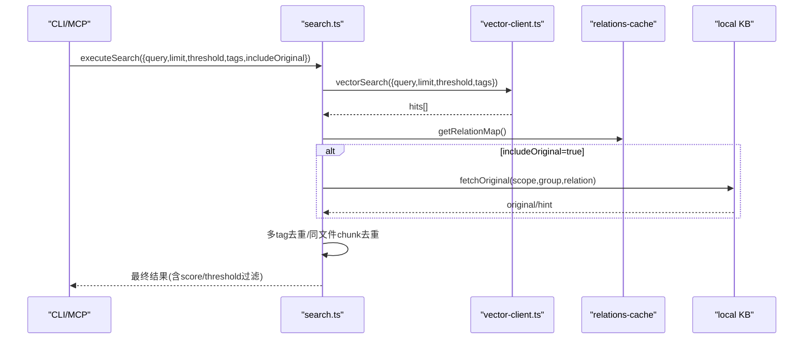
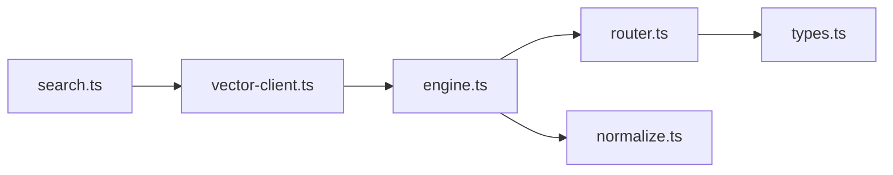

# 混合检索算法

<cite>
**本文引用的文件**
- [src/search.ts](file://src/search.ts)
- [src/lib/vector-client.ts](file://src/lib/vector-client.ts)
- [src/zvec-engine/engine.ts](file://src/zvec-engine/engine.ts)
- [src/zvec-engine/search/router.ts](file://src/zvec-engine/search/router.ts)
- [src/zvec-engine/search/normalize.ts](file://src/zvec-engine/search/normalize.ts)
- [src/zvec-engine/types.ts](file://src/zvec-engine/types.ts)
- [docs/configuration.md](file://docs/configuration.md)
</cite>

## 目录
1. [简介](#简介)
2. [项目结构](#项目结构)
3. [核心组件](#核心组件)
4. [架构总览](#架构总览)
5. [详细组件分析](#详细组件分析)
6. [依赖关系分析](#依赖关系分析)
7. [性能与调优](#性能与调优)
8. [故障排查](#故障排查)
9. [结论](#结论)
10. [附录：配置示例与最佳实践](#附录：配置示例与最佳实践)

## 简介
本文件系统性解析本项目中的混合检索实现，覆盖语义向量检索、BM25 全文检索、RRF 融合排序三大能力，并说明权重分配机制、分数归一化方法、融合排序的数学原理。同时给出不同检索方式的优势互补关系、按查询特征动态调整策略的建议，以及阈值设置、结果过滤、相关性评分等关键参数的最佳实践。

## 项目结构
围绕混合检索的关键代码分布在以下模块：
- 入口与上层编排：CLI 搜索入口、标签分层与原文召回
- 向量客户端封装：构建 scope/tag 过滤、调用引擎 hybridSearch
- 引擎路由与降级：根据请求决定单路向量、单路 FTS、或双路 RRF/加权融合
- 分数归一化：将距离转换为相似度分，FTS/hybrid 直通
- 类型定义：统一描述 HybridSearchReq、Hit、rerank 参数等

图表来源
- [src/search.ts:70-196](file://src/search.ts#L70-L196)
- [src/lib/vector-client.ts:477-506](file://src/lib/vector-client.ts#L477-L506)
- [src/zvec-engine/engine.ts:454-495](file://src/zvec-engine/engine.ts#L454-L495)
- [src/zvec-engine/search/router.ts:43-127](file://src/zvec-engine/search/router.ts#L43-L127)
- [src/zvec-engine/search/normalize.ts:16-63](file://src/zvec-engine/search/normalize.ts#L16-L63)

章节来源
- [src/search.ts:70-196](file://src/search.ts#L70-L196)
- [src/lib/vector-client.ts:477-506](file://src/lib/vector-client.ts#L477-L506)
- [src/zvec-engine/engine.ts:454-495](file://src/zvec-engine/engine.ts#L454-L495)
- [src/zvec-engine/search/router.ts:43-127](file://src/zvec-engine/search/router.ts#L43-L127)
- [src/zvec-engine/search/normalize.ts:16-63](file://src/zvec-engine/search/normalize.ts#L16-L63)

## 核心组件
- 搜索入口（search.ts）：负责 scope/tag 过滤、多 tag 优先级合并、原文定位与去重、阈值过滤。
- 向量客户端（vector-client.ts）：构造 scope+tag 过滤条件，调用 engine.hybridSearch(queryText, fts, topk, filter)，并对结果做 threshold 过滤。
- 引擎门面（engine.ts）：统一 upsert/insert/update/delete/fetch/listIds，以及 search 编排（embed→路由→worker→归一化）。
- 检索路由（router.ts）：根据是否提供 queryText/vector/fts 选择单路向量、单路 FTS 或双路 hybrid；支持 rerank 类型 rrf/weighted。
- 分数归一化（normalize.ts）：COSINE 距离转 score=1/(1+distance)；FTS/hybrid 分数直通。
- 类型（types.ts）：HybridSearchReq.rerank.type、weights、rankConstant；Hit.score 含义与范围。

章节来源
- [src/search.ts:70-196](file://src/search.ts#L70-L196)
- [src/lib/vector-client.ts:477-506](file://src/lib/vector-client.ts#L477-L506)
- [src/zvec-engine/engine.ts:454-495](file://src/zvec-engine/engine.ts#L454-L495)
- [src/zvec-engine/search/router.ts:43-127](file://src/zvec-engine/search/router.ts#L43-L127)
- [src/zvec-engine/search/normalize.ts:16-63](file://src/zvec-engine/search/normalize.ts#L16-L63)
- [src/zvec-engine/types.ts:118-151](file://src/zvec-engine/types.ts#L118-L151)

## 架构总览
混合检索在工程上采用“语义向量 + BM25 全文 + RRF/加权融合”的组合：
- 语义侧：queryText 经 embedding 成 dense vector，走稠密向量检索。
- 关键词侧：同一 query 作为 fts 串，走 BM25 全文检索。
- 融合侧：默认使用 RRF（Reciprocal Rank Fusion），也可切换为 weighted 加权融合。
- 归一化：向量路 distance→score 归一化；FTS/hybrid 分数直接透传。

图表来源
- [src/search.ts:70-196](file://src/search.ts#L70-L196)
- [src/lib/vector-client.ts:477-506](file://src/lib/vector-client.ts#L477-L506)
- [src/zvec-engine/engine.ts:454-495](file://src/zvec-engine/engine.ts#L454-L495)
- [src/zvec-engine/search/router.ts:43-127](file://src/zvec-engine/search/router.ts#L43-L127)
- [src/zvec-engine/search/normalize.ts:16-63](file://src/zvec-engine/search/normalize.ts#L16-L63)

## 详细组件分析

### 语义向量检索
- 触发路径：当请求包含 queryText 或 vector 时，路由生成单路向量查询；若传入 queryText，引擎主线程先 embed，再下发 dense vector 查询。
- 分数归一化：COSINE 度量下，distance∈[0,2]，score=1/(1+distance)，值域[1/3,1]，越大越相关。
- 适用场景：自然语言查询、概念匹配、同义表达。

章节来源
- [src/zvec-engine/search/router.ts:103-118](file://src/zvec-engine/search/router.ts#L103-L118)
- [src/zvec-engine/search/normalize.ts:16-25](file://src/zvec-engine/search/normalize.ts#L16-L25)
- [src/zvec-engine/types.ts:138-151](file://src/zvec-engine/types.ts#L138-L151)

### BM25 全文检索
- 触发路径：当请求包含 fts/match 且未同时提供 queryText/vector 时，路由退化为单路 FTS。
- 分数特性：BM25 原值，越大越相关；无需额外转换。
- 适用场景：精确符号、术语、短词匹配，如代码符号、API 名。

章节来源
- [src/zvec-engine/search/router.ts:129-146](file://src/zvec-engine/search/router.ts#L129-L146)
- [src/zvec-engine/search/normalize.ts:38-50](file://src/zvec-engine/search/normalize.ts#L38-L50)

### RRF 融合排序
- 触发路径：当同时提供 fts 与 queryText/vector 时，路由生成 multiQuery，两路候选合并后以 RRF 融合。
- 数学原理：对每个文档 d，RRF(d)=Σ_k 1/(rank_k(d)+K)，其中 K 为 rankConstant（默认 60）。该公式仅依赖排名位置，不依赖原始分数尺度，天然兼容不同度量。
- 可选项：亦支持 weighted 加权融合，需显式提供 weights，按字段顺序映射权重数组。

图表来源
- [src/zvec-engine/search/router.ts:74-101](file://src/zvec-engine/search/router.ts#L74-L101)
- [src/zvec-engine/types.ts:118-136](file://src/zvec-engine/types.ts#L118-L136)

章节来源
- [src/zvec-engine/search/router.ts:74-101](file://src/zvec-engine/search/router.ts#L74-L101)
- [src/zvec-engine/types.ts:118-136](file://src/zvec-engine/types.ts#L118-L136)

### 权重分配机制与分数归一化
- 向量路：distance→score=1/(1+distance)，保证分数单调且稳定。
- FTS 路：BM25 原值直通。
- 融合路：
  - RRF：基于排名的无参融合，K 控制“头部放大”程度（默认 60）。
  - Weighted：需要显式 weights，按字段顺序映射到 denseField 与 ftsField 的权重数组；缺失或不合法会报错。

章节来源
- [src/zvec-engine/search/normalize.ts:16-50](file://src/zvec-engine/search/normalize.ts#L16-L50)
- [src/zvec-engine/search/router.ts:176-190](file://src/zvec-engine/search/router.ts#L176-L190)
- [src/zvec-engine/types.ts:118-151](file://src/zvec-engine/types.ts#L118-L151)

### 上层检索流程与标签分层
- 标签分层：默认搜索全部时，按 ki-search > ki-relation > ki-path 优先级分别查，每 tag 取 topk，再拼接并按优先级输出。
- 原文召回：通过 memoryId 反查 relations-cache，定位 group/relation 后从 local KB 读取原文；失败则降级返回向量 content 并提示。
- 去重：同一 (group,relation) 保留最高分；开启原文时同一文件多 chunk 命中仅首条带原文，其余标记 deduplicated。
- 阈值过滤：vectorSearch 返回前按 threshold 过滤低分结果。

图表来源
- [src/search.ts:70-196](file://src/search.ts#L70-L196)
- [src/lib/vector-client.ts:477-506](file://src/lib/vector-client.ts#L477-L506)

章节来源
- [src/search.ts:70-196](file://src/search.ts#L70-L196)
- [src/lib/vector-client.ts:477-506](file://src/lib/vector-client.ts#L477-L506)

## 依赖关系分析
- search.ts 依赖 vector-client.ts 完成实际检索；vector-client.ts 依赖 ZvecEngine 门面；engine.ts 内部依赖 router.ts 与 normalize.ts；router.ts 依赖 types.ts 中的 HybridSearchReq 与错误类型。
- 耦合点：
  - 路由层与引擎层通过 payload/queryType 解耦。
  - 归一化逻辑集中在 normalize.ts，便于扩展其他 metric。
  - 上层标签分层与原文召回在 search.ts，与引擎无关，利于复用。

图表来源
- [src/search.ts:70-196](file://src/search.ts#L70-L196)
- [src/lib/vector-client.ts:477-506](file://src/lib/vector-client.ts#L477-L506)
- [src/zvec-engine/engine.ts:454-495](file://src/zvec-engine/engine.ts#L454-L495)
- [src/zvec-engine/search/router.ts:43-127](file://src/zvec-engine/search/router.ts#L43-L127)
- [src/zvec-engine/search/normalize.ts:16-63](file://src/zvec-engine/search/normalize.ts#L16-L63)
- [src/zvec-engine/types.ts:118-151](file://src/zvec-engine/types.ts#L118-L151)

## 性能与调优
- topk 与 topn：
  - 单路/双路的 topk 控制候选数；过大增加计算与内存开销，过小影响召回。建议从 10~50 起步，结合业务指标逐步上调。
- 阈值 threshold：
  - 在 vectorSearch 层按 score 过滤，避免低质结果污染下游。建议根据分布实验设定（例如 0.3~0.6 区间观察）。
- RRF rankConstant：
  - 默认 60，增大 K 会弱化头部优势，减小 K 更强调高排名。可根据领域数据分布微调。
- 加权融合 weights：
  - 当两种分数可比且你明确某路更重要时使用。注意权重需与字段顺序一致（denseField, ftsField）。
- 标签分层与 limit：
  - 多 tag 并行查询时，每 tag 限制 topk，避免总体结果膨胀。可按 tag 重要性差异化设置 limit。
- Embedding 批大小：
  - 引擎内嵌 batch 大小为 64，失败粒度小，适合网络抖动容错。生产环境建议保持默认。
- 索引与过滤：
  - 通过标量字段 indexed 加速过滤（scope/tag/group）。确保常用过滤字段已建索引。

章节来源
- [src/zvec-engine/engine.ts:62-66](file://src/zvec-engine/engine.ts#L62-L66)
- [src/zvec-engine/search/router.ts:23-25](file://src/zvec-engine/search/router.ts#L23-L25)
- [src/lib/vector-client.ts:477-506](file://src/lib/vector-client.ts#L477-L506)
- [src/zvec-engine/types.ts:118-136](file://src/zvec-engine/types.ts#L118-L136)

## 故障排查
- 向量服务不可用：
  - ensureVectorAvailable 检测 locked/corrupted/probe_error，并给出恢复引导。常见于并发锁冲突或损坏。
- 撞锁重试：
  - probeWithRetry 在检测到 locked 时等待并重试，最多固定次数，避免瞬时竞争导致失败。
- 文本长度校验：
  - 路由层对 queryText/fts 进行空串与最大长度校验，超限将抛 InvalidSearchError。
- 维度不匹配：
  - 向量维度必须与集合 dimension 一致，否则抛出 DimensionMismatchError。
- 更新一致性：
  - update 模式要求提供 vector 或 text；若只传 vector 且集合配置了 fts，会抛 InconsistentUpdateError 防止索引不一致。

章节来源
- [src/lib/vector-client.ts:420-467](file://src/lib/vector-client.ts#L420-L467)
- [src/zvec-engine/search/router.ts:148-174](file://src/zvec-engine/search/router.ts#L148-L174)
- [src/zvec-engine/engine.ts:251-273](file://src/zvec-engine/engine.ts#L251-L273)
- [src/zvec-engine/engine.ts:405-422](file://src/zvec-engine/engine.ts#L405-L422)

## 结论
本项目实现了稳健的混合检索管线：语义向量检索用于概念匹配，BM25 全文检索用于精确术语召回，RRF/加权融合将两者有机结合。通过严格的分数归一化、可配置的融合策略与标签分层，系统在准确性与鲁棒性之间取得良好平衡。生产环境中建议结合业务数据分布，对 topk、threshold、rankConstant 与 weights 进行系统评估与调优。

## 附录：配置示例与最佳实践
- 配置文件位置与优先级见 docs/configuration.md。
- 推荐步骤：
  1) 初始化配置模板：ki config init
  2) 填写 embedding.apiKey（建议使用环境变量引用）
  3) 确认 vectorDir 与 embedding.dimension 与集合一致
  4) 导入数据后，先用较小 topk 与适中 threshold 验证效果
  5) 根据业务需求启用 hybridSearch（queryText + fts），并尝试 rrf 与 weighted 两种融合
  6) 针对高频查询，调整 rankConstant 或 weights 提升目标文档排名
  7) 对常用过滤字段（scope/tag/group）建立索引以提升查询性能

章节来源
- [docs/configuration.md:1-252](file://docs/configuration.md#L1-L252)