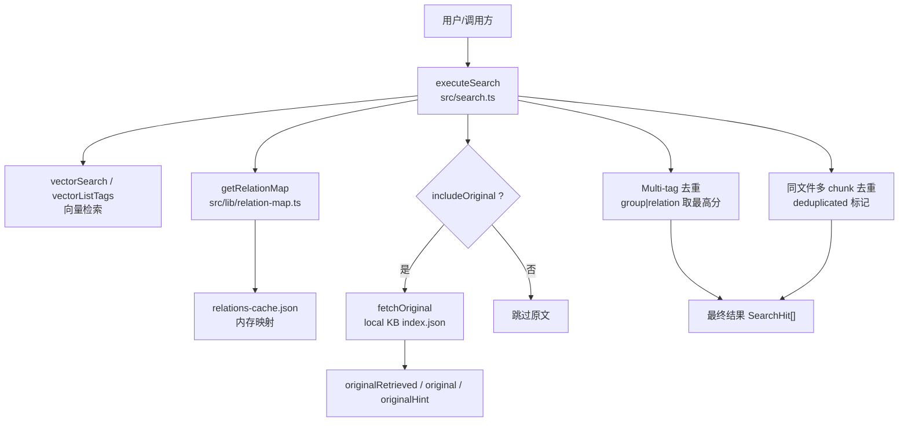
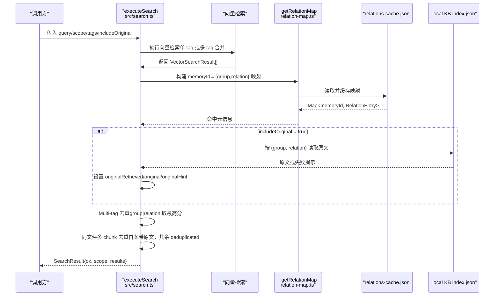
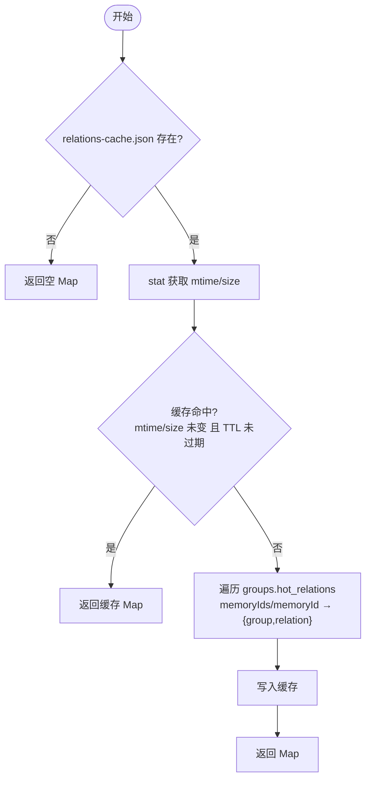
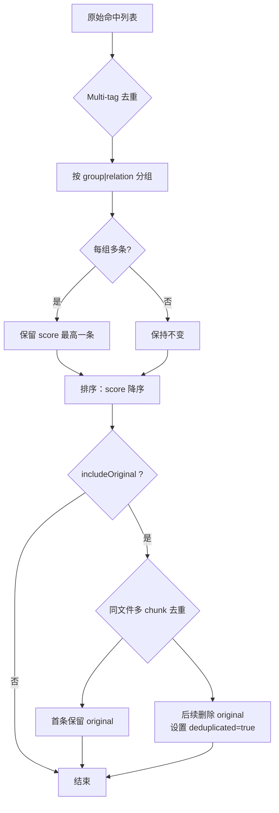
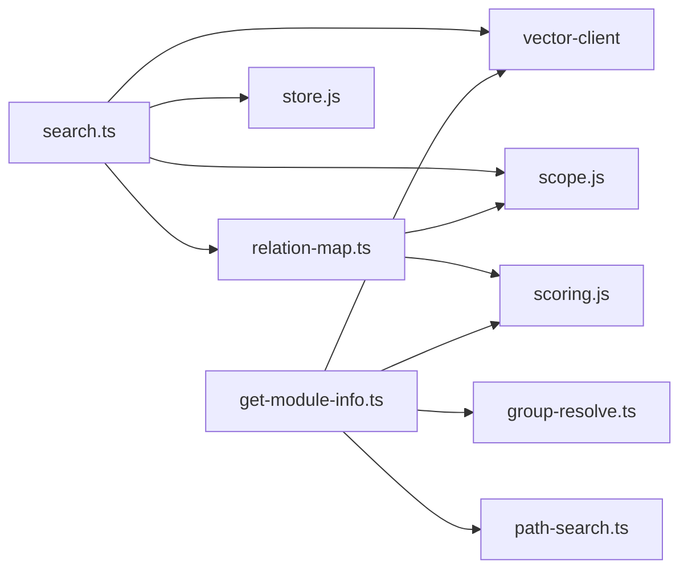

# 结果处理与增强

<cite>
**本文引用的文件**
- [src/search.ts](file://src/search.ts)
- [src/lib/relation-map.ts](file://src/lib/relation-map.ts)
- [src/get-module-info.ts](file://src/get-module-info.ts)
- [test/search-original.test.ts](file://test/search-original.test.ts)
- [docs/cli.md](file://docs/cli.md)
- [docs/architecture.md](file://docs/architecture.md)
</cite>

## 目录
1. [简介](#简介)
2. [项目结构](#项目结构)
3. [核心组件](#核心组件)
4. [架构总览](#架构总览)
5. [详细组件分析](#详细组件分析)
6. [依赖关系分析](#依赖关系分析)
7. [性能考量](#性能考量)
8. [故障排查指南](#故障排查指南)
9. [结论](#结论)
10. [附录](#附录)

## 简介
本文件聚焦“搜索结果处理与增强”的完整流程，覆盖以下关键点：
- 原文定位机制：基于 memoryId 反查 relations-cache.json，得到 group 与 relation；从 local KB 读取文件级原文。
- 原文获取失败的处理策略：降级为向量文档 content，并附加 originalHint。
- 去重算法：Multi-tag 去重（同一 group+relation 保留最高分）与同文件多 chunk 去重（避免重复返回原文）。
- 结果增强字段：originalRetrieved、deduplicated、originalHint 的生成逻辑。
- 结果格式规范、错误处理模式与性能优化建议，并提供实际使用场景的代码示例路径。

## 项目结构
围绕搜索与原文增强的关键文件与职责：
- src/search.ts：搜索入口、结果增强、去重、原文召回与降级。
- src/lib/relation-map.ts：memoryId → {group, relation} 的反查映射，带 TTL 缓存。
- src/get-module-info.ts：独立命令用于按 group/relation 读取本地 KB 原文并更新评分。
- test/search-original.test.ts：针对 REQ-09 的单元测试，验证原文召回、降级与去重语义。
- docs/cli.md：search CLI 参数与输出说明，包含 --original 行为。
- docs/architecture.md：核心数据文件与运行时链路概览。

图表来源
- [src/search.ts:70-196](file://src/search.ts#L70-L196)
- [src/lib/relation-map.ts:48-78](file://src/lib/relation-map.ts#L48-L78)
- [docs/architecture.md:51-100](file://docs/architecture.md#L51-L100)

章节来源
- [src/search.ts:1-248](file://src/search.ts#L1-L248)
- [src/lib/relation-map.ts:1-120](file://src/lib/relation-map.ts#L1-L120)
- [docs/architecture.md:51-100](file://docs/architecture.md#L51-L100)

## 核心组件
- executeSearch：搜索主流程，负责 tag 优先级合并、memoryId 反查、原文召回、去重与结果组装。
- fetchOriginal：从 local KB 按 (group, relation) 读取文件级原文；失败返回空原文与 hint。
- getRelationMap：构建 memoryId → {group, relation} 的映射，支持 TTL + mtime/size 失效。
- SearchHit 接口：扩展向量命中结果，增加 group、relation、originalRetrieved、original、originalHint、deduplicated。

章节来源
- [src/search.ts:33-47](file://src/search.ts#L33-L47)
- [src/search.ts:54-68](file://src/search.ts#L54-L68)
- [src/search.ts:70-196](file://src/search.ts#L70-L196)
- [src/lib/relation-map.ts:23-28](file://src/lib/relation-map.ts#L23-L28)
- [src/lib/relation-map.ts:48-78](file://src/lib/relation-map.ts#L48-L78)

## 架构总览
搜索与增强的端到端流程如下：
- 解析 scope 与配置，检测向量服务可用性。
- 执行向量检索：显式 tags 或按 tag 优先级分查合并。
- 通过 memoryId 反查 relations-cache.json，获得 group 与 relation。
- 可选开启 includeOriginal：
  - 若 meta 存在且可定位到 local KB，则读取文件级原文；
  - 否则降级为向量 content，并设置 originalRetrieved=false 与 originalHint。
- 去重：
  - Multi-tag 去重：同一 (group, relation) 仅保留 score 最高的一条；
  - 同文件多 chunk 去重：同一文件的后续命中删除 original，并标记 deduplicated=true。
- 返回统一的结果结构 SearchResult。

图表来源
- [src/search.ts:70-196](file://src/search.ts#L70-L196)
- [src/lib/relation-map.ts:48-78](file://src/lib/relation-map.ts#L48-L78)
- [docs/architecture.md:51-100](file://docs/architecture.md#L51-L100)

## 详细组件分析

### 原文定位机制（group 与 relation 反查）
- 反查数据源：relations-cache.json 中的 hot_relations，支持新格式 memoryIds（数组）与旧格式 memoryId（单值）。
- 映射构建：getRelationMap 将每个 memoryId 映射到 {group, relation}，其中 relation 为文件级名称（hot_relation.text）。
- 缓存策略：模块级单例 Map，依据 mtime/size 与 TTL（默认 10 分钟）控制失效；文件缺失或损坏时返回空 Map，调用方降级。
- 定位用途：在 search 中为每条命中附加 group 与 relation，以便后续从 local KB 读取文件级原文。

图表来源
- [src/lib/relation-map.ts:48-78](file://src/lib/relation-map.ts#L48-L78)
- [src/lib/relation-map.ts:80-114](file://src/lib/relation-map.ts#L80-L114)

章节来源
- [src/lib/relation-map.ts:1-120](file://src/lib/relation-map.ts#L1-L120)

### Local KB 文件读取与失败策略
- 读取路径：根据 scope 与 group 计算 local KB 目录，读取 index.json，key 为 relation（文件级名称）。
- 成功：返回 {original}，并在 search 中标记 originalRetrieved=true。
- 失败：返回 {original:"", hint}，search 中将 original 降级为向量 content，并设置 originalRetrieved=false 与 originalHint。
- 异常：捕获 IO 或 JSON 解析异常，返回通用提示。

章节来源
- [src/search.ts:54-68](file://src/search.ts#L54-L68)
- [src/search.ts:137-155](file://src/search.ts#L137-L155)
- [docs/architecture.md:51-100](file://docs/architecture.md#L51-L100)

### 去重算法实现
- Multi-tag 去重：
  - 触发条件：同一 (group, relation) 因多 tag 写入产生多条向量命中。
  - 规则：以 key=group|relation 聚合，保留 score 最高的一条；若发生去重，重新排序保持 score 降序。
- 同文件多 chunk 去重：
  - 触发条件：includeOriginal=true 时，同一文件的多个 chunk 命中。
  - 规则：首个命中原文保留；后续命中原文删除，originalRetrieved 保持 true，并设置 deduplicated=true。

图表来源
- [src/search.ts:159-194](file://src/search.ts#L159-L194)

章节来源
- [src/search.ts:159-194](file://src/search.ts#L159-L194)

### 结果增强过程（originalRetrieved、deduplicated、originalHint）
- originalRetrieved：
  - true：原文成功获取（即使后续被 deduplicated 标记，仍表示非失败）。
  - false：原文获取失败，已降级为向量 content。
- original：
  - 成功：local KB 文件级原文。
  - 失败：降级为向量 content。
- originalHint：
  - 仅在失败时出现，提供精简提示，避免与引导文案重复。
- deduplicated：
  - 同文件多 chunk 命中时，后续命中标记为 true，便于消费方区分。

章节来源
- [src/search.ts:33-47](file://src/search.ts#L33-L47)
- [src/search.ts:137-194](file://src/search.ts#L137-L194)
- [test/search-original.test.ts:104-145](file://test/search-original.test.ts#L104-L145)

### 结果格式规范
- SearchResult：
  - ok: boolean
  - scope: string
  - results: SearchHit[]
- SearchHit（扩展自向量命中）：
  - memoryId、content、score、tag（来自向量层）
  - group、relation（反查附加）
  - originalRetrieved、original、originalHint、deduplicated（REQ-09 增强）

章节来源
- [src/search.ts:33-51](file://src/search.ts#L33-L51)
- [docs/cli.md:467-523](file://docs/cli.md#L467-L523)

### 错误处理模式
- 向量服务不可用：返回 {ok:false, error, degraded:true}。
- relations-cache.json 不存在或损坏：反查映射为空，search 降级为不带附加字段的结果。
- local KB 缺失或读取异常：返回空原文与 hint，search 降级为向量 content。
- 其他异常：统一捕获并返回错误消息。

章节来源
- [src/search.ts:84-92](file://src/search.ts#L84-L92)
- [src/search.ts:197-199](file://src/search.ts#L197-L199)
- [src/lib/relation-map.ts:54-58](file://src/lib/relation-map.ts#L54-L58)
- [src/lib/relation-map.ts:110-114](file://src/lib/relation-map.ts#L110-L114)

### 实际使用场景与代码示例路径
- CLI 查询并返回原文：
  - 命令：ki search "<query>" -s <scope> --original
  - 参考：[docs/cli.md:467-523](file://docs/cli.md#L467-L523)
- 单元测试验证原文召回与降级：
  - 测试用例：fetchOriginal 失败返回 hint、降级为向量 content、同文件多 chunk 去重
  - 参考：[test/search-original.test.ts:104-145](file://test/search-original.test.ts#L104-L145)
- 独立读取模块原文（含近似匹配与评分更新）：
  - 命令：npx jiti src/get-module-info.ts --scope <scope> --group <group> --relation <relation>
  - 参考：[src/get-module-info.ts:61-168](file://src/get-module-info.ts#L61-L168)

章节来源
- [docs/cli.md:467-523](file://docs/cli.md#L467-L523)
- [test/search-original.test.ts:104-145](file://test/search-original.test.ts#L104-L145)
- [src/get-module-info.ts:61-168](file://src/get-module-info.ts#L61-L168)

## 依赖关系分析
- executeSearch 依赖：
  - vector-client：向量检索与标签列表。
  - relation-map：memoryId 反查映射。
  - store：读写 local KB 与 relations-cache。
  - scope/config：scope 解析与校验。
- relation-map 依赖：
  - scope：relations-cache.json 路径。
  - scoring：Relation 类型定义。
- get-module-info 依赖：
  - group-resolve/path-search：Group 路径解析与 Relation 近似匹配。
  - scoring：评分更新。
  - vector-client：关闭引擎资源。

图表来源
- [src/search.ts:11-18](file://src/search.ts#L11-L18)
- [src/lib/relation-map.ts:19-22](file://src/lib/relation-map.ts#L19-L22)
- [src/get-module-info.ts:11-26](file://src/get-module-info.ts#L11-L26)

章节来源
- [src/search.ts:11-18](file://src/search.ts#L11-L18)
- [src/lib/relation-map.ts:19-22](file://src/lib/relation-map.ts#L19-L22)
- [src/get-module-info.ts:11-26](file://src/get-module-info.ts#L11-L26)

## 性能考量
- 反查映射缓存：
  - 首次构建 O(N)，后续 O(1)；TTL 默认 10 分钟，结合 mtime/size 失效，避免频繁 IO。
- 向量检索：
  - 显式 tags 单次查询；不传 tags 时按 tag 分查并合并，每 tag 最多 limit 条，减少冗余。
- 去重：
  - Multi-tag 去重使用 Map 聚合，时间复杂度 O(M)；同文件多 chunk 去重使用 Set，时间复杂度 O(M)。
- 原文读取：
  - 仅在 includeOriginal=true 时执行；失败快速降级，避免阻塞。
- 资源释放：
  - CLI 每次调用后关闭向量引擎，防止进程无法退出。

章节来源
- [src/lib/relation-map.ts:8-17](file://src/lib/relation-map.ts#L8-L17)
- [src/search.ts:94-121](file://src/search.ts#L94-L121)
- [src/search.ts:159-194](file://src/search.ts#L159-L194)
- [src/search.ts:234-236](file://src/search.ts#L234-L236)

## 故障排查指南
- 向量服务不可用：
  - 现象：返回 degraded=true 的错误信息。
  - 处理：检查向量服务状态与配置。
- relations-cache.json 缺失或损坏：
  - 现象：反查映射为空，结果不含 group/relation。
  - 处理：重建索引或修复文件。
- local KB 缺失或读取异常：
  - 现象：originalRetrieved=false，originalHint 提示。
  - 处理：使用 sync-relation 或 rebuild-vector 补全；检查权限与路径。
- 多 chunk 重复返回：
  - 现象：同一文件多次命中。
  - 处理：确认 includeOriginal=true 时已启用 deduplicated 标记；消费方可据此过滤。

章节来源
- [src/search.ts:84-92](file://src/search.ts#L84-L92)
- [src/lib/relation-map.ts:54-58](file://src/lib/relation-map.ts#L54-L58)
- [src/search.ts:137-155](file://src/search.ts#L137-L155)
- [src/search.ts:179-194](file://src/search.ts#L179-L194)

## 结论
该实现通过 memoryId 反查与 local KB 读取，实现了精准的原文召回与增强；同时通过 Multi-tag 与同文件多 chunk 去重，确保结果简洁且无冗余。失败场景下采用稳健的降级策略，保证用户体验。整体设计兼顾性能与可维护性，适合在生产环境中稳定运行。

## 附录
- 相关命令与参数：
  - ki search：支持 --original 返回原文，--threshold 过滤低分命中。
  - get-module-info：独立读取模块原文并更新评分。
- 数据结构参考：
  - SearchHit：扩展向量命中结果，包含原文增强字段。
  - SearchResult：统一返回结构。

章节来源
- [docs/cli.md:467-523](file://docs/cli.md#L467-L523)
- [src/search.ts:33-51](file://src/search.ts#L33-L51)