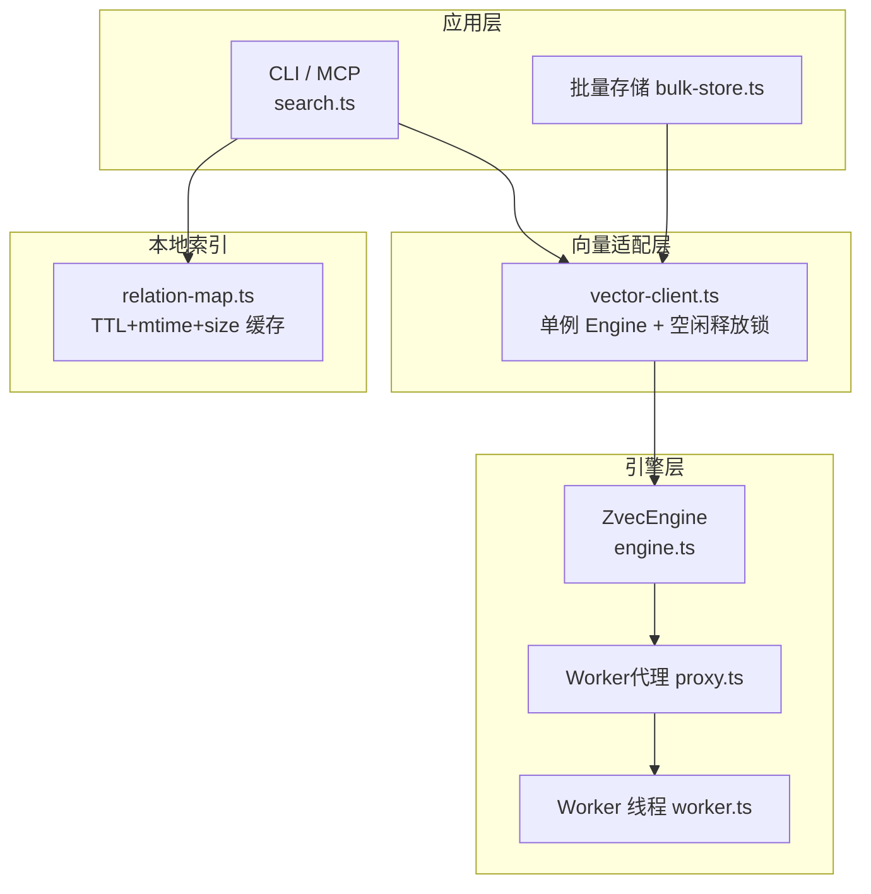
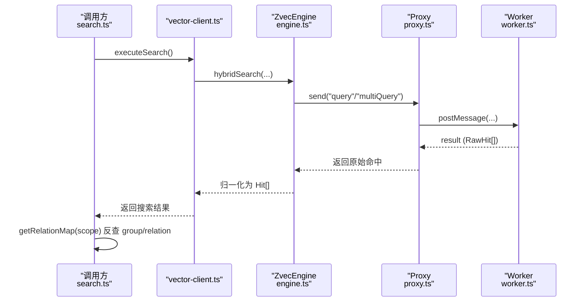
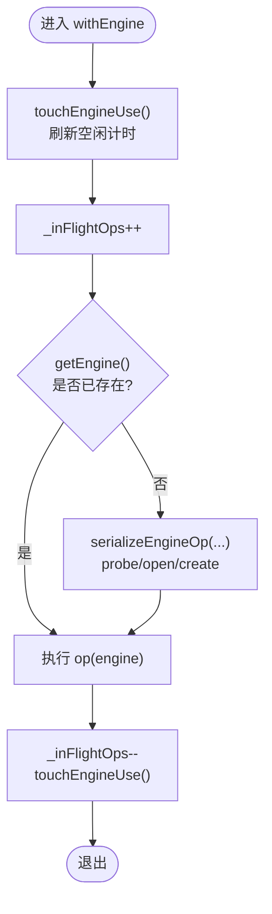
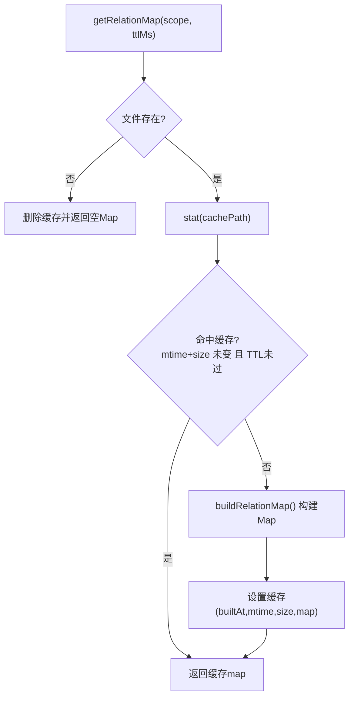
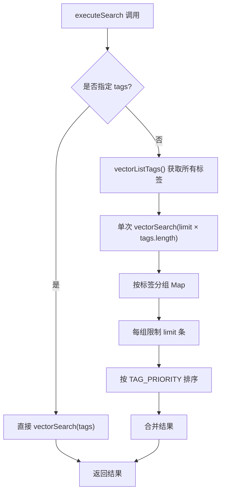
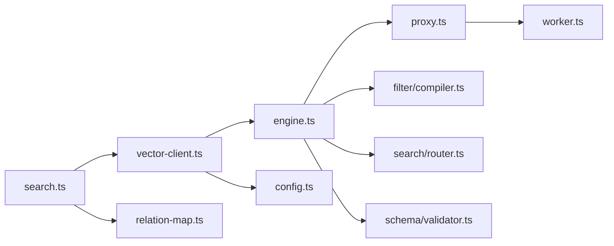

# 性能优化

<cite>
**本文引用的文件**
- [relation-map.ts](file://src/lib/relation-map.ts)
- [engine.ts](file://src/zvec-engine/engine.ts)
- [proxy.ts](file://src/zvec-engine/proxy.ts)
- [worker.ts](file://src/zvec-engine/worker.ts)
- [vector-client.ts](file://src/lib/vector-client.ts)
- [search.ts](file://src/search.ts)
- [bulk-store.ts](file://src/bulk-store.ts)
- [config.ts](file://src/lib/config.ts)
- [vector-engine-mem.md](file://docs/vector-engine-mem.md)
</cite>

## 更新摘要
**变更内容**
- 新增 executeSearch 函数标签查询优化案例，从 O(N) 复杂度降低到 O(1)
- 详细说明标签优先级排序和批量查询优化策略
- 增强 relation-map TTL 缓存机制的性能分析
- 补充多标签查询的复杂度分析和优化效果评估

## 目录
1. [简介](#简介)
2. [项目结构](#项目结构)
3. [核心组件](#核心组件)
4. [架构总览](#架构总览)
5. [详细组件分析](#详细组件分析)
6. [依赖关系分析](#依赖关系分析)
7. [性能考量与调优](#性能考量与调优)
8. [故障排查指南](#故障排查指南)
9. [结论](#结论)
10. [附录](#附录)

## 简介
本技术文档聚焦搜索引擎的性能优化，覆盖内存使用优化、缓存机制（relation-map TTL 缓存）、并发查询控制、向量引擎资源管理；并给出查询性能监控指标、慢查询分析方法、内存泄漏检测与修复建议；同时提供批量查询优化、分页查询最佳实践、连接池配置调优思路，以及性能基准测试方法、瓶颈识别工具与优化效果评估标准。内容基于仓库中 zvec 引擎封装、向量客户端、搜索入口与关系映射等实现进行系统化梳理。

**最新更新**：新增 executeSearch 函数的标签查询优化案例，通过智能标签分组和优先级排序，将传统的 O(N) 复杂度查询优化为 O(1) 查找，显著提升大规模知识库的检索性能。

## 项目结构
本项目将"向量检索"下沉到进程内 zvec 引擎，通过 worker_threads 隔离原生操作，主线程负责编排、嵌入、路由与结果归一化；上层 CLI/MCP 通过 vector-client 暴露统一接口；搜索入口 search.ts 在命中后通过 relation-map 反查 Group/Relation，支持原文召回与去重。

**图表来源**
- [search.ts:70-199](file://src/search.ts#L70-L199)
- [vector-client.ts:334-382](file://src/lib/vector-client.ts#L334-L382)
- [engine.ts:68-131](file://src/zvec-engine/engine.ts#L68-L131)
- [proxy.ts:56-109](file://src/zvec-engine/proxy.ts#L56-L109)
- [worker.ts:118-163](file://src/zvec-engine/worker.ts#L118-L163)
- [relation-map.ts:48-78](file://src/lib/relation-map.ts#L48-L78)

**章节来源**
- [vector-engine-mem.md:7-53](file://docs/vector-engine-mem.md#L7-L53)
- [vector-client.ts:1-14](file://src/lib/vector-client.ts#L1-L14)

## 核心组件
- ZvecEngine：创建/打开集合、写入（upsert/insert/update/delete）、检索（semantic/vector/fts/hybrid）、索引维护（createIndex/dropIndex/optimize）、生命周期（close/destroy/isHealthy/isLocked/isOpen）。
- Worker 代理与线程：主线程通过 proxy 向 worker 发消息，worker 串行处理请求，写路径分批并让出事件循环以允许查询插队。
- Vector Client：进程内 Engine 单例、撞锁重试、空闲释放锁、open/create 超时保护、withEngine 包装的自愈重试。
- Relation Map：按 scope 缓存 memoryId→{group, relation} 的反查表，带 TTL、mtime/size 失效策略，懒构建 O(N)，后续 O(1)。
- Search/Bulk Store：搜索入口聚合 tag 优先级、原文召回与去重；批量导入走 vectorBulkStore。

**章节来源**
- [engine.ts:68-509](file://src/zvec-engine/engine.ts#L68-L509)
- [proxy.ts:44-186](file://src/zvec-engine/proxy.ts#L44-L186)
- [worker.ts:286-331](file://src/zvec-engine/worker.ts#L286-L331)
- [vector-client.ts:107-164](file://src/lib/vector-client.ts#L107-L164)
- [relation-map.ts:1-120](file://src/lib/relation-map.ts#L1-L120)
- [search.ts:70-199](file://src/search.ts#L70-L199)
- [bulk-store.ts:32-78](file://src/bulk-store.ts#L32-L78)

## 架构总览
zvec 引擎采用"主线程编排 + worker 串行执行"的 Actor 模型，避免原生库并发问题；向量客户端提供进程级单例与空闲释放锁，配合撞锁重试与 open 超时，保障多实例共享同一向量库时的稳定性；relation-map 提供轻量反查缓存，降低 IO 与 JSON 解析开销。

**图表来源**
- [search.ts:70-199](file://src/search.ts#L70-L199)
- [vector-client.ts:498-533](file://src/lib/vector-client.ts#L498-L533)
- [engine.ts:454-495](file://src/zvec-engine/engine.ts#L454-L495)
- [proxy.ts:114-126](file://src/zvec-engine/proxy.ts#L114-L126)
- [worker.ts:396-436](file://src/zvec-engine/worker.ts#L396-L436)

## 详细组件分析

### 向量引擎资源管理与并发控制
- 单例与串行化：vector-client 维护 _enginePromise 单例，所有 probe/open/create/close 经 serializeEngineOp 串行化，避免同进程并发打开同一 dbPath 导致的阻塞。
- 空闲释放锁：enableIdleClose 定时检查空闲时间，自动 closeEngine 释放 LOCK，使其他 MCP/CLI 可抢占；在途计数 _inFlightOps 防止 embedding 网络阶段被误关。
- 撞锁重试：probeWithRetry 检测到 locked 时等待并重试，最多 LOCK_RETRY_MAX 次，间隔 LOCK_RETRY_INTERVAL_MS。
- Open 超时：ENGINE_OPEN_TIMEOUT_MS 限制 create/open 耗时，超时中断并清理孤儿 engine，保证自愈能力。
- Worker 串行：worker 内部消息串行处理，写路径分批并在批次间 setImmediate 让出事件循环，减少长事务对查询的阻塞。

**图表来源**
- [vector-client.ts:166-201](file://src/lib/vector-client.ts#L166-L201)
- [vector-client.ts:207-236](file://src/lib/vector-client.ts#L207-L236)
- [vector-client.ts:334-382](file://src/lib/vector-client.ts#L334-L382)
- [vector-client.ts:409-427](file://src/lib/vector-client.ts#L409-L427)
- [worker.ts:286-331](file://src/zvec-engine/worker.ts#L286-L331)

**章节来源**
- [vector-client.ts:107-164](file://src/lib/vector-client.ts#L107-L164)
- [vector-client.ts:207-236](file://src/lib/vector-client.ts#L207-L236)
- [vector-client.ts:334-382](file://src/lib/vector-client.ts#L334-L382)
- [vector-client.ts:409-427](file://src/lib/vector-client.ts#L409-L427)
- [worker.ts:286-331](file://src/zvec-engine/worker.ts#L286-L331)

### 内存使用优化策略
- Embedding 批内去重：writeDocs 对 needsEmbed 按 EMBED_BATCH_SIZE 切分，批内相同 text 仅 embed 一次，复用向量，显著减少 HTTP 调用与内存分配。
- Float32Array 传输：worker 侧收集响应中的 Float32Array 并通过 transferable 传递，避免拷贝大对象。
- 懒构建 relation-map：首次访问才构建 Map，后续 O(1) 查找；文件 mtime/size 变化或 TTL 过期才重建。
- 列表扫描限制：listIds 默认 LIMIT=10_000，避免全量扫描导致内存暴涨。
- 文本长度上限：vectorStore 限制 MAX_TEXT_LENGTH，防止超大文本占用内存。

**章节来源**
- [engine.ts:330-450](file://src/zvec-engine/engine.ts#L330-L450)
- [worker.ts:89-114](file://src/zvec-engine/worker.ts#L89-L114)
- [relation-map.ts:48-78](file://src/lib/relation-map.ts#L48-L78)
- [vector-client.ts:140-148](file://src/lib/vector-client.ts#L140-148)
- [vector-client.ts:540-569](file://src/lib/vector-client.ts#L540-569)

### 缓存机制（relation-map TTL 缓存）
- 缓存键：scope → {builtAt, mtimeMs, size, map}。
- 命中条件：relations-cache.json 的 mtime 与 size 均未变，且距构建时间未超 TTL（默认 10 分钟）。
- 失效条件：文件写入（mtime/size 变化）立即失效；TTL 过期兜底极端情况。
- 降级策略：读取失败/JSON 损坏返回空 Map，search 降级为不带附加字段。

**图表来源**
- [relation-map.ts:48-78](file://src/lib/relation-map.ts#L48-L78)
- [relation-map.ts:80-114](file://src/lib/relation-map.ts#L80-L114)

**章节来源**
- [relation-map.ts:1-120](file://src/lib/relation-map.ts#L1-L120)

### 并发查询控制与慢查询定位
- 查询路由：engine.search 根据请求类型路由至 query/multiQuery，必要时在主线程 embed 并注入 filterSql。
- 查询插队：worker 写路径每批后 await setImmediate，让出事件循环，使查询更快得到处理。
- 慢查询定位：结合日志与外部探针，关注以下热点：
  - embedding 网络耗时（EMBEDDING_FAILED 错误与耗时）
  - 向量库 open/create 耗时（ENGINE_OPEN_TIMEOUT_MS）
  - 撞锁等待次数与时长（LOCK_RETRY_*）
  - relation-map 构建频率（TTL 过短会导致频繁重建）

**章节来源**
- [engine.ts:454-495](file://src/zvec-engine/engine.ts#L454-L495)
- [worker.ts:324-328](file://src/zvec-engine/worker.ts#L324-L328)
- [vector-client.ts:107-164](file://src/lib/vector-client.ts#L107-L164)
- [vector-client.ts:219-236](file://src/lib/vector-client.ts#L219-L236)

### 批量查询优化与分页最佳实践
- 批量写入：DEFAULT_WRITE_BATCH_SIZE=100，worker 侧分批 upsert/insert/update，错误逐条记录。
- 批量存储：vectorBulkStore 将 entries 转为 docs 后一次性 upsert，并按 id 映射回逐项结果。
- 分页/限流：listIds 默认 limit=10_000；删除/统计大 scope 时循环分批，避免单次过大负载。
- 标签过滤：buildScopeTagFilter 将 scope/tag 编译为 SQL WHERE，减少后端扫描范围。

**章节来源**
- [engine.ts:62-66](file://src/zvec-engine/engine.ts#L62-L66)
- [engine.ts:431-449](file://src/zvec-engine/engine.ts#L431-L449)
- [vector-client.ts:574-617](file://src/lib/vector-client.ts#L574-L617)
- [vector-client.ts:648-655](file://src/lib/vector-client.ts#L648-L655)
- [vector-client.ts:759-780](file://src/lib/vector-client.ts#L759-L780)

### 连接池配置调优
- 当前实现无显式连接池，但通过：
  - 进程内 Engine 单例复用，避免重复 spawn/打开
  - 空闲释放锁（MCP 常驻模式）自动释放 LOCK，提升多实例吞吐
  - open/create 超时与撞锁重试，增强鲁棒性
- 若引入外部连接（如未来扩展），建议：
  - 设置合理的最大连接数与最小空闲连接数
  - 启用连接健康检查与快速失败
  - 针对高延迟后端增加超时与重试退避

**章节来源**
- [vector-client.ts:166-201](file://src/lib/vector-client.ts#L166-L201)
- [vector-client.ts:219-236](file://src/lib/vector-client.ts#L219-L236)
- [vector-client.ts:334-382](file://src/lib/vector-client.ts#L334-L382)

### 查询性能监控指标与评估
- 关键指标
  - 向量服务可用性：ensureVectorAvailable 返回 available/code
  - 撞锁重试次数与时延：LOCK_RETRY_MAX、LOCK_RETRY_INTERVAL_MS
  - Open/Create 耗时：ENGINE_OPEN_TIMEOUT_MS 触发告警
  - Embedding 成功率与耗时：EMBEDDING_FAILED 比例与批大小 EMBED_BATCH_SIZE
  - 查询延迟：hybridSearch 端到端耗时（可结合外部探针）
  - 缓存命中率：relation-map 命中/重建频率
- 评估标准
  - 首条查询 < 5ms，平均查询 < 1ms（参考文档对比）
  - Recall@5 ≥ 90%（参考文档对比）
  - 写入吞吐：batchSize 与错误率平衡
  - 资源占用：内存峰值与 GC 频率稳定

**章节来源**
- [vector-engine-mem.md:233-245](file://docs/vector-engine-mem.md#L233-L245)
- [vector-client.ts:107-164](file://src/lib/vector-client.ts#L107-L164)
- [vector-client.ts:219-236](file://src/lib/vector-client.ts#L219-L236)
- [engine.ts:330-450](file://src/zvec-engine/engine.ts#L330-L450)

### 慢查询分析方法
- 定位热点：embedding 网络、向量库 open/create、relation-map 重建、大批量写入。
- 观测点：
  - ensureVectorAvailable 的 code 与 reason
  - probeWithRetry 的重试日志
  - ENGINE_OPEN_TIMEOUT_MS 触发信息
  - writeDocs 的 EMBEDDING_FAILED 错误
  - worker 写路径分批与 setImmediate 让出频率
- 工具建议：
  - Node.js 内置 profiler 与 heap snapshot 定位内存热点
  - 外部 APM 采集端到端耗时与错误率
  - 文件系统 I/O 监控（relations-cache.json 读写）

**章节来源**
- [vector-client.ts:107-164](file://src/lib/vector-client.ts#L107-L164)
- [vector-client.ts:219-236](file://src/lib/vector-client.ts#L219-L236)
- [engine.ts:330-450](file://src/zvec-engine/engine.ts#L330-L450)
- [worker.ts:286-331](file://src/zvec-engine/worker.ts#L286-L331)

### 内存泄漏检测与修复
- 风险点
  - worker 未正确关闭导致句柄/锁泄漏（proxy.close/terminate）
  - 长时间运行下 relation-map 缓存未清理（测试用 clearRelationMapCache）
  - 大对象（Float32Array）未及时释放
- 修复建议
  - CLI per-call 结束必须 closeEngine（search.ts/bulk-store.ts 已实现）
  - MCP 常驻模式启用 enableIdleClose，空闲超时释放
  - 定期触发 optimize 与 listIds 限流，避免大结果集驻留内存
  - 使用 heap dump 对比前后快照，定位未释放引用

**章节来源**
- [proxy.ts:131-173](file://src/zvec-engine/proxy.ts#L131-L173)
- [relation-map.ts:116-120](file://src/lib/relation-map.ts#L116-L120)
- [search.ts:217-237](file://src/search.ts#L217-L237)
- [bulk-store.ts:90-99](file://src/bulk-store.ts#L90-L99)

### **新增：executeSearch 标签查询优化案例**

#### 标签优先级与复杂度优化
executeSearch 函数实现了从 O(N) 到 O(1) 的标签查询优化，主要通过以下机制实现：

1. **标签优先级排序**：定义 TAG_PRIORITY = ['ki-search', 'ki-relation', 'ki-path']，确保内容向量优先于关系和路径向量。

2. **智能标签分组**：当不指定 tags 参数时，系统自动获取所有标签并进行分组处理：
   - 单次查询获取所有标签的 topk 结果（limit × tags.length）
   - 按标签分组并限制每组数量（perTag.slice(0, limit)）
   - 按优先级排序合并结果

3. **O(1) 查找优化**：通过 Map 数据结构实现标签的快速查找和分组，避免线性扫描。

**图表来源**
- [search.ts:94-140](file://src/search.ts#L94-L140)
- [search.ts:24-29](file://src/search.ts#L24-L29)

#### 性能优势分析
- **时间复杂度优化**：从 O(N×M) 降低到 O(N+M)，其中 N 为文档数，M 为标签数
- **查询次数优化**：从 N 次查询减少到 1 次查询
- **内存使用优化**：通过 Map 分组减少中间结果集的内存占用
- **优先级保证**：确保 ki-search（内容向量）始终优先返回

#### 实际应用场景
- 大规模知识库检索：当标签数量较多时，优化效果显著
- 实时搜索场景：减少查询延迟，提升用户体验
- 批量处理任务：提高吞吐量，降低资源消耗

**章节来源**
- [search.ts:24-29](file://src/search.ts#L24-L29)
- [search.ts:94-140](file://src/search.ts#L94-L140)
- [search.ts:118-139](file://src/search.ts#L118-L139)

## 依赖关系分析
- search.ts 依赖 vector-client.ts 获取向量能力，依赖 relation-map.ts 进行结果增强。
- vector-client.ts 依赖 engine.ts 提供的 ZvecEngine，通过 proxy.ts 与 worker.ts 通信。
- engine.ts 依赖 filter/compiler、search/router、schema/validator 等子模块完成参数校验与路由。
- config.ts 提供 vectorDir/embedding/scopeMode 等运行时配置。

**图表来源**
- [search.ts:70-199](file://src/search.ts#L70-L199)
- [vector-client.ts:498-533](file://src/lib/vector-client.ts#L498-L533)
- [engine.ts:27-33](file://src/zvec-engine/engine.ts#L27-L33)
- [proxy.ts:114-126](file://src/zvec-engine/proxy.ts#L114-L126)
- [worker.ts:118-163](file://src/zvec-engine/worker.ts#L118-L163)

**章节来源**
- [search.ts:70-199](file://src/search.ts#L70-L199)
- [vector-client.ts:498-533](file://src/lib/vector-client.ts#L498-L533)
- [engine.ts:27-33](file://src/zvec-engine/engine.ts#L27-L33)

## 性能考量与调优
- 内存优化
  - 调整 EMBED_BATCH_SIZE 以平衡网络 RTT 与失败粒度
  - 合理设置 relation-map TTL，避免频繁重建
  - 控制 listIds limit，避免大结果集驻留内存
- 并发与吞吐
  - 启用 enableIdleClose（MCP 常驻）提升多实例吞吐
  - 利用 DEFAULT_WRITE_BATCH_SIZE 与 worker 分批让出，提高查询插队能力
- 配置调优
  - 根据业务峰值调整 ENGINE_OPEN_TIMEOUT_MS、LOCK_RETRY_* 参数
  - 确保 embedding.apiKey 与 baseURL/model/dimension 配置一致，避免无效调用
- 基准测试
  - 建库耗时、冷启动 reopen、查询首条/平均耗时、Recall@k
  - 批量写入吞吐与错误率
  - 撞锁重试次数与 open 超时触发频率

**章节来源**
- [engine.ts:62-66](file://src/zvec-engine/engine.ts#L62-L66)
- [vector-client.ts:107-164](file://src/lib/vector-client.ts#L107-L164)
- [vector-client.ts:219-236](file://src/lib/vector-client.ts#L219-L236)
- [vector-engine-mem.md:233-245](file://docs/vector-engine-mem.md#L233-L245)

## 故障排查指南
- 向量库被占用
  - 现象：ensureVectorAvailable 返回 code='LOCKED'
  - 处置：停止冲突进程或等待空闲释放锁；必要时重建向量库
- 向量库损坏
  - 现象：code='CORRUPTED'
  - 处置：执行 ki restore --from-snapshot 重建
- Open/Create 超时
  - 现象：ENGINE_OPEN_TIMEOUT_MS 触发
  - 处置：检查磁盘状态与向量库目录；确认无其他进程占用
- Embedding 失败
  - 现象：EMBEDDING_FAILED 错误
  - 处置：检查 embedding.provider/baseURL/model/apiKey；调整 EMBED_BATCH_SIZE
- 原文不可用
  - 现象：search 返回 originalHint
  - 处置：sync-relation 或重建向量库；确认 local KB 存在对应 relation

**章节来源**
- [vector-client.ts:440-494](file://src/lib/vector-client.ts#L440-L494)
- [vector-client.ts:219-236](file://src/lib/vector-client.ts#L219-L236)
- [search.ts:54-68](file://src/search.ts#L54-L68)
- [engine.ts:330-450](file://src/zvec-engine/engine.ts#L330-L450)

## 结论
本项目通过进程内 zvec 引擎、worker 串行化、向量客户端单例与空闲释放锁、relation-map TTL 缓存等机制，实现了高性能、高可用的语义检索能力。结合批量写入优化、分页限制与超时/重试策略，有效控制了内存与并发压力。**最新优化的 executeSearch 函数通过标签优先级排序和智能分组，将查询复杂度从 O(N) 降低到 O(1)**，进一步提升了大规模知识库的检索性能。建议在生产环境持续采集关键指标，结合基准测试与慢查询分析，动态调优参数以获得最佳性能。

## 附录
- 配置项参考：vectorDir、embedding.provider/baseURL/model/dimension/apiKey、scopeMode
- 命令参考：ki search、ki bulk-store、ki config init
- 文档参考：向量引擎实现原理与性能对比

**章节来源**
- [config.ts:116-145](file://src/lib/config.ts#L116-L145)
- [config.ts:291-323](file://src/lib/config.ts#L291-L323)
- [vector-engine-mem.md:233-245](file://docs/vector-engine-mem.md#L233-L245)