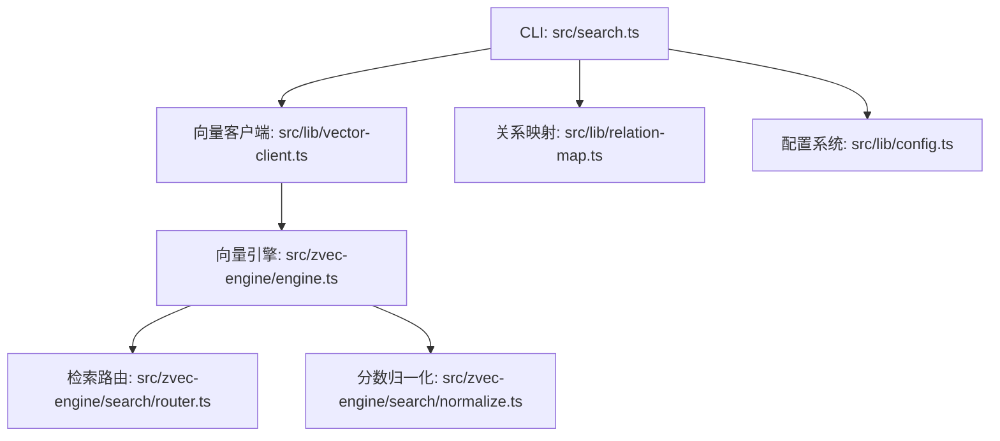
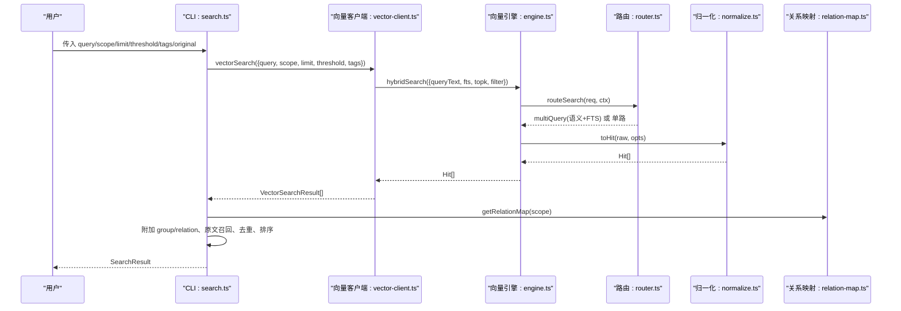
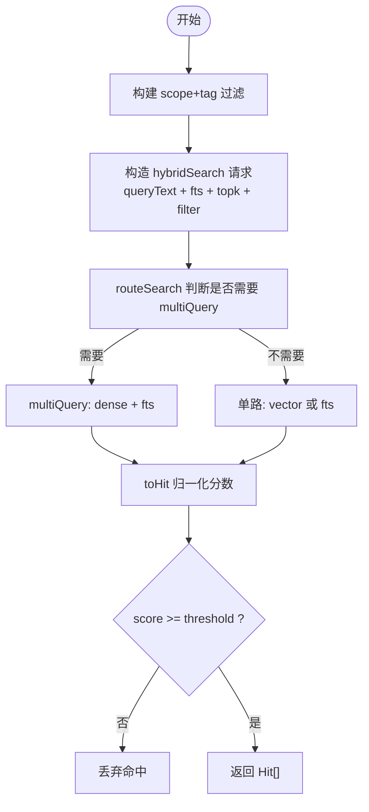
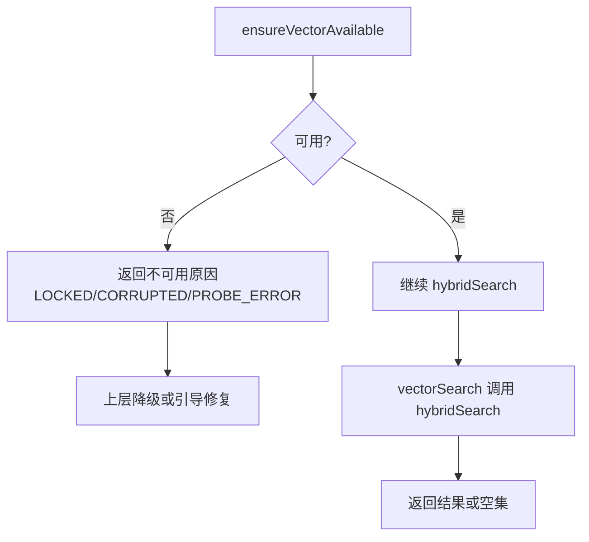
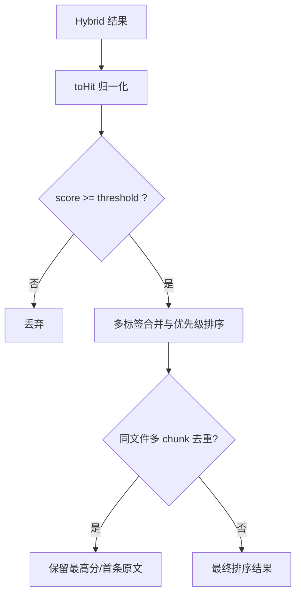
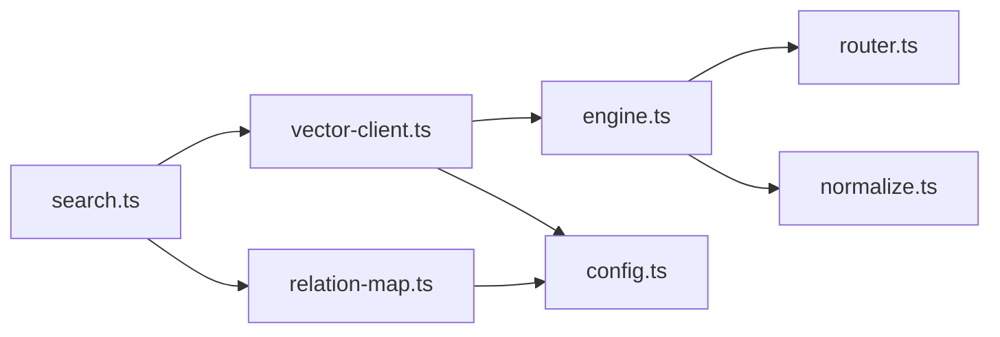

# 搜索引擎详解

<cite>
**本文引用的文件**
- [src/search.ts](file://src/search.ts)
- [src/lib/vector-client.ts](file://src/lib/vector-client.ts)
- [src/zvec-engine/engine.ts](file://src/zvec-engine/engine.ts)
- [src/zvec-engine/search/router.ts](file://src/zvec-engine/search/router.ts)
- [src/zvec-engine/search/normalize.ts](file://src/zvec-engine/search/normalize.ts)
- [src/zvec-engine/types.ts](file://src/zvec-engine/types.ts)
- [src/lib/relation-map.ts](file://src/lib/relation-map.ts)
- [src/lib/scoring.ts](file://src/lib/scoring.ts)
- [src/lib/config.ts](file://src/lib/config.ts)
- [docs/cli.md](file://docs/cli.md)
- [docs/configuration.md](file://docs/configuration.md)
</cite>

## 目录
1. [简介](#简介)
2. [项目结构](#项目结构)
3. [核心组件](#核心组件)
4. [架构总览](#架构总览)
5. [详细组件分析](#详细组件分析)
6. [依赖关系分析](#依赖关系分析)
7. [性能与内存优化](#性能与内存优化)
8. [故障排查指南](#故障排查指南)
9. [结论](#结论)
10. [附录：查询语法与参数、结果解读、调试工具](#附录查询语法与参数结果解读调试工具)

## 简介
本技术文档面向“混合检索”的搜索引擎实现，围绕以下目标展开：
- 解释混合检索算法原理：语义向量召回 + BM25 全文召回 + RRF（倒数排名融合）排序。
- 说明双路径查询机制：索引直查为主、语义检索兜底，以及失败降级策略。
- 阐述结果评分与排序策略：归一化、RRF 融合、阈值过滤、多标签优先级与去重。
- 覆盖查询语法与参数配置、标签过滤机制、原文召回定位过程。
- 提供性能调优、查询优化技巧、内存使用优化建议。
- 给出搜索结果解读方法与调试工具使用方式。

## 项目结构
搜索能力由 CLI 入口、向量客户端、向量引擎、路由与归一化、关系映射等模块协作完成：
- CLI 层：解析参数、执行搜索、返回结构化结果。
- 向量客户端：封装 ZvecEngine，负责 hybridSearch、scope/tag 过滤、可用性检测、空闲释放锁等。
- 向量引擎：抽象 create/open/probe、写入、检索编排、worker 通信、错误处理。
- 路由与归一化：根据请求类型选择单路或混合检索，并对分数进行归一化处理。
- 关系映射：将 memoryId 反查为 group/relation，用于原文定位。
- 配置系统：加载 vectorDir、embedding、scopeMode 等配置项。

**图表来源**
- [src/search.ts:70-199](file://src/search.ts#L70-L199)
- [src/lib/vector-client.ts:496-533](file://src/lib/vector-client.ts#L496-L533)
- [src/zvec-engine/engine.ts:296-495](file://src/zvec-engine/engine.ts#L296-L495)
- [src/zvec-engine/search/router.ts:43-127](file://src/zvec-engine/search/router.ts#L43-L127)
- [src/zvec-engine/search/normalize.ts:33-63](file://src/zvec-engine/search/normalize.ts#L33-L63)
- [src/lib/relation-map.ts:48-78](file://src/lib/relation-map.ts#L48-L78)
- [src/lib/config.ts:156-183](file://src/lib/config.ts#L156-L183)

**章节来源**
- [src/search.ts:70-199](file://src/search.ts#L70-L199)
- [src/lib/vector-client.ts:496-533](file://src/lib/vector-client.ts#L496-L533)
- [src/zvec-engine/engine.ts:296-495](file://src/zvec-engine/engine.ts#L296-L495)
- [src/zvec-engine/search/router.ts:43-127](file://src/zvec-engine/search/router.ts#L43-L127)
- [src/zvec-engine/search/normalize.ts:33-63](file://src/zvec-engine/search/normalize.ts#L33-L63)
- [src/lib/relation-map.ts:48-78](file://src/lib/relation-map.ts#L48-L78)
- [src/lib/config.ts:156-183](file://src/lib/config.ts#L156-L183)

## 核心组件
- CLI 搜索入口：解析参数、调用 executeSearch，支持 scope、limit、threshold、tags、original 等选项。
- 向量客户端：构建 filter（按 scope 与 tag），调用 engine.hybridSearch，对结果做 score 阈值过滤与字段映射。
- 向量引擎：统一 search 入口，内部通过 router 决定 query/multiQuery，必要时 embed，再经 normalize 输出 Hit。
- 路由：根据是否含 fts/queryText/vector 选择单路向量、单路 FTS 或混合两路（RRF/加权）。
- 归一化：vector 路距离转分数；fts/hybrid 路直通；异常值丢弃。
- 关系映射：memoryId → {group, relation}，TTL 缓存，支持多值 memoryIds。
- 配置：vectorDir、embedding、scopeMode 等，影响向量库位置与嵌入模型。

**章节来源**
- [src/search.ts:70-199](file://src/search.ts#L70-L199)
- [src/lib/vector-client.ts:496-533](file://src/lib/vector-client.ts#L496-L533)
- [src/zvec-engine/engine.ts:296-495](file://src/zvec-engine/engine.ts#L296-L495)
- [src/zvec-engine/search/router.ts:43-127](file://src/zvec-engine/search/router.ts#L43-L127)
- [src/zvec-engine/search/normalize.ts:33-63](file://src/zvec-engine/search/normalize.ts#L33-L63)
- [src/lib/relation-map.ts:48-78](file://src/lib/relation-map.ts#L48-L78)
- [src/lib/config.ts:156-183](file://src/lib/config.ts#L156-L183)

## 架构总览
下图展示一次搜索从 CLI 到向量引擎再到结果返回的关键流程，包括混合检索与原文召回。

**图表来源**
- [src/search.ts:70-199](file://src/search.ts#L70-L199)
- [src/lib/vector-client.ts:496-533](file://src/lib/vector-client.ts#L496-L533)
- [src/zvec-engine/engine.ts:296-495](file://src/zvec-engine/engine.ts#L296-L495)
- [src/zvec-engine/search/router.ts:43-127](file://src/zvec-engine/search/router.ts#L43-L127)
- [src/zvec-engine/search/normalize.ts:33-63](file://src/zvec-engine/search/normalize.ts#L33-L63)
- [src/lib/relation-map.ts:48-78](file://src/lib/relation-map.ts#L48-L78)

## 详细组件分析

### 混合检索算法原理（语义向量 + BM25 全文 + RRF 融合排序）
- 语义向量召回：通过 embedding 将 queryText 转为 dense vector，在 denseField 上执行相似度检索。
- 全文 BM25 召回：在 content 字段上使用 jieba 分词，执行 FTS 匹配。
- RRF 融合排序：multiQuery 同时发起 dense 与 fts 两路检索，使用 RRF（rankConstant 默认 60）融合排名，得到最终排序。
- 分数归一化：vector 路将 COSINE 距离转换为 1/(1+distance)，fts/hybrid 路分数直通。

**图表来源**
- [src/lib/vector-client.ts:496-533](file://src/lib/vector-client.ts#L496-L533)
- [src/zvec-engine/search/router.ts:43-127](file://src/zvec-engine/search/router.ts#L43-L127)
- [src/zvec-engine/search/normalize.ts:33-63](file://src/zvec-engine/search/normalize.ts#L33-L63)

**章节来源**
- [src/lib/vector-client.ts:496-533](file://src/lib/vector-client.ts#L496-L533)
- [src/zvec-engine/search/router.ts:43-127](file://src/zvec-engine/search/router.ts#L43-L127)
- [src/zvec-engine/search/normalize.ts:33-63](file://src/zvec-engine/search/normalize.ts#L33-L63)

### 双路径查询机制（索引直查 + 语义检索兜底）
- 主路径：hybridSearch 同时走 dense 与 fts 两路，RRF 融合排序，兼顾语义与关键词匹配。
- 兜底机制：当向量服务不可用（如被占用、损坏、未初始化）时，ensureVectorAvailable 返回不可用并提示；上层可降级或引导修复。
- 失败重试与空闲释放锁：vector-client 中 probeWithRetry 撞锁等待并重试；enableIdleClose 允许常驻进程空闲后释放锁，避免阻塞其他实例。

**图表来源**
- [src/lib/vector-client.ts:440-494](file://src/lib/vector-client.ts#L440-L494)
- [src/lib/vector-client.ts:111-124](file://src/lib/vector-client.ts#L111-L124)
- [src/lib/vector-client.ts:184-201](file://src/lib/vector-client.ts#L184-L201)

**章节来源**
- [src/lib/vector-client.ts:440-494](file://src/lib/vector-client.ts#L440-L494)
- [src/lib/vector-client.ts:111-124](file://src/lib/vector-client.ts#L111-L124)
- [src/lib/vector-client.ts:184-201](file://src/lib/vector-client.ts#L184-L201)

### 结果评分和排序策略
- 向量路分数：COSINE 距离转换 1/(1+distance)，值域约 [1/3, 1]。
- FTS 路分数：BM25 原值，越大越相关。
- Hybrid 路分数：RRF 融合分，基于 rank 位置计算，rankConstant 控制顶部权重。
- 阈值过滤：CLI 支持 --threshold，低于阈值的命中将被丢弃。
- 多标签优先级与去重：不传 tags 时按 ki-search > ki-relation > ki-path 优先级合并；同一 (group, relation) 重复命中保留最高分。

**图表来源**
- [src/zvec-engine/search/normalize.ts:33-63](file://src/zvec-engine/search/normalize.ts#L33-L63)
- [src/search.ts:94-121](file://src/search.ts#L94-L121)
- [src/search.ts:159-194](file://src/search.ts#L159-L194)

**章节来源**
- [src/zvec-engine/search/normalize.ts:33-63](file://src/zvec-engine/search/normalize.ts#L33-L63)
- [src/search.ts:94-121](file://src/search.ts#L94-L121)
- [src/search.ts:159-194](file://src/search.ts#L159-L194)

### 查询语法和参数配置
- CLI 命令：ki search "<自然语言查询>" [-s <scope>] [--limit <n>] [--threshold <score>] [--tags t1,t2] [--original]
- 参数说明：
  - query：必填，自然语言查询文本。
  - scope：项目隔离标识，default 模式可省略，strict 模式必填且需注册。
  - limit：返回条数上限，默认 10。
  - threshold：融合得分阈值，默认 0（不过滤）。
  - tags：过滤标签，逗号分隔多值，OR 组合；不传则搜索全部 tag。
  - original：返回 local KB 文件级原文，默认不返回。
- 配置项：
  - vectorDir：zvec collection 目录，默认 ~/.ki/vector。
  - embedding：provider/baseURL/model/dimension/apiKey。
  - scopeMode：default | strict。

**章节来源**
- [docs/cli.md:469-511](file://docs/cli.md#L469-L511)
- [docs/configuration.md:61-90](file://docs/configuration.md#L61-L90)
- [src/lib/config.ts:156-183](file://src/lib/config.ts#L156-L183)

### 标签过滤机制
- 标签字段：TAG_FIELD = 'tag'，写入时统一转小写，查询时忽略大小写。
- 过滤构建：buildScopeTagFilter 将 scope 必等条件与 tags OR 条件组合。
- 多标签优先级：不传 tags 时按 ki-search > ki-relation > ki-path 优先级分别检索并合并。

**章节来源**
- [src/lib/vector-client.ts:238-243](file://src/lib/vector-client.ts#L238-L243)
- [src/lib/vector-client.ts:648-655](file://src/lib/vector-client.ts#L648-L655)
- [src/search.ts:20-29](file://src/search.ts#L20-L29)

### 原文召回定位过程
- 关系映射：getRelationMap 读取 relations-cache.json，将 memoryId 映射为 {group, relation}，带 TTL 与 mtime/size 失效。
- 原文获取：fetchOriginal 按 (group, relation) 从 local KB 取文件级原文；若缺失则降级返回向量内容并提示。
- 多 chunk 去重：同一文件多 chunk 命中时，仅第一条携带 original，其余标记 deduplicated。

**章节来源**
- [src/lib/relation-map.ts:48-78](file://src/lib/relation-map.ts#L48-L78)
- [src/search.ts:53-68](file://src/search.ts#L53-L68)
- [src/search.ts:135-194](file://src/search.ts#L135-L194)

## 依赖关系分析
- CLI 依赖 vector-client 与 relation-map，后者依赖 config 与 scope。
- vector-client 依赖 zvec-engine，engine 依赖 router 与 normalize。
- 配置系统提供 vectorDir 与 embedding 配置，影响向量库位置与嵌入模型。

**图表来源**
- [src/search.ts:70-199](file://src/search.ts#L70-L199)
- [src/lib/vector-client.ts:496-533](file://src/lib/vector-client.ts#L496-L533)
- [src/zvec-engine/engine.ts:296-495](file://src/zvec-engine/engine.ts#L296-L495)
- [src/zvec-engine/search/router.ts:43-127](file://src/zvec-engine/search/router.ts#L43-L127)
- [src/zvec-engine/search/normalize.ts:33-63](file://src/zvec-engine/search/normalize.ts#L33-L63)
- [src/lib/relation-map.ts:48-78](file://src/lib/relation-map.ts#L48-L78)
- [src/lib/config.ts:156-183](file://src/lib/config.ts#L156-L183)

**章节来源**
- [src/search.ts:70-199](file://src/search.ts#L70-L199)
- [src/lib/vector-client.ts:496-533](file://src/lib/vector-client.ts#L496-L533)
- [src/zvec-engine/engine.ts:296-495](file://src/zvec-engine/engine.ts#L296-L495)
- [src/zvec-engine/search/router.ts:43-127](file://src/zvec-engine/search/router.ts#L43-L127)
- [src/zvec-engine/search/normalize.ts:33-63](file://src/zvec-engine/search/normalize.ts#L33-L63)
- [src/lib/relation-map.ts:48-78](file://src/lib/relation-map.ts#L48-L78)
- [src/lib/config.ts:156-183](file://src/lib/config.ts#L156-L183)

## 性能与内存优化
- 批量 Embedding：engine 内按 EMBED_BATCH_SIZE=64 切批，失败粒度小，避免整批失败。
- 文本去重：批内相同 text 只 embed 一次，减少 HTTP 调用。
- 空闲释放锁：enableIdleClose 允许常驻进程空闲超时后自动 closeEngine，避免锁竞争。
- 撞锁重试：probeWithRetry 最多重试 3 次，间隔 2 秒，提升共享向量库稳定性。
- 扫描限制：listIds 默认 10000，避免大库全量扫描导致内存峰值。
- 配置优化：合理设置 topk、threshold，减少结果集大小；使用 tags 缩小搜索范围。

**章节来源**
- [src/zvec-engine/engine.ts:330-450](file://src/zvec-engine/engine.ts#L330-L450)
- [src/lib/vector-client.ts:111-124](file://src/lib/vector-client.ts#L111-L124)
- [src/lib/vector-client.ts:184-201](file://src/lib/vector-client.ts#L184-L201)
- [src/lib/vector-client.ts:696-713](file://src/lib/vector-client.ts#L696-L713)

## 故障排查指南
- 向量服务不可用：ensureVectorAvailable 返回 LOCKED/CORRUPTED/PROBE_ERROR，按提示恢复（停止占用进程、重建向量库）。
- 撞锁问题：probeWithRetry 等待并重试；确认无其他 ki 命令正在写入。
- 配置错误：CONFIG_FIELD_INVALID 列出所有非法字段，修正后重试。
- 原文缺失：fetchOriginal 返回 hint 提示重建或同步关系。

**章节来源**
- [src/lib/vector-client.ts:440-494](file://src/lib/vector-client.ts#L440-L494)
- [src/lib/config.ts:252-278](file://src/lib/config.ts#L252-L278)
- [src/search.ts:53-68](file://src/search.ts#L53-L68)

## 结论
该搜索引擎通过混合检索（语义向量 + BM25 全文 + RRF 融合）实现了高召回与高相关性排序，结合双路径机制与原文召回定位，提供了稳定可靠的搜索体验。通过合理的参数配置与性能优化，可在大规模知识库中保持良好响应速度与资源利用率。

## 附录：查询语法与参数、结果解读、调试工具

### 查询语法与参数
- CLI：ki search "<query>" [-s <scope>] [--limit <n>] [--threshold <score>] [--tags t1,t2] [--original]
- 参数含义见上文“查询语法和参数配置”。

**章节来源**
- [docs/cli.md:469-511](file://docs/cli.md#L469-L511)

### 搜索结果解读
- ok：true/false，表示成功或失败。
- scope：当前作用域。
- results：数组，每项包含 memoryId、content、score、tag、group、relation、originalRetrieved、original、originalHint、deduplicated。
- score：RRF 融合分，值域通常为 0.0x 级别；vector 路分数约 [1/3, 1]，fts 路为 BM25 原值。

**章节来源**
- [docs/cli.md:494-511](file://docs/cli.md#L494-L511)
- [src/search.ts:33-51](file://src/search.ts#L33-L51)

### 调试工具使用
- ensureVectorAvailable：检测向量服务状态，返回 available 与 reason/code。
- vectorListTags：枚举 scope 下出现过的 tag 及计数，辅助理解数据分布。
- vectorListDocs：列出指定 scope 下的文档，便于验证导入与过滤。
- clearRelationMapCache：测试时清空关系映射缓存，验证重建逻辑。

**章节来源**
- [src/lib/vector-client.ts:440-494](file://src/lib/vector-client.ts#L440-L494)
- [src/lib/vector-client.ts:720-743](file://src/lib/vector-client.ts#L720-L743)
- [src/lib/vector-client.ts:670-683](file://src/lib/vector-client.ts#L670-L683)
- [src/lib/relation-map.ts:117-119](file://src/lib/relation-map.ts#L117-L119)