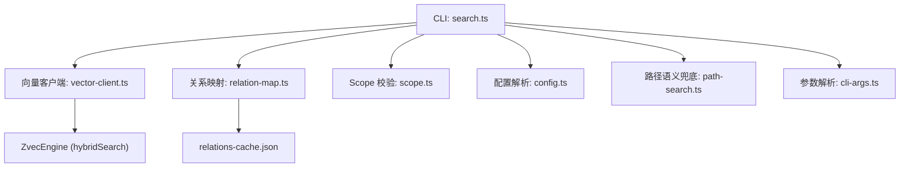
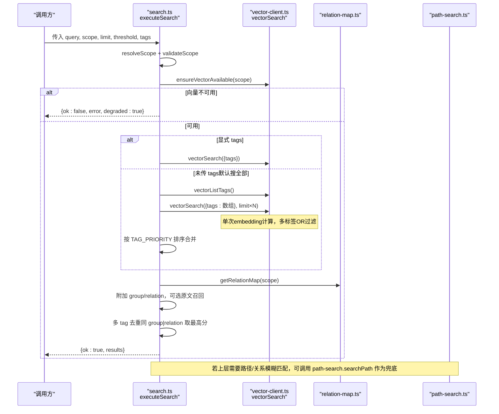
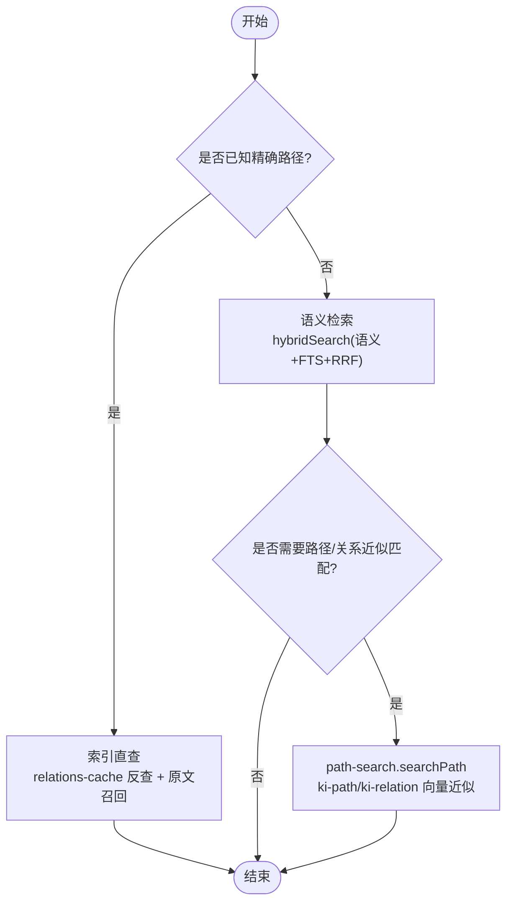
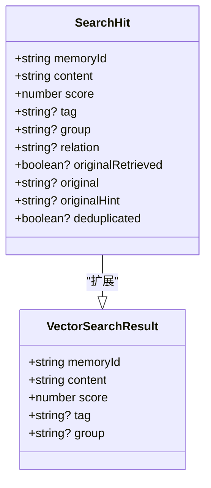
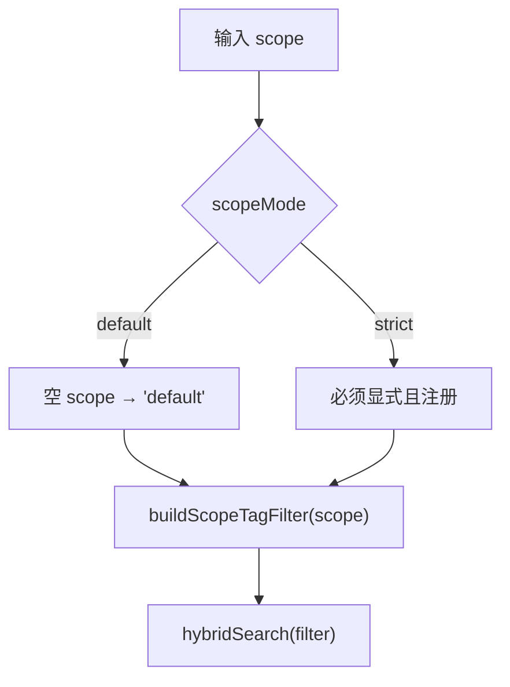
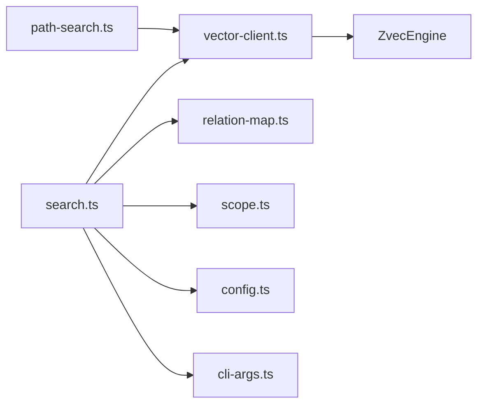

# 查询机制

<cite>
**本文引用的文件**
- [src/search.ts](file://src/search.ts)
- [src/lib/vector-client.ts](file://src/lib/vector-client.ts)
- [src/lib/path-search.ts](file://src/lib/path-search.ts)
- [src/lib/scope.ts](file://src/lib/scope.ts)
- [src/lib/config.ts](file://src/lib/config.ts)
- [src/lib/relation-map.ts](file://src/lib/relation-map.ts)
- [src/lib/cli-args.ts](file://src/lib/cli-args.ts)
- [test/vector-cli-functions.test.ts](file://test/vector-cli-functions.test.ts)
- [README.md](file://README.md)
</cite>

## 更新摘要
**变更内容**
- 更新了多标签处理逻辑，从逐个标签单独搜索优化为单次数组参数搜索
- 增强了性能优化说明，包括 embedding 复用和 topk 放大策略
- 完善了标签过滤机制的实现细节
- 更新了架构图表以反映新的优化流程

## 目录
1. [简介](#简介)
2. [项目结构](#项目结构)
3. [核心组件](#核心组件)
4. [架构总览](#架构总览)
5. [详细组件分析](#详细组件分析)
6. [依赖关系分析](#依赖关系分析)
7. [性能考量与优化建议](#性能考量与优化建议)
8. [故障排查指南](#故障排查指南)
9. [结论](#结论)

## 简介
本技术文档聚焦"双路径查询机制"：以索引直查优先、语义检索兜底的策略，结合标签过滤（ki-search、ki-relation、ki-path）优先级、Scope 隔离、多标签 OR 组合查询，系统阐述查询参数解析、验证规则、错误处理流程，并给出 limit/threshold 等关键参数的使用建议，帮助避免全量扫描与低效查询。

**重要更新**：查询机制已优化多标签处理逻辑，不再对每个标签执行单独的向量搜索，而是使用数组参数进行单次搜索，显著提升性能并减少 embedding 计算开销。

## 项目结构
围绕查询链路的关键代码集中在以下模块：
- CLI/入口与编排：search.ts
- 向量检索与过滤：vector-client.ts
- 路径/关系语义兜底：path-search.ts
- Scope 校验与路径构造：scope.ts
- 配置加载与 scope 模式：config.ts
- 原文定位映射（memoryId → group/relation）：relation-map.ts
- CLI 参数解析与容错：cli-args.ts
- 行为验证用例：test/vector-cli-functions.test.ts

**图表来源**
- [src/search.ts:70-199](file://src/search.ts#L70-L199)
- [src/lib/vector-client.ts:504-533](file://src/lib/vector-client.ts#L504-L533)
- [src/lib/relation-map.ts:48-78](file://src/lib/relation-map.ts#L48-L78)
- [src/lib/scope.ts:30-43](file://src/lib/scope.ts#L30-L43)
- [src/lib/config.ts:470-485](file://src/lib/config.ts#L470-L485)
- [src/lib/path-search.ts:47-87](file://src/lib/path-search.ts#L47-L87)
- [src/lib/cli-args.ts:117-151](file://src/lib/cli-args.ts#L117-L151)

**章节来源**
- [src/search.ts:70-199](file://src/search.ts#L70-L199)
- [src/lib/vector-client.ts:504-533](file://src/lib/vector-client.ts#L504-L533)
- [src/lib/path-search.ts:47-87](file://src/lib/path-search.ts#L47-L87)
- [src/lib/scope.ts:30-43](file://src/lib/scope.ts#L30-L43)
- [src/lib/config.ts:470-485](file://src/lib/config.ts#L470-L485)
- [src/lib/relation-map.ts:48-78](file://src/lib/relation-map.ts#L48-L78)
- [src/lib/cli-args.ts:117-151](file://src/lib/cli-args.ts#L117-L151)

## 核心组件
- 搜索编排器（executeSearch）：负责 scope 解析与校验、向量服务可用性检测、按 tag 分查或指定 tag 查询、结果增强（group/relation）、原文召回与去重、返回统一结构。
- 向量客户端（vectorSearch/buildScopeTagFilter）：实现 hybridSearch（语义+FTS+RRF），按 scope + tag 过滤，支持 threshold 过滤。**已优化**：支持数组参数进行单次多标签搜索。
- 路径语义兜底（searchPath）：在精确匹配失败时，对 ki-path / ki-relation 做向量近似匹配，默认阈值 0（RRF 融合分），由调用方二次校验质量。
- Scope 与配置：resolveScope 控制 default/strict 模式；validateScope 限制字符集；getLocalKbDir 用于原文定位。
- 原文定位映射（relation-map）：TTL + mtime/size 缓存 memoryId→{group,relation}，加速原文反查。
- 参数解析（cli-args）：parseIntArg/parseFloatArg 提供非法值回退与告警，避免 NaN 静默丢结果。

**章节来源**
- [src/search.ts:70-199](file://src/search.ts#L70-L199)
- [src/lib/vector-client.ts:504-533](file://src/lib/vector-client.ts#L504-L533)
- [src/lib/path-search.ts:47-87](file://src/lib/path-search.ts#L47-L87)
- [src/lib/scope.ts:30-43](file://src/lib/scope.ts#L30-L43)
- [src/lib/config.ts:470-485](file://src/lib/config.ts#L470-L485)
- [src/lib/relation-map.ts:48-78](file://src/lib/relation-map.ts#L48-L78)
- [src/lib/cli-args.ts:117-151](file://src/lib/cli-args.ts#L117-L151)

## 架构总览
双路径查询机制的核心思想：
- 索引直查优先：已知 Group/Relation 路径时，优先走精确匹配与本地 KB 原文反查，快速返回原文。
- 语义检索兜底：当精确匹配失败或用户自然语言查询时，走 hybridSearch（语义+关键词+RRF），并按标签优先级合并结果。

**重要优化**：多标签查询已从逐个标签单独搜索优化为单次数组参数搜索，显著减少 embedding 计算开销和网络往返。

**图表来源**
- [src/search.ts:70-199](file://src/search.ts#L70-L199)
- [src/lib/vector-client.ts:440-494](file://src/lib/vector-client.ts#L440-L494)
- [src/lib/vector-client.ts:504-533](file://src/lib/vector-client.ts#L504-L533)
- [src/lib/relation-map.ts:48-78](file://src/lib/relation-map.ts#L48-L78)
- [src/lib/path-search.ts:47-87](file://src/lib/path-search.ts#L47-L87)

## 详细组件分析

### 双路径查询机制
- 索引直查优先：当存在明确的 Group/Relation 路径时，通过 relations-cache 反查定位原文，必要时直接读取 local KB 文件级原文（includeOriginal=true）。
- 语义检索兜底：当精确匹配失败或用户自然语言查询时，进入 hybridSearch，按 scope + tag 过滤，返回 top-k 结果；对路径/关系场景，path-search 提供近似匹配兜底。

**图表来源**
- [src/search.ts:123-199](file://src/search.ts#L123-L199)
- [src/lib/path-search.ts:47-87](file://src/lib/path-search.ts#L47-L87)

**章节来源**
- [src/search.ts:123-199](file://src/search.ts#L123-L199)
- [src/lib/path-search.ts:47-87](file://src/lib/path-search.ts#L47-L87)

### 标签过滤机制与优先级
- 标签集合：ki-search（内容）、ki-relation（关系）、ki-path（路径）。
- 优先级：默认搜索全部时，ki-search 优先，其次 ki-relation，最后 ki-path；每类 tag 内部按 score 降序，且 per-tag 限流（limit）。
- 多标签 OR：**已优化** 显式传入 tags 时，多个 tag 以逗号分隔或数组形式传递，底层 buildScopeTagFilter 将多 tag 以 OR 组合，与 scope 条件 AND 后执行。**默认全量搜索时，使用数组参数进行单次搜索而非逐个标签查询**。

**图表来源**
- [src/search.ts:33-51](file://src/search.ts#L33-L51)
- [src/lib/vector-client.ts:38-45](file://src/lib/vector-client.ts#L38-L45)

**章节来源**
- [src/search.ts:20-29](file://src/search.ts#L20-L29)
- [src/search.ts:94-121](file://src/search.ts#L94-L121)
- [src/lib/vector-client.ts:648-655](file://src/lib/vector-client.ts#L648-L655)
- [test/vector-cli-functions.test.ts:188-223](file://test/vector-cli-functions.test.ts#L188-L223)

### Scope 隔离查询
- 字符校验：validateScope 仅允许字母、数字、连字符、下划线，拒绝路径遍历字符。
- 模式控制：resolveScope 在 strict 模式下要求显式传入已注册的 scope，default 模式下空 scope 回退为 default。
- 数据隔离：vectorSearch 构建 filter 时强制 field=scope 相等条件，确保跨 scope 不串读。

**图表来源**
- [src/lib/scope.ts:30-43](file://src/lib/scope.ts#L30-L43)
- [src/lib/config.ts:470-485](file://src/lib/config.ts#L470-L485)
- [src/lib/vector-client.ts:648-655](file://src/lib/vector-client.ts#L648-L655)

**章节来源**
- [src/lib/scope.ts:30-43](file://src/lib/scope.ts#L30-L43)
- [src/lib/config.ts:470-485](file://src/lib/config.ts#L470-L485)
- [src/lib/vector-client.ts:648-655](file://src/lib/vector-client.ts#L648-L655)

### 多标签 OR 组合查询
- **已优化** 显式 tags：如 "ki-search,ki-relation" 或数组 `['ki-search', 'ki-relation']`，底层 split(',') 后 normalizeTag 转小写，构建 or(tag1, tag2...) 并与 scope 条件 and。
- **已优化** 默认全量：未传 tags 时，先 vectorListTags 枚举当前 scope 下的所有 tag，再**单次查询**所有标签，topk = limit × tag 数，per-tag 限流并按优先级合并。
- **性能提升**：避免了逐 tag 分查时对同一 query 重复 embedding N 次的线性放大延迟。

**章节来源**
- [src/lib/vector-client.ts:504-533](file://src/lib/vector-client.ts#L504-533)
- [src/lib/vector-client.ts:648-655](file://src/lib/vector-client.ts#L648-L655)
- [src/search.ts:94-121](file://src/search.ts#L94-L121)

### 查询参数解析、验证与错误处理
- 参数解析：
  - limit：parseIntArg(raw, fallback=10, min=1)，非法值回退并警告。
  - threshold：parseFloatArg(raw, fallback=undefined)，非法值回退并警告。
  - tags：逗号分隔字符串或数组，split(',') 后 trim 过滤空项。
  - includeOriginal：布尔开关，显式开启才进行原文召回。
- 验证：
  - scope 字符校验（validateScope）。
  - scope 模式校验（resolveScope）。
  - 向量服务可用性检测（ensureVectorAvailable）。
- 错误处理：
  - 向量不可用：返回 {ok:false, error, degraded:true}。
  - 原文获取失败：降级返回向量文档 content，并附带 originalHint。
  - 异常捕获：executeSearch 外层 try/catch 返回 {ok:false, error}。

**章节来源**
- [src/search.ts:217-236](file://src/search.ts#L217-L236)
- [src/lib/cli-args.ts:117-151](file://src/lib/cli-args.ts#L117-L151)
- [src/lib/vector-client.ts:440-494](file://src/lib/vector-client.ts#L440-L494)
- [src/search.ts:197-199](file://src/search.ts#L197-L199)

### 原文召回与去重
- 原文定位：通过 relation-map 的 memoryId→{group,relation} 映射，调用 fetchOriginal 从 local KB 读取文件级原文。
- 降级策略：无法定位或读取失败时，originalRetrieved=false，original 回退为向量文档 content，并附提示。
- 去重：同一 (group, relation) 多 chunk 命中时，保留 score 最高的一条；同一文件多 chunk 命中时，后续条目 original 置空并标记 deduplicated。

**章节来源**
- [src/search.ts:123-199](file://src/search.ts#L123-L199)
- [src/lib/relation-map.ts:48-78](file://src/lib/relation-map.ts#L48-L78)

### 路径/关系语义兜底
- 适用场景：Group/Relation 名称存在偏差时，path-search.searchPath 基于 ki-path/ki-relation 标签的向量近似匹配，返回 top-1 候选。
- 阈值策略：默认 threshold=0（RRF 融合分量级远小于 1），由调用方做存在性二次校验保证质量。
- 异常降级：任何异常静默降级返回 null，不阻塞主流程。

**章节来源**
- [src/lib/path-search.ts:47-87](file://src/lib/path-search.ts#L47-L87)

## 依赖关系分析
- search.ts 依赖 vector-client.ts 进行 hybridSearch，依赖 relation-map.ts 进行原文定位，依赖 scope.ts/config.ts 完成 scope 解析与校验，依赖 cli-args.ts 完成参数解析。
- vector-client.ts 封装 ZvecEngine，提供 ensureVectorAvailable、vectorSearch、buildScopeTagFilter 等能力。
- path-search.ts 复用 vectorSearch，针对 ki-path/ki-relation 做近似匹配。
- relation-map.ts 提供 TTL + mtime/size 缓存的 memoryId 反查映射。

**图表来源**
- [src/search.ts:70-199](file://src/search.ts#L70-L199)
- [src/lib/vector-client.ts:504-533](file://src/lib/vector-client.ts#L504-L533)
- [src/lib/path-search.ts:47-87](file://src/lib/path-search.ts#L47-L87)
- [src/lib/relation-map.ts:48-78](file://src/lib/relation-map.ts#L48-L78)

**章节来源**
- [src/search.ts:70-199](file://src/search.ts#L70-L199)
- [src/lib/vector-client.ts:504-533](file://src/lib/vector-client.ts#L504-L533)
- [src/lib/path-search.ts:47-87](file://src/lib/path-search.ts#L47-L87)
- [src/lib/relation-map.ts:48-78](file://src/lib/relation-map.ts#L48-L78)

## 性能考量与优化建议
- **已优化的多标签处理**：
  - 默认全量搜索时使用数组参数进行单次搜索，避免逐 tag 分查时的重复 embedding 计算。
  - topk 放大策略：limit × tag 数量，保障每 tag 召回上限，查询后按 tag 分组限额 + TAG_PRIORITY 排序。
  - 传数组而非 join(',')：tag 值本身可能含逗号，join/split 往返会错拆。
- 合理使用 limit：
  - 默认 limit=10，per-tag 限流避免单 tag 结果过多；显式 tags 时单次查询也受 limit 约束。
  - 大库场景建议根据业务需求调小 limit，减少响应体积与网络开销。
- 合理使用 threshold：
  - threshold 为融合得分阈值，默认不过滤；设置合理阈值可剔除低相关结果，提升命中率与体验。
  - 注意不同场景分数量级差异（如 path-search 使用 RRF 融合分，默认阈值 0）。
- 避免全量扫描：
  - 明确传入 tags 可减少 vectorListTags 枚举与多次查询开销。
  - 使用 scope 隔离，避免跨 scope 扫描。
- 原文召回成本：
  - includeOriginal 仅在需要时开启；频繁开启会增加 IO 与内存占用。
- 并发与锁：
  - 向量库为单进程独占锁，共享场景下具备撞锁重试与空闲释放锁机制；避免长时间持有引擎实例。

**章节来源**
- [src/search.ts:213-236](file://src/search.ts#L213-L236)
- [src/lib/vector-client.ts:504-533](file://src/lib/vector-client.ts#L504-L533)
- [src/lib/path-search.ts:33-35](file://src/lib/path-search.ts#L33-L35)
- [src/lib/vector-client.ts:157-160](file://src/lib/vector-client.ts#L157-L160)

## 故障排查指南
- 向量服务不可用：
  - 现象：executeSearch 返回 {ok:false, error, degraded:true}。
  - 排查：检查 ensureVectorAvailable 返回码（LOCKED/CORRUPTED/PROBE_ERROR），按提示恢复或重建向量库。
- 原文不可用：
  - 现象：originalRetrieved=false，originalHint 提示缺失或读取异常。
  - 排查：确认 relations-cache 是否存在、local KB 是否完整；必要时执行 sync-relation 或 rebuild-vector。
- 参数非法：
  - 现象：limit/threshold 非数值或越界，cli-args 会回退默认并告警。
  - 排查：修正参数格式与范围。
- 路径/关系近似匹配失败：
  - 现象：searchPath 返回 matched=false 或 null。
  - 排查：检查 ki-path/ki-relation 向量是否写入成功，调整阈值或下游存在性校验逻辑。
- **多标签查询问题**：
  - 现象：多标签搜索结果不符合预期。
  - 排查：确认 tags 参数格式（字符串或数组），检查 tag 值是否包含逗号等特殊字符。

**章节来源**
- [src/search.ts:84-92](file://src/search.ts#L84-L92)
- [src/search.ts:137-155](file://src/search.ts#L137-L155)
- [src/lib/cli-args.ts:117-151](file://src/lib/cli-args.ts#L117-L151)
- [src/lib/path-search.ts:82-86](file://src/lib/path-search.ts#L82-L86)
- [src/lib/vector-client.ts:440-494](file://src/lib/vector-client.ts#L440-L494)

## 结论
该查询机制通过"索引直查优先 + 语义检索兜底"的双路径设计，结合标签优先级、Scope 隔离与多标签 OR 组合，实现了高效、可控的知识检索。**最新的优化将多标签处理从逐个标签单独搜索改进为单次数组参数搜索，显著提升了性能并减少了 embedding 计算开销**。通过合理的 limit/threshold 配置与原文召回策略，可在保证准确率的同时避免全量扫描的性能陷阱。对于路径/关系模糊匹配，path-search 提供了稳健的近似匹配兜底，并在异常时静默降级，保障整体流程的鲁棒性。

**性能改进总结**：
- 单次 embedding 计算替代 N 次重复计算
- topk 放大策略保障各标签召回质量  
- 数组参数传递避免逗号分割问题
- 保持向后兼容的字符串和数组双重支持