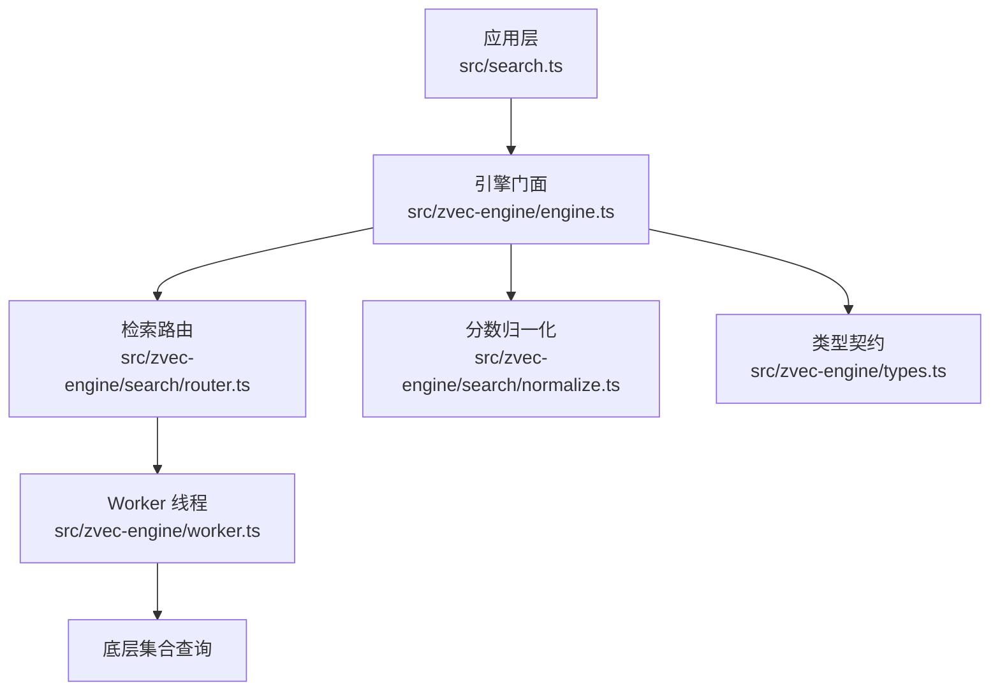
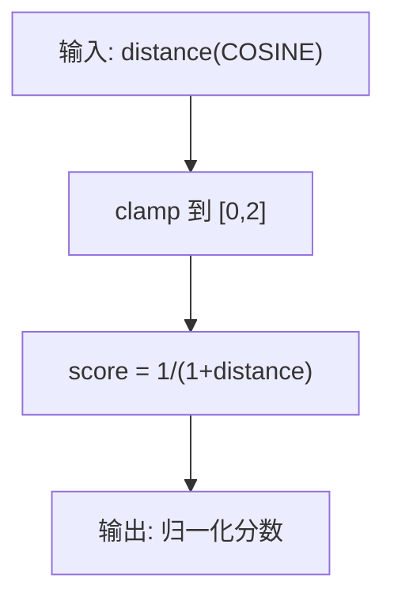
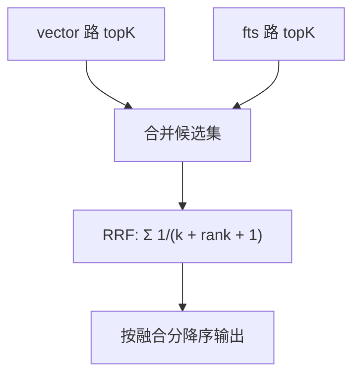
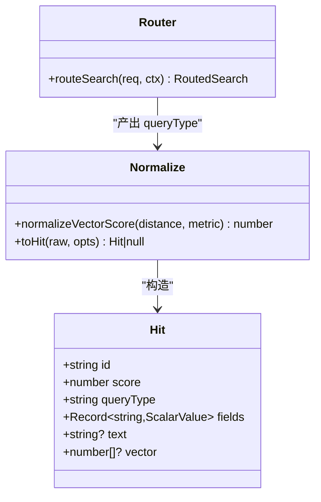
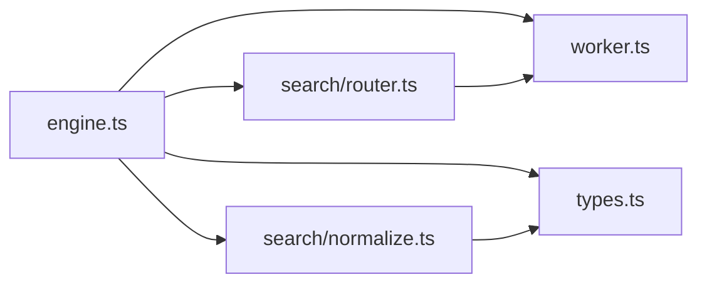

# 混合检索算法

<cite>
**本文引用的文件**
- [src/search.ts](file://src/search.ts)
- [src/zvec-engine/engine.ts](file://src/zvec-engine/engine.ts)
- [src/zvec-engine/search/router.ts](file://src/zvec-engine/search/router.ts)
- [src/zvec-engine/search/normalize.ts](file://src/zvec-engine/search/normalize.ts)
- [src/zvec-engine/types.ts](file://src/zvec-engine/types.ts)
- [src/zvec-engine/worker.ts](file://src/zvec-engine/worker.ts)
- [docs/cli.md](file://docs/cli.md)
- [zvec-probe-node/zvec_demo.mjs](file://zvec-probe-node/zvec_demo.mjs)
- [test/e2e/zvec-engine-e2e.network.mjs](file://test/e2e/zvec-engine-e2e.network.mjs)
</cite>

## 目录
1. [简介](#简介)
2. [项目结构](#项目结构)
3. [核心组件](#核心组件)
4. [架构总览](#架构总览)
5. [详细组件分析](#详细组件分析)
6. [依赖关系分析](#依赖关系分析)
7. [性能考量](#性能考量)
8. [故障排查指南](#故障排查指南)
9. [结论](#结论)
10. [附录](#附录)

## 简介
本技术文档围绕仓库中的混合检索能力，系统阐述语义向量检索、BM25 全文检索与 RRF（Reciprocal Rank Fusion）融合排序的算法原理、权重分配策略、相似度计算与结果融合机制。同时给出参数调优建议、性能对比分析与适用场景说明，并提供自定义评分策略与多源结果归一化的实现思路与参考路径。

## 项目结构
与混合检索直接相关的代码集中在 zvec-engine 子模块与上层搜索入口：
- 引擎门面与编排：engine.ts
- 检索路由与退化矩阵：search/router.ts
- 分数归一化：search/normalize.ts
- 类型定义（含 HybridSearchReq、Hit 等）：types.ts
- Worker 线程与底层调用：worker.ts
- CLI 与高层搜索封装：search.ts、docs/cli.md
- 探针与示例：zvec-probe-node/zvec_demo.mjs
- 端到端测试：test/e2e/zvec-engine-e2e.network.mjs



图表来源
- [src/zvec-engine/engine.ts:454-495](file://src/zvec-engine/engine.ts#L454-L495)
- [src/zvec-engine/search/router.ts:43-127](file://src/zvec-engine/search/router.ts#L43-L127)
- [src/zvec-engine/search/normalize.ts:16-63](file://src/zvec-engine/search/normalize.ts#L16-L63)
- [src/zvec-engine/worker.ts:118-163](file://src/zvec-engine/worker.ts#L118-L163)

章节来源
- [src/zvec-engine/engine.ts:454-495](file://src/zvec-engine/engine.ts#L454-L495)
- [src/zvec-engine/search/router.ts:43-127](file://src/zvec-engine/search/router.ts#L43-L127)
- [src/zvec-engine/search/normalize.ts:16-63](file://src/zvec-engine/search/normalize.ts#L16-L63)
- [src/zvec-engine/worker.ts:118-163](file://src/zvec-engine/worker.ts#L118-L163)

## 核心组件
- 检索路由（router）：根据请求决定走单路向量、单路 BM25 或混合两路；当同时提供 fts 与 queryText/vector 时进入 multiQuery 并携带 rerank 配置。
- 分数归一化（normalize）：将 COSINE 距离转换为“越大越相关”的分数；fts/hybrid 分数直通。
- 引擎门面（engine）：编排 embed、路由、下发到 worker、收集原始命中并归一化为 Hit。
- 类型契约（types）：统一 HybridSearchReq、rerank 策略（rrf/weighted）、Hit.score 含义。
- CLI/高层搜索（search.ts, docs/cli.md）：对外暴露 ki search，默认使用 hybrid + RRF，并提供阈值过滤与标签优先级策略。

章节来源
- [src/zvec-engine/search/router.ts:43-127](file://src/zvec-engine/search/router.ts#L43-L127)
- [src/zvec-engine/search/normalize.ts:16-63](file://src/zvec-engine/search/normalize.ts#L16-L63)
- [src/zvec-engine/engine.ts:454-495](file://src/zvec-engine/engine.ts#L454-L495)
- [src/zvec-engine/types.ts:118-151](file://src/zvec-engine/types.ts#L118-L151)
- [docs/cli.md:469-540](file://docs/cli.md#L469-L540)

## 架构总览
混合检索在 engine.search 中完成：先编译 filter，再经 routeSearch 选择 query/multiQuery；若需要则主线程 embed 文本为向量；随后通过 proxy.send 下发到 worker 执行底层查询；最后用 toHit 做分数归一化并返回 Hit[]。

```mermaid
sequenceDiagram
participant U as "调用方"
participant E as "ZvecEngine"
participant R as "routeSearch"
participant W as "Worker"
participant N as "toHit"
U->>E : hybridSearch({queryText, fts, rerank})
E->>R : 路由(确定 vector/fts/hybrid)
alt 需要 embed
E->>E : embed(queryText) -> Float32Array
end
E->>W : query/multiQuery(filterSql, topk, rerank)
W-->>E : RawHitPayload[]
E->>N : normalize(vector→score; fts/hybrid 直通)
N-->>E : Hit[]
E-->>U : Hit[]
```

图表来源
- [src/zvec-engine/engine.ts:454-495](file://src/zvec-engine/engine.ts#L454-L495)
- [src/zvec-engine/search/router.ts:43-127](file://src/zvec-engine/search/router.ts#L43-L127)
- [src/zvec-engine/search/normalize.ts:16-63](file://src/zvec-engine/search/normalize.ts#L16-L63)
- [src/zvec-engine/worker.ts:118-163](file://src/zvec-engine/worker.ts#L118-L163)

## 详细组件分析

### 语义向量检索（COSINE 相似度）
- 相似度度量：COSINE 距离 distance ∈ [0,2]。
- 分数转换：score = 1 / (1 + distance)，映射到 [1/3, 1]，越大越相关。
- 异常处理：distance < 0 或 > 2 会被 clamp；NaN/undefined 的命中丢弃。



图表来源
- [src/zvec-engine/search/normalize.ts:16-25](file://src/zvec-engine/search/normalize.ts#L16-L25)

章节来源
- [src/zvec-engine/search/normalize.ts:16-63](file://src/zvec-engine/search/normalize.ts#L16-L63)
- [src/zvec-engine/types.ts:138-151](file://src/zvec-engine/types.ts#L138-L151)

### BM25 全文检索（FTS）
- 字段与分词：支持 standard/whitespace/jieba 等分词器，可配置过滤器。
- 分数：BM25 原值，已满足“越大越相关”，无需额外转换。
- 路由退化：若无 fts 字段但请求包含 fts，将抛出无效搜索错误；仅 fts 时走单路 FTS。

章节来源
- [src/zvec-engine/types.ts:27-32](file://src/zvec-engine/types.ts#L27-L32)
- [src/zvec-engine/search/router.ts:129-146](file://src/zvec-engine/search/router.ts#L129-L146)
- [src/zvec-engine/search/normalize.ts:1-10](file://src/zvec-engine/search/normalize.ts#L1-L10)

### RRF 融合排序（Reciprocal Rank Fusion）
- 触发条件：当同时存在 fts 与 queryText/vector 时，进入 multiQuery 并启用 rerank。
- 默认策略：RRF，rankConstant 默认 60；也可选择 weighted 加权融合。
- 行为：对每路召回结果按排名位置累加 1/(k + rank + 1)，得到融合分；最终按融合分降序。



图表来源
- [src/zvec-engine/search/router.ts:74-100](file://src/zvec-engine/search/router.ts#L74-L100)
- [docs/cli.md:469-540](file://docs/cli.md#L469-L540)
- [zvec-probe-node/zvec_demo.mjs:171-203](file://zvec-probe-node/zvec_demo.mjs#L171-L203)

章节来源
- [src/zvec-engine/search/router.ts:74-100](file://src/zvec-engine/search/router.ts#L74-L100)
- [docs/cli.md:469-540](file://docs/cli.md#L469-L540)
- [zvec-probe-node/zvec_demo.mjs:171-203](file://zvec-probe-node/zvec_demo.mjs#L171-L203)

### 权重分配策略（weighted vs rrf）
- RRF：基于排名的无参融合，适合不同尺度/量纲的分数，鲁棒性强。
- Weighted：对每路分数赋予权重后线性组合，要求分数可比且需调权；当某路分数尺度远大于另一路时，可能主导排序。
- 工程约束：使用 weighted 时必须提供 weights 映射 denseField 与 ftsField 的权重数组。

章节来源
- [src/zvec-engine/search/router.ts:176-190](file://src/zvec-engine/search/router.ts#L176-L190)
- [src/zvec-engine/types.ts:118-136](file://src/zvec-engine/types.ts#L118-L136)

### 结果融合与归一化流程
- 单路向量：distance → score = 1/(1+distance)。
- 单路 FTS：BM25 原值直通。
- 混合两路：RRF 或 weighted 融合后再输出；Hybrid 路的 Hit.score 即为融合分。



图表来源
- [src/zvec-engine/search/normalize.ts:16-63](file://src/zvec-engine/search/normalize.ts#L16-L63)
- [src/zvec-engine/search/router.ts:43-127](file://src/zvec-engine/search/router.ts#L43-L127)
- [src/zvec-engine/types.ts:138-151](file://src/zvec-engine/types.ts#L138-L151)

章节来源
- [src/zvec-engine/search/normalize.ts:16-63](file://src/zvec-engine/search/normalize.ts#L16-L63)
- [src/zvec-engine/types.ts:138-151](file://src/zvec-engine/types.ts#L138-L151)

### 上层搜索与标签优先级（CLI 层）
- 默认行为：ki search 走 hybrid 混合检索（向量 + BM25），并使用 RRF 融合。
- 标签优先级：不传 tags 时按 tag 分查，优先 ki-search，其次 ki-relation/ki-path，避免重复并控制召回范围。
- 阈值过滤：通过 --threshold 过滤低融合分结果，建议区间 0.02~0.03（受 topk 影响）。

章节来源
- [src/search.ts:20-29](file://src/search.ts#L20-L29)
- [src/search.ts:94-121](file://src/search.ts#L94-L121)
- [docs/cli.md:469-540](file://docs/cli.md#L469-L540)

## 依赖关系分析
- engine.ts 依赖 router.ts、normalize.ts、types.ts 以及 worker.ts 提供的底层能力。
- router.ts 负责将高层请求映射为 worker 可执行的 Query/MultiQuery 负载，并注入 rerank 配置。
- normalize.ts 保证跨路分数可比性，使上层可按统一 score 排序。
- types.ts 统一了 HybridSearchReq 与 rerank 策略，确保 API 一致性。



图表来源
- [src/zvec-engine/engine.ts:454-495](file://src/zvec-engine/engine.ts#L454-L495)
- [src/zvec-engine/search/router.ts:43-127](file://src/zvec-engine/search/router.ts#L43-L127)
- [src/zvec-engine/search/normalize.ts:16-63](file://src/zvec-engine/search/normalize.ts#L16-L63)
- [src/zvec-engine/worker.ts:118-163](file://src/zvec-engine/worker.ts#L118-L163)

章节来源
- [src/zvec-engine/engine.ts:454-495](file://src/zvec-engine/engine.ts#L454-L495)
- [src/zvec-engine/search/router.ts:43-127](file://src/zvec-engine/search/router.ts#L43-L127)
- [src/zvec-engine/search/normalize.ts:16-63](file://src/zvec-engine/search/normalize.ts#L16-L63)
- [src/zvec-engine/worker.ts:118-163](file://src/zvec-engine/worker.ts#L118-L163)

## 性能考量
- 嵌入批大小：engine 内部以固定批次进行 embed，失败粒度小，避免整批失败导致零召回。
- 路由与降级：缺 fts 退化为单路向量；缺 queryText/vector 退化为单路 FTS；三者皆缺报错。
- 文本长度限制：queryText/vector/fts 均有长度校验，防止过大请求拖慢系统。
- topk 上限：topk 有最大值限制，避免大规模候选集导致融合与排序开销过大。
- 融合复杂度：RRF 对 topK 列表线性扫描，时间复杂度 O(K)；weighted 同样线性。

章节来源
- [src/zvec-engine/engine.ts:330-450](file://src/zvec-engine/engine.ts#L330-L450)
- [src/zvec-engine/search/router.ts:148-174](file://src/zvec-engine/search/router.ts#L148-L174)

## 故障排查指南
- 维度不匹配：vector 长度与集合 dimension 不一致会抛错。
- 缺少 fts 字段：请求包含 fts 但未配置 fts 字段会抛错。
- 互斥参数：queryText 与 vector 不能同时传入。
- topk 非法：非正整数或超过上限会抛错。
- 空/超长文本：queryText/vector/fts 为空串或超长会抛错。
- 分数异常：vector 路 distance 异常会被 clamp；NaN/undefined 命中丢弃。

章节来源
- [src/zvec-engine/search/router.ts:148-174](file://src/zvec-engine/search/router.ts#L148-L174)
- [src/zvec-engine/search/normalize.ts:16-25](file://src/zvec-engine/search/normalize.ts#L16-L25)
- [src/zvec-engine/engine.ts:454-495](file://src/zvec-engine/engine.ts#L454-L495)

## 结论
该仓库实现了完整的混合检索管线：语义向量检索（COSINE）与 BM25 全文检索并行召回，通过 RRF 或加权融合得到最终排序。engine 层提供稳定的编排与归一化，router 层负责退化与策略注入，normalize 层保证分数可比性。结合 CLI 层的阈值过滤与标签优先级，可在不同数据规模与查询意图下取得稳定效果。

## 附录

### 算法参数调优指南
- RRF rankConstant：默认 60；增大可降低头部排名优势，使排序更平滑。
- threshold（CLI）：建议 0.02~0.03；过高会过滤掉所有结果（理论上限约 0.033）。
- topk：控制每路候选数量；过大增加融合成本，过小可能漏召回。
- weighted 权重：仅在分数尺度相近时使用；若某路数值远大于另一路，可能导致主导排序。

章节来源
- [docs/cli.md:469-540](file://docs/cli.md#L469-L540)
- [src/zvec-engine/search/router.ts:176-190](file://src/zvec-engine/search/router.ts#L176-L190)

### 性能对比与适用场景
- 纯向量检索：适合自然语言、概念相似性强的查询；对同义词/泛化表达友好。
- 纯 FTS（BM25）：适合精确关键词、符号名、短术语匹配。
- 混合检索（RRF）：兼顾召回广度与精度，头部通常由向量主导；宽泛词时 FTS 贡献更多边缘召回。
- 加权融合：适用于已知某路更重要且分数尺度可比的场景。

章节来源
- [docs/cli.md:469-540](file://docs/cli.md#L469-L540)
- [test/e2e/zvec-engine-e2e.network.mjs:209-221](file://test/e2e/zvec-engine-e2e.network.mjs#L209-L221)

### 自定义评分策略与多源归一化示例（参考路径）
- 自定义加权融合：在 HybridSearchReq.rerank.type='weighted' 时，为 denseField 与 ftsField 分别设置权重数组，并在路由阶段转为权重向量。
- 多源分数归一化：
  - 向量路：使用 1/(1+distance) 归一化。
  - FTS 路：直接使用 BM25 原值。
  - 融合后：按融合分排序。
- 参考实现路径：
  - 路由与权重解析：[src/zvec-engine/search/router.ts:74-100](file://src/zvec-engine/search/router.ts#L74-L100)、[src/zvec-engine/search/router.ts:176-190](file://src/zvec-engine/search/router.ts#L176-L190)
  - 分数归一化：[src/zvec-engine/search/normalize.ts:16-63](file://src/zvec-engine/search/normalize.ts#L16-L63)
  - 类型定义：[src/zvec-engine/types.ts:118-151](file://src/zvec-engine/types.ts#L118-L151)
  - 探针示例（RRF 与 weighted 对比）：[zvec-probe-node/zvec_demo.mjs:171-203](file://zvec-probe-node/zvec_demo.mjs#L171-L203)