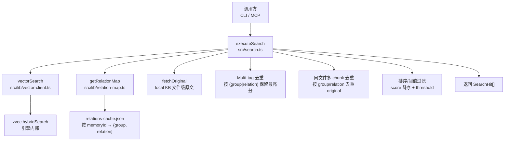
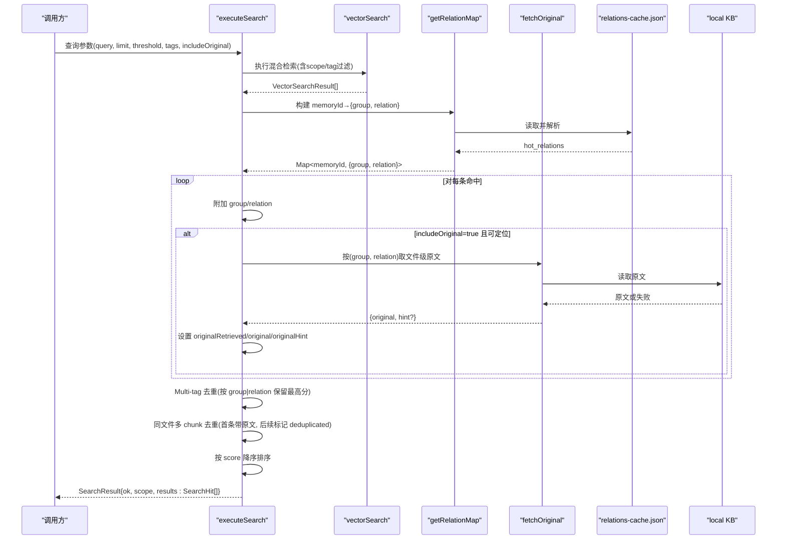
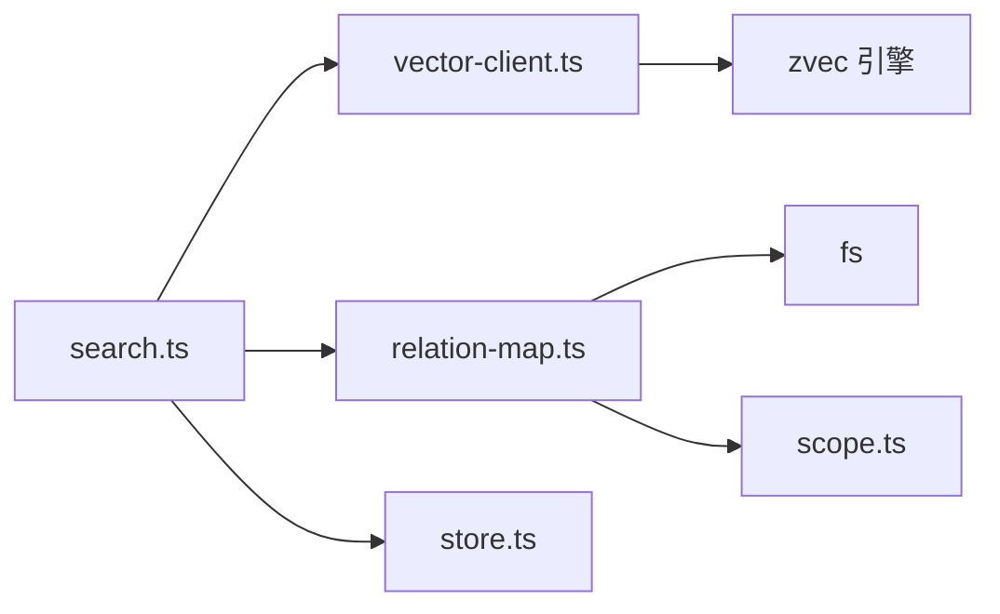

# 结果处理

<cite>
**本文引用的文件**
- [src/search.ts](file://src/search.ts)
- [src/lib/vector-client.ts](file://src/lib/vector-client.ts)
- [src/lib/relation-map.ts](file://src/lib/relation-map.ts)
- [src/lib/scoring.ts](file://src/lib/scoring.ts)
- [src/zvec-engine/search/normalize.ts](file://src/zvec-engine/search/normalize.ts)
- [src/lib/constants.ts](file://src/lib/constants.ts)
- [test/search-original.test.ts](file://test/search-original.test.ts)
</cite>

## 目录
1. [简介](#简介)
2. [项目结构](#项目结构)
3. [核心组件](#核心组件)
4. [架构总览](#架构总览)
5. [详细组件分析](#详细组件分析)
6. [依赖关系分析](#依赖关系分析)
7. [性能考量](#性能考量)
8. [故障排查指南](#故障排查指南)
9. [结论](#结论)
10. [附录](#附录)

## 简介
本文面向“搜索结果处理”的技术实现，围绕以下目标展开：
- SearchHit 数据结构设计与字段语义
- 原文召回与定位过程（基于 relations-cache 反查）
- Multi-tag 去重机制与同文件多 chunk 命中去重策略
- relations-cache 反查机制、Group/Relation 映射关系
- 原文获取失败降级处理
- 结果排序算法、分数标准化、结果增强与格式化输出
- 结果解读方法与调试工具使用指南

## 项目结构
搜索入口位于 CLI/MCP 共享的 executeSearch 流程，串联向量检索、relations-cache 反查、原文召回、Multi-tag 去重、同文件多 chunk 去重、排序与返回。

图表来源
- [src/search.ts:70-199](file://src/search.ts#L70-L199)
- [src/lib/vector-client.ts:496-533](file://src/lib/vector-client.ts#L496-L533)
- [src/lib/relation-map.ts:48-113](file://src/lib/relation-map.ts#L48-L113)

章节来源
- [src/search.ts:70-199](file://src/search.ts#L70-L199)
- [src/lib/vector-client.ts:496-533](file://src/lib/vector-client.ts#L496-L533)
- [src/lib/relation-map.ts:48-113](file://src/lib/relation-map.ts#L48-L113)

## 核心组件
- SearchHit：在向量层返回基础上扩展 group、relation、originalRetrieved、original、originalHint、deduplicated 等字段，用于原文定位与降级提示。
- vectorSearch：执行混合检索（语义+FTS+RRF），并按 scope/tag 过滤，返回基础命中。
- getRelationMap：从 relations-cache.json 构建 memoryId→{group, relation} 的反查映射，带 TTL 与 mtime/size 失效。
- fetchOriginal：根据 group/relation 读取 local KB 文件级原文；失败时返回精简 hint。
- 去重与排序：Multi-tag 去重（按 group|relation 取最高分）、同文件多 chunk 去重（同一文件的后续命中省略 original 并标记 deduplicated）。
- 分数标准化：向量路 COSINE 距离归一化，FTS/RRF 保持原值。

章节来源
- [src/search.ts:33-47](file://src/search.ts#L33-L47)
- [src/lib/vector-client.ts:496-533](file://src/lib/vector-client.ts#L496-L533)
- [src/lib/relation-map.ts:48-113](file://src/lib/relation-map.ts#L48-L113)
- [src/zvec-engine/search/normalize.ts:1-31](file://src/zvec-engine/search/normalize.ts#L1-L31)

## 架构总览
下图展示一次搜索请求从入口到最终结果的完整数据流，包括反查、原文召回、去重与排序。

图表来源
- [src/search.ts:70-199](file://src/search.ts#L70-L199)
- [src/lib/vector-client.ts:496-533](file://src/lib/vector-client.ts#L496-L533)
- [src/lib/relation-map.ts:48-113](file://src/lib/relation-map.ts#L48-L113)

## 详细组件分析

### SearchHit 数据结构设计
- 继承自向量层返回，新增：
  - group：所属 Group 路径（来自 relations-cache 反查，可能缺失）
  - relation：文件级 relation（basename 去扩展名，可能缺失）
  - originalRetrieved：是否成功获取原文
  - original：文件级原文（获取失败时缺失）
  - originalHint：原文不可用时的精简提示
  - deduplicated：同一文件多 chunk 命中时，非首条命中标记

该设计使上层消费方可区分“命中但无原文”和“同文件重复命中”，便于 UI 展示与二次处理。

章节来源
- [src/search.ts:33-47](file://src/search.ts#L33-L47)

### 原文召回与定位过程
- 通过 getRelationMap(scope) 构建 memoryId→{group, relation} 映射，支持方案 D 的多值 memoryIds 聚合到文件级 relation。
- 当 includeOriginal=true 且能定位到 group/relation 时，调用 fetchOriginal 从 local KB 读取文件级原文；若失败则降级为向量文档内容并附带 originalHint。
- 对于未定位到 group/relation 的情况，同样降级为向量文档内容并提示无法定位本地 KB 原文。

章节来源
- [src/lib/relation-map.ts:48-113](file://src/lib/relation-map.ts#L48-L113)
- [src/search.ts:123-157](file://src/search.ts#L123-L157)

### Multi-tag 去重机制
- 背景：sync-relation 会为每个自定义 tag 写入独立的 content 向量，导致同一文档在不同 tag 下重复命中。
- 策略：以 (group|relation) 作为键，保留 score 最高的那条；若发生去重，重建结果数组并保持 score 降序。
- 目的：避免同一文档因多 tag 多次出现，提升结果质量与可读性。

章节来源
- [src/search.ts:159-177](file://src/search.ts#L159-L177)

### 同文件多 chunk 命中去重策略
- 背景：一个文件被切分为多个 chunk，向量化后可能多条 chunk 同时命中。
- 策略：按 group/relation 去重 original 字段，仅第一条命中携带 original；后续命中删除 original，设置 originalRetrieved=true 并标记 deduplicated=true。
- 效果：避免重复返回相同原文片段，同时保留命中数量与顺序信息。

章节来源
- [src/search.ts:179-194](file://src/search.ts#L179-L194)

### relations-cache 反查机制与 Group/Relation 映射
- 缓存策略：模块级单例 Map<scope, {builtAt, mtimeMs, size, map}>，TTL 默认 10 分钟；文件 mtime/size 变化立即失效；读取失败返回空 Map。
- 构建逻辑：遍历 groups.hot_relations，优先使用 memoryIds 多值聚合到文件级 relation，回退旧数据的单值 memoryId。
- 用途：search 命中后按 memoryId 反查 group/relation，用于原文定位与去重键生成。

章节来源
- [src/lib/relation-map.ts:1-119](file://src/lib/relation-map.ts#L1-L119)

### 原文获取失败降级处理
- 触发条件：
  - relations-cache 缺失 group/relation 定位
  - local KB 中对应 relation 不存在
  - 文件读取异常
- 降级行为：
  - originalRetrieved=false
  - original 回退为向量文档 content
  - originalHint 提供精简提示（如本地 KB 缺失 relation 或读取异常）
- 影响：保证即使原文不可用，仍返回可用内容并给出明确提示，便于用户理解与后续操作。

章节来源
- [src/search.ts:135-157](file://src/search.ts#L135-L157)

### 结果排序算法与分数标准化
- 排序：results 按 score 降序排列；Multi-tag 去重后再次排序以保证全局有序。
- 分数标准化：
  - 向量路（COSINE）：distance ∈ [0,2] 归一化为 1/(1+distance)，越大越相关
  - FTS 路：BM25 原值，不转换
  - hybrid 路：RRF 融合分，不转换
- 阈值过滤：threshold 参数用于过滤低于阈值的命中（在 vectorSearch 阶段完成）。

章节来源
- [src/search.ts:174-176](file://src/search.ts#L174-L176)
- [src/zvec-engine/search/normalize.ts:1-31](file://src/zvec-engine/search/normalize.ts#L1-L31)
- [src/lib/vector-client.ts:496-533](file://src/lib/vector-client.ts#L496-L533)

### 结果增强与格式化输出
- 增强：
  - 附加 group/relation 用于定位
  - 可选附加 original/originalHint/deduplicated 用于原文与去重语义
- 输出：
  - 统一 SearchResult 类型：{ ok, scope, results } 或 { ok, error, degraded? }
  - CLI 直接 JSON 输出；MCP 可通过 include_original 控制是否返回原文
- 标签优先级：默认全量搜索时按 ki-search > ki-relation > ki-path 优先级合并各 tag 结果。

章节来源
- [src/search.ts:20-29](file://src/search.ts#L20-L29)
- [src/search.ts:49-51](file://src/search.ts#L49-L51)
- [src/search.ts:94-121](file://src/search.ts#L94-L121)

## 依赖关系分析
- search.ts 依赖：
  - vector-client.ts：执行混合检索与阈值过滤
  - relation-map.ts：构建 memoryId→{group, relation} 反查映射
  - store.ts：读取 local KB 文件级原文
  - config/scope：解析 scope、校验范围
- vector-client.ts 依赖：
  - zvec 引擎：hybridSearch、upsert、delete 等
  - 过滤器：buildScopeTagFilter 实现 scope + tag OR 组合
- relation-map.ts 依赖：
  - fs：读取 relations-cache.json
  - scope：获取 relations-cache 路径

图表来源
- [src/search.ts:70-199](file://src/search.ts#L70-L199)
- [src/lib/vector-client.ts:496-533](file://src/lib/vector-client.ts#L496-L533)
- [src/lib/relation-map.ts:48-113](file://src/lib/relation-map.ts#L48-L113)

章节来源
- [src/search.ts:70-199](file://src/search.ts#L70-L199)
- [src/lib/vector-client.ts:496-533](file://src/lib/vector-client.ts#L496-L533)
- [src/lib/relation-map.ts:48-113](file://src/lib/relation-map.ts#L48-L113)

## 性能考量
- 反查映射缓存：TTL 10 分钟 + mtime/size 失效，首次构建 O(N)，后续 O(1)。
- 向量检索：hybridSearch 单次调用，tags 为空时按 tag 分查并合并，减少无效扫描。
- 去重复杂度：Multi-tag 去重使用 Map，时间复杂度 O(M)；同文件多 chunk 去重使用 Set，时间复杂度 O(K)。
- 原文读取：仅在 includeOriginal=true 时执行，避免不必要的 IO。
- 阈值过滤：在向量层提前过滤低分命中，减少后续处理开销。

[本节为通用性能讨论，不直接分析具体文件]

## 故障排查指南
- 向量服务不可用：
  - 现象：返回 { ok: false, error, degraded: true }
  - 处理：检查 ensureVectorAvailable 返回的 reason，必要时重建向量库
- 原文不可用：
  - 现象：originalRetrieved=false，originalHint 提示原因
  - 处理：确认 local KB 是否存在对应 relation；必要时执行 sync-relation 或 restore --rebuild-vector
- 同文件多 chunk 命中：
  - 现象：多条命中但 original 仅首条存在，后续 deduplicated=true
  - 处理：这是预期行为，UI 应合并显示或提示“同文件多篇片段”
- 反查映射陈旧：
  - 现象：group/relation 缺失
  - 处理：等待 TTL 过期或触发文件变更；测试中可使用 clearRelationMapCache 清空缓存

章节来源
- [src/search.ts:84-92](file://src/search.ts#L84-L92)
- [src/search.ts:135-157](file://src/search.ts#L135-L157)
- [src/lib/relation-map.ts:48-78](file://src/lib/relation-map.ts#L48-L78)

## 结论
本实现通过清晰的 SearchHit 模型、relations-cache 反查、原文召回与多级去重策略，提供了高质量、可解释的搜索结果。分数标准化与阈值过滤确保结果相关性，而原文降级机制保障了可用性。整体流程兼顾性能与鲁棒性，适合在生产环境中稳定运行。

[本节为总结性内容，不直接分析具体文件]

## 附录

### 结果解读方法
- 关注字段：
  - score：相关性分数（越高越相关）
  - group/relation：定位原文位置
  - originalRetrieved/original：是否成功获取原文及内容
  - originalHint：原文不可用时的提示
  - deduplicated：是否因同文件多 chunk 命中而被去重
- 建议：
  - 优先查看 originalRetrieved=true 的结果
  - 对 deduplicated=true 的结果合并阅读
  - 结合 group/relation 快速定位原文

章节来源
- [src/search.ts:33-47](file://src/search.ts#L33-L47)
- [src/search.ts:179-194](file://src/search.ts#L179-L194)

### 调试工具使用指南
- 清空反查缓存：
  - 使用 clearRelationMapCache() 强制重建映射，验证最新 relations-cache 状态
- 验证同文件多 chunk 聚合：
  - 参考测试用例，确认两个 chunk memoryId 聚合到同一文件级 relation
- 检查标签优先级：
  - 默认全量搜索时，ki-search 优先于 ki-relation/ki-path

章节来源
- [src/lib/relation-map.ts:116-119](file://src/lib/relation-map.ts#L116-L119)
- [test/search-original.test.ts:133-144](file://test/search-original.test.ts#L133-L144)
- [src/search.ts:20-29](file://src/search.ts#L20-L29)