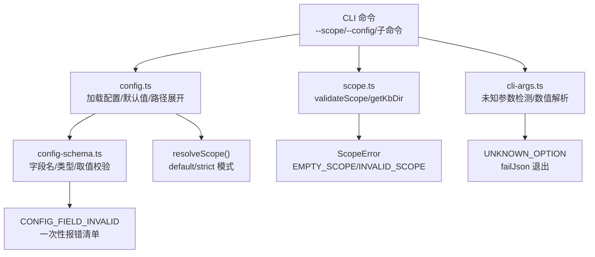
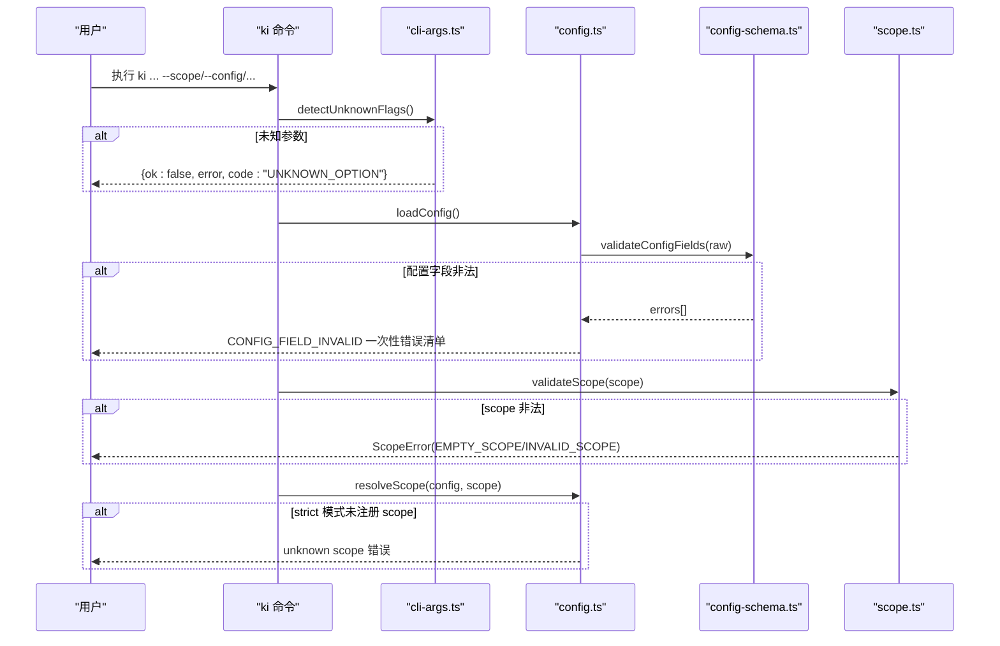
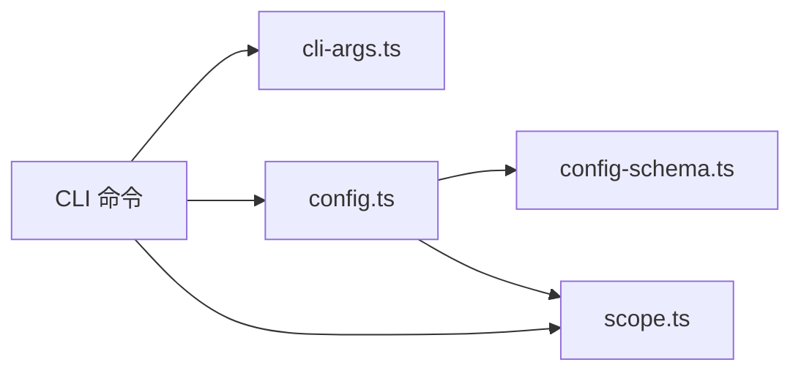

# 常见问题与解决方案

<cite>
**本文引用的文件**
- [src/lib/config-schema.ts](file://src/lib/config-schema.ts)
- [src/lib/config.ts](file://src/lib/config.ts)
- [src/lib/scope.ts](file://src/lib/scope.ts)
- [src/lib/cli-args.ts](file://src/lib/cli-args.ts)
- [docs/configuration.md](file://docs/configuration.md)
- [docs/error-handling.md](file://docs/error-handling.md)
- [docs/cli.md](file://docs/cli.md)
</cite>

## 目录
1. [简介](#简介)
2. [项目结构](#项目结构)
3. [核心组件](#核心组件)
4. [架构总览](#架构总览)
5. [详细问题与解决方案](#详细问题与解决方案)
6. [依赖关系分析](#依赖关系分析)
7. [性能注意事项](#性能注意事项)
8. [故障排查指南](#故障排查指南)
9. [结论](#结论)

## 简介
本文件面向使用 knowledge-indexer（ki）的用户，聚焦三类高频问题：命令行参数校验失败、配置文件字段不合法、scope 权限与注册问题。每个问题均给出“现象描述 + 错误示例 + 根因分析 + 修复步骤 + 验证方法”，并提供可直接执行的命令路径与参考位置，帮助你快速定位并解决问题。

## 项目结构
与常见问题直接相关的代码与文档集中在以下模块：
- 配置加载与字段校验：config.ts、config-schema.ts
- Scope 校验与路径构造：scope.ts
- CLI 参数解析与统一错误输出：cli-args.ts
- 用户文档：configuration.md、error-handling.md、cli.md

图表来源
- [src/lib/cli-args.ts:77-106](file://src/lib/cli-args.ts#L77-L106)
- [src/lib/config.ts:156-183](file://src/lib/config.ts#L156-L183)
- [src/lib/config.ts:252-284](file://src/lib/config.ts#L252-L284)
- [src/lib/config-schema.ts:328-339](file://src/lib/config-schema.ts#L328-L339)
- [src/lib/scope.ts:30-43](file://src/lib/scope.ts#L30-L43)
- [src/lib/config.ts:470-485](file://src/lib/config.ts#L470-L485)

章节来源
- [docs/cli.md:1-20](file://docs/cli.md#L1-L20)
- [docs/configuration.md:7-24](file://docs/configuration.md#L7-L24)

## 核心组件
- 配置加载与校验：在语法解析成功后进行字段级校验，发现非法字段名/类型/取值会立即 fail-loud，避免静默错配。
- Scope 校验：对传入的 scope 做字符集校验，拒绝路径穿越等不安全输入；并在 strict 模式下强制白名单检查。
- CLI 参数校验：检测未知 --flag，提供相近参数建议，并以统一 JSON 错误格式退出。

章节来源
- [src/lib/config.ts:252-284](file://src/lib/config.ts#L252-L284)
- [src/lib/config-schema.ts:328-339](file://src/lib/config-schema.ts#L328-L339)
- [src/lib/scope.ts:30-43](file://src/lib/scope.ts#L30-L43)
- [src/lib/cli-args.ts:77-106](file://src/lib/cli-args.ts#L77-L106)

## 架构总览
下图展示了从 CLI 到配置与 scope 的关键调用链，以及错误如何被捕获和上报。

图表来源
- [src/lib/cli-args.ts:77-106](file://src/lib/cli-args.ts#L77-L106)
- [src/lib/config.ts:156-183](file://src/lib/config.ts#L156-L183)
- [src/lib/config.ts:252-284](file://src/lib/config.ts#L252-L284)
- [src/lib/config-schema.ts:328-339](file://src/lib/config-schema.ts#L328-L339)
- [src/lib/scope.ts:30-43](file://src/lib/scope.ts#L30-L43)
- [src/lib/config.ts:470-485](file://src/lib/config.ts#L470-L485)

## 详细问题与解决方案

### 问题一：命令行参数校验失败（未知参数/拼写错误）
- 典型现象
  - 传入了命令不支持的 --flag，如 --scop、--scopt、--source-dir 等。
  - 带值参数未用 = 形式，导致值被误判为未知参数。
- 错误信息示例
  - 标准输出返回 JSON 错误负载，包含 code 为 UNKNOWN_OPTION，并附带可用参数列表或相近参数建议。
- 根本原因
  - 手写 argv 解析器对未知 --flag 严格拦截，防止静默忽略导致行为不可预期。
- 修复步骤
  - 使用帮助文本确认该命令支持的参数集合。
  - 修正参数名；如需传值，优先使用 --flag=value 形式，或在支持的位置传参。
  - 若不确定，先运行命令加 -h 查看帮助。
- 可执行修复命令
  - 查看帮助：`ki <子命令> -h`
  - 重新执行正确参数版本：`ki <子命令> --scope my-project --source /path/to/wiki`
- 验证方法
  - 再次执行命令，确认不再出现 UNKNOWN_OPTION 错误。
  - 通过 `ki doctor` 检查整体环境是否就绪。

章节来源
- [src/lib/cli-args.ts:77-106](file://src/lib/cli-args.ts#L77-L106)
- [docs/cli.md:1-20](file://docs/cli.md#L1-L20)

### 问题二：配置文件字段不合法（CONFIG_FIELD_INVALID）
- 典型现象
  - 任何 ki 命令（包括启动 mcp、doctor）都报“配置加载失败：CONFIG_FIELD_INVALID”。
  - 常见错误：字段名拼错（如 datadir）、类型不符（dimension 写成字符串）、取值非法（port 超出范围）。
- 错误信息示例
  - 一次性列出全部问题（最多 10 条），每条包含字段路径与具体原因，例如：
    - “datadir：非预期字段，您是否想输入 dataDir？”
    - “embedding.dimension：应为数字，实际为 string”
- 根本原因
  - 配置在语法解析后还会进行字段级校验（字段名/类型/取值），避免过去“静默落默认值/NaN”带来的隐性错配。
- 修复步骤
  - 根据错误清单逐条修改配置：
    - 修正字段名（注意大小写与拼写）。
    - 修正类型（如 dimension 必须为数字）。
    - 修正取值范围（如端口 1-65535、baseURL 必须以 http(s):// 开头）。
  - 注意两个陷阱：
    - 只写键名未赋值（dataDir: 后空着）会被视为 null，需赋有效值。
    - YAML 合并键 <<: *anchor 在本项目中不生效，请使用整值引用 *anchor。
- 可执行修复命令
  - 生成模板并编辑：`ki config init`，然后手动编辑 ~/.ki/config.yaml。
  - 校验配置：`ki doctor`。
- 验证方法
  - 重新运行原命令，确认不再出现 CONFIG_FIELD_INVALID。
  - 使用 `ki doctor` 确认无配置告警。

章节来源
- [docs/error-handling.md:39-52](file://docs/error-handling.md#L39-L52)
- [docs/configuration.md:234-276](file://docs/configuration.md#L234-L276)
- [src/lib/config.ts:252-284](file://src/lib/config.ts#L252-L284)
- [src/lib/config-schema.ts:328-339](file://src/lib/config-schema.ts#L328-L339)

### 问题三：scope 权限与注册问题（unknown scope / Access denied）
- 典型现象
  - 在 strict 模式下未传 --scope，或传入未在 scopes 中注册的 scope 名称。
  - 某些命令提示“Access denied to scope: <scope>”，表示该 scope 未被注册。
- 错误信息示例
  - strict 模式：unknown scope: "<scope>"（已注册 scope：...）。
  - 访问受限：Access denied to scope: <scope>。
- 根本原因
  - scopeMode=strict 时，scopes 的 key 兼作白名单；未显式注册的 scope 将被拒绝。
  - 部分流程要求 scope 在配置中定义（如 wikiSync/source 等能力）。
- 修复步骤
  - 在配置文件中注册 scope：
    - 在 scopes 下添加对应 scope 条目（kbDir、wikiSync、clean、import 按需配置）。
    - 若需要 ACL 控制，按文档在 definitions/acl 中配置权限。
  - 切换模式：
    - 临时使用 default 模式允许任意 scope（仅用于调试/迁移）。
    - 生产建议使用 strict 模式并显式注册所有 scope。
- 可执行修复命令
  - 查看当前已初始化 scope：`ki manage-index --action list-scopes`
  - 编辑配置：`vi ~/.ki/config.yaml`，添加 scopes.<your-scope> 条目。
  - 校验并重启服务（如启用 mcp）：`ki doctor`，然后重启 ki mcp。
- 验证方法
  - 使用相同 scope 重新执行命令，确认不再报 unknown scope。
  - 使用 `ki manage-index --action list-scopes` 确认 scope 可见。

章节来源
- [docs/error-handling.md:99-113](file://docs/error-handling.md#L99-L113)
- [docs/configuration.md:92-113](file://docs/configuration.md#L92-L113)
- [src/lib/config.ts:470-485](file://src/lib/config.ts#L470-L485)

### 问题四：scope 参数非法（EMPTY_SCOPE / INVALID_SCOPE）
- 典型现象
  - 传入空 scope 或包含非法字符（如 /、..、空格等）。
- 错误信息示例
  - EMPTY_SCOPE：scope 不能为空。
  - INVALID_SCOPE：scope 不合法：仅允许字母、数字、连字符(-)、下划线(_)，禁止路径遍历字符。
- 根本原因
  - 安全策略限制 scope 仅允许字母、数字、连字符、下划线，防止路径穿越与跨 scope 污染。
- 修复步骤
  - 将 scope 改为仅含字母、数字、连字符、下划线的字符串。
  - 避免使用 /、..、空格等特殊字符。
- 可执行修复命令
  - 修正后重试：`ki scan-kb import -s my-project --source /path/to/wiki --group wiki`
- 验证方法
  - 重新执行命令，确认不再抛出 ScopeError。
  - 使用 `ki manage-index --action list-scopes` 查看结果。

章节来源
- [src/lib/scope.ts:30-43](file://src/lib/scope.ts#L30-L43)
- [docs/error-handling.md:15-25](file://docs/error-handling.md#L15-L25)

### 问题五：增量导入相关错误（删除失败/缓存未找到）
- 典型现象
  - 增量 modify/delete 时内部函数返回错误，但不阻塞流程。
  - relations-cache 中未找到 sourcePath，记录 warning 继续清理本地 KB。
- 根本原因
  - 首次导入可能未写入 sourcePath；向量库删除失败属于可恢复场景，记录警告继续执行。
- 修复步骤
  - 对于缺失 sourcePath 的情况，重新执行导入以补齐缓存。
  - 关注日志中的 warning，必要时重建向量索引。
- 可执行修复命令
  - 重新导入：`ki scan-kb import -s my-project --source /path/to/wiki --group wiki`
  - 重建向量（可选）：`ki search --rebuild-vector`（如适用）
- 验证方法
  - 观察日志中是否仍有 warning。
  - 使用 `ki search` 验证数据可召回。

章节来源
- [docs/error-handling.md:115-131](file://docs/error-handling.md#L115-L131)

### 问题六：展示参数问题（--mode 无效）
- 典型现象
  - 传入无效的 --mode 值，导致报错退出。
- 错误信息示例
  - 提示有效值列表（hot/warm/cold/emerging/full），并退出。
- 根本原因
  - 参数校验严格，确保查询模式合法。
- 修复步骤
  - 使用有效值之一，或逗号分隔多个值（如 hot,warm）。
- 可执行修复命令
  - 修正后重试：`ki query-group --mode hot,warm`
- 验证方法
  - 重新执行命令，确认不再报错。

章节来源
- [docs/error-handling.md:133-141](file://docs/error-handling.md#L133-L141)

## 依赖关系分析
- cli-args.ts 负责 CLI 层参数校验与统一错误输出，向上游命令暴露 failJson 与 toErrorPayload。
- config.ts 负责配置加载、默认值构建、路径展开与 scope 模式解析，并在加载阶段调用 config-schema.ts 进行字段级校验。
- config-schema.ts 定义配置项结构与校验规则，集中处理未知字段、类型不符、取值非法等问题。
- scope.ts 负责 scope 合法性校验与路径构造，保障数据安全隔离。

图表来源
- [src/lib/cli-args.ts:77-106](file://src/lib/cli-args.ts#L77-L106)
- [src/lib/config.ts:156-183](file://src/lib/config.ts#L156-L183)
- [src/lib/config.ts:252-284](file://src/lib/config.ts#L252-L284)
- [src/lib/config-schema.ts:328-339](file://src/lib/config-schema.ts#L328-L339)
- [src/lib/scope.ts:30-43](file://src/lib/scope.ts#L30-L43)

章节来源
- [src/lib/cli-args.ts:77-106](file://src/lib/cli-args.ts#L77-L106)
- [src/lib/config.ts:156-183](file://src/lib/config.ts#L156-L183)
- [src/lib/config.ts:252-284](file://src/lib/config.ts#L252-L284)
- [src/lib/config-schema.ts:328-339](file://src/lib/config-schema.ts#L328-L339)
- [src/lib/scope.ts:30-43](file://src/lib/scope.ts#L30-L43)

## 性能注意事项
- 配置加载仅在进程启动时进行一次，后续复用缓存，避免重复 IO。
- 字段级校验一次性收集全部问题（最多 10 条），减少用户反复修改的成本。
- 向量库 schema 创建后不可变更，新增字段需重建 collection，请谨慎操作以避免数据丢失。

[本节为通用指导，不直接分析具体文件]

## 故障排查指南
推荐排障顺序：
1. 先看命令参数是否完整（使用 -h 查看帮助）。
2. 再看 --scope 是否正确且已注册（list-scopes 确认）。
3. 再看输入路径是否真的存在（sourceDir/kbDir）。
4. 再看运行时数据文件是否缺失或损坏（relations-cache.json/group-index.json）。
5. 最后再检查工作流顺序是否跳步了。

常见恢复口诀：
- 参数先补齐
- 路径先确认
- scope 先注册
- 索引先生成
- 再做下一步

章节来源
- [docs/error-handling.md:144-160](file://docs/error-handling.md#L144-L160)

## 结论
通过统一的参数校验、严格的配置字段校验与安全化的 scope 管理，knowledge-indexer 能够在早期拦截大多数配置与使用错误。遇到问题时，优先依据错误清单逐项修复，并使用 ki doctor 与环境自检工具验证修复效果。遵循本文提供的修复步骤与验证方法，可显著降低排障成本并提升稳定性。