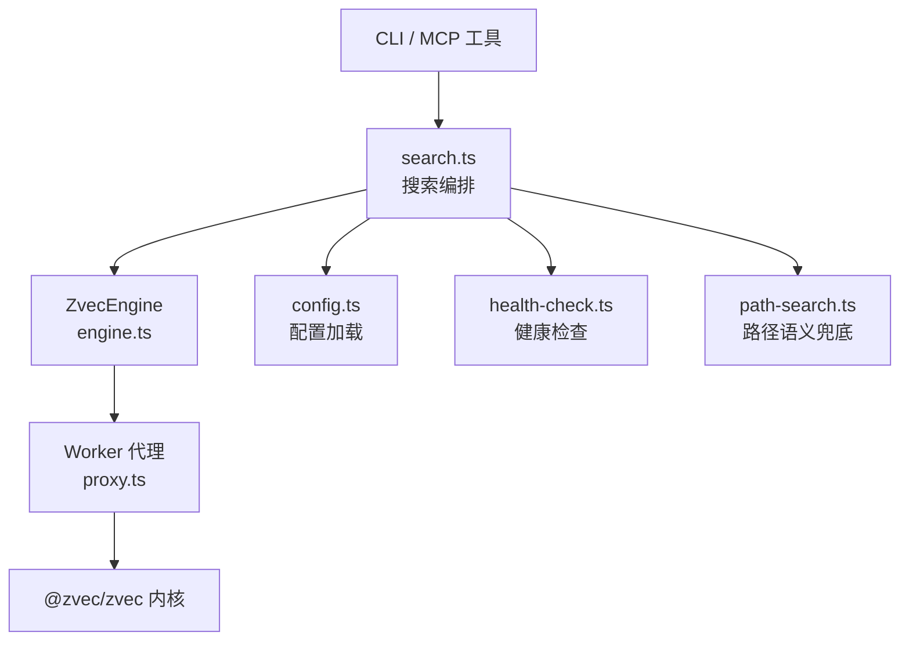
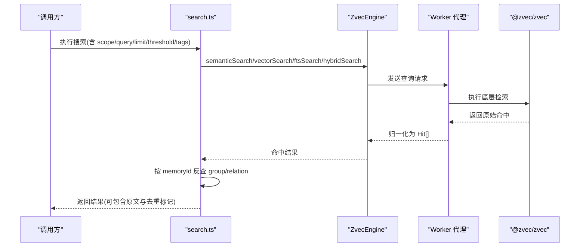
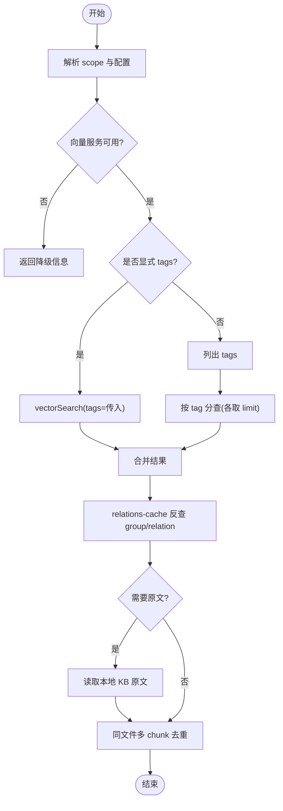
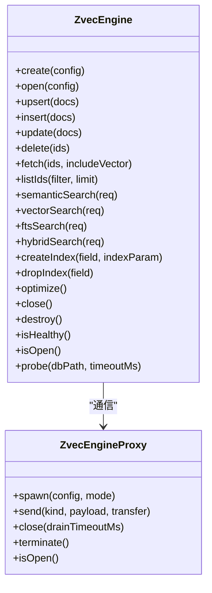
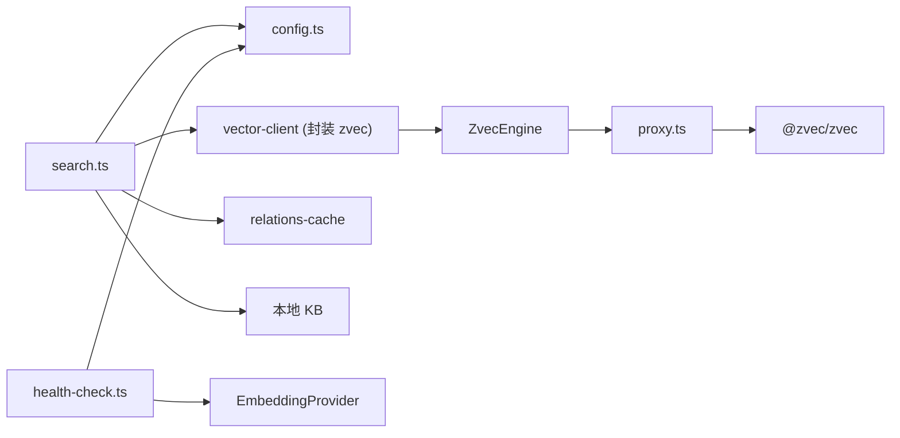

# 性能问题诊断

<cite>
**本文引用的文件**
- [README.md](file://README.md)
- [src/search.ts](file://src/search.ts)
- [src/zvec-engine/engine.ts](file://src/zvec-engine/engine.ts)
- [src/zvec-engine/proxy.ts](file://src/zvec-engine/proxy.ts)
- [src/zvec-engine/types.ts](file://src/zvec-engine/types.ts)
- [src/lib/config.ts](file://src/lib/config.ts)
- [src/lib/health-check.ts](file://src/lib/health-check.ts)
- [src/lib/path-search.ts](file://src/lib/path-search.ts)
- [src/lib/batch-vectorize.ts](file://src/lib/batch-vectorize.ts)
- [docs/vector-engine-mem.md](file://docs/vector-engine-mem.md)
- [package.json](file://package.json)
</cite>

## 目录
1. [简介](#简介)
2. [项目结构](#项目结构)
3. [核心组件](#核心组件)
4. [架构总览](#架构总览)
5. [详细组件分析](#详细组件分析)
6. [依赖关系分析](#依赖关系分析)
7. [性能考量与调优](#性能考量与调优)
8. [故障排查指南](#故障排查指南)
9. [结论](#结论)
10. [附录](#附录)

## 简介
本指南面向“搜索响应慢、向量检索延迟高、内存使用过高”等典型性能问题，提供从指标含义、关键参数调优、资源使用分析到慢查询定位、索引优化、并发参数调整、基准测试与容量规划的系统化方法。内容基于仓库内向量引擎（zvec）封装、搜索流程、配置与健康检查等实现进行说明，帮助快速定位瓶颈并给出可操作的优化建议。

## 项目结构
- 入口与命令：CLI 通过 commander 暴露 search、store、bulk-store、mcp 等命令；MCP HTTP 模式常驻服务。
- 向量引擎层：ZvecEngine 门面类负责 create/open/upsert/search/close 生命周期，内部通过 Worker 代理与 Rust 内核交互。
- 搜索编排：search.ts 负责标签优先级、多 tag 分查、原文反查与去重。
- 配置与健康：config.ts 解析 YAML/JSON 配置；health-check.ts 提供启动前健康检查（Embedding 连通性、维度匹配、目录权限）。
- 路径语义兜底：path-search.ts 在精确匹配失败时走 hybridSearch 召回近似路径。
- 批量向量化：batch-vectorize.ts 支持一次 engine + 批量 embed 的高效写入。

**图表来源**
- [src/search.ts:70-199](file://src/search.ts#L70-L199)
- [src/zvec-engine/engine.ts:97-131](file://src/zvec-engine/engine.ts#L97-L131)
- [src/zvec-engine/proxy.ts:56-109](file://src/zvec-engine/proxy.ts#L56-L109)
- [src/lib/config.ts:156-183](file://src/lib/config.ts#L156-L183)
- [src/lib/health-check.ts:150-240](file://src/lib/health-check.ts#L150-L240)
- [src/lib/path-search.ts:1-36](file://src/lib/path-search.ts#L1-L36)

**章节来源**
- [README.md:35-54](file://README.md#L35-L54)
- [package.json:9-32](file://package.json#L9-L32)

## 核心组件
- ZvecEngine：集合创建/打开、写入（upsert/insert/update）、检索（semantic/vector/fts/hybrid）、索引管理、健康探测。
- Worker 代理：主线程与 worker 通信，管理 spawn/close/terminate 与错误传播。
- 搜索编排：按标签优先级分查、按 memoryId 反查 relations-cache 获取 group/relation、可选返回原文并去重。
- 配置系统：YAML/JSON 配置解析、默认路径、scopeMode、embedding 配置、字段校验。
- 健康检查：目录权限、apiKey、Embedding 连通性与维度匹配、collection 存在性。
- 路径语义兜底：精确匹配失败时通过 hybridSearch 召回近似路径，阈值与下游二次校验配合。

**章节来源**
- [src/zvec-engine/engine.ts:97-131](file://src/zvec-engine/engine.ts#L97-L131)
- [src/zvec-engine/engine.ts:243-326](file://src/zvec-engine/engine.ts#L243-L326)
- [src/zvec-engine/proxy.ts:56-109](file://src/zvec-engine/proxy.ts#L56-L109)
- [src/search.ts:70-199](file://src/search.ts#L70-L199)
- [src/lib/config.ts:156-183](file://src/lib/config.ts#L156-L183)
- [src/lib/health-check.ts:150-240](file://src/lib/health-check.ts#L150-L240)
- [src/lib/path-search.ts:1-36](file://src/lib/path-search.ts#L1-L36)

## 架构总览
kisearch 采用“发现层（zvec 向量引擎）+ 交付层（Group 树/Relation 缓存/原文）”的双层架构。搜索流程先经标签分查与混合检索召回，再通过 relations-cache 反查定位原文；必要时启用路径语义兜底。

**图表来源**
- [src/search.ts:70-199](file://src/search.ts#L70-L199)
- [src/zvec-engine/engine.ts:298-326](file://src/zvec-engine/engine.ts#L298-L326)
- [src/zvec-engine/engine.ts:454-495](file://src/zvec-engine/engine.ts#L454-L495)
- [src/zvec-engine/proxy.ts:114-126](file://src/zvec-engine/proxy.ts#L114-L126)

## 详细组件分析

### 搜索流程与性能关键点
- 标签优先级与多 tag 分查：不传 tags 时按 ki-search > ki-relation > ki-path 优先级分别查询，每个 tag 最多取 limit 条，再合并排序，避免全量扫描。
- 原文反查与去重：命中后通过 relations-cache 反查 group/relation，按需读取本地 KB 原文；同一文件多 chunk 命中会去重，减少冗余输出。
- 阈值过滤：threshold 控制融合得分下限，过小会导致噪声增多、处理开销上升。
- 关闭引擎：CLI 每次调用后 closeEngine，避免进程无法退出导致的资源泄漏。

**图表来源**
- [src/search.ts:70-199](file://src/search.ts#L70-L199)

**章节来源**
- [src/search.ts:70-199](file://src/search.ts#L70-L199)

### 向量引擎（ZvecEngine）写入与检索
- 写入批处理：embed 小批大小固定为 64，失败粒度为小批，避免单次抖动导致整批失败；write batch size 默认 100。
- 维度与白名单校验：写入前校验 vector 维度与 fields 白名单，防止脏数据进入索引。
- 检索路由：根据请求类型路由至 vector/fts/hybrid，必要时在主线程 embed，注入 filterSql 后下发 worker。
- 健康探测：probe 对空目录与持锁场景做超时保护，避免阻塞。

**图表来源**
- [src/zvec-engine/engine.ts:97-131](file://src/zvec-engine/engine.ts#L97-L131)
- [src/zvec-engine/engine.ts:243-326](file://src/zvec-engine/engine.ts#L243-L326)
- [src/zvec-engine/engine.ts:454-495](file://src/zvec-engine/engine.ts#L454-L495)
- [src/zvec-engine/proxy.ts:56-109](file://src/zvec-engine/proxy.ts#L56-L109)

**章节来源**
- [src/zvec-engine/engine.ts:62-67](file://src/zvec-engine/engine.ts#L62-L67)
- [src/zvec-engine/engine.ts:330-450](file://src/zvec-engine/engine.ts#L330-L450)
- [src/zvec-engine/engine.ts:454-495](file://src/zvec-engine/engine.ts#L454-L495)
- [src/zvec-engine/engine.ts:151-199](file://src/zvec-engine/engine.ts#L151-L199)

### 配置与健康检查
- 配置加载：YAML/JSON 双格式，字段级校验 fail-loud；默认 dataDir/backupDir/vectorDir 统一落 ~/.ki。
- Embedding 三合一检查：一次性最短文本请求验证 URL 连通性、密钥有效性、维度匹配，超时与重试可控。
- collection 存在性：仅目录非空判定，避免与常驻 server 的文件锁冲突。

**章节来源**
- [src/lib/config.ts:156-183](file://src/lib/config.ts#L156-L183)
- [src/lib/config.ts:252-385](file://src/lib/config.ts#L252-L385)
- [src/lib/health-check.ts:54-144](file://src/lib/health-check.ts#L54-L144)
- [src/lib/health-check.ts:150-240](file://src/lib/health-check.ts#L150-L240)

### 路径语义兜底
- 精确匹配失败时，通过 hybridSearch 召回 ki-path/ki-relation 的近似路径，RRF 融合分量级远小于 1，故默认阈值为 0，由下游二次校验保证质量。
- 异常静默降级返回 null，不影响主流程。

**章节来源**
- [src/lib/path-search.ts:1-36](file://src/lib/path-search.ts#L1-L36)

### 批量向量化
- bulkVectorize：一次 engine + 批量 embed，显著降低网络与序列化开销。
- 失败条目记录 errors，不中断整体写入。

**章节来源**
- [src/lib/batch-vectorize.ts:1-27](file://src/lib/batch-vectorize.ts#L1-L27)

## 依赖关系分析
- 搜索编排依赖配置加载、向量客户端、relations-cache 与本地 KB。
- 向量引擎依赖 Worker 代理与 @zvec/zvec 内核；嵌入由 SiliconFlowProvider 提供。
- 健康检查依赖配置与 Embedding 提供者，用于启动前自检。

**图表来源**
- [src/search.ts:70-199](file://src/search.ts#L70-L199)
- [src/zvec-engine/engine.ts:97-131](file://src/zvec-engine/engine.ts#L97-L131)
- [src/zvec-engine/proxy.ts:56-109](file://src/zvec-engine/proxy.ts#L56-L109)
- [src/lib/health-check.ts:150-240](file://src/lib/health-check.ts#L150-L240)

**章节来源**
- [src/search.ts:70-199](file://src/search.ts#L70-L199)
- [src/zvec-engine/engine.ts:97-131](file://src/zvec-engine/engine.ts#L97-L131)
- [src/zvec-engine/proxy.ts:56-109](file://src/zvec-engine/proxy.ts#L56-L109)
- [src/lib/health-check.ts:150-240](file://src/lib/health-check.ts#L150-L240)

## 性能考量与调优

### 关键性能指标与含义
- 首条检索延迟：受冷启动、embed 耗时、worker 通信影响；常驻模式下应显著降低。
- 平均检索延迟：混合检索（dense + FTS + RRF）的端到端时间，关注 topk 与 filter 复杂度。
- 写入吞吐：批量大小、embed 批次、网络抖动对 upsert/insert 的影响。
- 内存占用：向量维度、topk、返回原文体积、relations-cache 规模。
- 健康状态：Embedding 连通性、维度匹配、collection 存在性。

**章节来源**
- [docs/vector-engine-mem.md:233-245](file://docs/vector-engine-mem.md#L233-L245)
- [src/zvec-engine/engine.ts:62-67](file://src/zvec-engine/engine.ts#L62-L67)
- [src/search.ts:70-199](file://src/search.ts#L70-L199)

### 慢查询定位步骤
- 确认向量服务可用性：通过 health-check 的 embedding 连通性与维度匹配项判断。
- 缩小查询范围：显式传入 tags 或提高 threshold，减少多 tag 分查与噪声。
- 控制 topk：过大的 limit 会增加排序与原文读取开销。
- 检查 filter：复杂 filter 可能增加编译与执行成本，尽量利用 metadata 过滤（tags/scope/doc_id）。
- 观察原文返回：includeOriginal 开启会增加 IO 与序列化成本，仅在必要时开启。

**章节来源**
- [src/lib/health-check.ts:54-144](file://src/lib/health-check.ts#L54-L144)
- [src/search.ts:70-199](file://src/search.ts#L70-L199)
- [src/zvec-engine/engine.ts:454-495](file://src/zvec-engine/engine.ts#L454-L495)

### 索引结构与检索优化
- 使用混合检索：hybridSearch（dense + FTS + RRF）兼顾语义与符号召回，提升准确率与稳定性。
- 合理设置 topk 与 rankConstant：RRF 融合中 rankConstant 影响排名集中度，过大易被顶部主导。
- 维护 tags 与 scope：通过 metadata 过滤缩小候选集，避免全库扫描。
- 定期 optimize：在大量写入后执行 optimize，改善索引结构。

**章节来源**
- [src/zvec-engine/engine.ts:316-326](file://src/zvec-engine/engine.ts#L316-L326)
- [docs/vector-engine-mem.md:118-151](file://docs/vector-engine-mem.md#L118-L151)

### 并发与批处理调优
- embed 批次：EMBED_BATCH_SIZE=64，失败粒度为小批，避免整批失败；可根据网络与 API 限流调整 provider 的 batchSize。
- write batch size：DEFAULT_WRITE_BATCH_SIZE=100，适合批量写入；过大可能增加单次 IO 压力。
- 批量向量化：优先使用 bulkVectorize，共享一次 engine + 批量 embed，显著降低开销。

**章节来源**
- [src/zvec-engine/engine.ts:62-67](file://src/zvec-engine/engine.ts#L62-L67)
- [src/zvec-engine/engine.ts:330-450](file://src/zvec-engine/engine.ts#L330-L450)
- [src/lib/batch-vectorize.ts:1-27](file://src/lib/batch-vectorize.ts#L1-L27)

### 资源使用分析与工具
- 健康检查：ki doctor 或 MCP 启动预检，报告配置、目录、apiKey、embedding、collection 状态。
- 进程与锁：proxy 的 drain/terminate 确保 worker 释放 LOCK 与句柄，避免残留占用。
- 日志与降级：search 在原文不可用时降级返回向量文档并提示；路径语义兜底异常静默降级。

**章节来源**
- [src/lib/health-check.ts:150-240](file://src/lib/health-check.ts#L150-L240)
- [src/zvec-engine/proxy.ts:131-173](file://src/zvec-engine/proxy.ts#L131-L173)
- [src/search.ts:123-199](file://src/search.ts#L123-L199)

### 容量规划与扩展性
- 向量维度与存储：dimension 必须与 embedding 一致，过大将增加内存与带宽消耗。
- 标签基数：过多 tags 会增加分查次数与合并开销，建议收敛高频标签。
- 多 scope 隔离：不同 scope 物理隔离，便于横向扩展与资源配额。
- 常驻模式：MCP HTTP 共享单例，减少冷启动与重复初始化开销。

**章节来源**
- [src/lib/config.ts:116-145](file://src/lib/config.ts#L116-L145)
- [src/search.ts:20-29](file://src/search.ts#L20-L29)
- [README.md:220-239](file://README.md#L220-L239)

## 故障排查指南
- 向量服务不可用：health-check 显示 URL 连通性或密钥无效；检查 baseURL、apiKey 与网络策略。
- 维度不匹配：embedding 实际维度与配置不一致；需统一 dimension。
- 文件锁/阻塞：probe 超时判定 locked；等待其他实例释放或终止残留进程。
- 原文不可用：relations-cache 缺失或本地 KB 损坏；可通过 sync-relation 或 restore 重建。
- 进程无法退出：CLI 未调用 closeEngine；确保每次搜索后关闭引擎。

**章节来源**
- [src/lib/health-check.ts:54-144](file://src/lib/health-check.ts#L54-L144)
- [src/zvec-engine/engine.ts:151-199](file://src/zvec-engine/engine.ts#L151-L199)
- [src/search.ts:217-236](file://src/search.ts#L217-L236)

## 结论
通过健康检查、混合检索、批量写入与合理的并发/阈值调优，可有效降低搜索延迟与内存占用。结合 relations-cache 与本地 KB 的原文交付机制，既能保证召回质量，又能精准定位原文。建议在导入阶段使用批量向量化，运行期保持常驻模式，并定期执行 optimize 与维护标签体系，以获得稳定且高效的检索体验。

## 附录
- 基准对比：zvec 引擎在冷启动、查询延迟与召回率上显著优于旧版 mem CLI。
- 常用命令：ki search、ki store、ki bulk-store、ki mcp --http --web、ki doctor。
- 前端可视化：内置 web 页面可用于验证写入效果与检索异常排查。

**章节来源**
- [docs/vector-engine-mem.md:233-245](file://docs/vector-engine-mem.md#L233-L245)
- [README.md:105-167](file://README.md#L105-L167)
- [README.md:220-239](file://README.md#L220-L239)