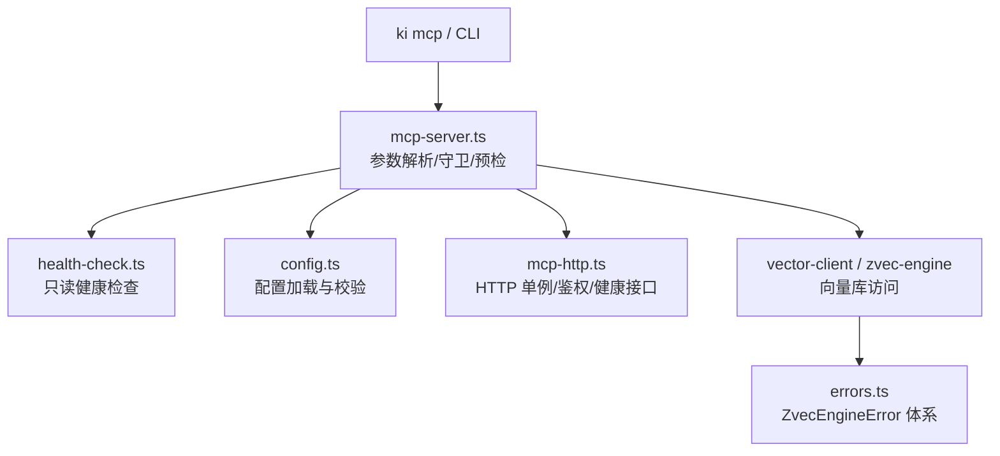
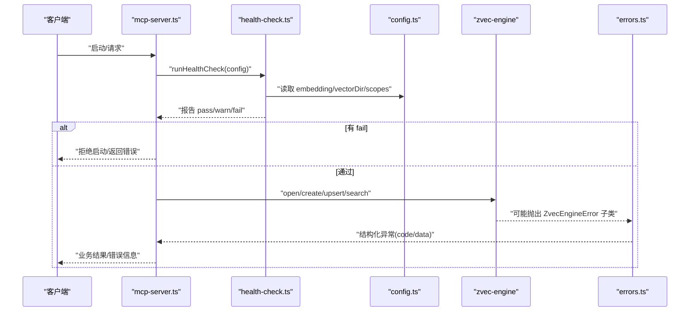
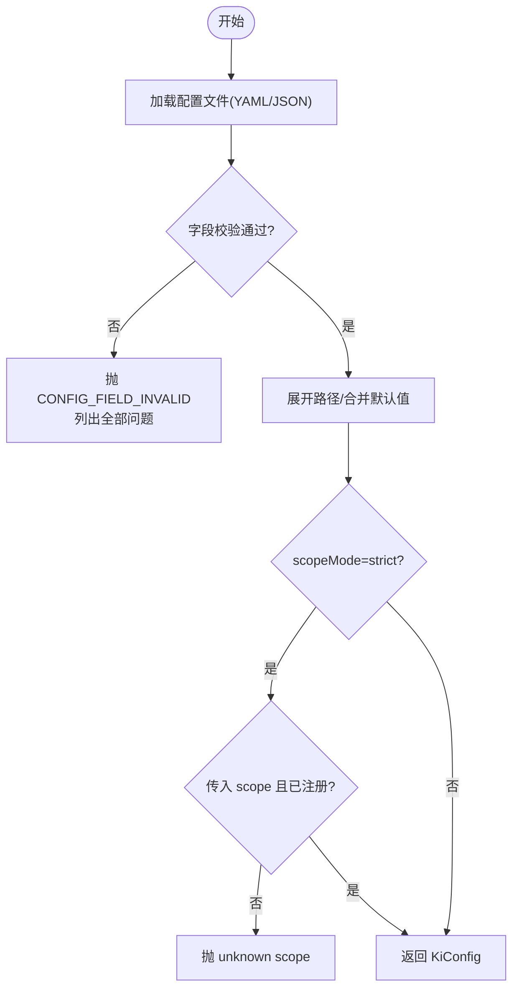
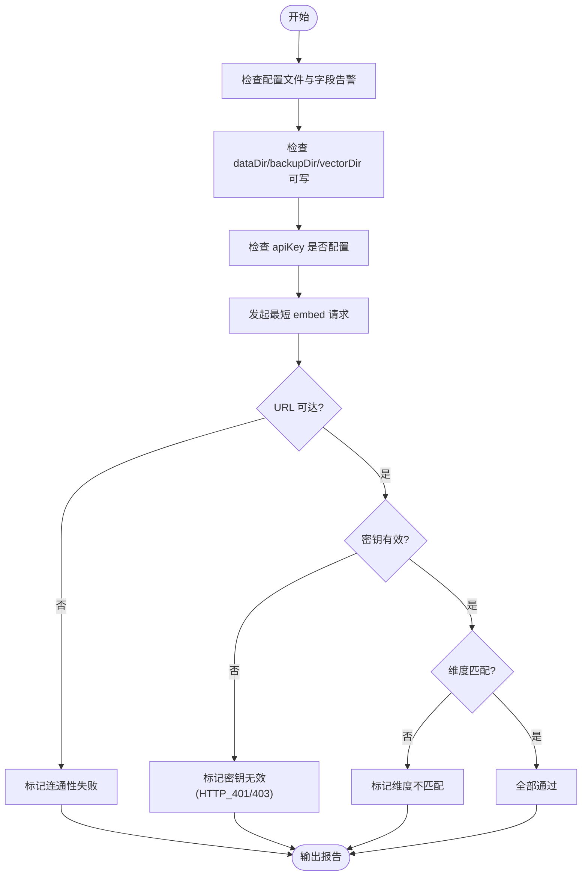
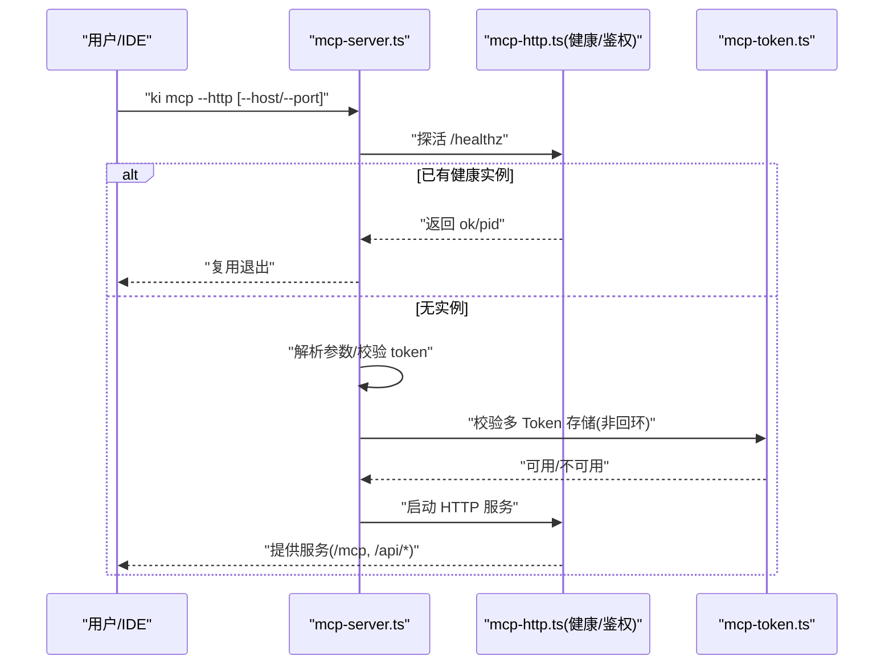
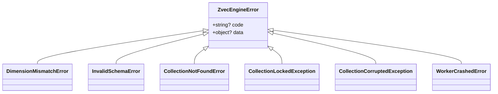
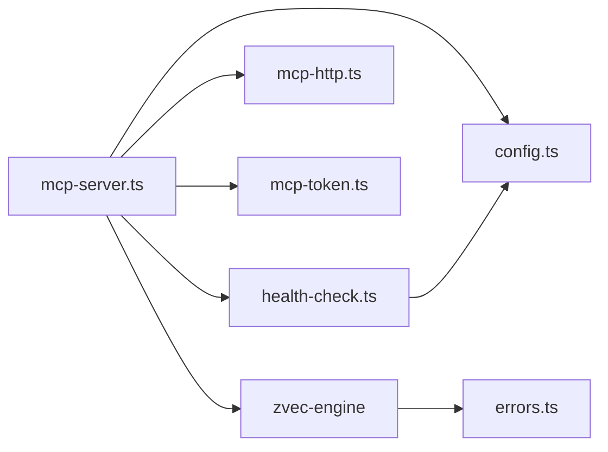

# 故障排除

<cite>
**本文引用的文件**
- [README.md](file://README.md)
- [docs/error-handling.md](file://docs/error-handling.md)
- [src/lib/health-check.ts](file://src/lib/health-check.ts)
- [src/lib/config.ts](file://src/lib/config.ts)
- [src/mcp-server.ts](file://src/mcp-server.ts)
- [src/zvec-engine/errors.ts](file://src/zvec-engine/errors.ts)
- [.e2e-run/verify-auth-log.ts](file://.e2e-run/verify-auth-log.ts)
- [docs/cli.md](file://docs/cli.md)
</cite>

## 目录
1. [简介](#简介)
2. [项目结构](#项目结构)
3. [核心组件](#核心组件)
4. [架构总览](#架构总览)
5. [详细组件分析](#详细组件分析)
6. [依赖关系分析](#依赖关系分析)
7. [性能注意事项](#性能注意事项)
8. [故障排查指南](#故障排查指南)
9. [结论](#结论)
10. [附录](#附录)

## 简介
本指南面向安装、配置、向量引擎、MCP 连接与性能等常见问题，提供系统化的排障流程、日志分析方法、诊断工具使用、错误码对照、异常恢复机制、数据修复方法以及监控告警建议。目标是帮助你在最短时间内定位并解决问题，保障知识索引与检索服务稳定运行。

## 项目结构
kisearch 的故障面主要分布在以下模块：
- 配置加载与校验：负责读取 YAML/JSON 配置、字段级校验、默认值合并、路径展开。
- 健康检查：统一用于 ki doctor 与 MCP 启动预检，覆盖目录、Embedding API、zvec collection、scope 等。
- MCP 服务：负责 stdio/HTTP 模式启动、鉴权、单例复用、锁冲突防护、状态查询与停止。
- 向量引擎异常：定义 zvec 层类型化异常，便于上层统一捕获与恢复。
- CLI 文档：包含多 Token 子命令、端口与鉴权策略说明。

图表来源
- [src/mcp-server.ts:492-734](file://src/mcp-server.ts#L492-L734)
- [src/lib/health-check.ts:150-240](file://src/lib/health-check.ts#L150-L240)
- [src/lib/config.ts:156-385](file://src/lib/config.ts#L156-L385)
- [src/zvec-engine/errors.ts:17-99](file://src/zvec-engine/errors.ts#L17-L99)

章节来源
- [README.md:105-238](file://README.md#L105-L238)
- [docs/cli.md:962-978](file://docs/cli.md#L962-L978)

## 核心组件
- 配置加载与校验：支持 YAML/JSON，字段名/类型/取值严格校验；缺失或非法直接失败（fail-loud），避免静默降级。
- 健康检查：一次性发送最短文本到 Embedding 端点，验证连通性、密钥有效性、维度匹配；同时检查 dataDir/backupDir/vectorDir 可写性与 zvec collection 存在性。
- MCP 服务：支持 stdio 与 HTTP 共享单例；非回环绑定强制鉴权；启动前执行健康检查；提供 --status/restart/stop/token 管理命令。
- 向量引擎异常：统一的 ZvecEngineError 子类，跨线程序列化后可被上层识别并处理。

章节来源
- [src/lib/config.ts:156-385](file://src/lib/config.ts#L156-L385)
- [src/lib/health-check.ts:50-144](file://src/lib/health-check.ts#L50-L144)
- [src/mcp-server.ts:492-734](file://src/mcp-server.ts#L492-L734)
- [src/zvec-engine/errors.ts:17-99](file://src/zvec-engine/errors.ts#L17-L99)

## 架构总览
下图展示一次典型请求从客户端到向量引擎的调用链，以及健康检查在启动前的拦截作用。

图表来源
- [src/mcp-server.ts:660-698](file://src/mcp-server.ts#L660-L698)
- [src/lib/health-check.ts:150-240](file://src/lib/health-check.ts#L150-L240)
- [src/zvec-engine/errors.ts:17-99](file://src/zvec-engine/errors.ts#L17-L99)

## 详细组件分析

### 配置加载与校验
- 查找优先级：显式 --config > $HOME/.ki/config.yaml/yml/json > 内置默认值。
- 字段校验：语法正确不等于内容合法；字段名拼错、类型不符、枚举非法会一次性列出至多 10 处错误并拒绝运行。
- 路径展开：支持 $HOME/~/相对路径展开；dataDir/backupDir/vectorDir 默认落 ~/.ki。
- scopeMode：strict 模式下必须显式传入已注册的 scope，否则报错。

图表来源
- [src/lib/config.ts:156-385](file://src/lib/config.ts#L156-L385)

章节来源
- [src/lib/config.ts:156-385](file://src/lib/config.ts#L156-L385)

### 健康检查（ki doctor / MCP 启动预检）
- 检查项：配置文件、字段告警、dataDir/backupDir/vectorDir 可写性、apiKey、Embedding 连通性/密钥/维度、zvec collection、scopes.default。
- Embedding 三合一：发一条最短文本请求，按错误语义拆分为 URL 连通性、密钥有效性、维度匹配三项。
- 超时与重试：8s 超时、重试 1 次，容忍瞬时网络抖动。

图表来源
- [src/lib/health-check.ts:50-144](file://src/lib/health-check.ts#L50-L144)
- [src/lib/health-check.ts:150-240](file://src/lib/health-check.ts#L150-L240)

章节来源
- [src/lib/health-check.ts:50-144](file://src/lib/health-check.ts#L50-L144)
- [src/lib/health-check.ts:150-240](file://src/lib/health-check.ts#L150-L240)

### MCP 服务与鉴权
- 模式选择：stdio（默认）与 HTTP（共享单例）。
- 启动守卫：检测已有健康实例则复用；检测 stdio 与 HTTP 并存时拒绝以避免锁冲突。
- 鉴权策略：回环地址免鉴权；非回环地址强制 Token（--token/KI_MCP_TOKEN/多 Token 存储）。
- 管理命令：token generate/list/update/delete、restart、stop、--status。

图表来源
- [src/mcp-server.ts:595-698](file://src/mcp-server.ts#L595-L698)
- [docs/cli.md:962-978](file://docs/cli.md#L962-L978)

章节来源
- [src/mcp-server.ts:595-698](file://src/mcp-server.ts#L595-L698)
- [docs/cli.md:962-978](file://docs/cli.md#L962-L978)

### 向量引擎异常体系
- 基类：ZvecEngineError，携带 code 与 data，支持跨线程反序列化。
- 常见子类：DimensionMismatchError、InvalidSchemaError、CollectionNotFoundError、CollectionLockedException、CollectionCorruptedException、WorkerCrashedError 等。
- 上层建议：根据 code 分类处理（如维度不匹配需重建集合；锁冲突提示进程占用；损坏集合走备份恢复）。

图表来源
- [src/zvec-engine/errors.ts:17-99](file://src/zvec-engine/errors.ts#L17-L99)

章节来源
- [src/zvec-engine/errors.ts:17-99](file://src/zvec-engine/errors.ts#L17-L99)

## 依赖关系分析
- mcp-server.ts 依赖 health-check.ts、config.ts、mcp-http.ts、mcp-token.ts、vector-client 与 zvec-engine。
- health-check.ts 依赖 config.ts 与 SiliconFlowProvider（通过 dist/zvec-engine/index.js）。
- config.ts 依赖 config-schema.ts 进行字段级校验。
- errors.ts 为 zvec-engine 的异常契约，供上层统一捕获。

图表来源
- [src/mcp-server.ts:1-35](file://src/mcp-server.ts#L1-L35)
- [src/lib/health-check.ts:17-21](file://src/lib/health-check.ts#L17-L21)
- [src/lib/config.ts:23-29](file://src/lib/config.ts#L23-L29)
- [src/zvec-engine/errors.ts:17-99](file://src/zvec-engine/errors.ts#L17-L99)

章节来源
- [src/mcp-server.ts:1-35](file://src/mcp-server.ts#L1-L35)
- [src/lib/health-check.ts:17-21](file://src/lib/health-check.ts#L17-L21)
- [src/lib/config.ts:23-29](file://src/lib/config.ts#L23-L29)
- [src/zvec-engine/errors.ts:17-99](file://src/zvec-engine/errors.ts#L17-L99)

## 性能注意事项
- 健康检查对 Embedding 的请求设置 8s 超时与 1 次重试，避免常驻 MCP 因瞬时抖动被误判。
- HTTP 单例模式减少锁争用与重复启动开销；多 IDE 应统一使用 URL 型接入。
- 批量写入优先使用 bulk 接口，减少网络往返与重复嵌入成本。
- 向量集合操作注意锁冲突：CLI 导入/还原与 MCP 并发时需协调，必要时先停止 MCP 再执行独占操作。

[本节为通用指导，无需具体文件引用]

## 故障排查指南

### 安装与环境问题
- 症状：启动时报找不到 zvec 引擎模块。
- 原因：源码安装未构建 zvec 引擎层。
- 处理：执行构建命令后再启动。

章节来源
- [README.md:105-119](file://README.md#L105-L119)

### 配置错误
- 症状：任何命令报 CONFIG_FIELD_INVALID。
- 原因：字段名/类型/取值非法；YAML 键后空值或使用了不支持的合并键。
- 处理：按错误清单逐项修正；参考字段校验说明。

章节来源
- [docs/error-handling.md:39-52](file://docs/error-handling.md#L39-L52)
- [src/lib/config.ts:266-278](file://src/lib/config.ts#L266-L278)

### 数据文件缺失或损坏
- 症状：relations-cache.json 不存在、group-index.json 损坏、本地 KB 文件缺失。
- 影响：同步/查询/原文读取失败。
- 处理：重新初始化 scope、从备份恢复、或重新写入 module-info。

章节来源
- [docs/error-handling.md:55-74](file://docs/error-handling.md#L55-L74)

### 向量引擎异常
- 维度不匹配：embedding 返回维度与配置不一致。
  - 处理：核对 embedding.dimension 与 collection.dimension，必要时重建集合。
- 集合锁冲突：提示进程占用。
  - 处理：确认是否有 MCP 实例或其他进程持有锁；必要时停止相关进程。
- 集合损坏：无法打开集合。
  - 处理：从备份恢复或使用模板重建。

章节来源
- [src/zvec-engine/errors.ts:34-54](file://src/zvec-engine/errors.ts#L34-L54)
- [docs/error-handling.md:63-68](file://docs/error-handling.md#L63-L68)

### MCP 连接与鉴权问题
- 症状：HTTP 模式非回环地址启动失败或请求 401/403。
- 原因：未配置 Token；Token 错误或越权；回环地址下 Token 不生效。
- 处理：生成并配置 Token；确保客户端 URL 与服务端一致；回环地址可省略鉴权。

章节来源
- [src/mcp-server.ts:174-211](file://src/mcp-server.ts#L174-L211)
- [docs/cli.md:962-978](file://docs/cli.md#L962-L978)

### 启动预检失败
- 症状：ki mcp 启动被拒绝。
- 原因：健康检查存在 fail 项（缺 apiKey、维度不匹配、目录不可写等）。
- 处理：查看 stderr 的诊断报告，逐项修复后重试。

章节来源
- [src/mcp-server.ts:660-678](file://src/mcp-server.ts#L660-L678)
- [src/lib/health-check.ts:150-240](file://src/lib/health-check.ts#L150-L240)

### 增量导入与缓存问题
- 症状：增量删除失败、relations-cache 中未找到 sourcePath。
- 处理：记录 warning 继续执行；必要时重新导入以补齐缓存。

章节来源
- [docs/error-handling.md:115-130](file://docs/error-handling.md#L115-L130)

### 日志分析与诊断工具
- 健康报告：ki doctor 与 MCP 启动预检均输出结构化报告，便于快速定位。
- 鉴权失败观测：可通过测试脚本验证鉴权失败计数与日志。
- 建议：将 stderr 输出纳入集中日志采集，结合 /healthz 指标观察。

章节来源
- [src/lib/health-check.ts:247-260](file://src/lib/health-check.ts#L247-L260)
- [.e2e-run/verify-auth-log.ts:1-46](file://.e2e-run/verify-auth-log.ts#L1-L46)

### 错误码对照表（节选）
- CONFIG_FIELD_INVALID：配置文件字段校验失败。
- MCP_HTTP_TOKEN_REQUIRED：非回环地址缺少鉴权 Token。
- MCP_TOKEN_SCOPE_REQUIRED：token 子命令未指定 --scope。
- MCP_TOKEN_NOT_FOUND：更新/删除 Token 时 ID 不存在。
- MCP_TOKEN_CORRUPT：多 Token 存储文件损坏。
- UNKNOWN_OPTION：未知参数。
- 向量引擎错误：DimensionMismatchError、CollectionLockedException、CollectionCorruptedException、WorkerCrashedError 等。

章节来源
- [src/mcp-server.ts:120-135](file://src/mcp-server.ts#L120-L135)
- [src/mcp-server.ts:214-225](file://src/mcp-server.ts#L214-L225)
- [src/mcp-server.ts:286-350](file://src/mcp-server.ts#L286-L350)
- [src/zvec-engine/errors.ts:34-54](file://src/zvec-engine/errors.ts#L34-L54)

### 异常恢复机制
- 配置错误：fail-loud，列出全部问题，修正后重跑。
- 数据损坏：从备份恢复或从模板重建；WAL 原子写入降低损坏风险。
- 向量锁冲突：停止冲突进程或迁移至 HTTP 单例；空闲自动释放锁。
- 鉴权失败：检查 Token 来源与授权 scope；回环地址免鉴权。

章节来源
- [docs/error-handling.md:144-160](file://docs/error-handling.md#L144-L160)
- [src/mcp-server.ts:600-658](file://src/mcp-server.ts#L600-L658)

### 数据损坏修复方法
- group-index.json 损坏：从备份恢复或重新初始化。
- relations-cache.json 缺失：执行触发 ensureScopeDir 的命令初始化 scope。
- 本地 KB 文件缺失：重新写入 module-info。

章节来源
- [docs/error-handling.md:55-74](file://docs/error-handling.md#L55-L74)

### 监控系统配置与告警建议
- 启用 /healthz 探活与 authFailures 计数，结合日志采集形成基础监控。
- 对 MCP 启动失败、Token 校验失败、向量锁冲突等关键事件设置告警阈值。
- 定期运行 ki doctor 并将结果纳入巡检任务。

章节来源
- [src/mcp-server.ts:660-678](file://src/mcp-server.ts#L660-L678)
- [.e2e-run/verify-auth-log.ts:1-46](file://.e2e-run/verify-auth-log.ts#L1-L46)

### 社区支持与反馈渠道
- 文档导航：README 中提供了 CLI、配置、架构、工作流等文档入口。
- 建议：遇到问题先查阅 docs 与 README，再提交 Issue 时附上 ki doctor 输出、stderr 日志与复现步骤。

章节来源
- [README.md:323-349](file://README.md#L323-L349)

## 结论
通过“配置强校验 + 启动预检 + 结构化异常 + 健康检查”的组合，kisearch 能在多数场景下快速暴露问题并给出明确修复指引。遇到复杂问题时，建议按“参数→路径→scope→数据文件→工作流顺序”的排障顺序逐步定位，并结合健康报告与日志进行闭环处理。

## 附录
- 常用命令速查：
  - ki config init：生成配置文件。
  - ki doctor：运行健康检查。
  - ki mcp --http --web：启动 HTTP 单例并附带前端。
  - ki mcp --status：查看运行状态。
  - ki mcp stop/restart：停止/重启服务。
  - ki mcp token generate/list/update/delete：Token 管理。

章节来源
- [README.md:105-238](file://README.md#L105-L238)
- [docs/cli.md:962-978](file://docs/cli.md#L962-L978)