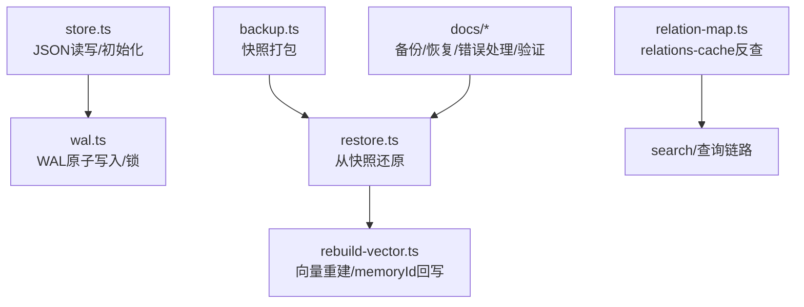
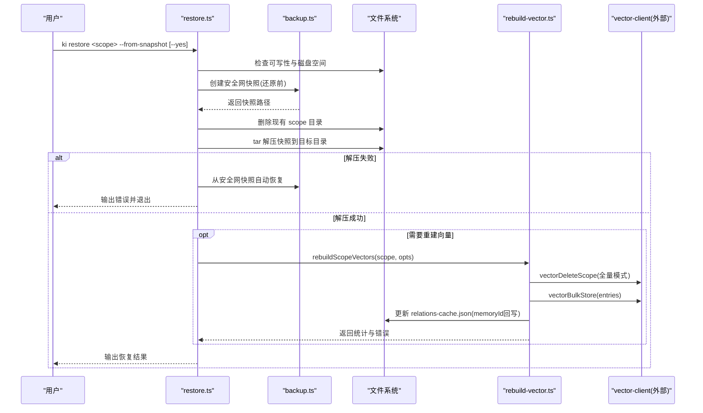
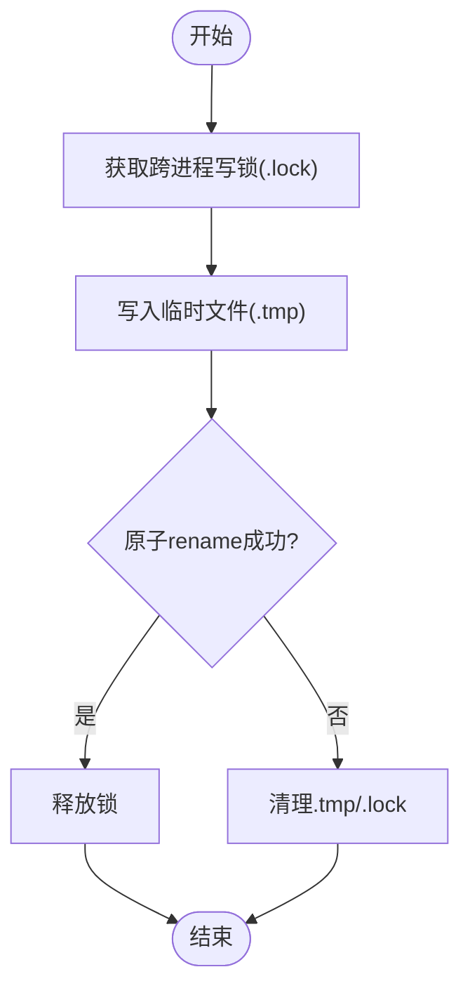
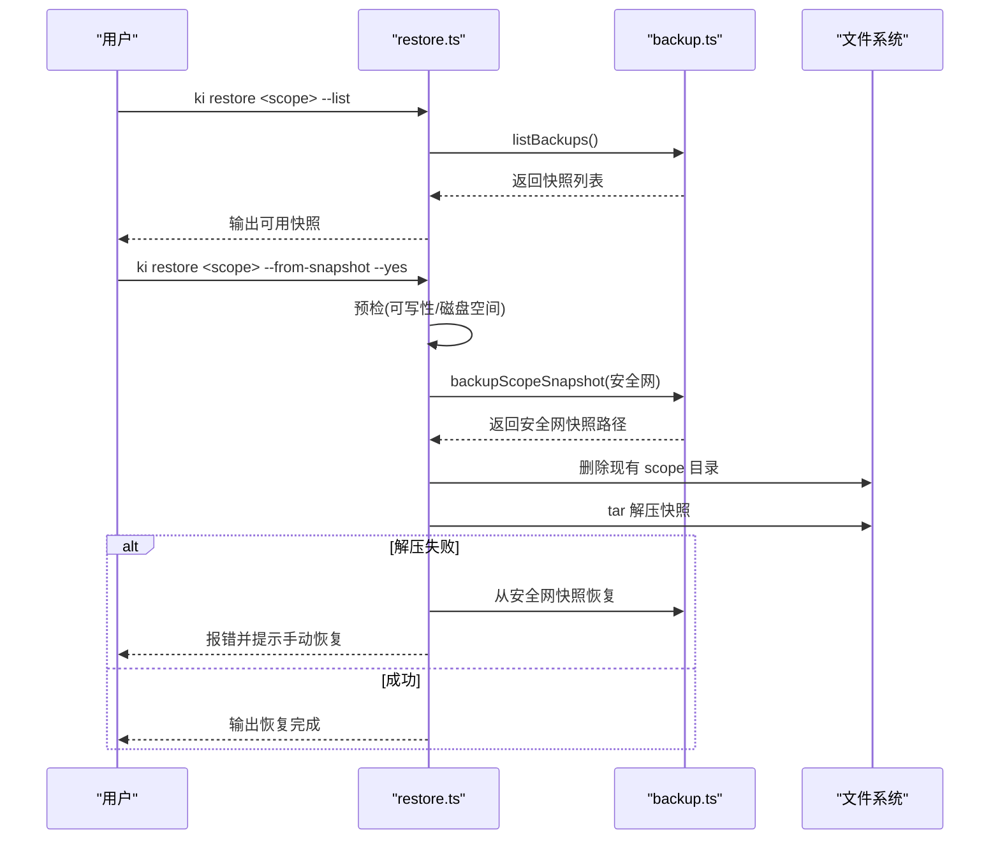
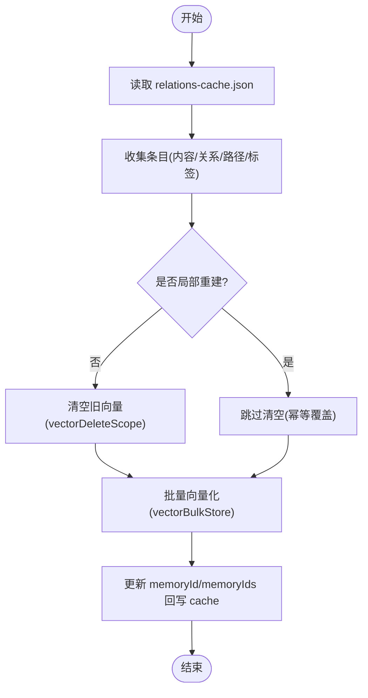
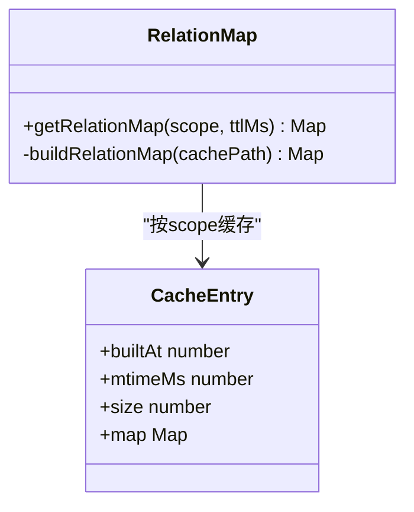
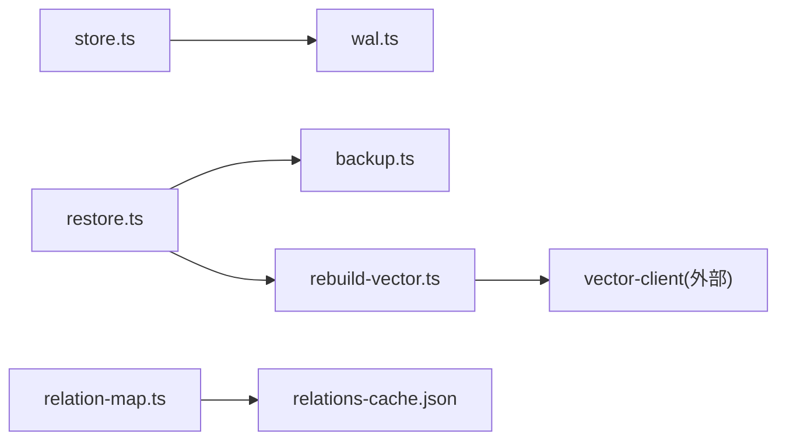

# 数据损坏恢复

<cite>
**本文引用的文件**
- [src/lib/wal.ts](file://src/lib/wal.ts)
- [src/lib/store.ts](file://src/lib/store.ts)
- [src/lib/backup.ts](file://src/lib/backup.ts)
- [src/restore.ts](file://src/restore.ts)
- [src/lib/rebuild-vector.ts](file://src/lib/rebuild-vector.ts)
- [src/lib/relation-map.ts](file://src/lib/relation-map.ts)
- [docs/backup-restore.md](file://docs/backup-restore.md)
- [docs/error-handling.md](file://docs/error-handling.md)
- [docs/verify-index.md](file://docs/verify-index.md)
</cite>

## 目录
1. [简介](#简介)
2. [项目结构](#项目结构)
3. [核心组件](#核心组件)
4. [架构总览](#架构总览)
5. [详细组件分析](#详细组件分析)
6. [依赖关系分析](#依赖关系分析)
7. [性能与一致性考量](#性能与一致性考量)
8. [故障排查指南](#故障排查指南)
9. [结论](#结论)
10. [附录：常用命令速查](#附录常用命令速查)

## 简介
本指南面向“数据损坏恢复”，覆盖以下目标：
- 识别常见数据文件损坏（group-index.json、relations-cache.json、向量索引）的方法与影响范围
- 提供从备份恢复的具体步骤，包括快照选择、安全网保护、还原后重建向量
- 说明 WAL（预写日志）机制在原子写入、并发保护与中断恢复中的作用
- 给出数据一致性验证工具与流程，确保恢复后的 KB 可用

## 项目结构
与数据恢复相关的关键路径与职责：
- 存储层与 JSON 读写：src/lib/store.ts（readJson/writeJson、scope 初始化、旧格式迁移）
- WAL 原子写入与锁：src/lib/wal.ts（tmp+rename、跨进程锁、残留清理）
- 备份与恢复：src/lib/backup.ts（快照打包）、src/restore.ts（从快照还原、参数校验、安全网）
- 向量重建：src/lib/rebuild-vector.ts（内容/关系/路径/标签向量重建，memoryId 回写）
- 关系映射缓存：src/lib/relation-map.ts（relations-cache 反查映射，TTL 失效）
- 文档与示例：docs/backup-restore.md、docs/error-handling.md、docs/verify-index.md

图表来源
- [src/lib/store.ts:23-62](file://src/lib/store.ts#L23-L62)
- [src/lib/wal.ts:92-112](file://src/lib/wal.ts#L92-L112)
- [src/lib/backup.ts:87-117](file://src/lib/backup.ts#L87-L117)
- [src/restore.ts:124-284](file://src/restore.ts#L124-L284)
- [src/lib/rebuild-vector.ts:320-469](file://src/lib/rebuild-vector.ts#L320-L469)
- [src/lib/relation-map.ts:48-78](file://src/lib/relation-map.ts#L48-L78)

章节来源
- [src/lib/store.ts:23-62](file://src/lib/store.ts#L23-L62)
- [src/lib/wal.ts:92-112](file://src/lib/wal.ts#L92-L112)
- [src/lib/backup.ts:87-117](file://src/lib/backup.ts#L87-L117)
- [src/restore.ts:124-284](file://src/restore.ts#L124-L284)
- [src/lib/rebuild-vector.ts:320-469](file://src/lib/rebuild-vector.ts#L320-L469)
- [src/lib/relation-map.ts:48-78](file://src/lib/relation-map.ts#L48-L78)

## 核心组件
- WAL 原子写入：通过 .tmp + rename 实现原子替换，避免写入中断导致文件损坏；配合跨进程锁防止并发覆盖。
- 备份模块：将 scope 目录打包为 tar.gz 快照，支持自动备份与手动备份，列出可用快照。
- 恢复模块：从快照还原 scope 目录，执行前创建安全网快照，失败时自动回滚；支持还原后重建向量。
- 向量重建：从已还原 KB 重建三类向量（内容/关系/路径），并可选打标；将 docId 回写 relations-cache 的 memoryId/memoryIds。
- 关系映射：基于 relations-cache.json 构建 memoryId→{group,relation} 的反查映射，带 TTL 与 mtime/size 失效策略。

章节来源
- [src/lib/wal.ts:92-112](file://src/lib/wal.ts#L92-L112)
- [src/lib/backup.ts:87-117](file://src/lib/backup.ts#L87-L117)
- [src/restore.ts:124-284](file://src/restore.ts#L124-L284)
- [src/lib/rebuild-vector.ts:320-469](file://src/lib/rebuild-vector.ts#L320-L469)
- [src/lib/relation-map.ts:48-78](file://src/lib/relation-map.ts#L48-L78)

## 架构总览
下图展示“备份—恢复—重建”的主流程及关键交互点。

图表来源
- [src/restore.ts:124-284](file://src/restore.ts#L124-L284)
- [src/lib/backup.ts:87-117](file://src/lib/backup.ts#L87-L117)
- [src/lib/rebuild-vector.ts:320-469](file://src/lib/rebuild-vector.ts#L320-L469)

## 详细组件分析

### WAL（预写日志）与原子写入
- 写入流程：获取跨进程写锁 → 写 .tmp → 原子 rename → 释放锁。即使写入中断，原文件也不会损坏。
- 并发保护：同一目标文件同一时刻仅允许一个进程写入，避免多进程并发写 JSON 造成静默覆盖。
- 残留清理：提供 cleanupTmpFiles 清理 .tmp 与陈旧 .lock，避免中断残留。

图表来源
- [src/lib/wal.ts:37-76](file://src/lib/wal.ts#L37-L76)
- [src/lib/wal.ts:92-112](file://src/lib/wal.ts#L92-L112)
- [src/lib/wal.ts:121-142](file://src/lib/wal.ts#L121-L142)

章节来源
- [src/lib/wal.ts:37-76](file://src/lib/wal.ts#L37-L76)
- [src/lib/wal.ts:92-112](file://src/lib/wal.ts#L92-L112)
- [src/lib/wal.ts:121-142](file://src/lib/wal.ts#L121-L142)

### 备份与恢复
- 备份：将 scope 目录打包为 tar.gz 快照，落盘至 {backupDir}/{scope}/snapshots/snapshot.{timestamp}.tar.gz。
- 恢复：
  - 列出可用快照
  - 选择快照（最新或指定 timestamp）
  - 还原前创建安全网快照（若目标存在）
  - 删除现有目录并解压快照
  - 解压失败时尝试从安全网快照自动恢复
  - 可选：还原后重建向量（--rebuild-vector）

图表来源
- [src/restore.ts:124-284](file://src/restore.ts#L124-L284)
- [src/lib/backup.ts:87-117](file://src/lib/backup.ts#L87-L117)

章节来源
- [src/lib/backup.ts:87-117](file://src/lib/backup.ts#L87-L117)
- [src/restore.ts:124-284](file://src/restore.ts#L124-L284)

### 向量重建与 memoryId 回写
- 重建类型：内容向量（ki-search）、关系向量（ki-relation）、路径向量（ki-path）、自定义标签向量（从 rel.tags 恢复）。
- 局部重建：支持 --group 过滤子树与 --tags 打标（只增不减），不清空其他向量。
- memoryId 回写：将内容向量与自定义标签向量的 docId 聚合回填到 relations-cache 的 rel.memoryId/memoryIds，防止悬空引用。

图表来源
- [src/lib/rebuild-vector.ts:320-469](file://src/lib/rebuild-vector.ts#L320-L469)

章节来源
- [src/lib/rebuild-vector.ts:320-469](file://src/lib/rebuild-vector.ts#L320-L469)

### 关系映射与缓存失效
- 作用：根据 memoryId 反查所属 Group 与 relation，用于搜索结果附加上下文。
- 失效策略：mtime/size 变化立即失效；TTL 过期兜底；文件缺失则返回空 Map 降级。

图表来源
- [src/lib/relation-map.ts:48-78](file://src/lib/relation-map.ts#L48-L78)
- [src/lib/relation-map.ts:80-114](file://src/lib/relation-map.ts#L80-L114)

章节来源
- [src/lib/relation-map.ts:48-78](file://src/lib/relation-map.ts#L48-L78)
- [src/lib/relation-map.ts:80-114](file://src/lib/relation-map.ts#L80-L114)

### 数据一致性与验证
- 结构验证：使用 query-group 查看完整 Group 树与 Relations。
- 本地 KB 验证：get-module-info 检查原文完整性。
- 语义检索验证：通过 MCP memory_recall 验证向量召回。
- 增量更新验证：新增/修改/删除条目的预期行为。

章节来源
- [docs/verify-index.md:1-214](file://docs/verify-index.md#L1-L214)

## 依赖关系分析
- store.ts 依赖 wal.ts 进行原子写入，并通过 ensureScopeDir/initScope 保证 scope 初始状态。
- restore.ts 依赖 backup.ts 创建安全网快照，并在成功后调用 rebuild-vector.ts 重建向量。
- rebuild-vector.ts 依赖 vector-client 进行向量操作，并将 memoryId 回写到 relations-cache.json。
- relation-map.ts 依赖 relations-cache.json 构建反查映射，供搜索链路使用。

图表来源
- [src/lib/store.ts:23-62](file://src/lib/store.ts#L23-L62)
- [src/lib/wal.ts:92-112](file://src/lib/wal.ts#L92-L112)
- [src/restore.ts:124-284](file://src/restore.ts#L124-L284)
- [src/lib/backup.ts:87-117](file://src/lib/backup.ts#L87-L117)
- [src/lib/rebuild-vector.ts:320-469](file://src/lib/rebuild-vector.ts#L320-L469)
- [src/lib/relation-map.ts:48-78](file://src/lib/relation-map.ts#L48-L78)

章节来源
- [src/lib/store.ts:23-62](file://src/lib/store.ts#L23-L62)
- [src/lib/wal.ts:92-112](file://src/lib/wal.ts#L92-L112)
- [src/restore.ts:124-284](file://src/restore.ts#L124-L284)
- [src/lib/backup.ts:87-117](file://src/lib/backup.ts#L87-L117)
- [src/lib/rebuild-vector.ts:320-469](file://src/lib/rebuild-vector.ts#L320-L469)
- [src/lib/relation-map.ts:48-78](file://src/lib/relation-map.ts#L48-L78)

## 性能与一致性考量
- WAL 原子写入避免部分写入导致的文件损坏，提升数据一致性。
- 跨进程锁避免并发写冲突，但同步阻塞可能短暂冻结事件循环；正常争用窗口毫秒级。
- 向量重建支持局部重建与打标，减少不必要的全量清空与重建开销。
- 关系映射缓存通过 mtime/size/TTL 降低重复解析成本，提高查询性能。

章节来源
- [src/lib/wal.ts:92-112](file://src/lib/wal.ts#L92-L112)
- [src/lib/rebuild-vector.ts:320-469](file://src/lib/rebuild-vector.ts#L320-L469)
- [src/lib/relation-map.ts:48-78](file://src/lib/relation-map.ts#L48-L78)

## 故障排查指南

### 场景一：group-index.json 损坏
- 症状：读取 Group 树失败，报 JSON 解析错误。
- 影响范围：Group 树查询、管理命令、导入/同步流程。
- 恢复步骤：
  - 从快照恢复整个 scope：ki restore <scope> --from-snapshot --yes
  - 若无备份，可从模板重新初始化该 scope 并重新导入数据
- 验证：使用 ki query-group --mode full 检查 Group 树结构

章节来源
- [docs/backup-restore.md:200-208](file://docs/backup-restore.md#L200-L208)
- [docs/error-handling.md:63-67](file://docs/error-handling.md#L63-L67)
- [docs/verify-index.md:14-37](file://docs/verify-index.md#L14-L37)

### 场景二：relations-cache.json 缺失或损坏
- 症状：Relation 查询失败，报 JSON 解析错误或找不到 sourcePath。
- 影响范围：关系查询、向量重建、搜索结果上下文附加。
- 恢复步骤：
  - 从快照恢复整个 scope：ki restore <scope> --from-snapshot --yes
  - 若仅需修复缓存，可执行重建向量：ki restore <scope> --rebuild-vector
- 验证：ki query-group --groups <group> 检查 Relations 列表与评分

章节来源
- [docs/backup-restore.md:210-218](file://docs/backup-restore.md#L210-L218)
- [docs/error-handling.md:57-61](file://docs/error-handling.md#L57-L61)
- [docs/verify-index.md:39-60](file://docs/verify-index.md#L39-L60)

### 场景三：向量索引损坏或不可用
- 症状：语义检索无结果或报错；向量库连接失败。
- 影响范围：MCP memory_recall、搜索结果相关性。
- 恢复步骤：
  - 先确保 KB 层完整（group-index.json、relations-cache.json）
  - 执行重建向量：ki restore <scope> --rebuild-vector
  - 如需局部修复，可使用 --group 过滤子树重建
- 验证：通过 MCP memory_recall 测试关键词召回

章节来源
- [src/lib/rebuild-vector.ts:320-469](file://src/lib/rebuild-vector.ts#L320-L469)
- [docs/verify-index.md:84-101](file://docs/verify-index.md#L84-L101)

### 场景四：本地 KB 原文丢失
- 症状：get-module-info 返回空内容或报错。
- 影响范围：模块信息展示、向量重建的数据源。
- 恢复步骤：
  - 从快照恢复整个 scope
  - 或重新导入 Wiki：ki scan-kb import --scope <scope> --source /path/to/wiki --group <group>
- 验证：ki get-module-info --scope <scope> --group <group> --relation <relation>

章节来源
- [docs/backup-restore.md:233-244](file://docs/backup-restore.md#L233-L244)
- [docs/error-handling.md:69-73](file://docs/error-handling.md#L69-L73)

### 场景五：WAL 残留与锁问题
- 症状：出现 .tmp 残留或 .lock 陈旧锁导致写入阻塞。
- 影响范围：JSON 文件写入、并发写入。
- 恢复步骤：
  - 运行清理：cleanupTmpFiles(<kb_dir>)
  - 检查并删除陈旧锁（age > 30s）
- 预防：避免强制终止写入进程；确保 tar/备份命令环境可用

章节来源
- [src/lib/wal.ts:121-142](file://src/lib/wal.ts#L121-L142)

## 结论
- 使用 WAL 原子写入与跨进程锁保障数据一致性，避免并发与中断导致的损坏。
- 通过快照备份与安全网机制，提供可靠的恢复能力；恢复后可按需重建向量以恢复语义检索。
- 结合验证工具与流程，确保恢复后的 KB 结构与内容一致可用。
- 建议在生产环境中定期备份、演练恢复流程，并监控 WAL 残留与锁状态。

## 附录：常用命令速查
- 备份：ki backup <scope>
- 列出备份：ki restore <scope>
- 从快照恢复：ki restore <scope> --from-snapshot --yes
- 还原后重建向量：ki restore <scope> --rebuild-vector
- 局部重建（子树）：ki restore <scope> --rebuild-vector --group <group_path>
- 打标重建：ki restore <scope> --rebuild-vector --tags <tag1,tag2>
- 验证 Group 树：ki query-group --scope <scope> --mode full
- 验证 Relations：ki query-group --scope <scope> --groups <group>
- 验证本地 KB：ki get-module-info --scope <scope> --group <group> --relation <relation>

章节来源
- [docs/backup-restore.md:5-35](file://docs/backup-restore.md#L5-L35)
- [docs/verify-index.md:14-101](file://docs/verify-index.md#L14-L101)