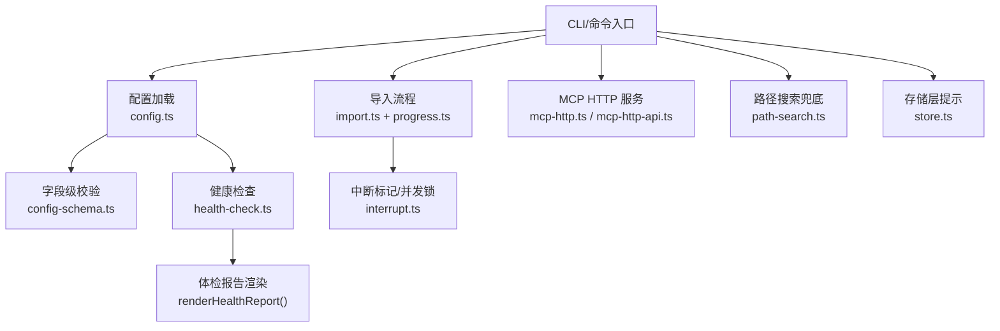
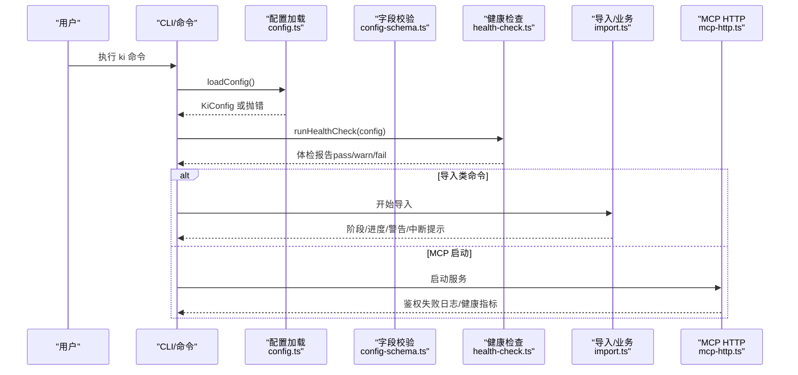
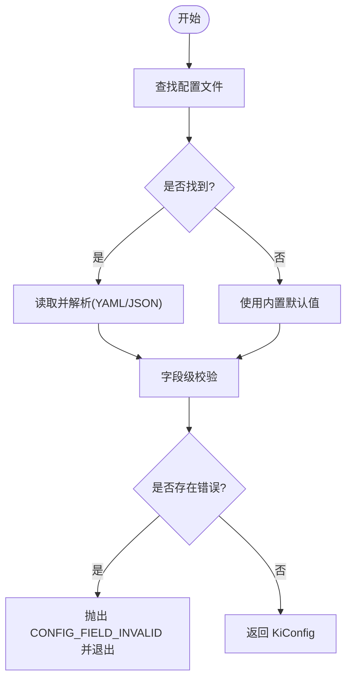
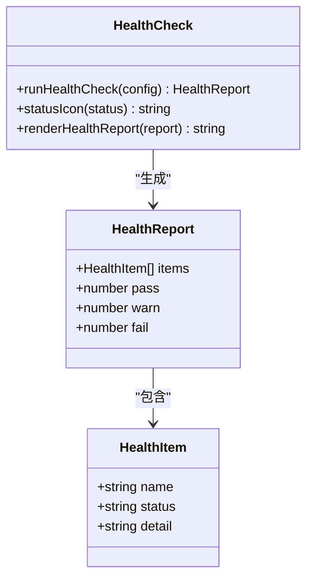
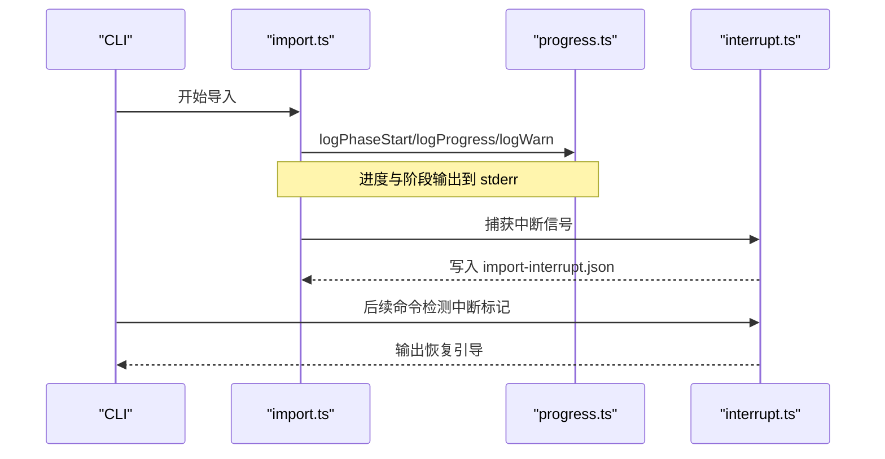
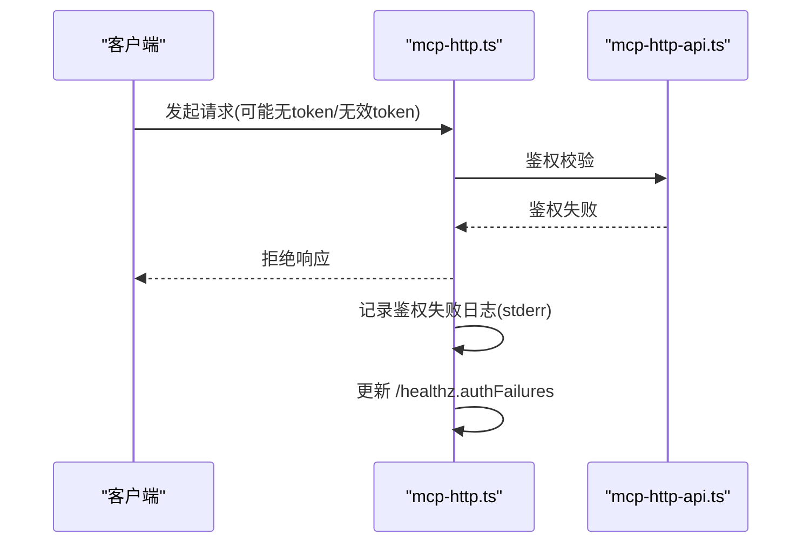
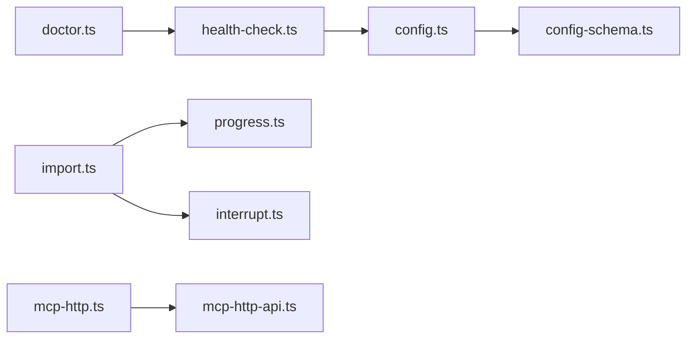

# 日志分析与调试

<cite>
**本文引用的文件**
- [src/lib/config.ts](file://src/lib/config.ts)
- [src/lib/config-schema.ts](file://src/lib/config-schema.ts)
- [src/lib/health-check.ts](file://src/lib/health-check.ts)
- [src/lib/progress.ts](file://src/lib/progress.ts)
- [src/lib/interrupt.ts](file://src/lib/interrupt.ts)
- [src/lib/import.ts](file://src/lib/import.ts)
- [src/lib/mcp-http.ts](file://src/lib/mcp-http.ts)
- [src/lib/mcp-http-api.ts](file://src/lib/mcp-http-api.ts)
- [src/lib/path-search.ts](file://src/lib/path-search.ts)
- [src/lib/store.ts](file://src/lib/store.ts)
- [src/lib/cli-args.ts](file://src/lib/cli-args.ts)
- [src/get-module-info.ts](file://src/get-module-info.ts)
- [src/doctor.ts](file://src/doctor.ts)
- [docs/configuration.md](file://docs/configuration.md)
- [docs/error-handling.md](file://docs/error-handling.md)
- [docs/cli.md](file://docs/cli.md)
</cite>

## 目录
1. [简介](#简介)
2. [项目结构](#项目结构)
3. [核心组件](#核心组件)
4. [架构总览](#架构总览)
5. [详细组件分析](#详细组件分析)
6. [依赖关系分析](#依赖关系分析)
7. [性能注意事项](#性能注意事项)
8. [故障排查指南](#故障排查指南)
9. [结论](#结论)
10. [附录](#附录)

## 简介
本指南面向使用者与运维人员，系统化说明如何启用并解读知识索引系统的日志、如何进行问题定位与恢复、以及如何收集有效的故障报告。内容覆盖：
- 日志输出位置与级别（标准错误 stderr、健康检查报告）
- 配置加载与字段校验的失败模式
- 导入中断与并发锁的日志特征
- MCP HTTP 服务的鉴权与健康信息
- 向量与存储层的关键提示
- 常见错误的复现与修复步骤
- 调试与诊断工具的使用建议

## 项目结构
本项目将“可观测性”能力分散在多个模块中：
- 配置加载与字段校验：config.ts、config-schema.ts
- 健康检查与体检报告：health-check.ts、doctor.ts
- 进度与阶段日志：progress.ts
- 导入中断与并发锁：interrupt.ts、import.ts
- MCP HTTP 服务日志与鉴权：mcp-http.ts、mcp-http-api.ts
- 路径搜索兜底与存储层提示：path-search.ts、store.ts
- CLI 参数与帮助输出：cli-args.ts
- 错误处理文档与排障指引：error-handling.md、configuration.md、cli.md

图表来源
- [src/lib/config.ts:156-183](file://src/lib/config.ts#L156-L183)
- [src/lib/config-schema.ts:328-339](file://src/lib/config-schema.ts#L328-L339)
- [src/lib/health-check.ts:150-240](file://src/lib/health-check.ts#L150-L240)
- [src/lib/import.ts:257-257](file://src/lib/import.ts#L257-L257)
- [src/lib/progress.ts:28-60](file://src/lib/progress.ts#L28-L60)
- [src/lib/interrupt.ts:28-78](file://src/lib/interrupt.ts#L28-L78)
- [src/lib/mcp-http.ts:387-763](file://src/lib/mcp-http.ts#L387-L763)
- [src/lib/mcp-http-api.ts:139-139](file://src/lib/mcp-http-api.ts#L139-L139)
- [src/lib/path-search.ts:84-84](file://src/lib/path-search.ts#L84-L84)
- [src/lib/store.ts:216-216](file://src/lib/store.ts#L216-L216)

章节来源
- [docs/configuration.md:7-18](file://docs/configuration.md#L7-L18)
- [docs/cli.md:10-18](file://docs/cli.md#L10-L18)

## 核心组件
- 配置加载与校验：负责查找配置文件、解析 YAML/JSON、执行字段级校验，并在非法时快速失败（fail-loud）。
- 健康检查：对配置、目录、Embedding 连通性与维度、zvec collection 进行只读检查，生成结构化报告。
- 导入与中断：导入过程输出阶段与进度；被中断时写入中断标记，后续命令给出恢复引导。
- MCP HTTP：提供鉴权失败的可观测信息（stderr 与 /healthz 指标），便于外部监控。
- 存储与路径搜索：在关键路径输出降级或失败提示，辅助定位 IO 或网络问题。

章节来源
- [src/lib/config.ts:156-183](file://src/lib/config.ts#L156-L183)
- [src/lib/config-schema.ts:328-339](file://src/lib/config-schema.ts#L328-L339)
- [src/lib/health-check.ts:150-240](file://src/lib/health-check.ts#L150-L240)
- [src/lib/interrupt.ts:28-78](file://src/lib/interrupt.ts#L28-L78)
- [src/lib/mcp-http.ts:387-763](file://src/lib/mcp-http.ts#L387-L763)
- [src/lib/path-search.ts:84-84](file://src/lib/path-search.ts#L84-L84)
- [src/lib/store.ts:216-216](file://src/lib/store.ts#L216-L216)

## 架构总览
下图展示一次典型命令执行的日志与诊断链路：从 CLI 参数解析、配置加载与校验、健康检查到具体业务（导入/检索/MCP）过程中的关键日志点。

图表来源
- [src/lib/config.ts:156-183](file://src/lib/config.ts#L156-L183)
- [src/lib/config-schema.ts:328-339](file://src/lib/config-schema.ts#L328-L339)
- [src/lib/health-check.ts:150-240](file://src/lib/health-check.ts#L150-L240)
- [src/lib/import.ts:257-257](file://src/lib/import.ts#L257-L257)
- [src/lib/mcp-http.ts:387-763](file://src/lib/mcp-http.ts#L387-L763)

## 详细组件分析

### 配置加载与字段校验
- 配置文件查找优先级：命令行 --config > 环境变量 KI_CONFIG_PATH > ~/.ki/config.yaml/yml/json > 内置默认值。
- 解析后执行字段级校验：未知字段、类型不符、取值非法会一次性列出至多 10 条错误并退出（CONFIG_FIELD_INVALID）。
- 废弃字段与空 scope 条目仅告警，不阻断加载，由健康检查汇总。

图表来源
- [src/lib/config.ts:156-183](file://src/lib/config.ts#L156-L183)
- [src/lib/config.ts:193-213](file://src/lib/config.ts#L193-L213)
- [src/lib/config.ts:252-284](file://src/lib/config.ts#L252-L284)
- [src/lib/config-schema.ts:328-339](file://src/lib/config-schema.ts#L328-L339)

章节来源
- [docs/configuration.md:7-18](file://docs/configuration.md#L7-L18)
- [docs/configuration.md:234-260](file://docs/configuration.md#L234-L260)
- [docs/error-handling.md:39-52](file://docs/error-handling.md#L39-L52)

### 健康检查与体检报告
- 检查项包括：配置文件存在且合法、dataDir/backupDir/vectorDir 可写、apiKey 是否已解析、Embedding 连通性/密钥/维度、zvec collection 是否已创建、scopes.default 是否配置。
- 报告通过 renderHealthReport 渲染为多行文本，供 doctor 命令或 MCP 预检使用。

图表来源
- [src/lib/health-check.ts:22-35](file://src/lib/health-check.ts#L22-L35)
- [src/lib/health-check.ts:150-240](file://src/lib/health-check.ts#L150-L240)
- [src/lib/health-check.ts:242-260](file://src/lib/health-check.ts#L242-L260)

章节来源
- [src/lib/health-check.ts:150-240](file://src/lib/health-check.ts#L150-L240)
- [src/doctor.ts:35-57](file://src/doctor.ts#L35-L57)

### 导入流程与中断标记
- 导入过程中通过 progress.ts 输出阶段、进度、警告与总结，全部走 stderr，避免污染 stdout 的 JSON 结果。
- 若导入被 SIGINT/SIGTERM 中断，会写入 import-interrupt.json，后续打开向量库的命令会检测并给出恢复引导。
- 并发导入通过 .import.lock 保护，自动清理死锁（进程不存在时）。

图表来源
- [src/lib/import.ts:257-257](file://src/lib/import.ts#L257-L257)
- [src/lib/progress.ts:28-60](file://src/lib/progress.ts#L28-L60)
- [src/lib/interrupt.ts:28-78](file://src/lib/interrupt.ts#L28-L78)

章节来源
- [src/lib/progress.ts:1-62](file://src/lib/progress.ts#L1-L62)
- [src/lib/interrupt.ts:1-141](file://src/lib/interrupt.ts#L1-L141)
- [src/lib/import.ts:257-257](file://src/lib/import.ts#L257-L257)

### MCP HTTP 服务日志与鉴权
- 鉴权失败会在 stderr 输出，并通过 /healthz 暴露 authFailures 计数，便于外部监控与告警。
- 服务启动与运行期间会输出监听地址、端口等上下文信息，便于确认实际生效配置。

图表来源
- [src/lib/mcp-http.ts:387-763](file://src/lib/mcp-http.ts#L387-L763)
- [src/lib/mcp-http-api.ts:139-139](file://src/lib/mcp-http-api.ts#L139-L139)

章节来源
- [src/lib/mcp-http.ts:387-763](file://src/lib/mcp-http.ts#L387-L763)
- [src/lib/mcp-http-api.ts:139-139](file://src/lib/mcp-http-api.ts#L139-L139)

### 路径搜索兜底与存储层提示
- 路径搜索失败时会输出兜底失败的提示，便于判断是否为网络或引擎不可用导致。
- 存储层在异常路径输出提示信息，辅助定位 IO 或权限问题。

章节来源
- [src/lib/path-search.ts:84-84](file://src/lib/path-search.ts#L84-L84)
- [src/lib/store.ts:216-216](file://src/lib/store.ts#L216-L216)

### CLI 参数与帮助输出
- CLI 帮助与提示通过 stderr 输出，确保不影响 JSON 结果。
- 首次运行或无配置文件时会提示生成模板或默认行为。

章节来源
- [src/lib/cli-args.ts:94-94](file://src/lib/cli-args.ts#L94-L94)
- [src/lib/config.ts:168-179](file://src/lib/config.ts#L168-L179)

## 依赖关系分析
- config.ts 依赖 config-schema.ts 做字段级校验；health-check.ts 依赖 config.ts 获取配置与 Embedding 信息。
- import.ts 与 progress.ts、interrupt.ts 协作完成导入过程的可视化与中断恢复。
- mcp-http.ts 与 mcp-http-api.ts 共同实现鉴权与可观测性。
- doctor.ts 调用 health-check.ts 渲染体检报告。

图表来源
- [src/lib/config.ts:156-183](file://src/lib/config.ts#L156-L183)
- [src/lib/config-schema.ts:328-339](file://src/lib/config-schema.ts#L328-L339)
- [src/lib/health-check.ts:150-240](file://src/lib/health-check.ts#L150-L240)
- [src/doctor.ts:35-57](file://src/doctor.ts#L35-L57)
- [src/lib/import.ts:257-257](file://src/lib/import.ts#L257-L257)
- [src/lib/progress.ts:28-60](file://src/lib/progress.ts#L28-L60)
- [src/lib/interrupt.ts:28-78](file://src/lib/interrupt.ts#L28-L78)
- [src/lib/mcp-http.ts:387-763](file://src/lib/mcp-http.ts#L387-L763)
- [src/lib/mcp-http-api.ts:139-139](file://src/lib/mcp-http-api.ts#L139-L139)

## 性能注意事项
- 健康检查中对 Embedding 的请求设置了超时与重试上限，避免常驻服务因瞬时抖动长时间阻塞。
- 导入进度输出在非 TTY 环境下逐行打印，保证重定向到文件或管道时仍可观测。
- 路径搜索失败时快速降级，避免阻塞主流程。

[本节为通用指导，无需特定文件引用]

## 故障排查指南

### 常见问题与日志特征
- 配置加载失败（CONFIG_FIELD_INVALID）
  - 现象：任何命令（含 doctor、mcp）直接报错退出，提示字段名/类型/取值错误清单。
  - 处理：按错误清单逐项修正；参考 docs/configuration.md 字段校验规则。
  - 参考
    - [docs/error-handling.md:39-52](file://docs/error-handling.md#L39-L52)
    - [docs/configuration.md:234-260](file://docs/configuration.md#L234-L260)
    - [src/lib/config.ts:252-284](file://src/lib/config.ts#L252-L284)

- 导入中断
  - 现象：stderr 输出中断提示，kb/{scope}/import-interrupt.json 存在。
  - 处理：执行恢复命令重建向量或从快照恢复；后续命令会给出引导文案。
  - 参考
    - [src/lib/import.ts:257-257](file://src/lib/import.ts#L257-L257)
    - [src/lib/interrupt.ts:28-78](file://src/lib/interrupt.ts#L28-L78)

- MCP 鉴权失败
  - 现象：stderr 输出鉴权失败日志，/healthz.authFailures 计数上升。
  - 处理：检查 token 传递方式（仅 CLI/环境变量，不入配置文件），确认 Host 头与 allowedHosts。
  - 参考
    - [src/lib/mcp-http.ts:387-763](file://src/lib/mcp-http.ts#L387-L763)
    - [src/lib/mcp-http-api.ts:139-139](file://src/lib/mcp-http-api.ts#L139-L139)

- 路径搜索兜底失败
  - 现象：stderr 输出搜索失败提示，跳过向量兜底。
  - 处理：检查网络、引擎状态与配置。
  - 参考
    - [src/lib/path-search.ts:84-84](file://src/lib/path-search.ts#L84-L84)

- 存储层异常
  - 现象：stderr 输出存储相关提示。
  - 处理：检查目录权限与磁盘空间。
  - 参考
    - [src/lib/store.ts:216-216](file://src/lib/store.ts#L216-L216)

### 推荐排障顺序
1. 先确认命令参数完整与 scope 正确注册。
2. 再确认输入路径存在且格式白名单匹配。
3. 查看健康检查报告（ki doctor），关注 fail/warn 项。
4. 检查导入中断标记与并发锁。
5. 最后检查工作流顺序与依赖服务（Embedding/zvec）。

章节来源
- [docs/error-handling.md:143-160](file://docs/error-handling.md#L143-L160)
- [src/lib/health-check.ts:150-240](file://src/lib/health-check.ts#L150-L240)
- [src/lib/interrupt.ts:28-78](file://src/lib/interrupt.ts#L28-L78)

### 常见错误模式的日志特征
- 配置字段错误：以 CONFIG_FIELD_INVALID 开头，附带字段路径与建议。
- 导入中断：stderr 输出中断提示，并生成 import-interrupt.json。
- MCP 鉴权失败：stderr 输出鉴权失败信息，/healthz.authFailures 增加。
- 路径搜索失败：stderr 输出兜底失败提示。
- 存储异常：stderr 输出存储相关提示。

章节来源
- [docs/error-handling.md:39-52](file://docs/error-handling.md#L39-L52)
- [src/lib/import.ts:257-257](file://src/lib/import.ts#L257-L257)
- [src/lib/mcp-http.ts:387-763](file://src/lib/mcp-http.ts#L387-L763)
- [src/lib/path-search.ts:84-84](file://src/lib/path-search.ts#L84-L84)
- [src/lib/store.ts:216-216](file://src/lib/store.ts#L216-L216)

### 问题复现方法
- 使用最小化配置与数据：通过 ki config init 生成模板，逐步添加字段验证。
- 模拟导入中断：在导入过程中发送 SIGINT/SIGTERM，观察中断标记与恢复引导。
- 模拟 MCP 鉴权失败：不带 token 或传入无效 token 访问 MCP HTTP 接口，观察 stderr 与 /healthz.authFailures。
- 模拟路径搜索失败：关闭或隔离向量服务，观察兜底失败提示。

[本节为通用指导，无需特定文件引用]

### 调试最佳实践
- 始终先运行 ki doctor，快速发现配置、目录、Embedding、collection 的问题。
- 导入类命令优先关注 stderr 的阶段与进度输出，必要时重定向到文件以便回溯。
- 遇到配置错误时，依据 CONFIG_FIELD_INVALID 的错误清单逐项修正，不要忽略“告警”项（如废弃字段、空 scope 条目）。
- MCP 服务部署时，结合 /healthz.authFailures 与 stderr 日志建立监控告警。

章节来源
- [src/doctor.ts:35-57](file://src/doctor.ts#L35-L57)
- [src/lib/progress.ts:28-60](file://src/lib/progress.ts#L28-L60)
- [docs/configuration.md:234-260](file://docs/configuration.md#L234-L260)
- [src/lib/mcp-http.ts:387-763](file://src/lib/mcp-http.ts#L387-L763)

### 如何收集有效的故障报告信息
- 必选项：
  - 命令与参数：完整命令行与版本信息。
  - 配置文件：ki config init 生成的模板与实际配置（注意脱敏）。
  - 健康检查报告：ki doctor 的输出。
  - 导入日志：stderr 输出（阶段、进度、警告、中断提示）。
  - MCP 日志：stderr 与 /healthz.authFailures 截图或导出。
  - 中断标记：kb/{scope}/import-interrupt.json（如有）。
- 选选项：
  - 路径搜索失败时的网络与引擎状态。
  - 存储层异常时的目录权限与磁盘空间。

[本节为通用指导，无需特定文件引用]

## 结论
通过统一的配置加载与字段校验、结构化的健康检查、清晰的导入进度与中断恢复、以及 MCP 服务的鉴权可观测性，本系统提供了完善的日志与诊断能力。遵循本文的排障顺序与最佳实践，可快速定位并解决大多数问题，同时有效收集故障报告信息，缩短恢复时间。

[本节为总结性内容，无需特定文件引用]

## 附录

### 日志输出位置与级别
- 标准错误（stderr）：进度、阶段、警告、错误、MCP 鉴权失败、路径搜索兜底失败、存储提示等。
- 健康检查报告：ki doctor 输出的结构化体检报告（pass/warn/fail）。

章节来源
- [src/lib/progress.ts:28-60](file://src/lib/progress.ts#L28-L60)
- [src/lib/mcp-http.ts:387-763](file://src/lib/mcp-http.ts#L387-L763)
- [src/lib/path-search.ts:84-84](file://src/lib/path-search.ts#L84-L84)
- [src/lib/store.ts:216-216](file://src/lib/store.ts#L216-L216)
- [src/lib/health-check.ts:242-260](file://src/lib/health-check.ts#L242-L260)

### 关键字段含义（配置）
- dataDir/backupDir/vectorDir：KB、备份、向量库目录。
- embedding.provider/baseURL/model/dimension/apiKey：嵌入模型与端点配置。
- scopeMode：scope 护栏模式（default/strict）。
- scopes.<scope>.kbDir/wikiSync/clean/import：scope 级数据与导入/清洗策略。

章节来源
- [docs/configuration.md:43-179](file://docs/configuration.md#L43-L179)

### 日志轮转配置
- 当前实现未内置日志轮转机制；建议通过外部工具（如 systemd journal、容器日志驱动、logrotate）对 stderr 输出进行轮转与归档。

[本节为通用指导，无需特定文件引用]

### 调试工具与技巧
- 使用 ki doctor 进行一键体检。
- 导入过程中关注 stderr 的阶段与进度，必要时重定向到文件。
- MCP 服务结合 /healthz.authFailures 与 stderr 日志进行监控。
- 遇到配置错误时，依据 CONFIG_FIELD_INVALID 的错误清单逐项修正。

章节来源
- [src/doctor.ts:35-57](file://src/doctor.ts#L35-L57)
- [src/lib/progress.ts:28-60](file://src/lib/progress.ts#L28-L60)
- [src/lib/mcp-http.ts:387-763](file://src/lib/mcp-http.ts#L387-L763)
- [docs/configuration.md:234-260](file://docs/configuration.md#L234-L260)