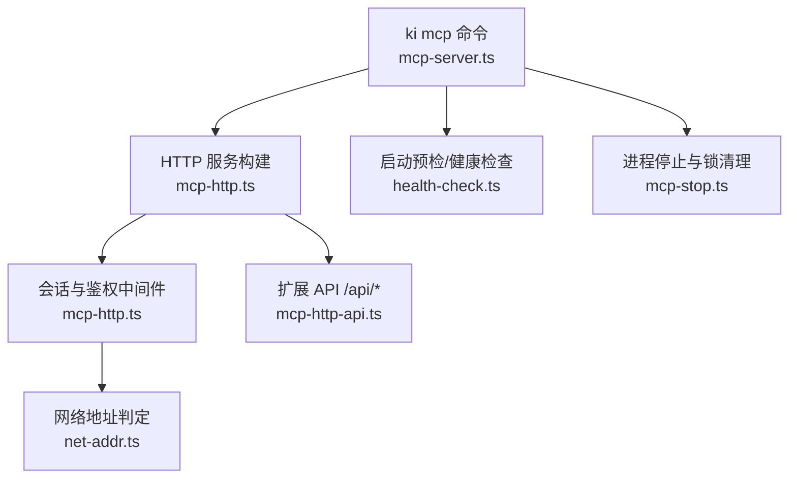
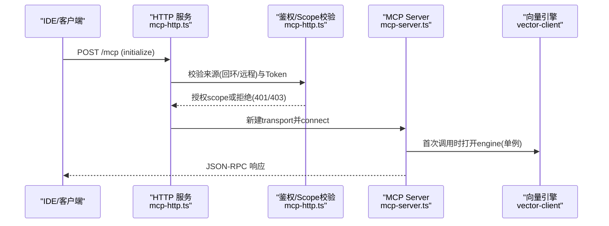
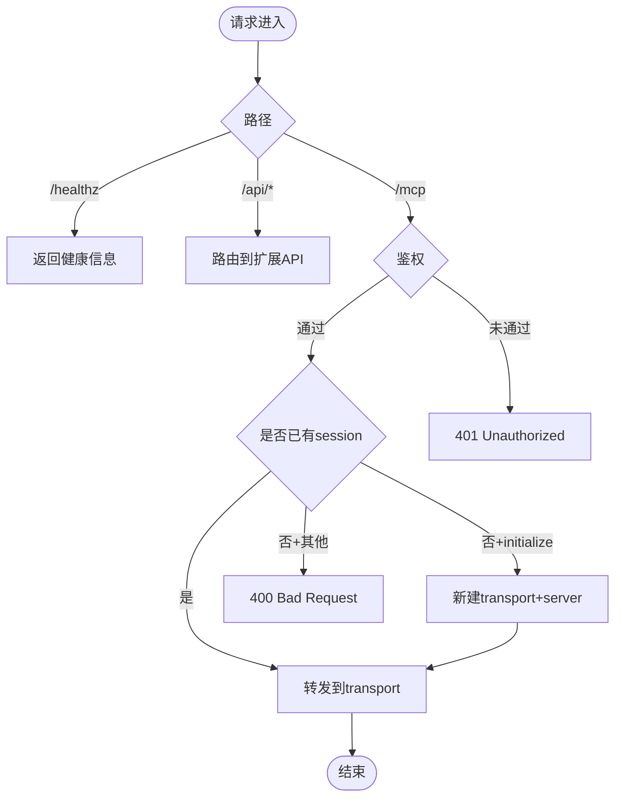
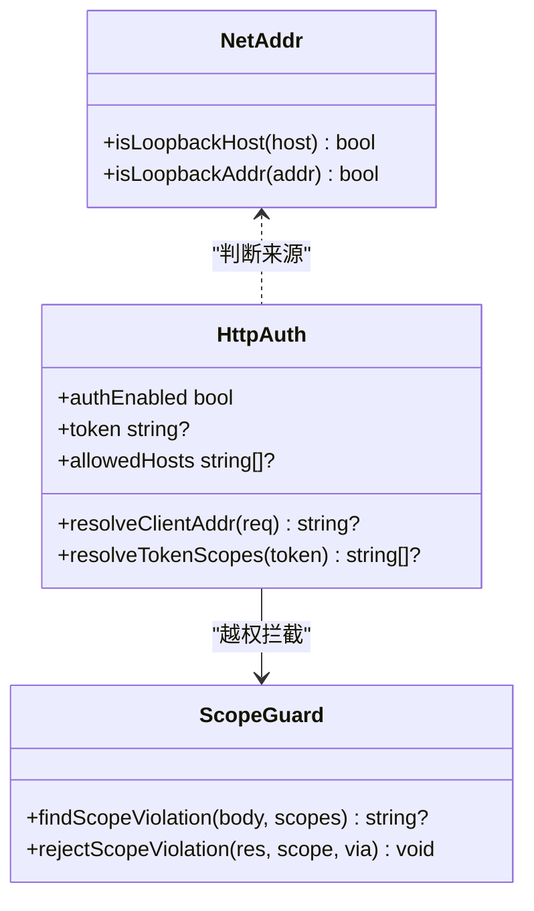
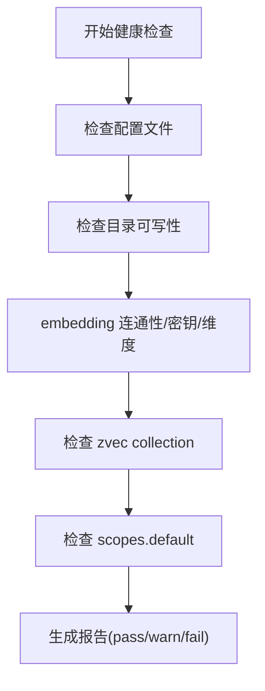
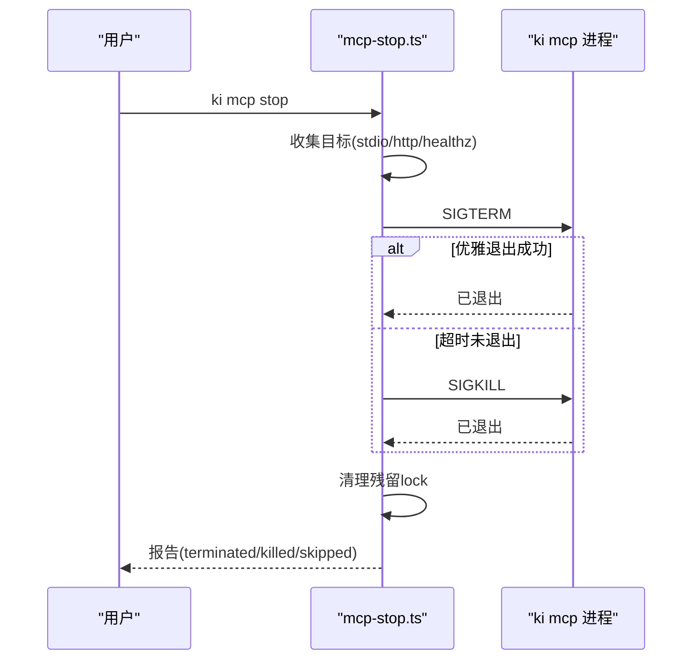
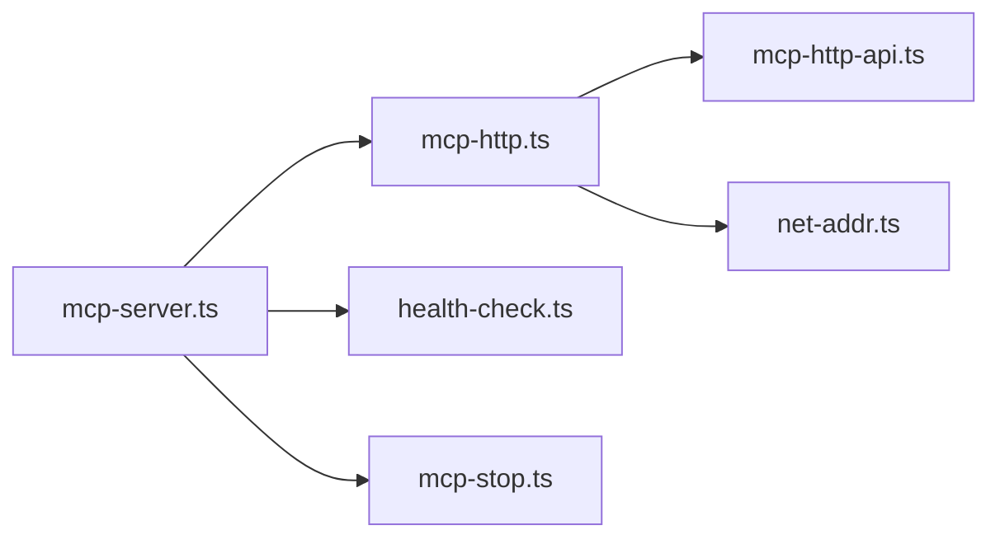

# 网络与MCP连接问题

<cite>
**本文引用的文件**
- [src/mcp-server.ts](file://src/mcp-server.ts)
- [src/lib/mcp-http.ts](file://src/lib/mcp-http.ts)
- [src/lib/mcp-http-api.ts](file://src/lib/mcp-http-api.ts)
- [src/lib/net-addr.ts](file://src/lib/net-addr.ts)
- [src/lib/health-check.ts](file://src/lib/health-check.ts)
- [src/lib/mcp-stop.ts](file://src/lib/mcp-stop.ts)
- [docs/mcp-http.md](file://docs/mcp-http.md)
</cite>

## 目录
1. [简介](#简介)
2. [项目结构](#项目结构)
3. [核心组件](#核心组件)
4. [架构总览](#架构总览)
5. [详细组件分析](#详细组件分析)
6. [依赖关系分析](#依赖关系分析)
7. [性能考虑](#性能考虑)
8. [故障排查指南](#故障排查指南)
9. [结论](#结论)
10. [附录](#附录)

## 简介
本指南聚焦 MCP 服务器启动失败、HTTP 连接超时、认证失败、端口冲突等网络连接问题的定位与修复。内容覆盖：
- 网络连通性测试方法（健康检查、探活）
- 防火墙与安全组检查要点
- SSL/TLS 证书配置建议（反向代理模式）
- MCP 协议握手过程、消息格式校验、连接与会话管理
- 常见错误诊断步骤、代理服务器配置、负载均衡注意事项
- 一键关闭与重启流程，避免残留锁导致假死

## 项目结构
围绕 MCP HTTP 服务的关键代码集中在以下模块：
- 入口与命令行：mcp-server.ts
- HTTP 传输与会话管理：mcp-http.ts
- 扩展 API（导入、文档列表、健康报告）：mcp-http-api.ts
- 网络地址判定（回环/非回环）：net-addr.ts
- 启动预检与健康诊断：health-check.ts
- 进程停止与锁清理：mcp-stop.ts
- 用户文档：docs/mcp-http.md

图表来源
- [src/mcp-server.ts:492-734](file://src/mcp-server.ts#L492-L734)
- [src/lib/mcp-http.ts:363-642](file://src/lib/mcp-http.ts#L363-L642)
- [src/lib/mcp-http-api.ts:216-272](file://src/lib/mcp-http-api.ts#L216-L272)
- [src/lib/health-check.ts:150-240](file://src/lib/health-check.ts#L150-L240)
- [src/lib/mcp-stop.ts:94-176](file://src/lib/mcp-stop.ts#L94-L176)
- [src/lib/net-addr.ts:7-34](file://src/lib/net-addr.ts#L7-L34)

章节来源
- [src/mcp-server.ts:492-734](file://src/mcp-server.ts#L492-L734)
- [src/lib/mcp-http.ts:363-642](file://src/lib/mcp-http.ts#L363-L642)
- [docs/mcp-http.md:1-273](file://docs/mcp-http.md#L1-L273)

## 核心组件
- MCP HTTP 单例守护：幂等启动、健康探活、会话上限与空闲回收、DNS rebinding 保护、静态页面服务。
- 条件鉴权：回环绑定免鉴权；非回环强制 Bearer Token；支持全权临时 Token 与多 Token 存储；scope 越权拦截。
- 启动预检：配置文件、目录可写、embedding 连通性/密钥/维度、zvec collection 状态。
- 进程治理：stop/restart/status 子命令，SIGTERM→SIGKILL 优雅退出，lock 清理。

章节来源
- [src/lib/mcp-http.ts:363-642](file://src/lib/mcp-http.ts#L363-L642)
- [src/lib/mcp-http.ts:644-800](file://src/lib/mcp-http.ts#L644-L800)
- [src/lib/health-check.ts:150-240](file://src/lib/health-check.ts#L150-L240)
- [src/lib/mcp-stop.ts:94-176](file://src/lib/mcp-stop.ts#L94-L176)

## 架构总览
MCP HTTP 服务基于 Node.js 内建 http.Server，使用 @modelcontextprotocol/sdk 的 StreamableHTTPServerTransport 实现 MCP 协议。每个 initialize 创建独立 transport + McpServer，共享 vector-client 的单例 engine（单进程单锁）。

图表来源
- [src/lib/mcp-http.ts:431-612](file://src/lib/mcp-http.ts#L431-L612)
- [src/mcp-server.ts:54-71](file://src/mcp-server.ts#L54-L71)

## 详细组件分析

### MCP HTTP 服务与会话管理
- 会话生命周期：POST /mcp 带 mcp-session-id 复用；无 session 且为 initialize 则新建；GET/DELETE 按 session 路由。
- 会话上限：默认最大并发会话数，超出返回 503。
- 空闲回收：后台定时关闭长时间未活动的会话，防止资源泄漏。
- DNS rebinding 保护：可选 allowedHosts 白名单。
- 静态页面：--web 提供前端 SPA fallback。

图表来源
- [src/lib/mcp-http.ts:431-612](file://src/lib/mcp-http.ts#L431-L612)
- [src/lib/mcp-http.ts:644-705](file://src/lib/mcp-http.ts#L644-L705)

章节来源
- [src/lib/mcp-http.ts:363-642](file://src/lib/mcp-http.ts#L363-L642)
- [src/lib/mcp-http.ts:644-800](file://src/lib/mcp-http.ts#L644-L800)

### 条件鉴权与 Scope 越权拦截
- 回环绑定（127.0.0.1/localhost/::1）：免鉴权。
- 非回环绑定：强制 Bearer Token；支持全权临时 Token 与多 Token 存储。
- Scope 越权：对 tools/call 的 arguments.scope 做越权校验，缺省为 'default'；枚举工具（ki_scope_list、ki_manage_index_list）由工具层按授权集合过滤输出。
- 鉴权失败计数：/healthz 暴露 authFailures，便于快速发现客户端 Token 配置错误。

图表来源
- [src/lib/net-addr.ts:7-34](file://src/lib/net-addr.ts#L7-L34)
- [src/lib/mcp-http.ts:476-509](file://src/lib/mcp-http.ts#L476-L509)
- [src/lib/mcp-http.ts:118-139](file://src/lib/mcp-http.ts#L118-L139)
- [src/lib/mcp-http-api.ts:130-143](file://src/lib/mcp-http-api.ts#L130-L143)

章节来源
- [src/lib/net-addr.ts:7-34](file://src/lib/net-addr.ts#L7-L34)
- [src/lib/mcp-http.ts:476-509](file://src/lib/mcp-http.ts#L476-L509)
- [src/lib/mcp-http-api.ts:216-272](file://src/lib/mcp-http-api.ts#L216-L272)

### 启动预检与健康诊断
- 配置文件存在性与字段合法性。
- dataDir/backupDir/vectorDir 可写性。
- embedding 三合一检查：URL 连通性、密钥有效性、维度匹配（含超时与重试）。
- zvec collection 是否存在。
- scopes.default 是否配置。

图表来源
- [src/lib/health-check.ts:150-240](file://src/lib/health-check.ts#L150-L240)

章节来源
- [src/lib/health-check.ts:150-240](file://src/lib/health-check.ts#L150-L240)

### 进程治理：stop/restart/status
- stop：收集目标（stdio lock、http lock、healthz 兜底），SIGTERM→SIGKILL 优雅退出，清理残留 lock。
- restart：仅 HTTP 模式，先关闭现有实例，再以守护进程方式后台重启，保留上次 host/port/web 配置。
- status：只读诊断，读取 lock + stdio 多实例 + 探活，输出 JSON 报告。

图表来源
- [src/lib/mcp-stop.ts:94-176](file://src/lib/mcp-stop.ts#L94-L176)

章节来源
- [src/lib/mcp-stop.ts:94-176](file://src/lib/mcp-stop.ts#L94-L176)

## 依赖关系分析
- mcp-server.ts 负责解析参数、守卫检测、启动预检、选择 stdio 或 HTTP 模式。
- mcp-http.ts 提供 HTTP 服务、会话管理、鉴权、静态页面、健康端点。
- mcp-http-api.ts 提供 /api/* 扩展接口，复用鉴权与 scope 校验。
- health-check.ts 提供统一的健康诊断逻辑，被 CLI 与 MCP 启动预检共用。
- net-addr.ts 提供回环地址判定，影响鉴权策略。
- mcp-stop.ts 提供进程停止与锁清理能力。

图表来源
- [src/mcp-server.ts:492-734](file://src/mcp-server.ts#L492-L734)
- [src/lib/mcp-http.ts:363-642](file://src/lib/mcp-http.ts#L363-L642)
- [src/lib/mcp-http-api.ts:216-272](file://src/lib/mcp-http-api.ts#L216-L272)
- [src/lib/health-check.ts:150-240](file://src/lib/health-check.ts#L150-L240)
- [src/lib/net-addr.ts:7-34](file://src/lib/net-addr.ts#L7-L34)
- [src/lib/mcp-stop.ts:94-176](file://src/lib/mcp-stop.ts#L94-L176)

章节来源
- [src/mcp-server.ts:492-734](file://src/mcp-server.ts#L492-L734)
- [src/lib/mcp-http.ts:363-642](file://src/lib/mcp-http.ts#L363-L642)

## 性能考虑
- 会话上限与空闲回收：防止会话无界增长耗尽内存；默认 30 分钟空闲回收。
- 健康检查超时与重试：embedding 检查使用 8s 超时与 1 次重试，容忍瞬时抖动。
- 请求体大小限制：/mcp 与 /api/* 均限制请求体大小，防止滥用。
- 优雅退出超时：5 秒兜底，确保进程及时释放锁。

[本节为通用性能讨论，不直接分析具体文件]

## 故障排查指南

### 常见问题与定位步骤
- MCP 服务器启动失败
  - 检查端口占用：listen 错误会给出明确提示（EADDRINUSE/EACCES/EADDRNOTAVAIL/ENOTFOUND）。
  - 检查预检失败：配置文件、目录权限、embedding 连通性/密钥/维度、zvec collection。
  - 使用 ki mcp --status 查看当前实例状态与鉴权失败次数。
- HTTP 连接超时
  - 使用 curl 探测 /healthz，确认服务可达。
  - 检查 embedding 连通性（health-check 中的 URL 连通性项）。
  - 检查防火墙/安全组是否放行端口。
- 认证失败（401/403）
  - 非回环绑定必须携带 Authorization: Bearer；核对 Token 是否与 ki mcp token list 输出一致。
  - 检查 scope 越权：tools/call 的 arguments.scope 是否在授权范围内。
  - 查看 /healthz 的 authFailures 计数与服务端 stderr 日志。
- 端口冲突
  - 使用 ki mcp stop 一键关闭所有实例并清理 lock。
  - 更换端口后重新启动。

章节来源
- [src/lib/mcp-http.ts:644-665](file://src/lib/mcp-http.ts#L644-L665)
- [src/lib/health-check.ts:150-240](file://src/lib/health-check.ts#L150-L240)
- [src/lib/mcp-stop.ts:94-176](file://src/lib/mcp-stop.ts#L94-L176)
- [docs/mcp-http.md:132-146](file://docs/mcp-http.md#L132-L146)

### 网络连通性测试方法
- 本地探活：curl http://127.0.0.1:7423/healthz
- 远程探活：curl http://<host>:<port>/healthz（需允许来源 IP）
- 嵌入服务连通性：运行 ki doctor 或 ki mcp 启动预检，观察 embedding 连通性项

章节来源
- [src/lib/mcp-http.ts:214-249](file://src/lib/mcp-http.ts#L214-L249)
- [src/lib/health-check.ts:54-144](file://src/lib/health-check.ts#L54-L144)

### 防火墙与安全组检查
- 确认端口在防火墙/安全组中放行。
- 非回环绑定时，确保来源 IP 在白名单内。
- 若使用反向代理，确认代理转发规则正确。

[本节为通用网络配置指导，不直接分析具体文件]

### SSL/TLS 证书配置指导
- 生产环境建议在反向代理（Nginx/Caddy）终结 TLS，MCP 服务处理明文。
- 代理配置需正确转发 Host、Authorization 头。
- 若直连 HTTPS，需确保客户端信任 CA 证书。

[本节为通用 TLS 配置指导，不直接分析具体文件]

### MCP 协议握手与消息格式验证
- 握手：POST /mcp 发送 initialize，服务端创建 transport 并返回初始化结果。
- 消息格式：JSON-RPC 2.0，包含 method、params、id。
- 会话管理：mcp-session-id 标识会话，GET/DELETE 用于长连接与关闭。

章节来源
- [src/lib/mcp-http.ts:523-612](file://src/lib/mcp-http.ts#L523-L612)

### 连接池与会话管理
- 会话上限：默认 256，超出返回 503。
- 空闲回收：后台定时关闭长时间未活动会话。
- 建议：合理设置会话上限与空闲超时，避免资源耗尽。

章节来源
- [src/lib/mcp-http.ts:47-54](file://src/lib/mcp-http.ts#L47-L54)
- [src/lib/mcp-http.ts:400-411](file://src/lib/mcp-http.ts#L400-L411)

### 代理服务器配置
- 反向代理需转发 /mcp 与 /api/* 路径。
- 保持 Authorization 头不变。
- 启用 WebSocket 或 SSE 支持（如需要）。

[本节为通用代理配置指导，不直接分析具体文件]

### 负载均衡设置
- 会话粘性：确保同一会话的请求路由到同一实例。
- 健康检查：后端实例需提供 /healthz。
- 限流与熔断：防止过载。

[本节为通用负载均衡指导，不直接分析具体文件]

## 结论
通过 MCP HTTP 单例模式、条件鉴权、启动预检与进程治理，可有效解决多 IDE 锁冲突、认证失败、端口冲突等问题。结合健康检查、探活与日志，能快速定位网络连通性、防火墙、TLS、代理等配置问题。建议在生产环境中使用反向代理终结 TLS，配合防火墙与安全组收敛访问来源，并使用 ki mcp token generate 进行最小权限授权。

[本节为总结，不直接分析具体文件]

## 附录
- 常用命令
  - ki mcp --http：启动 HTTP 单例（本机免鉴权）
  - ki mcp --http --host 0.0.0.0 --port 7423：远程访问（需 Token）
  - ki mcp token generate --scope <scope>：生成授权 Token
  - ki mcp --status：查看实例状态
  - ki mcp stop：一键关闭所有实例
  - ki mcp restart：重启 HTTP 单例

章节来源
- [docs/mcp-http.md:11-67](file://docs/mcp-http.md#L11-L67)
- [docs/mcp-http.md:105-131](file://docs/mcp-http.md#L105-L131)
- [docs/mcp-http.md:170-233](file://docs/mcp-http.md#L170-L233)