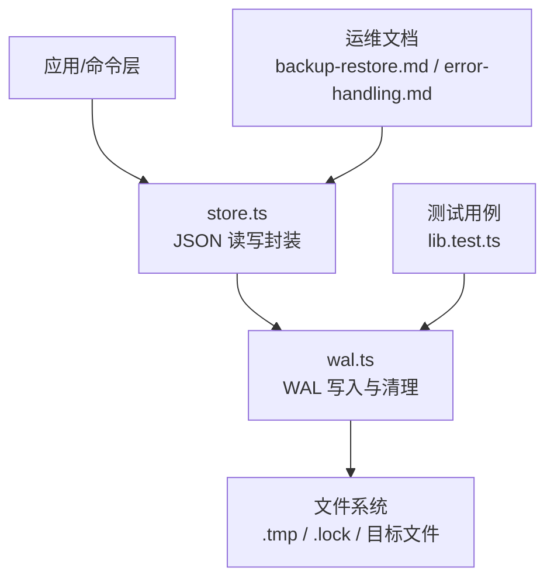
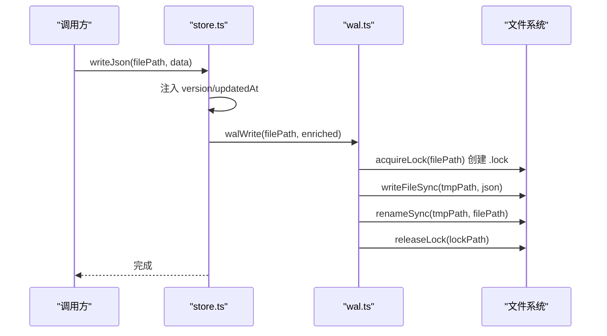
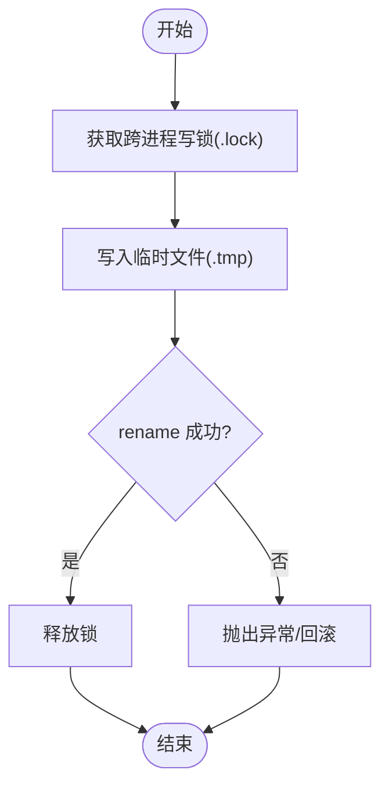
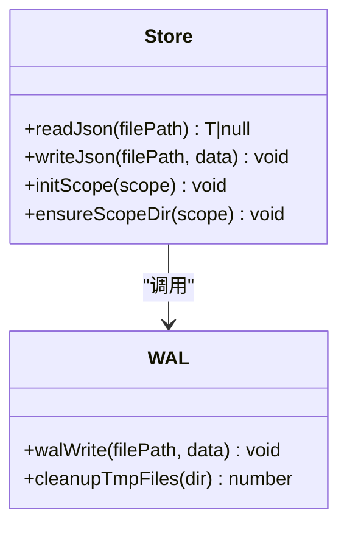
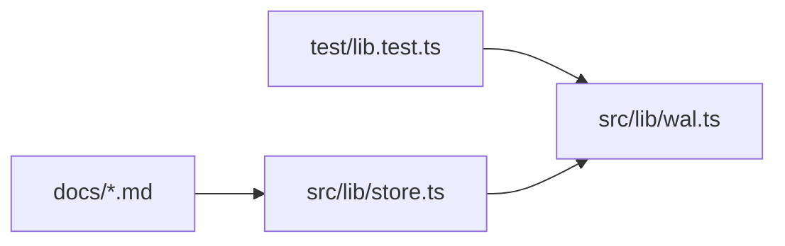

# WAL写入保证机制

<cite>
**本文引用的文件**
- [src/lib/wal.ts](file://src/lib/wal.ts)
- [src/lib/store.ts](file://src/lib/store.ts)
- [test/lib.test.ts](file://test/lib.test.ts)
- [docs/backup-restore.md](file://docs/backup-restore.md)
- [docs/error-handling.md](file://docs/error-handling.md)
</cite>

## 目录
1. [简介](#简介)
2. [项目结构](#项目结构)
3. [核心组件](#核心组件)
4. [架构总览](#架构总览)
5. [详细组件分析](#详细组件分析)
6. [依赖关系分析](#依赖关系分析)
7. [性能考量与优化建议](#性能考量与优化建议)
8. [故障恢复指南](#故障恢复指南)
9. [结论](#结论)

## 简介
本文件系统性说明知识库中的预写日志（WAL）写入保证机制。该机制通过“跨进程文件锁 + 临时文件原子重命名”的方式，确保对 JSON 数据文件的并发安全、崩溃一致性与可恢复性。文档覆盖以下要点：
- WAL 的工作原理：日志记录、事务边界、崩溃恢复流程
- 批量操作的原子性保证与一致性策略
- 日志文件格式与管理策略（轮转、清理、压缩的取舍）
- 并发控制机制，避免数据竞争与不一致状态
- 故障恢复场景：部分写入失败、系统崩溃等
- 性能影响分析与优化建议

## 项目结构
WAL 能力集中在独立的模块中，被上层存储层调用，测试用例验证其正确性，运维文档提供恢复指引。

图表来源
- [src/lib/store.ts:55-62](file://src/lib/store.ts#L55-L62)
- [src/lib/wal.ts:92-112](file://src/lib/wal.ts#L92-L112)
- [test/lib.test.ts:46-96](file://test/lib.test.ts#L46-L96)
- [docs/backup-restore.md:183-227](file://docs/backup-restore.md#L183-L227)
- [docs/error-handling.md:41-59](file://docs/error-handling.md#L41-L59)

章节来源
- [src/lib/store.ts:1-62](file://src/lib/store.ts#L1-L62)
- [src/lib/wal.ts:1-143](file://src/lib/wal.ts#L1-L143)
- [test/lib.test.ts:46-96](file://test/lib.test.ts#L46-L96)
- [docs/backup-restore.md:183-227](file://docs/backup-restore.md#L183-L227)
- [docs/error-handling.md:41-59](file://docs/error-handling.md#L41-L59)

## 核心组件
- WAL 写入器（wal.ts）
  - 提供 walWrite(filePath, data)：获取跨进程写锁 → 写 .tmp → 原子 rename → 释放锁
  - 提供 cleanupTmpFiles(dir)：清理残留 .tmp 与陈旧 .lock
  - 使用 O_CREAT|O_EXCL 创建 .lock 实现互斥；支持陈旧锁抢占与超时保护
- 存储层封装（store.ts）
  - writeJson(filePath, data)：为数据注入 version 与 updatedAt，并委托 walWrite 持久化
  - readJson(filePath)：读取并校验 JSON 版本，损坏时抛出 CORRUPT_JSON
  - initScope/migrate 等逻辑在初始化或迁移时通过 walWrite 落盘
- 测试与文档
  - test/lib.test.ts：验证写入一致性、无 .tmp 残留、覆盖写入完整性、清理行为
  - docs/backup-restore.md：提供损坏与丢失场景的恢复步骤
  - docs/error-handling.md：汇总常见错误与恢复方式

章节来源
- [src/lib/wal.ts:14-20](file://src/lib/wal.ts#L14-L20)
- [src/lib/wal.ts:37-76](file://src/lib/wal.ts#L37-L76)
- [src/lib/wal.ts:92-112](file://src/lib/wal.ts#L92-L112)
- [src/lib/wal.ts:121-142](file://src/lib/wal.ts#L121-L142)
- [src/lib/store.ts:23-62](file://src/lib/store.ts#L23-L62)
- [test/lib.test.ts:46-96](file://test/lib.test.ts#L46-L96)
- [docs/backup-restore.md:183-227](file://docs/backup-restore.md#L183-L227)
- [docs/error-handling.md:41-59](file://docs/error-handling.md#L41-L59)

## 架构总览
WAL 以“先写后换”的原子更新为核心，配合跨进程锁，保证同一时刻仅一个进程能修改目标文件，且读端始终看到完整、一致的快照。

图表来源
- [src/lib/store.ts:55-62](file://src/lib/store.ts#L55-L62)
- [src/lib/wal.ts:37-76](file://src/lib/wal.ts#L37-L76)
- [src/lib/wal.ts:92-112](file://src/lib/wal.ts#L92-L112)

## 详细组件分析

### WAL 写入流程与并发控制
- 跨进程写锁
  - 通过创建 ${filePath}.lock 并使用 O_CREAT|O_EXCL 实现独占；若存在则检查是否陈旧（超过阈值视为持有者崩溃），允许抢占
  - 自旋等待时使用同步睡眠，最长等待时间受超时限制，避免永久死锁
- 原子写入
  - 先将数据序列化为 JSON 写入 .tmp 文件，再使用 rename 原子替换目标文件
  - 任何中间阶段崩溃都不会破坏原文件内容
- 清理策略
  - cleanupTmpFiles 会删除所有 .tmp 以及陈旧 .lock，保障磁盘整洁与后续启动可用

图表来源
- [src/lib/wal.ts:37-76](file://src/lib/wal.ts#L37-L76)
- [src/lib/wal.ts:92-112](file://src/lib/wal.ts#L92-L112)
- [src/lib/wal.ts:121-142](file://src/lib/wal.ts#L121-L142)

章节来源
- [src/lib/wal.ts:14-20](file://src/lib/wal.ts#L14-L20)
- [src/lib/wal.ts:37-76](file://src/lib/wal.ts#L37-L76)
- [src/lib/wal.ts:92-112](file://src/lib/wal.ts#L92-L112)
- [src/lib/wal.ts:121-142](file://src/lib/wal.ts#L121-L142)

### 存储层封装与版本管理
- writeJson 自动注入 version 与 updatedAt，便于兼容性与审计
- readJson 解析失败时抛出带 code 的错误，便于上层统一处理
- 初始化与迁移路径也通过 walWrite 落盘，保证一致性

图表来源
- [src/lib/store.ts:23-62](file://src/lib/store.ts#L23-L62)
- [src/lib/wal.ts:92-112](file://src/lib/wal.ts#L92-L112)
- [src/lib/wal.ts:121-142](file://src/lib/wal.ts#L121-L142)

章节来源
- [src/lib/store.ts:23-62](file://src/lib/store.ts#L23-L62)

### 测试与断言
- 写入一致性：写入后可正确读取到最新数据
- 无残留：写入完成后不遗留 .tmp
- 覆盖写入：多次覆盖保持最终一致性
- 清理：清理函数能正确统计并删除 .tmp 与陈旧 .lock

章节来源
- [test/lib.test.ts:46-96](file://test/lib.test.ts#L46-L96)

## 依赖关系分析
- store.ts 依赖 wal.ts 提供的原子写入能力
- 测试依赖 wal.ts 暴露的接口进行断言
- 运维文档指导恢复流程，与 store.ts 的错误码和 WAL 的原子性配合

图表来源
- [src/lib/store.ts:12-15](file://src/lib/store.ts#L12-L15)
- [src/lib/wal.ts:92-112](file://src/lib/wal.ts#L92-L112)
- [test/lib.test.ts:46-96](file://test/lib.test.ts#L46-L96)
- [docs/backup-restore.md:183-227](file://docs/backup-restore.md#L183-L227)
- [docs/error-handling.md:41-59](file://docs/error-handling.md#L41-L59)

章节来源
- [src/lib/store.ts:12-15](file://src/lib/store.ts#L12-L15)
- [src/lib/wal.ts:92-112](file://src/lib/wal.ts#L92-L112)
- [test/lib.test.ts:46-96](file://test/lib.test.ts#L46-L96)
- [docs/backup-restore.md:183-227](file://docs/backup-restore.md#L183-L227)
- [docs/error-handling.md:41-59](file://docs/error-handling.md#L41-L59)

## 性能考量与优化建议
- 同步阻塞特性
  - walWrite 为同步实现，等待锁期间通过 Atomics.wait 阻塞当前线程，可能短暂冻结事件循环
  - 正常争用窗口极短（毫秒级），仅在持锁进程崩溃或极端高并发时可能出现秒级阻塞
- 锁参数调优
  - LOCK_ACQUIRE_TIMEOUT_MS 控制最大等待时间，避免无限等待
  - LOCK_STALE_MS 定义陈旧锁阈值，平衡安全性与抢占及时性
  - LOCK_RETRY_INTERVAL_MS 控制重试频率，降低 CPU 占用
- 写入路径优化
  - 使用 .tmp + rename 的原子替换，减少 I/O 次数与风险
  - 建议在批量更新场景中合并多次写入，减少锁争用与 fs 调用
- 监控与可观测性
  - 可在上层埋点记录锁等待时长、rename 耗时、异常率，辅助定位热点文件与瓶颈
- 未来演进方向
  - 如需彻底消除同步阻塞，可考虑异步锁实现（fs.promises + 异步重试），但需评估复杂性与兼容性

[本节为通用性能讨论，不直接分析具体代码行]

## 故障恢复指南
- 数据损坏检测
  - readJson 在 JSON 解析失败时抛出 CORRUPT_JSON，提示从备份恢复或重新初始化 scope
- 常见恢复场景
  - group-index.json 损坏：从快照恢复整个 scope，或重新初始化
  - relations-cache.json 损坏：从快照恢复
  - 整个 scope 数据丢失：从快照恢复或重新初始化后导入
  - 本地 KB 原文丢失：从快照恢复或重新导入知识库
- 清理残留
  - 使用 cleanupTmpFiles 清理 .tmp 与陈旧 .lock，避免干扰后续操作
- 预防建议
  - 定期备份 kb/{scope}/ 目录（如 rsync/tar）
  - 在导入、迁移等高并发写入前，确保无残留锁文件

章节来源
- [src/lib/store.ts:23-49](file://src/lib/store.ts#L23-L49)
- [docs/backup-restore.md:183-227](file://docs/backup-restore.md#L183-L227)
- [docs/error-handling.md:41-59](file://docs/error-handling.md#L41-L59)
- [src/lib/wal.ts:121-142](file://src/lib/wal.ts#L121-L142)

## 结论
本项目的 WAL 机制通过“跨进程写锁 + 临时文件原子重命名”的组合，提供了强一致性的单文件写入语义，有效防止并发竞争与崩溃导致的数据损坏。配合版本字段与错误码，上层可快速识别并恢复异常。对于高并发与长驻进程场景，需注意同步锁带来的短暂阻塞，可通过参数调优与批量合并写入降低影响。结合备份与恢复流程，整体具备可靠的容错与自愈能力。