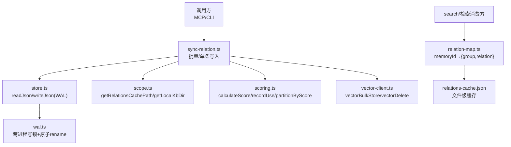
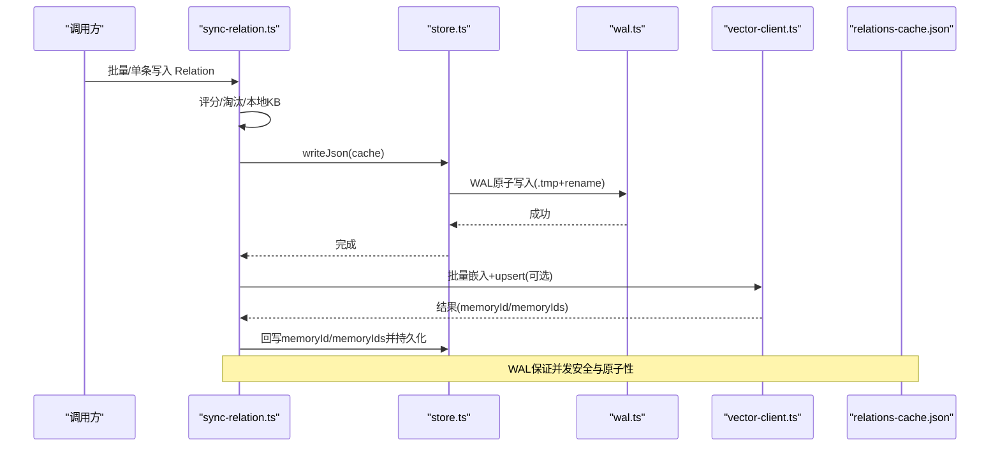
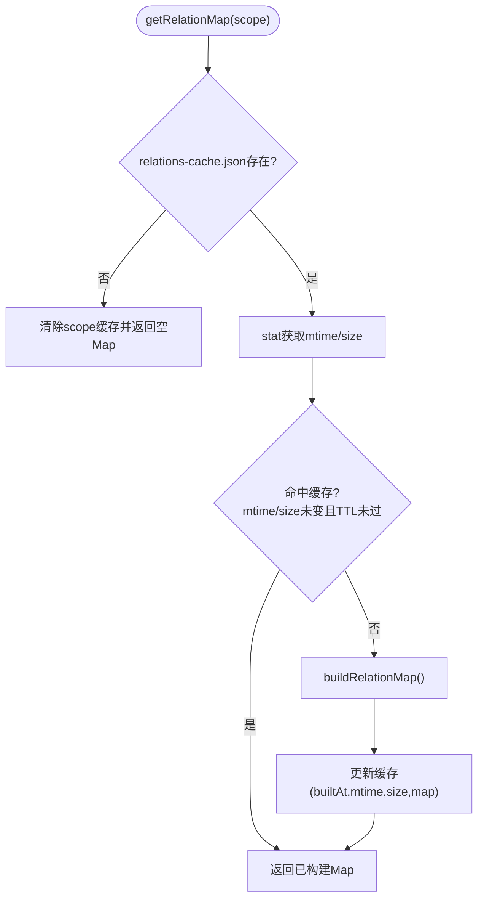
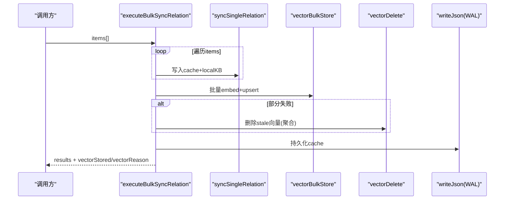
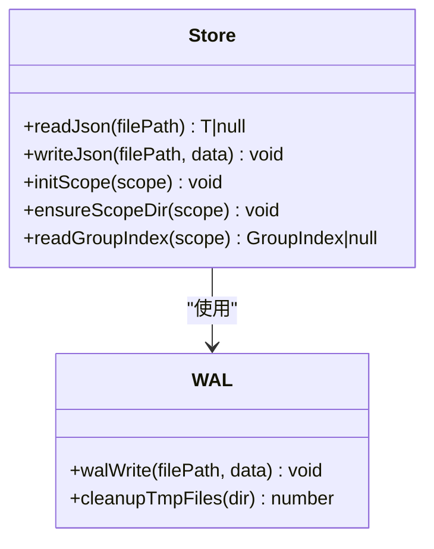
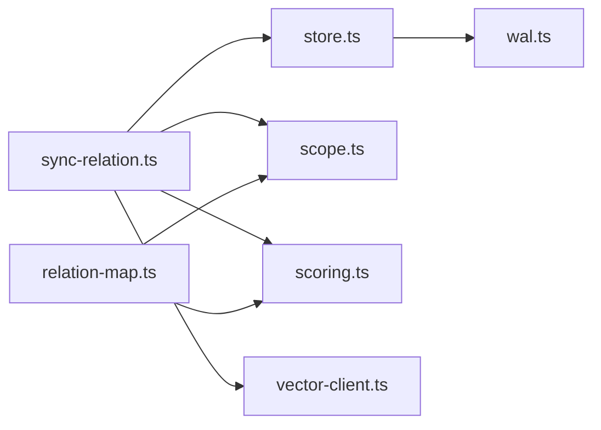

# 关系映射缓存

<cite>
**本文引用的文件**
- [relation-map.ts](file://src/lib/relation-map.ts)
- [sync-relation.ts](file://src/sync-relation.ts)
- [store.ts](file://src/lib/store.ts)
- [scope.ts](file://src/lib/scope.ts)
- [wal.ts](file://src/lib/wal.ts)
- [scoring.ts](file://src/lib/scoring.ts)
- [tags-design.md](file://docs/tags-design.md)
- [DESIGN.md（向量存储与KB写入并行化优化）](file://.requirements/2026-06-18-向量存储与KB写入并行化优化/design/DESIGN.md)
- [implementation-report.md（向量存储与KB写入并行化优化）](file://.requirements/2026-06-18-向量存储与KB写入并行化优化/implementation-report.md)
</cite>

## 目录
1. [简介](#简介)
2. [项目结构](#项目结构)
3. [核心组件](#核心组件)
4. [架构总览](#架构总览)
5. [详细组件分析](#详细组件分析)
6. [依赖关系分析](#依赖关系分析)
7. [性能考虑](#性能考虑)
8. [故障排查指南](#故障排查指南)
9. [结论](#结论)
10. [附录](#附录)

## 简介
本文件系统性说明“关系映射缓存系统”的设计与实现，重点覆盖：
- Relation 到原文位置的映射：Group 路径、Relation 名称、以及通过 memoryId/memoryIds 关联的向量文档定位；
- 缓存策略：内存缓存、文件持久化、失效机制（mtime/size/TTL）；
- 增量同步算法：批量写入、去重、旧向量清理与一致性保障；
- 多进程一致性：WAL 原子写入与跨进程写锁；
- 性能优化：LRU 淘汰、预加载、批量操作；
- 监控与健康检查：服务就绪探测、错误降级与可观测性。

## 项目结构
关系映射缓存涉及以下关键模块：
- 关系映射反查缓存：memoryId → { group, relation }，带 TTL 与 mtime/size 失效
- 关系写入与同步：单条/批量 sync-relation，含评分、淘汰、本地 KB 写入
- 存储层：JSON 读写、WAL 原子写入、Scope 初始化与迁移
- 路径与范围：Scope 校验、relations-cache.json 路径构造
- 评分与分区：使用密度评分、冷热分区、边界衰减
- 向量通道：ki-relation/ki-search 标签写入、批量 upsert、删除旧向量

图表来源
- [sync-relation.ts:129-221](file://src/sync-relation.ts#L129-L221)
- [store.ts:23-62](file://src/lib/store.ts#L23-L62)
- [scope.ts:49-77](file://src/lib/scope.ts#L49-L77)
- [scoring.ts:44-79](file://src/lib/scoring.ts#L44-L79)
- [relation-map.ts:48-78](file://src/lib/relation-map.ts#L48-L78)
- [wal.ts:92-112](file://src/lib/wal.ts#L92-L112)

章节来源
- [sync-relation.ts:129-221](file://src/sync-relation.ts#L129-L221)
- [store.ts:23-62](file://src/lib/store.ts#L23-L62)
- [scope.ts:49-77](file://src/lib/scope.ts#L49-L77)
- [scoring.ts:44-79](file://src/lib/scoring.ts#L44-L79)
- [relation-map.ts:48-78](file://src/lib/relation-map.ts#L48-L78)
- [wal.ts:92-112](file://src/lib/wal.ts#L92-L112)

## 核心组件
- 关系映射反查缓存（relation-map.ts）
  - 提供 memoryId → { group, relation } 的反查 Map，支持 TTL、mtime/size 失效、懒构建
  - 兼容旧数据 memoryId 与新数据 memoryIds（文件级 relation 的多 chunk memoryId）
- 关系写入与同步（sync-relation.ts）
  - 单条/批量写入 Relation，维护评分、淘汰、本地 KB 写入
  - 批量模式一次 embedding + 一次 worker upsert，拆分结果回写 memoryId/memoryIds
  - 向量写入失败不阻塞 KB 通道，返回 vectorPending/vectorStored/vectorReason
- 存储层（store.ts + wal.ts）
  - JSON 读写、版本检查、WAL 原子写入（.tmp + rename）
  - Scope 初始化、旧格式迁移（roots→groups）、relations-cache key 迁移合并
- 范围与路径（scope.ts）
  - Scope 校验、relations-cache.json 路径构造、group-index.json 读取与迁移
- 评分与分区（scoring.ts）
  - 基于 useCount 与 lastUsedTime 的评分、防刷记录、冷热分区、边界衰减

章节来源
- [relation-map.ts:1-120](file://src/lib/relation-map.ts#L1-L120)
- [sync-relation.ts:129-221](file://src/sync-relation.ts#L129-L221)
- [store.ts:23-62](file://src/lib/store.ts#L23-L62)
- [wal.ts:92-112](file://src/lib/wal.ts#L92-L112)
- [scope.ts:49-77](file://src/lib/scope.ts#L49-L77)
- [scoring.ts:44-79](file://src/lib/scoring.ts#L44-L79)

## 架构总览
关系映射缓存系统由“写入侧”和“查询侧”组成：
- 写入侧：sync-relation 负责 Relation 的创建/更新、评分计算、淘汰、本地 KB 写入、向量写入（ki-relation/ki-search），并通过 WAL 持久化 relations-cache.json
- 查询侧：relation-map 在 search 等消费方命中向量结果后，按 memoryId/memoryIds 反查 Group 与 Relation，附加上下文信息

图表来源
- [sync-relation.ts:407-787](file://src/sync-relation.ts#L407-L787)
- [store.ts:55-62](file://src/lib/store.ts#L55-L62)
- [wal.ts:92-112](file://src/lib/wal.ts#L92-L112)

章节来源
- [sync-relation.ts:407-787](file://src/sync-relation.ts#L407-L787)
- [store.ts:55-62](file://src/lib/store.ts#L55-L62)
- [wal.ts:92-112](file://src/lib/wal.ts#L92-L112)

## 详细组件分析

### 关系映射反查缓存（relation-map.ts）
- 功能：为搜索消费方提供 memoryId → { group, relation } 的反查映射，用于将向量结果附加 Group 与 Relation 上下文
- 缓存策略：
  - 模块级单例 Map<scope, { builtAt, mtimeMs, size, map }>
  - 命中条件：relations-cache.json 的 mtime + size 均未变且未超过 TTL（默认 10 分钟）
  - 失效条件：文件被写入（mtime/size 变化）或 TTL 过期
  - 懒构建：首次访问 O(N)，后续 O(1)
  - 容错：文件缺失/损坏返回空 Map，不抛错
- 兼容性：优先处理 memoryIds（文件级 relation 的全部 chunk memoryId），回退到 memoryId

图表来源
- [relation-map.ts:48-78](file://src/lib/relation-map.ts#L48-L78)
- [relation-map.ts:80-114](file://src/lib/relation-map.ts#L80-L114)

章节来源
- [relation-map.ts:1-120](file://src/lib/relation-map.ts#L1-L120)

### 关系写入与同步（sync-relation.ts）
- 单条写入：确保 Group 路径完整、查找/创建 Relation、评分更新、淘汰、本地 KB 写入
- 批量写入：
  - 阶段1：循环 syncSingleRelation 改 cache + 收集 entries（ki-relation/ki-search/自定义 tags）
  - 阶段1.5：同批重复 (group, relation) 去重，避免孤儿向量与误删
  - 阶段2：一次 vectorBulkStore 批量 embed + upsert
  - 阶段3：拆分结果，回写 memoryId/memoryIds，聚合删除 stale 向量
  - 阶段4：一次 writeJson 落盘 cache
  - 阶段5：各自 wiki 写回（无冲突）
- 向量写入失败不阻塞主流程，返回 vectorPending/vectorStored/vectorReason

图表来源
- [sync-relation.ts:407-787](file://src/sync-relation.ts#L407-L787)

章节来源
- [sync-relation.ts:129-221](file://src/sync-relation.ts#L129-L221)
- [sync-relation.ts:407-787](file://src/sync-relation.ts#L407-L787)

### 存储层与一致性（store.ts + wal.ts）
- readJson：读取 JSON + version 检查，损坏抛出 CORRUPT_JSON
- writeJson：自动添加 version 与 updatedAt，通过 WAL 原子写入
- WAL：跨进程写锁（.lock）、写 .tmp、原子 rename、释放锁；支持陈旧锁抢占与超时
- Scope 初始化：从 _template 复制 group-index.json 与 relations-cache.json，替换 scope 字段
- 迁移：group-index roots→groups；relations-cache 旧 key 前缀“项目根/”重命名/合并

图表来源
- [store.ts:23-62](file://src/lib/store.ts#L23-L62)
- [store.ts:229-266](file://src/lib/store.ts#L229-L266)
- [wal.ts:92-112](file://src/lib/wal.ts#L92-L112)

章节来源
- [store.ts:23-62](file://src/lib/store.ts#L23-L62)
- [store.ts:229-266](file://src/lib/store.ts#L229-L266)
- [wal.ts:92-112](file://src/lib/wal.ts#L92-L112)

### 范围与路径（scope.ts）
- validateScope：仅允许字母、数字、连字符、下划线，拒绝路径遍历字符
- getRelationsCachePath：构造 kb/{scope}/relations-cache.json
- getLocalKbDir：构造 kb/{scope}/{group}/index.json
- migrateGroupIndex：roots→groups 迁移
- ensureGroupPathInTree：确保 Group 路径在树中完整存在

章节来源
- [scope.ts:30-43](file://src/lib/scope.ts#L30-L43)
- [scope.ts:49-77](file://src/lib/scope.ts#L49-L77)
- [scope.ts:117-146](file://src/lib/scope.ts#L117-L146)
- [scope.ts:151-167](file://src/lib/scope.ts#L151-L167)

### 评分与分区（scoring.ts）
- calculateScore：useCount / (1 + hoursSinceLastUse / halfLifeHours)
- recordUse：5 分钟防刷 + MAX_USE_COUNT 上限
- hybridPartition：新兴热区 + 历史热区 + 常温/冷区分配，上限截断
- boundaryDecay：新内容进入热区时触发边界衰减，保持分数平滑过渡

章节来源
- [scoring.ts:44-79](file://src/lib/scoring.ts#L44-L79)
- [scoring.ts:90-117](file://src/lib/scoring.ts#L90-L117)
- [scoring.ts:136-209](file://src/lib/scoring.ts#L136-L209)
- [scoring.ts:222-274](file://src/lib/scoring.ts#L222-L274)

## 依赖关系分析
- sync-relation.ts 依赖 store.ts（读写缓存）、scope.ts（路径构造）、scoring.ts（评分/淘汰）、vector-client.ts（向量化）
- relation-map.ts 依赖 scope.ts（relations-cache 路径）、scoring.ts（Relation 类型）
- store.ts 依赖 wal.ts（原子写入）、scope.ts（路径）、config.ts（配置）
- 向量通道与 KB 通道解耦：向量写入失败不影响 KB 写入，提升鲁棒性与吞吐

图表来源
- [sync-relation.ts:16-35](file://src/sync-relation.ts#L16-L35)
- [relation-map.ts:19-21](file://src/lib/relation-map.ts#L19-L21)
- [store.ts:10-15](file://src/lib/store.ts#L10-L15)

章节来源
- [sync-relation.ts:16-35](file://src/sync-relation.ts#L16-L35)
- [relation-map.ts:19-21](file://src/lib/relation-map.ts#L19-L21)
- [store.ts:10-15](file://src/lib/store.ts#L10-L15)

## 性能考虑
- LRU 淘汰：按 score 降序，达到 maxHotCount 时淘汰最低分 Relation（scoring.partitionByScore）
- 预加载：relation-map 懒构建，首次访问 O(N)，后续 O(1)；TTL/mtime/size 三重失效
- 批量操作：executeBulkSyncRelation 一次 embedding + 一次 worker upsert，减少 HTTP 往返与串行开销
- 异步向量写入：sync_relation KB 写入完成后立即返回，向量异步执行（DESIGN.md）
- WAL 原子写入：避免并发写导致的 Last-Write-Wins 静默覆盖，提升一致性与可靠性

章节来源
- [scoring.ts:136-209](file://src/lib/scoring.ts#L136-L209)
- [relation-map.ts:48-78](file://src/lib/relation-map.ts#L48-L78)
- [sync-relation.ts:407-787](file://src/sync-relation.ts#L407-L787)
- [DESIGN.md:106-135](file://.requirements/2026-06-18-向量存储与KB写入并行化优化/design/DESIGN.md#L106-L135)
- [wal.ts:92-112](file://src/lib/wal.ts#L92-L112)

## 故障排查指南
- JSON 损坏：readJson 抛出 CORRUPT_JSON，建议从备份恢复或重新初始化 scope
- 向量服务不可用：ensureVectorAvailable 检测失败时，标记 vectorReason 并继续 KB 写入
- 向量写入部分失败：保留旧向量，避免“删旧丢新”，可通过 rebuild-vector 恢复
- 多进程并发写：WAL 写锁争用可能导致短暂阻塞，正常窗口毫秒级；陈旧锁 30s 内可抢占
- 健康检查：MCP 启动后轮询 /healthz 确认服务就绪（测试用例验证）

章节来源
- [store.ts:23-49](file://src/lib/store.ts#L23-L49)
- [sync-relation.ts:610-621](file://src/sync-relation.ts#L610-L621)
- [sync-relation.ts:698-705](file://src/sync-relation.ts#L698-L705)
- [wal.ts:37-71](file://src/lib/wal.ts#L37-L71)
- [mcp-daemon.test.ts:136-147](file://test/mcp-daemon.test.ts#L136-L147)

## 结论
关系映射缓存系统通过“写入侧批量同步 + 查询侧内存反查缓存”的双通道设计，实现了高效、可靠的关系索引管理。其核心优势包括：
- 明确的 Relation 到原文位置映射（Group、Relation、memoryId/memoryIds）
- 健壮的缓存策略（TTL/mtime/size 失效、懒构建、容错降级）
- 高效的增量同步（批量写入、去重、旧向量清理、一致性保障）
- 多进程一致性（WAL 原子写入与跨进程写锁）
- 性能优化（LRU 淘汰、预加载、批量操作、异步向量写入）
- 可观测性与健康检查（服务就绪探测、错误降级、可观测指标）

## 附录
- 向量通道与 KB 通道解耦：向量写入失败不影响 KB 写入，提升鲁棒性（implementation-report.md）
- 标签体系：ki-relation/ki-search 标签写入与查询（tags-design.md）

章节来源
- [implementation-report.md:1-42](file://.requirements/2026-06-18-向量存储与KB写入并行化优化/implementation-report.md#L1-L42)
- [tags-design.md:41-88](file://docs/tags-design.md#L41-L88)