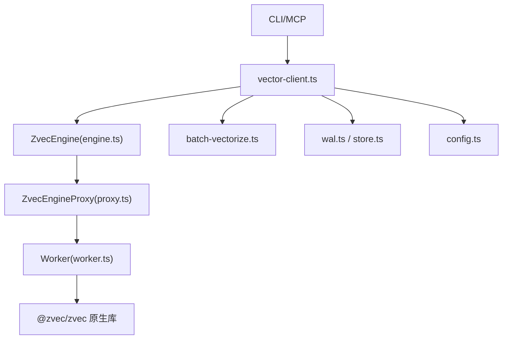
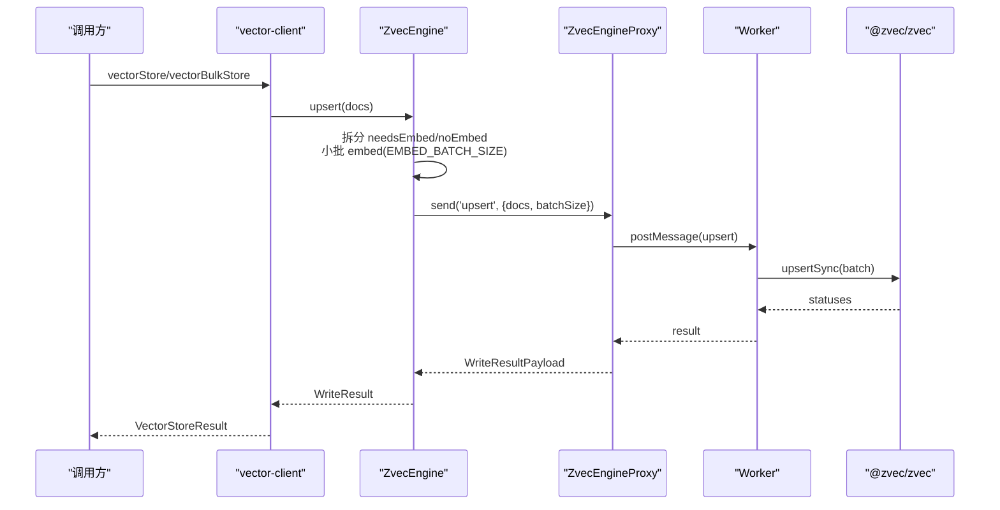
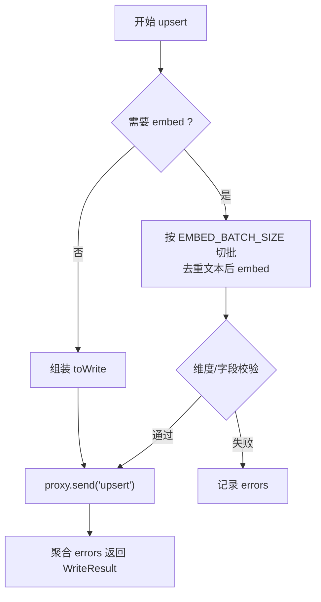
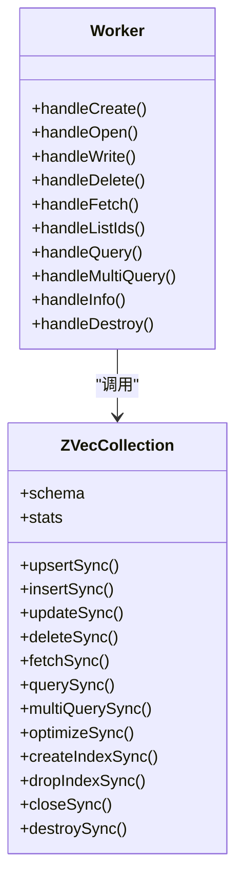
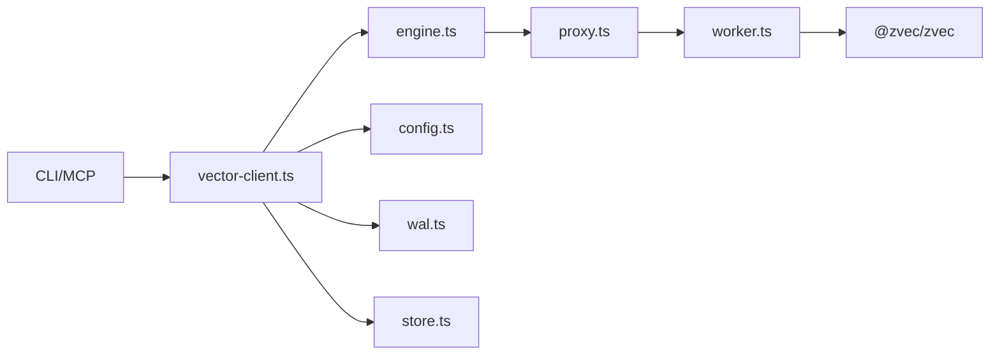

# 向量数据库持久化

<cite>
**本文引用的文件**
- [engine.ts](file://src/zvec-engine/engine.ts)
- [index.ts](file://src/zvec-engine/index.ts)
- [proxy.ts](file://src/zvec-engine/proxy.ts)
- [worker.ts](file://src/zvec-engine/worker.ts)
- [types.ts](file://src/zvec-engine/types.ts)
- [errors.ts](file://src/zvec-engine/errors.ts)
- [vector-client.ts](file://src/lib/vector-client.ts)
- [batch-vectorize.ts](file://src/lib/batch-vectorize.ts)
- [wal.ts](file://src/lib/wal.ts)
- [store.ts](file://src/lib/store.ts)
- [config.ts](file://src/lib/config.ts)
- [bulk-store.ts](file://src/bulk-store.ts)
</cite>

## 目录
1. [简介](#简介)
2. [项目结构](#项目结构)
3. [核心组件](#核心组件)
4. [架构总览](#架构总览)
5. [详细组件分析](#详细组件分析)
6. [依赖关系分析](#依赖关系分析)
7. [性能与调优](#性能与调优)
8. [故障恢复与一致性](#故障恢复与一致性)
9. [结论](#结论)
10. [附录：配置与迁移](#附录：配置与迁移)

## 简介
本文件面向“向量数据库的持久化机制与数据管理”，围绕 Zvec 引擎集成、集合创建与索引构建、参数调优、向量化数据存储格式、批量写入优化（批大小、并发控制、错误重试）、数据迁移与升级、性能监控与调优、以及故障恢复与一致性保证进行系统化说明。内容基于源码实现，提供可追溯的文件来源与图示。

## 项目结构
本项目将向量能力以独立子模块组织：
- zvec-engine：Zvec 引擎封装（主线程门面 + worker 线程 + 协议 + 类型/异常）
- lib/vector-client：面向 CLI/MCP 的统一向量适配器（单 collection、scope/tag 隔离、hybrid 检索）
- lib/wal 与 lib/store：JSON 元数据的 WAL 写入与 scope 初始化/迁移
- config：统一配置加载（含 vectorDir、embedding 配置）
- bulk-store CLI：批量导入入口

图表来源
- [engine.ts:68-131](file://src/zvec-engine/engine.ts#L68-L131)
- [proxy.ts:56-126](file://src/zvec-engine/proxy.ts#L56-L126)
- [worker.ts:118-163](file://src/zvec-engine/worker.ts#L118-L163)
- [vector-client.ts:271-340](file://src/lib/vector-client.ts#L271-L340)
- [config.ts:244-359](file://src/lib/config.ts#L244-L359)

章节来源
- [engine.ts:68-131](file://src/zvec-engine/engine.ts#L68-L131)
- [vector-client.ts:271-340](file://src/lib/vector-client.ts#L271-L340)
- [config.ts:244-359](file://src/lib/config.ts#L244-L359)

## 核心组件
- ZvecEngine：对外门面，负责 create/open、写入编排（embed/校验/批处理）、检索路由、索引操作、生命周期管理
- ZvecEngineProxy：主线程侧 worker 通信代理，消息序列化、在途请求 drain、crash 处理
- Worker：独立线程持有唯一 collection 句柄，串行执行 DB 操作，调用 @zvec/zvec 原生 API
- vector-client：统一适配层，定义 collection schema（denseField/dimension/FTS/scalarFields），封装 upsert/search/delete/listIds/fetch，并提供进程内 engine 单例与空闲释放锁
- wal/store：JSON 元数据的原子写入与 scope 初始化/迁移
- batch-vectorize：批量向量化（bulkVectorize 推荐，按 200 条分批提交）

章节来源
- [engine.ts:68-509](file://src/zvec-engine/engine.ts#L68-L509)
- [proxy.ts:44-181](file://src/zvec-engine/proxy.ts#L44-L181)
- [worker.ts:167-504](file://src/zvec-engine/worker.ts#L167-L504)
- [vector-client.ts:120-340](file://src/lib/vector-client.ts#L120-L340)
- [wal.ts:92-143](file://src/lib/wal.ts#L92-L143)
- [store.ts:168-267](file://src/lib/store.ts#L168-L267)
- [batch-vectorize.ts:132-183](file://src/lib/batch-vectorize.ts#L132-L183)

## 架构总览
Zvec 引擎采用“主线程门面 + 专用 worker 线程”的 actor 模型：
- 主线程通过 proxy 发送消息，worker 串行处理所有 DB 操作，避免并发打开同一 dbPath 导致的阻塞竞态
- 写入路径：upsert/insert/update → 按是否需要 embed 切分 → 小批 embed（失败粒度=小批）→ 组装 WriteDocPayload → 发 worker 批量写入
- 检索路径：routeSearch → 必要时 embed → 注入 filterSql → query/multiQuery → normalize 为 Hit[]
- 生命周期：close/destroy/probe 均考虑 LOCK 释放与超时保护

图表来源
- [engine.ts:330-450](file://src/zvec-engine/engine.ts#L330-L450)
- [worker.ts:286-331](file://src/zvec-engine/worker.ts#L286-L331)
- [vector-client.ts:513-590](file://src/lib/vector-client.ts#L513-L590)

章节来源
- [engine.ts:330-450](file://src/zvec-engine/engine.ts#L330-L450)
- [worker.ts:286-331](file://src/zvec-engine/worker.ts#L286-L331)
- [vector-client.ts:513-590](file://src/lib/vector-client.ts#L513-L590)

## 详细组件分析

### ZvecEngine 门面与持久化流程
- 工厂方法：create/open 严格校验 dbPath 与 schema；open 前预检存在性并支持 readOnly
- probe：无句柄探测集合状态（不存在/被锁/健康/损坏），对空目录做 NOT_FOUND 预检，避免误判 locked
- 写入编排：
  - 按 text/vector 是否缺失切分，needsEmbed 走小批 embed（EMBED_BATCH_SIZE=64），失败项记录 errors，成功项继续写入
  - 维度校验、字段白名单校验、update 模式联动规则（缺 dense vector 或仅传 vector 且开启 FTS 时抛错）
  - 最终批量写入默认批次 DEFAULT_WRITE_BATCH_SIZE=100
- 检索编排：routeSearch 决定 query/multiQuery，必要时 embed，注入 filterSql，normalize 为 Hit[]
- 索引：createIndex/dropIndex/optimize 透传到 worker

图表来源
- [engine.ts:330-450](file://src/zvec-engine/engine.ts#L330-L450)

章节来源
- [engine.ts:97-131](file://src/zvec-engine/engine.ts#L97-L131)
- [engine.ts:151-199](file://src/zvec-engine/engine.ts#L151-L199)
- [engine.ts:243-326](file://src/zvec-engine/engine.ts#L243-L326)
- [engine.ts:330-450](file://src/zvec-engine/engine.ts#L330-L450)

### Worker 线程与底层存储
- 单一 collection 句柄，串行处理消息，避免同进程并发 open 导致永久阻塞
- 写入：按 batchSize 切片调用 upsertSync/insertSync/updateSync，setImmediate 让出事件循环
- 删除/取回/listIds/query/multiQuery：直接调用对应同步 API
- 信息：从 schema/vectors/stats 反推 metric/denseDataType/fts 配置
- 销毁：closeSync → destroySync

图表来源
- [worker.ts:167-504](file://src/zvec-engine/worker.ts#L167-L504)

章节来源
- [worker.ts:118-163](file://src/zvec-engine/worker.ts#L118-L163)
- [worker.ts:286-331](file://src/zvec-engine/worker.ts#L286-L331)
- [worker.ts:352-436](file://src/zvec-engine/worker.ts#L352-L436)

### 向量适配器 vector-client
- 单 collection 设计：name="kisearch"，denseField="dense"，dimension=4096，metric=COSINE
- scalarFields：tag/scope/group（STRING，indexed=true），content（STRING，用于 FTS）
- FTS：field=content，tokenizer=jieba
- doc id：sha256(text+scope+tag) 截 32，幂等 upsert
- 检索：hybridSearch（语义 + FTS + RRF），按 scope/tag 过滤
- 进程内 engine 单例：serializeEngineOp 串行化 probe/create/open/close，带超时保护；enableIdleClose 空闲释放锁，支持多实例共享
- 可用性检测：ensureVectorAvailable 区分 LOCKED/CORRUPTED/PROBE_ERROR

章节来源
- [vector-client.ts:120-340](file://src/lib/vector-client.ts#L120-L340)
- [vector-client.ts:420-467](file://src/lib/vector-client.ts#L420-L467)
- [vector-client.ts:477-590](file://src/lib/vector-client.ts#L477-L590)

### 批量向量化与 CLI
- batch-vectorize：bulkVectorize 按 200 条分批提交，批间进度回调；vectorizeOne 用于增量场景
- bulk-store CLI：读取 JSON 数组，校验 scope，调用 vectorBulkStore，完成后 closeEngine

章节来源
- [batch-vectorize.ts:132-183](file://src/lib/batch-vectorize.ts#L132-L183)
- [bulk-store.ts:32-110](file://src/bulk-store.ts#L32-L110)

### WAL 与 JSON 元数据
- WAL 写入：获取跨进程写锁 → 写 .tmp → atomic rename → 释放锁，保证中断不损坏原文件
- 陈旧锁抢占：超过阈值视为崩溃，允许抢占避免死锁
- store：readJson/writeJson 自动添加 version/updatedAt；initScope 从模板初始化；readGroupIndex 自动迁移旧格式

章节来源
- [wal.ts:92-143](file://src/lib/wal.ts#L92-L143)
- [store.ts:23-62](file://src/lib/store.ts#L23-L62)
- [store.ts:168-267](file://src/lib/store.ts#L168-L267)

## 依赖关系分析
- 上层（CLI/MCP）依赖 vector-client
- vector-client 依赖 ZvecEngine（dist 产物）与配置加载
- ZvecEngine 依赖 proxy/worker/类型/异常
- worker 依赖 @zvec/zvec 原生库
- 配置集中由 config.ts 解析，包含 vectorDir/embedding/scopeMode

图表来源
- [engine.ts:68-131](file://src/zvec-engine/engine.ts#L68-L131)
- [proxy.ts:56-126](file://src/zvec-engine/proxy.ts#L56-L126)
- [worker.ts:118-163](file://src/zvec-engine/worker.ts#L118-L163)
- [vector-client.ts:271-340](file://src/lib/vector-client.ts#L271-L340)
- [config.ts:244-359](file://src/lib/config.ts#L244-L359)

章节来源
- [engine.ts:68-131](file://src/zvec-engine/engine.ts#L68-L131)
- [vector-client.ts:271-340](file://src/lib/vector-client.ts#L271-L340)
- [config.ts:244-359](file://src/lib/config.ts#L244-L359)

## 性能与调优
- 批大小
  - 写入：DEFAULT_WRITE_BATCH_SIZE=100（engine 层）；批量嵌入 EMBED_BATCH_SIZE=64（与 provider 对齐，失败粒度最小化）
  - 批量向量化：VECTORIZE_BATCH_SIZE=200（batch-vectorize 层）
- 并发控制
  - 进程内串行化：_engineOpTail 串行化 probe/create/open/close，避免原生并发 open 阻塞
  - Worker 串行：worker 内消息串行处理，避免竞争
  - 空闲释放锁：enableIdleClose 在常驻进程中空闲超时后关闭 engine，释放 LOCK，供其他实例使用
- 查询优化
  - hybridSearch：语义 + FTS + RRF 融合，提升召回与排序质量
  - 过滤：filter 编译为 SQL 片段，减少无效结果集
- 存储与索引
  - scalarFields 中 tag/scope/group 设置 indexed=true 加速过滤
  - FTS 使用 jieba 分词，适合中文
- 指标与观测
  - info/docCount 可用于容量与增长趋势观察
  - 批量写入返回 ok/failed/errors，便于统计成功率

章节来源
- [engine.ts:62-67](file://src/zvec-engine/engine.ts#L62-L67)
- [engine.ts:330-450](file://src/zvec-engine/engine.ts#L330-L450)
- [vector-client.ts:137-216](file://src/lib/vector-client.ts#L137-L216)
- [vector-client.ts:477-506](file://src/lib/vector-client.ts#L477-L506)
- [batch-vectorize.ts:132-183](file://src/lib/batch-vectorize.ts#L132-L183)

## 故障恢复与一致性
- 锁与占用
  - 多进程共享向量库：probeWithRetry 撞锁等待并重试；ensureVectorAvailable 返回 LOCKED/CORRUPTED 提示
  - 空闲释放锁：常驻 MCP 启用 enableIdleClose，避免长期持锁
- 损坏与重建
  - probe 对空目录返回 NOT_FOUND；损坏返回 CORRUPTED；建议 ki restore --from-snapshot 重建
- 原子性与一致性
  - WAL：.tmp + atomic rename，确保 JSON 元数据不被部分写入破坏
  - 向量层：worker 内串行写入，setImmediate 让出，降低长事务阻塞
- 错误分类与自愈
  - 类型化异常：DimensionMismatchError/InvalidSchemaError/InconsistentUpdateError/CollectionLockedException 等
  - worker 不可用：isWorkerUnavailable 检测并自动重试一次
- 迁移与兼容
  - group-index.json 旧格式自动迁移（roots→groups），relations-cache.json 键前缀清理
  - 文档 ID 变更影响：tag 参与生成后，存量 memoryId 失效，需全量 re-import 或 rebuild-vector

章节来源
- [vector-client.ts:74-104](file://src/lib/vector-client.ts#L74-L104)
- [vector-client.ts:187-216](file://src/lib/vector-client.ts#L187-L216)
- [wal.ts:92-143](file://src/lib/wal.ts#L92-L143)
- [store.ts:73-159](file://src/lib/store.ts#L73-L159)
- [errors.ts:32-74](file://src/zvec-engine/errors.ts#L32-L74)

## 结论
该向量持久化方案通过“主线程门面 + 专用 worker”的架构，结合严格的批大小控制、进程内串行化与空闲锁释放，实现了高吞吐、低阻塞与强一致性的写入与检索。WAL 保障元数据原子性，类型化异常与自愈重试提升鲁棒性。配合 hybridSearch 与 FTS/jieba，兼顾语义与关键词召回。对于大规模导入，推荐 bulkVectorize（200 条/批）与 vectorBulkStore，以获得最佳吞吐与可控的错误粒度。

## 附录：配置与迁移
- 配置文件
  - 位置：~/.ki/config.yaml（YAML 优先），支持 $HOME/~/ 展开
  - 关键字段：dataDir/backupDir/vectorDir/embedding.provider/baseURL/model/dimension/apiKey/scopeMode/scopes
- 向量集合
  - name=kisearch，denseField=dense，dimension=4096，metric=COSINE
  - scalarFields：tag/scope/group（STRING，indexed=true），content（STRING，FTS）
  - FTS：field=content，tokenizer=jieba
- 迁移
  - group-index.json：roots→groups 自动迁移
  - relations-cache.json：移除“项目根/”前缀键并合并冲突
  - 若向量库损坏或被锁：先停止占用进程，再 ki restore --from-snapshot 重建

章节来源
- [config.ts:244-359](file://src/lib/config.ts#L244-L359)
- [vector-client.ts:271-303](file://src/lib/vector-client.ts#L271-L303)
- [store.ts:73-159](file://src/lib/store.ts#L73-L159)