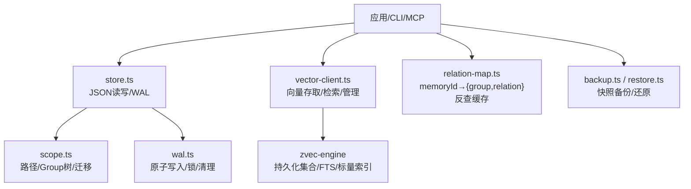
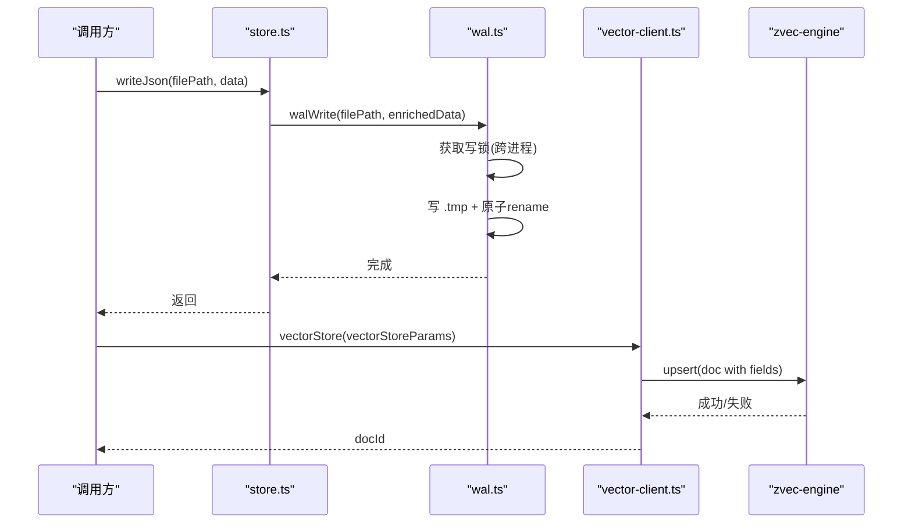
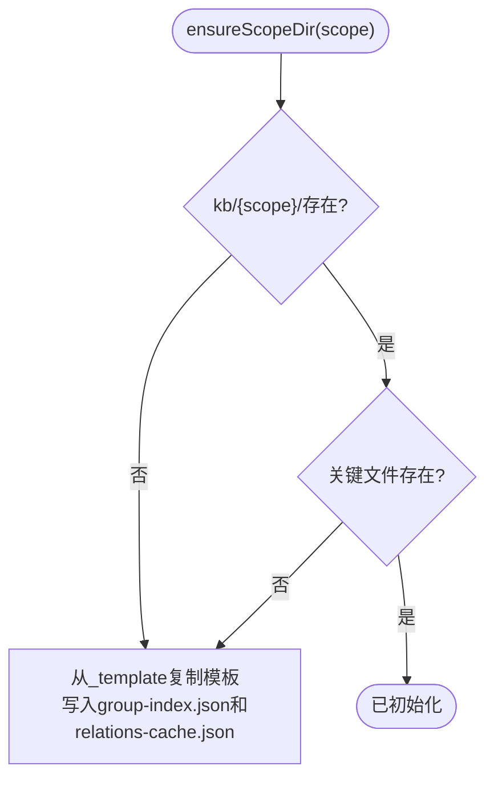
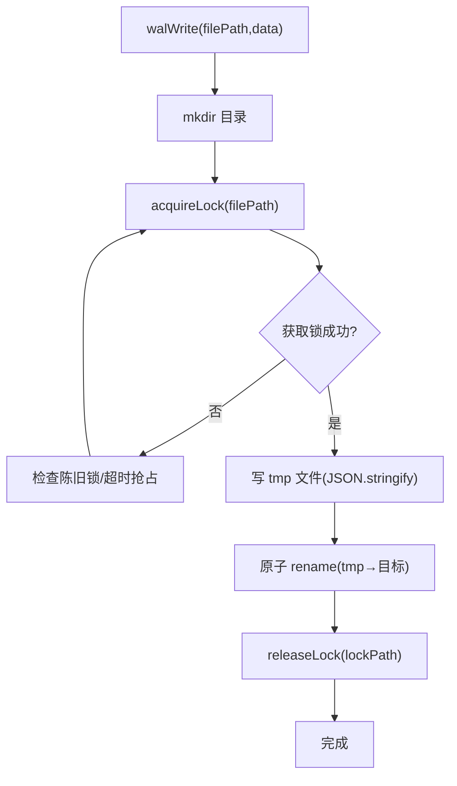
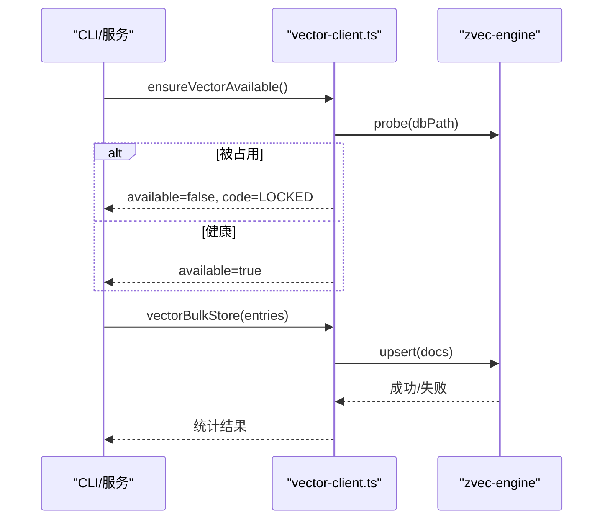
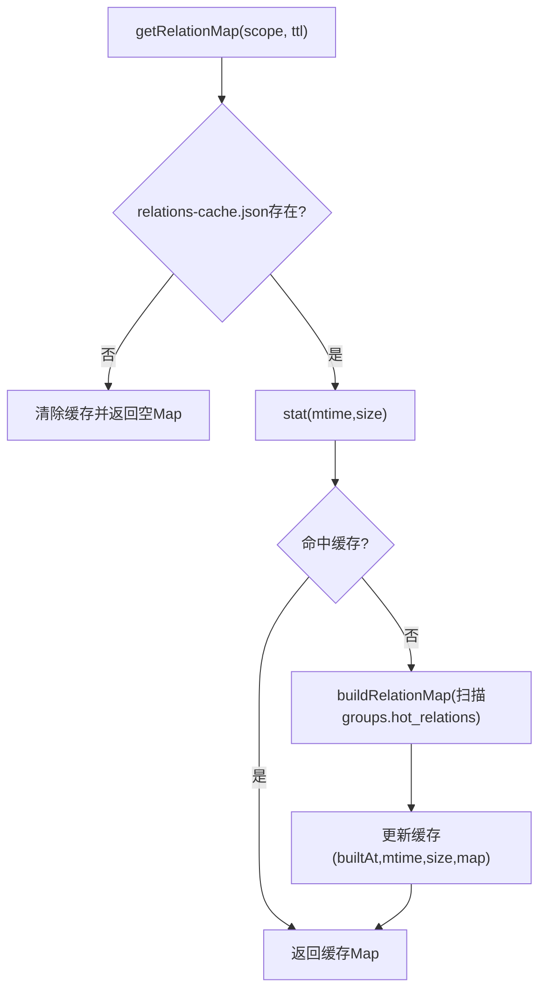
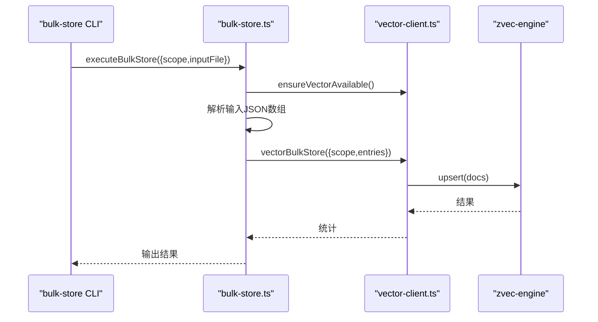
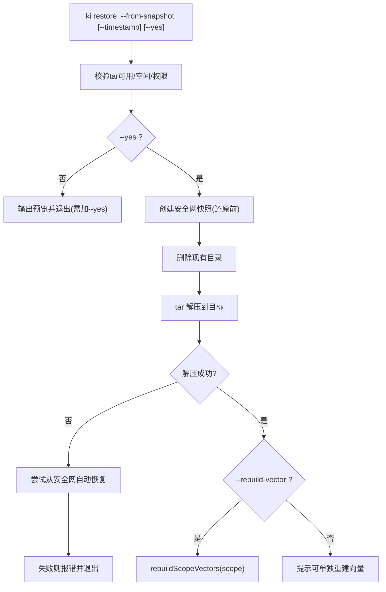
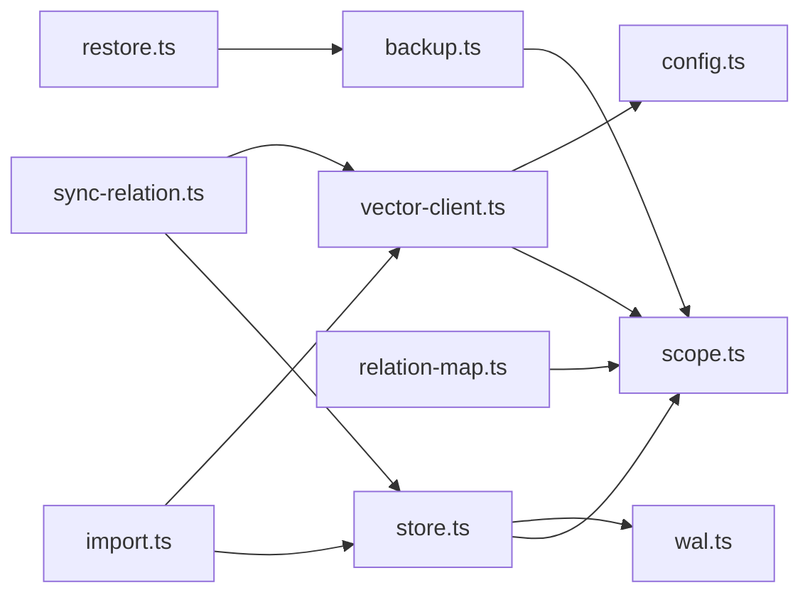

# 数据存储设计

<cite>
**本文引用的文件**
- [src/lib/store.ts](file://src/lib/store.ts)
- [src/lib/wal.ts](file://src/lib/wal.ts)
- [src/lib/scope.ts](file://src/lib/scope.ts)
- [src/lib/relation-map.ts](file://src/lib/relation-map.ts)
- [src/lib/vector-client.ts](file://src/lib/vector-client.ts)
- [src/bulk-store.ts](file://src/bulk-store.ts)
- [src/lib/backup.ts](file://src/lib/backup.ts)
- [src/restore.ts](file://src/restore.ts)
- [_template/group-index.json](file://_template/group-index.json)
- [_template/relations-cache.json](file://_template/relations-cache.json)
- [src/lib/import.ts](file://src/lib/import.ts)
- [src/sync-relation.ts](file://src/sync-relation.ts)
</cite>

## 目录
1. [简介](#简介)
2. [项目结构](#项目结构)
3. [核心组件](#核心组件)
4. [架构总览](#架构总览)
5. [详细组件分析](#详细组件分析)
6. [依赖关系分析](#依赖关系分析)
7. [性能考量](#性能考量)
8. [故障排查指南](#故障排查指南)
9. [结论](#结论)
10. [附录](#附录)

## 简介
本文件系统性说明知识库（KB）与向量存储的数据存储设计与实现，覆盖：
- 本地 KB 文件结构：Group 树文件、Relation 缓存文件的组织方式与迁移策略
- 向量数据库的持久化机制、并发控制与数据迁移
- WAL（预写日志）写入保证机制，确保 JSON 元数据一致性
- 关系映射缓存的设计与优化（TTL、mtime/size 失效）
- 批量操作优化与并发控制
- 备份、恢复与迁移完整指南
- 数据完整性验证与修复工具使用方法

## 项目结构
KB 与向量存储由“本地 JSON 元数据 + 向量引擎持久化”两部分组成：
- 本地 KB 层：group-index.json（Group 树）、relations-cache.json（关系热区与索引）、每个 Group 下的 index.json（本地 KB 片段）
- 向量层：基于 zvec-engine 的集合（collection），按 scope/tag 过滤隔离，内容字段支持 FTS，group 字段用于结果增强

图表来源
- [src/lib/store.ts:1-267](file://src/lib/store.ts#L1-L267)
- [src/lib/wal.ts:1-143](file://src/lib/wal.ts#L1-L143)
- [src/lib/scope.ts:1-230](file://src/lib/scope.ts#L1-L230)
- [src/lib/vector-client.ts:1-754](file://src/lib/vector-client.ts#L1-L754)
- [src/lib/relation-map.ts:1-120](file://src/lib/relation-map.ts#L1-L120)
- [src/lib/backup.ts:1-178](file://src/lib/backup.ts#L1-L178)
- [src/restore.ts:1-450](file://src/restore.ts#L1-L450)

章节来源
- [src/lib/store.ts:1-267](file://src/lib/store.ts#L1-L267)
- [src/lib/scope.ts:1-230](file://src/lib/scope.ts#L1-L230)

## 核心组件
- 本地 JSON 存储层：readJson/writeJson、ensureScopeDir/initScope、GroupIndex 读取与迁移
- WAL 写入：跨进程写锁、临时文件+原子 rename、陈旧锁抢占与残留清理
- Scope 与路径：kb/{scope}/ 布局、group-index.json、relations-cache.json、local KB 路径
- 向量客户端：engine 单例、撞锁重试、空闲释放锁、upsert/search/delete、批量接口
- 关系映射缓存：memoryId → {group, relation} 的反查 Map，带 TTL 与 mtime/size 失效
- 备份与恢复：tar.gz 快照、安全网快照、还原前确认与自动回滚
- 导入与同步：直导链路（向量化→建组→写关系→记录 source）、关系回写与淘汰

章节来源
- [src/lib/store.ts:1-267](file://src/lib/store.ts#L1-L267)
- [src/lib/wal.ts:1-143](file://src/lib/wal.ts#L1-L143)
- [src/lib/scope.ts:1-230](file://src/lib/scope.ts#L1-L230)
- [src/lib/vector-client.ts:1-754](file://src/lib/vector-client.ts#L1-L754)
- [src/lib/relation-map.ts:1-120](file://src/lib/relation-map.ts#L1-L120)
- [src/lib/backup.ts:1-178](file://src/lib/backup.ts#L1-L178)
- [src/restore.ts:1-450](file://src/restore.ts#L1-L450)
- [src/lib/import.ts:1-200](file://src/lib/import.ts#L1-L200)
- [src/sync-relation.ts:1-200](file://src/sync-relation.ts#L1-L200)

## 架构总览
系统采用“双轨存储”：
- 元数据与关系：本地 JSON（WAL 原子写入），强一致、可版本化、易迁移
- 语义检索：向量库（zvec-engine），持久化在磁盘，支持 FTS、标量索引、多 tag/scope 隔离

图表来源
- [src/lib/store.ts:51-62](file://src/lib/store.ts#L51-L62)
- [src/lib/wal.ts:78-112](file://src/lib/wal.ts#L78-L112)
- [src/lib/vector-client.ts:513-542](file://src/lib/vector-client.ts#L513-L542)

## 详细组件分析

### 本地 KB 文件结构与组织
- Group 树文件：group-index.json
  - 结构包含 version、scope、groups（树形）、updatedAt、source（可选，含 dir/chunkSize/chunkOverlap）
  - 读取时自动迁移旧格式 roots→groups；写入通过 writeJson 统一走 WAL
- Relation 缓存：relations-cache.json
  - 结构包含 version、scope、partition_config、groups（hot_relations 等）、updatedAt
  - 读取时自动迁移旧 key（如“项目根/”前缀）并合并 hot_relations
- 本地 KB：每个 Group 下 index.json（由 scope.getLocalKbDir 推导）
- 初始化：ensureScopeDir 检测 kb/{scope}/ 是否存在，不存在则从 _template 复制模板并填充 scope/updatedAt

图表来源
- [src/lib/store.ts:161-223](file://src/lib/store.ts#L161-L223)
- [src/lib/store.ts:225-267](file://src/lib/store.ts#L225-L267)
- [_template/group-index.json:1-7](file://_template/group-index.json#L1-L7)
- [_template/relations-cache.json:1-19](file://_template/relations-cache.json#L1-L19)

章节来源
- [src/lib/store.ts:161-267](file://src/lib/store.ts#L161-L267)
- [src/lib/scope.ts:45-77](file://src/lib/scope.ts#L45-L77)
- [_template/group-index.json:1-7](file://_template/group-index.json#L1-L7)
- [_template/relations-cache.json:1-19](file://_template/relations-cache.json#L1-L19)

### WAL（预写日志）写入保证机制
- 目标：避免并发写导致 JSON 损坏或 Last-Write-Wins 静默覆盖
- 机制：
  - 跨进程写锁：以 .lock 文件 O_CREAT|O_EXCL 创建，自旋等待；超过阈值视为陈旧锁可抢占
  - 原子写入：先写 .tmp，再 fs.renameSync 原子替换目标文件
  - 中断清理：cleanupTmpFiles 删除 .tmp 与陈旧 .lock
- 注意：同步阻塞语义，锁争用期间事件循环冻结；正常窗口毫秒级，极端高并发或崩溃锁可能秒级

图表来源
- [src/lib/wal.ts:31-71](file://src/lib/wal.ts#L31-L71)
- [src/lib/wal.ts:78-112](file://src/lib/wal.ts#L78-L112)
- [src/lib/wal.ts:114-143](file://src/lib/wal.ts#L114-L143)

章节来源
- [src/lib/wal.ts:1-143](file://src/lib/wal.ts#L1-L143)

### 向量数据库的持久化机制与数据迁移
- 持久化：zvec-engine 集合（collection）持久化到磁盘，dbPath 由配置决定；集合包含 dense 向量字段、FTS 字段 content、标量字段 tag/scope/group
- 并发与可用性：
  - 进程内 engine 单例，open/create/probe 串行化队列，避免原生竞态
  - 撞锁重试：probeWithRetry 检测到 locked 则等待并重试
  - 空闲释放锁：enableIdleClose 在常驻 MCP 场景下空闲超时关闭 engine，让其他实例错开使用
- 数据迁移：
  - doc id 生成规则变更（tag 参与后），存量向量需全量 re-import 或 rebuild-vector 迁移
  - 提供 vectorDeleteScope 与 vectorListDocs 等管理接口辅助迁移与清理

图表来源
- [src/lib/vector-client.ts:420-467](file://src/lib/vector-client.ts#L420-L467)
- [src/lib/vector-client.ts:547-590](file://src/lib/vector-client.ts#L547-L590)
- [src/lib/vector-client.ts:183-216](file://src/lib/vector-client.ts#L183-L216)
- [src/lib/vector-client.ts:129-181](file://src/lib/vector-client.ts#L129-L181)

章节来源
- [src/lib/vector-client.ts:1-754](file://src/lib/vector-client.ts#L1-L754)

### 关系映射缓存设计与优化
- 目的：search 命中向量结果后，按 memoryId 反查 relations-cache.json，附加 group 与 relation 信息
- 缓存策略：
  - 模块级单例 Map<scope, {builtAt, mtimeMs, size, map}>
  - 命中条件：mtime+size 未变且距构建时间未超 TTL（默认 10 分钟）
  - 失效条件：文件写入（mtime/size 变化）或 TTL 过期
  - 懒构建：首次访问 O(N)，后续 O(1)
  - 容错：文件缺失/损坏返回空 Map，不抛错
- 兼容：支持 memoryIds 数组与旧 memoryId 单值

图表来源
- [src/lib/relation-map.ts:42-78](file://src/lib/relation-map.ts#L42-L78)
- [src/lib/relation-map.ts:80-114](file://src/lib/relation-map.ts#L80-L114)

章节来源
- [src/lib/relation-map.ts:1-120](file://src/lib/relation-map.ts#L1-L120)

### 批量操作优化与并发控制
- 批量存储：vectorBulkStore 将 entries 转为 docs 并一次性 upsert，减少往返开销
- 并发控制：
  - 向量层：engine 操作串行化（serializeEngineOp），避免同进程并发 open/close 导致的原生竞态
  - 本地 JSON：walWrite 通过跨进程写锁串行化同一文件的写入
- 批处理入口：bulk-store CLI 提供批量导入文本到向量索引的能力

图表来源
- [src/bulk-store.ts:32-78](file://src/bulk-store.ts#L32-L78)
- [src/lib/vector-client.ts:547-590](file://src/lib/vector-client.ts#L547-L590)

章节来源
- [src/bulk-store.ts:1-110](file://src/bulk-store.ts#L1-L110)
- [src/lib/vector-client.ts:183-216](file://src/lib/vector-client.ts#L183-L216)

### 备份、恢复与迁移完整指南
- 备份：
  - backupScopeSnapshot：打包 kb/{scope}/ 为 tar.gz，落至 <backupDir>/<scope>/snapshots
  - autoBackup：import 成功后自动备份（失败仅警告，不阻断流程）
  - 防覆盖：同名时间戳追加序号，避免覆盖
- 恢复：
  - restoreFromSnapshot：列出/选择快照，展示将被覆盖的数据规模，要求显式 --yes
  - 安全网：还原前自动创建当前状态快照；若 tar 解压失败，尝试从安全网自动恢复
  - 向量重建：--rebuild-vector 可从已还原 KB 重建向量（内容/关系/路径）
- 迁移：
  - 向量 doc id 规则变更后，存量数据需全量 re-import 或执行 ki restore --rebuild-vector

图表来源
- [src/lib/backup.ts:87-117](file://src/lib/backup.ts#L87-L117)
- [src/lib/backup.ts:125-143](file://src/lib/backup.ts#L125-L143)
- [src/restore.ts:123-283](file://src/restore.ts#L123-L283)
- [src/restore.ts:384-416](file://src/restore.ts#L384-L416)

章节来源
- [src/lib/backup.ts:1-178](file://src/lib/backup.ts#L1-L178)
- [src/restore.ts:1-450](file://src/restore.ts#L1-L450)

### 数据完整性验证与修复工具
- 健康诊断：ki doctor 一键检查配置、目录可写性、apiKey/embedding 连通性、维度与 collection 状态
- 向量可用性：ensureVectorAvailable 返回 LOCKED/CORRUPTED/PROBE_ERROR，便于上层引导修复
- 清理残留：wal cleanupTmpFiles 清理 .tmp 与陈旧 .lock，避免中断残留影响

章节来源
- [src/doctor.ts:1-55](file://src/doctor.ts#L1-L55)
- [src/lib/vector-client.ts:420-467](file://src/lib/vector-client.ts#L420-L467)
- [src/lib/wal.ts:114-143](file://src/lib/wal.ts#L114-L143)

## 依赖关系分析
- store.ts 依赖 scope.ts（路径/Group树）、wal.ts（原子写入）、config.ts（配置）
- vector-client.ts 依赖 config.ts（向量目录/嵌入配置）、scope.ts（scope 校验）
- relation-map.ts 依赖 scope.ts（relations-cache 路径）
- import.ts 与 sync-relation.ts 组合使用 store.ts、scope.ts、vector-client.ts 完成导入与关系回写
- backup.ts 与 restore.ts 组合实现快照备份与还原

图表来源
- [src/lib/store.ts:1-267](file://src/lib/store.ts#L1-L267)
- [src/lib/vector-client.ts:1-754](file://src/lib/vector-client.ts#L1-L754)
- [src/lib/relation-map.ts:1-120](file://src/lib/relation-map.ts#L1-L120)
- [src/lib/import.ts:1-200](file://src/lib/import.ts#L1-L200)
- [src/sync-relation.ts:1-200](file://src/sync-relation.ts#L1-L200)
- [src/lib/backup.ts:1-178](file://src/lib/backup.ts#L1-L178)
- [src/restore.ts:1-450](file://src/restore.ts#L1-L450)

## 性能考量
- WAL 写入：原子 rename 保证一致性；跨进程写锁避免覆盖；建议在高并发场景下评估锁争用与超时参数
- 向量层：
  - 批量 upsert 减少网络与序列化开销
  - 进程内 engine 单例与串行化避免原生竞态
  - 空闲释放锁提升多实例共享向量库的吞吐
- 关系映射缓存：TTL + mtime/size 双重失效，降低频繁 IO；首次构建 O(N) 但后续 O(1)
- 导入链路：直导模式分阶段执行（向量化→建组→写关系→记录 source），支持增量幂等

[本节为通用指导，无需特定文件引用]

## 故障排查指南
- 向量库被占用：ensureVectorAvailable 返回 LOCKED，参考提示停止冲突进程或等待释放
- 向量库损坏：返回 CORRUPTED，建议执行 ki restore --from-snapshot 重建
- JSON 损坏：readJson 抛出 CORRUPT_JSON，建议从备份恢复或重新初始化 scope
- 中断残留：使用 wal.cleanupTmpFiles 清理 .tmp 与陈旧 .lock
- 还原失败：restore 会尝试从安全网自动恢复；若仍失败，按错误提示手动恢复

章节来源
- [src/lib/vector-client.ts:420-467](file://src/lib/vector-client.ts#L420-L467)
- [src/lib/store.ts:23-49](file://src/lib/store.ts#L23-L49)
- [src/lib/wal.ts:114-143](file://src/lib/wal.ts#L114-L143)
- [src/restore.ts:233-270](file://src/restore.ts#L233-L270)

## 结论
本系统通过 WAL 原子写入保障本地 JSON 元数据的一致性，结合向量库的持久化与并发控制，实现了高效、可靠的知识检索与关系管理。备份与恢复机制提供了数据安全网，关系映射缓存提升了查询性能。整体设计兼顾了可扩展性、可维护性与运维友好性。

[本节为总结，无需特定文件引用]

## 附录
- Group 树文件示例：_template/group-index.json
- Relation 缓存示例：_template/relations-cache.json
- 导入与同步：import.ts 直导链路、sync-relation.ts 关系回写与淘汰

章节来源
- [_template/group-index.json:1-7](file://_template/group-index.json#L1-L7)
- [_template/relations-cache.json:1-19](file://_template/relations-cache.json#L1-L19)
- [src/lib/import.ts:1-200](file://src/lib/import.ts#L1-L200)
- [src/sync-relation.ts:1-200](file://src/sync-relation.ts#L1-L200)