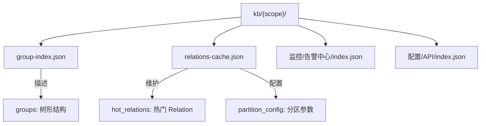
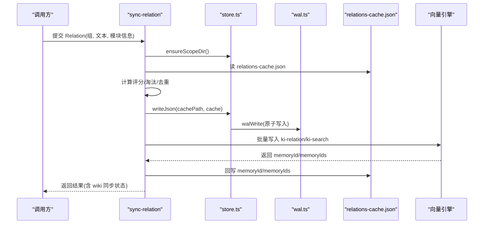
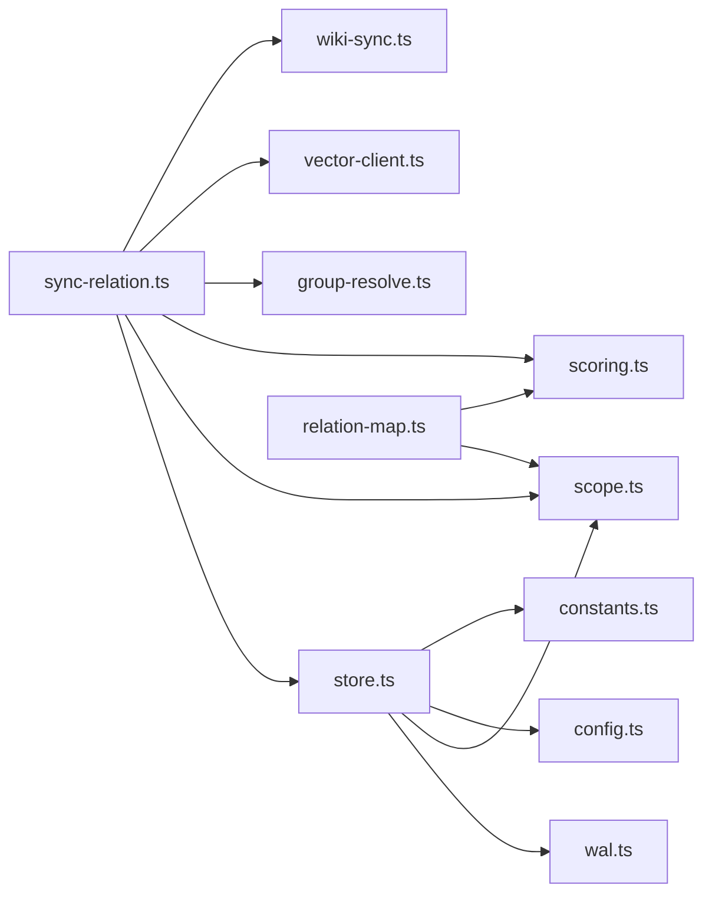

# 本地KB存储

<cite>
**本文引用的文件**
- [src/lib/store.ts](file://src/lib/store.ts)
- [src/lib/scope.ts](file://src/lib/scope.ts)
- [src/lib/wal.ts](file://src/lib/wal.ts)
- [src/lib/relation-map.ts](file://src/lib/relation-map.ts)
- [src/lib/group-resolve.ts](file://src/lib/group-resolve.ts)
- [src/lib/scoring.ts](file://src/lib/scoring.ts)
- [src/lib/constants.ts](file://src/lib/constants.ts)
- [src/sync-relation.ts](file://src/sync-relation.ts)
- [_template/group-index.json](file://_template/group-index.json)
- [_template/relations-cache.json](file://_template/relations-cache.json)
</cite>

## 目录
1. [简介](#简介)
2. [项目结构](#项目结构)
3. [核心组件](#核心组件)
4. [架构总览](#架构总览)
5. [详细组件分析](#详细组件分析)
6. [依赖关系分析](#依赖关系分析)
7. [性能与空间优化](#性能与空间优化)
8. [故障排查指南](#故障排查指南)
9. [结论](#结论)
10. [附录](#附录)

## 简介
本文件系统性说明本地知识库（KB）的存储设计与实现，覆盖：
- Group 树文件的组织结构、目录结构与命名规范、元数据格式
- Relation 文件的存储格式：文本内容、标签、向量 ID 与位置信息的持久化方式
- 缓存机制设计：relations-cache.json 的结构与 TTL 缓存策略
- 增量更新与同步机制：确保本地 KB 与向量索引的一致性
- 数据迁移与版本兼容性处理方案
- 存储性能优化与磁盘空间管理策略

## 项目结构
本地 KB 以 scope 为隔离单元，每个 scope 对应一个 kb/{scope} 目录。该目录下至少包含两个关键 JSON 文件：
- group-index.json：Group 树索引，描述知识分组的层级结构
- relations-cache.json：Relation 热区缓存，维护热门 Relation、评分、向量 ID 等

此外，每个 Group 路径下可存在 index.json，用于存放该 Group 下的“文档级”键值映射（relation → moduleInfo）。

图表来源
- [src/lib/scope.ts:49-77](file://src/lib/scope.ts#L49-L77)
- [_template/group-index.json:1-7](file://_template/group-index.json#L1-L7)
- [_template/relations-cache.json:1-19](file://_template/relations-cache.json#L1-L19)

章节来源
- [src/lib/scope.ts:49-77](file://src/lib/scope.ts#L49-L77)
- [_template/group-index.json:1-7](file://_template/group-index.json#L1-L7)
- [_template/relations-cache.json:1-19](file://_template/relations-cache.json#L1-L19)

## 核心组件
- JSON 存储层：提供 WAL 写入、版本检查、Scope 初始化与迁移
- Scope 路径与类型：校验 scope、构造路径、定义 GroupIndex 类型与迁移逻辑
- WAL 写入：跨进程写锁、原子写入、中断清理
- Relation 映射缓存：memoryId → {group, relation} 的反查 Map，带 TTL 与 mtime/size 失效
- Group 解析：路径自动补全、候选提示、向量兜底
- 评分与分区：Relation 评分、冷热分区、边界衰减
- 常量与模板：数据版本、默认分区配置、模板文件

章节来源
- [src/lib/store.ts:1-267](file://src/lib/store.ts#L1-L267)
- [src/lib/scope.ts:1-230](file://src/lib/scope.ts#L1-L230)
- [src/lib/wal.ts:1-143](file://src/lib/wal.ts#L1-L143)
- [src/lib/relation-map.ts:1-120](file://src/lib/relation-map.ts#L1-L120)
- [src/lib/group-resolve.ts:1-220](file://src/lib/group-resolve.ts#L1-L220)
- [src/lib/scoring.ts:1-275](file://src/lib/scoring.ts#L1-L275)
- [src/lib/constants.ts:1-98](file://src/lib/constants.ts#L1-L98)

## 架构总览
本地 KB 由“JSON 持久层 + 向量索引层”组成。写入链路通过 WAL 保证原子性；读取链路通过缓存降低 IO 成本；增量更新通过 memoryId/memoryIds 关联向量记录，确保一致性。

图表来源
- [src/sync-relation.ts:129-221](file://src/sync-relation.ts#L129-L221)
- [src/sync-relation.ts:407-787](file://src/sync-relation.ts#L407-L787)
- [src/lib/store.ts:55-62](file://src/lib/store.ts#L55-L62)
- [src/lib/wal.ts:92-112](file://src/lib/wal.ts#L92-L112)

## 详细组件分析

### Group 树与目录结构
- 目录组织：kb/{scope}/ 下放置 group-index.json、relations-cache.json；每个 Group 路径下可存在 index.json，key 为 relation 名称，value 为模块信息
- 文件命名：固定文件名 group-index.json、relations-cache.json；index.json 位于各 Group 子目录
- 元数据格式：
  - group-index.json：version、scope、groups（树）、updatedAt、source（可选）
  - relations-cache.json：version、scope、partition_config、groups（按 Group 分组 hot_relations）、updatedAt
  - index.json：键为 relation 文本，值为 moduleInfo

章节来源
- [src/lib/scope.ts:49-77](file://src/lib/scope.ts#L49-L77)
- [_template/group-index.json:1-7](file://_template/group-index.json#L1-L7)
- [_template/relations-cache.json:1-19](file://_template/relations-cache.json#L1-L19)

### Relation 存储格式与持久化
- Relation 对象字段：id、text、score、useCount、lastUsedTime、isImported、memoryId（旧兼容）、memoryIds（新多值）、sourcePath、tags（自定义标签）
- 持久化位置：
  - relations-cache.json 的 groups[group].hot_relations 数组中保存 Relation 列表
  - 对应 Group 的 index.json 中保存 relation → moduleInfo 的映射
- 向量关联：
  - 单值 memoryId：旧数据兼容
  - 多值 memoryIds：文件级 Relation 的全部 chunk 向量 ID 列表
  - 标签：ki-relation（路径向量）、ki-search（内容向量）、自定义 tags（如 api/auth）

章节来源
- [src/lib/scoring.ts:19-36](file://src/lib/scoring.ts#L19-L36)
- [src/sync-relation.ts:129-221](file://src/sync-relation.ts#L129-L221)
- [src/sync-relation.ts:407-787](file://src/sync-relation.ts#L407-L787)

### 缓存机制设计（relations-cache.json）
- 结构：
  - partition_config：控制冷热分区比例、新兴保留数、阈值等
  - groups：按 Group 维度组织 hot_relations
  - hot_relations：Relation 列表，按 score 降序
- 内存缓存：
  - relation-map.ts 维护 memoryId → {group, relation} 的反查 Map
  - 缓存失效策略：mtime/size 变化立即失效；TTL 过期兜底；文件缺失降级为空 Map
- 构建与访问：
  - 首次访问时 O(N) 构建 Map，后续 O(1) 查找
  - 支持测试注入 TTL 验证过期行为

章节来源
- [_template/relations-cache.json:1-19](file://_template/relations-cache.json#L1-L19)
- [src/lib/relation-map.ts:1-120](file://src/lib/relation-map.ts#L1-L120)

### 增量更新与同步机制
- 写入流程：
  - 单条模式：syncSingleRelation 更新 cache 与 index.json，并可选写入向量层
  - 批量模式：executeBulkSyncRelation 收集 entries，一次批量向量化，拆分结果回写 memoryId/memoryIds，最后统一落盘
- 一致性保障：
  - 先写后删：仅当本次内容向量全部成功才清理旧 tag 向量，避免删旧丢新
  - 失败不阻塞：向量写入失败仅标记 reason，不影响 KB 层写入
  - 去重：同批内相同 group+relation 的后一条覆盖前一条，避免孤儿向量
- Wiki 写回：独立于向量写入，容错处理

章节来源
- [src/sync-relation.ts:407-787](file://src/sync-relation.ts#L407-L787)

### 数据迁移与版本兼容性
- 版本检查：readJson 读取时检查 version，高于当前版本给出警告
- Group 树迁移：migrateGroupIndex 将旧 roots 结构迁移到 groups
- Relations-cache key 迁移：自动去掉“项目根/”前缀，合并冲突项
- 模板初始化：ensureScopeDir/initScope 从 _template 复制初始文件并设置 scope/updatedAt

章节来源
- [src/lib/store.ts:23-62](file://src/lib/store.ts#L23-L62)
- [src/lib/store.ts:73-159](file://src/lib/store.ts#L73-L159)
- [src/lib/store.ts:168-267](file://src/lib/store.ts#L168-L267)
- [src/lib/scope.ts:117-146](file://src/lib/scope.ts#L117-L146)

### 评分与分区算法
- 评分：基于 useCount 与 lastUsedTime 的半衰期衰减
- 使用防刷：5 分钟间隔内重复使用不计入
- 分区：hybridPartition 结合新兴识别、评分排序、上限截断，输出 hot/warm/cold
- 边界衰减：新内容进入热区时触发边界分数调整，保持平滑过渡

章节来源
- [src/lib/scoring.ts:44-79](file://src/lib/scoring.ts#L44-L79)
- [src/lib/scoring.ts:90-117](file://src/lib/scoring.ts#L90-L117)
- [src/lib/scoring.ts:136-209](file://src/lib/scoring.ts#L136-L209)
- [src/lib/scoring.ts:222-274](file://src/lib/scoring.ts#L222-L274)

## 依赖关系分析
- store.ts 依赖：
  - wal.ts：原子写入
  - scope.ts：路径构造、类型定义、迁移
  - config.ts：配置加载、scope 模式
  - constants.ts：数据版本、模板目录
- sync-relation.ts 依赖：
  - store.ts：读写 JSON
  - scope.ts：路径工具
  - scoring.ts：评分、分区
  - group-resolve.ts：路径补全
  - vector-client.ts：向量写入
  - wiki-sync.js：Wiki 写回
- relation-map.ts 依赖：
  - scope.ts：relations-cache 路径
  - scoring.ts：Relation 类型

图表来源
- [src/lib/store.ts:10-15](file://src/lib/store.ts#L10-L15)
- [src/sync-relation.ts:16-35](file://src/sync-relation.ts#L16-L35)
- [src/lib/relation-map.ts:19-21](file://src/lib/relation-map.ts#L19-L21)

章节来源
- [src/lib/store.ts:10-15](file://src/lib/store.ts#L10-L15)
- [src/sync-relation.ts:16-35](file://src/sync-relation.ts#L16-L35)
- [src/lib/relation-map.ts:19-21](file://src/lib/relation-map.ts#L19-L21)

## 性能与空间优化
- 原子写入与并发保护：WAL 使用跨进程写锁，避免 Last-Write-Wins 覆盖；临时文件 + 原子 rename 保证中断安全
- 缓存命中：relation-map 基于 mtime/size/TTL 的三级失效，减少频繁 IO
- 批量向量化：一次 HTTP embedding + 一次 worker upsert，降低网络与序列化开销
- 分区限制：maxHotCount/maxWarmCount 控制热点大小，避免无限增长
- 磁盘空间管理：
  - 定期清理 .tmp/.lock 残留
  - 合理设置分区上限，避免 relations-cache.json 过大
  - 向量层删除 stale 向量，防止孤儿数据累积

章节来源
- [src/lib/wal.ts:92-143](file://src/lib/wal.ts#L92-L143)
- [src/lib/relation-map.ts:30-78](file://src/lib/relation-map.ts#L30-L78)
- [src/sync-relation.ts:607-745](file://src/sync-relation.ts#L607-L745)
- [src/lib/scoring.ts:147-209](file://src/lib/scoring.ts#L147-L209)

## 故障排查指南
- JSON 损坏：readJson 抛出 CORRUPT_JSON，建议从备份恢复或重新初始化
- 锁争用：walWrite 获取写锁超时（10s），陈旧锁（30s）可抢占；若频繁争用需检查并发写入逻辑
- 缓存不一致：relation-map 基于 mtime/size 失效，若文件被外部修改导致不一致，重启进程或等待 TTL 过期
- 向量写入失败：sync-relation 返回 vectorReason，可通过 rebuild-vector 恢复
- Wiki 写回失败：writeBackToWiki 容错，不影响主流程，可重试

章节来源
- [src/lib/store.ts:23-49](file://src/lib/store.ts#L23-L49)
- [src/lib/wal.ts:37-71](file://src/lib/wal.ts#L37-L71)
- [src/lib/relation-map.ts:80-114](file://src/lib/relation-map.ts#L80-L114)
- [src/sync-relation.ts:607-745](file://src/sync-relation.ts#L607-L745)

## 结论
本地 KB 存储采用“JSON 持久层 + 向量索引层”的双层架构，通过 WAL 保证原子写入，通过缓存提升读取性能，通过 memoryId/memoryIds 关联向量记录确保一致性。Group 树与 Relation 缓存结构清晰，支持增量更新、数据迁移与版本兼容。性能方面通过批量向量化、分区限制与空间清理策略优化吞吐与磁盘占用。

## 附录
- 模板文件：_template/group-index.json、_template/relations-cache.json 作为新 scope 的初始模板
- 常量配置：DEFAULT_PARTITION_CONFIG 控制分区策略，CURRENT_DATA_VERSION 管理数据版本
- 路径解析：group-resolve 提供智能补全与向量兜底，提升用户体验

章节来源
- [_template/group-index.json:1-7](file://_template/group-index.json#L1-L7)
- [_template/relations-cache.json:1-19](file://_template/relations-cache.json#L1-L19)
- [src/lib/constants.ts:38-50](file://src/lib/constants.ts#L38-L50)
- [src/lib/group-resolve.ts:117-219](file://src/lib/group-resolve.ts#L117-L219)