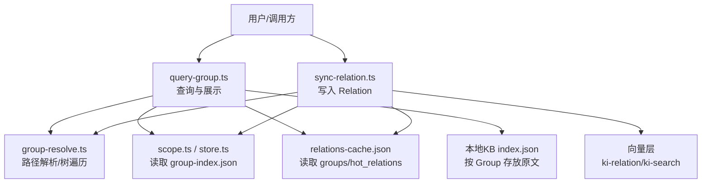
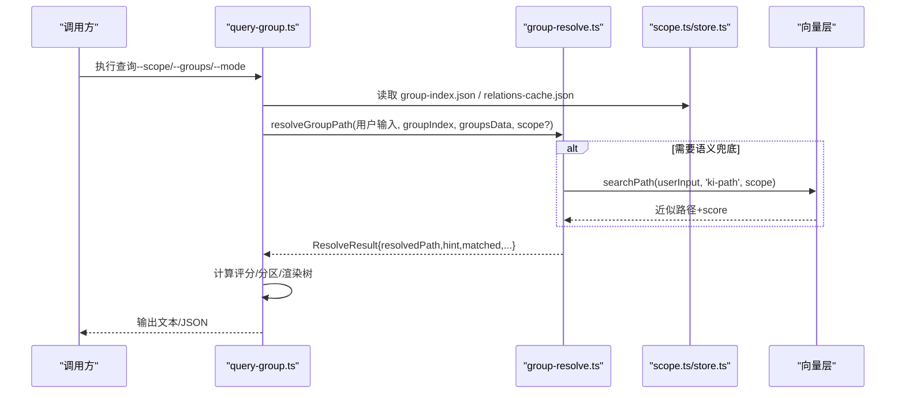
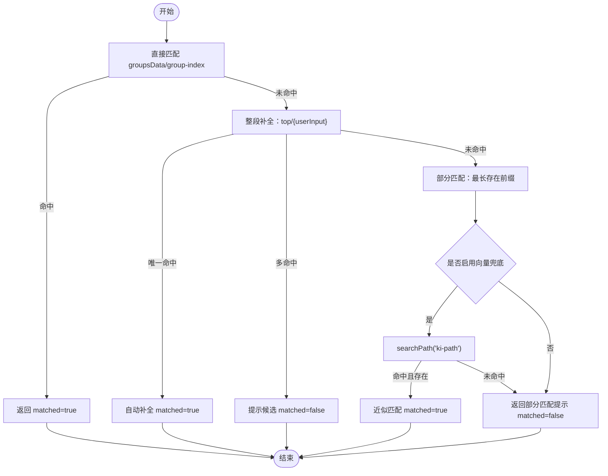
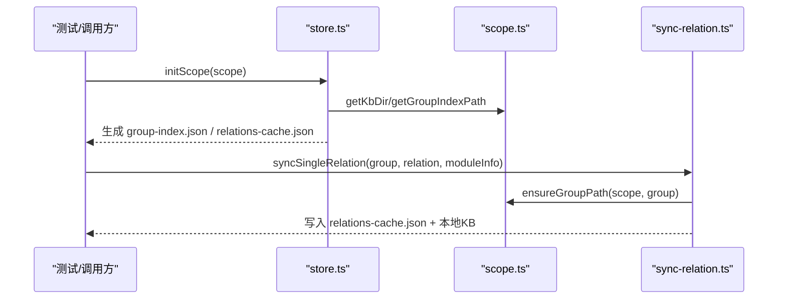
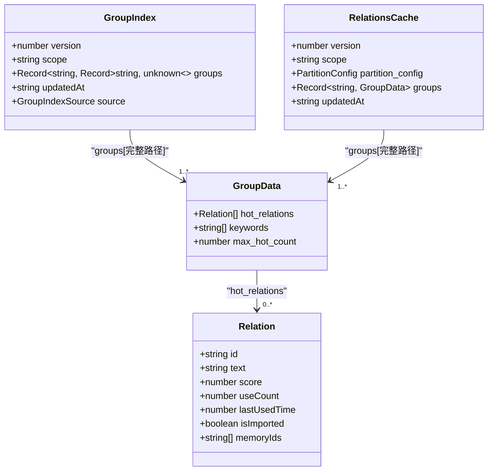
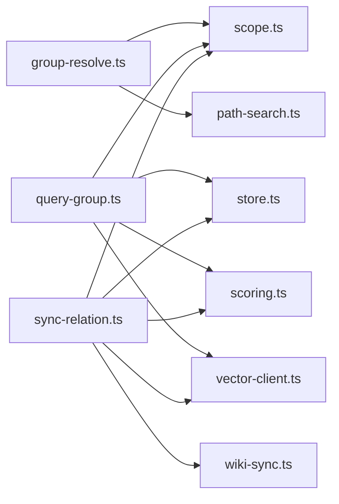

# Group树结构

<cite>
**本文引用的文件**
- [src/lib/group-resolve.ts](file://src/lib/group-resolve.ts)
- [src/query-group.ts](file://src/query-group.ts)
- [src/sync-relation.ts](file://src/sync-relation.ts)
- [src/lib/scope.ts](file://src/lib/scope.ts)
- [src/lib/store.ts](file://src/lib/store.ts)
- [test/query-group.test.ts](file://test/query-group.test.ts)
</cite>

## 目录
1. [简介](#简介)
2. [项目结构](#项目结构)
3. [核心组件](#核心组件)
4. [架构总览](#架构总览)
5. [详细组件分析](#详细组件分析)
6. [依赖关系分析](#依赖关系分析)
7. [性能考量](#性能考量)
8. [故障排查指南](#故障排查指南)
9. [结论](#结论)
10. [附录：最佳实践与示例](#附录最佳实践与示例)

## 简介
Group（层次化知识分组路径）是 knowledge-indexer 中用于组织、导航和检索知识的“树形索引”。它通过 group-index.json 维护一棵 Group 树，并通过 relations-cache.json 将每个 Group 下的“Relation”（知识条目）与其使用热度、时间等指标关联起来。借助 Group 树，系统可以：
- 以层级方式浏览知识库，快速定位到某个主题或模块；
- 对 Group 路径进行智能补全与语义兜底，提升查询体验；
- 基于 Relation 的使用情况计算冷热分区，展示热门/常温/冷/新兴热区；
- 在写入 Relation 时自动构建缺失的 Group 节点，保证树结构的完整性；
- 与向量检索结合，提供“精确路径 + 语义近似”的双通道检索能力。

## 项目结构
围绕 Group 的核心代码分布在以下文件中：
- 路径解析与树遍历：src/lib/group-resolve.ts
- Group 树与 Scope 管理：src/lib/scope.ts、src/lib/store.ts
- 查询与展示：src/query-group.ts
- 写入与同步：src/sync-relation.ts
- 测试用例：test/query-group.test.ts

图表来源
- [src/query-group.ts:611-746](file://src/query-group.ts#L611-L746)
- [src/sync-relation.ts:129-221](file://src/sync-relation.ts#L129-L221)
- [src/lib/group-resolve.ts:117-219](file://src/lib/group-resolve.ts#L117-L219)
- [src/lib/scope.ts:58-112](file://src/lib/scope.ts#L58-L112)
- [src/lib/store.ts:73-92](file://src/lib/store.ts#L73-L92)

章节来源
- [src/query-group.ts:611-746](file://src/query-group.ts#L611-L746)
- [src/sync-relation.ts:129-221](file://src/sync-relation.ts#L129-L221)
- [src/lib/group-resolve.ts:117-219](file://src/lib/group-resolve.ts#L117-L219)
- [src/lib/scope.ts:58-112](file://src/lib/scope.ts#L58-L112)
- [src/lib/store.ts:73-92](file://src/lib/store.ts#L73-L92)

## 核心组件
- GroupIndex（Group 树）：定义于 src/lib/scope.ts，包含 version、scope、groups（嵌套对象表示树）、updatedAt、source。
- RelationsCache（Group 数据缓存）：包含 groups（键为完整 Group 路径），每个 Group 下有 hot_relations、keywords、max_hot_count 等。
- 路径解析器：src/lib/group-resolve.ts 提供 pathExistsInTree、findLongestExistingPrefix、getDirectChildren、resolveGroupPath 等工具。
- 查询与展示：src/query-group.ts 负责聚合评分、分区、渲染树与输出结果。
- 写入与同步：src/sync-relation.ts 负责创建/更新 Relation、自动补建 Group 节点、写回 KB 与向量层。

章节来源
- [src/lib/scope.ts:106-112](file://src/lib/scope.ts#L106-L112)
- [src/query-group.ts:31-43](file://src/query-group.ts#L31-L43)
- [src/lib/group-resolve.ts:12-25](file://src/lib/group-resolve.ts#L12-L25)
- [src/sync-relation.ts:43-55](file://src/sync-relation.ts#L43-L55)

## 架构总览
Group 系统的整体流程如下：
- 写入侧：sync-relation.ts 接收 relation + module_info，确保 Group 路径存在（必要时自动补建），写入 relations-cache.json 与本地 KB，并在向量化模式下批量写入向量层。
- 查询侧：query-group.ts 读取 group-index.json 与 relations-cache.json，计算各 Group 的聚合分数并分区（hot/warm/cold/emerging），渲染树与热门列表，支持指定 Group 查看详情。
- 路径解析：group-resolve.ts 提供四层匹配策略（直接匹配、整段补全、部分匹配、向量兜底），返回 resolvedPath 与提示 hint。

图表来源
- [src/query-group.ts:611-746](file://src/query-group.ts#L611-L746)
- [src/lib/group-resolve.ts:117-219](file://src/lib/group-resolve.ts#L117-L219)
- [src/lib/scope.ts:58-112](file://src/lib/scope.ts#L58-L112)
- [src/lib/store.ts:73-92](file://src/lib/store.ts#L73-L92)

## 详细组件分析

### Group 树结构与组织原则
- 数据结构：GroupIndex.groups 是一个嵌套对象，每一层 key 代表一个 Group 名称，子对象代表其子 Group。例如：
  - "项目根/监控/告警中心" 对应 groups["项目根"]["监控"]["告警中心"] = {}
- 命名规范：
  - 使用中文或英文均可，但应避免包含 "/"、"\\"、".." 等破坏路径的字符（见 sync-relation.ts 中的 isUnsafeRelationName 校验逻辑）。
  - 顶层 Group 建议按领域或子系统划分（如“监控”“部署”“API”），子 Group 细化到模块或功能点。
- 自动补建：写入 Relation 时，若 Group 路径不存在，会自动创建缺失节点，保证树结构完整（见 ensureGroupPath）。

章节来源
- [src/lib/scope.ts:106-112](file://src/lib/scope.ts#L106-L112)
- [src/sync-relation.ts:103-125](file://src/sync-relation.ts#L103-L125)
- [src/sync-relation.ts:287-296](file://src/sync-relation.ts#L287-L296)

### Group 路径解析算法（四层查找 + 向量兜底）
- 直接匹配：先在 groupsData 中精确匹配，再在 group-index 树中检查路径是否存在。
- 整段补全：在每个顶层 Group 下拼接前缀后尝试匹配；唯一命中则自动补全，多命中则提示候选列表。
- 部分匹配：找到最长存在前缀，给出子节点提示，但不立即返回。
- 向量兜底：当 scope 提供时，通过 searchPath(userInput, 'ki-path', scope) 获取近似路径，并校验其真实存在于 group-index 或 groupsData 中。
- 无匹配：提示可用顶层 Group 或当前 scope 下暂无 Group。

图表来源
- [src/lib/group-resolve.ts:117-219](file://src/lib/group-resolve.ts#L117-L219)

章节来源
- [src/lib/group-resolve.ts:117-219](file://src/lib/group-resolve.ts#L117-L219)

### Group 树的构建过程
- 初始化：ensureScopeDir 会确保 kb/{scope}/ 存在，并从 _template 复制 group-index.json 与 relations-cache.json。
- 迁移：readGroupIndex 读取时检测旧格式（roots → groups）并自动迁移，同时迁移 relations-cache.json 中以“项目根/”开头的旧 key。
- 自动补建：sync-relation.ts 在写入 Relation 时调用 ensureGroupPath，自动创建缺失的 Group 节点并持久化 group-index.json。

图表来源
- [src/lib/store.ts:168-267](file://src/lib/store.ts#L168-L267)
- [src/lib/scope.ts:58-112](file://src/lib/scope.ts#L58-L112)
- [src/sync-relation.ts:103-125](file://src/sync-relation.ts#L103-L125)

章节来源
- [src/lib/store.ts:168-267](file://src/lib/store.ts#L168-L267)
- [src/lib/scope.ts:58-112](file://src/lib/scope.ts#L58-L112)
- [src/sync-relation.ts:103-125](file://src/sync-relation.ts#L103-L125)

### Group 的 CRUD 操作
- 创建（Create）：
  - 通过 sync-relation.ts 写入 Relation 时自动补建 Group 节点（ensureGroupPath）。
  - 也可通过 manage-index 命令（外部文档提及）对 Group 树进行增删改查。
- 查询（Read）：
  - query-group.ts 支持按 Group 查询 Relations，支持 hot/warm/cold/emerging/full 模式，以及完整树展示。
  - 路径解析由 group-resolve.ts 提供，支持自动补全与语义兜底。
- 更新（Update）：
  - 重复写入同一 relation 会更新 useCount、lastUsedTime 与 score，并按 score 降序排列。
  - 批量写入时会对同批重复 (group, relation) 去重，后一条覆盖前一条。
- 删除（Delete）：
  - delete-relation.ts 从 relations-cache.json 删除对应 Relation，不删除 group-index.json 的 Group 节点（因为 Group 可能还包含其他 Relation）。

图表来源
- [src/lib/scope.ts:106-112](file://src/lib/scope.ts#L106-L112)
- [src/query-group.ts:31-43](file://src/query-group.ts#L31-L43)
- [src/sync-relation.ts:43-55](file://src/sync-relation.ts#L43-L55)

章节来源
- [src/sync-relation.ts:129-221](file://src/sync-relation.ts#L129-L221)
- [src/query-group.ts:611-746](file://src/query-group.ts#L611-L746)
- [src/lib/scope.ts:106-112](file://src/lib/scope.ts#L106-L112)

### Group 与 Relation 的关系映射
- 映射键：relations-cache.json 的 groups 字段以“完整 Group 路径”为键（如 "项目根/监控/告警中心"），值为 GroupData。
- 快速定位：通过 Group 路径可直接定位到该组下的 hot_relations 列表，进而查看每条 Relation 的文本、分数、使用时间等。
- 向量关联：Relation 可携带 memoryId/memoryIds，指向向量层中的 ki-search 内容向量与 ki-relation 路径向量，便于后续语义检索与清理。

章节来源
- [src/query-group.ts:31-43](file://src/query-group.ts#L31-L43)
- [src/sync-relation.ts:534-547](file://src/sync-relation.ts#L534-L547)
- [src/sync-relation.ts:657-695](file://src/sync-relation.ts#L657-L695)

### 评分与分区机制
- 评分：calculateScore 基于 useCount 与 lastUsedTime 计算单条 Relation 的分数；Group 聚合分数为组内所有 Relation 分数之和。
- 分区：partitionByScore 将 Group 或 Relation 分为 hot/warm/cold，并结合 recentHours 识别 emerging（新兴热区）。
- 展示：query-group.ts 根据 mode 参数输出不同分区的内容，full 模式可递归展示子 Group 的 Relations。

章节来源
- [src/query-group.ts:79-147](file://src/query-group.ts#L79-L147)
- [src/query-group.ts:168-193](file://src/query-group.ts#L168-L193)
- [src/query-group.ts:415-480](file://src/query-group.ts#L415-L480)

## 依赖关系分析
- group-resolve.ts 依赖 scope.ts（GroupIndex 类型）与 path-search.ts（向量近似匹配）。
- query-group.ts 依赖 store.ts（读写 JSON）、scope.ts（路径构造）、scoring.ts（评分）、vector-client.ts（向量搜索）。
- sync-relation.ts 依赖 store.ts、scope.ts、scoring.ts、vector-client.ts、wiki-sync.ts。

图表来源
- [src/lib/group-resolve.ts:7-8](file://src/lib/group-resolve.ts#L7-L8)
- [src/query-group.ts:14-27](file://src/query-group.ts#L14-L27)
- [src/sync-relation.ts:16-35](file://src/sync-relation.ts#L16-L35)

章节来源
- [src/lib/group-resolve.ts:7-8](file://src/lib/group-resolve.ts#L7-L8)
- [src/query-group.ts:14-27](file://src/query-group.ts#L14-L27)
- [src/sync-relation.ts:16-35](file://src/sync-relation.ts#L16-L35)

## 性能考量
- 批量写入优化：executeBulkSyncRelation 将多条 Relation 的 embedding HTTP 与 worker upsert 合并为一次批量调用，减少网络往返与锁竞争。
- 向量清理聚合：对 stale docId 的删除聚合为一次 vectorDelete，避免多次串行删除稀释性能。
- 去重与容错：同批重复 (group, relation) 去重，避免孤儿向量；向量服务不可用或部分失败时，标记原因但不阻塞 KB 层。
- 树遍历与渲染：renderTree/renderCompactTree 支持深度限制与过滤集合，避免输出过长。

章节来源
- [src/sync-relation.ts:394-406](file://src/sync-relation.ts#L394-L406)
- [src/sync-relation.ts:607-745](file://src/sync-relation.ts#L607-L745)
- [src/query-group.ts:235-390](file://src/query-group.ts#L235-L390)

## 故障排查指南
- Group 路径未匹配：
  - 检查 resolveGroupPath 的 hint 信息，确认是否为多候选歧义或未匹配。
  - 若启用向量兜底，确认 scope 与向量服务可用。
- 写入失败：
  - 检查 group-index.json 与 relations-cache.json 是否存在且可读。
  - 检查 relation 名称是否包含非法字符（"/"、"\\"、".."）。
- 向量写入失败：
  - 查看 vectorStored 与 vectorReason，确认是否为服务不可用或部分失败。
  - 使用 rebuild-vector 重建向量层。

章节来源
- [src/lib/group-resolve.ts:117-219](file://src/lib/group-resolve.ts#L117-L219)
- [src/sync-relation.ts:287-296](file://src/sync-relation.ts#L287-L296)
- [src/sync-relation.ts:607-745](file://src/sync-relation.ts#L607-L745)

## 结论
Group 树结构是 knowledge-indexer 的知识组织核心，通过稳定的树形索引与灵活的 Relation 缓存，实现了结构化导航与语义检索的结合。路径解析的四层策略确保了高鲁棒性，而批量写入与向量聚合优化提升了整体性能。遵循合理的分组策略与命名约定，可以有效维护一个清晰、可扩展的知识体系。

## 附录：最佳实践与示例

### 分组策略与命名约定
- 顶层 Group 按领域或子系统划分（如“监控”“部署”“API”），子 Group 细化到模块或功能点。
- 避免在 Group 名称中使用 "/"、"\\"、".." 等破坏路径的字符。
- 保持层级扁平化与一致性，避免过深嵌套导致导航困难。

章节来源
- [src/sync-relation.ts:287-296](file://src/sync-relation.ts#L287-L296)

### 实际使用示例
- 构建 Group 树：在测试中通过 initScope 初始化 scope，然后手动设置 groups 树结构（见 test/query-group.test.ts）。
- 写入 Relation：使用 sync-relation.ts 的 executeBulkSyncRelation 批量写入，自动补建 Group 节点并写回 KB 与向量层。
- 查询 Group：使用 query-group.ts 的 executeQueryGroup，支持 --mode hot/warm/cold/emerging/full，以及 --groups 指定 Group 查看详情。

章节来源
- [test/query-group.test.ts:40-118](file://test/query-group.test.ts#L40-L118)
- [src/sync-relation.ts:407-787](file://src/sync-relation.ts#L407-L787)
- [src/query-group.ts:611-746](file://src/query-group.ts#L611-L746)