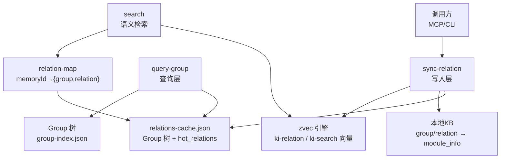
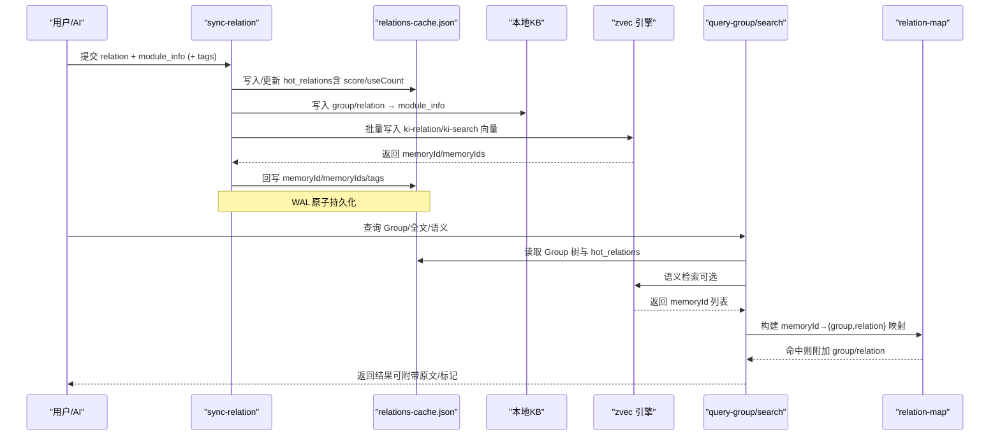
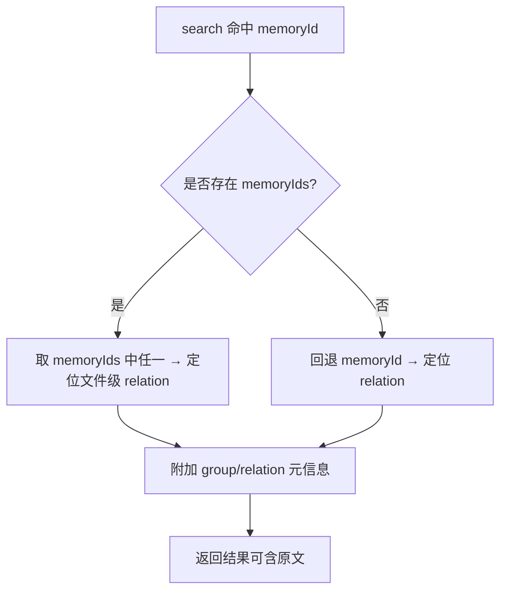
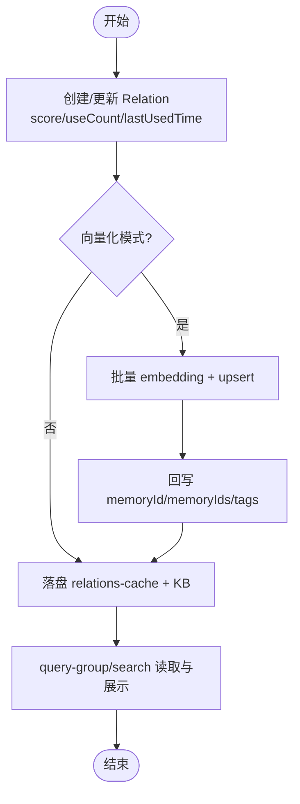
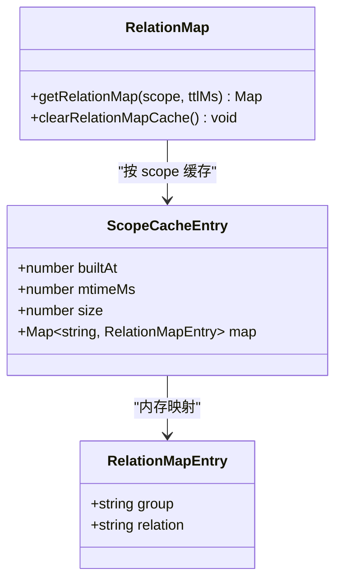
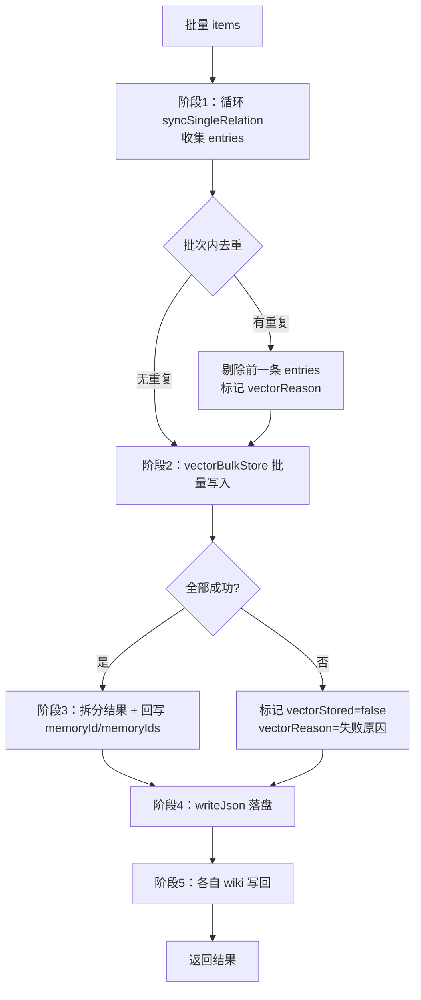
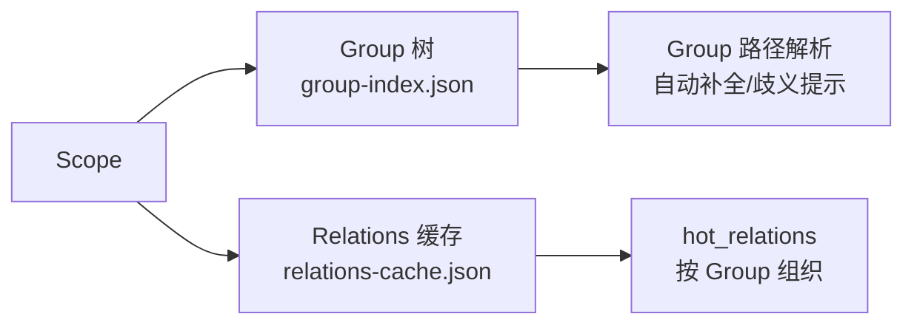
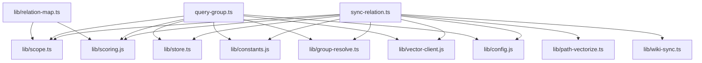

# Relation关系管理

<cite>
**本文引用的文件**
- [src/sync-relation.ts](file://src/sync-relation.ts)
- [src/lib/relation-map.ts](file://src/lib/relation-map.ts)
- [src/query-group.ts](file://src/query-group.ts)
- [src/lib/store.ts](file://src/lib/store.ts)
- [src/lib/scope.ts](file://src/lib/scope.ts)
- [src/lib/scoring.js](file://src/lib/scoring.js)
- [src/lib/constants.js](file://src/lib/constants.js)
- [src/lib/group-resolve.ts](file://src/lib/group-resolve.ts)
- [src/lib/vector-client.js](file://src/lib/vector-client.js)
- [src/lib/path-vectorize.ts](file://src/lib/path-vectorize.ts)
- [src/lib/wiki-sync.ts](file://src/lib/wiki-sync.ts)
- [docs/architecture.md](file://docs/architecture.md)
- [test/manage-index.test.ts](file://test/manage-index.test.ts)
- [test/query-group.test.ts](file://test/query-group.test.ts)
- [test/sync-relation.test.ts](file://test/sync-relation.test.ts)
</cite>

## 目录
1. [简介](#简介)
2. [项目结构](#项目结构)
3. [核心组件](#核心组件)
4. [架构总览](#架构总览)
5. [详细组件分析](#详细组件分析)
6. [依赖关系分析](#依赖关系分析)
7. [性能与优化](#性能与优化)
8. [故障排查指南](#故障排查指南)
9. [结论](#结论)
10. [附录：API与使用示例](#附录api与使用示例)

## 简介
本文件系统性说明 knowledge-indexer 的 Relation（可检索的知识条目）管理系统，覆盖数据模型、字段含义、与原文文件的关联机制（memoryId/memoryIds）、生命周期（创建/索引/查询）、存储结构与缓存机制（relations-cache.json 与 memoryId 反查映射）、批量操作与优化策略、Relation 与 Group/Scope 的关系，以及面向用户的 API 接口与高效处理大量 Relation 的实践建议。

## 项目结构
Relation 管理涉及“写入层”“索引层”“查询层”“向量层”“存储与配置”五类职责：
- 写入层：负责接收 AI 或导入流程产生的 relation + 模块信息，落盘 relations-cache.json 与本地 KB，并可选向量化。
- 索引层：维护 Group 树、热门 Relation 列表、评分与分区；提供 Group 解析与路径补全。
- 查询层：读取 Group 树与 Relations 缓存，按热度/时间/标签等维度展示与筛选。
- 向量层：将 relation 路径向量与内容向量写入 zvec 引擎，并通过 memoryId/memoryIds 建立“向量片段 ↔ 文件级 relation”的反查能力。
- 存储与配置：WAL 安全写 JSON、scope 初始化与迁移、模板文件、常量配置。

图表来源
- [src/sync-relation.ts:129-221](file://src/sync-relation.ts#L129-L221)
- [src/query-group.ts:611-745](file://src/query-group.ts#L611-L745)
- [src/lib/relation-map.ts:48-114](file://src/lib/relation-map.ts#L48-L114)
- [docs/architecture.md:83-137](file://docs/architecture.md#L83-L137)

章节来源
- [src/sync-relation.ts:1-800](file://src/sync-relation.ts#L1-L800)
- [src/query-group.ts:1-784](file://src/query-group.ts#L1-L784)
- [src/lib/relation-map.ts:1-120](file://src/lib/relation-map.ts#L1-L120)
- [docs/architecture.md:83-137](file://docs/architecture.md#L83-L137)

## 核心组件
- Relation 数据模型与评分：定义在 scoring 类型中，包含 id、text、score、useCount、lastUsedTime、isImported、memoryId/memoryIds、sourcePath、tags 等字段；通过 calculateScore 与 partitionByScore 实现热度评估与分区。
- 写入与同步：syncSingleRelation 负责单条写入（更新/淘汰/排序），executeBulkSyncRelation 负责批量写入（去重、批量向量化、回写 memoryId/memoryIds、wiki 写回）。
- 反向索引：relation-map 构建 memoryId → {group, relation} 的 Map，带 TTL 与 mtime/size 失效策略，供 search 命中后附加 group/relation 元信息。
- 查询与展示：query-group 读取 Group 树与 relations-cache，计算聚合分数、分区、输出热/常温/冷/新兴热区与完整树。
- 存储与迁移：store 提供 WAL 写 JSON、readGroupIndex 自动迁移旧格式、initScope 从模板初始化 scope。
- 向量集成：vector-client 提供 vectorBulkStore/vectorDelete/ensureVectorAvailable；path-vectorize 生成 relation 路径向量内容；wiki-sync 负责 wiki 写回。

章节来源
- [src/lib/scoring.js](file://src/lib/scoring.js)
- [src/sync-relation.ts:129-800](file://src/sync-relation.ts#L129-L800)
- [src/lib/relation-map.ts:1-120](file://src/lib/relation-map.ts#L1-L120)
- [src/query-group.ts:1-784](file://src/query-group.ts#L1-L784)
- [src/lib/store.ts:1-267](file://src/lib/store.ts#L1-L267)
- [src/lib/vector-client.js](file://src/lib/vector-client.js)
- [src/lib/path-vectorize.ts](file://src/lib/path-vectorize.ts)
- [src/lib/wiki-sync.ts](file://src/lib/wiki-sync.ts)

## 架构总览
Relation 的生命周期分为三个阶段：创建与写入、索引与向量化、查询与反查。

图表来源
- [src/sync-relation.ts:407-787](file://src/sync-relation.ts#L407-L787)
- [src/lib/relation-map.ts:48-114](file://src/lib/relation-map.ts#L48-L114)
- [src/query-group.ts:611-745](file://src/query-group.ts#L611-L745)
- [docs/architecture.md:109-137](file://docs/architecture.md#L109-L137)

## 详细组件分析

### Relation 数据模型与字段含义
- id：自增编号（rel_XXX），用于唯一标识。
- text：Relation 名称（通常对应文件名去扩展名或传入的 relation 文本）。
- score：基于 useCount、lastUsedTime、halfLifeHours 计算的动态热度分。
- useCount：被记录使用的次数（重复同步会触发防刷计数）。
- lastUsedTime：最近一次使用时间（毫秒时间戳）。
- isImported：是否来自导入流程（scan-kb import）。
- memoryId：当前主内容向量的 ID（兼容旧数据单值）。
- memoryIds：文件级 relation 对应的全部 chunk 向量 ID 列表（方案 D 多值）。
- sourcePath：相对 source.dir 的 posix 路径，用于幂等判定（同路径覆盖、不同同名跳过）。
- tags：文档级自定义标签（逗号分隔），叠加到 ki-search 之上，分别产生内容向量。

章节来源
- [src/sync-relation.ts:171-202](file://src/sync-relation.ts#L171-L202)
- [src/sync-relation.ts:657-695](file://src/sync-relation.ts#L657-L695)
- [docs/architecture.md:83-100](file://docs/architecture.md#L83-L100)
- [src/lib/relation-map.ts:80-114](file://src/lib/relation-map.ts#L80-L114)

### Relation 与原文文件的关联机制（memoryId/memoryIds）
- 文件级 relation：import 流程为每个 Markdown 文件生成一个 relation，并将该文件全部 chunk 的 memoryIds 挂在该 relation 上。
- 查询时：search 命中任一 memoryId，即可反查到同一文件级 relation，从而返回文件原文（开启 --original/include_original 时）。
- 兼容性：旧数据中的单值 memoryId 仍被支持；新数据优先使用 memoryIds 多值。
- 反向映射：relation-map 以 TTL + mtime/size 策略构建 memoryId → {group, relation} 的 Map，避免每次重建。

图表来源
- [src/lib/relation-map.ts:80-114](file://src/lib/relation-map.ts#L80-L114)
- [docs/architecture.md:83-100](file://docs/architecture.md#L83-L100)

章节来源
- [src/lib/relation-map.ts:1-120](file://src/lib/relation-map.ts#L1-L120)
- [docs/architecture.md:83-100](file://docs/architecture.md#L83-L100)

### Relation 生命周期：创建 → 索引 → 查询
- 创建：
  - 单条：syncSingleRelation 确保 Group 路径存在、查找或新建 Relation、计算 score、必要时淘汰最低分项、写入本地 KB。
  - 批量：executeBulkSyncRelation 循环执行上述逻辑，收集 entries，进行批次内去重，再统一向量化与回写。
- 索引：
  - 路径向量：ki-relation 路径向量用于快速召回相关 Group/relation。
  - 内容向量：ki-search 与自定义 tags 的内容向量用于语义检索；成功后回写 memoryId/memoryIds。
  - 清理旧向量：当新 tag 向量成功写入时，删除旧的 tag 向量，避免孤儿向量。
- 查询：
  - query-group 读取 Group 树与 relations-cache，计算聚合分数与分区，输出热/常温/冷/新兴热区与完整树。
  - search 通过 zvec 引擎进行语义检索，结合 relation-map 附加 group/relation。

图表来源
- [src/sync-relation.ts:129-221](file://src/sync-relation.ts#L129-L221)
- [src/sync-relation.ts:407-787](file://src/sync-relation.ts#L407-L787)
- [src/query-group.ts:611-745](file://src/query-group.ts#L611-L745)

章节来源
- [src/sync-relation.ts:129-800](file://src/sync-relation.ts#L129-L800)
- [src/query-group.ts:611-745](file://src/query-group.ts#L611-L745)

### 存储结构与缓存机制（relations-cache 与 memoryId 反查）
- relations-cache.json：
  - 顶层 version、scope、partition_config、groups、updatedAt。
  - groups 下每个 Group 包含 hot_relations、keywords、max_hot_count。
  - WAL 写入保证原子性，readJson/writeJson 自动注入 version 与 updatedAt。
- memoryId 反查缓存：
  - 模块级单例 Map<scope, {builtAt, mtimeMs, size, map}>。
  - 命中条件：mtime+size 未变且 TTL 未过期；否则懒构建 O(N)。
  - 文件缺失/损坏：返回空 Map，调用方降级。

图表来源
- [src/lib/relation-map.ts:23-40](file://src/lib/relation-map.ts#L23-L40)
- [src/lib/relation-map.ts:48-78](file://src/lib/relation-map.ts#L48-L78)

章节来源
- [src/lib/store.ts:55-62](file://src/lib/store.ts#L55-L62)
- [src/lib/store.ts:229-267](file://src/lib/store.ts#L229-L267)
- [src/lib/relation-map.ts:1-120](file://src/lib/relation-map.ts#L1-L120)

### 批量操作与优化策略
- 批次内去重：同 (group, relation) 出现多次时，后一条覆盖前一条，避免孤儿向量与误删。
- 批量向量化：一次 embedding HTTP + 一次 worker upsert，显著降低网络与锁竞争开销。
- 旧向量清理：仅在新 tag 向量全部成功时删除旧 tag 向量，部分失败保留旧向量，避免“删旧丢新”。
- 非向量化模式：vector=false 时仅写 KB 层，不产生 memoryId/memoryIds。
- Wiki 写回：容错处理，不影响主流程。

图表来源
- [src/sync-relation.ts:407-787](file://src/sync-relation.ts#L407-L787)

章节来源
- [src/sync-relation.ts:407-787](file://src/sync-relation.ts#L407-L787)

### Relation 与 Group、Scope 的关联关系
- Scope：隔离不同知识库实例，所有文件与缓存按 scope 组织。
- Group：Group 树由 group-index.json 描述，relations-cache 中 groups 键即 Group 路径；写入时自动补建缺失节点。
- 路径解析：resolveGroupPath 支持自动补全、歧义提示与部分匹配；query-group 支持 full 模式递归展示子 Group。
- 迁移：readGroupIndex 自动迁移旧格式 roots → groups，并迁移 relations-cache 中以“项目根/”开头的旧 key。

图表来源
- [src/lib/store.ts:73-92](file://src/lib/store.ts#L73-L92)
- [src/lib/store.ts:101-159](file://src/lib/store.ts#L101-L159)
- [src/query-group.ts:640-704](file://src/query-group.ts#L640-L704)

章节来源
- [src/lib/store.ts:73-159](file://src/lib/store.ts#L73-L159)
- [src/query-group.ts:640-704](file://src/query-group.ts#L640-L704)
- [test/manage-index.test.ts:309-395](file://test/manage-index.test.ts#L309-L395)

## 依赖关系分析
- sync-relation 依赖：
  - store：readJson/writeJson、readGroupIndex、ensureScopeDir、initScope。
  - scope：getRelationsCachePath、getLocalKbDir、getGroupIndexPath、validateScope。
  - scoring：calculateScore、recordUse。
  - constants：DEFAULT_PARTITION_CONFIG、parseContentTags。
  - group-resolve：resolveGroupPath。
  - path-vectorize：buildRelationContent。
  - vector-client：vectorBulkStore、vectorDelete、generateDocId、ensureVectorAvailable、closeEngine。
  - wiki-sync：writeBackToWiki、isUnsafeRelationName。
  - config：loadConfig、resolveScope。
- query-group 依赖：
  - store：readGroupIndex、ensureScopeDir。
  - scope：getGroupIndexPath、getRelationsCachePath、validateScope。
  - scoring：calculateScore、partitionByScore。
  - constants：DEFAULT_PARTITION_CONFIG。
  - config：loadConfig、resolveScope。
  - group-resolve：resolveGroupPath。
  - vector-client：vectorSearch、ensureVectorAvailable、closeEngine。
- relation-map 依赖：
  - scope：getRelationsCachePath。
  - scoring：Relation 类型。

图表来源
- [src/sync-relation.ts:16-35](file://src/sync-relation.ts#L16-L35)
- [src/query-group.ts:13-27](file://src/query-group.ts#L13-L27)
- [src/lib/relation-map.ts:19-21](file://src/lib/relation-map.ts#L19-L21)

章节来源
- [src/sync-relation.ts:16-35](file://src/sync-relation.ts#L16-L35)
- [src/query-group.ts:13-27](file://src/query-group.ts#L13-L27)
- [src/lib/relation-map.ts:19-21](file://src/lib/relation-map.ts#L19-L21)

## 性能与优化
- 批量向量化：一次 embedding + 一次 upsert，减少网络往返与锁竞争。
- 内存映射缓存：relation-map 使用 TTL + mtime/size 失效，首次构建 O(N)，后续 O(1)。
- 旧向量清理：仅在全部成功时删除旧 tag 向量，避免“删旧丢新”导致的退化。
- 分组与分区：query-group 对 Group 与 Relation 进行分区（热/常温/冷/新兴热），控制输出规模。
- WAL 写入：writeJson 使用 WAL 保障原子性，避免半写导致的数据不一致。
- 大集合优化建议：
  - 合理设置 maxHotCount 与 recent/halfLife 参数，控制 hot_relations 规模。
  - 使用批量接口 executeBulkSyncRelation 替代多次单条调用。
  - 利用 tags 细分内容向量，提高语义检索精度。
  - 定期重建 relation-map 缓存（TTL 到期或文件变更）以避免陈旧映射。

[本节为通用指导，不直接分析具体文件]

## 故障排查指南
- relations-cache.json 损坏：readJson 抛出 CORRUPT_JSON 错误，建议从备份恢复或重新初始化 scope。
- 向量服务不可用：ensureVectorAvailable 返回不可用，批量写入会标记 vectorStored=false 并记录 reason，但不阻塞 KB 层。
- 旧 key 冲突：readGroupIndex 会自动迁移 relations-cache 中以“项目根/”开头的旧 key，并与新 key 合并去重。
- 非法 relation 名称：包含 "/"、"\\" 或 ".." 的名称会被跳过并计入 failed，防止破坏 wiki 文件路径。
- 空 module_info：批量模式下空内容会被跳过并计入 failed。

章节来源
- [src/lib/store.ts:23-49](file://src/lib/store.ts#L23-L49)
- [src/sync-relation.ts:274-325](file://src/sync-relation.ts#L274-L325)
- [src/sync-relation.ts:454-508](file://src/sync-relation.ts#L454-L508)
- [test/manage-index.test.ts:309-395](file://test/manage-index.test.ts#L309-L395)

## 结论
Relation 管理系统通过“写入层 + 索引层 + 查询层 + 向量层 + 存储与配置”的分层设计，实现了高可用、可扩展的知识条目管理。其核心优势包括：
- 明确的数据模型与评分机制，支持热度演化与分区展示。
- 文件级 relation 与向量片段的强关联（memoryId/memoryIds），提升原文召回能力。
- 批量向量化与内存映射缓存，显著提升大规模场景下的吞吐与延迟。
- 完善的迁移与容错机制，保障历史数据兼容与系统稳定性。

[本节为总结，不直接分析具体文件]

## 附录：API与使用示例

### 写入接口（sync-relation）
- 单条写入：
  - 输入：scope、group、relation、module_info、可选 tags/vector。
  - 行为：写入 relations-cache.json 与本地 KB，可选向量化并回写 memoryId/memoryIds。
  - 输出：relation、evicted、wikiSynced/wikiFile/wikiReason、vectorStored/vectorReason。
- 批量写入：
  - 输入：items 数组（每项含 group、relation、module_info、可选 tags）。
  - 行为：批次内去重、批量向量化、回写 memoryId/memoryIds、wiki 写回。
  - 输出：total/succeeded/failed/skipped/results、vectorStored、hints。

章节来源
- [src/sync-relation.ts:343-392](file://src/sync-relation.ts#L343-L392)
- [src/sync-relation.ts:407-787](file://src/sync-relation.ts#L407-L787)

### 查询接口（query-group）
- 输入：scope、groups（逗号分隔）、hotCount、depth、mode（hot|warm|cold|emerging|full）。
- 行为：读取 Group 树与 relations-cache，计算分区与统计，输出格式化文本。
- 输出：ok、scope、output。

章节来源
- [src/query-group.ts:598-610](file://src/query-group.ts#L598-L610)
- [src/query-group.ts:611-745](file://src/query-group.ts#L611-L745)

### 使用示例（概念性）
- 单条写入：
  - 调用 sync-relation，传入 scope、group、relation、module_info，观察 evicted 与 wikiSynced。
- 批量写入：
  - 准备 items 数组，调用 executeBulkSyncRelation，检查 vectorStored 与 hints。
- 查询展示：
  - 调用 query-group，选择 mode 与 depth，查看热/常温/冷/新兴热区与完整树。

[本节为概念性示例，不直接引用代码片段]