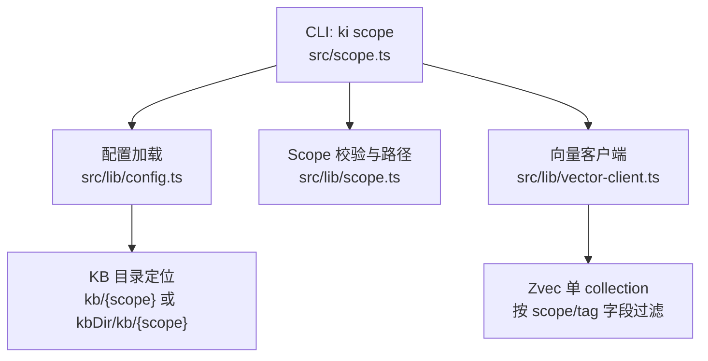
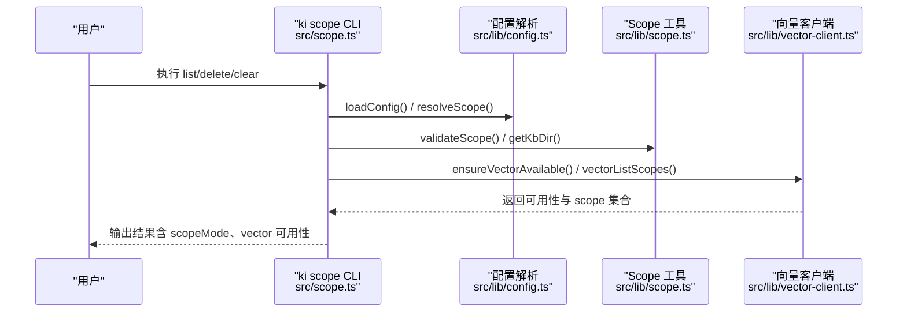
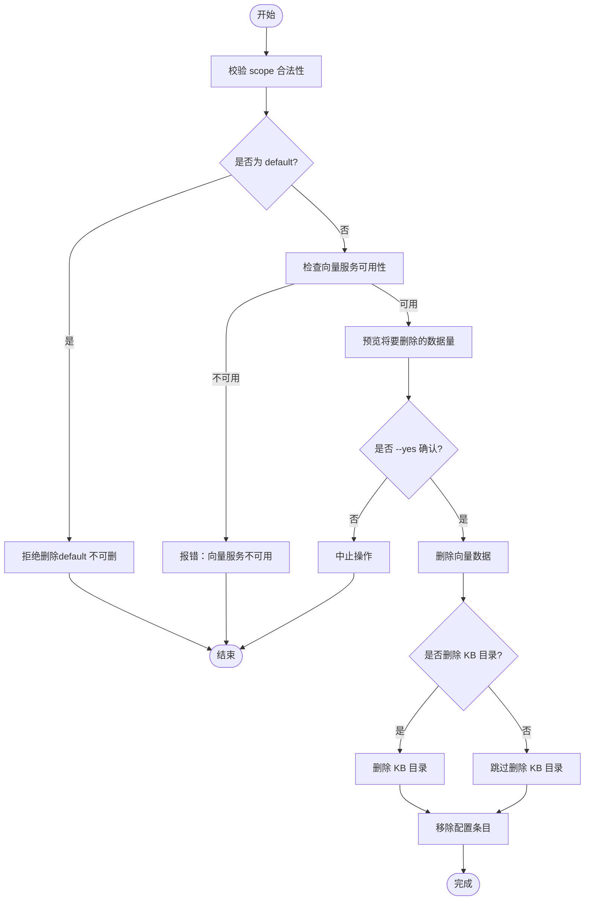
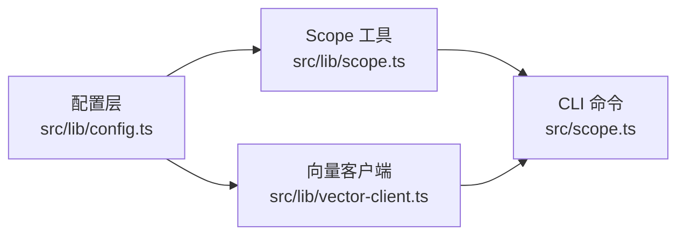

# Scope隔离机制

<cite>
**本文引用的文件**
- [src/scope.ts](file://src/scope.ts)
- [src/lib/scope.ts](file://src/lib/scope.ts)
- [src/lib/config.ts](file://src/lib/config.ts)
- [src/lib/vector-client.ts](file://src/lib/vector-client.ts)
- [test/scope-isolation.test.ts](file://test/scope-isolation.test.ts)
- [test/scope-mode.test.ts](file://test/scope-mode.test.ts)
- [test/fixtures/mock-wiki/核心概念/Scope 隔离机制.md](file://test/fixtures/mock-wiki/核心概念/Scope 隔离机制.md)
</cite>

## 目录
1. [简介](#简介)
2. [项目结构](#项目结构)
3. [核心组件](#核心组件)
4. [架构总览](#架构总览)
5. [详细组件分析](#详细组件分析)
6. [依赖关系分析](#依赖关系分析)
7. [性能考量](#性能考量)
8. [故障排查指南](#故障排查指南)
9. [结论](#结论)
10. [附录：操作手册与最佳实践](#附录操作手册与最佳实践)

## 简介
本文件系统性解释 knowledge-indexer（ki）中的 Scope（项目隔离标识）机制。内容涵盖：
- Scope 的设计目的、命名规范与生命周期管理
- 在 KB 目录层与向量语义层的数据隔离实现（路径映射、向量数据库隔离策略）
- default scope 的特殊性与不可删除保护
- Scope 的三种模式：default、strict 的区别与使用场景
- Scope 管理的完整操作指南（list、delete、clear）
- 实际项目中如何配置和使用多个 Scope 进行项目隔离

## 项目结构
围绕 Scope 的核心代码分布在以下模块：
- 配置与解析：src/lib/config.ts（scopeMode、scopes、resolveScope、getScopeDataDir）
- Scope 校验与路径构造：src/lib/scope.ts（validateScope、getKbDir、listAllScopes）
- 向量客户端：src/lib/vector-client.ts（单 collection + scope/tag 字段过滤）
- CLI 命令：src/scope.ts（list/delete/clear）
- 测试用例：test/scope-isolation.test.ts、test/scope-mode.test.ts、test/fixtures/mock-wiki/.../Scope 隔离机制.md

图表来源
- [src/scope.ts:232-292](file://src/scope.ts#L232-L292)
- [src/lib/config.ts:382-459](file://src/lib/config.ts#L382-L459)
- [src/lib/scope.ts:30-77](file://src/lib/scope.ts#L30-L77)
- [src/lib/vector-client.ts:120-127](file://src/lib/vector-client.ts#L120-L127)

章节来源
- [src/scope.ts:1-303](file://src/scope.ts#L1-L303)
- [src/lib/config.ts:1-509](file://src/lib/config.ts#L1-L509)
- [src/lib/scope.ts:1-230](file://src/lib/scope.ts#L1-L230)
- [src/lib/vector-client.ts:1-200](file://src/lib/vector-client.ts#L1-L200)

## 核心组件
- 配置与模式控制
  - scopeMode：'default' | 'strict'，控制是否强制注册白名单
  - scopes：每个 scope 可配置 kbDir、wikiSync、clean、import 等
  - resolveScope：根据 mode 决定默认值与校验策略
- Scope 校验与路径
  - validateScope：仅允许字母、数字、连字符、下划线
  - getKbDir：优先使用 scope.kbDir/kb/{scope}，否则 dataDir/{scope}
- 向量隔离
  - 单一 collection（config.vectorDir），通过标量字段 scope 与 tag 进行隔离
  - doc id = sha256(text + scope) 截 32，保证跨 scope 幂等
- CLI 管理
  - list：合并 KB 目录、向量库、配置中所有 scope，标注存在层与文档数
  - delete：删除向量数据 + 删除 KB 目录 + 移除配置条目（default 不可删）
  - clear：清空向量数据（可按 tag 过滤），可选清空 KB 目录内容（保留目录）

章节来源
- [src/lib/config.ts:119-128](file://src/lib/config.ts#L119-L128)
- [src/lib/config.ts:444-459](file://src/lib/config.ts#L444-L459)
- [src/lib/scope.ts:30-77](file://src/lib/scope.ts#L30-L77)
- [src/lib/vector-client.ts:120-127](file://src/lib/vector-client.ts#L120-L127)
- [src/scope.ts:56-132](file://src/scope.ts#L56-L132)

## 架构总览
Scope 在两层实现数据隔离：
- KB 目录层：每个 scope 拥有独立目录，存放 group-index.json、relations-cache.json 及分组索引
- 向量语义层：共享单一 collection，通过 scope 与 tag 标量字段过滤实现逻辑隔离

图表来源
- [src/scope.ts:94-132](file://src/scope.ts#L94-L132)
- [src/lib/config.ts:148-175](file://src/lib/config.ts#L148-L175)
- [src/lib/scope.ts:30-77](file://src/lib/scope.ts#L30-L77)
- [src/lib/vector-client.ts:120-127](file://src/lib/vector-client.ts#L120-L127)

## 详细组件分析

### 设计目的与命名规范
- 设计目的
  - 多项目/多租户隔离：不同 scope 之间互不干扰，避免串读/串写/串删
  - 统一入口：CLI 与 API 通过 scope 参数选择数据域
  - 安全护栏：严格模式下必须显式传入已注册 scope，防止误用
- 命名规范
  - 仅允许字母、数字、连字符(-)、下划线(_)
  - 禁止路径遍历字符，防止越权访问文件系统
  - 非法字符会抛出结构化错误并提示具体非法字符

章节来源
- [src/lib/scope.ts:11-43](file://src/lib/scope.ts#L11-L43)
- [test/scope-isolation.test.ts:47-55](file://test/scope-isolation.test.ts#L47-L55)

### 生命周期管理
- 创建：首次写入时自动创建 KB 目录；strict 模式下需先注册到 config.scopes
- 使用：所有读写均经 resolveScope 与 getKbDir 定位数据位置
- 清理：
  - delete：删除向量数据 + 删除 KB 目录 + 移除配置条目（default 不可删）
  - clear：仅清向量数据（支持按 tag 过滤），可选清空 KB 目录内容（保留目录）
- 销毁：删除后若再写入，将重新初始化该 scope 的目录与缓存

章节来源
- [src/scope.ts:145-179](file://src/scope.ts#L145-L179)
- [src/scope.ts:192-221](file://src/scope.ts#L192-L221)
- [src/lib/config.ts:476-508](file://src/lib/config.ts#L476-L508)

### KB 目录层隔离
- 路径映射规则
  - 优先使用 scope.kbDir/kb/{scope}，否则 dataDir/{scope}
  - 每个 scope 目录下包含 group-index.json、relations-cache.json 等索引文件
- 隔离验证
  - 相同 Group/Relation 在不同 scope 下独立存储，跨 scope 不串读/串写/串删
  - 删除一个 scope 的节点不影响其他 scope

章节来源
- [src/lib/config.ts:382-386](file://src/lib/config.ts#L382-L386)
- [src/lib/scope.ts:49-77](file://src/lib/scope.ts#L49-L77)
- [test/scope-isolation.test.ts:50-127](file://test/scope-isolation.test.ts#L50-L127)

### 向量语义层隔离
- 隔离策略
  - 单一 collection（config.vectorDir），通过标量字段 scope 与 tag 进行过滤
  - doc id = sha256(text + scope) 截 32，确保跨 scope 幂等 upsert
  - tag 为 STRING 字段，写入时统一转小写，查询忽略大小写
- 列表与统计
  - vectorListScopes 返回当前向量层存在的 scope 集合
  - vectorCountScope 统计某 scope 下的文档数量（可按 tag 过滤）

章节来源
- [src/lib/vector-client.ts:120-127](file://src/lib/vector-client.ts#L120-L127)
- [src/scope.ts:94-132](file://src/scope.ts#L94-L132)

### default scope 的特殊性
- 默认行为
  - 未传 --scope 时静默落 default（任意 scope 自动创建）
  - default 是内置兜底，便于快速开始与兼容旧行为
- 保护机制
  - default 不可删除，任何删除请求直接拒绝
  - 即使 strict 模式，default 仍作为兜底存在（但 strict 要求显式传入已注册 scope）

章节来源
- [src/scope.ts:145-150](file://src/scope.ts#L145-L150)
- [src/lib/config.ts:101-110](file://src/lib/config.ts#L101-L110)

### Scope 模式：default 与 strict
- default 模式
  - 未传 scope 时自动使用 'default'
  - 允许任意 scope 名称，自动创建 KB 目录与向量数据
  - 适合开发、实验、临时项目
- strict 模式
  - 必须显式传入非空 scope，且必须在 config.scopes 白名单内
  - 未注册 scope 直接报错，不会自动创建目录
  - 适合生产环境，强制治理与审计
- 模式切换
  - 修改配置文件中的 scopeMode 即可生效
  - 已有数据不受影响，仅改变后续操作的准入策略

章节来源
- [src/lib/config.ts:288-290](file://src/lib/config.ts#L288-L290)
- [src/lib/config.ts:444-459](file://src/lib/config.ts#L444-L459)
- [test/scope-mode.test.ts:49-96](file://test/scope-mode.test.ts#L49-L96)

### 操作流程图（delete/clear）

图表来源
- [src/scope.ts:145-179](file://src/scope.ts#L145-L179)
- [src/scope.ts:192-221](file://src/scope.ts#L192-L221)

## 依赖关系分析
- 配置层（config.ts）
  - 提供 resolveScope、getScopeDataDir、getVectorDir、removeScopeFromConfigFile
  - 定义 scopeMode、scopes 结构与默认值
- Scope 工具层（lib/scope.ts）
  - 提供 validateScope、getKbDir、listAllScopes、getRelationsCachePath
- 向量客户端（vector-client.ts）
  - 封装 ZvecEngine，提供 vectorListScopes、vectorCountScope、vectorDeleteScope
- CLI 层（scope.ts）
  - 组合上述能力，实现 list/delete/clear 命令

图表来源
- [src/lib/config.ts:382-459](file://src/lib/config.ts#L382-L459)
- [src/lib/scope.ts:30-77](file://src/lib/scope.ts#L30-L77)
- [src/lib/vector-client.ts:120-127](file://src/lib/vector-client.ts#L120-L127)
- [src/scope.ts:232-292](file://src/scope.ts#L232-L292)

章节来源
- [src/lib/config.ts:382-459](file://src/lib/config.ts#L382-L459)
- [src/lib/scope.ts:30-77](file://src/lib/scope.ts#L30-L77)
- [src/lib/vector-client.ts:120-127](file://src/lib/vector-client.ts#L120-L127)
- [src/scope.ts:232-292](file://src/scope.ts#L232-L292)

## 性能考量
- 向量层共享 collection，通过 scope/tag 过滤减少多实例冲突
- 撞锁重试与空闲释放锁机制提升并发稳定性
- 批量导入与重建向量时注意避免长时间占用锁
- KB 目录层按 scope 物理隔离，IO 互不干扰

[本节为通用指导，无需特定文件引用]

## 故障排查指南
- 向量服务不可用
  - 现象：delete/clear 时报错“向量服务暂不可用”
  - 处理：检查 zvec 进程状态，必要时重启或重建向量库
- default 被误删尝试
  - 现象：删除 default 被拒绝
  - 处理：使用其他 scope 名称，或通过 list 查看现有 scope
- strict 模式未知 scope
  - 现象：报错 unknown scope
  - 处理：在配置文件中注册对应 scope，或切换到 default 模式
- 路径遍历攻击
  - 现象：非法 scope 字符被拒绝
  - 处理：修正 scope 名称，仅使用字母、数字、连字符、下划线

章节来源
- [src/scope.ts:145-179](file://src/scope.ts#L145-L179)
- [src/lib/config.ts:444-459](file://src/lib/config.ts#L444-L459)
- [src/lib/scope.ts:30-43](file://src/lib/scope.ts#L30-L43)

## 结论
Scope 机制通过“KB 目录层物理隔离 + 向量语义层逻辑隔离”实现多项目隔离，配合 default/strict 两种模式满足不同场景需求。CLI 提供 list/delete/clear 等管理能力，保障数据安全与一致性。推荐在生产环境使用 strict 模式，并在配置中显式注册所有 scope，以实现可审计、可治理的项目隔离。

[本节为总结，无需特定文件引用]

## 附录：操作手册与最佳实践

### 配置示例
- 基础配置
  - dataDir：KB 源数据目录
  - vectorDir：向量数据库目录
  - embedding：嵌入模型配置
  - scopeMode：default 或 strict
  - scopes：每个 scope 的 kbDir、wikiSync、clean、import 等

章节来源
- [src/lib/config.ts:119-128](file://src/lib/config.ts#L119-L128)
- [src/lib/config.ts:309-358](file://src/lib/config.ts#L309-L358)

### 常用命令
- 列出所有 scope
  - 命令：ki scope list
  - 说明：合并 KB 目录、向量库、配置中的 scope，标注所在层与文档数
- 删除 scope
  - 命令：ki scope delete <name> --yes
  - 说明：删除向量数据 + KB 目录 + 配置条目；default 不可删
- 清空 scope
  - 命令：ki scope clear <name> [--tags t1,t2] --yes
  - 说明：清空向量数据（可按 tag 过滤），可选清空 KB 目录内容

章节来源
- [src/scope.ts:232-292](file://src/scope.ts#L232-L292)

### 最佳实践
- 生产环境启用 strict 模式，显式注册所有 scope
- 为每个项目分配独立 scope，避免混用
- 定期使用 list 检查 scope 状态，及时清理无用数据
- 向量服务维护期间，避免执行破坏性操作

[本节为通用指导，无需特定文件引用]