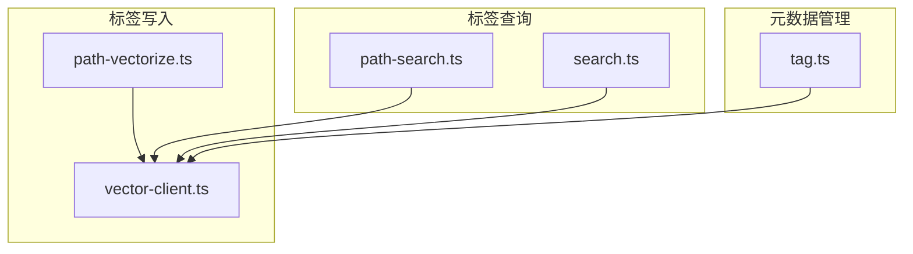
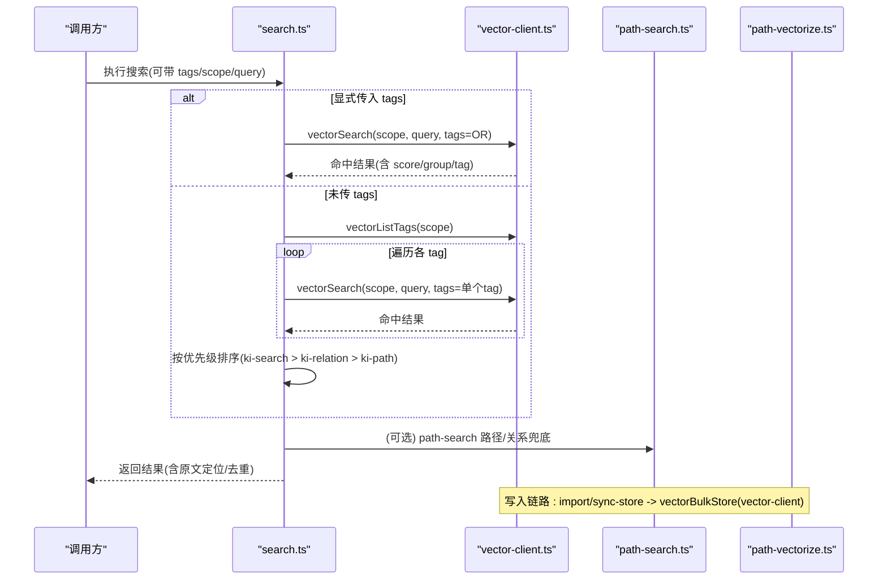
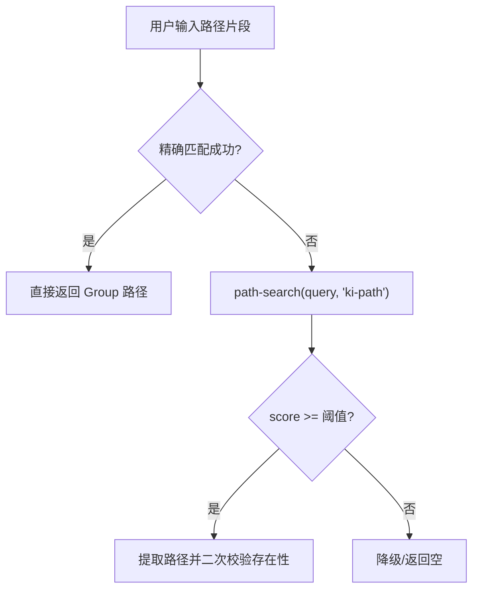
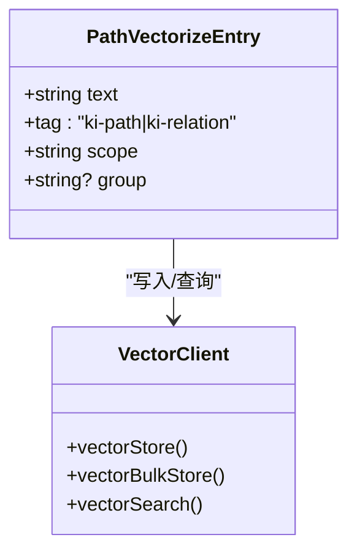
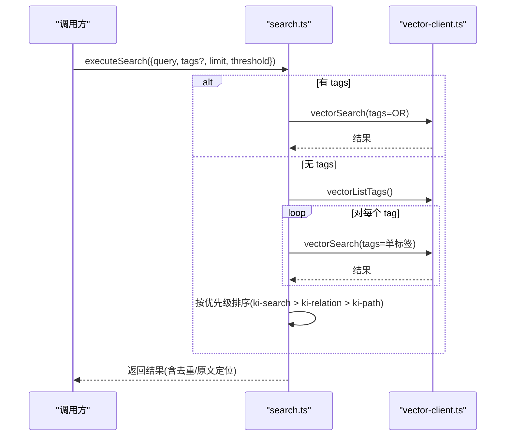
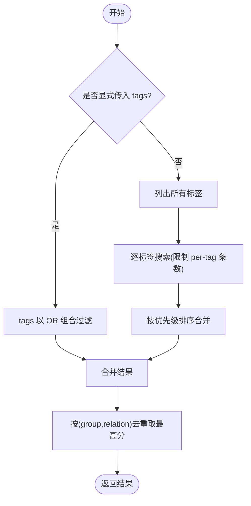
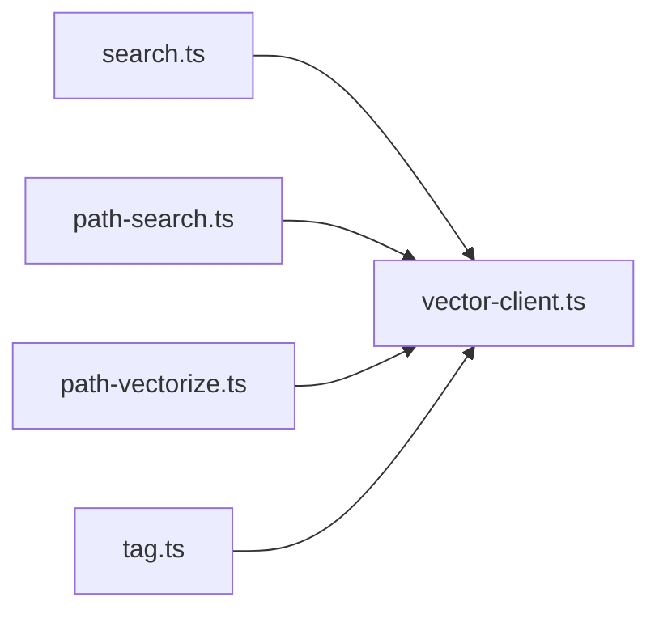

# 三层标签系统

<cite>
**本文引用的文件**
- [src/search.ts](file://src/search.ts)
- [src/lib/vector-client.ts](file://src/lib/vector-client.ts)
- [src/lib/path-search.ts](file://src/lib/path-search.ts)
- [src/lib/path-vectorize.ts](file://src/lib/path-vectorize.ts)
- [src/tag.ts](file://src/tag.ts)
- [docs/tags-design.md](file://docs/tags-design.md)
</cite>

## 目录
1. [简介](#简介)
2. [项目结构](#项目结构)
3. [核心组件](#核心组件)
4. [架构总览](#架构总览)
5. [详细组件分析](#详细组件分析)
6. [依赖关系分析](#依赖关系分析)
7. [性能与排序特性](#性能与排序特性)
8. [故障排查指南](#故障排查指南)
9. [结论](#结论)
10. [附录：配置与查询示例](#附录：配置与查询示例)

## 简介
本文件系统性阐述 knowledge-indexer 的三层标签系统设计，围绕 ki-path、ki-relation、ki-search 三类标签的职责、优先级与匹配逻辑展开，解释它们如何影响搜索结果的相关性与排序，并说明标签在搜索过滤中的 AND/OR 组合方式以及与 Group、Scope 的协同工作机制。同时提供标签的添加、修改、删除操作方法与最佳实践，帮助实现精确的知识检索与智能推荐。

## 项目结构
围绕标签系统的核心代码分布在以下模块：
- 向量客户端与过滤构建：vector-client.ts
- 路径/关系向量写入与删除：path-vectorize.ts
- 路径/关系语义搜索封装：path-search.ts
- 搜索主流程与标签优先级：search.ts
- 标签枚举（只读）CLI：tag.ts
- 设计文档与隔离图示：tags-design.md

图表来源
- [src/lib/path-vectorize.ts:75-116](file://src/lib/path-vectorize.ts#L75-L116)
- [src/lib/vector-client.ts:477-506](file://src/lib/vector-client.ts#L477-L506)
- [src/lib/path-search.ts:47-87](file://src/lib/path-search.ts#L47-L87)
- [src/search.ts:70-121](file://src/search.ts#L70-L121)
- [src/tag.ts:34-51](file://src/tag.ts#L34-L51)

章节来源
- [src/lib/path-vectorize.ts:1-172](file://src/lib/path-vectorize.ts#L1-L172)
- [src/lib/vector-client.ts:1-754](file://src/lib/vector-client.ts#L1-L754)
- [src/lib/path-search.ts:1-116](file://src/lib/path-search.ts#L1-L116)
- [src/search.ts:1-248](file://src/search.ts#L1-L248)
- [src/tag.ts:1-83](file://src/tag.ts#L1-L83)
- [docs/tags-design.md:1-221](file://docs/tags-design.md#L1-L221)

## 核心组件
- 三层标签定义与职责
  - ki-path：路径层级索引，用于 Group 路径模糊匹配与语义兜底。
  - ki-relation：Relation 名称索引，用于模块/关系名称模糊匹配。
  - ki-search：通用语义搜索，面向用户自然语言查询与批量导入内容。
- 向量存储与过滤
  - 通过 vector-client 的 hybridSearch 进行“语义 + FTS + RRF”融合检索；scope 与 tag 作为标量字段硬过滤。
- 搜索优先级与合并
  - search.ts 定义了默认全量搜索时的标签优先级：ki-search > ki-relation > ki-path；并对多标签结果按优先级拼接与去重。
- 标签枚举与发现
  - tag.ts 提供只读的标签列表能力，便于后续精准过滤或治理。

章节来源
- [docs/tags-design.md:1-108](file://docs/tags-design.md#L1-L108)
- [src/lib/vector-client.ts:477-506](file://src/lib/vector-client.ts#L477-L506)
- [src/search.ts:20-29](file://src/search.ts#L20-L29)
- [src/tag.ts:34-51](file://src/tag.ts#L34-L51)

## 架构总览
下图展示了三层标签在写入、存储、查询与消费侧的整体交互。

图表来源
- [src/search.ts:70-121](file://src/search.ts#L70-L121)
- [src/lib/vector-client.ts:477-506](file://src/lib/vector-client.ts#L477-L506)
- [src/lib/path-search.ts:47-87](file://src/lib/path-search.ts#L47-L87)
- [src/lib/path-vectorize.ts:75-116](file://src/lib/path-vectorize.ts#L75-L116)

## 详细组件分析

### 标签层一：ki-path（路径层级索引）
- 内容与格式
  - 以空格分隔的路径层级（含根节点），便于还原为 Group 路径。
- 写入
  - 由导入流程批量写入，每个 Group 一条，tag 固定为 ki-path。
- 查询
  - 通过 path-search 统一接口，使用 tags 过滤 ki-path，阈值较低（RRF 分），由下游做存在性校验兜底。
- 典型场景
  - 用户输入 Group 片段时模糊匹配到真实路径；精确匹配失败后语义兜底。

图表来源
- [src/lib/path-search.ts:47-87](file://src/lib/path-search.ts#L47-L87)
- [src/lib/path-vectorize.ts:51-66](file://src/lib/path-vectorize.ts#L51-L66)

章节来源
- [docs/tags-design.md:17-48](file://docs/tags-design.md#L17-L48)
- [src/lib/path-search.ts:1-116](file://src/lib/path-search.ts#L1-L116)
- [src/lib/path-vectorize.ts:1-172](file://src/lib/path-vectorize.ts#L1-L172)

### 标签层二：ki-relation（Relation 关系索引）
- 内容与格式
  - Relation 名称文本；Group 归属通过结构化 group 字段存储，避免污染 content。
- 写入
  - 导入与同步流程写入，每个 Entry 一条，tag 固定为 ki-relation。
- 查询
  - 同样通过 path-search 统一接口，tags 过滤 ki-relation，阈值低，下游校验质量。
- 典型场景
  - 用户查询 Relation 名称时模糊匹配到真实模块名。

图表来源
- [src/lib/path-vectorize.ts:18-27](file://src/lib/path-vectorize.ts#L18-L27)
- [src/lib/vector-client.ts:513-590](file://src/lib/vector-client.ts#L513-L590)

章节来源
- [docs/tags-design.md:50-95](file://docs/tags-design.md#L50-L95)
- [src/lib/path-vectorize.ts:1-172](file://src/lib/path-vectorize.ts#L1-L172)

### 标签层三：ki-search（通用语义搜索）
- 内容与格式
  - 自由文本，无固定格式；典型来源包括文档 chunk、模块说明、手动知识片段。
- 写入
  - 批量向量化与手动写入均落库，tag 默认为 ki-search。
- 查询
  - 支持显式 tags 过滤（逗号分隔 OR），或不传 tags 走“按标签分查 + 优先级合并”。
- 典型场景
  - 用户自然语言查询知识库内容；MCP 工具调用；Agent 智能推荐召回。

图表来源
- [src/search.ts:70-121](file://src/search.ts#L70-L121)
- [src/lib/vector-client.ts:477-506](file://src/lib/vector-client.ts#L477-L506)

章节来源
- [docs/tags-design.md:98-108](file://docs/tags-design.md#L98-L108)
- [src/search.ts:1-248](file://src/search.ts#L1-L248)

### 标签优先级规则与匹配逻辑
- 默认全量搜索时，按 ki-search > ki-relation > ki-path 的顺序优先返回对应标签的结果。
- 若显式传入 tags，则以逗号分隔的多标签以 OR 组合进行过滤，不改变优先级顺序。
- 搜索结果会按 memoryId 反查 relations-cache 附加 group/relation 信息，并进行同文件多 chunk 去重与 score 降序。

图表来源
- [src/search.ts:20-29](file://src/search.ts#L20-L29)
- [src/search.ts:94-121](file://src/search.ts#L94-L121)
- [src/search.ts:159-177](file://src/search.ts#L159-L177)

章节来源
- [src/search.ts:20-29](file://src/search.ts#L20-L29)
- [src/search.ts:94-121](file://src/search.ts#L94-L121)
- [src/search.ts:159-177](file://src/search.ts#L159-L177)

### 标签在搜索过滤中的作用（AND/OR）
- Scope 过滤：始终强制等于当前 scope（AND）。
- Tag 过滤：
  - 未传 tags：不过滤 tag（覆盖该 scope 下全部）。
  - 传单个或多个 tags：以 OR 组合过滤（同一查询命中任一 tag 即可）。
- 底层通过 buildScopeTagFilter 构造 { and: [scope==..., tag in {...}] } 的过滤器。

章节来源
- [src/lib/vector-client.ts:617-628](file://src/lib/vector-client.ts#L617-L628)
- [src/lib/vector-client.ts:477-506](file://src/lib/vector-client.ts#L477-L506)

### 与 Group、Scope 的协同工作机制
- Scope：物理隔离维度，所有写入与查询都限定在当前 scope。
- Group：通过 relations-cache 反查附加到搜索结果，用于定位原文与去重；ki-relation 条目额外携带 group 结构化字段。
- 协同：
  - 写入：import/sync-store 将 scope、tag、group 一起持久化。
  - 查询：先按 scope+tag 过滤，再按 score 排序，最后用 group/relation 做原文定位与去重。

章节来源
- [src/lib/vector-client.ts:271-294](file://src/lib/vector-client.ts#L271-L294)
- [src/search.ts:123-157](file://src/search.ts#L123-L157)
- [docs/tags-design.md:131-152](file://docs/tags-design.md#L131-L152)

### 标签的添加、修改与删除操作
- 添加
  - 批量导入：通过导入流程写入 ki-search/ki-path/ki-relation。
  - 手动写入：使用 vectorStore/vectorBulkStore（tag 默认 ki-search）。
- 修改
  - 幂等 upsert：相同 text+scope+tag 生成相同 docId，重复写入覆盖旧值。
  - 注意：修改写入标签仅影响新写入数据，历史数据标签不变。
- 删除
  - 路径/关系向量：先按 tag 语义搜索精确匹配，再按 docId 删除。
  - 范围清理：可按 scope+tag 批量删除（vectorDeleteScope）。

章节来源
- [src/lib/path-vectorize.ts:147-172](file://src/lib/path-vectorize.ts#L147-L172)
- [src/lib/vector-client.ts:225-242](file://src/lib/vector-client.ts#L225-L242)
- [src/lib/vector-client.ts:729-753](file://src/lib/vector-client.ts#L729-L753)
- [docs/tags-design.md:200-208](file://docs/tags-design.md#L200-L208)

### 最佳实践与常见模式
- 明确分层用途
  - 路径/关系匹配走 ki-path/ki-relation；用户自然语言查询走 ki-search。
- 控制搜索范围
  - 需要聚焦某类知识时，显式传入 tags（如只搜 ki-search）。
- 利用优先级
  - 默认全量搜索时，ki-search 优先返回，适合“内容优先”的场景。
- 结合 Group/Scope
  - 跨项目隔离使用不同 scope；通过 group 定位原文，提升结果可信度。
- 增量维护
  - 增量导入时先删旧再写新，避免重复与脏数据。
- 阈值与兜底
  - 路径/关系搜索采用低阈值并由下游存在性校验兜底，兼顾召回与准确率。

[本节为通用指导，不直接分析具体文件]

### 精确检索与智能推荐
- 精确检索
  - 已知 Group/Relation 时，优先使用 ki-path/ki-relation 的语义兜底，配合存在性校验确保 100% 命中。
- 智能推荐
  - 基于 ki-search 的混合检索（语义+FTS+RRF）召回相关内容；结合 group/relation 上下文，输出更贴近业务的答案。

[本节为概念性说明，不直接分析具体文件]

## 依赖关系分析
- 组件耦合
  - search.ts 依赖 vector-client 进行检索与标签枚举；path-search.ts 复用 vector-client 做路径/关系兜底；path-vectorize.ts 负责写入与删除。
- 外部依赖
  - zvec 引擎提供 hybridSearch、listIds、upsert/delete 等能力；scope/tag 作为标量字段参与过滤。
- 潜在循环
  - 模块间单向依赖清晰，未见循环引用。

图表来源
- [src/search.ts:70-121](file://src/search.ts#L70-L121)
- [src/lib/path-search.ts:47-87](file://src/lib/path-search.ts#L47-L87)
- [src/lib/path-vectorize.ts:75-116](file://src/lib/path-vectorize.ts#L75-L116)
- [src/tag.ts:34-51](file://src/tag.ts#L34-L51)

章节来源
- [src/search.ts:1-248](file://src/search.ts#L1-L248)
- [src/lib/vector-client.ts:1-754](file://src/lib/vector-client.ts#L1-L754)

## 性能与排序特性
- 混合检索
  - 语义向量 + BM25 全文 + RRF 融合，提高召回与排序稳定性。
- 标签过滤
  - 通过 scope+tag 硬过滤减少候选集，降低计算开销。
- 优先级合并
  - 默认全量搜索时按 ki-search > ki-relation > ki-path 顺序合并，保证内容相关结果优先。
- 去重策略
  - 按 (group, relation) 去重保留最高分；同一文件多 chunk 命中时去重并标记 deduplicated。
- 扫描限制
  - 标签枚举受 scanLimit 约束，超大库可能 truncated:true，表示近似统计。

章节来源
- [src/search.ts:159-194](file://src/search.ts#L159-L194)
- [src/lib/vector-client.ts:477-506](file://src/lib/vector-client.ts#L477-L506)
- [src/tag.ts:34-51](file://src/tag.ts#L34-L51)

## 故障排查指南
- 向量服务不可用
  - 现象：搜索/列举标签返回不可用提示。
  - 处理：检查进程占用、锁状态、损坏情况；必要时重建向量库。
- 标签未生效
  - 检查是否显式传入 tags；确认写入的 tag 与查询一致（大小写归一化）。
- 结果过多或过少
  - 调整 limit/threshold；显式传入 tags 缩小范围；利用 group/relation 定位原文辅助判断。
- 原文不可用
  - 检查 relations-cache 是否能反查到 group/relation；必要时重新 sync-relation 或 rebuild-vector。

章节来源
- [src/lib/vector-client.ts:420-467](file://src/lib/vector-client.ts#L420-L467)
- [src/search.ts:123-157](file://src/search.ts#L123-L157)

## 结论
knowledge-indexer 的三层标签系统通过 ki-path、ki-relation、ki-search 实现了“路径/关系索引”与“通用语义搜索”的物理隔离与互补协作。搜索流程在默认情况下遵循 ki-search 优先的层级策略，并通过显式 tags 的 OR 组合灵活控制召回范围。结合 Group/Scope 的协同机制，系统既能满足精确检索，也能支撑智能推荐与 Agent 工作流。通过规范的添加、修改、删除操作与最佳实践，可在大规模知识库中保持高可用与高性能。

## 附录：配置与查询示例
- 搜索示例（CLI）
  - 全量搜索（按标签优先级合并）：ki search "告警收敛" --limit 10
  - 仅搜索通用内容：ki search "告警收敛" --tags "ki-search"
  - 仅搜索路径/关系：ki search "告警" --tags "ki-path,ki-relation"
  - 设置相似度阈值：ki search "告警收敛" --threshold 0.3
- 标签枚举（只读）
  - 列出某 scope 下的标签及数量：ki tag list --scope <scope>
- 写入/更新
  - 批量写入：通过导入流程或 vectorBulkStore，指定 tag（默认 ki-search）
  - 幂等更新：相同 text+scope+tag 重复写入即覆盖
- 删除
  - 删除路径/关系向量：先搜索精确匹配，再按 docId 删除
  - 批量清理：按 scope+tag 删除（vectorDeleteScope）

章节来源
- [src/search.ts:204-237](file://src/search.ts#L204-L237)
- [src/tag.ts:58-72](file://src/tag.ts#L58-L72)
- [src/lib/path-vectorize.ts:147-172](file://src/lib/path-vectorize.ts#L147-L172)
- [src/lib/vector-client.ts:729-753](file://src/lib/vector-client.ts#L729-L753)