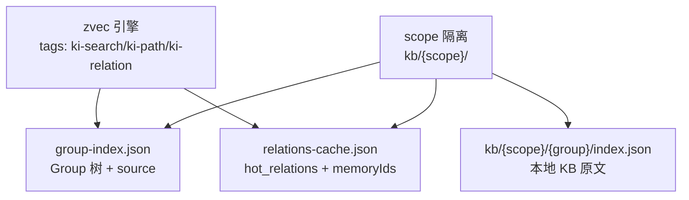
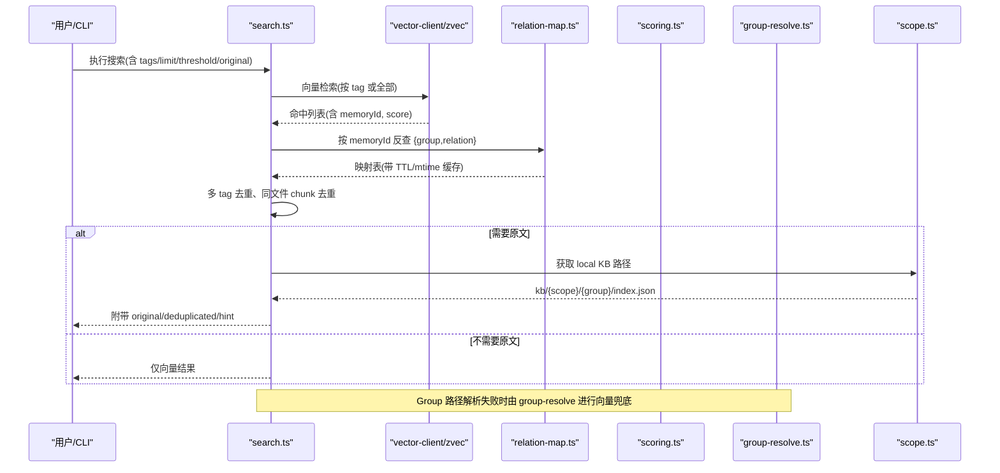
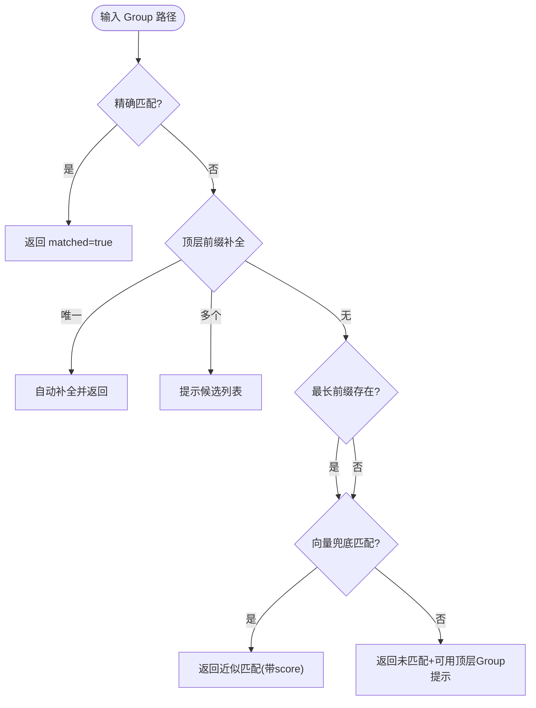
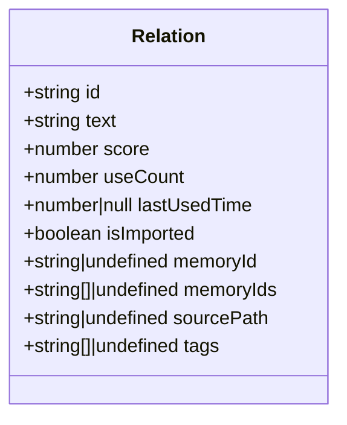
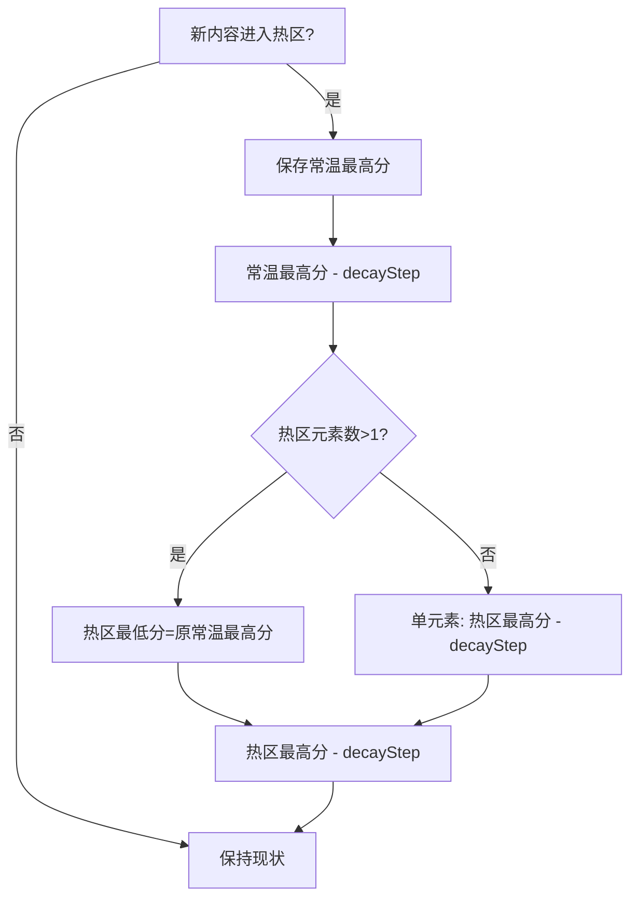
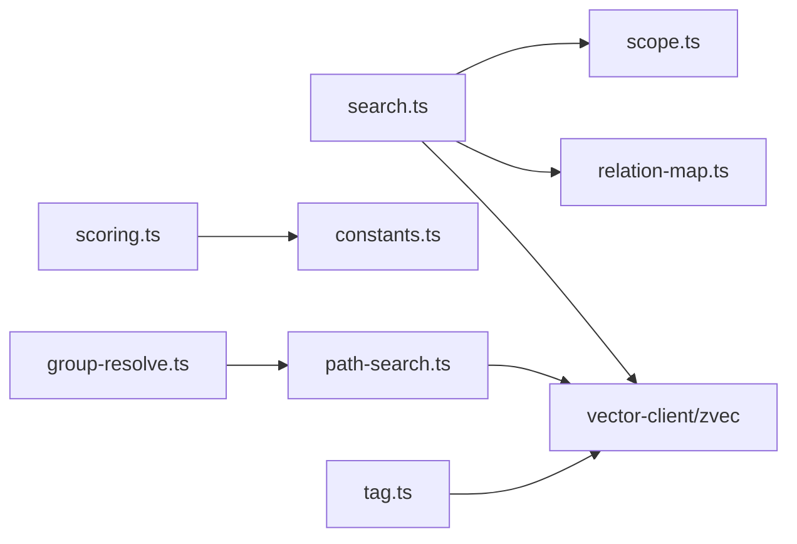

# 核心概念

<cite>
**本文引用的文件**
- [src/lib/scope.ts](file://src/lib/scope.ts)
- [src/lib/group-resolve.ts](file://src/lib/group-resolve.ts)
- [src/lib/relation-map.ts](file://src/lib/relation-map.ts)
- [src/lib/scoring.ts](file://src/lib/scoring.ts)
- [src/lib/constants.ts](file://src/lib/constants.ts)
- [src/lib/path-search.ts](file://src/lib/path-search.ts)
- [src/search.ts](file://src/search.ts)
- [src/tag.ts](file://src/tag.ts)
- [docs/architecture.md](file://docs/architecture.md)
- [docs/tags-design.md](file://docs/tags-design.md)
</cite>

## 目录
1. [简介](#简介)
2. [项目结构](#项目结构)
3. [核心组件](#核心组件)
4. [架构总览](#架构总览)
5. [详细组件分析](#详细组件分析)
6. [依赖关系分析](#依赖关系分析)
7. [性能考量](#性能考量)
8. [故障排查指南](#故障排查指南)
9. [结论](#结论)
10. [附录：使用示例](#附录使用示例)

## 简介
knowledge-indexer（kisearch）围绕三个核心概念组织知识：Scope（项目隔离标识）、Group（层次化知识分组路径）、Relation（可检索的知识条目）。通过三层标签体系（ki-search、ki-path、ki-relation）将“内容向量”“路径索引”“关系索引”物理隔离，配合记忆库机制（冷热分区、评分衰减、使用计数防刷）与 Group 树导航，实现高效、可维护的知识检索与原文交付。

## 项目结构
- Scope 隔离：每个 scope 拥有独立的数据目录与 relations-cache.json，确保多项目数据互不干扰。
- Group 树：group-index.json 以嵌套对象表示层级路径，支持自动补全与向量兜底解析。
- Relation 缓存：relations-cache.json 记录 hot_relations 及其评分、memoryIds、sourcePath 等元信息。
- 标签体系：ki-path/ki-relation/ki-search 三类标签分别承载路径索引、关系名称索引、通用语义搜索内容。
- 记忆库策略：基于 useCount、lastUsedTime 的评分计算、hybridPartition 冷热分区、boundaryDecay 边界衰减与 MIN_RECORD_INTERVAL_MINUTES/MAX_USE_COUNT 防刷上限。

图表来源
- [src/lib/scope.ts:49-77](file://src/lib/scope.ts#L49-L77)
- [docs/architecture.md:38-60](file://docs/architecture.md#L38-L60)

章节来源
- [src/lib/scope.ts:49-77](file://src/lib/scope.ts#L49-L77)
- [docs/architecture.md:38-60](file://docs/architecture.md#L38-L60)

## 核心组件
- Scope：校验、路径构造、列出已初始化 scope、读写 group-index.json 的 source 块。
- Group：路径存在性检查、最长前缀查找、子节点枚举、自动补全与向量兜底。
- Relation：评分计算、使用记录、冷热分区、边界衰减；与 memoryId 关联用于原文定位。
- 标签系统：ki-path/ki-relation/ki-search 的定义、写入与消费路径，默认标签集与保留标签过滤。
- 搜索链路：按 tag 优先级聚合结果、memoryId 反查附加 group/relation、可选返回本地 KB 原文并去重。

章节来源
- [src/lib/scope.ts:17-77](file://src/lib/scope.ts#L17-L77)
- [src/lib/group-resolve.ts:12-25](file://src/lib/group-resolve.ts#L12-L25)
- [src/lib/scoring.ts:19-36](file://src/lib/scoring.ts#L19-L36)
- [src/lib/constants.ts:55-75](file://src/lib/constants.ts#L55-L75)
- [src/search.ts:20-47](file://src/search.ts#L20-L47)

## 架构总览

图表来源
- [src/search.ts:70-196](file://src/search.ts#L70-L196)
- [src/lib/relation-map.ts:48-78](file://src/lib/relation-map.ts#L48-L78)
- [src/lib/group-resolve.ts:117-219](file://src/lib/group-resolve.ts#L117-L219)
- [src/lib/scope.ts:49-77](file://src/lib/scope.ts#L49-L77)

## 详细组件分析

### Scope（项目隔离标识）
- 作用：限定数据范围，所有 KB 数据、relations-cache、group-index 均按 scope 隔离。
- 能力：
  - 校验 scope 合法性（仅字母数字、连字符、下划线），拒绝路径遍历。
  - 计算 kb/{scope} 绝对路径、读取/写入 group-index.json 的 source 块。
  - 列举已初始化的 scope（检测 relations-cache.json 是否存在）。
- 与 Group/Relation 的关系：所有 Group 树与 Relation 缓存都位于对应 scope 目录下，确保多项目互不影响。

章节来源
- [src/lib/scope.ts:17-43](file://src/lib/scope.ts#L17-L43)
- [src/lib/scope.ts:49-77](file://src/lib/scope.ts#L49-L77)
- [src/lib/scope.ts:174-198](file://src/lib/scope.ts#L174-L198)
- [src/lib/scope.ts:205-229](file://src/lib/scope.ts#L205-L229)

### Group（层次化知识分组路径）
- 数据结构：group-index.json 中的 groups 为嵌套对象，键即组名，值为其子节点。
- 路径解析：
  - 直接匹配 groupsData 或 group-index 树。
  - 顶层前缀整段补全（唯一命中自动补全，多个命中提示候选）。
  - 部分匹配提示（最长存在前缀 + 子节点建议）。
  - 向量兜底：通过 ki-path 标签做语义近似匹配，二次校验真实存在后返回。
- 导航机制：提供 pathExistsInTree、findLongestExistingPrefix、getDirectChildren 等工具函数，支撑 CLI 与 MCP 的路径选择体验。

图表来源
- [src/lib/group-resolve.ts:32-94](file://src/lib/group-resolve.ts#L32-L94)
- [src/lib/group-resolve.ts:117-219](file://src/lib/group-resolve.ts#L117-L219)

章节来源
- [src/lib/group-resolve.ts:32-94](file://src/lib/group-resolve.ts#L32-L94)
- [src/lib/group-resolve.ts:117-219](file://src/lib/group-resolve.ts#L117-L219)

### Relation（可检索的知识条目）
- 定义：包含 id、text、score、useCount、lastUsedTime、isImported、memoryId/memoryIds、sourcePath、tags 等字段。
- 评分与使用：
  - calculateScore：基于 useCount 与 lastUsedTime 的半衰期衰减。
  - recordUse：5 分钟防刷间隔，useCount 上限限制。
- 冷热分区：
  - hybridPartition：新兴热区（recentHours 内使用过）+ 历史热门按评分填充，常温/冷区按比例划分，支持上限截断。
  - boundaryDecay：新内容进入热区时，对热/温边界分数进行衰减调整，避免剧烈波动。
- 与 memoryId 的关联：
  - 导入时为文件级 relation 挂入该文件全部 chunk 的 memoryIds（多值）。
  - 搜索命中任一 memoryId 即可反查到同一文件级 relation，从而定位并返回本地 KB 原文。

图表来源
- [src/lib/scoring.ts:19-36](file://src/lib/scoring.ts#L19-L36)

章节来源
- [src/lib/scoring.ts:44-79](file://src/lib/scoring.ts#L44-L79)
- [src/lib/scoring.ts:90-117](file://src/lib/scoring.ts#L90-L117)
- [src/lib/scoring.ts:136-209](file://src/lib/scoring.ts#L136-L209)
- [src/lib/scoring.ts:222-274](file://src/lib/scoring.ts#L222-L274)
- [docs/architecture.md:84-100](file://docs/architecture.md#L84-L100)

### 三层标签系统（ki-search、ki-path、ki-relation）
- 设计原理：
  - ki-path：存储 Group 路径层级（空格分隔），用于路径模糊匹配与导航。
  - ki-relation：存储 Relation 名称（及结构化 group），用于 Relation 名称模糊匹配。
  - ki-search：存储通用语义内容（自由文本），供 ki search 检索。
  - 默认标签集 DEFAULT_TAGS = ['ki-search','ki-path','ki-relation']，内部保留标签在写入时被过滤。
- 使用场景：
  - 路径解析失败时，通过 ki-path 做语义兜底。
  - Relation 名称查询通过 ki-relation 做模糊匹配。
  - 通用知识片段通过 ki-search 检索，并可结合自定义 tags 过滤。
- 发现与统计：tag list 命令可扫描 zvec 中用过的标签与数量，辅助决策。

章节来源
- [src/lib/constants.ts:55-75](file://src/lib/constants.ts#L55-L75)
- [docs/tags-design.md:1-108](file://docs/tags-design.md#L1-L108)
- [src/lib/path-search.ts:47-87](file://src/lib/path-search.ts#L47-L87)
- [src/tag.ts:34-51](file://src/tag.ts#L34-L51)

### 记忆库机制（冷热治理、评分衰减、使用计数）
- 评分衰减：calculateScore 使用半衰期模型，随时间推移降低旧内容的权重。
- 使用计数防刷：recordUse 设置最小记录间隔与最大使用次数，防止高频刷分。
- 冷热分区：hybridPartition 将新兴项优先保留到热区，再按评分填充历史热门，剩余划分到常温/冷区，并支持上限截断。
- 边界衰减：boundaryDecay 在新内容进入热区时对边界分数进行平滑处理，避免热区震荡。

图表来源
- [src/lib/scoring.ts:222-274](file://src/lib/scoring.ts#L222-L274)

章节来源
- [src/lib/scoring.ts:44-79](file://src/lib/scoring.ts#L44-L79)
- [src/lib/scoring.ts:90-117](file://src/lib/scoring.ts#L90-L117)
- [src/lib/scoring.ts:136-209](file://src/lib/scoring.ts#L136-L209)
- [src/lib/scoring.ts:222-274](file://src/lib/scoring.ts#L222-L274)

### Group 树结构与导航机制
- 结构：group-index.json 的 groups 字段为嵌套对象，键为组名，值为子节点集合。
- 导航：
  - 精确匹配优先，其次顶层前缀补全，再次部分匹配提示，最后向量兜底。
  - 提供工具函数用于存在性判断、前缀查找、子节点枚举。
- 迁移兼容：支持从旧格式 roots → groups 的自动迁移。

章节来源
- [src/lib/scope.ts:117-146](file://src/lib/scope.ts#L117-L146)
- [src/lib/group-resolve.ts:32-94](file://src/lib/group-resolve.ts#L32-L94)
- [src/lib/group-resolve.ts:117-219](file://src/lib/group-resolve.ts#L117-L219)

### Relation 与原文的关联及 memoryId 的作用
- 关联方式：
  - 导入时将文件级 relation 与该文件全部 chunk 的 memoryIds（多值）关联。
  - 搜索命中任一 memoryId 即可反查到同一文件级 relation，从而定位并返回本地 KB 原文。
- memoryId 的作用：
  - 作为向量文档的唯一标识，用于增量 diff/delete、原文定位、去重。
  - 旧数据兼容单值 memoryId 字段。
- 原文获取：
  - 通过 getLocalKbDir(scope, group) 读取 kb/{scope}/{group}/index.json，按 relation key 取原文。
  - 若缺失则降级返回向量 content 并给出提示。

章节来源
- [docs/architecture.md:84-100](file://docs/architecture.md#L84-L100)
- [src/search.ts:53-68](file://src/search.ts#L53-L68)
- [src/lib/relation-map.ts:80-114](file://src/lib/relation-map.ts#L80-L114)

## 依赖关系分析

图表来源
- [src/search.ts:70-196](file://src/search.ts#L70-L196)
- [src/lib/group-resolve.ts:117-219](file://src/lib/group-resolve.ts#L117-L219)
- [src/lib/path-search.ts:47-87](file://src/lib/path-search.ts#L47-L87)
- [src/lib/scoring.ts:11-15](file://src/lib/scoring.ts#L11-L15)
- [src/tag.ts:34-51](file://src/tag.ts#L34-L51)

章节来源
- [src/search.ts:70-196](file://src/search.ts#L70-L196)
- [src/lib/group-resolve.ts:117-219](file://src/lib/group-resolve.ts#L117-L219)
- [src/lib/path-search.ts:47-87](file://src/lib/path-search.ts#L47-L87)
- [src/lib/scoring.ts:11-15](file://src/lib/scoring.ts#L11-L15)
- [src/tag.ts:34-51](file://src/tag.ts#L34-L51)

## 性能考量
- 向量检索：采用混合检索（dense + FTS）与 RRF 融合，默认阈值 0，由下游存在性校验保证质量。
- 反查缓存：relation-map 模块按 scope 缓存 Map，基于 mtime/size 与 TTL（默认 10 分钟）失效，首次构建 O(N)，后续 O(1)。
- 去重优化：multi-tag 重复命中按 (group, relation) 去重；同文件多 chunk 命中在 includeOriginal 模式下仅首次返回原文，其余标记 deduplicated。
- 防刷与上限：useCount 上限与最小记录间隔避免频繁更新导致的抖动与写放大。

章节来源
- [src/lib/path-search.ts:47-87](file://src/lib/path-search.ts#L47-L87)
- [src/lib/relation-map.ts:48-78](file://src/lib/relation-map.ts#L48-L78)
- [src/search.ts:159-196](file://src/search.ts#L159-L196)
- [src/lib/scoring.ts:65-79](file://src/lib/scoring.ts#L65-L79)

## 故障排查指南
- 向量服务不可用：search 会返回 degraded 状态与原因，需检查 zvec 服务是否启动。
- 原文不可用：当本地 KB 缺失 relation 或读取异常时，search 会返回 hint 并降级为向量 content。
- 路径解析失败：group-resolve 会返回候选列表或部分匹配提示；可尝试完整路径或使用向量兜底。
- 标签污染：内部保留标签（ki-search/ki-relation/ki-path）会被过滤，避免误用；如需自定义标签请使用其他名称。

章节来源
- [src/search.ts:84-92](file://src/search.ts#L84-L92)
- [src/search.ts:53-68](file://src/search.ts#L53-L68)
- [src/lib/group-resolve.ts:153-219](file://src/lib/group-resolve.ts#L153-L219)
- [src/lib/constants.ts:55-75](file://src/lib/constants.ts#L55-L75)

## 结论
knowledge-indexer 通过 Scope/Group/Relation 三要素与三层标签体系，构建了清晰、可扩展的知识索引与检索框架。记忆库机制保障热门内容的高命中率与稳定性，Group 树导航提升定位效率，memoryId 打通向量与原文的关联，形成“检索—定位—原文”的闭环。

## 附录：使用示例
- 场景一：按 Group 导航
  - 输入不完整的 Group 路径，系统自动补全或提示候选；若失败则通过 ki-path 向量兜底。
  - 参考：[src/lib/group-resolve.ts:117-219](file://src/lib/group-resolve.ts#L117-L219)
- 场景二：通用语义搜索
  - 使用 ki search 查询任意自然语言问题，默认按 ki-search/ki-relation/ki-path 优先级聚合结果。
  - 开启 --original 返回本地 KB 原文（如可用），否则返回向量内容。
  - 参考：[src/search.ts:70-196](file://src/search.ts#L70-L196)
- 场景三：Relation 名称模糊匹配
  - 通过 ki-relation 标签检索 Relation 名称，适用于模块说明、API 名称等场景。
  - 参考：[docs/tags-design.md:50-95](file://docs/tags-design.md#L50-L95)
- 场景四：标签发现与过滤
  - 使用 ki tag list 查看某 scope 下用过的标签与数量，辅助精准过滤。
  - 参考：[src/tag.ts:34-51](file://src/tag.ts#L34-L51)
- 场景五：记忆库策略调优
  - 调整 PartitionConfig（hotPercent/warmPercent/reservedEmerging/recentHours/decayStep 等）以适配不同业务热度分布。
  - 参考：[src/lib/constants.ts:23-50](file://src/lib/constants.ts#L23-L50)
  - 参考：[src/lib/scoring.ts:90-117](file://src/lib/scoring.ts#L90-L117)