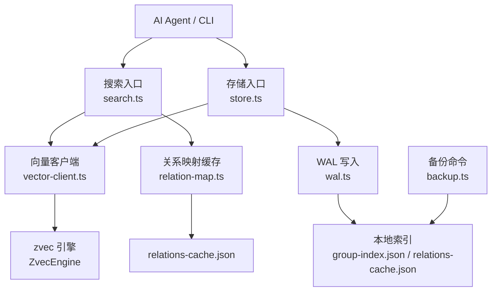
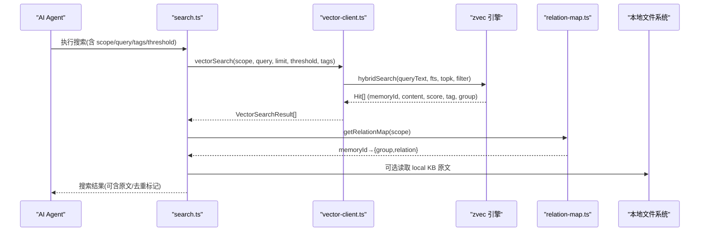
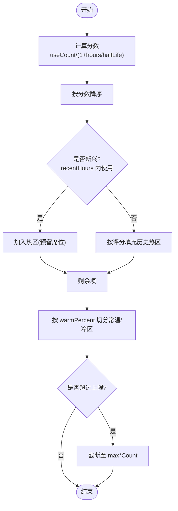
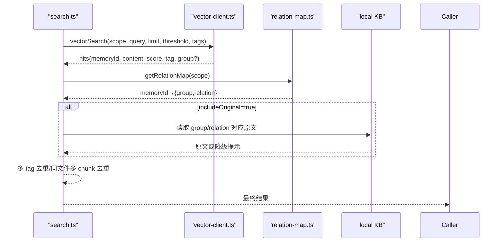
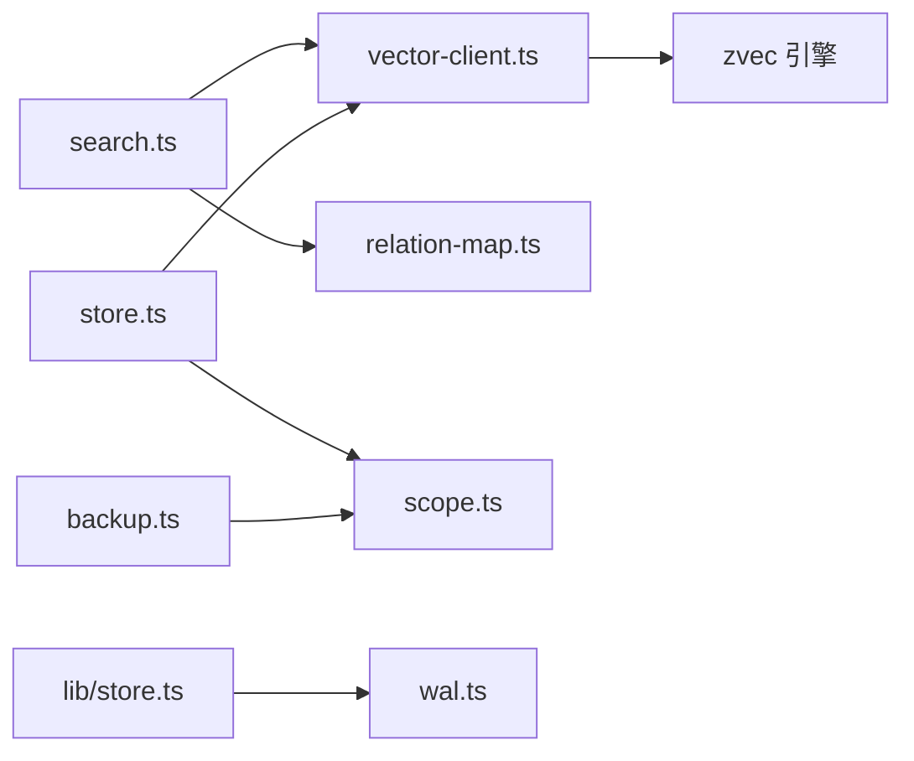

# 记忆库机制

<cite>
**本文引用的文件**
- [src/lib/scoring.ts](file://src/lib/scoring.ts)
- [src/lib/constants.ts](file://src/lib/constants.ts)
- [src/lib/vector-client.ts](file://src/lib/vector-client.ts)
- [src/search.ts](file://src/search.ts)
- [src/store.ts](file://src/store.ts)
- [src/lib/relation-map.ts](file://src/lib/relation-map.ts)
- [src/lib/scope.ts](file://src/lib/scope.ts)
- [src/lib/store.ts](file://src/lib/store.ts)
- [src/lib/wal.ts](file://src/lib/wal.ts)
- [src/backup.ts](file://src/backup.ts)
- [_template/relations-cache.json](file://_template/relations-cache.json)
- [docs/memory-agent-guide.md](file://docs/memory-agent-guide.md)
- [docs/vector-engine-mem.md](file://docs/vector-engine-mem.md)
</cite>

## 目录
1. [简介](#简介)
2. [项目结构](#项目结构)
3. [核心组件](#核心组件)
4. [架构总览](#架构总览)
5. [详细组件分析](#详细组件分析)
6. [依赖关系分析](#依赖关系分析)
7. [性能考量](#性能考量)
8. [故障排查指南](#故障排查指南)
9. [结论](#结论)
10. [附录](#附录)

## 简介
本文件系统性阐述 knowledge-indexer 的记忆库机制与冷热治理策略，覆盖以下主题：
- 记忆库的概念、作用及其在 AI Agent 中的重要性
- 冷热数据的识别标准与自动迁移机制
- 评分衰减算法（时间衰减、使用频率衰减）
- 容量管理与空间回收
- 持久化存储与备份恢复
- 与向量数据库的集成方式
- 配置参数调优指南
- 监控与分析使用方法
- 性能优化最佳实践与故障排查方法

## 项目结构
记忆库由“本地索引 + 向量检索 + WAL 写入 + 备份”四部分组成：
- 本地索引：Group 树、relations-cache、local KB
- 向量检索：基于 zvec 引擎的混合检索（语义+FTS+RRF）
- WAL 写入：原子写入与跨进程写锁，保证数据一致性
- 备份恢复：快照归档与重建

图表来源
- [src/search.ts:70-199](file://src/search.ts#L70-L199)
- [src/store.ts:23-51](file://src/store.ts#L23-L51)
- [src/lib/vector-client.ts:477-542](file://src/lib/vector-client.ts#L477-L542)
- [src/lib/relation-map.ts:48-78](file://src/lib/relation-map.ts#L48-L78)
- [src/lib/wal.ts:92-112](file://src/lib/wal.ts#L92-L112)
- [src/backup.ts:63-103](file://src/backup.ts#L63-L103)

章节来源
- [src/search.ts:70-199](file://src/search.ts#L70-L199)
- [src/store.ts:23-51](file://src/store.ts#L23-L51)
- [src/lib/vector-client.ts:477-542](file://src/lib/vector-client.ts#L477-L542)
- [src/lib/relation-map.ts:48-78](file://src/lib/relation-map.ts#L48-L78)
- [src/lib/wal.ts:92-112](file://src/lib/wal.ts#L92-L112)
- [src/backup.ts:63-103](file://src/backup.ts#L63-L103)

## 核心组件
- 评分与分区：计算分数、记录使用、冷热分区、边界衰减
- 向量客户端：统一封装 zvec 引擎的创建/打开、检索、存储、删除与管理面操作
- 关系映射：memoryId → { group, relation } 的反查映射，带 TTL 缓存
- 存储层：JSON 读写、scope 初始化、旧格式迁移
- WAL：原子写入与跨进程写锁，保障并发安全
- 备份：快照归档与列表查询

章节来源
- [src/lib/scoring.ts:44-117](file://src/lib/scoring.ts#L44-L117)
- [src/lib/vector-client.ts:314-467](file://src/lib/vector-client.ts#L314-L467)
- [src/lib/relation-map.ts:48-78](file://src/lib/relation-map.ts#L48-L78)
- [src/lib/store.ts:23-62](file://src/lib/store.ts#L23-L62)
- [src/lib/wal.ts:92-112](file://src/lib/wal.ts#L92-L112)
- [src/backup.ts:63-103](file://src/backup.ts#L63-L103)

## 架构总览
记忆库采用“本地索引 + 向量检索”双轨设计。Agent 通过 CLI/MCP 调用 search/store，底层经 vector-client 访问 zvec 引擎；同时通过 relation-map 将向量命中映射回 Group/Relation，以召回原文或定位知识片段。WAL 确保本地索引原子写入，备份提供快照能力。

图表来源
- [src/search.ts:70-199](file://src/search.ts#L70-L199)
- [src/lib/vector-client.ts:477-506](file://src/lib/vector-client.ts#L477-L506)
- [src/lib/relation-map.ts:48-78](file://src/lib/relation-map.ts#L48-L78)

## 详细组件分析

### 评分与冷热治理
- 评分函数：score = useCount / (1 + hoursSinceLastUse / halfLifeHours)，体现“使用频率衰减 + 时间衰减”
- 使用记录：防刷间隔（默认 5 分钟）、上限计数（默认 10），避免滥用刷分
- 冷热分区：
  - 新兴热区：最近 recentHours 内使用过，优先保留席位
  - 历史热区：按评分排序填充
  - 常温/冷区：剩余内容按比例分配
  - 上限截断：maxHotCount/maxWarmCount/maxColdCount
- 边界衰减：新内容进入热区时，对热区最低分与最高分进行衰减，保持区间稳定

图表来源
- [src/lib/scoring.ts:44-117](file://src/lib/scoring.ts#L44-L117)
- [src/lib/constants.ts:24-50](file://src/lib/constants.ts#L24-L50)

章节来源
- [src/lib/scoring.ts:44-117](file://src/lib/scoring.ts#L44-L117)
- [src/lib/constants.ts:24-50](file://src/lib/constants.ts#L24-L50)

### 向量检索与原文召回
- 检索路径：hybridSearch（语义 dense + FTS 关键词 + RRF 融合）
- 过滤：按 scope + tag 过滤，支持多 tag OR
- 原文召回：通过 relation-map 反查 memoryId 对应的 group/relation，再读取 local KB 原文；失败则降级返回向量文档并提示
- 去重：同一文件多 chunk 命中仅保留首次原文，其余标注 deduplicated

图表来源
- [src/search.ts:70-199](file://src/search.ts#L70-L199)
- [src/lib/vector-client.ts:477-506](file://src/lib/vector-client.ts#L477-L506)
- [src/lib/relation-map.ts:48-78](file://src/lib/relation-map.ts#L48-L78)

章节来源
- [src/search.ts:70-199](file://src/search.ts#L70-L199)
- [src/lib/vector-client.ts:477-506](file://src/lib/vector-client.ts#L477-L506)
- [src/lib/relation-map.ts:48-78](file://src/lib/relation-map.ts#L48-L78)

### 存储与幂等 upsert
- doc id：sha256(text + scope + tag) 前 32 位，实现“同 scope+text+tag 幂等 upsert”
- 标签：单值 STRING，写入时转小写，查询时大小写不敏感
- 批量写入：vectorBulkStore 支持批量 upsert，逐项返回成功/失败
- 文本长度限制：MAX_TEXT_LENGTH 保护

章节来源
- [src/lib/vector-client.ts:225-242](file://src/lib/vector-client.ts#L225-L242)
- [src/lib/vector-client.ts:513-542](file://src/lib/vector-client.ts#L513-L542)
- [src/lib/vector-client.ts:547-590](file://src/lib/vector-client.ts#L547-L590)

### 本地索引与 WAL 原子写入
- JSON 读写：readJson/writeJson 自动添加 version 与 updatedAt，并通过 WAL 写入
- WAL 流程：获取跨进程写锁 → 写 .tmp → 原子 rename → 释放锁
- 并发保护：同一目标文件同一时刻仅一个进程写入，避免 Last-Write-Wins 覆盖
- 清理：cleanupTmpFiles 清理残留 .tmp 与陈旧 .lock

章节来源
- [src/lib/store.ts:23-62](file://src/lib/store.ts#L23-L62)
- [src/lib/wal.ts:92-112](file://src/lib/wal.ts#L92-L112)
- [src/lib/wal.ts:121-143](file://src/lib/wal.ts#L121-L143)

### Scope 与模板初始化
- Scope 校验：仅允许字母、数字、连字符、下划线
- 路径构造：kb/{scope}/ 作为数据根，group-index.json 与 relations-cache.json 位于该目录
- 模板初始化：ensureScopeDir 检测缺失后从 _template 复制并注入 scope/updatedAt

章节来源
- [src/lib/scope.ts:30-67](file://src/lib/scope.ts#L30-L67)
- [src/lib/store.ts:168-223](file://src/lib/store.ts#L168-L223)
- [_template/relations-cache.json:1-19](file://_template/relations-cache.json#L1-L19)

### 备份与恢复
- 备份：ki backup <scope> 生成快照到 backupDir；支持 --list 列出已有备份
- 恢复：结合 restore 命令与 rebuild-vector 完成向量重建（见错误处理）

章节来源
- [src/backup.ts:63-103](file://src/backup.ts#L63-L103)

### 与向量数据库的集成
- 单一 collection：config.vectorDir 下的集合，scope/tag 以标量字段隔离
- 嵌入模型：SiliconFlow Qwen3-Embedding-8B，维度与 metric 在创建时指定
- 混合检索：hybridSearch(queryText, fts, topk, filter, rerank=rrf)
- 空闲释放锁：常驻 MCP 启用 idle close，CLI 每次调用结束后关闭 engine

章节来源
- [src/lib/vector-client.ts:268-303](file://src/lib/vector-client.ts#L268-L303)
- [src/lib/vector-client.ts:314-362](file://src/lib/vector-client.ts#L314-L362)
- [docs/vector-engine-mem.md:1-53](file://docs/vector-engine-mem.md#L1-L53)

## 依赖关系分析
- search.ts 依赖 vector-client.ts（检索）、relation-map.ts（原文定位）、scope.ts（路径）
- store.ts 依赖 vector-client.ts（存储）、scope.ts（scope 解析）
- scoring.ts 被上层用于冷热分区与衰减（如 query-group 等模块）
- wal.ts 被 lib/store.ts 用于原子写入
- backup.ts 依赖 config/scope 与 lib/backup 实现快照

图表来源
- [src/search.ts:70-199](file://src/search.ts#L70-L199)
- [src/store.ts:23-51](file://src/store.ts#L23-L51)
- [src/lib/vector-client.ts:477-542](file://src/lib/vector-client.ts#L477-L542)
- [src/lib/relation-map.ts:48-78](file://src/lib/relation-map.ts#L48-L78)
- [src/lib/store.ts:23-62](file://src/lib/store.ts#L23-L62)
- [src/lib/wal.ts:92-112](file://src/lib/wal.ts#L92-L112)
- [src/backup.ts:63-103](file://src/backup.ts#L63-L103)

章节来源
- [src/search.ts:70-199](file://src/search.ts#L70-L199)
- [src/store.ts:23-51](file://src/store.ts#L23-L51)
- [src/lib/vector-client.ts:477-542](file://src/lib/vector-client.ts#L477-L542)
- [src/lib/relation-map.ts:48-78](file://src/lib/relation-map.ts#L48-L78)
- [src/lib/store.ts:23-62](file://src/lib/store.ts#L23-L62)
- [src/lib/wal.ts:92-112](file://src/lib/wal.ts#L92-L112)
- [src/backup.ts:63-103](file://src/backup.ts#L63-L103)

## 性能考量
- 向量引擎常驻：MCP 模式下引擎常驻，首条查询延迟显著降低
- 混合检索：hybridSearch 提升召回质量（Recall@5 ≥ 90%）
- 撞锁重试与空闲释放：共享向量库场景下错开使用，避免阻塞
- 去重与阈值：multi-tag 去重、threshold 过滤低分结果，减少无效输出
- WAL 原子写入：避免损坏与覆盖，提高可靠性

章节来源
- [docs/vector-engine-mem.md:233-245](file://docs/vector-engine-mem.md#L233-L245)
- [src/lib/vector-client.ts:93-104](file://src/lib/vector-client.ts#L93-L104)
- [src/lib/vector-client.ts:164-181](file://src/lib/vector-client.ts#L164-L181)
- [src/search.ts:159-194](file://src/search.ts#L159-L194)
- [src/lib/wal.ts:92-112](file://src/lib/wal.ts#L92-L112)

## 故障排查指南
- 向量服务不可用：
  - 锁定：其他进程占用或崩溃残留，等待释放或重建
  - 损坏：建议执行 ki restore <scope> --from-snapshot 重建
  - 探测异常：检查网络/Embedding 配置
- 原文不可用：
  - 本地 KB 缺失 relation → 提示执行 sync-relation 或 rebuild-vector
  - 无法定位 → 降级返回向量文档并提示
- WAL 写入异常：
  - 检查 .tmp/.lock 残留，使用 cleanup 清理
  - 确认并发写入冲突已解决
- 备份恢复：
  - 使用 ki backup --list 查看快照
  - 通过 restore 命令恢复并重建向量

章节来源
- [src/lib/vector-client.ts:71-86](file://src/lib/vector-client.ts#L71-L86)
- [src/lib/vector-client.ts:420-467](file://src/lib/vector-client.ts#L420-L467)
- [src/search.ts:54-68](file://src/search.ts#L54-L68)
- [src/lib/wal.ts:121-143](file://src/lib/wal.ts#L121-L143)
- [src/backup.ts:63-103](file://src/backup.ts#L63-L103)

## 结论
knowledge-indexer 的记忆库以“本地索引 + 向量检索”为核心，配合评分衰减与冷热分区实现知识的动态治理；WAL 与备份保障数据一致性与可恢复性；与 zvec 引擎的深度集成带来高性能与高召回。通过合理配置与监控，可在 AI Agent 场景中提供稳定、高效的记忆能力。

## 附录

### 配置参数调优指南
- 分区配置（relations-cache.json 中 partition_config）
  - hotPercent：热区比例
  - warmPercent：常温区比例
  - reservedEmerging：新兴热区保留席位
  - recentHours：新兴判定窗口（小时）
  - minHotCount：最小热区数量
  - decayStep：边界衰减步长
  - halfLifeHours：时间衰减半衰期（小时）
  - maxHotCount/maxWarmCount/maxColdCount：各分区上限
  - maxKeywordCount：关键词上限
- 向量配置（config.yaml）
  - embedding.provider/baseURL/model/dimension/apiKey
  - vectorDir：向量库目录
  - dataDir/backupDir：数据与备份目录
  - scopeMode：default/strict

章节来源
- [_template/relations-cache.json:1-19](file://_template/relations-cache.json#L1-L19)
- [src/lib/constants.ts:24-50](file://src/lib/constants.ts#L24-L50)
- [src/config.ts:70-118](file://src/config.ts#L70-L118)

### 监控与分析
- 标签统计：vectorListTags 枚举 scope 下标签及计数，辅助分析使用分布
- 文档计数：vectorCountScope 统计 scope/tag 下文档数
- 文档列表：vectorListDocs 列出文档（limit 控制）
- 可用性检测：ensureVectorAvailable 返回可用状态与原因码（LOCKED/CORRUPTED/PROBE_ERROR）

章节来源
- [src/lib/vector-client.ts:688-726](file://src/lib/vector-client.ts#L688-L726)
- [src/lib/vector-client.ts:420-467](file://src/lib/vector-client.ts#L420-L467)

### 记忆库在 AI Agent 中的使用
- 记忆范围：${scope}-memory 用于项目记忆与代码片段；AGENTS.md 用于用户画像与近期工作
- 自动召回：对话开始时拉取全景索引，后续查询优先命中热区/新兴热区
- 写入沉淀：发现关键信息时通过 sync-relation 写入记忆，并刷新缓存

章节来源
- [docs/memory-agent-guide.md:1-530](file://docs/memory-agent-guide.md#L1-L530)