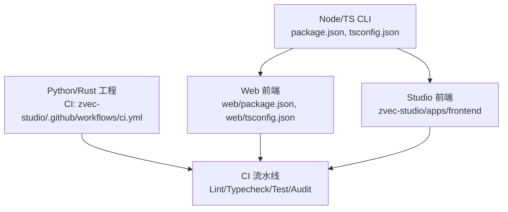
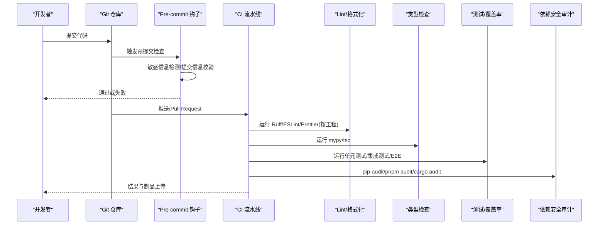
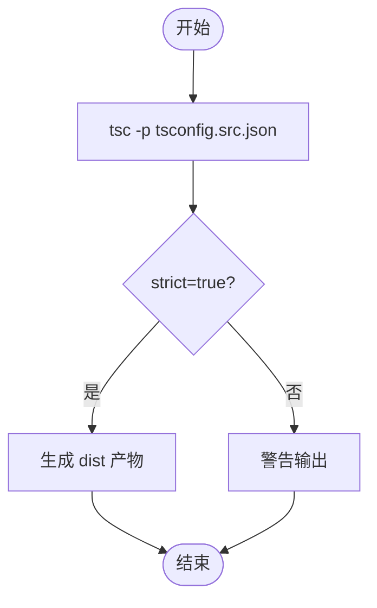
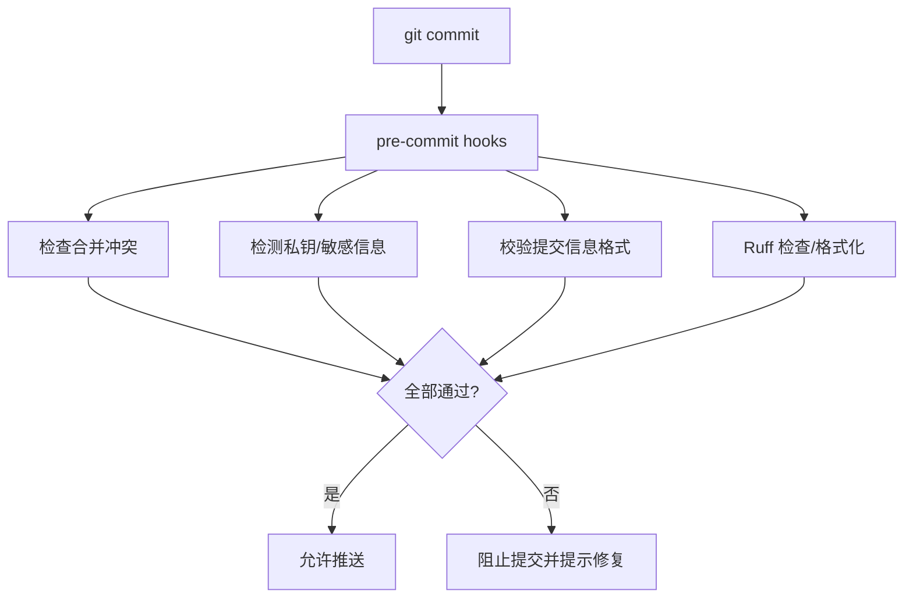
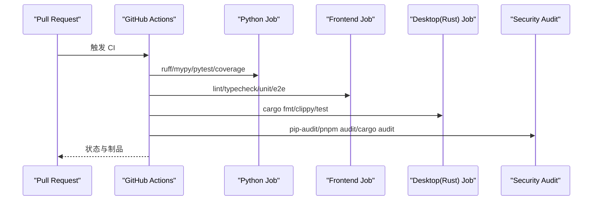
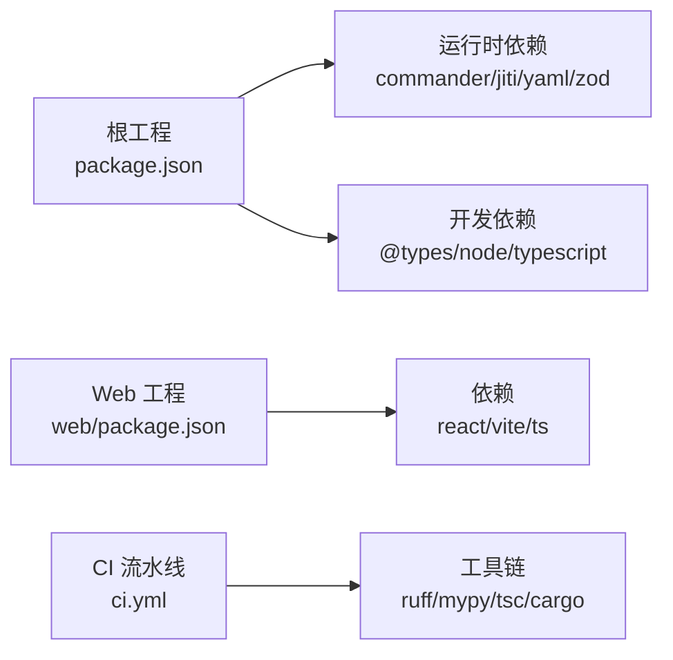

# 代码质量

<cite>
**本文引用的文件**
- [package.json](file://package.json)
- [tsconfig.json](file://tsconfig.json)
- [web/package.json](file://web/package.json)
- [web/tsconfig.json](file://web/tsconfig.json)
- [.pre-commit-config.yaml](file://test_data/bk-monitor-wiki/.pre-commit-config.yaml)
- [zvec-mcp-server/.pre-commit-config.yaml](file://zvec-mcp-server/.pre-commit-config.yaml)
- [zvec-studio/.github/workflows/ci.yml](file://zvec-studio/.github/workflows/ci.yml)
- [zvec-studio/.prettierrc.json](file://zvec-studio/.prettierrc.json)
</cite>

## 目录
1. [简介](#简介)
2. [项目结构](#项目结构)
3. [核心组件](#核心组件)
4. [架构总览](#架构总览)
5. [详细组件分析](#详细组件分析)
6. [依赖关系分析](#依赖关系分析)
7. [性能考虑](#性能考虑)
8. [故障排查指南](#故障排查指南)
9. [结论](#结论)
10. [附录](#附录)

## 简介
本指南面向 TypeScript/Node.js 与前端工程的质量保障，覆盖代码风格检查、格式化工具配置、静态类型检查、提交前钩子、持续集成中的质量门禁、依赖安全扫描与漏洞检测、复杂度分析与重构建议，以及开发环境中的实时质量反馈。目标是帮助团队在本地与 CI 中形成一致、可重复、可度量的质量闭环。

## 项目结构
仓库包含多个子工程：
- Node/TS CLI 工程（根目录）：提供构建脚本、测试脚本与 TS 编译配置。
- Web 前端工程（web/）：基于 Vite + React，提供类型检查与构建脚本。
- Studio 前端（zvec-studio/apps/frontend）：具备独立的 lint/typecheck/test 流程，并在 CI 中执行。
- Python/Rust 相关工程：在 CI 中统一进行 lint、类型检查、测试与安全审计。

**图表来源**
- [package.json:9-32](file://package.json#L9-L32)
- [web/package.json:6-10](file://web/package.json#L6-L10)
- [zvec-studio/.github/workflows/ci.yml:13-196](file://zvec-studio/.github/workflows/ci.yml#L13-L196)

**章节来源**
- [package.json:9-32](file://package.json#L9-L32)
- [web/package.json:6-10](file://web/package.json#L6-L10)
- [zvec-studio/.github/workflows/ci.yml:13-196](file://zvec-studio/.github/workflows/ci.yml#L13-L196)

## 核心组件
- TypeScript 编译与严格模式：通过 tsconfig 启用严格类型检查，确保类型安全与一致性。
- 脚本命令：在 package.json 中定义 build/test 等命令，便于本地与 CI 复用。
- 前端类型检查：web 工程通过 tsc --noEmit 进行纯类型检查，不产出产物，适合快速反馈。
- 提交前钩子：使用 pre-commit 统一执行敏感信息检测、提交信息规范检查等。
- 持续集成：GitHub Actions 在多语言环境下执行 lint、typecheck、测试、覆盖率门禁与安全审计。

**章节来源**
- [tsconfig.json:2-15](file://tsconfig.json#L2-L15)
- [package.json:9-32](file://package.json#L9-L32)
- [web/tsconfig.json:2-24](file://web/tsconfig.json#L2-L24)
- [web/package.json:6-10](file://web/package.json#L6-L10)
- [.pre-commit-config.yaml:1-36](file://test_data/bk-monitor-wiki/.pre-commit-config.yaml#L1-L36)
- [zvec-studio/.github/workflows/ci.yml:13-196](file://zvec-studio/.github/workflows/ci.yml#L13-L196)

## 架构总览
下图展示从开发者提交到 CI 质量门禁的完整流程，包括本地预检与远程流水线。

**图表来源**
- [.pre-commit-config.yaml:1-36](file://test_data/bk-monitor-wiki/.pre-commit-config.yaml#L1-L36)
- [zvec-studio/.github/workflows/ci.yml:13-196](file://zvec-studio/.github/workflows/ci.yml#L13-L196)
- [zvec-studio/.github/workflows/ci.yml:229-272](file://zvec-studio/.github/workflows/ci.yml#L229-L272)

## 详细组件分析

### TypeScript 编译与严格模式
- 目标与模块：设置 ES2022 目标与模块解析策略，保证现代语法与工具链兼容。
- 严格模式：启用 strict，并关闭库检查以提升构建速度；包含 src 目录，排除 node_modules、dist、kb、test。
- 前端类型检查：web 工程启用 noUnusedLocals/noUnusedParameters/noFallthroughCasesInSwitch，配合 isolatedModules 与 noEmit 实现快速类型检查。

**图表来源**
- [tsconfig.json:2-15](file://tsconfig.json#L2-L15)
- [web/tsconfig.json:2-24](file://web/tsconfig.json#L2-L24)

**章节来源**
- [tsconfig.json:2-15](file://tsconfig.json#L2-L15)
- [web/tsconfig.json:2-24](file://web/tsconfig.json#L2-L24)

### 脚本命令与本地工作流
- 根工程：提供 build、test 系列命令，便于本地开发与 CI 复用。
- Web 工程：提供 dev/build/preview/typecheck 命令，支持热更新与类型检查。
- 建议：将 lint/format/typecheck/test 纳入统一的 npm/yarn/pnpm scripts，减少环境差异。

**章节来源**
- [package.json:9-32](file://package.json#L9-L32)
- [web/package.json:6-10](file://web/package.json#L6-L10)

### 提交前钩子（Pre-commit）
- 通用检查：合并冲突检测、私钥泄露检测。
- 自定义检查：敏感信息检测（API Key/Token）、提交信息格式校验（Conventional Commits）。
- Python 工程：Ruff 检查与格式化。

**图表来源**
- [.pre-commit-config.yaml:1-36](file://test_data/bk-monitor-wiki/.pre-commit-config.yaml#L1-L36)
- [zvec-mcp-server/.pre-commit-config.yaml:1-8](file://zvec-mcp-server/.pre-commit-config.yaml#L1-L8)

**章节来源**
- [.pre-commit-config.yaml:1-36](file://test_data/bk-monitor-wiki/.pre-commit-config.yaml#L1-L36)
- [zvec-mcp-server/.pre-commit-config.yaml:1-8](file://zvec-mcp-server/.pre-commit-config.yaml#L1-L8)

### 持续集成（CI）质量门禁
- 多语言矩阵：Python（多版本）、Node（多版本）、Rust（clippy/rustfmt）。
- 质量步骤：
  - Lint：ruff check、前端 lint。
  - 类型检查：mypy、tsc。
  - 测试：单元/集成/契约/E2E，输出 JUnit XML。
  - 覆盖率门禁：覆盖率阈值控制。
  - 安全审计：pip-audit、pnpm audit、cargo audit。
- 制品上传：失败时保留诊断信息与报告。

**图表来源**
- [zvec-studio/.github/workflows/ci.yml:13-196](file://zvec-studio/.github/workflows/ci.yml#L13-L196)
- [zvec-studio/.github/workflows/ci.yml:229-272](file://zvec-studio/.github/workflows/ci.yml#L229-L272)

**章节来源**
- [zvec-studio/.github/workflows/ci.yml:13-196](file://zvec-studio/.github/workflows/ci.yml#L13-L196)
- [zvec-studio/.github/workflows/ci.yml:229-272](file://zvec-studio/.github/workflows/ci.yml#L229-L272)

### 代码风格与格式化
- 前端 Prettier 配置：分号、单引号、尾随逗号、行宽、缩进、箭头函数括号、换行符。
- 建议：在编辑器中启用保存时自动格式化，结合 ESLint 规则避免风格冲突。

**章节来源**
- [zvec-studio/.prettierrc.json:1-10](file://zvec-studio/.prettierrc.json#L1-L10)

### 静态代码分析与类型检查
- Python：Ruff 检查与格式化，Mypy 类型检查。
- Node/TS：tsc 严格模式与 noEmit 类型检查。
- Rust：rustfmt 与 clippy 检查。

**章节来源**
- [zvec-mcp-server/.pre-commit-config.yaml:1-8](file://zvec-mcp-server/.pre-commit-config.yaml#L1-L8)
- [zvec-studio/.github/workflows/ci.yml:33-39](file://zvec-studio/.github/workflows/ci.yml#L33-L39)
- [zvec-studio/.github/workflows/ci.yml:146-156](file://zvec-studio/.github/workflows/ci.yml#L146-L156)
- [web/tsconfig.json:2-24](file://web/tsconfig.json#L2-L24)

### 依赖安全扫描与漏洞检测
- Python：pip-audit 扫描高/严重级别漏洞，必要时 dry-run 修复。
- Node：pnpm audit 限制审计级别。
- Rust：cargo audit 扫描依赖漏洞。
- 建议：在 CI 中将高/严重级别设为阻断条件，并定期升级依赖。

**章节来源**
- [zvec-studio/.github/workflows/ci.yml:229-272](file://zvec-studio/.github/workflows/ci.yml#L229-L272)

### 代码审查清单与质量门禁示例
- 审查要点：
  - 是否通过所有 lint/typecheck/test？
  - 是否新增敏感信息或密钥？
  - 提交信息是否符合规范？
  - 是否引入新的依赖？是否通过安全审计？
  - 变更是否影响性能或稳定性？
- 质量门禁：
  - 覆盖率阈值（例如 60%）。
  - 高/严重漏洞为阻断项。
  - 提交信息必须签名（DCO）。

**章节来源**
- [zvec-studio/.github/workflows/ci.yml:53-55](file://zvec-studio/.github/workflows/ci.yml#L53-L55)
- [zvec-studio/.github/workflows/ci.yml:370-389](file://zvec-studio/.github/workflows/ci.yml#L370-L389)

### 复杂度分析与重构建议
- 指标建议：圈复杂度、认知复杂度、函数长度、嵌套深度。
- 工具建议：
  - TypeScript：ESLint 插件（如 @typescript-eslint/complexity）统计复杂度。
  - Python：Ruff 复杂度规则或 pylint 插件。
  - Rust：Clippy 与 rustc 警告。
- 重构建议：
  - 拆分长函数与复杂分支。
  - 提取公共逻辑为独立模块。
  - 使用守卫语句减少嵌套。
  - 对高风险模块补充单测与集成测试。

[本节为通用指导，不直接分析具体文件]

### 开发环境中的实时质量反馈
- 编辑器集成：
  - VS Code：安装 TypeScript/ESLint/Prettier/Ruff/Mypy 扩展，开启保存时格式化与错误提示。
  - 快捷键：保存时自动格式化，错误即时标红。
- 本地脚本：
  - 运行 tsc --noEmit 快速类型检查。
  - 运行 ruff check 与 ruff format。
  - 运行 pnpm test 或对应测试命令。
- 预提交钩子：
  - 安装 pre-commit 并配置 hooks，确保提交前完成基础检查。

**章节来源**
- [web/package.json:6-10](file://web/package.json#L6-L10)
- [zvec-mcp-server/.pre-commit-config.yaml:1-8](file://zvec-mcp-server/.pre-commit-config.yaml#L1-L8)
- [.pre-commit-config.yaml:1-36](file://test_data/bk-monitor-wiki/.pre-commit-config.yaml#L1-L36)

## 依赖关系分析
- 根工程依赖：commander、jiti、yaml、zod 等运行时依赖；@types/node、typescript 作为开发依赖。
- Web 工程依赖：React、Vite、TypeScript、Mermaid、Marked 等；开发依赖用于构建与类型检查。
- CI 依赖：GitHub Actions 官方 action、各语言工具链（Python/Node/Rust）。

**图表来源**
- [package.json:42-66](file://package.json#L42-L66)
- [web/package.json:12-28](file://web/package.json#L12-L28)
- [zvec-studio/.github/workflows/ci.yml:13-196](file://zvec-studio/.github/workflows/ci.yml#L13-L196)

**章节来源**
- [package.json:42-66](file://package.json#L42-L66)
- [web/package.json:12-28](file://web/package.json#L12-L28)
- [zvec-studio/.github/workflows/ci.yml:13-196](file://zvec-studio/.github/workflows/ci.yml#L13-L196)

## 性能考虑
- 类型检查优化：使用 isolatedModules 与 skipLibCheck 提升构建速度。
- 并行任务：CI 中使用矩阵并行执行不同语言/平台的任务。
- 缓存：利用 GitHub Actions 缓存（pip/pnpm/rust-cache）加速依赖安装与编译。
- 增量检查：在本地优先运行 tsc --noEmit 与 ruff check，减少 CI 压力。

[本节为通用指导，不直接分析具体文件]

## 故障排查指南
- 提交被拒绝：
  - 检查 pre-commit 钩子输出，定位敏感信息或提交信息问题。
  - 确认 ruff/eslint 规则是否通过。
- CI 失败：
  - 查看对应 job 的日志与上传的制品（JUnit XML、覆盖率报告、Playwright 报告）。
  - 针对类型错误或测试失败，优先在本地复现并修复。
- 安全审计失败：
  - 根据 pip-audit/pnpm audit/cargo audit 输出升级或替换存在漏洞的依赖。
  - 若为误报，评估风险并记录豁免原因。

**章节来源**
- [.pre-commit-config.yaml:1-36](file://test_data/bk-monitor-wiki/.pre-commit-config.yaml#L1-L36)
- [zvec-studio/.github/workflows/ci.yml:57-63](file://zvec-studio/.github/workflows/ci.yml#L57-L63)
- [zvec-studio/.github/workflows/ci.yml:229-272](file://zvec-studio/.github/workflows/ci.yml#L229-L272)

## 结论
通过在本地与 CI 中统一配置 TypeScript 严格模式、提交前钩子、多语言 lint/typecheck/test、覆盖率门禁与安全审计，可以显著提升代码质量与交付可靠性。建议持续完善复杂度度量与重构计划，保持代码库的可维护性与安全性。

## 附录
- 常用命令参考：
  - 根工程：build、test、test:*
  - Web 工程：dev、build、typecheck
  - Python：ruff check、ruff format、mypy
  - Rust：cargo fmt、cargo clippy、cargo test
  - 安全审计：pip-audit、pnpm audit、cargo audit

**章节来源**
- [package.json:9-32](file://package.json#L9-L32)
- [web/package.json:6-10](file://web/package.json#L6-L10)
- [zvec-mcp-server/.pre-commit-config.yaml:1-8](file://zvec-mcp-server/.pre-commit-config.yaml#L1-L8)
- [zvec-studio/.github/workflows/ci.yml:13-196](file://zvec-studio/.github/workflows/ci.yml#L13-L196)
- [zvec-studio/.github/workflows/ci.yml:229-272](file://zvec-studio/.github/workflows/ci.yml#L229-L272)