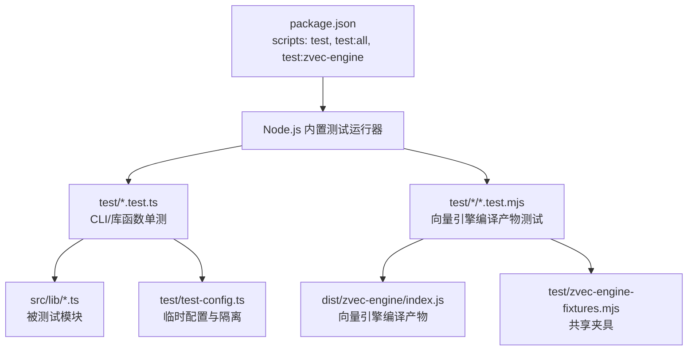
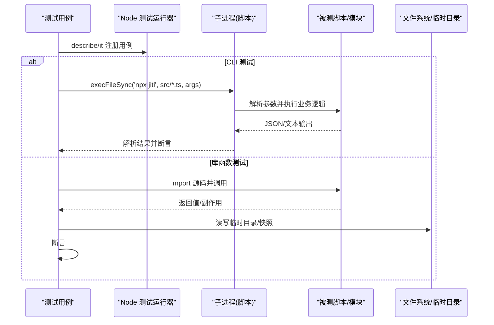
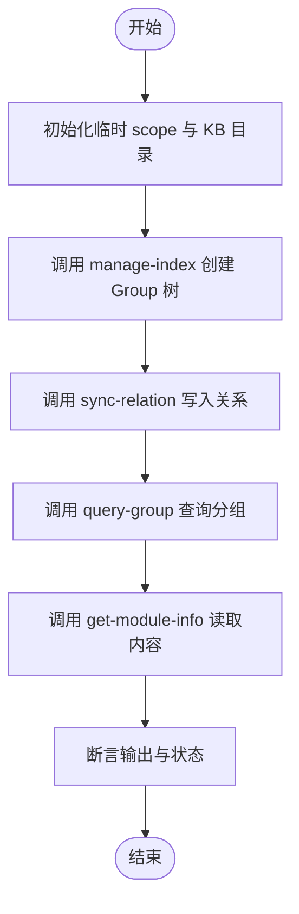
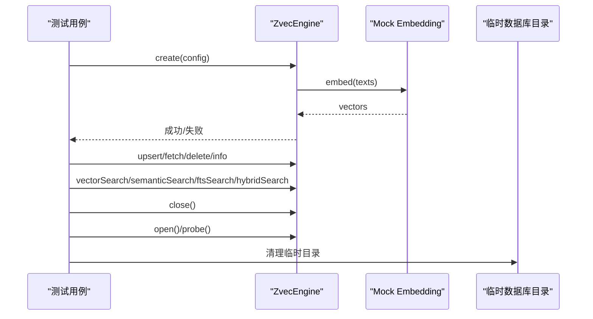
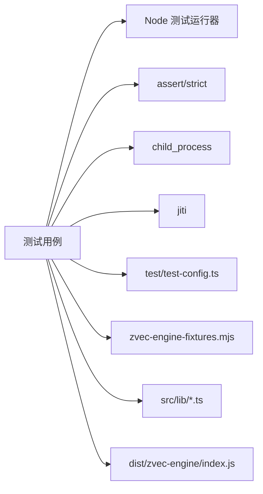

# 单元测试

<cite>
**本文引用的文件**
- [package.json](file://package.json)
- [tsconfig.json](file://tsconfig.json)
- [test-config.ts](file://test/test-config.ts)
- [integration.test.ts](file://test/integration.test.ts)
- [error-handling.test.ts](file://test/error-handling.test.ts)
- [manage-index.test.ts](file://test/manage-index.test.ts)
- [zvec-engine.test.mjs](file://test/zvec-engine.test.mjs)
- [zvec-engine-fixtures.mjs](file://test/zvec-engine-fixtures.mjs)
- [chunker.test.ts](file://test/chunker.test.ts)
- [clean.test.ts](file://test/clean.test.ts)
- [mcp-token.test.ts](file://test/mcp-token.test.ts)
- [e2e-guide.md](file://test/e2e-guide.md)
</cite>

## 目录
1. [简介](#简介)
2. [项目结构](#项目结构)
3. [核心组件](#核心组件)
4. [架构总览](#架构总览)
5. [详细组件分析](#详细组件分析)
6. [依赖关系分析](#依赖关系分析)
7. [性能考虑](#性能考虑)
8. [故障排查指南](#故障排查指南)
9. [结论](#结论)
10. [附录](#附录)

## 简介
本指南面向 TypeScript/Node.js 环境下的单元测试实践，结合仓库现有测试体系，系统说明：
- 测试框架与运行方式（基于 Node.js 内置 test runner）
- TypeScript 测试环境配置要点
- 高质量测试用例设计、Mock 策略与断言方法
- 覆盖 CLI 命令、搜索流程、向量引擎等核心模块的测试实现
- 测试数据准备与清理策略
- 异步测试、错误处理测试与边界条件测试最佳实践
- 覆盖率统计与报告生成建议

## 项目结构
仓库采用“按功能组织”的测试布局：
- 单测脚本集中在 test/ 目录，文件名以 .test.ts 或 .test.mjs 结尾
- 端到端验证文档位于 test/e2e-guide.md
- 共享夹具与辅助模块在 test/ 下（如 zvec-engine-fixtures.mjs、test-config.ts）
- 通过 package.json scripts 统一执行单测与 E2E

图表来源
- [package.json:9-32](file://package.json#L9-L32)
- [test/test-config.ts:1-92](file://test/test-config.ts#L1-L92)
- [test/zvec-engine-fixtures.mjs:1-66](file://test/zvec-engine-fixtures.mjs#L1-L66)

章节来源
- [package.json:9-32](file://package.json#L9-L32)
- [tsconfig.json:1-16](file://tsconfig.json#L1-L16)

## 核心组件
- 测试运行器：Node.js 内置 test runner（describe/it/test），无需额外框架
- 断言库：node:assert/strict
- 子进程调用：child_process.execFileSync 用于驱动 CLI 脚本
- 配置隔离：test/test-config.ts 为每个测试进程创建临时配置文件与临时数据目录
- 向量引擎夹具：test/zvec-engine-fixtures.mjs 提供固定维度、mock 嵌入与建库配置

章节来源
- [integration.test.ts:11-17](file://test/integration.test.ts#L11-L17)
- [error-handling.test.ts:5-11](file://test/error-handling.test.ts#L5-L11)
- [test-config.ts:1-92](file://test/test-config.ts#L1-L92)
- [zvec-engine-fixtures.mjs:1-66](file://test/zvec-engine-fixtures.mjs#L1-L66)

## 架构总览
下图展示从测试入口到被测模块的数据与控制流。CLI 类测试通过子进程启动脚本，库函数类测试直接 import 源码；向量引擎测试针对编译产物进行冒烟与异常路径验证。

图表来源
- [integration.test.ts:21-40](file://test/integration.test.ts#L21-L40)
- [error-handling.test.ts:15-30](file://test/error-handling.test.ts#L15-L30)
- [manage-index.test.ts:24-42](file://test/manage-index.test.ts#L24-L42)

## 详细组件分析

### 测试环境与配置
- 使用 Node.js 内置 test runner，无需 jest/vitest
- TypeScript 通过 jiti 在运行时转译，避免构建前置成本
- 测试配置隔离：
  - 为每个测试进程创建临时配置文件，设置 dataDir/vectorDir/backupDir
  - 通过环境变量 KI_CONFIG_PATH 注入
  - 提供 registerTestScope/getTestEnv/cleanupTestConfig 等工具函数
- 向量引擎测试使用编译产物 dist/zvec-engine/index.js，并通过 fixtures 提供稳定夹具

章节来源
- [package.json:9-32](file://package.json#L9-L32)
- [tsconfig.json:1-16](file://tsconfig.json#L1-L16)
- [test-config.ts:1-92](file://test/test-config.ts#L1-L92)
- [zvec-engine.test.mjs:19-64](file://test/zvec-engine.test.mjs#L19-L64)
- [zvec-engine-fixtures.mjs:1-66](file://test/zvec-engine-fixtures.mjs#L1-L66)

### CLI 命令测试（管理索引、同步关系、查询、读取模块信息）
- 通过封装 runScript/runScriptJson 调用 npx jiti 执行 src 下的脚本
- 使用临时 scope 与 KB 目录，确保测试隔离
- 覆盖快速路径、检索回退、知识缺失、导入直导等场景
- 断言包括返回码、JSON 字段、输出文本片段

图表来源
- [integration.test.ts:82-211](file://test/integration.test.ts#L82-L211)
- [integration.test.ts:213-317](file://test/integration.test.ts#L213-L317)
- [integration.test.ts:319-356](file://test/integration.test.ts#L319-L356)

章节来源
- [integration.test.ts:21-40](file://test/integration.test.ts#L21-L40)
- [integration.test.ts:82-211](file://test/integration.test.ts#L82-L211)
- [integration.test.ts:213-317](file://test/integration.test.ts#L213-L317)
- [integration.test.ts:319-356](file://test/integration.test.ts#L319-L356)

### 错误处理与边界条件测试
- 参数校验：非法 scope、非法 mode、空 module-info、缺少必需参数
- 数据结构异常：损坏 group-index.json、relations-cache 缺失
- 本地 KB 缺失：get-module-info 报错
- 导入异常：source 不存在、无 .md 文件、缺省 --group 行为
- 断言策略：统一解析 JSON 输出，失败时捕获 stdout/stderr 并断言 error 字段

章节来源
- [error-handling.test.ts:45-106](file://test/error-handling.test.ts#L45-L106)
- [error-handling.test.ts:108-147](file://test/error-handling.test.ts#L108-L147)
- [error-handling.test.ts:149-174](file://test/error-handling.test.ts#L149-L174)

### 向量引擎测试（ZvecEngine）
- 使用编译产物 dist/zvec-engine/index.js，通过 fixtures 提供固定维度与 mock 嵌入
- 覆盖 Schema 校验、Filter 编译、全链路 CRUD、检索四类（vector/semantic/fts/hybrid）、close/reopen/probe、异常分支（embedding 失败、预计算 vector 不受影响）
- 使用 assert.rejects 验证异常类型与消息

图表来源
- [zvec-engine.test.mjs:68-94](file://test/zvec-engine.test.mjs#L68-L94)
- [zvec-engine.test.mjs:111-199](file://test/zvec-engine.test.mjs#L111-L199)
- [zvec-engine.test.mjs:201-258](file://test/zvec-engine.test.mjs#L201-L258)
- [zvec-engine.test.mjs:260-333](file://test/zvec-engine.test.mjs#L260-L333)
- [zvec-engine-fixtures.mjs:1-66](file://test/zvec-engine-fixtures.mjs#L1-L66)

章节来源
- [zvec-engine.test.mjs:19-64](file://test/zvec-engine.test.mjs#L19-L64)
- [zvec-engine.test.mjs:68-94](file://test/zvec-engine.test.mjs#L68-L94)
- [zvec-engine.test.mjs:111-199](file://test/zvec-engine.test.mjs#L111-L199)
- [zvec-engine.test.mjs:201-258](file://test/zvec-engine.test.mjs#L201-L258)
- [zvec-engine.test.mjs:260-333](file://test/zvec-engine.test.mjs#L260-L333)
- [zvec-engine-fixtures.mjs:1-66](file://test/zvec-engine-fixtures.mjs#L1-L66)

### 文本切分与清洗测试
- chunker：验证切分契约（份数=ceil(字符数/chunkSize)、段落优先、硬切兜底、overlap、index 递增、MAX_CHUNKS_PER_FILE）
- clean：验证内置规则（BOM/frontmatter/htmlComment/mermaid/codeBlock/codePath/空行折叠）、执行顺序约束、parseCleanRules 解析

章节来源
- [chunker.test.ts:1-100](file://test/chunker.test.ts#L1-L100)
- [clean.test.ts:1-140](file://test/clean.test.ts#L1-L140)

### 安全与令牌测试（示例）
- 强随机 token 生成、短 ID、scope 授权、文件权限 0600 等
- 通过 beforeEach/afterEach 管理临时目录与资源清理

章节来源
- [mcp-token.test.ts:1-53](file://test/mcp-token.test.ts#L1-L53)

### 端到端测试参考
- e2e-guide.md 提供了完整的外部 wiki 模拟数据与操作序列，可用于手工或自动化验证
- 适用于需要真实流程验证的场景（如增量导入、备份还原、导出等）

章节来源
- [e2e-guide.md:1-1024](file://test/e2e-guide.md#L1-L1024)

## 依赖关系分析
- 测试脚本依赖 Node.js 内置 test runner 与 assert/strict
- CLI 测试依赖 child_process 与 jiti 动态加载 src 脚本
- 向量引擎测试依赖编译产物 dist/zvec-engine/index.js
- 测试配置与夹具集中管理，降低耦合度

图表来源
- [integration.test.ts:11-17](file://test/integration.test.ts#L11-L17)
- [error-handling.test.ts:5-11](file://test/error-handling.test.ts#L5-L11)
- [test-config.ts:1-92](file://test/test-config.ts#L1-L92)
- [zvec-engine-fixtures.mjs:1-66](file://test/zvec-engine-fixtures.mjs#L1-L66)

章节来源
- [package.json:9-32](file://package.json#L9-L32)
- [tsconfig.json:1-16](file://tsconfig.json#L1-L16)

## 性能考虑
- 使用 jiti 按需转译，减少构建开销
- 向量引擎测试使用内存/临时目录，避免外部依赖
- 批量操作（如 upsert）在测试中控制批次大小，关注失败粒度与重试策略
- 通过 fixtures 复用配置，减少重复构造开销

[本节为通用指导，不直接分析具体文件]

## 故障排查指南
- CLI 测试失败：检查子进程退出码与 stdout/stderr 解析逻辑
- 配置问题：确认 KI_CONFIG_PATH 指向临时配置，且 scope 已注册
- 向量引擎异常：检查 schema 维度、metric、fts 字段声明与 filter 白名单
- 数据残留：确保 after/afterEach 清理临时目录与 KB 数据

章节来源
- [integration.test.ts:66-80](file://test/integration.test.ts#L66-L80)
- [error-handling.test.ts:38-43](file://test/error-handling.test.ts#L38-L43)
- [zvec-engine.test.mjs:111-199](file://test/zvec-engine.test.mjs#L111-L199)

## 结论
本项目采用轻量、稳定的 Node.js 内置测试体系，配合完善的配置隔离与夹具机制，覆盖了 CLI、库函数与向量引擎的核心路径。遵循本文的实践可进一步提升测试质量与可维护性，并为后续扩展（覆盖率、并行化、更多边界场景）奠定基础。

## 附录

### 如何编写高质量单元测试
- 明确契约：先定义输入输出与异常，再实现断言
- 最小依赖：尽量直接 import 源码；对网络/IO 使用夹具或临时目录
- 可重复：每次测试独立环境，避免共享状态污染
- 可读性：用例命名清晰，断言贴近业务语义
- 覆盖异常：参数校验、缺失数据、损坏数据、超时/失败路径

### Mock 策略与断言方法
- 向量嵌入：使用固定维度与确定性 hash 向量，保证自检索 top1≈1
- HTTP 请求：通过 mock fetch 控制响应序列与错误
- 文件系统：使用 mkdtempSync 创建临时目录，after/afterEach 清理
- 断言：使用 assert.strictEqual/deepStrictEqual/rejects 等严格断言

### 异步测试、错误处理与边界条件
- 异步：使用 async/await 与 t.after 钩子管理资源
- 错误：用 assert.rejects 验证异常类型与消息
- 边界：空输入、超长文本、非法参数、并发竞争（如锁检测）

### 测试覆盖率统计与报告生成
- 当前仓库未集成覆盖率工具，可在 CI 中引入 istanbul/nyc 或 c8 对 Node 测试进行覆盖率统计
- 建议在 package.json 新增脚本，例如：
  - 运行测试并收集覆盖率：`node --test --experimental-test-coverage test/**/*.test.ts`
  - 生成 HTML 报告：通过 c8 或 nyc 输出后查看
- 注意：向量引擎测试针对编译产物，需确保构建产物存在后再运行

[本节为通用指导，不直接分析具体文件]