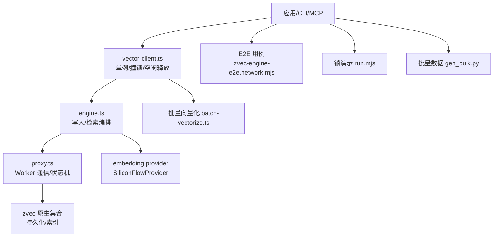
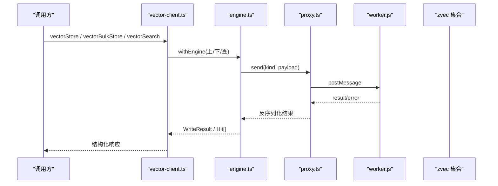
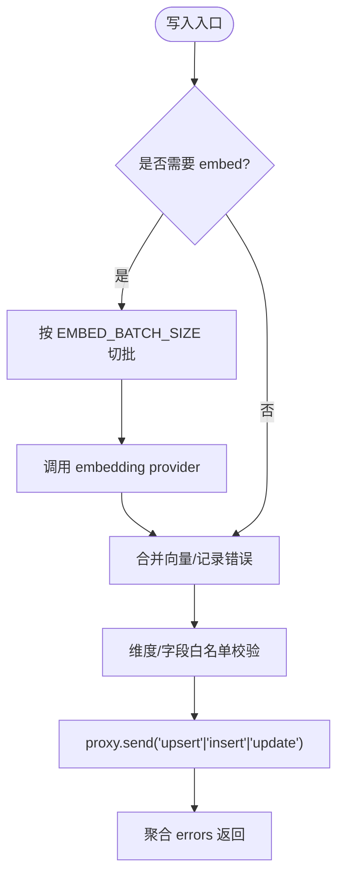
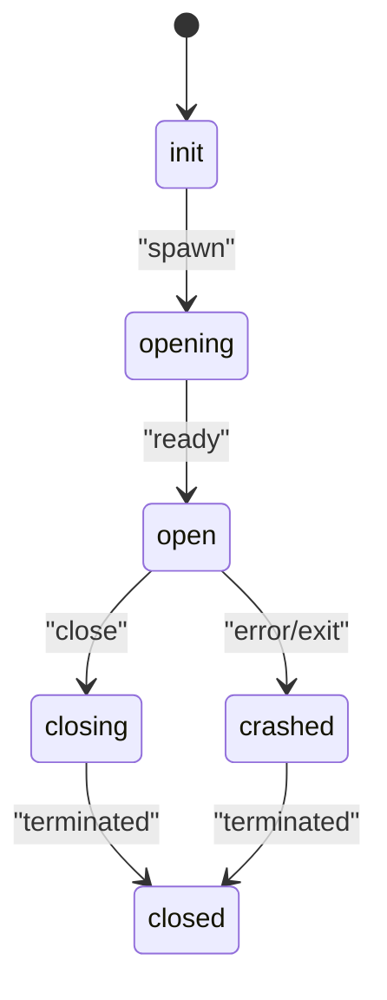
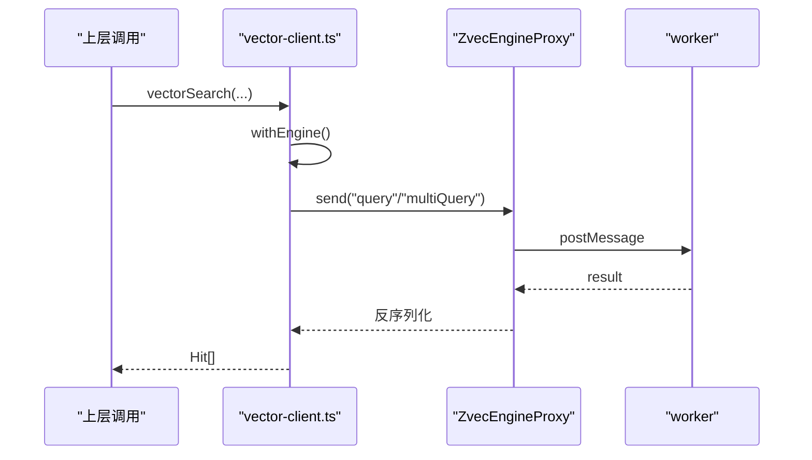
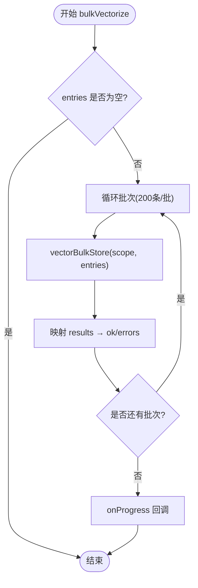
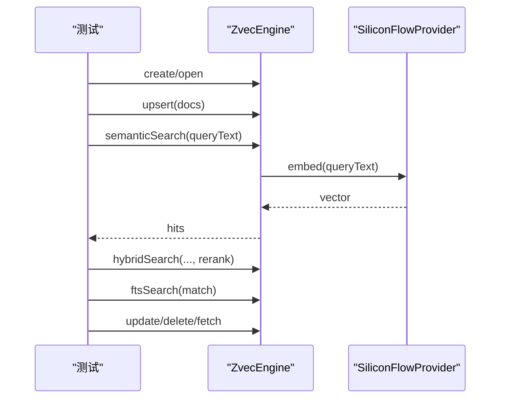
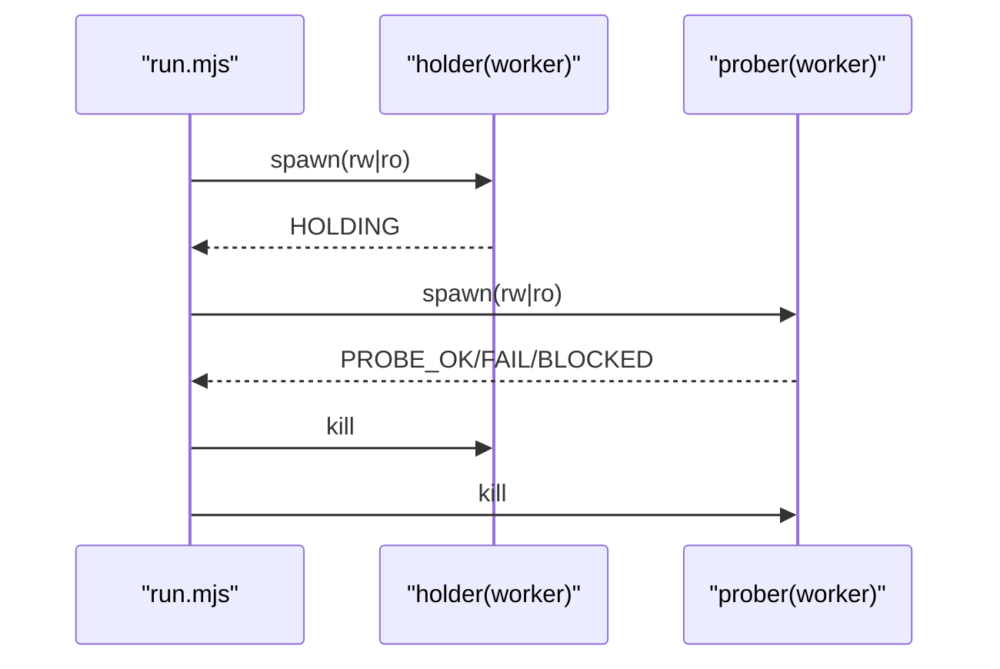
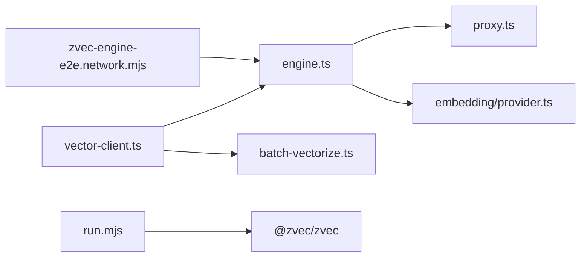

# 性能测试

<cite>
**本文引用的文件**
- [README.md](file://README.md)
- [engine.ts](file://src/zvec-engine/engine.ts)
- [proxy.ts](file://src/zvec-engine/proxy.ts)
- [vector-client.ts](file://src/lib/vector-client.ts)
- [batch-vectorize.ts](file://src/lib/batch-vectorize.ts)
- [zvec-engine-e2e.network.mjs](file://test/e2e/zvec-engine-e2e.network.mjs)
- [run.mjs](file://test/zvec-lock-demo/run.mjs)
- [gen_bulk.py](file://zvec-probe/gen_bulk.py)
- [mcp-stop.ts](file://src/lib/mcp-stop.ts)
</cite>

## 目录
1. [简介](#简介)
2. [项目结构](#项目结构)
3. [核心组件](#核心组件)
4. [架构总览](#架构总览)
5. [详细组件分析](#详细组件分析)
6. [依赖关系分析](#依赖关系分析)
7. [性能考量与优化](#性能考量与优化)
8. [故障排查指南](#故障排查指南)
9. [结论](#结论)
10. [附录](#附录)

## 简介
本指南面向向量引擎（基于 zvec）的性能测试与基准评估，覆盖查询延迟、吞吐量、内存使用等关键指标；在并发场景下关注锁竞争、资源争用与内存泄漏检测；提供批量操作优化策略；说明压力/负载测试实施方法；并给出性能回归检测与监控告警配置建议，以及性能分析工具的使用与结果解读。

## 项目结构
围绕向量引擎与上层适配层，仓库中与性能相关的关键路径如下：
- 向量引擎门面与编排：src/zvec-engine/engine.ts
- 主线程侧 Worker 代理：src/zvec-engine/proxy.ts
- 向量客户端适配（单例、撞锁重试、空闲释放锁）：src/lib/vector-client.ts
- 批量向量化封装：src/lib/batch-vectorize.ts
- 端到端真实 embedding 验收用例：test/e2e/zvec-engine-e2e.network.mjs
- 跨进程锁行为演示：test/zvec-lock-demo/run.mjs
- 批量数据生成脚本：zvec-probe/gen_bulk.py
- MCP 停止与锁清理：src/lib/mcp-stop.ts
- 项目概览与命令参考：README.md

图表来源
- [engine.ts:68-131](file://src/zvec-engine/engine.ts#L68-L131)
- [proxy.ts:44-126](file://src/zvec-engine/proxy.ts#L44-L126)
- [vector-client.ts:183-340](file://src/lib/vector-client.ts#L183-L340)
- [batch-vectorize.ts:129-182](file://src/lib/batch-vectorize.ts#L129-L182)
- [zvec-engine-e2e.network.mjs:106-147](file://test/e2e/zvec-engine-e2e.network.mjs#L106-L147)
- [run.mjs:10-18](file://test/zvec-lock-demo/run.mjs#L10-L18)
- [gen_bulk.py:1-18](file://zvec-probe/gen_bulk.py#L1-L18)

章节来源
- [README.md:35-54](file://README.md#L35-L54)

## 核心组件
- ZvecEngine（engine.ts）：对外暴露 create/open/probe 生命周期；upsert/insert/update/delete/fetch/listIds；semanticSearch/vectorSearch/ftsSearch/hybridSearch；createIndex/dropIndex/optimize。内部将 embed 失败粒度切到小批，聚合 errors，保证成功项正常写入。
- ZvecEngineProxy（proxy.ts）：维护 worker 生命周期与消息通道；spawn/close/terminate；drain 等待在途请求；crash 处理与状态机。
- Vector Adapter（vector-client.ts）：进程内 engine 单例；probeWithRetry 撞锁重试；enableIdleClose 空闲释放锁；withEngine 包装在途保护与自愈重试；统一 vectorStore/vectorBulkStore/vectorDelete 等接口。
- 批量向量化（batch-vectorize.ts）：bulkVectorize 按 200 条分批提交，共享一次 engine + 批量 embed；返回 ok/errors 明细。
- E2E 用例（zvec-engine-e2e.network.mjs）：真实 SiliconFlowProvider 端到端验证 upsert、自检索、FTS、hybrid、Recall@5、update、delete 等。
- 锁演示（run.mjs）：多进程持锁/探测组合，观察阻塞/失败/成功。
- 批量数据生成（gen_bulk.py）：从文档集抽取文本构造批量 JSON，用于压测导入。

章节来源
- [engine.ts:68-509](file://src/zvec-engine/engine.ts#L68-L509)
- [proxy.ts:44-277](file://src/zvec-engine/proxy.ts#L44-L277)
- [vector-client.ts:183-754](file://src/lib/vector-client.ts#L183-L754)
- [batch-vectorize.ts:23-182](file://src/lib/batch-vectorize.ts#L23-L182)
- [zvec-engine-e2e.network.mjs:106-279](file://test/e2e/zvec-engine-e2e.network.mjs#L106-L279)
- [run.mjs:10-78](file://test/zvec-lock-demo/run.mjs#L10-L78)
- [gen_bulk.py:1-18](file://zvec-probe/gen_bulk.py#L1-L18)

## 架构总览
向量引擎采用“主线程编排 + 独立 worker 持有集合句柄”的隔离模型。主线程负责参数校验、embed 批次化、filter 编译、路由与结果归一化；worker 负责底层集合读写与索引操作。向量客户端通过单例与串行化队列避免同进程并发 open 竞态，并提供撞锁重试与空闲释放锁能力，提升多实例共享向量库时的稳定性。

图表来源
- [vector-client.ts:389-407](file://src/lib/vector-client.ts#L389-L407)
- [engine.ts:454-495](file://src/zvec-engine/engine.ts#L454-L495)
- [proxy.ts:114-126](file://src/zvec-engine/proxy.ts#L114-L126)

## 详细组件分析

### 写入与检索编排（engine.ts）
- 写入流程：按是否需要 embed 拆分；对需要 embed 的文本按 EMBED_BATCH_SIZE 切小批，去重后调用 provider；失败记录 errors，成功项继续写入；最终合并 zvec 返回 errors。
- 检索流程：filter 编译 → routeSearch 路由 → 必要时 embed → 注入 filterSql → query/multiQuery → toHit 归一化。
- 关键常量：DEFAULT_WRITE_BATCH_SIZE=100，EMBED_BATCH_SIZE=64，DEFAULT_LIST_IDS_LIMIT=10000。

图表来源
- [engine.ts:330-449](file://src/zvec-engine/engine.ts#L330-L449)

章节来源
- [engine.ts:68-509](file://src/zvec-engine/engine.ts#L68-L509)

### Worker 代理与生命周期（proxy.ts）
- spawn：创建 worker，注册 message/error/exit 事件，发送 create/open 并等待 ready。
- send：为每个请求分配 id，挂起 pending Promise，postMessage 传输。
- close：drain 等待在途请求完成，再发送 close 并 terminate。
- crash：统一拒绝所有 pending，标记不可用。

图表来源
- [proxy.ts:44-177](file://src/zvec-engine/proxy.ts#L44-L177)

章节来源
- [proxy.ts:44-277](file://src/zvec-engine/proxy.ts#L44-L277)

### 向量客户端适配（vector-client.ts）
- 单例与串行化：_enginePromise 缓存；serializeEngineOp 串行化 probe/create/open/close，避免原生竞态。
- 撞锁重试：probeWithRetry 检测到 locked 时等待并重试，最多 LOCK_RETRY_MAX 次。
- 空闲释放锁：enableIdleClose 定时检查空闲超时，自动 closeEngine 释放 LOCK，供常驻 MCP 使用。
- withEngine：在途保护（_inFlightOps）+ 自愈重试（worker 不可用时重置并重开）。
- 存储/检索：vectorStore/vectorBulkStore/vectorDelete/vectorSearch 等统一封装。

图表来源
- [vector-client.ts:389-407](file://src/lib/vector-client.ts#L389-L407)
- [vector-client.ts:477-506](file://src/lib/vector-client.ts#L477-L506)

章节来源
- [vector-client.ts:183-754](file://src/lib/vector-client.ts#L183-L754)

### 批量向量化（batch-vectorize.ts）
- bulkVectorize：按 200 条分批提交，共享一次 engine + 批量 embed；每批完成后回调进度；失败条目进入 errors。
- batchVectorize：串行逐条 vectorizeOne，适合增量小批量。
- deleteMemory：按 docId 删除，支持增量 modify/delete。

图表来源
- [batch-vectorize.ts:129-182](file://src/lib/batch-vectorize.ts#L129-L182)

章节来源
- [batch-vectorize.ts:23-182](file://src/lib/batch-vectorize.ts#L23-L182)

### 端到端真实 embedding 验收（zvec-engine-e2e.network.mjs）
- setup：创建集合（含 fts=jieba），准备 20 篇中文技术文档。
- 用例：info、upsert、semanticSearch 自检索、不相关查询对比、ftsSearch 符号召回、hybridSearch 融合、Recall@5≥90%、fetch、update(text) 重嵌、update(仅 fields) 抛错、delete 计数下降。
- 安全：密钥来自环境变量，无密钥跳过网络测试。

图表来源
- [zvec-engine-e2e.network.mjs:106-279](file://test/e2e/zvec-engine-e2e.network.mjs#L106-L279)

章节来源
- [zvec-engine-e2e.network.mjs:106-279](file://test/e2e/zvec-engine-e2e.network.mjs#L106-L279)

### 跨进程锁行为演示（run.mjs）
- 编排器先建库并插入种子数据，再派生 holder 与 prober 子进程，以 rw/ro 四种组合观察锁行为。
- 通过输出 PROBE_OK/PROBE_FAIL/PROBE_BLOCKED 判定是否被阻塞或失败。

图表来源
- [run.mjs:10-78](file://test/zvec-lock-demo/run.mjs#L10-L78)

章节来源
- [run.mjs:10-78](file://test/zvec-lock-demo/run.mjs#L10-L78)

## 依赖关系分析
- engine.ts 依赖 proxy.ts、search/router、schema/validator、embedding/provider、errors/types。
- vector-client.ts 依赖 engine.ts、config/scope/interrupt，提供进程级单例与重试逻辑。
- batch-vectorize.ts 依赖 vector-client.ts，封装批量 embed + 写入。
- E2E 用例依赖 dist 构建产物中的 engine 与 provider。
- 锁演示依赖 @zvec/zvec 原生 API。

图表来源
- [engine.ts:13-66](file://src/zvec-engine/engine.ts#L13-L66)
- [vector-client.ts:16-33](file://src/lib/vector-client.ts#L16-L33)
- [batch-vectorize.ts:17-19](file://src/lib/batch-vectorize.ts#L17-L19)
- [zvec-engine-e2e.network.mjs:35-39](file://test/e2e/zvec-engine-e2e.network.mjs#L35-L39)
- [run.mjs:1-5](file://test/zvec-lock-demo/run.mjs#L1-L5)

章节来源
- [engine.ts:13-66](file://src/zvec-engine/engine.ts#L13-L66)
- [vector-client.ts:16-33](file://src/lib/vector-client.ts#L16-L33)
- [batch-vectorize.ts:17-19](file://src/lib/batch-vectorize.ts#L17-L19)
- [zvec-engine-e2e.network.mjs:35-39](file://test/e2e/zvec-engine-e2e.network.mjs#L35-L39)
- [run.mjs:1-5](file://test/zvec-lock-demo/run.mjs#L1-L5)

## 性能考量与优化
- 查询延迟
  - 使用 hybridSearch（语义 + FTS + RRF）提升召回质量与命中率，减少二次过滤开销。
  - 合理设置 topk、threshold，避免过大结果集导致排序与归一化耗时增加。
  - 利用 filter 下推缩小候选集，减少无效计算。
- 吞吐量
  - 批量写入：bulkVectorize 按 200 条分批，共享一次 engine + 批量 embed，显著降低 HTTP 与引擎开销。
  - 写入批次：engine 内部 DEFAULT_WRITE_BATCH_SIZE=100，平衡内存与 IO。
  - 嵌入批次：EMBED_BATCH_SIZE=64，控制单次 HTTP 调用大小，提高失败粒度和吞吐。
- 内存使用
  - 避免一次性加载超大文本（MAX_TEXT_LENGTH=50000），防止内存峰值。
  - 合理使用 includeVector=false 的 fetch，减少向量数据传输。
  - 启用 enableIdleClose 在常驻服务中空闲释放锁，避免长期占用资源。
- 并发与锁
  - 撞锁重试：probeWithRetry 在多实例共享向量库时自动退避重试，避免立即失败。
  - 串行化 open/create/close：serializeEngineOp 避免同进程并发原生操作导致的永久阻塞。
  - 多进程锁行为：通过 run.mjs 验证不同模式下的互斥效果，指导部署策略（读写分离、只读探测）。
- 批量优化策略
  - 优先使用 bulkVectorize；对大库分片导入，批间进度反馈便于观测。
  - 对重复 text 进行批内去重，减少冗余 embed 调用。
  - 结合 tag/scope 过滤，精准定位数据范围，减少扫描成本。
- 压力与负载测试
  - 使用 gen_bulk.py 生成大规模文本数据，配合 vectorBulkStore 进行导入压测。
  - 设计混合负载：写入（upsert/bulk）、检索（semantic/fts/hybrid）、管理（list/delete）混合比例，模拟真实场景。
  - 逐步加压：从低并发到高并发，观察延迟分布、吞吐、错误率与资源使用。
- 性能回归检测
  - 在 E2E 中加入 Recall@5≥90%、自检索 score≈1、不相关查询相对比值等断言，作为回归基线。
  - 定期运行网络 E2E（需 apiKey），比较历史指标，发现退化。
- 监控与告警
  - 在 withEngine 包装处可埋点：engine 获取耗时、请求耗时、错误率、重试次数。
  - 对 lock 重试次数、open 超时、worker 崩溃事件设置告警阈值。
  - 对批量导入失败率、embed 失败率设置告警，及时发现问题。
- 性能分析工具
  - Node 内置：--prof 生成 V8 快照，配合 chrome://inspect 或 node --prof-process 分析热点。
  - 系统级：perf、pidstat、top、iostat 观察 CPU/IO/内存瓶颈。
  - 网络：抓包或日志统计 embedding HTTP 调用耗时与失败率。
  - 结果解读：识别长尾延迟、GC 停顿、锁等待、I/O 阻塞等典型问题。

[本节为通用指导，不直接分析具体文件]

## 故障排查指南
- 向量库被占用
  - 现象：CollectionLockedException 或 probe 超时。
  - 处置：确认是否有 ki mcp/server 常驻进程；若无异常残留，稍后重试；必要时重建向量库。
  - 参考：lockedHint 提示与 ensureVectorAvailable 返回码。
- 向量库损坏
  - 现象：probe 返回 healthy=false。
  - 处置：执行恢复命令重建向量库。
- Worker 不可用
  - 现象：WorkerUnavailableError 或 "worker not open"。
  - 处置：withEngine 会自动重置并重试；若持续失败，检查 worker 进程与磁盘状态。
- 停止 MCP 实例
  - 使用 stopMcpInstances 优雅关闭并清理 lock；支持超时与 pid 存活检测。

章节来源
- [vector-client.ts:71-104](file://src/lib/vector-client.ts#L71-L104)
- [vector-client.ts:420-467](file://src/lib/vector-client.ts#L420-L467)
- [mcp-stop.ts:66-98](file://src/lib/mcp-stop.ts#L66-L98)

## 结论
本指南基于仓库现有实现，给出了向量引擎性能测试的系统方法：以 hybridSearch 为核心检索路径，结合批量写入与嵌入批次化提升吞吐；通过撞锁重试与空闲释放锁保障多实例稳定性；以 E2E 用例建立回归基线；借助系统与分析工具定位瓶颈。建议在 CI 中集成网络 E2E 与压测脚本，持续监控关键指标，确保性能稳定演进。

## 附录
- 快速开始与命令参考：见 README 中 CLI 与 MCP 启动方式。
- 批量数据生成：使用 gen_bulk.py 生成 N 条文本，配合 vectorBulkStore 导入。
- 锁行为验证：运行 test/zvec-lock-demo/run.mjs 观察不同模式下的锁表现。

章节来源
- [README.md:194-235](file://README.md#L194-L235)
- [gen_bulk.py:1-18](file://zvec-probe/gen_bulk.py#L1-L18)
- [run.mjs:10-78](file://test/zvec-lock-demo/run.mjs#L10-L78)