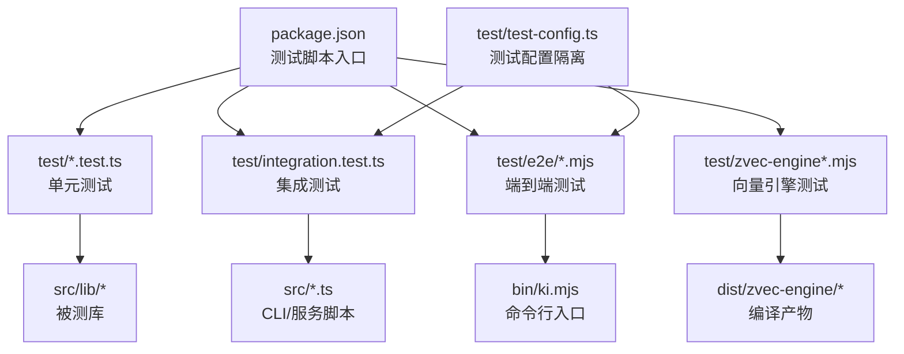
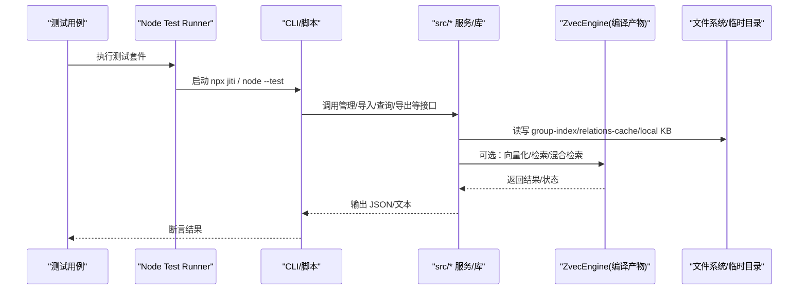
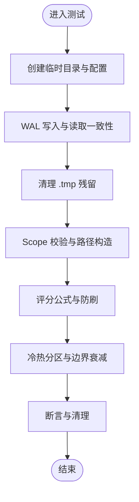
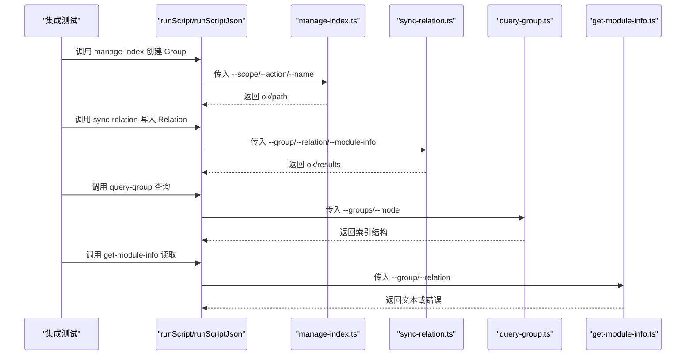
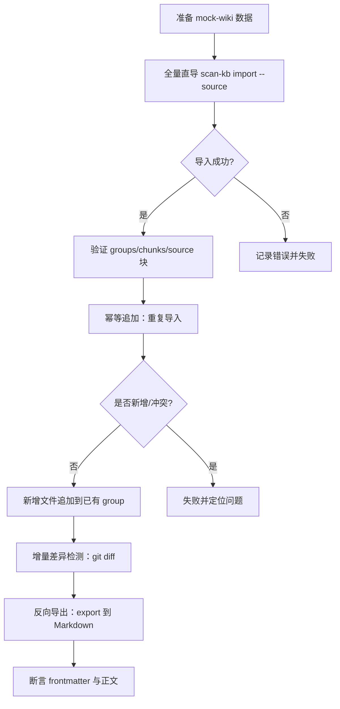
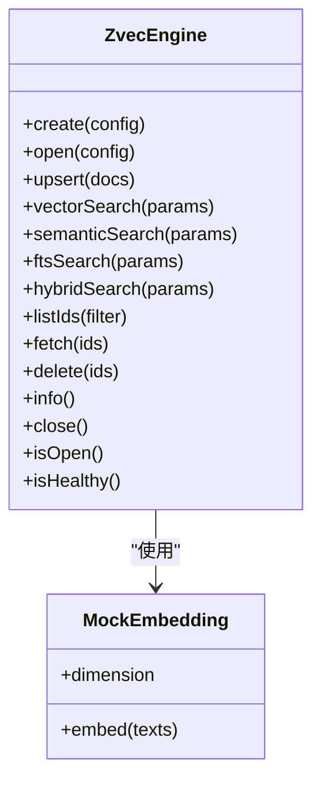
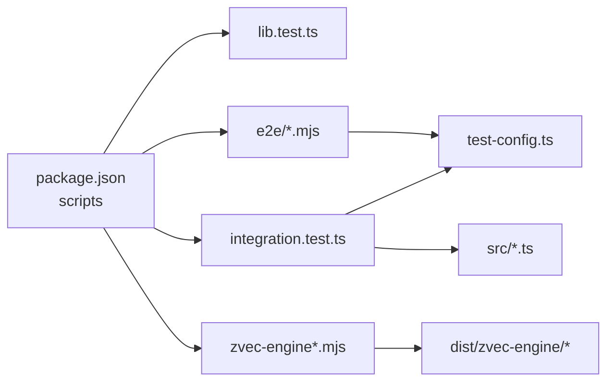

# 测试与质量保证

<cite>
**本文引用的文件**
- [package.json](file://package.json)
- [test-config.ts](file://test/test-config.ts)
- [integration.test.ts](file://test/integration.test.ts)
- [e2e-guide.md](file://test/e2e-guide.md)
- [lib.test.ts](file://test/lib.test.ts)
- [zvec-engine.test.mjs](file://test/zvec-engine.test.mjs)
- [e2e-bulk-import.test.mjs](file://test/e2e/e2e-bulk-import.test.mjs)
</cite>

## 目录
1. [简介](#简介)
2. [项目结构](#项目结构)
3. [核心组件](#核心组件)
4. [架构总览](#架构总览)
5. [详细组件分析](#详细组件分析)
6. [依赖关系分析](#依赖关系分析)
7. [性能考虑](#性能考虑)
8. [故障排查指南](#故障排查指南)
9. [结论](#结论)
10. [附录](#附录)

## 简介
本指南面向知识索引工具（kisearch）的测试与质量保证，覆盖单元测试、集成测试、端到端测试、性能与基准测试、代码质量检查与门禁、测试数据管理与 Mock 策略、持续集成与自动化测试配置示例，以及测试覆盖率统计与分析方法。文档基于仓库现有测试实现与脚本进行归纳与扩展建议，确保读者既能快速上手，也能在复杂场景下稳定运行与维护。

## 项目结构
仓库采用 Node.js + TypeScript 工程，测试体系围绕 Node 内置 test runner 组织：
- 根级 package.json 提供统一测试脚本入口，按功能域拆分命令，便于局部执行与 CI 编排。
- test/ 目录下包含：
  - 单元测试：针对 lib 层能力（WAL、评分、分区、边界衰减等）。
  - 集成测试：跨模块流程（manage-index → sync-relation → query-group → get-module-info）。
  - 端到端测试：通过 CLI 驱动真实导入、查询、导出、增量差异检测等完整链路。
  - 向量引擎测试：对编译产物 ZvecEngine 的冒烟与 E2E 验证。
- 测试辅助：
  - test-config.ts：为每个测试进程创建隔离的临时配置文件，动态注册 scope，注入环境变量，清理资源。
  - e2e-guide.md：端到端验证手册，包含 mock-wiki 数据说明、步骤化操作与断言要点。

图表来源
- [package.json:9-32](file://package.json#L9-L32)
- [test-config.ts:15-48](file://test/test-config.ts#L15-L48)

章节来源
- [package.json:9-32](file://package.json#L9-L32)

## 核心组件
- 测试框架与执行器
  - 使用 Node 内置 test runner（node:test），无需额外引入第三方框架。
  - 通过 package.json scripts 暴露细粒度测试命令，支持单测、集成、E2E、向量引擎测试分别执行。
- 测试配置与隔离
  - test-config.ts 为每个测试进程生成独立临时配置，避免污染用户环境；自动设置 KI_CONFIG_PATH，剥离 IDE 注入的环境变量，保证子进程行为一致。
- 测试数据与夹具
  - test/fixtures/mock-wiki 提供稳定的 Wiki 源数据，用于全量/增量导入与导出验证。
  - 集成测试中动态创建临时 KB 目录与 scope，并在 after 钩子中清理。
- 断言与校验
  - 使用 node:assert/strict 进行强类型断言，覆盖返回值、文件内容、状态码、错误信息等。

章节来源
- [package.json:9-32](file://package.json#L9-L32)
- [test-config.ts:15-48](file://test/test-config.ts#L15-L48)
- [integration.test.ts:11-17](file://test/integration.test.ts#L11-L17)
- [e2e-guide.md:51-80](file://test/e2e-guide.md#L51-L80)

## 架构总览
下图展示从测试入口到被测系统的调用链路与数据流，涵盖单元、集成、端到端与向量引擎测试的关键交互。

图表来源
- [integration.test.ts:21-40](file://test/integration.test.ts#L21-L40)
- [zvec-engine.test.mjs:19-64](file://test/zvec-engine.test.mjs#L19-L64)

## 详细组件分析

### 单元测试：lib 层能力
- 覆盖范围
  - WAL 写入与残留清理：验证原子写入、无 .tmp 残留、覆盖写一致性。
  - Scope 校验：合法/非法 scope 路径校验与路径构造函数正确性。
  - 评分公式与防刷：calculateScore 在不同 useCount/时间衰减下的表现；recordUse 防刷与上限控制。
  - 冷热分区与边界衰减：hybridPartition 分区与截断；boundaryDecay 触发条件与步长配置。
- 关键实践
  - 使用临时目录隔离数据，before/after 钩子完成初始化与清理。
  - 纯函数测试不修改输入，确保可重复性与稳定性。
  - 断言数值区间与边界条件，兼顾精度与鲁棒性。

图表来源
- [lib.test.ts:30-44](file://test/lib.test.ts#L30-L44)
- [lib.test.ts:48-96](file://test/lib.test.ts#L48-L96)
- [lib.test.ts:100-122](file://test/lib.test.ts#L100-L122)
- [lib.test.ts:126-169](file://test/lib.test.ts#L126-L169)
- [lib.test.ts:171-215](file://test/lib.test.ts#L171-L215)
- [lib.test.ts:217-323](file://test/lib.test.ts#L217-L323)

章节来源
- [lib.test.ts:30-44](file://test/lib.test.ts#L30-L44)
- [lib.test.ts:48-96](file://test/lib.test.ts#L48-L96)
- [lib.test.ts:100-122](file://test/lib.test.ts#L100-L122)
- [lib.test.ts:126-169](file://test/lib.test.ts#L126-L169)
- [lib.test.ts:171-215](file://test/lib.test.ts#L171-L215)
- [lib.test.ts:217-323](file://test/lib.test.ts#L217-L323)

### 集成测试：跨模块流程
- 覆盖范围
  - 快速路径：manage-index → sync-relation → query-group → get-module-info。
  - 检索回退：查询不存在 Group/Relation 的降级与错误提示。
  - 知识缺失：本地 KB 或 relations-cache 缺失时的错误处理。
  - 导入路径：scan-kb import --source 直导（full/incremental），验证 chunk 切分与 source 块持久化。
- 关键实践
  - 通过 registerTestScope/getTestEnv 动态注册 scope 并注入隔离环境。
  - 使用 execFileSync 调用脚本，捕获 stdout 与 status，解析 JSON 断言。
  - after 钩子集中清理创建的 scope 与临时目录，避免污染。

图表来源
- [integration.test.ts:21-40](file://test/integration.test.ts#L21-L40)
- [integration.test.ts:82-211](file://test/integration.test.ts#L82-L211)
- [integration.test.ts:213-317](file://test/integration.test.ts#L213-L317)
- [integration.test.ts:319-356](file://test/integration.test.ts#L319-L356)

章节来源
- [integration.test.ts:11-17](file://test/integration.test.ts#L11-L17)
- [integration.test.ts:21-40](file://test/integration.test.ts#L21-L40)
- [integration.test.ts:82-211](file://test/integration.test.ts#L82-L211)
- [integration.test.ts:213-317](file://test/integration.test.ts#L213-L317)
- [integration.test.ts:319-356](file://test/integration.test.ts#L319-L356)

### 端到端测试：CLI 与真实数据
- 覆盖范围
  - 全量直导：基于 mock-wiki 的原文直导，验证 chunks、groups、source 块、relations-cache。
  - 幂等追加：同文件重导不新增、不冲突；新增文件落入已有 group。
  - 增量差异检测：git diff 驱动变更识别，验证 added/modified/deleted。
  - 反向导出：将 KB 导出为 Markdown，验证 frontmatter 与正文一致性。
- 关键实践
  - 使用 test-config.ts 提供的 getTestEnv 注入隔离环境，避免 IDE 干扰。
  - 通过 child_process.execFileSync 直接调用 npx jiti 执行脚本，捕获输出并断言。
  - 在 before/after 中创建/清理临时目录与 scope，确保测试幂等与可重复。

图表来源
- [e2e-bulk-import.test.mjs:28-53](file://test/e2e/e2e-bulk-import.test.mjs#L28-L53)
- [e2e-bulk-import.test.mjs:67-113](file://test/e2e/e2e-bulk-import.test.mjs#L67-L113)
- [e2e-bulk-import.test.mjs:115-162](file://test/e2e/e2e-bulk-import.test.mjs#L115-L162)
- [e2e-guide.md:178-273](file://test/e2e-guide.md#L178-L273)
- [e2e-guide.md:667-715](file://test/e2e-guide.md#L667-L715)

章节来源
- [e2e-bulk-import.test.mjs:28-53](file://test/e2e/e2e-bulk-import.test.mjs#L28-L53)
- [e2e-bulk-import.test.mjs:67-113](file://test/e2e/e2e-bulk-import.test.mjs#L67-L113)
- [e2e-bulk-import.test.mjs:115-162](file://test/e2e/e2e-bulk-import.test.mjs#L115-L162)
- [e2e-guide.md:178-273](file://test/e2e-guide.md#L178-L273)
- [e2e-guide.md:667-715](file://test/e2e-guide.md#L667-L715)

### 向量引擎测试：编译产物冒烟与 E2E
- 覆盖范围
  - Schema 校验：维度不符、集合名非法、FTS 字段未声明等。
  - Filter 编译：白名单与转义。
  - 全链路：create → upsert → 四类检索 → close → reopen → probe。
  - 探针状态：NOT_FOUND/健康/locked。
- 关键实践
  - 使用固定 mock EmbeddingProvider（hash 向量）保证自检索 top1 命中与分数接近 1。
  - 通过临时目录隔离数据库路径，after 钩子清理。
  - 断言 info/docCount/fts.tokenizer 等元数据，确保 schema 与状态一致。

图表来源
- [zvec-engine.test.mjs:19-64](file://test/zvec-engine.test.mjs#L19-L64)
- [zvec-engine.test.mjs:68-107](file://test/zvec-engine.test.mjs#L68-L107)
- [zvec-engine.test.mjs:111-200](file://test/zvec-engine.test.mjs#L111-L200)

章节来源
- [zvec-engine.test.mjs:19-64](file://test/zvec-engine.test.mjs#L19-L64)
- [zvec-engine.test.mjs:68-107](file://test/zvec-engine.test.mjs#L68-L107)
- [zvec-engine.test.mjs:111-200](file://test/zvec-engine.test.mjs#L111-L200)

## 依赖关系分析
- 测试脚本与入口
  - package.json 中的 scripts 定义了各层级测试命令，便于局部执行与 CI 编排。
- 测试配置与环境
  - test-config.ts 提供统一的测试配置与隔离机制，被集成与 E2E 测试复用。
- 被测模块
  - 集成测试依赖 src 下的 CLI/脚本（manage-index、sync-relation、query-group、get-module-info、scan-kb）。
  - 向量引擎测试依赖 dist/zvec-engine 编译产物。

图表来源
- [package.json:9-32](file://package.json#L9-L32)
- [test-config.ts:15-48](file://test/test-config.ts#L15-L48)

章节来源
- [package.json:9-32](file://package.json#L9-L32)
- [test-config.ts:15-48](file://test/test-config.ts#L15-L48)

## 性能考虑
- 向量检索性能
  - 使用 ZvecEngine 的 hybridSearch 融合语义与全文检索，提升召回与速度；测试中通过 mock 向量验证自检索 top1 命中率与分数。
- 批量导入与幂等
  - 全量直导与幂等追加确保重复导入不新增、不冲突，减少冗余计算；测试验证 total/skipped 计数与 relations-cache 一致性。
- 缓存与分区
  - 冷热分区与边界衰减优化热点数据访问；测试覆盖 maxHotCount 截断与 decayStep 配置影响。
- 建议
  - 对高频路径（如 search/query-group）增加基准测试，记录耗时与内存占用。
  - 对大文档切分与向量化阶段进行压力测试，评估吞吐与延迟。

[本节为通用指导，不直接分析具体文件]

## 故障排查指南
- 常见错误与定位
  - 向量维度不匹配：DimensionMismatchError，检查 embedding dimension 与 schema.dimension。
  - 集合名非法：InvalidSchemaError，检查名称长度与前缀限制。
  - FTS 字段未声明：InvalidSchemaError，确保 fts.field 已在 scalarFields 中声明。
  - 过滤器非法字段：InvalidFilterError，仅允许白名单字段。
  - 互斥参数：hybridSearch 同时传入 queryText 与 vector 会报错，需二选一。
- 环境与配置
  - 缺少 API Key：向量化相关用例跳过或报错，需注入 SILICONFLOW_API_KEY/GITNEXUS_EMBEDDING_API_KEY。
  - 配置路径：确保 KI_CONFIG_PATH 指向测试临时配置，避免污染用户环境。
- 清理与恢复
  - 使用 after 钩子清理临时目录与 scope，防止残留导致后续测试失败。
  - 若出现 WAL 残留，使用 cleanupTmpFiles 清理 .tmp 文件。

章节来源
- [zvec-engine.test.mjs:68-107](file://test/zvec-engine.test.mjs#L68-L107)
- [zvec-engine.test.mjs:111-200](file://test/zvec-engine.test.mjs#L111-L200)
- [lib.test.ts:48-96](file://test/lib.test.ts#L48-L96)
- [test-config.ts:24-48](file://test/test-config.ts#L24-L48)

## 结论
本项目以 Node 内置 test runner 为核心，结合清晰的脚本分层与隔离配置，形成了覆盖单元、集成、端到端与向量引擎的完整测试体系。通过 mock-wiki 夹具与临时配置隔离，确保了测试的可重复性与稳定性。建议在后续迭代中补充性能基准测试与覆盖率统计，进一步完善质量门禁与 CI 流水线。

[本节为总结性内容，不直接分析具体文件]

## 附录

### 单元测试编写规范
- 使用 describe/it 组织测试用例，before/after 管理生命周期。
- 使用 node:assert/strict 进行强类型断言，覆盖返回值、文件内容、状态码与错误信息。
- 对纯函数进行无副作用测试，确保输入不被修改。
- 对 WAL/文件操作使用临时目录，避免污染全局环境。

章节来源
- [lib.test.ts:30-44](file://test/lib.test.ts#L30-L44)
- [lib.test.ts:48-96](file://test/lib.test.ts#L48-L96)
- [lib.test.ts:126-169](file://test/lib.test.ts#L126-L169)

### 测试框架使用方法
- 执行全部单元测试：npm run test:all
- 执行特定模块测试：npm run test:lib / test:integration / test:zvec-engine
- 端到端测试：npm run test:e2e:*（需网络与必要环境变量）

章节来源
- [package.json:9-32](file://package.json#L9-L32)

### 集成测试与端到端测试策略
- 集成测试聚焦跨模块流程，通过 CLI 脚本串联 manage-index、sync-relation、query-group、get-module-info。
- 端到端测试基于 mock-wiki 与真实 CLI，覆盖导入、查询、导出、增量差异检测等完整链路。
- 使用 test-config.ts 隔离配置与环境，确保测试幂等与可重复。

章节来源
- [integration.test.ts:82-211](file://test/integration.test.ts#L82-L211)
- [e2e-guide.md:178-273](file://test/e2e-guide.md#L178-L273)
- [e2e-bulk-import.test.mjs:67-113](file://test/e2e/e2e-bulk-import.test.mjs#L67-L113)

### 性能测试与基准测试
- 向量检索：使用 ZvecEngine 的 hybridSearch 进行融合检索，测试自检索命中率与分数。
- 批量导入：验证幂等追加与 total/skipped 计数，确保无冗余计算。
- 建议：对高频路径增加基准测试，记录耗时与内存占用，建立回归基线。

[本节为通用指导，不直接分析具体文件]

### 代码质量检查与质量门禁
- 建议使用 pre-commit 钩子与 CI 流水线集成测试脚本，确保每次提交均通过基础测试。
- 可引入 ESLint/Prettier 等工具统一代码风格，结合覆盖率阈值作为质量门禁。

[本节为通用指导，不直接分析具体文件]

### 测试数据管理与 Mock 策略
- 测试数据：test/fixtures/mock-wiki 提供稳定的 Wiki 源数据，用于导入与导出验证。
- Mock 策略：
  - 向量引擎使用固定 hash 向量作为 mock embedding，保证自检索命中与分数稳定。
  - 通过 test-config.ts 注入临时配置与环境变量，避免外部依赖干扰。

章节来源
- [e2e-guide.md:51-80](file://test/e2e-guide.md#L51-L80)
- [zvec-engine.test.mjs:27-45](file://test/zvec-engine.test.mjs#L27-L45)
- [test-config.ts:24-48](file://test/test-config.ts#L24-L48)

### 持续集成与自动化测试配置示例
- 在 CI 中依次执行：
  - npm run test:all（单元测试）
  - npm run test:integration（集成测试）
  - npm run test:zvec-engine（向量引擎测试）
  - npm run test:e2e:*（端到端测试，需网络与密钥）
- 环境变量：
  - 注入 SILICONFLOW_API_KEY/GITNEXUS_EMBEDDING_API_KEY 以启用向量化相关测试。
  - 确保 NODE_NO_WARNINGS=1 与 KI_CONFIG_PATH 指向测试配置。

章节来源
- [package.json:9-32](file://package.json#L9-L32)
- [test-config.ts:69-79](file://test/test-config.ts#L69-L79)

### 测试覆盖率统计与分析方法
- 建议使用 c8 或 istanbul 对 Node 测试进行覆盖率统计，设置阈值作为质量门禁。
- 分析覆盖率报告，关注未覆盖分支与边界条件，补充相应测试用例。

[本节为通用指导，不直接分析具体文件]