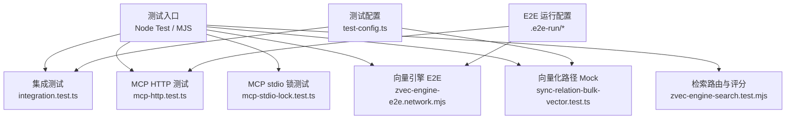
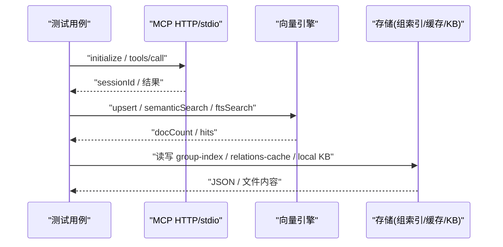
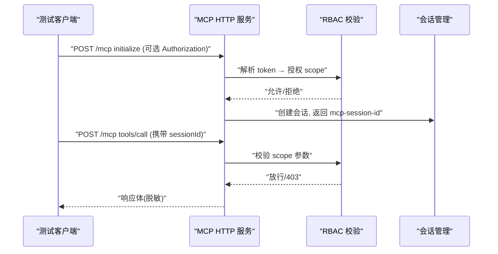
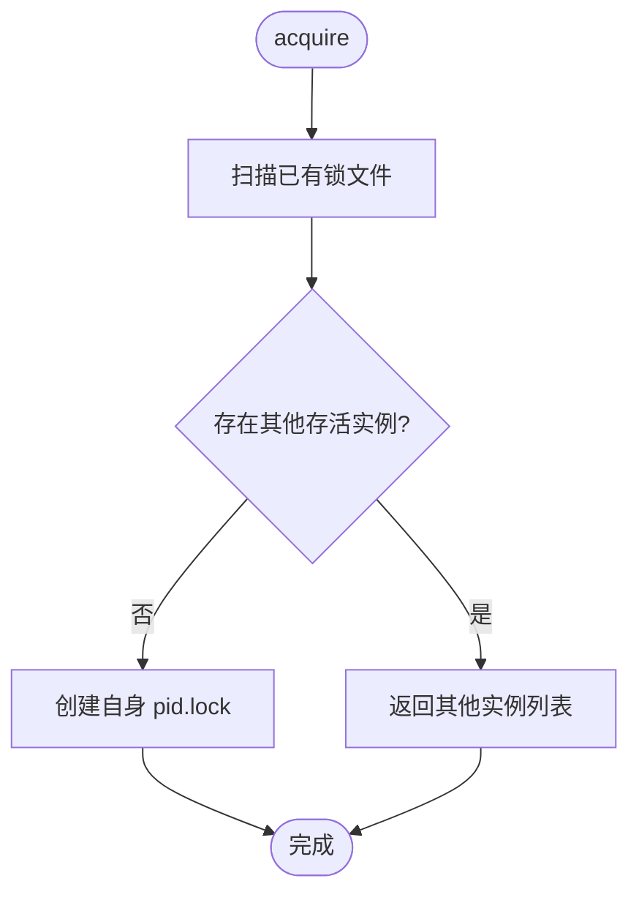
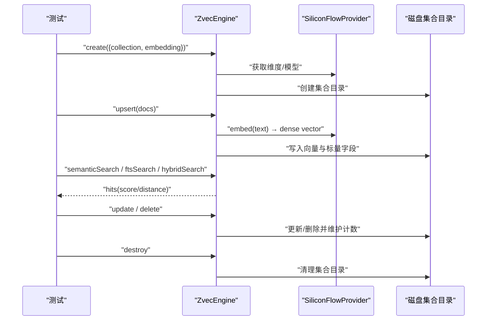
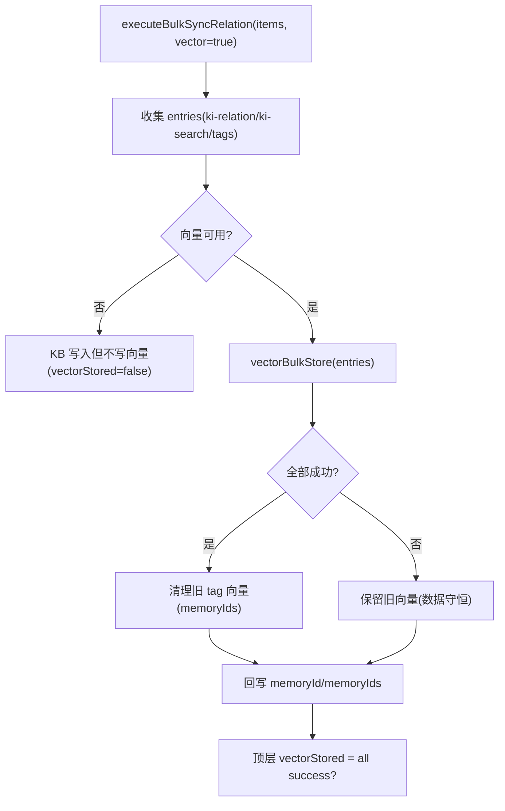
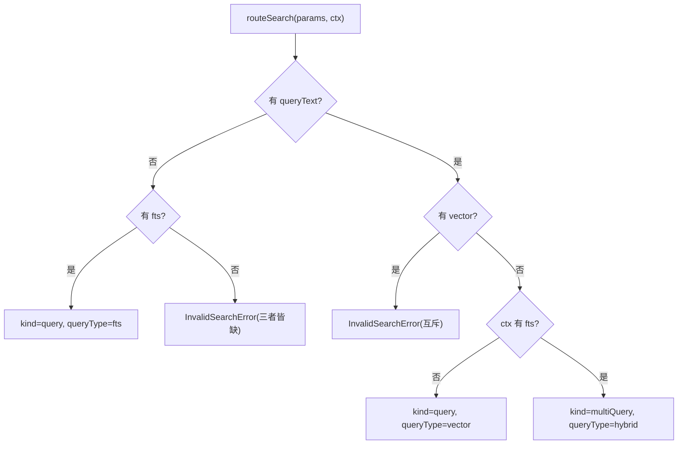
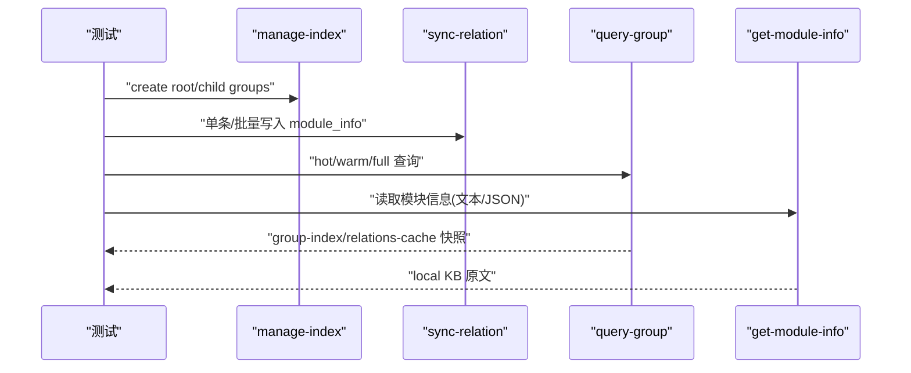
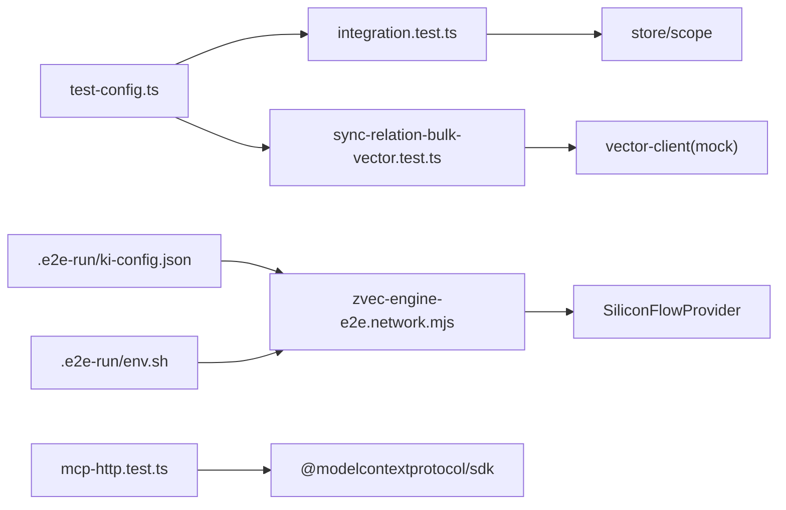
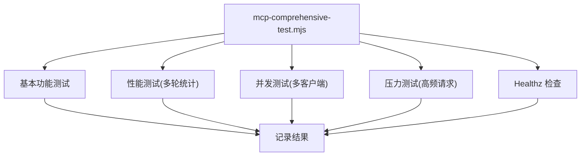

# 集成测试

<cite>
**本文引用的文件**
- [test/integration.test.ts](file://test/integration.test.ts)
- [test/test-config.ts](file://test/test-config.ts)
- [test/mcp-http.test.ts](file://test/mcp-http.test.ts)
- [test/mcp-stdio-lock.test.ts](file://test/mcp-stdio-lock.test.ts)
- [test/e2e/zvec-engine-e2e.network.mjs](file://test/e2e/zvec-engine-e2e.network.mjs)
- [test/sync-relation-bulk-vector.test.ts](file://test/sync-relation-bulk-vector.test.ts)
- [test/zvec-engine-search.test.mjs](file://test/zvec-engine-search.test.mjs)
- [.e2e-run/ki-config.json](file://.e2e-run/ki-config.json)
- [.e2e-run/env.sh](file://.e2e-run/env.sh)
- [.e2e-run/mcp-comprehensive-test.mjs](file://.e2e-run/mcp-comprehensive-test.mjs)
</cite>

## 目录
1. [简介](#简介)
2. [项目结构](#项目结构)
3. [核心组件](#核心组件)
4. [架构总览](#架构总览)
5. [详细组件分析](#详细组件分析)
6. [依赖关系分析](#依赖关系分析)
7. [性能与并发测试](#性能与并发测试)
8. [故障排查指南](#故障排查指南)
9. [结论](#结论)
10. [附录](#附录)

## 简介
本指南面向“知识索引器”项目的集成测试，覆盖以下目标：
- MCP 服务器集成测试：stdio 模式与 HTTP 模式的策略、鉴权与会话隔离、RBAC 越权防护。
- 向量引擎集成测试：端到端验证嵌入、过滤、搜索（语义检索、全文检索、混合检索）及更新/删除等生命周期。
- 数据库与存储集成测试：配置隔离、数据管理、清理机制。
- 网络服务测试：Mock 策略、测试环境搭建、健康检查与探针。
- 并发、性能回归与兼容性测试：批量写入、并发调用、压测与稳定性。
- 测试数据隔离与清理：临时配置、临时目录、进程级隔离与 teardown。

## 项目结构
仓库围绕“CLI + MCP + 向量引擎 + 存储”的集成链路组织测试：
- 集成与 E2E：端到端流程串联 CLI、MCP、向量与存储。
- 向量引擎：纯函数路由与 score 归一化、真实 embedding 端到端验收。
- MCP：HTTP 模式鉴权与会话隔离、stdio 多实例锁。
- 配置与环境：测试专用配置文件与临时环境变量注入。

**图表来源**
- [test/integration.test.ts:1-356](file://test/integration.test.ts#L1-L356)
- [test/mcp-http.test.ts:1-592](file://test/mcp-http.test.ts#L1-L592)
- [test/mcp-stdio-lock.test.ts:1-170](file://test/mcp-stdio-lock.test.ts#L1-L170)
- [test/e2e/zvec-engine-e2e.network.mjs:1-279](file://test/e2e/zvec-engine-e2e.network.mjs#L1-L279)
- [test/sync-relation-bulk-vector.test.ts:1-357](file://test/sync-relation-bulk-vector.test.ts#L1-L357)
- [test/zvec-engine-search.test.mjs:1-171](file://test/zvec-engine-search.test.mjs#L1-L171)
- [test/test-config.ts:1-92](file://test/test-config.ts#L1-L92)
- [.e2e-run/ki-config.json:1-17](file://.e2e-run/ki-config.json#L1-L17)
- [.e2e-run/env.sh:1-7](file://.e2e-run/env.sh#L1-L7)

**章节来源**
- [test/integration.test.ts:1-356](file://test/integration.test.ts#L1-L356)
- [test/test-config.ts:1-92](file://test/test-config.ts#L1-L92)
- [.e2e-run/ki-config.json:1-17](file://.e2e-run/ki-config.json#L1-L17)
- [.e2e-run/env.sh:1-7](file://.e2e-run/env.sh#L1-L7)

## 核心组件
- 集成测试框架：基于 Node test，使用 jiti 直接执行脚本，构造 scope、临时目录，断言 JSON 输出与文件系统状态。
- MCP HTTP 测试：启动本地 HTTP 服务，模拟 initialize/tools/call，覆盖鉴权、会话隔离、RBAC、健康检查与端口占用提示。
- MCP stdio 锁测试：验证多实例 lock 文件命名、存活检测、清理与释放。
- 向量引擎 E2E：真实 SiliconFlowProvider 嵌入，创建集合、upsert、semanticSearch、ftsSearch、hybridSearch、update/delete 全链路。
- 向量化路径 Mock：通过动态 import 并 patch vector-client 导出，验证批量写入、旧向量清理、部分失败与不可用降级。
- 检索路由与评分：纯函数测试 routeSearch 退化矩阵、互斥校验、topk 限制与 toHit 归一化。

**章节来源**
- [test/integration.test.ts:1-356](file://test/integration.test.ts#L1-L356)
- [test/mcp-http.test.ts:1-592](file://test/mcp-http.test.ts#L1-L592)
- [test/mcp-stdio-lock.test.ts:1-170](file://test/mcp-stdio-lock.test.ts#L1-L170)
- [test/e2e/zvec-engine-e2e.network.mjs:1-279](file://test/e2e/zvec-engine-e2e.network.mjs#L1-L279)
- [test/sync-relation-bulk-vector.test.ts:1-357](file://test/sync-relation-bulk-vector.test.ts#L1-L357)
- [test/zvec-engine-search.test.mjs:1-171](file://test/zvec-engine-search.test.mjs#L1-L171)

## 架构总览
下图展示集成测试在“客户端—MCP—向量—存储”之间的交互与测试断点。

**图表来源**
- [test/mcp-http.test.ts:84-232](file://test/mcp-http.test.ts#L84-L232)
- [test/e2e/zvec-engine-e2e.network.mjs:106-147](file://test/e2e/zvec-engine-e2e.network.mjs#L106-L147)
- [test/integration.test.ts:82-356](file://test/integration.test.ts#L82-L356)

## 详细组件分析

### MCP 服务器集成测试（HTTP 模式）
- 鉴权与豁免：回环地址免鉴权；远程来源强制鉴权；/healthz 始终免鉴权。
- 会话隔离：每次 initialize 返回不同 sessionId；支持 maxSessions 上限保护。
- RBAC 越权防护：token→scope 映射；batch 中任一越权整体拒绝；白名单工具无参豁免但不过扩大化。
- 健康检查与错误描述：probeHealthz/fetchHealthz；端口占用、权限不足、地址不存在等错误分类提示。

**图表来源**
- [test/mcp-http.test.ts:84-232](file://test/mcp-http.test.ts#L84-L232)
- [test/mcp-http.test.ts:449-592](file://test/mcp-http.test.ts#L449-L592)

**章节来源**
- [test/mcp-http.test.ts:1-592](file://test/mcp-http.test.ts#L1-L592)

### MCP 服务器集成测试（stdio 模式）
- 多实例锁：每个实例独立 lock 文件（文件名含 pid），支持 acquire/release、listLiveStdioLocks。
- 存活检测：pidAlive 判断当前/其他进程存活；清理陈旧锁；内容损坏时按文件名 pid 返回。
- 隔离性：release 仅删除自身文件，不误删他人。

**图表来源**
- [test/mcp-stdio-lock.test.ts:99-169](file://test/mcp-stdio-lock.test.ts#L99-L169)

**章节来源**
- [test/mcp-stdio-lock.test.ts:1-170](file://test/mcp-stdio-lock.test.ts#L1-L170)

### 向量引擎集成测试（端到端）
- 真实嵌入：使用 SiliconFlowProvider，从环境变量读取模型与维度，避免硬编码密钥。
- 集合生命周期：create/info → upsert → semanticSearch → ftsSearch → hybridSearch → update → delete → destroy。
- 召回指标：自检索 top1 命中且 score≈1；不相关查询相对比值断言；Recall@5≥90%。
- 容错与约束：update 仅 fields 抛 InconsistentUpdateError；delete 后 docCount 下降且不可 fetch。

**图表来源**
- [test/e2e/zvec-engine-e2e.network.mjs:106-147](file://test/e2e/zvec-engine-e2e.network.mjs#L106-L147)
- [test/e2e/zvec-engine-e2e.network.mjs:162-278](file://test/e2e/zvec-engine-e2e.network.mjs#L162-L278)

**章节来源**
- [test/e2e/zvec-engine-e2e.network.mjs:1-279](file://test/e2e/zvec-engine-e2e.network.mjs#L1-L279)

### 向量化路径 Mock 测试（批量写入）
- Mock 策略：动态 import vector-client 并 patch ensureVectorAvailable/vectorBulkStore/vectorDelete，实现离线可测。
- 场景覆盖：
  - 全成功：memoryId/memoryIds 回写、旧 tag 向量聚合清理、顶层 vectorStored=true。
  - 部分失败：不清理旧向量（避免删旧丢新）、逐条 reason 透出、顶层 vectorStored=false。
  - 同批重复 relation：仅后一条写向量，前一条标记覆盖。
  - 向量服务不可用：KB 层不阻塞，逐条 vectorStored=false。
  - hints：Group 路径解析提示（自动补建但未匹配）。

**图表来源**
- [test/sync-relation-bulk-vector.test.ts:42-71](file://test/sync-relation-bulk-vector.test.ts#L42-L71)
- [test/sync-relation-bulk-vector.test.ts:107-356](file://test/sync-relation-bulk-vector.test.ts#L107-L356)

**章节来源**
- [test/sync-relation-bulk-vector.test.ts:1-357](file://test/sync-relation-bulk-vector.test.ts#L1-L357)

### 检索路由与评分（纯函数）
- normalizeVectorScore：distance 钳制到 [0,2] 并按 COSINE 公式归一化；非 COSINE 抛出 SchemaMismatchError。
- toHit：vector 路 distance NaN/undefined → null；includeVector 控制是否附带向量。
- routeSearch：退化矩阵（queryText 无 fts → 单路 vector；仅 fts → 单路 fts；两者都有 → hybrid）；互斥校验（同时传 queryText+vector 报错）；topk 限制与默认值；weighted/rrf rerank 参数校验。

**图表来源**
- [test/zvec-engine-search.test.mjs:65-171](file://test/zvec-engine-search.test.mjs#L65-L171)

**章节来源**
- [test/zvec-engine-search.test.mjs:1-171](file://test/zvec-engine-search.test.mjs#L1-L171)

### 集成测试快速路径（CLI 命令链）
- 快速路径：manage-index → sync-relation → query-group → get-module-info。
- 导入路径：scan-kb import --source 直导（full/incremental），验证 relations-cache 写入与 memoryIds 多值。
- 回退路径：查询不存在的 Group/Relation 返回空或错误；本地 KB 缺失时报错。

**图表来源**
- [test/integration.test.ts:82-356](file://test/integration.test.ts#L82-L356)

**章节来源**
- [test/integration.test.ts:1-356](file://test/integration.test.ts#L1-L356)

## 依赖关系分析
- 测试配置与环境：
  - 测试进程共享临时配置文件，动态注册 scope，剥离 IDE 注入的环境变量，确保子进程一致性。
  - E2E 运行配置提供 dataDir/backupDir/vectorDir/embedding/provider/model/dimension/scopes。
- 外部依赖：
  - MCP SDK：用于构建 McpServer、工具注册与传输。
  - 向量提供者：SiliconFlowProvider，从环境变量读取 apiKey/baseURL/model/dimension。
- 内部依赖：
  - store/scope：初始化 scope、读写 group-index/relations-cache/local KB。
  - vector-client：向量化接口（被 mock 以支持离线测试）。

**图表来源**
- [test/test-config.ts:1-92](file://test/test-config.ts#L1-L92)
- [.e2e-run/ki-config.json:1-17](file://.e2e-run/ki-config.json#L1-L17)
- [.e2e-run/env.sh:1-7](file://.e2e-run/env.sh#L1-L7)
- [test/mcp-http.test.ts:1-592](file://test/mcp-http.test.ts#L1-L592)
- [test/e2e/zvec-engine-e2e.network.mjs:1-279](file://test/e2e/zvec-engine-e2e.network.mjs#L1-L279)
- [test/sync-relation-bulk-vector.test.ts:1-357](file://test/sync-relation-bulk-vector.test.ts#L1-L357)

**章节来源**
- [test/test-config.ts:1-92](file://test/test-config.ts#L1-L92)
- [.e2e-run/ki-config.json:1-17](file://.e2e-run/ki-config.json#L1-L17)
- [.e2e-run/env.sh:1-7](file://.e2e-run/env.sh#L1-L7)

## 性能与并发测试
- MCP 综合测试脚本：
  - 基本功能：initialize、tools/list、各工具调用。
  - 性能测量：每项多次测量取平均/最小/最大/P95。
  - 并发测试：不同并发度下独立 session 并行调用，统计成功率与耗时。
  - 压力测试：连续高频请求，统计吞吐与分位延迟。
  - Healthz：健康检查与实例信息。

**图表来源**
- [.e2e-run/mcp-comprehensive-test.mjs:70-317](file://.e2e-run/mcp-comprehensive-test.mjs#L70-L317)

**章节来源**
- [.e2e-run/mcp-comprehensive-test.mjs:1-317](file://.e2e-run/mcp-comprehensive-test.mjs#L1-L317)

## 故障排查指南
- MCP 端口占用与权限：
  - EADDRINUSE：提示端口已被占用并提供换端口建议。
  - EACCES：提示权限不足或高位端口问题。
  - EADDRNOTAVAIL：提示本机不存在该地址或无法绑定。
- 向量服务不可用：
  - KB 层不阻塞，逐条 vectorStored=false，透出 reason。
  - 旧向量保留以避免删旧丢新。
- 数据一致性与回退：
  - 查询不存在 Group/Relation：返回空或错误，包含“不存在”关键词。
  - 本地 KB 缺失：get-module-info 报错并提示 KB 不存在。
  - relations-cache 缺失：报错提示文件不存在。

**章节来源**
- [test/mcp-http.test.ts:422-447](file://test/mcp-http.test.ts#L422-L447)
- [test/sync-relation-bulk-vector.test.ts:300-356](file://test/sync-relation-bulk-vector.test.ts#L300-L356)
- [test/integration.test.ts:213-317](file://test/integration.test.ts#L213-L317)

## 结论
本项目建立了完善的集成测试体系：
- MCP 服务器：覆盖 stdio 与 HTTP 模式，鉴权、会话隔离、RBAC 与健康检查完备。
- 向量引擎：端到端验证嵌入、过滤、搜索与生命周期操作，具备真实联网与离线 Mock 双轨能力。
- 存储与配置：测试配置隔离、临时目录与 teardown 清理，保障数据隔离与可重复性。
- 性能与并发：提供综合测试脚本，支持性能基准、并发与压力测试。
- 故障排查：明确错误分类与降级策略，提升可观测性与可维护性。

## 附录
- 运行准备：
  - 设置环境变量：embedding apiKey、baseURL、model、dimension。
  - 使用测试配置：通过 test-config.ts 生成临时配置并注册 scope。
  - E2E 运行：使用 .e2e-run/env.sh 与 ki-config.json 指定数据与向量目录。
- 常用命令：
  - 运行集成测试：npx jiti test/integration.test.ts
  - 运行 MCP HTTP 测试：npx jiti test/mcp-http.test.ts
  - 运行向量 E2E：node test/e2e/zvec-engine-e2e.network.mjs
  - 运行综合测试：node .e2e-run/mcp-comprehensive-test.mjs

**章节来源**
- [test/test-config.ts:1-92](file://test/test-config.ts#L1-L92)
- [.e2e-run/env.sh:1-7](file://.e2e-run/env.sh#L1-L7)
- [.e2e-run/ki-config.json:1-17](file://.e2e-run/ki-config.json#L1-L17)