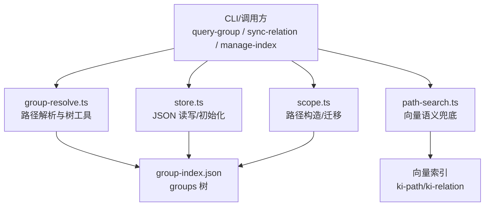
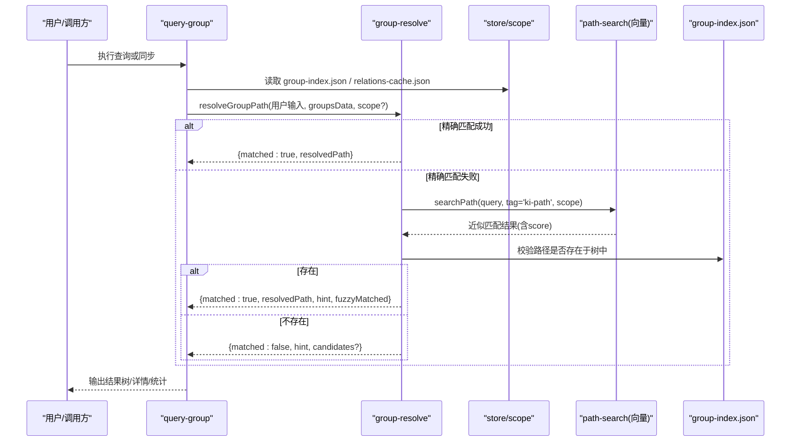
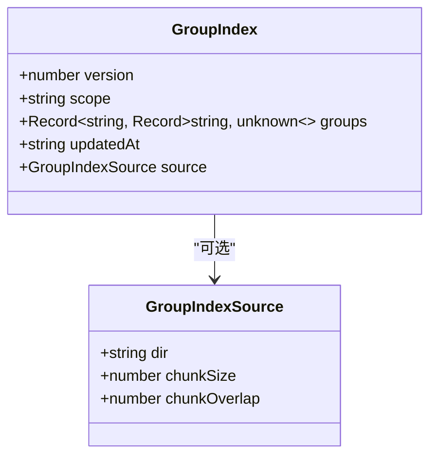
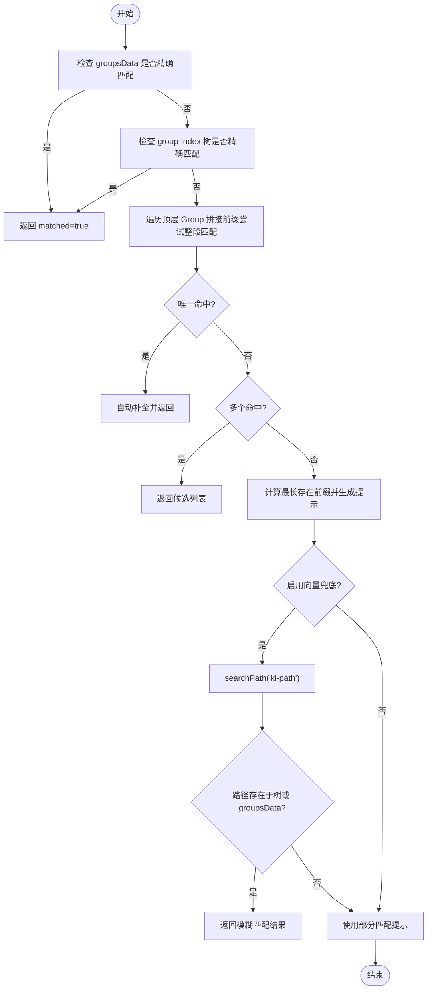
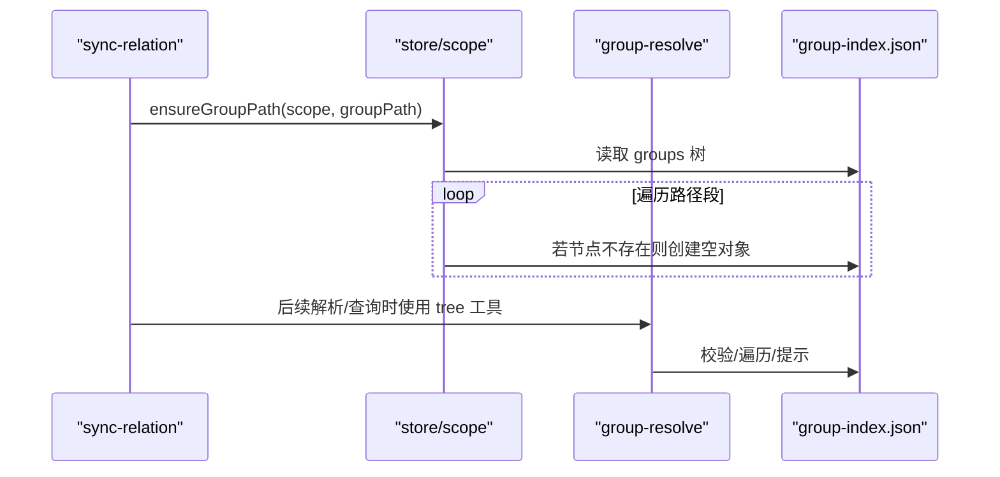
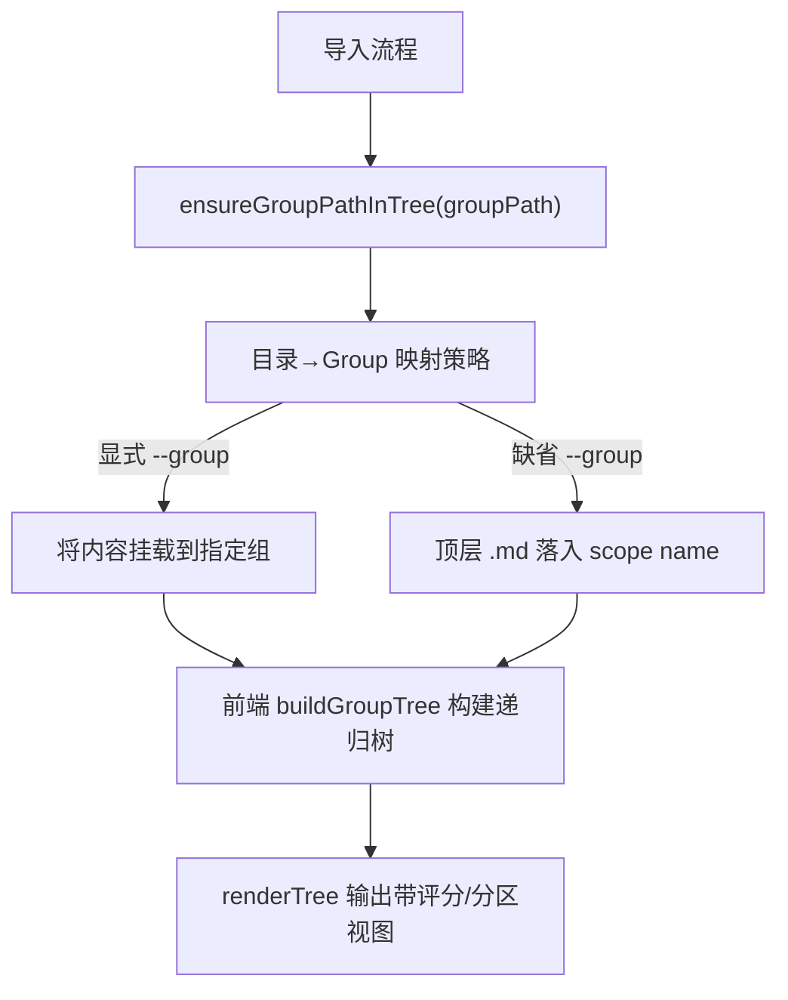
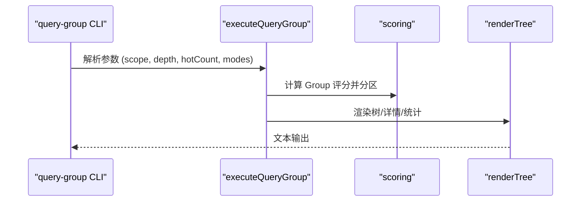
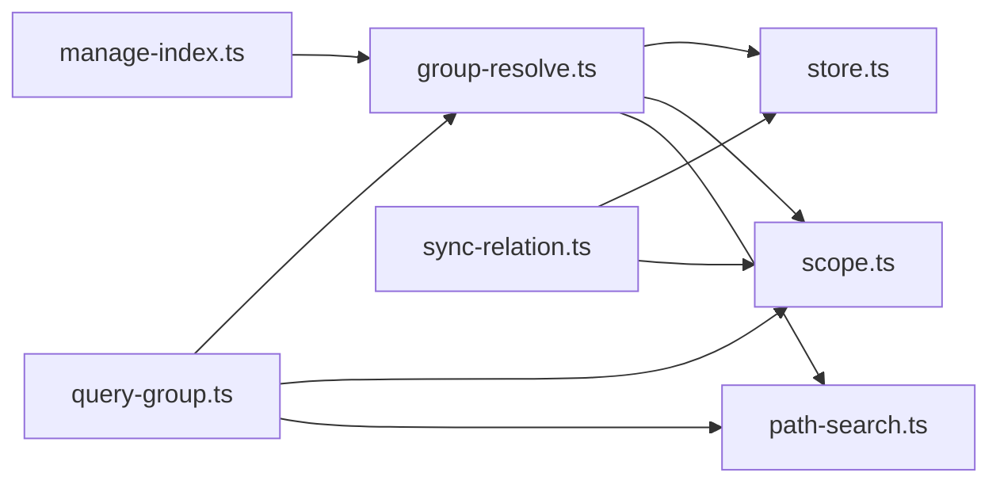

# Group 树结构设计

<cite>
**本文引用的文件**
- [src/lib/group-resolve.ts](file://src/lib/group-resolve.ts)
- [src/query-group.ts](file://src/query-group.ts)
- [src/sync-relation.ts](file://src/sync-relation.ts)
- [src/manage-index.ts](file://src/manage-index.ts)
- [src/lib/scope.ts](file://src/lib/scope.ts)
- [src/lib/store.ts](file://src/lib/store.ts)
- [src/lib/path-search.ts](file://src/lib/path-search.ts)
- [_template/group-index.json](file://_template/group-index.json)
- [test/fixtures/mock-wiki/核心概念/Group 树结构.md](file://test/fixtures/mock-wiki/核心概念/Group 树结构.md)
</cite>

## 目录
1. [简介](#简介)
2. [项目结构与角色](#项目结构与角色)
3. [核心组件](#核心组件)
4. [架构总览](#架构总览)
5. [详细组件分析](#详细组件分析)
6. [依赖关系分析](#依赖关系分析)
7. [性能与缓存策略](#性能与缓存策略)
8. [故障排查指南](#故障排查指南)
9. [结论与最佳实践](#结论与最佳实践)
10. [附录：数据模型与版本兼容](#附录数据模型与版本兼容)

## 简介
本文件系统性说明 Group 树的层次结构原则、命名规范、组织策略，以及 groupPath 推导逻辑（显式 group vs 自动推断）、父子关系维护机制。文档覆盖 Group 树构建算法、路径解析规则、目录映射策略，并提供最佳实践、查询优化、缓存策略与版本兼容性建议。目标是让读者在不深入代码的前提下也能正确设计和使用 Group 树。

## 项目结构与角色
- Group 树以 JSON 形式持久化在 scope 的 kb 目录下，核心文件为 group-index.json，用于描述分组层级；relations-cache.json 记录每个 Group 下的关系（hot_relations）及分区配置等运行时信息。
- 路径表示采用“/”分隔的字符串，如“API/用户认证/OAuth”。顶层 Group 即 groups 对象的键名。
- 导入、同步、查询、管理命令通过一组公共模块协作完成：group-resolve（路径解析与树工具）、store（JSON 读写与初始化）、scope（路径构造与迁移）、path-search（向量语义兜底）。

图表来源
- [src/lib/group-resolve.ts:1-220](file://src/lib/group-resolve.ts#L1-L220)
- [src/lib/store.ts:1-267](file://src/lib/store.ts#L1-L267)
- [src/lib/scope.ts:1-230](file://src/lib/scope.ts#L1-L230)
- [src/lib/path-search.ts:1-116](file://src/lib/path-search.ts#L1-L116)

章节来源
- [test/fixtures/mock-wiki/核心概念/Group 树结构.md:1-42](file://test/fixtures/mock-wiki/核心概念/Group 树结构.md#L1-L42)

## 核心组件
- 路径解析与树工具：提供路径存在性检查、最长前缀查找、直接子节点枚举、自动补全与多级候选提示。
- 存储层：负责 group-index.json 和 relations-cache.json 的安全读写、版本检查、旧格式迁移、新 scope 初始化。
- Scope 管理：校验 scope、构造路径、读取 source、迁移旧 keys、确保路径在树中存在。
- 向量语义兜底：当精确匹配失败时，基于 ki-path/ki-relation 标签进行近似匹配并二次校验真实存在性。
- 查询与展示：聚合评分、分区（热/常温/冷/新兴热）、渲染树与详情输出。

章节来源
- [src/lib/group-resolve.ts:29-220](file://src/lib/group-resolve.ts#L29-L220)
- [src/lib/store.ts:23-92](file://src/lib/store.ts#L23-L92)
- [src/lib/scope.ts:106-167](file://src/lib/scope.ts#L106-L167)
- [src/lib/path-search.ts:38-116](file://src/lib/path-search.ts#L38-L116)
- [src/query-group.ts:57-147](file://src/query-group.ts#L57-L147)

## 架构总览
Group 树的生命周期包括：创建/初始化、写入/同步、解析/查询、管理操作（增删改查）。各阶段职责清晰，错误处理与降级策略完善。

图表来源
- [src/query-group.ts:611-746](file://src/query-group.ts#L611-L746)
- [src/lib/group-resolve.ts:117-219](file://src/lib/group-resolve.ts#L117-L219)
- [src/lib/path-search.ts:47-87](file://src/lib/path-search.ts#L47-L87)
- [src/lib/store.ts:73-92](file://src/lib/store.ts#L73-L92)

## 详细组件分析

### 1) Group 树数据结构与持久化
- 数据格式 v2：包含 version、scope、groups（嵌套对象）、updatedAt、source（可选）。
- 模板初始化：从 _template 复制基础文件并填充 scope 字段。
- 旧格式迁移：roots → groups，同时迁移 relations-cache 中以“项目根/”开头的 key。

图表来源
- [src/lib/scope.ts:81-112](file://src/lib/scope.ts#L81-L112)
- [src/lib/store.ts:229-267](file://src/lib/store.ts#L229-L267)
- [_template/group-index.json:1-7](file://_template/group-index.json#L1-L7)

章节来源
- [src/lib/scope.ts:106-167](file://src/lib/scope.ts#L106-L167)
- [src/lib/store.ts:23-92](file://src/lib/store.ts#L23-L92)

### 2) groupPath 推导逻辑（显式 group vs 自动推断）
- 四层查找 + 向量兜底：
  1) 直接匹配 groupsData（relations-cache 中的 groups）
  2) 在 group-index 树中精确匹配
  3) 整段补全：在每个顶层 Group 下拼接前缀后匹配，唯一命中则自动补全，多命中返回候选列表
  4) 部分匹配：找到最长存在前缀，生成提示但不立即返回
  5) 向量兜底：通过 ki-path 标签搜索近似路径，二次校验真实存在性
- 返回 ResolveResult：包含 resolvedPath、hint、matched、candidates、fuzzyMatched、fuzzyScore。

图表来源
- [src/lib/group-resolve.ts:117-219](file://src/lib/group-resolve.ts#L117-L219)
- [src/lib/path-search.ts:47-87](file://src/lib/path-search.ts#L47-L87)

章节来源
- [src/lib/group-resolve.ts:29-220](file://src/lib/group-resolve.ts#L29-L220)

### 3) 父子关系维护机制
- 自动补建：在写入 Relation 或导入时，若 groupPath 的父节点缺失，自动创建中间节点，保证路径完整。
- 树工具：提供 pathExistsInTree、findLongestExistingPrefix、getDirectChildren 等函数，支撑路径校验与提示。
- 管理操作：支持按父路径创建/删除/移动节点，并在必要时结合向量索引清理。

图表来源
- [src/sync-relation.ts:94-139](file://src/sync-relation.ts#L94-L139)
- [src/lib/scope.ts:151-167](file://src/lib/scope.ts#L151-L167)
- [src/lib/group-resolve.ts:29-94](file://src/lib/group-resolve.ts#L29-L94)

章节来源
- [src/sync-relation.ts:94-139](file://src/sync-relation.ts#L94-L139)
- [src/lib/scope.ts:151-167](file://src/lib/scope.ts#L151-L167)
- [src/manage-index.ts:99-129](file://src/manage-index.ts#L99-L129)

### 4) Group 树构建算法与目录映射策略
- 构建入口：导入流程在写入 relation 前会确保 groupPath 在树中存在；导入时根据 --group 参数决定落点，缺省时顶层 .md 落入 scope name。
- 目录映射：
  - 显式 --group 指定多级路径：自动创建父路径，并将文件挂载到对应组。
  - 子目录映射：子目录可挂到落点组下，形成更细粒度分组。
  - 前端树构建：从后端返回的 groups 列表（含 count）递归构建 UI 树，单顶层目录时上提一级以提升可读性。
- 路径收集与渲染：collectAllGroupPaths 深度优先收集所有路径；renderTree/renderCompactTree 支持带评分与分区的可视化。

图表来源
- [src/lib/import.ts:568-611](file://src/lib/import.ts#L568-L611)
- [web/src/components/GroupPathSelect.tsx:17-45](file://web/src/components/GroupPathSelect.tsx#L17-L45)
- [src/query-group.ts:57-75](file://src/query-group.ts#L57-L75)
- [src/query-group.ts:235-340](file://src/query-group.ts#L235-L340)

章节来源
- [src/lib/import.ts:568-611](file://src/lib/import.ts#L568-L611)
- [web/src/components/GroupPathSelect.tsx:17-45](file://web/src/components/GroupPathSelect.tsx#L17-L45)
- [src/query-group.ts:57-75](file://src/query-group.ts#L57-L75)
- [src/query-group.ts:235-340](file://src/query-group.ts#L235-L340)

### 5) 查询与分区展示
- 评分聚合：对每个 Group 的 hot_relations 计算分数并聚合得到 Group 总分。
- 分区：按 recentHours/halfLifeHours 划分热/常温/冷，并识别新兴热区（最近活跃且处于热区）。
- 展示模式：支持 hot/warm/cold/emerging/full 多种模式组合；full 模式递归展示子 Group 的 Relations。
- 统计信息：输出总索引数及各分区数量。

图表来源
- [src/query-group.ts:77-147](file://src/query-group.ts#L77-L147)
- [src/query-group.ts:394-480](file://src/query-group.ts#L394-L480)
- [src/query-group.ts:707-742](file://src/query-group.ts#L707-L742)

章节来源
- [src/query-group.ts:77-147](file://src/query-group.ts#L77-L147)
- [src/query-group.ts:394-480](file://src/query-group.ts#L394-L480)
- [src/query-group.ts:707-742](file://src/query-group.ts#L707-L742)

## 依赖关系分析
- group-resolve 依赖 store/scope 提供的 group-index 数据，依赖 path-search 进行向量兜底。
- query-group 依赖 group-resolve 进行路径解析，依赖 scoring 进行评分与分区，依赖 vector-client 进行语义搜索。
- sync-relation 依赖 store/scope 进行树自动补建，依赖 group-resolve 进行后续解析。
- manage-index 依赖 group-resolve 的路径解析与子节点枚举，实现增删改查。

图表来源
- [src/lib/group-resolve.ts:1-220](file://src/lib/group-resolve.ts#L1-L220)
- [src/query-group.ts:1-784](file://src/query-group.ts#L1-L784)
- [src/sync-relation.ts:94-139](file://src/sync-relation.ts#L94-L139)
- [src/manage-index.ts:1-34](file://src/manage-index.ts#L1-L34)

章节来源
- [src/lib/group-resolve.ts:1-220](file://src/lib/group-resolve.ts#L1-L220)
- [src/query-group.ts:1-784](file://src/query-group.ts#L1-L784)
- [src/sync-relation.ts:94-139](file://src/sync-relation.ts#L94-L139)
- [src/manage-index.ts:1-34](file://src/manage-index.ts#L1-L34)

## 性能与缓存策略
- 评分与分区：基于 useCount 与 lastUsedTime 计算衰减分数，避免全量扫描导致的性能问题；分区阈值由 partition_config 控制。
- 向量兜底：默认阈值较低（RRF 融合分），由下游进行存在性二次校验，降低误匹配风险；异常静默降级，不影响主流程。
- 缓存与 WAL：writeJson 使用 WAL 写入，确保原子性与一致性；readJson 进行版本检查，旧版本数据自动迁移。
- 查询优化：
  - 预解析路径：批量 resolveGroupPath 并行执行，减少 IO 与解析开销。
  - 过滤集合：renderTree 支持按分区过滤，仅展示可见子节点，降低输出体积。
  - full 模式截断：限制最大展示条目，防止输出过长。

章节来源
- [src/lib/store.ts:23-62](file://src/lib/store.ts#L23-L62)
- [src/lib/path-search.ts:38-87](file://src/lib/path-search.ts#L38-L87)
- [src/query-group.ts:640-704](file://src/query-group.ts#L640-L704)
- [src/query-group.ts:235-340](file://src/query-group.ts#L235-L340)

## 故障排查指南
- JSON 损坏：readJson 抛出 CORRUPT_JSON，建议从备份恢复或重新初始化 scope。
- 路径未匹配：resolveGroupPath 返回 matched=false 与 hint，检查顶层 Group 是否存在、是否拼写错误、是否需要显式指定完整路径。
- 向量服务不可用：path-search 捕获异常并降级，不影响主流程；可检查网络或服务状态。
- 旧数据迁移：readGroupIndex 自动迁移 roots→groups，并迁移 relations-cache 中旧 key；如遇合并冲突，查看日志提示。

章节来源
- [src/lib/store.ts:23-49](file://src/lib/store.ts#L23-L49)
- [src/lib/group-resolve.ts:117-219](file://src/lib/group-resolve.ts#L117-L219)
- [src/lib/path-search.ts:82-87](file://src/lib/path-search.ts#L82-L87)
- [src/lib/store.ts:73-92](file://src/lib/store.ts#L73-L92)

## 结论与最佳实践
- 分组粒度：建议按业务域或模块维度划分顶层 Group，子 Group 细化到功能或主题；避免过深嵌套（推荐不超过 4-5 层）。
- 命名约定：使用中文或英文统一风格，避免特殊字符与斜杠；保持前后一致，便于自动补全与检索。
- 路径策略：优先显式指定完整 groupPath；当不确定时利用自动补全与向量兜底，但需关注 hint 提示。
- 维护策略：定期使用 query-group 查看分区与热门索引，及时归档冷数据；使用 manage-index 调整树结构。
- 兼容性与升级：关注 version 字段与 CURRENT_DATA_VERSION；遇到旧格式自动迁移，必要时手动核对合并结果。

[本节为通用指导，不直接引用具体文件]

## 附录：数据模型与版本兼容
- GroupIndex 模型：version、scope、groups、updatedAt、source（可选）。
- 迁移策略：
  - roots → groups：自动迁移并写回，同时迁移 relations-cache 中旧 key。
  - source 块：记录导入来源与切分参数，增量 diff 基于 commit。
- 模板与初始化：_template/group-index.json 作为基础模板，initScope 复制并填充 scope。

章节来源
- [src/lib/scope.ts:81-112](file://src/lib/scope.ts#L81-L112)
- [src/lib/store.ts:73-92](file://src/lib/store.ts#L73-L92)
- [_template/group-index.json:1-7](file://_template/group-index.json#L1-L7)