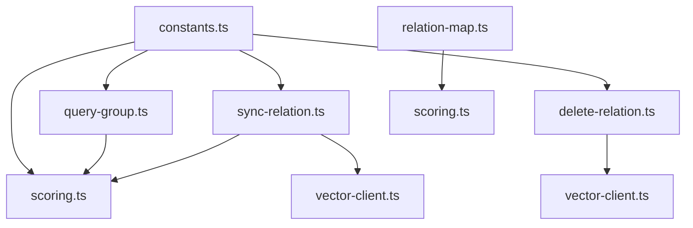
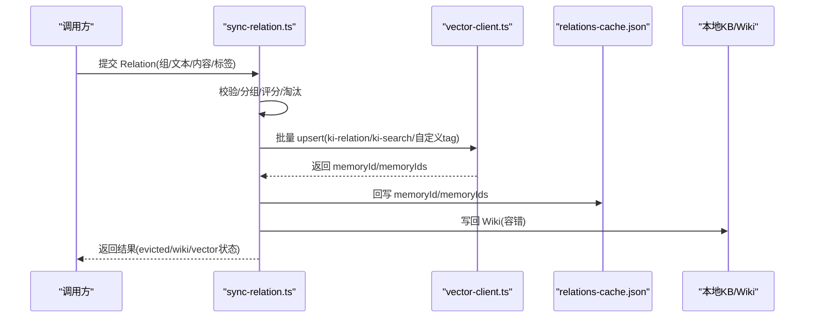
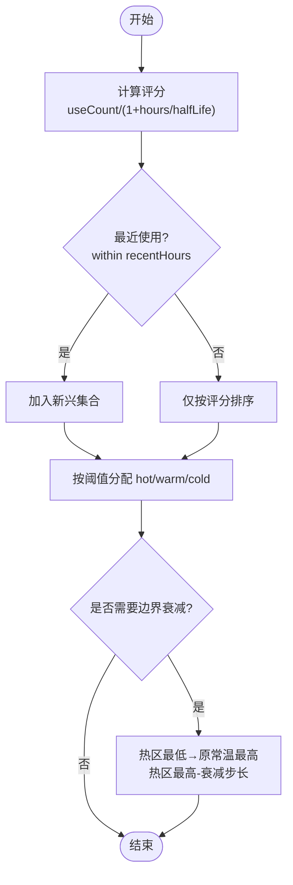
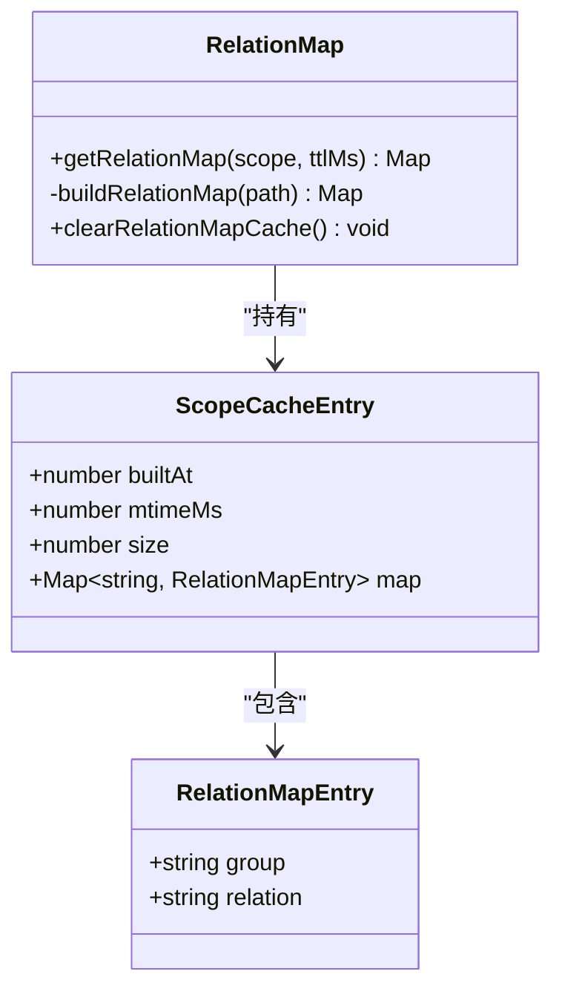
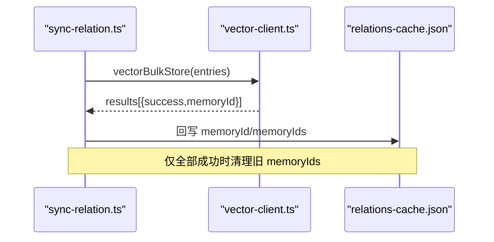
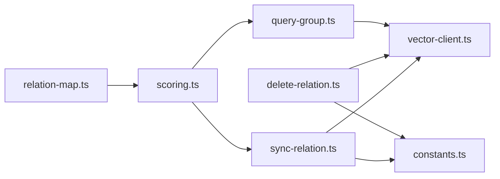

# Relation 关系管理

<cite>
**本文引用的文件**
- [src/lib/scoring.ts](file://src/lib/scoring.ts)
- [src/sync-relation.ts](file://src/sync-relation.ts)
- [src/delete-relation.ts](file://src/delete-relation.ts)
- [src/query-group.ts](file://src/query-group.ts)
- [src/lib/relation-map.ts](file://src/lib/relation-map.ts)
- [src/lib/constants.ts](file://src/lib/constants.ts)
- [src/lib/vector-client.ts](file://src/lib/vector-client.ts)
</cite>

## 目录
1. [简介](#简介)
2. [项目结构](#项目结构)
3. [核心组件](#核心组件)
4. [架构总览](#架构总览)
5. [详细组件分析](#详细组件分析)
6. [依赖关系分析](#依赖关系分析)
7. [性能考量](#性能考量)
8. [故障排查指南](#故障排查指南)
9. [结论](#结论)
10. [附录](#附录)

## 简介
本文件系统性说明 Relation（关系）数据模型、关系建立与更新机制、内存映射与 TTL 过期策略、评分与热度计算、使用频率统计、查询与批量操作接口、冲突检测与一致性保证，以及与向量索引的关联和 memoryId/memoryIds 管理机制。目标是帮助读者快速理解并正确使用关系管理能力。

## 项目结构
Relation 相关能力分布在以下模块：
- 评分与分区：scoring.ts
- 关系同步与批量写入：sync-relation.ts
- 关系删除与清理：delete-relation.ts
- 关系查询与展示：query-group.ts
- 反查映射与 TTL 缓存：relation-map.ts
- 常量与默认配置：constants.ts
- 向量客户端封装：vector-client.ts

图表来源
- [src/sync-relation.ts:1-120](file://src/sync-relation.ts#L1-L120)
- [src/delete-relation.ts:1-120](file://src/delete-relation.ts#L1-L120)
- [src/query-group.ts:1-120](file://src/query-group.ts#L1-L120)
- [src/lib/relation-map.ts:1-120](file://src/lib/relation-map.ts#L1-L120)
- [src/lib/scoring.ts:1-120](file://src/lib/scoring.ts#L1-L120)
- [src/lib/constants.ts:1-98](file://src/lib/constants.ts#L1-L98)
- [src/lib/vector-client.ts:1-200](file://src/lib/vector-client.ts#L1-L200)

章节来源
- [src/sync-relation.ts:1-120](file://src/sync-relation.ts#L1-L120)
- [src/lib/constants.ts:1-98](file://src/lib/constants.ts#L1-L98)

## 核心组件
- Relation 数据模型：定义在 scoring.ts，包含 id、text、score、useCount、lastUsedTime、isImported、memoryId、memoryIds、sourcePath、tags 等字段。
- 评分引擎：calculateScore、recordUse、hybridPartition、partitionByScore、boundaryDecay。
- 同步写入：单条与批量模式，含 Group 自动补建、Wiki 写回、向量批量 upsert、memoryId/memoryIds 回写。
- 删除清理：单条/批量删除，支持按 memoryIds 精确删除或 search 兜底；目录级删除级联清理。
- 查询展示：Group 树、热门列表、分区标签、统计信息。
- 反查映射：memoryId → {group, relation} 的反查 Map，带 mtime/size/TTL 失效策略。
- 向量集成：统一通过 vector-client.ts 进行 embedding、upsert、search、delete。

章节来源
- [src/lib/scoring.ts:19-36](file://src/lib/scoring.ts#L19-L36)
- [src/sync-relation.ts:129-221](file://src/sync-relation.ts#L129-L221)
- [src/delete-relation.ts:83-176](file://src/delete-relation.ts#L83-L176)
- [src/query-group.ts:598-746](file://src/query-group.ts#L598-L746)
- [src/lib/relation-map.ts:23-78](file://src/lib/relation-map.ts#L23-L78)
- [src/lib/vector-client.ts:38-63](file://src/lib/vector-client.ts#L38-L63)

## 架构总览
Relation 系统围绕“评分—分区—持久化—检索”的闭环设计：
- 写入侧：sync-relation.ts 负责校验、分组、评分、淘汰、KB 落盘、Wiki 写回、向量批量 upsert，并将 memoryId/memoryIds 回写到 cache。
- 读取侧：query-group.ts 加载 relations-cache.json，基于评分与分区配置输出热/温/冷/新兴区结果；relation-map.ts 提供 memoryId 到 group/relation 的反查。
- 删除侧：delete-relation.ts 从 cache、KB、wiki、向量四端清理，优先按 memoryIds 删除，失败则 search 兜底。
- 向量侧：vector-client.ts 封装 ZvecEngine，提供批量 upsert/search/delete，处理锁重试与空闲释放。

图表来源
- [src/sync-relation.ts:407-787](file://src/sync-relation.ts#L407-L787)
- [src/lib/vector-client.ts:106-200](file://src/lib/vector-client.ts#L106-L200)

## 详细组件分析

### 数据模型：Relation
- 字段含义
  - id: 唯一标识，格式 rel_XXX，由 sync-relation.ts 生成。
  - text: 关系名称（文件名去扩展名）。
  - score: 当前评分，由 calculateScore 计算。
  - useCount: 使用次数，受 MIN_RECORD_INTERVAL_MINUTES 防刷与 MAX_USE_COUNT 上限限制。
  - lastUsedTime: 最近使用时间，用于评分衰减与新兴识别。
  - isImported: 是否导入标记。
  - memoryId: 主内容向量的 docId（ki-search 标签），用于删除定位。
  - memoryIds: 文档内容向量的全部 docId（多 tag 各一），用于批量删除与一致性清理。
  - sourcePath: 原始文件相对路径，用于 diff 关联 memoryId。
  - tags: 文档级自定义标签（如 api/auth），持久化到 KB 层，供 rebuild-vector/restore 恢复 tag 向量。

- 约束与不变式
  - 重复 text 视为同一关系，仅更新 useCount/lastUsedTime/score。
  - 新增时若达到 maxHotCount，淘汰最低分项。
  - 向量写入成功后才回写 memoryId/memoryIds；部分失败保留旧向量避免删旧丢新。

章节来源
- [src/lib/scoring.ts:19-36](file://src/lib/scoring.ts#L19-L36)
- [src/sync-relation.ts:80-92](file://src/sync-relation.ts#L80-L92)
- [src/sync-relation.ts:151-202](file://src/sync-relation.ts#L151-L202)
- [src/sync-relation.ts:657-695](file://src/sync-relation.ts#L657-L695)

### 评分算法与热度计算
- 评分公式：score = useCount / (1 + hoursSinceLastUse / halfLifeHours)。
- 使用记录：recordUse 实现 5 分钟防刷与 useCount 上限（MAX_USE_COUNT=10）。
- 冷热分区：hybridPartition 将 items 分为 hot/warm/cold，并识别 emerging（recentHours 内使用过）。
- 边界衰减：boundaryDecay 在新内容进入热区时，对热/常温区分数做平滑调整，避免剧烈波动。

图表来源
- [src/lib/scoring.ts:44-57](file://src/lib/scoring.ts#L44-L57)
- [src/lib/scoring.ts:65-79](file://src/lib/scoring.ts#L65-L79)
- [src/lib/scoring.ts:90-117](file://src/lib/scoring.ts#L90-L117)
- [src/lib/scoring.ts:136-209](file://src/lib/scoring.ts#L136-L209)
- [src/lib/scoring.ts:222-274](file://src/lib/scoring.ts#L222-L274)

章节来源
- [src/lib/scoring.ts:44-79](file://src/lib/scoring.ts#L44-L79)
- [src/lib/scoring.ts:90-209](file://src/lib/scoring.ts#L90-L209)
- [src/lib/scoring.ts:222-274](file://src/lib/scoring.ts#L222-L274)
- [src/lib/constants.ts:19-50](file://src/lib/constants.ts#L19-L50)

### 关系建立机制与内存映射管理
- 建立流程
  - 单条：syncSingleRelation 确保 Group 存在、查找或创建 Relation、必要时淘汰最低分、写入本地 KB、可选 Wiki 写回。
  - 批量：executeBulkSyncRelation 循环改 cache + 收集 entries，一次批量 embedding/upsert，拆分结果回写 memoryId/memoryIds，再写回 KB/Wiki。
- 内存映射
  - relation-map.ts 维护 scope → Map<memoryId, {group, relation}> 的反查表。
  - 缓存策略：mtime/size 未变且 TTL 未过期则命中；否则重建；文件缺失/损坏返回空 Map 降级。
  - 懒构建：首次访问 O(N)，后续 O(1)。

图表来源
- [src/lib/relation-map.ts:23-37](file://src/lib/relation-map.ts#L23-L37)
- [src/lib/relation-map.ts:48-78](file://src/lib/relation-map.ts#L48-L78)
- [src/lib/relation-map.ts:80-114](file://src/lib/relation-map.ts#L80-L114)

章节来源
- [src/sync-relation.ts:129-221](file://src/sync-relation.ts#L129-L221)
- [src/sync-relation.ts:407-787](file://src/sync-relation.ts#L407-L787)
- [src/lib/relation-map.ts:23-120](file://src/lib/relation-map.ts#L23-L120)

### TTL 过期策略
- 反查 Map 的 TTL：默认 10 分钟，结合 mtime/size 双重校验，防止原地改写导致 stale。
- 评分衰减：halfLifeHours 控制评分随时间衰减，recentHours 决定新兴识别窗口。
- 使用防刷：MIN_RECORD_INTERVAL_MINUTES=5 分钟内重复使用不计入。

章节来源
- [src/lib/relation-map.ts:30-78](file://src/lib/relation-map.ts#L30-L78)
- [src/lib/scoring.ts:44-79](file://src/lib/scoring.ts#L44-L79)
- [src/lib/constants.ts:19-50](file://src/lib/constants.ts#L19-L50)

### 与向量索引的关联与 memoryId 管理
- 写入链路
  - 每条 item 产出多个 entry：ki-relation（路径向量）、ki-search（内容向量）、自定义 tags（内容向量）。
  - 批量 upsert 后，按 itemIdx 拆分结果，content 类型条目收集为 memoryIds，ki-search 的 memoryId 作为 memoryId。
  - 旧 tag 向量清理：仅当本次内容向量全部成功时才删除旧 ids，避免删旧丢新。
- 删除链路
  - 优先按 memoryIds 批量删除；若未命中或失败，走 search 严格匹配兜底删除。
  - 目录级删除聚合所有子 group 的 memoryIds 一次性删除。

图表来源
- [src/sync-relation.ts:607-745](file://src/sync-relation.ts#L607-L745)
- [src/delete-relation.ts:383-473](file://src/delete-relation.ts#L383-L473)
- [src/lib/vector-client.ts:106-200](file://src/lib/vector-client.ts#L106-L200)

章节来源
- [src/sync-relation.ts:607-745](file://src/sync-relation.ts#L607-L745)
- [src/delete-relation.ts:383-473](file://src/delete-relation.ts#L383-L473)
- [src/lib/vector-client.ts:38-63](file://src/lib/vector-client.ts#L38-L63)

### 关系查询接口与批量操作工具
- 查询接口
  - query-group.ts 支持按 groups 参数查询单个/多个 Group，输出分区标签、热门列表、完整树与统计。
  - 支持 mode 过滤：hot/warm/cold/emerging/full。
- 批量操作
  - executeBulkSyncRelation：批量写入 Relation，一次 embedding/upsert，返回每项向量写入状态与原因。
  - executeBatchDelete：批量删除 Relation，逐项执行单条删除逻辑并汇总结果。

章节来源
- [src/query-group.ts:598-746](file://src/query-group.ts#L598-L746)
- [src/sync-relation.ts:343-392](file://src/sync-relation.ts#L343-L392)
- [src/sync-relation.ts:407-787](file://src/sync-relation.ts#L407-L787)
- [src/delete-relation.ts:558-594](file://src/delete-relation.ts#L558-L594)

### 冲突检测、重复数据处理与一致性保证
- 重复处理
  - 同批内相同 group+relation：后一条覆盖前一条，剔除前一条的向量 entries，避免孤儿向量与误删。
  - 跨批次重复：以 text 为准合并，更新 useCount/lastUsedTime/score。
- 一致性
  - 向量写入失败不阻塞 KB 层；但会记录 vectorStored=false 与 reason。
  - 旧 tag 向量清理仅在 content 向量全部成功时执行，避免不一致。
  - 删除时先 memoryIds 精确删除，失败则 search 严格匹配兜底，确保无残留。

章节来源
- [src/sync-relation.ts:569-605](file://src/sync-relation.ts#L569-L605)
- [src/sync-relation.ts:657-705](file://src/sync-relation.ts#L657-L705)
- [src/delete-relation.ts:383-473](file://src/delete-relation.ts#L383-L473)

### 性能调优建议
- 批量写入优于多次单条：减少 HTTP 往返与 worker 串行写入开销。
- 合理设置分区阈值：根据业务热点调整 hotPercent/warmPercent/maxHotCount。
- 控制向量服务可用性：ensureVectorAvailable 失败时降级为仅 KB 层，避免阻塞。
- 反查 Map 使用 TTL：避免频繁重建，同时通过 mtime/size 保障新鲜度。

章节来源
- [src/sync-relation.ts:394-406](file://src/sync-relation.ts#L394-L406)
- [src/lib/constants.ts:38-50](file://src/lib/constants.ts#L38-L50)
- [src/lib/relation-map.ts:30-78](file://src/lib/relation-map.ts#L30-L78)

## 依赖关系分析
- scoring.ts 被 sync-relation.ts、query-group.ts 引用，提供评分与分区能力。
- sync-relation.ts 依赖 vector-client.ts 进行向量操作，依赖 constants.ts 获取默认配置。
- delete-relation.ts 依赖 vector-client.ts 进行删除，依赖 constants.ts 与 config。
- query-group.ts 依赖 scoring.ts 与 vector-client.ts（语义兜底搜索）。
- relation-map.ts 依赖 scoring.ts（Relation 类型）与 scope 工具。

图表来源
- [src/sync-relation.ts:1-40](file://src/sync-relation.ts#L1-L40)
- [src/delete-relation.ts:18-31](file://src/delete-relation.ts#L18-L31)
- [src/query-group.ts:13-27](file://src/query-group.ts#L13-L27)
- [src/lib/relation-map.ts:19-28](file://src/lib/relation-map.ts#L19-L28)

章节来源
- [src/sync-relation.ts:1-40](file://src/sync-relation.ts#L1-L40)
- [src/delete-relation.ts:18-31](file://src/delete-relation.ts#L18-L31)
- [src/query-group.ts:13-27](file://src/query-group.ts#L13-L27)
- [src/lib/relation-map.ts:19-28](file://src/lib/relation-map.ts#L19-L28)

## 性能考量
- 评分计算复杂度：O(N) 计算 scores，排序 O(N log N)。
- 批量 upsert：一次 embedding HTTP + 一次 worker upsert，显著降低网络与序列化开销。
- 反查 Map：首次 O(N) 构建，后续 O(1) 查询；TTL 避免频繁重建。
- 删除优化：聚合 memoryIds 批量删除，减少多次 IO。

[本节为通用性能讨论，无需特定文件引用]

## 故障排查指南
- 向量服务不可用
  - 现象：vectorStored=false，reason 提示不可用。
  - 处置：检查向量库占用/损坏，参考 lockedHint 提示；必要时重建向量库。
- 重复写入导致孤儿向量
  - 现象：同批覆盖条目未独立写向量。
  - 处置：确认去重逻辑生效；必要时执行 rebuild-vector。
- 删除后仍可搜到
  - 现象：memoryIds 未命中，search 兜底失败。
  - 处置：检查 relation 名称严格匹配规则；确认 content 标题前缀一致。

章节来源
- [src/lib/vector-client.ts:72-87](file://src/lib/vector-client.ts#L72-L87)
- [src/sync-relation.ts:569-605](file://src/sync-relation.ts#L569-L605)
- [src/delete-relation.ts:431-473](file://src/delete-relation.ts#L431-L473)

## 结论
Relation 管理系统通过评分与分区机制动态维护知识热度，结合批量写入与严格的一致性策略，确保缓存、KB、Wiki 与向量索引的多端一致。TTL 与反查 Map 提升查询性能，删除链路提供精确与兜底双保险。建议在生产环境中合理使用批量接口、合理配置分区阈值，并关注向量服务可用性。

[本节为总结性内容，无需特定文件引用]

## 附录
- 关键常量
  - MIN_RECORD_INTERVAL_MINUTES=5，MAX_USE_COUNT=10
  - DEFAULT_PARTITION_CONFIG：hotPercent=0.3，warmPercent=0.5，reservedEmerging=10，recentHours=48，maxHotCount=10 等
- 默认标签集：ki-search、ki-path、ki-relation

章节来源
- [src/lib/constants.ts:19-50](file://src/lib/constants.ts#L19-L50)