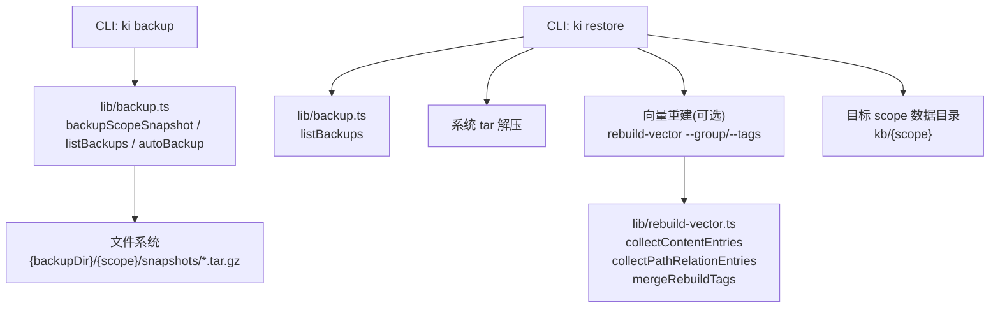
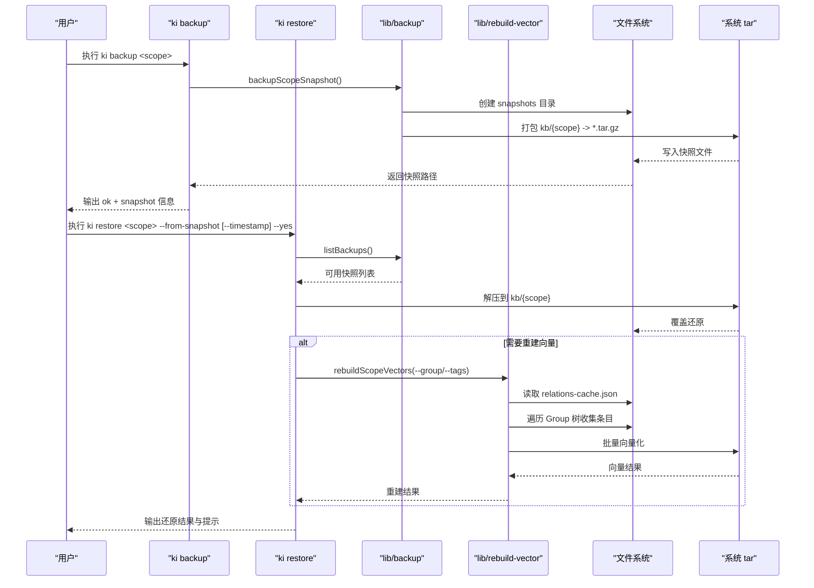
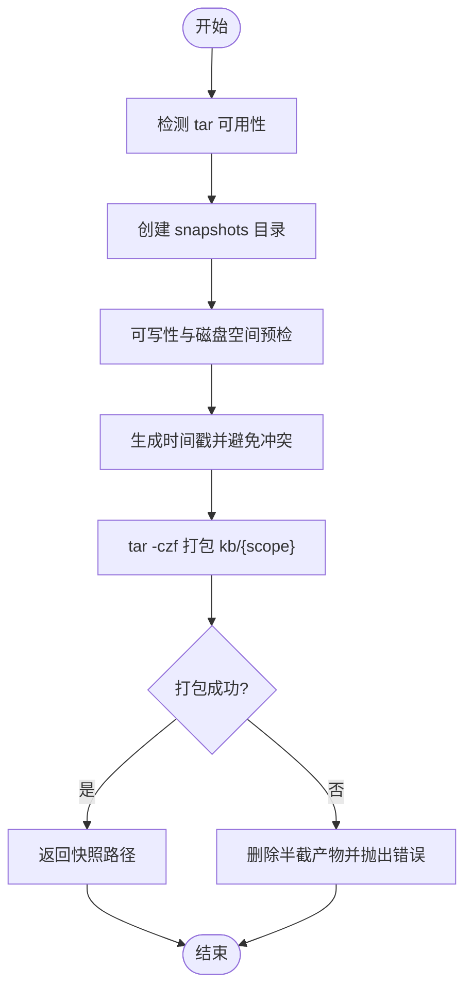
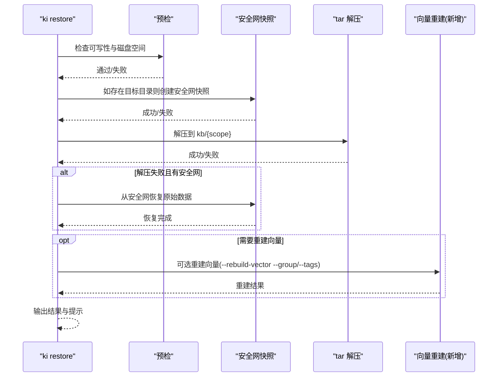
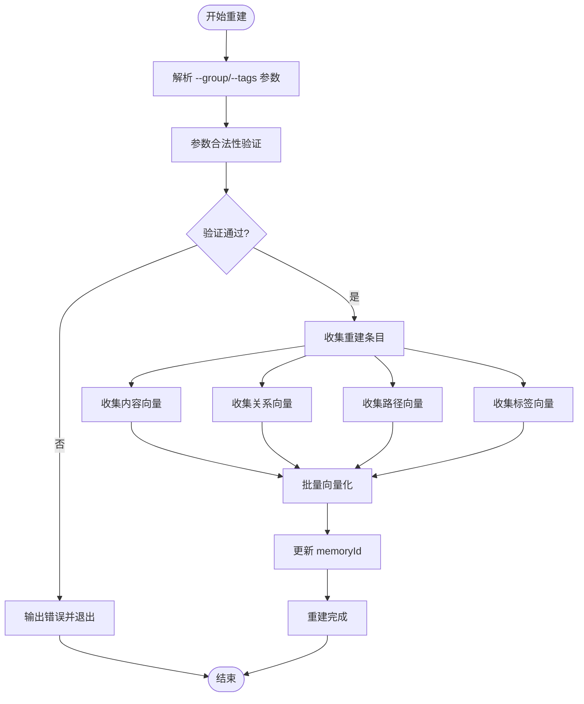
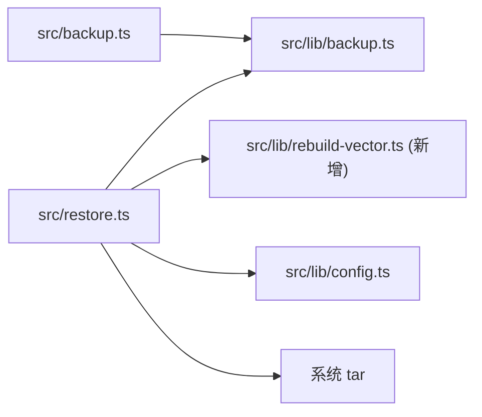

# 备份与恢复

<cite>
**本文引用的文件**
- [src/backup.ts](file://src/backup.ts)
- [src/restore.ts](file://src/restore.ts)
- [src/lib/backup.ts](file://src/lib/backup.ts)
- [src/lib/rebuild-vector.ts](file://src/lib/rebuild-vector.ts)
- [docs/backup-restore.md](file://docs/backup-restore.md)
- [docs/cli.md](file://docs/cli.md)
- [docs/error-handling.md](file://docs/error-handling.md)
- [src/lib/config.ts](file://src/lib/config.ts)
- [test/restore.test.ts](file://test/restore.test.ts)
- [test/rebuild-vector.test.ts](file://test/rebuild-vector.test.ts)
</cite>

## 更新摘要
**所做更改**
- 新增本地向量重建功能章节，详细说明 `--group` 和 `--tags` 参数的选择性子树重建
- 增强验证系统部分，包含参数合法性检查和组合校验
- 改进错误处理机制，特别是安全网快照和恢复流程
- 更新 CLI 命令参考，包含新的重建选项
- 添加局部重建的最佳实践和故障排查指南

## 目录
1. [简介](#简介)
2. [项目结构](#项目结构)
3. [核心组件](#核心组件)
4. [架构总览](#架构总览)
5. [详细组件分析](#详细组件分析)
6. [依赖关系分析](#依赖关系分析)
7. [性能考量](#性能考量)
8. [故障排查指南](#故障排查指南)
9. [结论](#结论)
10. [附录：策略建议与最佳实践](#附录策略建议与最佳实践)

## 简介
本文件面向知识库（KB）的备份与恢复能力，覆盖以下主题：
- 快照管理机制：自动备份触发时机、快照存储结构、版本控制策略
- 手动备份与恢复命令用法：压缩、传输、还原流程
- **新增**：本地向量重建功能：支持 `--group` 和 `--tags` 参数的选择性子树重建
- **增强**：验证系统与错误处理：参数合法性检查、组合校验、安全网机制
- 增量导入与差异计算：基于幂等追加与 sourcePath 的增量语义
- 灾难恢复场景：数据损坏修复、版本回滚、跨环境迁移
- 备份策略设计建议：定期备份、保留策略、存储空间管理
- 故障排查与常见问题解决方案

## 项目结构
备份与恢复功能由 CLI 入口与库模块组成：
- CLI 入口：
  - src/backup.ts：ki backup 命令
  - src/restore.ts：ki restore 命令（**新增** 向量重建功能）
- 库实现：
  - src/lib/backup.ts：快照打包、列表、自动备份
  - **新增** src/lib/rebuild-vector.ts：向量重建核心逻辑
  - src/lib/config.ts：配置加载与默认路径（含 backupDir）
- 文档：
  - docs/backup-restore.md：用户级备份与恢复说明
  - docs/cli.md：CLI 参考（含配置优先级、默认路径）
  - docs/error-handling.md：常见错误与恢复指引

**图表来源**
- [src/backup.ts:1-108](file://src/backup.ts#L1-L108)
- [src/restore.ts:1-526](file://src/restore.ts#L1-L526)
- [src/lib/backup.ts:1-178](file://src/lib/backup.ts#L1-L178)
- [src/lib/rebuild-vector.ts:1-470](file://src/lib/rebuild-vector.ts#L1-L470)
- [docs/backup-restore.md:1-254](file://docs/backup-restore.md#L1-L254)

**章节来源**
- [src/backup.ts:1-108](file://src/backup.ts#L1-L108)
- [src/restore.ts:1-526](file://src/restore.ts#L1-L526)
- [src/lib/backup.ts:1-178](file://src/lib/backup.ts#L1-L178)
- [src/lib/rebuild-vector.ts:1-470](file://src/lib/rebuild-vector.ts#L1-L470)
- [docs/backup-restore.md:1-254](file://docs/backup-restore.md#L1-L254)
- [docs/cli.md:1-200](file://docs/cli.md#L1-L200)

## 核心组件
- 备份命令（ki backup）
  - 作用：对指定 scope 生成 tar.gz 快照，落盘到 {backupDir}/{scope}/snapshots
  - 支持 --list 列出已有备份
- 恢复命令（ki restore）
  - 作用：从快照还原 scope；支持 --from-snapshot、--timestamp、--backup-dir、--yes、--rebuild-vector
  - **新增**：支持 --group 和 --tags 参数进行选择性向量重建
  - 非交互式：未加 --yes 仅展示总览并退出，要求显式确认
- 备份库（lib/backup.ts）
  - 提供 snapshot 打包、避免文件名冲突、磁盘空间预检、列表查询
  - 自动备份：import 成功后调用（不阻断主流程）
- **新增** 向量重建库（lib/rebuild-vector.ts）
  - 提供选择性子树重建功能，支持 Group 过滤和标签打标
  - 实现内容向量、关系向量、路径向量的重建
  - 支持自定义标签合并去重和内存ID回写
- 配置（lib/config.ts）
  - 默认 backupDir = ~/.ki/backup；dataDir = ~/.ki/kb
  - 支持 --config 指定配置文件路径

**章节来源**
- [src/backup.ts:1-108](file://src/backup.ts#L1-L108)
- [src/restore.ts:1-526](file://src/restore.ts#L1-L526)
- [src/lib/backup.ts:1-178](file://src/lib/backup.ts#L1-L178)
- [src/lib/rebuild-vector.ts:1-470](file://src/lib/rebuild-vector.ts#L1-L470)
- [src/lib/config.ts:1-200](file://src/lib/config.ts#L1-L200)
- [docs/backup-restore.md:1-254](file://docs/backup-restore.md#L1-L254)

## 架构总览
备份与恢复的整体流程如下：

**图表来源**
- [src/backup.ts:1-108](file://src/backup.ts#L1-L108)
- [src/restore.ts:1-526](file://src/restore.ts#L1-L526)
- [src/lib/backup.ts:1-178](file://src/lib/backup.ts#L1-L178)
- [src/lib/rebuild-vector.ts:1-470](file://src/lib/rebuild-vector.ts#L1-L470)

## 详细组件分析

### 快照管理与自动备份
- 快照格式与命名
  - 文件名：snapshot.{YYYYMMDD-HHMMSS[-序号]}.tar.gz
  - 时间戳精度为秒；同秒内多次备份通过附加序号避免覆盖
- 存储位置
  - {backupDir}/{scope}/snapshots/snapshot.*.tar.gz
- 自动备份触发时机
  - import 成功后调用 autoBackup，打包 scope 目录为快照
  - 备份失败仅输出警告，不阻断 import 成功返回
- 安全网快照
  - 还原前若存在目标目录，会先创建"安全网"快照到默认 backupDir，用于解压失败时自动恢复
- 预检与健壮性
  - 可写性检查、磁盘空间估算（按源目录体积或解压膨胀系数估算）
  - tar 失败清理半截产物，避免残留损坏文件

**图表来源**
- [src/lib/backup.ts:30-117](file://src/lib/backup.ts#L30-L117)

**章节来源**
- [src/lib/backup.ts:1-178](file://src/lib/backup.ts#L1-L178)
- [docs/backup-restore.md:1-254](file://docs/backup-restore.md#L1-L254)

### 手动备份命令（ki backup）
- 用法
  - ki backup <scope>：生成快照
  - ki backup <scope> --list：列出已有备份
- 行为要点
  - 校验 scope 有效性
  - 校验 scope 已初始化（存在 relations-cache.json）
  - 输出 JSON 结果，包含 action、scope、snapshot 路径等信息

**章节来源**
- [src/backup.ts:1-108](file://src/backup.ts#L1-L108)
- [docs/backup-restore.md:1-254](file://docs/backup-restore.md#L1-L254)

### 恢复命令（ki restore）
- 模式
  - 列出备份：ki restore <scope> 或 --list
  - 从快照还原：ki restore <scope> --from-snapshot [--timestamp <ts>] [--yes]
  - **新增**：仅重建向量：ki restore <scope> --rebuild-vector [--group <path>] [--tags <t1,t2>]
- 关键选项
  - --backup-dir：指定备份根目录（读取与列出均生效；安全网快照仍写入默认 backupDir）
  - --timestamp：选择特定时间戳的快照（默认最新）
  - --yes：跳过确认直接执行（破坏性操作）
  - **新增**：--group：选择性重建指定 Group 子树的向量
  - **新增**：--tags：为重建范围内文档附加自定义标签
- 还原流程
  - 预检：目标父目录可写、解压所需空间（保守按 5x 估算）
  - 确认：非交互，未加 --yes 仅展示总览并退出
  - 安全网：还原前创建当前状态快照，用于异常恢复
  - 解压：使用系统 tar 解压到 kb/{scope}
  - **新增**：可选向量重建（--rebuild-vector），支持选择性子树重建和标签打标
- 错误处理
  - tar 解压失败：尝试从安全网快照自动恢复原始数据
  - 安全网快照失败：中止还原，避免不可逆数据丢失窗口

**图表来源**
- [src/restore.ts:121-283](file://src/restore.ts#L121-L283)
- [src/lib/backup.ts:87-117](file://src/lib/backup.ts#L87-L117)

**章节来源**
- [src/restore.ts:1-526](file://src/restore.ts#L1-L526)
- [docs/backup-restore.md:120-179](file://docs/backup-restore.md#L120-L179)

### **新增** 本地向量重建功能
- **选择性子树重建**
  - 通过 `--group <path>` 参数指定要重建的 Group 子树
  - 支持精确匹配和父子关系匹配（如 `wiki/部署运维` 匹配该 Group 及其所有子 Group）
  - 幂等覆盖：仅重建指定范围内的向量，不影响其他向量数据
- **标签打标功能**
  - 通过 `--tags <t1,t2>` 参数为重建范围内的文档附加自定义标签
  - 标签合并去重：与现有 relation.tags 合并，只增不减
  - 跨命令累积：多次执行会累积标签（先 a 再 b = a∪b）
  - 每个标签自动生成对应的内容向量
- **验证系统增强**
  - 参数合法性检查：防止空值、非法路径、保留标签误用
  - 组合校验：禁止 `--from-snapshot` 与局部重建组合
  - 前置验证：在破坏性操作前执行参数校验，避免数据损坏
- **重建流程优化**
  - 智能条目收集：根据过滤条件收集内容、关系、路径和标签向量
  - 内存ID回写：重建后自动更新 relations-cache.json 中的 memoryId 字段
  - 失败隔离：单个条目失败不影响整体重建流程

**图表来源**
- [src/lib/rebuild-vector.ts:320-470](file://src/lib/rebuild-vector.ts#L320-L470)
- [src/restore.ts:387-450](file://src/restore.ts#L387-L450)

**章节来源**
- [src/lib/rebuild-vector.ts:1-470](file://src/lib/rebuild-vector.ts#L1-L470)
- [src/restore.ts:387-450](file://src/restore.ts#L387-L450)
- [test/rebuild-vector.test.ts:1-200](file://test/rebuild-vector.test.ts#L1-L200)

### 增量导入与差异计算
- 增量语义
  - 不再使用 git diff 驱动的独立增量模式；采用幂等追加语义
  - 重复执行同一导入命令即同步变更：新增文件正常导入，同名不同 sourcePath 跳过，相同 sourcePath 覆盖更新
- 差异识别依据
  - 以 sourcePath 作为唯一标识进行去重与覆盖判断
  - 导入后 group-index.json 与 relations-cache.json 反映最新状态
- 适用场景
  - 本地 Markdown 知识库持续演进，通过重复导入保持 KB 与向量一致

**章节来源**
- [docs/cli.md:23-77](file://docs/cli.md#L23-L77)
- [docs/backup-restore.md:165-179](file://docs/backup-restore.md#L165-L179)

### 灾难恢复场景
- 场景 1：group-index.json 损坏
  - 症状：Group 树读取失败，JSON 解析错误
  - 恢复：ki restore <scope> --from-snapshot --yes
- 场景 2：relations-cache.json 损坏
  - 症状：Relation 查询失败，JSON 解析错误
  - 恢复：ki restore <scope> --from-snapshot --yes
- 场景 3：整个 scope 数据丢失
  - 症状：kb/{scope}/ 不存在或为空
  - 恢复：ki restore <scope> --from-snapshot --yes；或重新初始化 scope
- 场景 4：本地 KB 原文丢失
  - 症状：get-module-info 返回空内容
  - 恢复：ki restore <scope> --from-snapshot --yes；或重新导入知识库（幂等追加）
- **新增** 场景 5：向量数据不一致
  - 症状：搜索结果为空或搜索结果不准确
  - 恢复：ki restore <scope> --rebuild-vector（全量重建）或 ki restore <scope> --rebuild-vector --group <path>（局部重建）

**章节来源**
- [docs/backup-restore.md:183-229](file://docs/backup-restore.md#L183-L229)
- [docs/error-handling.md:41-60](file://docs/error-handling.md#L41-L60)

### 跨环境迁移
- 快照作为迁移载体
  - 将 {backupDir}/{scope}/snapshots/*.tar.gz 复制到目标环境
  - 在目标环境执行 ki restore <scope> --from-snapshot --backup-dir <dir> --yes
- **新增** 向量重建考虑
  - 如需语义检索，执行 --rebuild-vector 重建向量
  - 可使用 --group 和 --tags 进行选择性重建，减少重建时间
- 注意事项
  - 确保目标环境具备 tar 命令与足够磁盘空间
  - 向量数据不随快照还原，需单独重建

**章节来源**
- [src/restore.ts:121-283](file://src/restore.ts#L121-L283)
- [docs/backup-restore.md:120-179](file://docs/backup-restore.md#L120-L179)

## 依赖关系分析
- CLI 与库
  - src/backup.ts 依赖 src/lib/backup.ts 的 backupScopeSnapshot、listBackups
  - src/restore.ts 依赖 src/lib/backup.ts 的 listBackups，以及系统 tar、**新增** lib/rebuild-vector.ts 的重建功能
- 配置与路径
  - 默认 backupDir = ~/.ki/backup；dataDir = ~/.ki/kb
  - 可通过 --config 指定配置文件；--backup-dir 覆盖读取位置（安全网快照仍写入默认 backupDir）

**图表来源**
- [src/backup.ts:1-108](file://src/backup.ts#L1-L108)
- [src/restore.ts:1-526](file://src/restore.ts#L1-L526)
- [src/lib/config.ts:1-200](file://src/lib/config.ts#L1-L200)

**章节来源**
- [src/backup.ts:1-108](file://src/backup.ts#L1-L108)
- [src/restore.ts:1-526](file://src/restore.ts#L1-L526)
- [src/lib/config.ts:1-200](file://src/lib/config.ts#L1-L200)

## 性能考量
- 快照打包
  - 使用系统 tar 压缩，减少存储占用；避免在备份过程中阻塞主流程（autoBackup 失败不阻断 import）
- 空间预估
  - 还原前按 5x 估算解压所需空间，避免中途磁盘不足导致失败
- **新增** 向量重建优化
  - 选择性重建：通过 --group 参数仅重建指定子树，大幅减少重建时间
  - 标签打标：--tags 参数支持批量打标，避免重复重建
  - 内存ID回写：重建后自动更新缓存，避免后续查询性能问题
  - 失败隔离：单个条目失败不影响整体重建，提高容错性
- 向量重建
  - 按需执行 --rebuild-vector；批量向量化提升效率，但需 embedding 密钥与网络资源

**章节来源**
- [src/lib/backup.ts:87-117](file://src/lib/backup.ts#L87-L117)
- [src/restore.ts:185-198](file://src/restore.ts#L185-L198)
- [src/lib/rebuild-vector.ts:320-470](file://src/lib/rebuild-vector.ts#L320-L470)
- [docs/cli.md:713-854](file://docs/cli.md#L713-L854)

## 故障排查指南
- tar 不可用
  - 现象：报错提示 tar 命令不可用
  - 解决：安装 tar（Linux/macOS 内置；Windows 请安装 Git for Windows）
- 磁盘空间不足
  - 现象：预检失败，提示空间不足
  - 解决：清理目标目录或扩容；注意解压膨胀系数
- 权限问题
  - 现象：无法写入备份目录或目标目录
  - 解决：检查目录权限与可写性
- 安全网快照失败
  - 现象：还原前安全网快照创建失败，中止还原
  - 解决：修复磁盘/权限/tar 问题后重试；此时不会删除现有数据
- **新增** 向量重建失败
  - 现象：--rebuild-vector 部分条目失败
  - 解决：检查 embedding 配置与网络；查看 errors 字段定位失败原因
  - **新增** 参数验证失败
    - 现象：--group 缺少值或 --tags 解析失败
    - 解决：检查参数格式，确保 Group 路径有效，标签不为保留标签
  - **新增** 组合校验失败
    - 现象：--from-snapshot 与 --group/--tags 组合被拒绝
    - 解决：分开执行，先还原再重建，或使用全量重建
- 局部重建无效果
  - 现象：指定 Group 下没有重建任何向量
  - 解决：检查 Group 路径是否正确，确认该 Group 下有 index.json 文件

**章节来源**
- [src/restore.ts:64-74](file://src/restore.ts#L64-L74)
- [src/restore.ts:185-198](file://src/restore.ts#L185-L198)
- [src/restore.ts:211-231](file://src/restore.ts#L211-L231)
- [src/restore.ts:387-450](file://src/restore.ts#L387-L450)
- [src/lib/rebuild-vector.ts:320-470](file://src/lib/rebuild-vector.ts#L320-L470)
- [docs/error-handling.md:1-71](file://docs/error-handling.md#L1-L71)

## 结论
- 备份与恢复以"完整快照 + 安全网"为核心，确保数据可回滚与异常自愈
- **新增** 本地向量重建功能提供了灵活的选择性重建能力，支持 Group 过滤和标签打标
- **增强** 验证系统确保参数合法性，防止误操作导致的数据损坏
- 增量导入采用幂等追加语义，简化运维并降低一致性风险
- 恢复为非交互式，强调显式确认与可观测性，适合自动化与脚本化
- 向量数据独立于快照，按需重建，兼顾性能与灵活性

## 附录：策略建议与最佳实践
- 定期备份
  - 结合 CI/CD 或定时任务，在导入成功后自动触发备份（autoBackup）
  - 对重要 scope 增加手动备份钩子（ki backup <scope>）
- 保留策略
  - 当前实现保留全部历史快照；建议外部轮转策略（如按周/月归档、清理过期快照）
  - 根据合规与容量需求制定保留周期
- 存储空间管理
  - 监控 backupDir 与 kb 目录大小，设置告警阈值
  - 合理评估 tar.gz 压缩比与解压膨胀系数，预留充足空间
- **新增** 向量重建策略
  - 全量重建：适用于大规模数据变更或数据不一致场景
  - 局部重建：使用 --group 参数仅重建变更的 Group 子树，提高效率
  - 标签管理：使用 --tags 参数批量打标签，避免重复重建
  - 重建时机：在数据导入完成后执行重建，确保向量与 KB 一致
- 加密与传输
  - 快照为 tar.gz 压缩包；如需加密，可在传输层（如 scp/rsync over SSH）或使用外部加密工具对快照文件加密后再传输
  - 跨环境迁移时，优先通过受控通道传输快照文件，并在目标环境验证完整性
- 灾难演练
  - 定期演练恢复流程，包括从旧快照恢复、向量重建、跨环境迁移
  - 记录恢复耗时与成功率，优化预案
  - **新增** 测试局部重建场景，验证选择性重建的正确性和性能

**本节为通用建议，不直接引用具体代码文件**