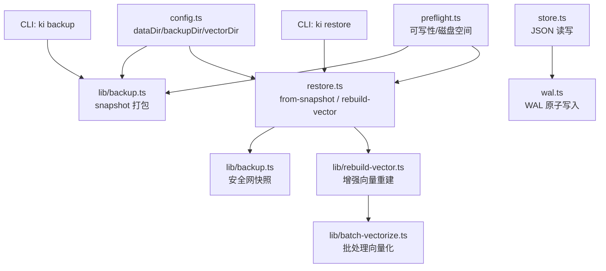
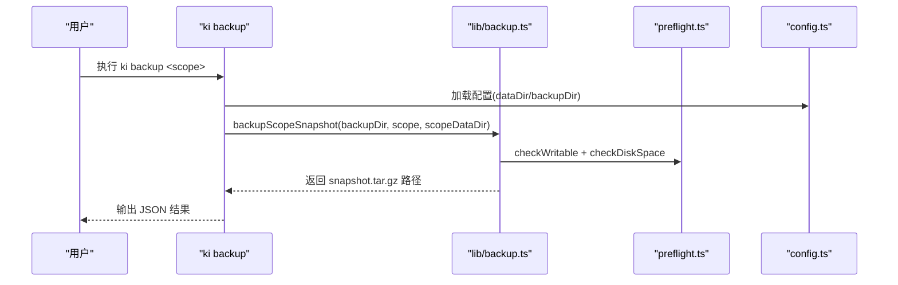
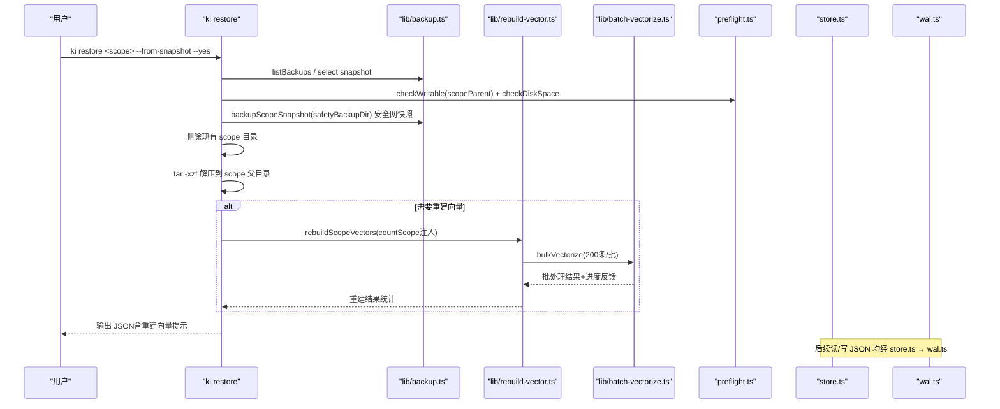
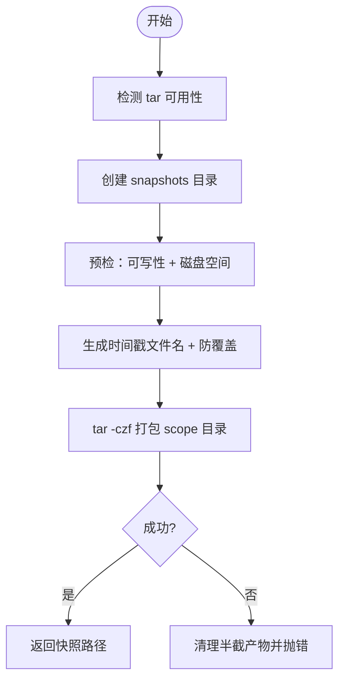
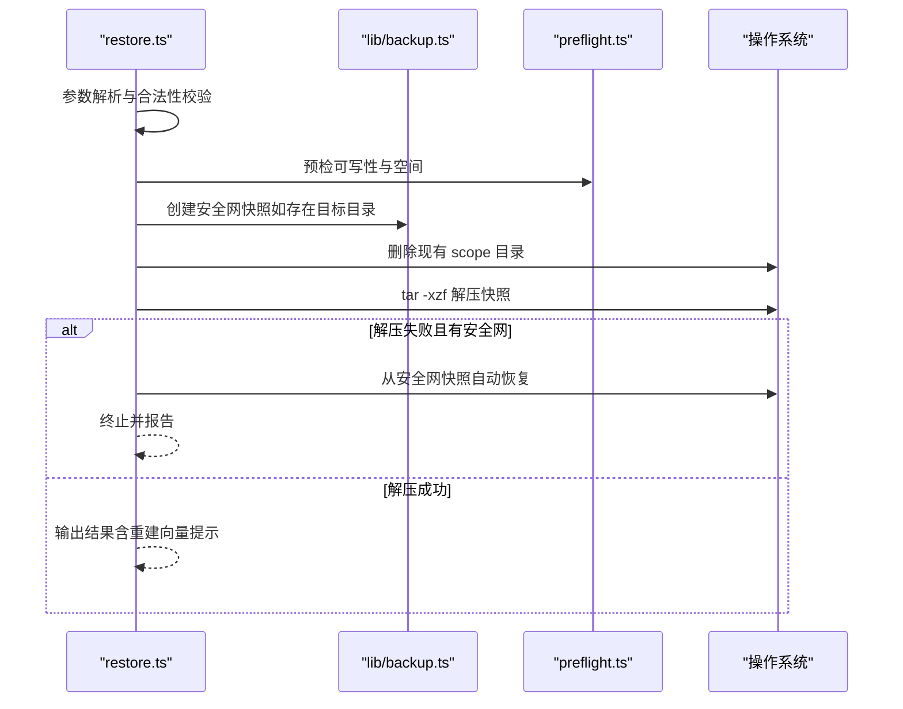
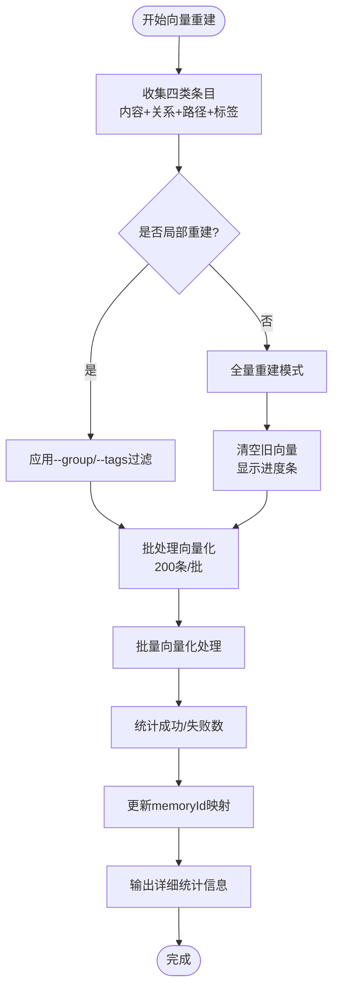
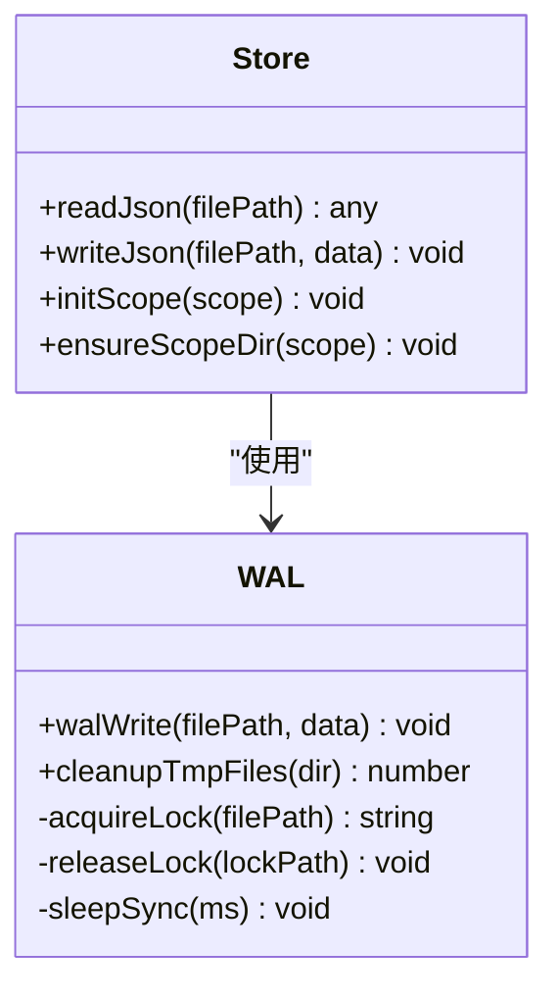
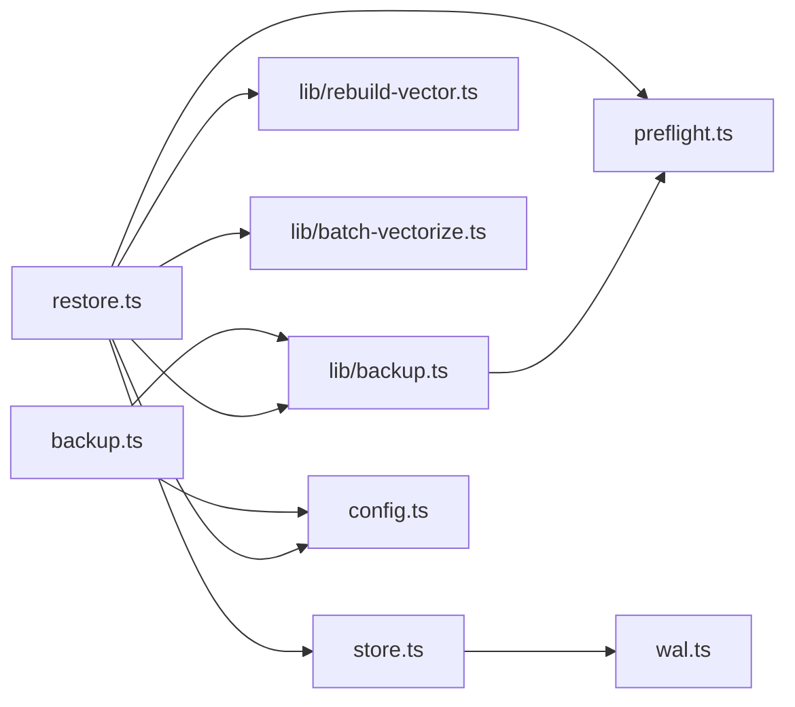

# 备份恢复机制

<cite>
**本文引用的文件**
- [src/lib/backup.ts](file://src/lib/backup.ts)
- [src/backup.ts](file://src/backup.ts)
- [src/restore.ts](file://src/restore.ts)
- [src/lib/rebuild-vector.ts](file://src/lib/rebuild-vector.ts)
- [src/lib/batch-vectorize.ts](file://src/lib/batch-vectorize.ts)
- [src/lib/wal.ts](file://src/lib/wal.ts)
- [src/lib/store.ts](file://src/lib/store.ts)
- [src/lib/config.ts](file://src/lib/config.ts)
- [src/lib/preflight.ts](file://src/lib/preflight.ts)
- [docs/backup-restore.md](file://docs/backup-restore.md)
</cite>

## 更新摘要
**变更内容**
- 增强了向量重建功能，改进了批量处理和进度报告
- 优化了全量重建操作的批处理机制（200条/批）
- 提升了向量化操作的用户体验，提供更详细的进度反馈
- 完善了局部重建和打标功能的错误处理

## 目录
1. [简介](#简介)
2. [项目结构](#项目结构)
3. [核心组件](#核心组件)
4. [架构总览](#架构总览)
5. [详细组件分析](#详细组件分析)
6. [依赖关系分析](#依赖关系分析)
7. [性能与一致性考量](#性能与一致性考量)
8. [故障排查指南](#故障排查指南)
9. [结论](#结论)
10. [附录：操作清单与最佳实践](#附录操作清单与最佳实践)

## 简介
本文件系统性说明知识索引器的备份与恢复机制，覆盖数据备份策略、快照创建流程、增量更新思路、WAL（预写日志）写入机制、事务一致性保证、崩溃恢复流程、备份文件格式与存储位置、压缩策略、恢复操作流程、数据验证方法、迁移工具使用、自动化配置与定时任务建议、存储空间管理，以及多租户隔离下的备份策略与跨环境迁移方案。

**更新** 本次更新重点改进了向量重建功能，包括增强的批处理机制、更好的进度报告和更完善的错误处理。

## 项目结构
围绕备份恢复的核心代码分布在以下模块：
- 备份命令与库：src/backup.ts、src/lib/backup.ts
- 恢复命令与流程：src/restore.ts
- 向量重建引擎：src/lib/rebuild-vector.ts、src/lib/batch-vectorize.ts
- WAL 与原子写入：src/lib/wal.ts
- JSON 存储层与版本兼容：src/lib/store.ts
- 配置与默认路径：src/lib/config.ts
- 写前预检（权限/空间）：src/lib/preflight.ts
- 用户文档：docs/backup-restore.md

**图表来源**
- [src/backup.ts:1-108](file://src/backup.ts#L1-L108)
- [src/lib/backup.ts:1-178](file://src/lib/backup.ts#L1-L178)
- [src/restore.ts:1-527](file://src/restore.ts#L1-L527)
- [src/lib/rebuild-vector.ts:1-520](file://src/lib/rebuild-vector.ts#L1-L520)
- [src/lib/batch-vectorize.ts:1-183](file://src/lib/batch-vectorize.ts#L1-L183)
- [src/lib/wal.ts:1-143](file://src/lib/wal.ts#L1-L143)
- [src/lib/store.ts:1-267](file://src/lib/store.ts#L1-L267)
- [src/lib/config.ts:1-535](file://src/lib/config.ts#L1-L535)
- [src/lib/preflight.ts:1-126](file://src/lib/preflight.ts#L1-L126)

章节来源
- [docs/backup-restore.md:1-254](file://docs/backup-restore.md#L1-L254)

## 核心组件
- 备份库（lib/backup.ts）：提供 scope 快照打包、自动备份、列出备份等能力；使用 tar.gz 压缩；支持时间戳命名与防覆盖；在导入成功后自动触发备份（不阻断主流程）。
- 备份 CLI（src/backup.ts）：ki backup <scope> [--list]，输出结构化 JSON，校验 scope 存在且已初始化。
- 恢复 CLI（src/restore.ts）：ki restore <scope> [--from-snapshot] [--timestamp] [--yes] [--rebuild-vector] [--group/--tags] [--backup-dir]；包含破坏性操作的二次确认与安全网快照、解压失败自动回滚、向量重建提示。
- **增强向量重建引擎（lib/rebuild-vector.ts）**：从已还原 KB 重建三类向量（内容、关系、路径），支持局部重建和打标功能，具备批处理优化和详细进度报告。
- **批处理向量化（lib/batch-vectorize.ts）**：实现高效的批量向量化操作，采用200条/批的分块策略，提供更好的用户体验和错误处理。
- WAL（lib/wal.ts）：跨进程写锁 + .tmp + 原子 rename，确保并发安全与中断安全；提供残留清理工具。
- 存储层（lib/store.ts）：readJson/writeJson 封装，统一 version 字段与 updatedAt 时间戳；从模板初始化 scope；旧格式迁移。
- 配置（lib/config.ts）：dataDir、backupDir、vectorDir 默认路径解析与扩展；scope 级 kbDir 覆盖；strict/default 模式。
- 预检（lib/preflight.ts）：目标目录可写性探测、可用磁盘空间估算与检查；目录体积估算用于备份空间预估。

**更新** 新增了增强的向量重建引擎和批处理向量化模块，显著提升了向量重建的性能和用户体验。

章节来源
- [src/lib/backup.ts:1-178](file://src/lib/backup.ts#L1-L178)
- [src/backup.ts:1-108](file://src/backup.ts#L1-L108)
- [src/restore.ts:1-527](file://src/restore.ts#L1-L527)
- [src/lib/rebuild-vector.ts:1-520](file://src/lib/rebuild-vector.ts#L1-L520)
- [src/lib/batch-vectorize.ts:1-183](file://src/lib/batch-vectorize.ts#L1-L183)
- [src/lib/wal.ts:1-143](file://src/lib/wal.ts#L1-L143)
- [src/lib/store.ts:1-267](file://src/lib/store.ts#L1-L267)
- [src/lib/config.ts:1-535](file://src/lib/config.ts#L1-L535)
- [src/lib/preflight.ts:1-126](file://src/lib/preflight.ts#L1-L126)

## 架构总览
备份恢复由 CLI 驱动，调用库函数完成具体操作；所有关键 JSON 文件通过 WAL 写入保障一致性与原子性；恢复过程包含安全网快照、预检、覆盖还原、可选向量重建。

**图表来源**
- [src/backup.ts:60-108](file://src/backup.ts#L60-L108)
- [src/lib/backup.ts:77-117](file://src/lib/backup.ts#L77-L117)
- [src/lib/preflight.ts:41-90](file://src/lib/preflight.ts#L41-L90)
- [src/lib/config.ts:408-419](file://src/lib/config.ts#L408-L419)

**图表来源**
- [src/restore.ts:124-284](file://src/restore.ts#L124-L284)
- [src/lib/backup.ts:87-117](file://src/lib/backup.ts#L87-L117)
- [src/lib/rebuild-vector.ts:329-519](file://src/lib/rebuild-vector.ts#L329-L519)
- [src/lib/batch-vectorize.ts:132-182](file://src/lib/batch-vectorize.ts#L132-L182)
- [src/lib/preflight.ts:41-90](file://src/lib/preflight.ts#L41-L90)
- [src/lib/store.ts:51-62](file://src/lib/store.ts#L51-L62)
- [src/lib/wal.ts:78-112](file://src/lib/wal.ts#L78-L112)

## 详细组件分析

### 备份策略与快照创建流程
- 备份粒度：按 scope 为单位进行快照，避免跨 scope 污染。
- 存储布局：{backupDir}/{scope}/snapshots/snapshot.{YYYYMMDD-HHMMSS[-序号]}.tar.gz。
- 压缩格式：tar.gz（系统 tar 命令），文件名带秒级时间戳，同秒内多次备份通过递增序号避免覆盖。
- 预检：目标目录可写性检查 + 磁盘空间检查（以源目录体积为估算上界）。
- 自动备份：import 成功后自动触发，失败仅告警不阻断主流程。
- 列表备份：扫描 snapshots 目录，正则匹配并排序，返回 file/timestamp/size。

**图表来源**
- [src/lib/backup.ts:60-117](file://src/lib/backup.ts#L60-L117)
- [src/lib/preflight.ts:41-90](file://src/lib/preflight.ts#L41-L90)

章节来源
- [src/lib/backup.ts:1-178](file://src/lib/backup.ts#L1-L178)
- [src/backup.ts:1-108](file://src/backup.ts#L1-L108)
- [docs/backup-restore.md:37-118](file://docs/backup-restore.md#L37-L118)

### 恢复流程与安全性设计
- 非交互确认：未加 --yes 时展示还原总览（目标目录规模、来源快照），并以特定错误码退出，要求显式重新执行。
- 安全网快照：还原前对现有 scope 目录创建安全网快照（始终写入受管默认 backupDir），失败则中止还原，避免不可逆数据丢失窗口。
- 预检：解压前检查目标父目录可写性与空间（保守按 tar.gz 膨胀倍数估算）。
- 覆盖还原：删除现有 scope 目录后解压；若解压失败且存在安全网快照，尝试自动回滚至原状态。
- **增强的向量重建**：KB 还原不包含向量，需单独执行 --rebuild-vector；支持全量或局部重建（--group/--tags），但不可与 --from-snapshot 组合。

**图表来源**
- [src/restore.ts:124-284](file://src/restore.ts#L124-L284)
- [src/lib/backup.ts:87-117](file://src/lib/backup.ts#L87-L117)
- [src/lib/preflight.ts:41-90](file://src/lib/preflight.ts#L41-L90)

章节来源
- [src/restore.ts:1-527](file://src/restore.ts#L1-L527)
- [docs/backup-restore.md:121-179](file://docs/backup-restore.md#L121-L179)

### 增强的向量重建机制

**更新** 向量重建功能得到了显著增强，包括批处理优化、进度报告和错误处理改进。

#### 批处理向量化
- **分批大小**：采用200条/批的策略，平衡内存使用和性能
- **进度反馈**：在多批场景下提供实时进度报告，提升用户体验
- **错误隔离**：单批失败不影响其他批次，提高整体成功率
- **内存优化**：避免一次性处理大量数据导致的内存压力

#### 全量重建优化
- **计数注入**：通过 countScope 注入真实计数，显示删除进度条
- **智能清空**：仅在必要时清空旧向量，减少不必要的操作
- **幂等性保证**：支持重复执行，不会产生副作用

#### 局部重建增强
- **范围过滤**：支持 --group 指定 Group 子树进行局部重建
- **标签合并**：支持 --tags 为重建范围内的文档附加自定义标签
- **安全校验**：防止误将局部重建降级为全量清空重建
- **增量友好**：局部重建不清除导入中断标记，保留引导信息

**图表来源**
- [src/lib/rebuild-vector.ts:329-519](file://src/lib/rebuild-vector.ts#L329-L519)
- [src/lib/batch-vectorize.ts:132-182](file://src/lib/batch-vectorize.ts#L132-L182)

章节来源
- [src/lib/rebuild-vector.ts:1-520](file://src/lib/rebuild-vector.ts#L1-L520)
- [src/lib/batch-vectorize.ts:1-183](file://src/lib/batch-vectorize.ts#L1-L183)
- [src/restore.ts:453-491](file://src/restore.ts#L453-L491)

### WAL 写入机制与事务一致性
- 并发控制：通过 .lock 文件实现跨进程写锁，自旋等待 + 陈旧锁抢占 + 超时抢占，避免死锁与 Last-Write-Wins 静默覆盖。
- 原子写入：先写 .tmp，再 fs.renameSync 原子替换目标文件；即使写入中断也不会损坏原文件。
- 同步语义：当前实现为同步阻塞（Atomics.wait），正常争用窗口毫秒级；极端高并发或持锁进程崩溃时可能出现秒级阻塞。
- 清理机制：cleanupTmpFiles 清理 .tmp 与陈旧 .lock，保护并发进程的活锁。
- 存储层集成：writeJson 统一注入 version 与 updatedAt，并通过 walWrite 持久化；readJson 读取时进行版本兼容性检查。

**图表来源**
- [src/lib/wal.ts:1-143](file://src/lib/wal.ts#L1-L143)
- [src/lib/store.ts:1-267](file://src/lib/store.ts#L1-L267)

章节来源
- [src/lib/wal.ts:1-143](file://src/lib/wal.ts#L1-L143)
- [src/lib/store.ts:1-267](file://src/lib/store.ts#L1-L267)

### 增量更新机制
- 快照粒度：按 scope 的完整目录打包，属于"全量快照"而非块级增量。
- 增量思路：通过保留多个时间戳快照实现"逻辑增量"，可按时间点回退；结合向量层的局部重建（--group/--tags）可实现部分数据的增量重建。
- 限制：KB 原文与索引采用快照方式；向量层支持局部重建但不随快照还原，需单独执行。

章节来源
- [src/lib/backup.ts:1-178](file://src/lib/backup.ts#L1-L178)
- [src/restore.ts:451-490](file://src/restore.ts#L451-L490)
- [docs/backup-restore.md:166-179](file://docs/backup-restore.md#L166-L179)

### 备份文件格式、存储位置与压缩策略
- 格式：tar.gz（系统 tar 命令压缩）。
- 存储位置：{backupDir}/{scope}/snapshots/snapshot.{YYYYMMDD-HHMMSS[-序号]}.tar.gz。
- 命名规则：秒级时间戳 + 防覆盖序号；列表时按 timestamp 字典序排序。
- 压缩策略：依赖系统 tar 的 gzip 压缩；无额外自定义压缩算法。

章节来源
- [src/lib/backup.ts:30-58](file://src/lib/backup.ts#L30-L58)
- [src/lib/backup.ts:87-117](file://src/lib/backup.ts#L87-L117)
- [src/lib/backup.ts:152-178](file://src/lib/backup.ts#L152-L178)
- [docs/backup-restore.md:30-33](file://docs/backup-restore.md#L30-L33)

### 恢复操作流程与数据验证
- 列出备份：ki restore <scope> 或 ki restore <scope> --list，显示可用快照与备份目录位置。
- 指定快照：--from-snapshot 可直接指定文件路径，或从约定目录选择最新/--timestamp。
- 二次确认：未加 --yes 时仅展示总览并要求显式重新执行。
- **增强的数据验证**：
  - KB 层：还原后 group-index.json 与 relations-cache.json 应存在且可解析（store.ts readJson 会做版本检查）。
  - 向量层：如需语义检索，执行 --rebuild-vector；支持全量或局部重建（--group/--tags），局部重建不清除导入中断标记。
  - 健康检查：可使用 ki doctor 进行配置与环境健康检查（参考运维专家文档）。
  - **进度监控**：全量重建时显示详细的进度信息和统计结果。

章节来源
- [src/restore.ts:286-307](file://src/restore.ts#L286-L307)
- [src/restore.ts:309-450](file://src/restore.ts#L309-L450)
- [src/lib/store.ts:23-49](file://src/lib/store.ts#L23-L49)
- [docs/backup-restore.md:123-179](file://docs/backup-restore.md#L123-L179)

### 迁移工具使用
- 本地 KB 重建：ki restore <scope> --rebuild-vector 可从已还原 KB 重建内容/关系/路径向量。
- 局部重建：--group 指定 Group 子树幂等覆盖；--tags 为重建范围附加标签（与已有标签合并去重）。
- 组合约束：--from-snapshot 不支持与 --group/--tags 局部重建组合，因快照还原后向量层需与 KB 全量对齐。
- **增强的错误处理**：提供更详细的错误信息和恢复指导。

章节来源
- [src/restore.ts:451-490](file://src/restore.ts#L451-L490)
- [docs/backup-restore.md:166-179](file://docs/backup-restore.md#L166-L179)

### 备份自动化配置、定时任务与存储空间管理
- 自动化触发：import 成功后自动备份（autoBackup），失败仅告警不阻断。
- 定时任务建议：
  - 基于系统 cron 定期执行 ki backup <scope> 或批量脚本遍历 scopes 执行备份。
  - 结合外部监控对 backupDir 空间与健康进行检查（ki doctor）。
- 存储空间管理：
  - 预检阶段估算源目录体积作为 tar.gz 的上界，避免 ENOSPC。
  - 恢复阶段按 tar.gz 膨胀倍数保守估算解压所需空间。
  - 定期清理历史快照（按时间策略）以避免占用过多空间。

章节来源
- [src/lib/backup.ts:119-143](file://src/lib/backup.ts#L119-L143)
- [src/lib/preflight.ts:61-90](file://src/lib/preflight.ts#L61-L90)
- [docs/backup-restore.md:89-118](file://docs/backup-restore.md#L89-L118)

### 多租户隔离下的备份策略与跨环境迁移
- 多租户隔离：每个 scope 对应独立数据目录（kb/{scope}），备份与恢复均以 scope 为单位，天然隔离。
- 配置隔离：可通过 config.scopes.<scope>.kbDir 为不同 scope 指定独立存储路径；backupDir 全局或按部署划分。
- 跨环境迁移：
  - 将某 scope 的快照文件复制到目标环境的 backupDir 下相同布局，然后执行 ki restore --from-snapshot。
  - 向量层需在目标环境重新构建（--rebuild-vector），因为向量数据不随快照还原。
  - 严格模式（scopeMode=strict）下需确保目标环境配置中注册了该 scope。

章节来源
- [src/lib/config.ts:408-419](file://src/lib/config.ts#L408-L419)
- [src/lib/config.ts:470-485](file://src/lib/config.ts#L470-L485)
- [src/restore.ts:124-284](file://src/restore.ts#L124-L284)

## 依赖关系分析
- CLI 层（backup.ts、restore.ts）依赖 lib 层（backup.ts、store.ts、config.ts、preflight.ts、wal.ts）。
- **新增依赖**：restore.ts 现在依赖 rebuild-vector.ts 和 batch-vectorize.ts 进行向量重建。
- WAL 被 store.ts 用于 JSON 原子写入；restore.ts 在恢复前后调用 backup.ts 进行安全网快照。
- 配置决定数据与备份路径；预检保障写操作前置条件。

**图表来源**
- [src/backup.ts:1-108](file://src/backup.ts#L1-L108)
- [src/restore.ts:1-527](file://src/restore.ts#L1-L527)
- [src/lib/backup.ts:1-178](file://src/lib/backup.ts#L1-L178)
- [src/lib/rebuild-vector.ts:1-520](file://src/lib/rebuild-vector.ts#L1-L520)
- [src/lib/batch-vectorize.ts:1-183](file://src/lib/batch-vectorize.ts#L1-L183)
- [src/lib/store.ts:1-267](file://src/lib/store.ts#L1-L267)
- [src/lib/wal.ts:1-143](file://src/lib/wal.ts#L1-L143)
- [src/lib/config.ts:1-535](file://src/lib/config.ts#L1-L535)
- [src/lib/preflight.ts:1-126](file://src/lib/preflight.ts#L1-L126)

章节来源
- [src/backup.ts:1-108](file://src/backup.ts#L1-L108)
- [src/restore.ts:1-527](file://src/restore.ts#L1-L527)
- [src/lib/backup.ts:1-178](file://src/lib/backup.ts#L1-L178)
- [src/lib/rebuild-vector.ts:1-520](file://src/lib/rebuild-vector.ts#L1-L520)
- [src/lib/batch-vectorize.ts:1-183](file://src/lib/batch-vectorize.ts#L1-L183)
- [src/lib/store.ts:1-267](file://src/lib/store.ts#L1-L267)
- [src/lib/wal.ts:1-143](file://src/lib/wal.ts#L1-L143)
- [src/lib/config.ts:1-535](file://src/lib/config.ts#L1-L535)
- [src/lib/preflight.ts:1-126](file://src/lib/preflight.ts#L1-L126)

## 性能与一致性考量
- WAL 同步阻塞：当前实现为同步等待锁，事件循环在锁争用期间短暂冻结；正常争用窗口毫秒级，极端场景可能秒级。
- 原子写入：.tmp + rename 保证中断安全，避免损坏原文件。
- 并发安全：跨进程写锁避免多进程/多 MCP 工具并发写 JSON 导致的数据竞争。
- 预检优化：备份/恢复前进行可写性与空间预检，减少中途失败成本。
- **增强的向量重建性能**：
  - 批处理优化：200条/批的策略平衡内存使用和性能
  - 进度反馈：多批场景下提供实时进度报告
  - 错误隔离：单批失败不影响其他批次
  - 智能清空：仅在必要时清空旧向量
- 向量重建：按需执行，支持局部重建以减少开销。

章节来源
- [src/lib/wal.ts:1-143](file://src/lib/wal.ts#L1-L143)
- [src/lib/preflight.ts:41-90](file://src/lib/preflight.ts#L41-L90)
- [src/restore.ts:453-491](file://src/restore.ts#L453-L491)
- [src/lib/rebuild-vector.ts:329-519](file://src/lib/rebuild-vector.ts#L329-L519)
- [src/lib/batch-vectorize.ts:132-182](file://src/lib/batch-vectorize.ts#L132-L182)

## 故障排查指南
- 常见错误与处理：
  - tar 不可用：安装 tar（Linux/macOS 内置，Windows 请安装 Git for Windows）。
  - 目录不可写：检查目标目录权限或使用有写权限的路径。
  - 磁盘空间不足：清理空间或调整 backupDir/dataDir 所在分区。
  - 快照不存在：检查 backupDir 布局与文件名格式；使用 --backup-dir 指定其他备份根目录。
  - 还原前安全网快照失败：修复权限/空间/tar 问题后重试；不会删除任何现有数据。
  - 解压失败：若存在安全网快照会自动恢复原始数据；否则检查快照完整性。
  - **向量重建失败**：检查 embedding 密钥与网络连通性；查看 errors 字段定位失败条目；利用增强的错误信息进行诊断。
  - **批处理错误**：关注批间进度报告，定位具体失败的批次进行处理。
- 诊断工具：
  - ki doctor：配置与环境健康检查（只读，失败项退出码 1）。
  - 清理残留：使用 WAL 提供的 cleanupTmpFiles 清理 .tmp 与陈旧 .lock。
  - **重建统计**：利用重建过程中的详细统计信息进行性能分析和故障定位。

章节来源
- [src/restore.ts:65-75](file://src/restore.ts#L65-L75)
- [src/restore.ts:186-200](file://src/restore.ts#L186-L200)
- [src/restore.ts:212-232](file://src/restore.ts#L212-L232)
- [src/restore.ts:239-271](file://src/restore.ts#L239-L271)
- [src/lib/wal.ts:114-143](file://src/lib/wal.ts#L114-L143)
- [docs/backup-restore.md:198-244](file://docs/backup-restore.md#L198-L244)

## 结论
本系统的备份恢复机制以 scope 为隔离单元，采用 tar.gz 快照与 WAL 原子写入，配合严格的预检与安全网快照，确保备份与恢复过程的安全性与可回滚性。**本次更新显著增强了向量重建功能**，通过批处理优化、进度报告和错误处理改进，大幅提升了用户体验和系统可靠性。恢复后可按需重建向量，支持全量与局部重建。通过配置化的数据与备份路径、多 scope 隔离与严格模式，满足多租户与跨环境迁移需求。建议结合定时任务与空间管理策略，形成生产可用的备份恢复体系。

## 附录：操作清单与最佳实践
- 快速备份：ki backup <scope>
- 列出备份：ki backup <scope> --list 或 ki restore <scope>
- 从快照恢复：ki restore <scope> --from-snapshot --yes
- 指定快照：--timestamp <ts> 或直接指定文件路径
- **增强的向量重建**：ki restore <scope> --rebuild-vector [--group <path>] [--tags <t1,t2>]
  - 全量重建：重建所有内容、关系、路径向量
  - 局部重建：仅重建指定 Group 子树
  - 标签打标：为重建范围内文档附加自定义标签
- 跨环境迁移：复制快照到目标 backupDir 相同布局，执行恢复后重建向量
- 自动化建议：cron 定时执行 ki backup；结合 ki doctor 监控健康
- 空间管理：定期清理历史快照；监控 backupDir/dataDir 容量
- **性能优化**：利用批处理进度报告监控重建过程，及时发现问题

章节来源
- [docs/backup-restore.md:5-35](file://docs/backup-restore.md#L5-L35)
- [docs/backup-restore.md:75-118](file://docs/backup-restore.md#L75-L118)
- [docs/backup-restore.md:123-179](file://docs/backup-restore.md#L123-L179)
- [src/restore.ts:453-491](file://src/restore.ts#L453-L491)
- [src/lib/rebuild-vector.ts:329-519](file://src/lib/rebuild-vector.ts#L329-L519)
- [src/lib/batch-vectorize.ts:132-182](file://src/lib/batch-vectorize.ts#L132-L182)