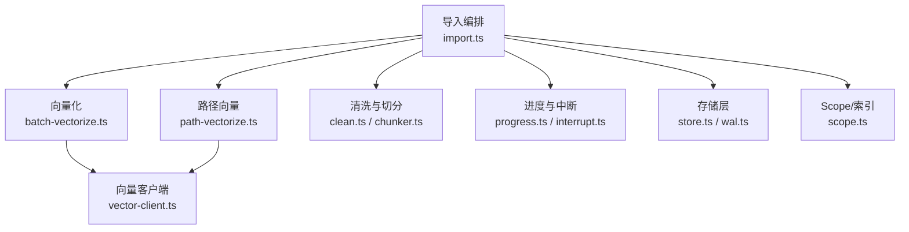
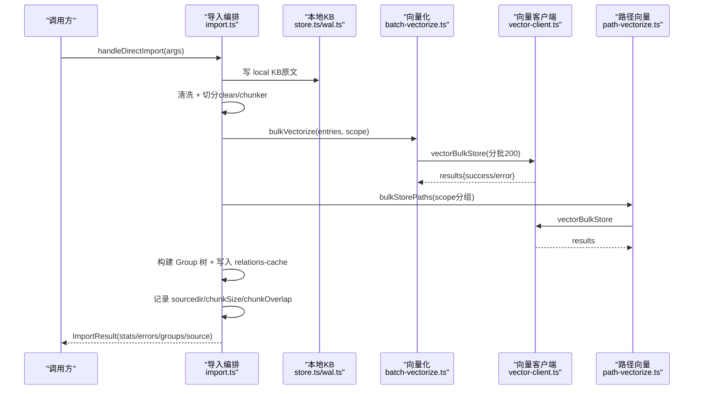
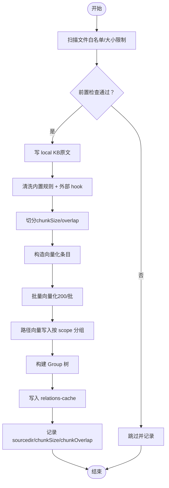
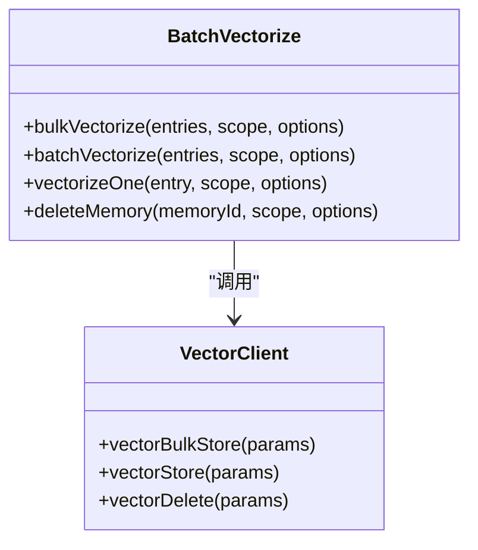
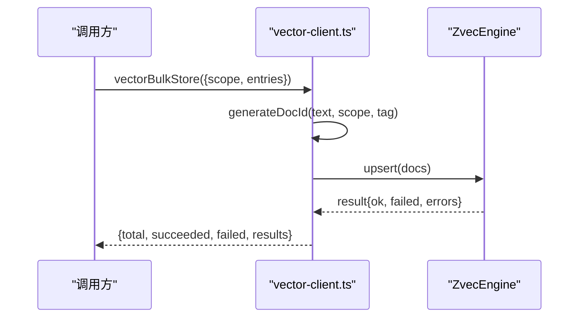
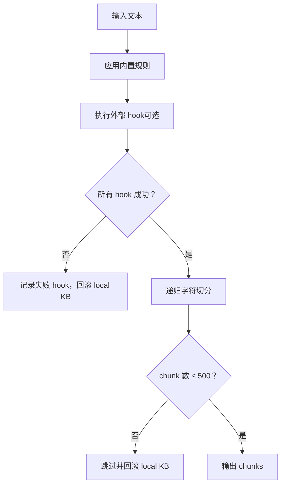
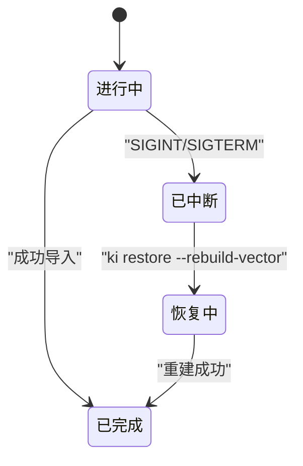
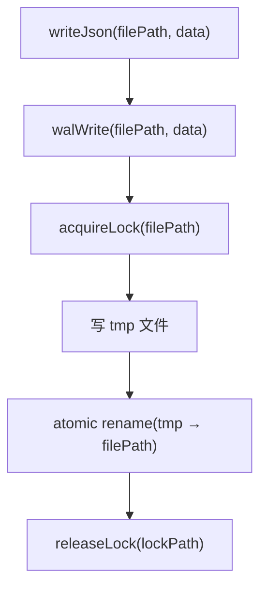
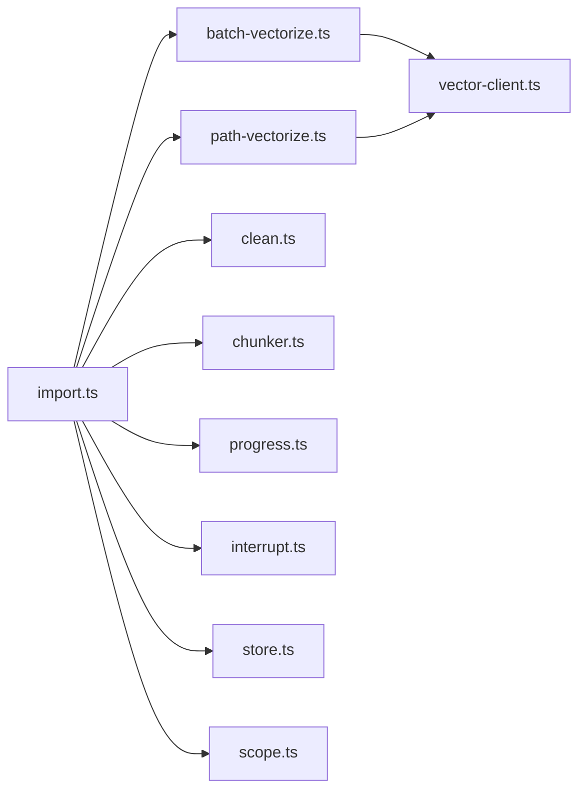

# 批量操作技巧

<cite>
**本文引用的文件**
- [import.ts](file://src/lib/import.ts)
- [batch-vectorize.ts](file://src/lib/batch-vectorize.ts)
- [vector-client.ts](file://src/lib/vector-client.ts)
- [progress.ts](file://src/lib/progress.ts)
- [interrupt.ts](file://src/lib/interrupt.ts)
- [wal.ts](file://src/lib/wal.ts)
- [chunker.ts](file://src/lib/chunker.ts)
- [clean.ts](file://src/lib/clean.ts)
- [path-vectorize.ts](file://src/lib/path-vectorize.ts)
- [scope.ts](file://src/lib/scope.ts)
- [store.ts](file://src/lib/store.ts)
</cite>

## 目录
1. [简介](#简介)
2. [项目结构](#项目结构)
3. [核心组件](#核心组件)
4. [架构总览](#架构总览)
5. [详细组件分析](#详细组件分析)
6. [依赖关系分析](#依赖关系分析)
7. [性能考虑](#性能考虑)
8. [故障排查指南](#故障排查指南)
9. [结论](#结论)
10. [附录](#附录)

## 简介
本文件面向大规模知识库导入的“批量操作技巧”，围绕分批处理、并发控制、内存管理、进度监控、错误重试、断点续传、性能调优与故障恢复等主题，结合代码实现给出可落地的最佳实践。重点覆盖：
- 分批策略与并行度设置（向量化批大小、路径向量分组写入）
- 并发控制与锁机制（导入锁、WAL 写锁、引擎串行化与空闲释放）
- 内存管理与切分（chunk 算法、单文件上限、避免超大 chunk 爆炸）
- 进度监控与可观测性（阶段日志、控制台进度条、统计汇总）
- 错误处理与重试（失败条目不中断整体、撞锁重试、hook 超时保护）
- 断点续传与一致性（中断标记、原子写入、幂等 upsert、source 参数持久化）
- 增量更新与数据一致性（覆盖导入、冲突跳过、重建向量）
- 指标收集与问题诊断（日志、错误明细、向量库可用性检测）

## 项目结构
本项目将“批量导入”拆分为多个职责清晰的模块：
- 导入编排：import.ts（直导入口、Phase 编排、Group 树构建、relations-cache 写入、source 记录）
- 向量化：batch-vectorize.ts（批量/单条向量化）、vector-client.ts（底层向量引擎封装）
- 路径向量：path-vectorize.ts（ki-path/ki-relation 辅助向量批量写入）
- 文本清洗与切分：clean.ts（内置规则与外部 hook）、chunker.ts（递归字符切分）
- 进度与中断：progress.ts（控制台进度）、interrupt.ts（中断标记与导入锁）
- 存储与 WAL：store.ts（JSON 读写）、wal.ts（原子写入与写锁）
- Scope 与索引：scope.ts（路径构造、group-index/source 块）、store.ts（模板初始化、迁移）

图表来源
- [import.ts:214-564](file://src/lib/import.ts#L214-L564)
- [batch-vectorize.ts:132-182](file://src/lib/batch-vectorize.ts#L132-L182)
- [vector-client.ts:574-617](file://src/lib/vector-client.ts#L574-L617)
- [path-vectorize.ts:75-116](file://src/lib/path-vectorize.ts#L75-L116)
- [clean.ts:48-130](file://src/lib/clean.ts#L48-L130)
- [chunker.ts:57-92](file://src/lib/chunker.ts#L57-L92)
- [progress.ts:28-61](file://src/lib/progress.ts#L28-L61)
- [interrupt.ts:44-130](file://src/lib/interrupt.ts#L44-L130)
- [store.ts:55-62](file://src/lib/store.ts#L55-L62)
- [wal.ts:92-112](file://src/lib/wal.ts#L92-L112)
- [scope.ts:205-229](file://src/lib/scope.ts#L205-L229)

章节来源
- [import.ts:214-564](file://src/lib/import.ts#L214-L564)
- [store.ts:55-62](file://src/lib/store.ts#L55-L62)
- [wal.ts:92-112](file://src/lib/wal.ts#L92-L112)

## 核心组件
- 导入编排（handleDirectImport）
  - 扫描与白名单过滤、文件大小限制、relation 冲突检测
  - 先写 local KB 原文，再清洗→切分→构造向量化条目
  - Phase 2 向量化（bulkVectorize），Phase 3 构建 Group 树，Phase 4 写入 relations-cache，Phase 5 记录 source（含切分参数）
  - 支持 --no-vector 仅写 KB 层；自定义标签向量写入（每个 tag 一条）
- 向量化（batch-vectorize）
  - bulkVectorize：按固定批次（默认 200）提交 vectorBulkStore，批间输出进度
  - batchVectorize/vectorizeOne：兼容串行场景
  - deleteMemory：按 docId 删除
- 向量客户端（vector-client）
  - 引擎单例、空闲释放锁、撞锁重试、open/create 超时
  - 批量存储 vectorBulkStore（幂等 upsert，docId = sha256(text+scope+tag)）
  - 删除/计数/列出 scope/tag、可用性检测 ensureVectorAvailable
- 路径向量（path-vectorize）
  - 按 scope 分组后批量写入 ki-path/ki-relation 辅助向量
- 清洗与切分（clean + chunker）
  - 内置规则（BOM/frontmatter/htmlComment/mermaid/codePath/codeBlock）
  - 外部 hook 管道（stdin/stdout，超时 SIGKILL）
  - 递归字符切分（优先段落边界，overlap 保留上下文，MAX_CHUNKS_PER_FILE=500）
- 进度与中断（progress + interrupt）
  - 控制台进度条（stderr，非 TTY 逐行）
  - 中断标记 import-interrupt.json（含 processedFiles/totalFiles/signal）
  - 导入锁 .import.lock（pid 存活检查，残留清理）
- 存储与 WAL（store + wal）
  - writeJson 通过 walWrite 原子写入（.tmp → rename）
  - 跨进程写锁（O_EXCL 锁文件，陈旧锁抢占，自旋等待）
- Scope/索引（scope + store）
  - group-index/source 块持久化（dir/chunkSize/chunkOverlap）
  - 模板初始化、旧格式迁移（roots→groups）

章节来源
- [import.ts:214-564](file://src/lib/import.ts#L214-L564)
- [batch-vectorize.ts:132-182](file://src/lib/batch-vectorize.ts#L132-L182)
- [vector-client.ts:574-617](file://src/lib/vector-client.ts#L574-L617)
- [path-vectorize.ts:75-116](file://src/lib/path-vectorize.ts#L75-L116)
- [clean.ts:48-130](file://src/lib/clean.ts#L48-L130)
- [chunker.ts:57-92](file://src/lib/chunker.ts#L57-L92)
- [progress.ts:28-61](file://src/lib/progress.ts#L28-L61)
- [interrupt.ts:44-130](file://src/lib/interrupt.ts#L44-L130)
- [store.ts:55-62](file://src/lib/store.ts#L55-L62)
- [wal.ts:92-112](file://src/lib/wal.ts#L92-L112)
- [scope.ts:205-229](file://src/lib/scope.ts#L205-L229)

## 架构总览
导入主流程采用“先本地 KB，后向量层”的两通道设计，确保即使向量化失败也不影响 KB 层一致性；同时通过 WAL 原子写入与导入锁保证多进程安全。

图表来源
- [import.ts:214-564](file://src/lib/import.ts#L214-L564)
- [batch-vectorize.ts:132-182](file://src/lib/batch-vectorize.ts#L132-L182)
- [vector-client.ts:574-617](file://src/lib/vector-client.ts#L574-L617)
- [path-vectorize.ts:75-116](file://src/lib/path-vectorize.ts#L75-L116)

## 详细组件分析

### 导入编排（handleDirectImport）
- 分批与并发
  - 文件级循环：逐文件读取→前置检查（大小超限/冲突）→写 local KB→清洗→切分→构造 entries
  - 向量化分批：bulkVectorize 内部按 200 条一批提交，批间输出进度
  - 路径向量：按 scope 分组后批量写入，减少 embed 次数
- 进度与中断
  - logProgress 实时显示文件处理进度（stderr，TTY 覆写，非 TTY 逐行）
  - 捕获 SIGINT/SIGTERM：写入中断标记（processedFiles/totalFiles/signal），清导入锁并退出
- 错误与幂等
  - relation 冲突（同 group 同名不同源）→ 跳过并告警
  - 清洗 hook 失败→回滚 local KB 并计入 skipped
  - 覆盖导入：若已有向量则先删除旧向量再重建，避免孤儿向量
- 数据一致性
  - 先写 local KB，再写 relations-cache；source 块持久化切分参数，便于后续重建/增量
  - WAL 原子写入 JSON，避免并发写损坏

图表来源
- [import.ts:214-564](file://src/lib/import.ts#L214-L564)
- [chunker.ts:57-92](file://src/lib/chunker.ts#L57-L92)
- [batch-vectorize.ts:132-182](file://src/lib/batch-vectorize.ts#L132-L182)
- [path-vectorize.ts:75-116](file://src/lib/path-vectorize.ts#L75-L116)

章节来源
- [import.ts:214-564](file://src/lib/import.ts#L214-L564)

### 向量化（batch-vectorize）
- 批量策略
  - VECTORIZE_BATCH_SIZE=200：一次 vectorBulkStore 完成嵌入与写入，降低网络/引擎开销
  - 失败条目记入 errors，不中断整体；批间进度反馈提升可观测性
- 单条兼容
  - vectorizeOne 用于增量 modify 场景；deleteMemory 按 docId 删除
- 与路径向量协同
  - 主内容向量（ki-search）与辅助向量（ki-path/ki-relation）分别批量写入，互不影响

图表来源
- [batch-vectorize.ts:52-182](file://src/lib/batch-vectorize.ts#L52-L182)
- [vector-client.ts:574-617](file://src/lib/vector-client.ts#L574-L617)

章节来源
- [batch-vectorize.ts:52-182](file://src/lib/batch-vectorize.ts#L52-L182)

### 向量客户端（vector-client）
- 引擎生命周期
  - 单例 getEngine：首次 create/open，带超时保护；空闲释放锁（常驻 MCP 模式）
  - 撞锁重试：probeWithRetry 等待对方释放后重试（最多 3 次，间隔 2s）
- 批量存储
  - vectorBulkStore：生成 docId（sha256(text+scope+tag)），upsert 多条，返回逐项结果
- 可用性检测
  - ensureVectorAvailable：fastFail 模式轻量 probe；提示中断引导（若有中断标记）

图表来源
- [vector-client.ts:260-262](file://src/lib/vector-client.ts#L260-L262)
- [vector-client.ts:574-617](file://src/lib/vector-client.ts#L574-L617)

章节来源
- [vector-client.ts:111-124](file://src/lib/vector-client.ts#L111-L124)
- [vector-client.ts:260-262](file://src/lib/vector-client.ts#L260-L262)
- [vector-client.ts:574-617](file://src/lib/vector-client.ts#L574-L617)

### 清洗与切分（clean + chunker）
- 清洗规则
  - 内置：BOM/frontmatter/htmlComment/mermaid/codePath/codeBlock，异常降级返回原文
  - 外部 hook：顺序执行，超时 SIGKILL，失败记录 failedHooks 不阻断后续
- 切分算法
  - 目标长度 chunkSize，重叠 overlap；优先在 \n\n > \n > 。 > ； 处切分
  - MAX_CHUNKS_PER_FILE=500，超限视为超大文件，回滚 local KB 并跳过

图表来源
- [clean.ts:48-130](file://src/lib/clean.ts#L48-L130)
- [clean.ts:177-227](file://src/lib/clean.ts#L177-L227)
- [chunker.ts:57-92](file://src/lib/chunker.ts#L57-L92)

章节来源
- [clean.ts:48-130](file://src/lib/clean.ts#L48-L130)
- [clean.ts:177-227](file://src/lib/clean.ts#L177-L227)
- [chunker.ts:57-92](file://src/lib/chunker.ts#L57-L92)

### 进度与中断（progress + interrupt）
- 进度展示
  - logPhaseStart/logPhaseDone/logProgress：stderr 输出，非 TTY 逐行，避免污染 stdout JSON
- 中断标记
  - writeInterruptMark：原子写 import-interrupt.json（含 processedFiles/totalFiles/signal）
  - 读取/清除：rebuild-vector/restore 成功后自动清除；import 成功也清除
- 导入锁
  - acquireImportLock：.import.lock 包含 pid/startedAt；pid 不存在或锁陈旧则清理
  - releaseImportLock：正常完成时清锁与中断标记

图表来源
- [progress.ts:28-61](file://src/lib/progress.ts#L28-L61)
- [interrupt.ts:44-130](file://src/lib/interrupt.ts#L44-L130)

章节来源
- [progress.ts:28-61](file://src/lib/progress.ts#L28-L61)
- [interrupt.ts:44-130](file://src/lib/interrupt.ts#L44-L130)

### 存储与 WAL（store + wal）
- WAL 写入
  - walWrite：获取写锁 → 写 .tmp → 原子 rename → 释放锁；避免并发写损坏
  - 锁机制：O_EXCL 创建锁文件，陈旧锁（>30s）可抢占，自旋等待（最长 10s）
- JSON 存储
  - writeJson：自动添加 version/updatedAt，委托 walWrite
  - readJson：解析失败抛出 CORRUPT_JSON，建议从备份恢复

图表来源
- [store.ts:55-62](file://src/lib/store.ts#L55-L62)
- [wal.ts:92-112](file://src/lib/wal.ts#L92-L112)

章节来源
- [store.ts:55-62](file://src/lib/store.ts#L55-L62)
- [wal.ts:92-112](file://src/lib/wal.ts#L92-L112)

### Scope/索引（scope + store）
- source 块持久化
  - setSource：写入 dir/chunkSize/chunkOverlap，供后续重建/增量使用
- 模板初始化与迁移
  - initScope：复制 _template/group-index.json 与 relations-cache.json
  - migrateGroupIndex：roots→groups 自动迁移

章节来源
- [scope.ts:205-229](file://src/lib/scope.ts#L205-L229)
- [store.ts:229-267](file://src/lib/store.ts#L229-L267)

## 依赖关系分析
- 低耦合高内聚
  - import.ts 作为编排器，依赖 batch-vectorize、path-vectorize、clean、chunker、progress、interrupt、store、scope
  - vector-client 独立封装引擎细节，向上提供统一接口
- 关键依赖链
  - 导入 → 向量化 → 向量客户端 → 引擎（zvec-engine）
  - 导入 → 路径向量 → 向量客户端
  - 导入 → 存储层 → WAL → 文件系统
- 潜在环依赖
  - 无直接环依赖；import 依赖各子模块，子模块不反向依赖 import

图表来源
- [import.ts:214-564](file://src/lib/import.ts#L214-L564)
- [batch-vectorize.ts:132-182](file://src/lib/batch-vectorize.ts#L132-L182)
- [path-vectorize.ts:75-116](file://src/lib/path-vectorize.ts#L75-L116)

章节来源
- [import.ts:214-564](file://src/lib/import.ts#L214-L564)

## 性能考虑
- 批量大小调优
  - 向量化批大小：VECTORIZE_BATCH_SIZE=200，平衡单次请求体积与中间态进度
  - 路径向量：按 scope 分组批量写入，减少重复 embed
- 并行度设置
  - 导入主流程串行（确保一致性），但向量与 KB 两通道解耦（先 KB 后向量）
  - 向量客户端空闲释放锁（常驻 MCP 模式），错开共享向量库使用
- 资源使用优化
  - 切分上限 MAX_CHUNKS_PER_FILE=500，防止单文件向量爆炸
  - 文件大小限制（默认 1MB，可配置），超限跳过并告警
  - 引擎 open/create 超时（20s），避免原生阻塞导致服务不可用
- 建议
  - 大库导入时适当增大 chunkSize（如 1500~2000）以减少 chunk 数量
  - 多 scope 导入时错峰执行，避免向量库撞锁
  - 监控 vectorBulkStore 失败率，定位网络/引擎瓶颈

[本节为通用指导，无需特定文件引用]

## 故障排查指南
- 常见问题
  - 向量库被占用：ensureVectorAvailable 返回 LOCKED，提示停止 MCP/CLI 或等待锁释放
  - 向量库损坏：返回 CORRUPTED，建议 ki restore --from-snapshot --rebuild-vector
  - 导入中断：存在 import-interrupt.json，建议 ki restore --rebuild-vector 恢复
- 日志与指标
  - 阶段日志：logPhaseStart/logPhaseDone 输出阶段信息
  - 进度条：logProgress 显示当前/总数与百分比
  - 统计汇总：ImportResult.stats（total/vectorized/errors/skipped/vector）
- 诊断步骤
  - 检查 .import.lock 是否存在且 pid 存活（acquireImportLock 逻辑）
  - 查看 import-interrupt.json 中的 processedFiles/totalFiles/signal
  - 检查 vector-client 撞锁重试日志（probeWithRetry）
  - 验证 source 块（dir/chunkSize/chunkOverlap）是否完整

章节来源
- [vector-client.ts:440-494](file://src/lib/vector-client.ts#L440-L494)
- [interrupt.ts:44-130](file://src/lib/interrupt.ts#L44-L130)
- [progress.ts:28-61](file://src/lib/progress.ts#L28-L61)
- [import.ts:548-564](file://src/lib/import.ts#L548-L564)

## 结论
本项目通过“本地 KB 先行 + 向量层后补”的两通道设计，结合 WAL 原子写入、导入锁、中断标记与批量向量化，实现了大规模知识库导入的高可用与高性能。推荐实践包括：
- 合理设置 chunkSize/overlap 与 maxFileSizeBytes，避免超大文件与过多 chunk
- 使用 bulkVectorize 的 200 条批大小，配合路径向量分组写入提升吞吐
- 利用进度日志与统计指标监控导入过程，及时发现问题
- 遇到中断或锁冲突，依据引导命令恢复，确保数据一致性与完整性

[本节为总结，无需特定文件引用]

## 附录
- 关键配置项参考
  - 导入配置：extensions（默认 .md）、maxFileSize（默认 1MB）
  - 清洗规则：bom/frontmatter/htmlComment/mermaid/codePath/codeBlock/keepShortSamples
  - 切分参数：chunkSize（默认 1000）、chunkOverlap（默认 150）
  - 向量参数：embedding.apiKey/baseURL/model/dimension
- 常用命令
  - 导入：ki import <scope> <sourceDir> [--group] [--chunk-size N] [--chunk-overlap N] [--max-file-size-bytes N] [--no-vector] [--no-clean] [--clean-rules ...] [--tags ...]
  - 恢复：ki restore <scope> --rebuild-vector | --from-snapshot --rebuild-vector
  - 检查：ki health-check（向量库可用性）

[本节为补充信息，无需特定文件引用]