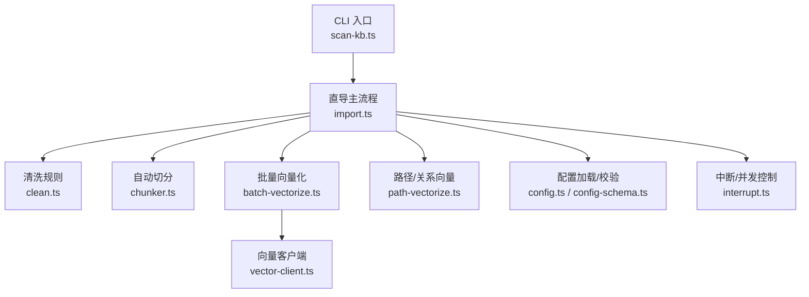
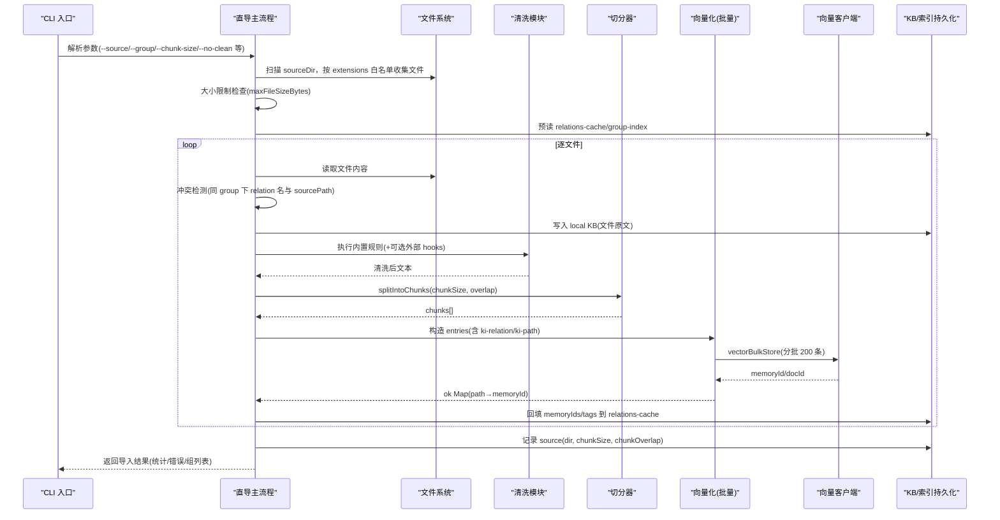
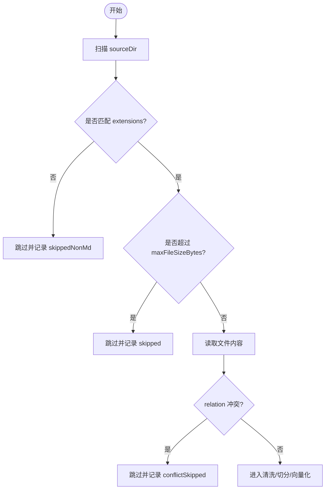
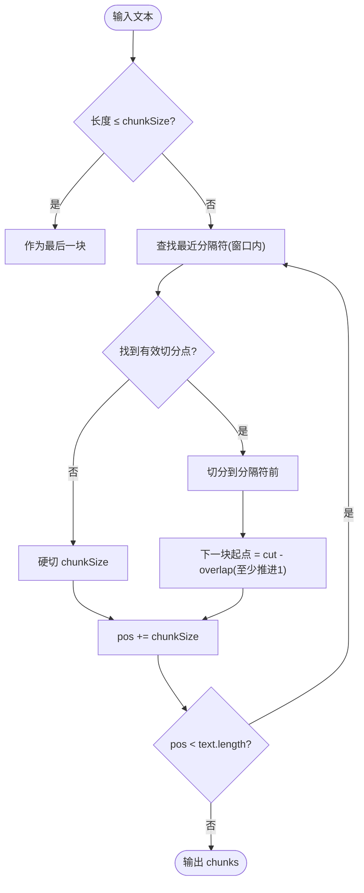
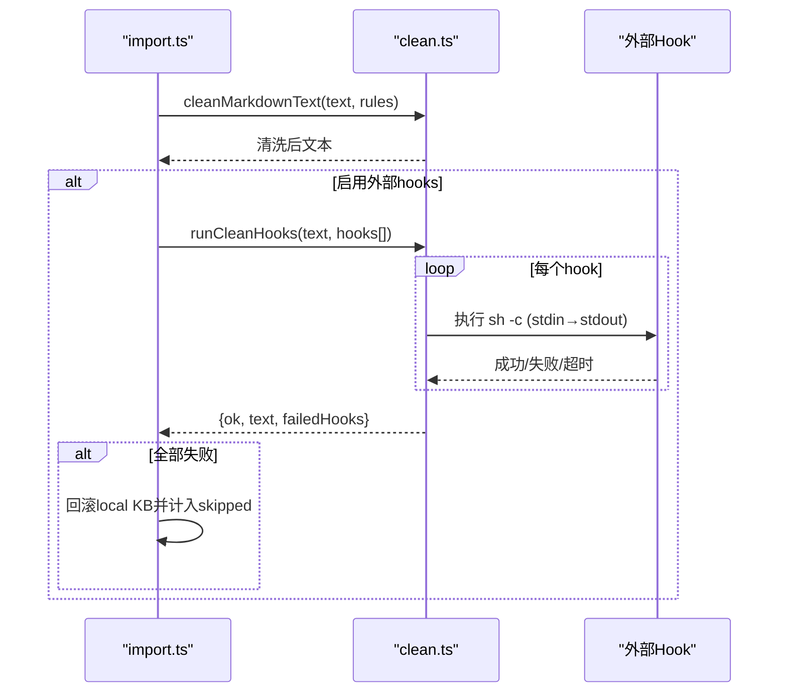
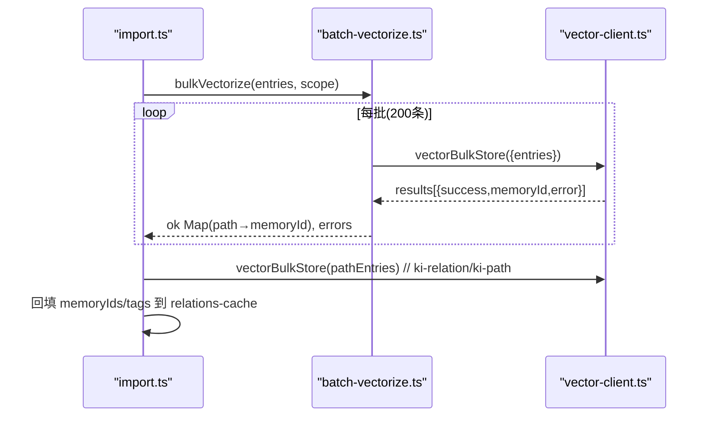
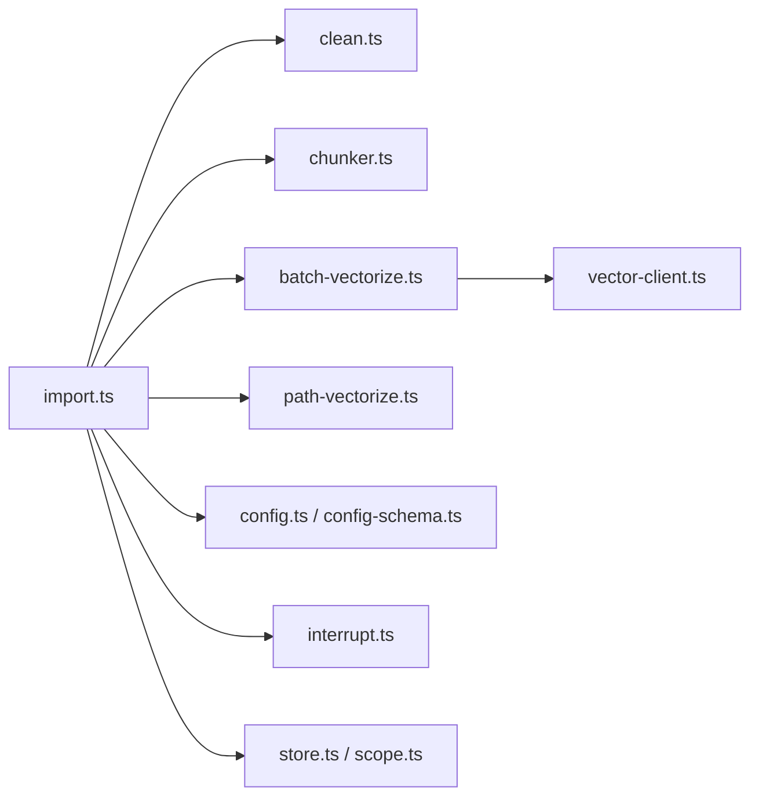

# 知识导入流程

<cite>
**本文引用的文件**
- [import.ts](file://src/lib/import.ts)
- [batch-vectorize.ts](file://src/lib/batch-vectorize.ts)
- [clean.ts](file://src/lib/clean.ts)
- [chunker.ts](file://src/lib/chunker.ts)
- [vector-client.ts](file://src/lib/vector-client.ts)
- [path-vectorize.ts](file://src/lib/path-vectorize.ts)
- [config.ts](file://src/lib/config.ts)
- [config-schema.ts](file://src/lib/config-schema.ts)
- [interrupt.ts](file://src/lib/interrupt.ts)
- [scan-kb.ts](file://src/scan-kb.ts)
</cite>

## 目录
1. [简介](#简介)
2. [项目结构](#项目结构)
3. [核心组件](#核心组件)
4. [架构总览](#架构总览)
5. [详细组件分析](#详细组件分析)
6. [依赖关系分析](#依赖关系分析)
7. [性能考虑](#性能考虑)
8. [故障排查指南](#故障排查指南)
9. [结论](#结论)
10. [附录：配置选项与使用要点](#附录配置选项与使用要点)

## 简介
本文件面向“外部 Wiki 原文直导模式”的知识导入流程，覆盖从文件扫描、格式白名单过滤、大小限制检查，到自动切分（chunkSize、chunkOverlap）、清洗规则执行（内置规则 + 外部 hooks）、批量向量化、错误处理与中断恢复、幂等追加语义、冲突检测与解决策略，以及导入配置选项、性能优化建议与常见问题排查方法。目标是帮助读者在不深入源码的情况下理解并正确使用该导入链路。

## 项目结构
直导导入由 CLI 入口触发，核心逻辑集中在 lib 层模块中，配合向量客户端与配置校验模块完成端到端流程。关键文件职责如下：
- 入口与编排：scan-kb.ts（CLI 命令定义），import.ts（直导主流程）
- 数据清洗：clean.ts（内置规则 + 外部 hooks）
- 文本切分：chunker.ts（固定长度 + 段落边界优先的递归切分）
- 向量化：batch-vectorize.ts（批量/单条向量化），vector-client.ts（底层向量库封装）
- 路径/关系向量：path-vectorize.ts（ki-path / ki-relation 辅助向量写入）
- 配置与校验：config.ts（配置加载与默认值），config-schema.ts（字段级校验）
- 中断与并发控制：interrupt.ts（中断标记、导入锁）

**图表来源**
- [scan-kb.ts:35-46](file://src/scan-kb.ts#L35-L46)
- [import.ts:214-564](file://src/lib/import.ts#L214-L564)
- [clean.ts:48-130](file://src/lib/clean.ts#L48-L130)
- [chunker.ts:57-92](file://src/lib/chunker.ts#L57-L92)
- [batch-vectorize.ts:132-182](file://src/lib/batch-vectorize.ts#L132-L182)
- [vector-client.ts:574-617](file://src/lib/vector-client.ts#L574-L617)
- [path-vectorize.ts:75-116](file://src/lib/path-vectorize.ts#L75-L116)
- [config.ts:100-136](file://src/lib/config.ts#L100-L136)
- [config-schema.ts:78-123](file://src/lib/config-schema.ts#L78-L123)
- [interrupt.ts:92-130](file://src/lib/interrupt.ts#L92-L130)

**章节来源**
- [scan-kb.ts:35-46](file://src/scan-kb.ts#L35-L46)
- [import.ts:214-564](file://src/lib/import.ts#L214-L564)

## 核心组件
- 直导主流程（import.ts）
  - 负责文件扫描、白名单过滤、大小限制、冲突检测、本地 KB 写入、清洗、切分、向量化、Group 树构建、relations-cache 更新、source 记录、中断保护与锁管理。
- 清洗模块（clean.ts）
  - 提供内置规则（BOM、frontmatter、HTML 注释、Mermaid、代码块、路径剥离、空行折叠等）与外部 hooks（stdin→stdout 管道，超时保护）。
- 切分器（chunker.ts）
  - 基于 chunkSize 与 overlap 的递归字符切分，优先在段落/标点边界切分，支持最大 chunk 数上限保护。
- 向量化（batch-vectorize.ts + vector-client.ts）
  - 批量向量化采用分批提交（每批 200 条），共享一次引擎；docId 确定性生成（text+scope+tag），实现幂等 upsert。
- 路径/关系向量（path-vectorize.ts）
  - 为 group 路径和 relation 名称写入 ki-path / ki-relation 向量，便于检索兜底。
- 配置与校验（config.ts + config-schema.ts）
  - 提供 scopes.<scope>.import（extensions、maxFileSize）与 clean（enabled、rules、hooks）等配置项，并进行字段级校验。
- 中断与并发控制（interrupt.ts）
  - 导入锁防止同 scope 并发导入；中断信号捕获写中断标记，支持后续恢复引导。

**章节来源**
- [import.ts:214-564](file://src/lib/import.ts#L214-L564)
- [clean.ts:48-130](file://src/lib/clean.ts#L48-L130)
- [chunker.ts:57-92](file://src/lib/chunker.ts#L57-L92)
- [batch-vectorize.ts:132-182](file://src/lib/batch-vectorize.ts#L132-L182)
- [vector-client.ts:574-617](file://src/lib/vector-client.ts#L574-L617)
- [path-vectorize.ts:75-116](file://src/lib/path-vectorize.ts#L75-L116)
- [config.ts:100-136](file://src/lib/config.ts#L100-L136)
- [config-schema.ts:78-123](file://src/lib/config-schema.ts#L78-L123)
- [interrupt.ts:92-130](file://src/lib/interrupt.ts#L92-L130)

## 架构总览
下图展示直导模式的端到端调用链路与数据流：

**图表来源**
- [import.ts:214-564](file://src/lib/import.ts#L214-L564)
- [batch-vectorize.ts:132-182](file://src/lib/batch-vectorize.ts#L132-L182)
- [vector-client.ts:574-617](file://src/lib/vector-client.ts#L574-L617)
- [path-vectorize.ts:75-116](file://src/lib/path-vectorize.ts#L75-L116)

## 详细组件分析

### 文件扫描与过滤
- 支持目录或单文件导入。目录模式下递归遍历，忽略隐藏目录与 node_modules。
- 格式白名单：默认仅 .md，可通过配置 scopes.<scope>.import.extensions 扩展（如 .markdown）。
- 非白名单文件跳过并汇总提示；单文件导入时也会校验后缀是否命中白名单。
- 大小限制：超过 maxFileSizeBytes（默认 1MB，可配置）的文件直接跳过并告警。

**图表来源**
- [import.ts:169-194](file://src/lib/import.ts#L169-L194)
- [import.ts:274-287](file://src/lib/import.ts#L274-L287)
- [import.ts:310-336](file://src/lib/import.ts#L310-L336)

**章节来源**
- [import.ts:169-194](file://src/lib/import.ts#L169-L194)
- [import.ts:274-287](file://src/lib/import.ts#L274-L287)
- [import.ts:310-336](file://src/lib/import.ts#L310-L336)

### 自动切分算法（chunkSize、chunkOverlap）
- 目标长度：以字符数为单位的 chunkSize（默认 1000）。
- 重叠：overlap（默认 150）保证相邻 chunk 尾部重叠，保护跨 chunk 上下文。
- 切分点偏好：优先在 \n\n、\n、句号、分号等语义边界切分；找不到则硬切。
- 安全上限：单文件 chunk 数超过 MAX_CHUNKS_PER_FILE（默认 500）视为超大文件，跳过并回滚已写的 local KB。

**图表来源**
- [chunker.ts:35-51](file://src/lib/chunker.ts#L35-L51)
- [chunker.ts:57-92](file://src/lib/chunker.ts#L57-L92)
- [import.ts:355-361](file://src/lib/import.ts#L355-L361)

**章节来源**
- [chunker.ts:57-92](file://src/lib/chunker.ts#L57-L92)
- [import.ts:355-361](file://src/lib/import.ts#L355-L361)

### 清洗规则执行（内置规则 + 外部 hooks）
- 内置规则顺序：BOM → 控制字符/NFC → frontmatter → HTML 注释 → Mermaid → 代码块（保留短示例）→ 路径剥离（代码块外）→ 空行折叠。
- 外部 hooks：按序执行 sh -c 命令，stdin→stdout 管道；单个 hook 失败不阻断后续，但会记录 failedHooks；全部失败则整体失败并回滚 local KB。
- 超时保护：hook 默认 10s 超时，超时 SIGKILL 终止子进程。

**图表来源**
- [clean.ts:48-130](file://src/lib/clean.ts#L48-L130)
- [clean.ts:177-227](file://src/lib/clean.ts#L177-L227)
- [import.ts:340-353](file://src/lib/import.ts#L340-L353)

**章节来源**
- [clean.ts:48-130](file://src/lib/clean.ts#L48-L130)
- [clean.ts:177-227](file://src/lib/clean.ts#L177-L227)
- [import.ts:340-353](file://src/lib/import.ts#L340-L353)

### 批量向量化过程
- 条目构造：每个 chunk 生成一条 ki-search 向量；同时为每个 chunk 生成 ki-relation 向量，为每个 groupPath 生成 ki-path 向量。
- 批量提交：按 200 条/批提交 vectorBulkStore，减少引擎开销；失败条目记入 errors，不中断整体。
- 幂等 upsert：docId 由 sha256(text+scope+tag) 截断生成，相同内容重复写入覆盖。
- 自定义标签：可为每个导入文件附加 tags，每个 tag 单独写一条内容向量；无论是否向量化都持久化到 relation.tags，供重建恢复。

**图表来源**
- [batch-vectorize.ts:132-182](file://src/lib/batch-vectorize.ts#L132-L182)
- [vector-client.ts:574-617](file://src/lib/vector-client.ts#L574-L617)
- [import.ts:385-448](file://src/lib/import.ts#L385-L448)
- [import.ts:450-484](file://src/lib/import.ts#L450-L484)

**章节来源**
- [batch-vectorize.ts:132-182](file://src/lib/batch-vectorize.ts#L132-L182)
- [vector-client.ts:574-617](file://src/lib/vector-client.ts#L574-L617)
- [import.ts:385-448](file://src/lib/import.ts#L385-L448)
- [import.ts:450-484](file://src/lib/import.ts#L450-L484)

### 错误处理策略
- 文件级：过大/超限/hook 失败 → 跳过并记录 skipped；冲突 → 记录 conflictSkipped。
- 向量化：单条失败记录 errors，不中断整体；整批失败将批次内所有条目记错。
- 向量库占用/损坏：vector-client 提供撞锁重试与空闲释放锁；不可用时给出可操作处置提示。
- 中断：SIGINT/SIGTERM 捕获 → 写中断标记 → 清锁 → 退出码 130；后续命令检测到中断标记给出恢复引导。

**章节来源**
- [import.ts:310-383](file://src/lib/import.ts#L310-L383)
- [batch-vectorize.ts:132-182](file://src/lib/batch-vectorize.ts#L132-L182)
- [vector-client.ts:75-87](file://src/lib/vector-client.ts#L75-L87)
- [vector-client.ts:111-124](file://src/lib/vector-client.ts#L111-L124)
- [interrupt.ts:44-78](file://src/lib/interrupt.ts#L44-L78)

### 中断恢复机制
- 导入锁：<scope>/.import.lock 防并发导入；若 pid 不存在（崩溃残留）自动清理。
- 中断标记：<scope>/import-interrupt.json 记录中断时间、已完成/总数、信号类型。
- 恢复引导：向量命令前置检测中断标记，提示执行 restore --rebuild-vector 或 from-snapshot 重建。
- 生命周期：成功导入清除中断标记与锁；中断路径清锁但保留标记以便引导。

**章节来源**
- [interrupt.ts:92-130](file://src/lib/interrupt.ts#L92-L130)
- [import.ts:240-264](file://src/lib/import.ts#L240-L264)
- [import.ts:543-547](file://src/lib/import.ts#L543-L547)

### 幂等追加语义、冲突检测与解决策略
- 幂等追加：同 group 下 relation 名相同且 sourcePath 相同 → 允许覆盖更新（重跑 import）。
- 冲突检测：同 group 下 relation 名相同但 sourcePath 不同 → 跳过并告警，避免不同文件同名冲突。
- 方案 D 多值 memoryIds：文件级 relation 挂全部 chunk 的 memoryId（数组），兼容单值消费方取第一个。
- 自定义 tag 持久化：relation.tags 持久化到 KB 层，供 rebuild-vector/restore 恢复 tag 向量。

**章节来源**
- [import.ts:323-336](file://src/lib/import.ts#L323-L336)
- [import.ts:502-525](file://src/lib/import.ts#L502-L525)
- [import.ts:602-637](file://src/lib/import.ts#L602-L637)

## 依赖关系分析
- import.ts 依赖：
  - 清洗：clean.ts（内置规则 + hooks）
  - 切分：chunker.ts（splitIntoChunks）
  - 向量化：batch-vectorize.ts（bulkVectorize），vector-client.ts（vectorBulkStore）
  - 路径/关系向量：path-vectorize.ts（bulkStorePaths）
  - 配置：config.ts（getScopeImportConfig/getScopeCleanConfig），config-schema.ts（字段校验）
  - 中断：interrupt.ts（acquireImportLock/writeInterruptMark/releaseImportLock）
  - 存储：store.ts/scope.ts（读写 relations-cache/group-index/local KB）

**图表来源**
- [import.ts:13-48](file://src/lib/import.ts#L13-L48)
- [batch-vectorize.ts:17-19](file://src/lib/batch-vectorize.ts#L17-L19)
- [vector-client.ts:16-34](file://src/lib/vector-client.ts#L16-L34)
- [path-vectorize.ts:14-14](file://src/lib/path-vectorize.ts#L14-L14)
- [config.ts:100-136](file://src/lib/config.ts#L100-L136)
- [config-schema.ts:78-123](file://src/lib/config-schema.ts#L78-L123)
- [interrupt.ts:11-13](file://src/lib/interrupt.ts#L11-L13)

**章节来源**
- [import.ts:13-48](file://src/lib/import.ts#L13-L48)
- [batch-vectorize.ts:17-19](file://src/lib/batch-vectorize.ts#L17-L19)
- [vector-client.ts:16-34](file://src/lib/vector-client.ts#L16-L34)
- [path-vectorize.ts:14-14](file://src/lib/path-vectorize.ts#L14-L14)
- [config.ts:100-136](file://src/lib/config.ts#L100-L136)
- [config-schema.ts:78-123](file://src/lib/config-schema.ts#L78-L123)
- [interrupt.ts:11-13](file://src/lib/interrupt.ts#L11-L13)

## 性能考虑
- 切分参数调优
  - chunkSize：增大可减少 chunk 数量，降低向量化与存储压力；过小会导致碎片过多、检索噪声增加。
  - overlap：适当增大可提升跨 chunk 上下文召回率，但会增加冗余与存储成本。
- 批量向量化
  - 分批大小 200 条：平衡网络/嵌入开销与进度反馈；可根据 embedding 提供商能力调整。
- 文件大小限制
  - maxFileSizeBytes：默认 1MB，建议根据文档体量与切分策略设置；超大文件应手动拆分。
- 向量库锁与并发
  - 向量库为单进程独占锁；MCP 常驻服务启用空闲释放锁，CLI 短命令每次结束关闭引擎。
  - 撞锁重试：最多等待 3 次，间隔 2s；避免瞬时竞争导致失败。
- 路径/关系向量
  - ki-path/ki-relation 辅助向量用于检索兜底，写入失败不阻塞主流程。

[本节为通用指导，无需特定文件引用]

## 故障排查指南
- 无法导入（格式不支持）
  - 现象：未发现 .md 文件或单文件后缀不在白名单。
  - 处理：检查 --source 路径与 extensions 配置；必要时扩展白名单。
- 文件被跳过（过大/超限）
  - 现象：日志提示“文件过大已跳过”或“chunk 数超限”。
  - 处理：增大 chunkSize 或手动拆分文件；调整 maxFileSizeBytes。
- 清洗失败（hooks 报错）
  - 现象：hook 超时或退出码非零，导致文件被跳过并回滚 local KB。
  - 处理：检查 hooks 命令与脚本；确认 stdin/stdout 正确；调整超时或修复脚本。
- 向量库被占用/损坏
  - 现象：提示“向量库被其他进程占用”或“损坏”。
  - 处理：停止 MCP/server 或等待锁释放；执行 restore --rebuild-vector 或 from-snapshot 重建。
- 导入中断
  - 现象：Ctrl+C/kill 后存在中断标记。
  - 处理：执行 restore --rebuild-vector 或 from-snapshot 重建；或重新导入（幂等覆盖）。
- 冲突跳过
  - 现象：同 group 下 relation 名冲突（不同 sourcePath）。
  - 处理：重命名文件或调整 group；确保同一文件幂等重导。

**章节来源**
- [import.ts:274-287](file://src/lib/import.ts#L274-L287)
- [import.ts:310-361](file://src/lib/import.ts#L310-L361)
- [clean.ts:177-227](file://src/lib/clean.ts#L177-L227)
- [vector-client.ts:75-87](file://src/lib/vector-client.ts#L75-L87)
- [interrupt.ts:44-78](file://src/lib/interrupt.ts#L44-L78)

## 结论
直导模式通过“文件扫描 → 白名单/大小限制 → 清洗 → 切分 → 批量向量化 → 元数据持久化”的流水线，实现了外部 Wiki 的高效入库。其关键特性包括：
- 幂等追加与冲突检测，保障多次导入一致性。
- 灵活的清洗与切分策略，适配不同文档形态。
- 批量向量化与路径/关系向量辅助，提升检索质量。
- 完善的中断保护与恢复引导，增强鲁棒性。
- 配置化导入选项，便于规模化部署与调优。

[本节为总结，无需特定文件引用]

## 附录：配置选项与使用要点
- CLI 选项（来自 scan-kb.ts）
  - --source：外部 Markdown Wiki 根目录或单个 .md 文件。
  - --group：目标 Group 落点（缺省时目录导入按顶层子目录名各建根节点，单文档导入用 scope name）。
  - --chunk-size：切分目标长度（字符，默认 1000）。
  - --chunk-overlap：切分重叠字符数（默认 150）。
  - --no-vector：非向量化模式，仅写 KB 层。
  - --tags：文档级自定义标签（逗号分隔多个），向量化时为每个 tag 写一条内容向量。
  - --no-clean：关闭全部清洗（含外部 hooks）。
  - --clean-rules：覆盖内置清洗规则开关（逗号分隔）。
- 配置文件（scopes.<scope>）
  - import.extensions：格式白名单（默认 [.md]）。
  - import.maxFileSize：单文件大小上限（字节，默认 1MB）。
  - clean.enabled：清洗总开关（false 等效 --no-clean）。
  - clean.rules：内置规则开关（bom/frontmatter/htmlComment/mermaid/codePath/codeBlock/emptyChunk/keepShortSamples）。
  - clean.hooks：外部清洗钩子命令列表（stdin→stdout）。
- 使用建议
  - 大文档：增大 chunkSize，合理设置 overlap；必要时手动拆分。
  - 高吞吐：保持 batch 大小 200 条；确保 embedding 提供商稳定。
  - 稳定性：启用 hooks 超时保护；监控向量库锁状态；定期备份。

**章节来源**
- [scan-kb.ts:35-46](file://src/scan-kb.ts#L35-L46)
- [config.ts:100-136](file://src/lib/config.ts#L100-L136)
- [config-schema.ts:78-123](file://src/lib/config-schema.ts#L78-L123)