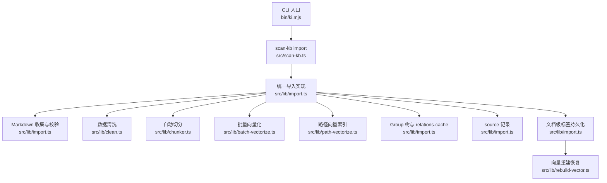
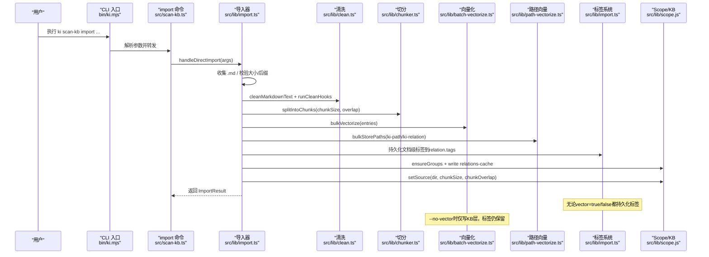
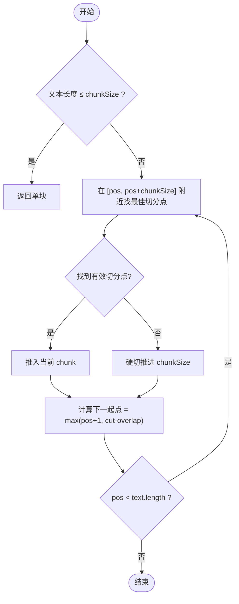
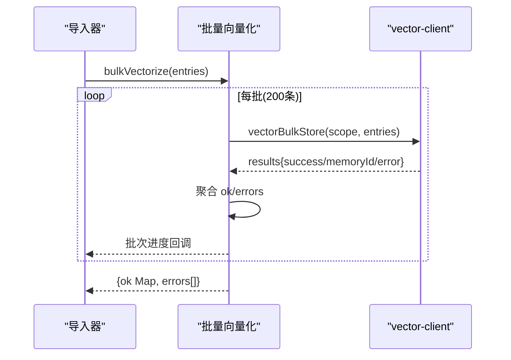
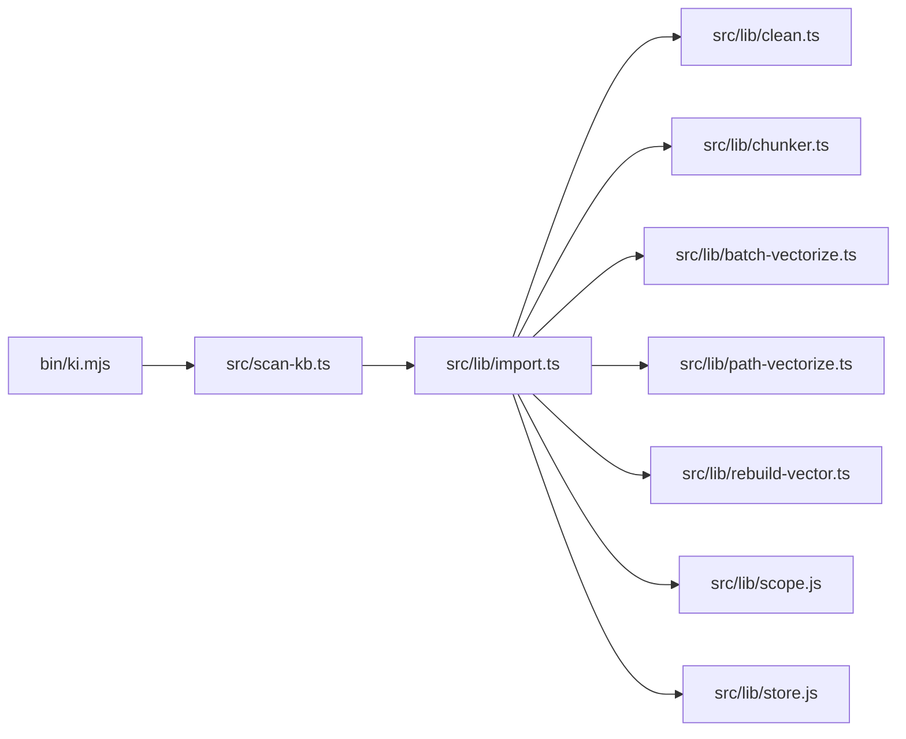

# 知识库导入

<cite>
**本文引用的文件**
- [bin/ki.mjs](file://bin/ki.mjs)
- [src/scan-kb.ts](file://src/scan-kb.ts)
- [src/lib/import.ts](file://src/lib/import.ts)
- [src/lib/chunker.ts](file://src/lib/chunker.ts)
- [src/lib/batch-vectorize.ts](file://src/lib/batch-vectorize.ts)
- [src/lib/clean.ts](file://src/lib/clean.ts)
- [src/lib/path-vectorize.ts](file://src/lib/path-vectorize.ts)
- [src/lib/wiki-sync.ts](file://src/lib/wiki-sync.ts)
- [src/config.ts](file://src/config.ts)
- [src/lib/rebuild-vector.ts](file://src/lib/rebuild-vector.ts)
- [src/restore.ts](file://src/restore.ts)
- [src/lib/constants.ts](file://src/lib/constants.ts)
</cite>

## 更新摘要
**所做更改**
- 新增文档级标签功能的详细说明，包括非向量化模式下的标签持久化机制
- 更新了import命令的--tags参数说明，强调其独立于向量化的特性
- 新增了向量重建操作中标签恢复的完整流程说明
- 更新了错误处理和故障排查指南，包含标签相关的异常情况
- 补充了实际使用示例，展示不同场景下的标签使用策略

## 目录
1. [简介](#简介)
2. [项目结构](#项目结构)
3. [核心组件](#核心组件)
4. [架构总览](#架构总览)
5. [详细组件分析](#详细组件分析)
6. [依赖关系分析](#依赖关系分析)
7. [性能考量](#性能考量)
8. [故障排查指南](#故障排查指南)
9. [结论](#结论)
10. [附录：使用示例与最佳实践](#附录使用示例与最佳实践)

## 简介
本文件面向"外部 Wiki 直接导入"能力，完整说明从 Markdown 源到本地 KB 与向量索引的端到端流程，包括：
- Markdown 格式校验与白名单过滤
- 自动切分算法（固定长度 + 段落边界优先）
- 批量向量化处理（分批提交、进度反馈、失败隔离）
- 幂等追加机制（同 sourcePath 覆盖、同名不同 sourcePath 跳过、新文件导入）
- **增强功能**：文档级标签支持，无论是否向量化均持久化标签，支持后续向量重建恢复
- import 命令参数配置（--source、--group、--chunk-size、--chunk-overlap、--no-vector、--no-clean、--clean-rules、--tags）
- 数据清洗规则与自定义清洗钩子
- 多场景导入策略（单文件、目录批量、增量更新）
- 错误处理、重试建议与性能优化
- 实际使用示例与最佳实践

## 项目结构
导入链路以 CLI 入口为起点，解析参数后调用统一导入实现，依次完成文件收集、前置检查、清洗、切分、向量化、Group 树构建、元数据写入与 source 记录。



图表来源
- [bin/ki.mjs:28-49](file://bin/ki.mjs#L28-L49)
- [src/scan-kb.ts:26-77](file://src/scan-kb.ts#L26-L77)
- [src/lib/import.ts:214-559](file://src/lib/import.ts#L214-L559)
- [src/lib/rebuild-vector.ts:187-235](file://src/lib/rebuild-vector.ts#L187-L235)

章节来源
- [bin/ki.mjs:28-49](file://bin/ki.mjs#L28-L49)
- [src/scan-kb.ts:26-77](file://src/scan-kb.ts#L26-L77)

## 核心组件
- 统一导入器：负责整体流程编排、并发锁、中断保护、幂等追加、统计输出。
- 文件收集与校验：递归扫描 Markdown，支持扩展白名单与大小上限。
- 数据清洗：内置规则（BOM、frontmatter、HTML 注释、Mermaid、代码块、路径剥离、空行折叠等），支持外部 hook 管道。
- 自动切分：固定长度 + 段落边界优先，支持重叠字符，限制单文件最大 chunk 数。
- 批量向量化：按批提交（默认 200 条/批），共享一次 embed，失败条目隔离并记录。
- 路径向量索引：为 group 路径和 relation 名称建立 ki-path/ki-relation 向量，辅助检索兜底。
- Group 树与元数据：确保 group 存在，写入 relations-cache，回填 memoryId 多值。
- Source 记录：持久化 dir、chunkSize、chunkOverlap，支撑后续增量与重建。
- **文档级标签系统**：无论是否向量化均持久化自定义标签到 relation.tags，支持后续向量重建恢复。

章节来源
- [src/lib/import.ts:214-559](file://src/lib/import.ts#L214-L559)
- [src/lib/chunker.ts:57-92](file://src/lib/chunker.ts#L57-L92)
- [src/lib/batch-vectorize.ts:132-182](file://src/lib/batch-vectorize.ts#L132-L182)
- [src/lib/path-vectorize.ts:75-116](file://src/lib/path-vectorize.ts#L75-L116)
- [src/lib/clean.ts:48-130](file://src/lib/clean.ts#L48-L130)
- [src/lib/rebuild-vector.ts:187-235](file://src/lib/rebuild-vector.ts#L187-L235)

## 架构总览
下图展示一次导入的关键阶段与数据流向，特别突出了文档级标签的处理流程。



图表来源
- [bin/ki.mjs:28-49](file://bin/ki.mjs#L28-L49)
- [src/scan-kb.ts:35-77](file://src/scan-kb.ts#L35-L77)
- [src/lib/import.ts:214-559](file://src/lib/import.ts#L214-L559)
- [src/lib/import.ts:450-484](file://src/lib/import.ts#L450-L484)

## 详细组件分析

### 统一导入器（handleDirectImport）
- 职责：
  - 解析参数（scope/source/group/chunkSize/chunkOverlap/vector/cleanEnabled/cleanRules/tags）
  - 并发导入锁与中断保护（SIGINT/SIGTERM 写中断标记、清锁）
  - 文件收集与白名单校验（默认 .md，可配置 extensions；支持 maxFileSizeBytes）
  - 前置检查：文件大小、relation 冲突检测（同名不同 sourcePath 跳过；同名同 sourcePath 幂等覆盖）
  - 写入 local KB 原文（方案 D：KB 存原文，清洗仅用于向量化输入）
  - 清洗（内置规则 + 外部 hooks，失败回滚 local KB）
  - 切分（splitIntoChunks，超限则跳过并回滚）
  - 构造向量化条目（含 ki-relation/ki-path 辅助向量）
  - 批量向量化（bulkVectorize，失败隔离）
  - 构建 Group 树、写入 relations-cache（文件级 relation 挂 memoryIds 多值）
  - 记录 source（dir、chunkSize、chunkOverlap）
  - **增强功能**：文档级标签持久化，无论是否向量化均保存标签信息
- 关键行为：
  - 幂等追加：同 sourcePath 覆盖；同名不同 sourcePath 跳过；新文件导入
  - 非向量化模式（--no-vector）：仅写 KB 层，memoryIds 为空，但标签仍持久化
  - 文档级自定义标签向量（可选）：为每个导入文件写 tag 内容向量，docId 回填至文件级 relation

**更新** 增强了文档级标签支持，现在无论是否启用向量化模式，标签都会持久化到 relation.tags 字段，支持后续通过向量重建操作恢复标签向量。

章节来源
- [src/lib/import.ts:214-559](file://src/lib/import.ts#L214-L559)
- [src/lib/import.ts:450-484](file://src/lib/import.ts#L450-L484)

### 文档级标签系统
- **标签持久化机制**：
  - 无论 vector=true 还是 vector=false，自定义标签都会持久化到 relation.tags
  - 标签解析：parseContentTags 函数处理逗号分隔、去空、去重、过滤内部保留标签
  - 存储位置：relations-cache.json 中每个 relation 的 tags 字段
- **标签向量生成**：
  - 当 vector=true 且 customTags.length > 0 时，为每个导入文件生成标签向量
  - 每个标签生成一条内容向量，text 为文件原文，tags 为对应标签
  - 成功生成的标签向量 docId 会回填到文件的 memoryIds 数组
- **标签恢复机制**：
  - 通过 rebuild-vector 操作可从 relations-cache 中的 tags 字段恢复标签向量
  - collectTagEntries 函数从 local KB 读取原文，为每个有 tags 的 relation 生成标签向量
  - 支持跨命令累积：多次重建会合并标签集合（只增不减）

**新增** 完整的文档级标签生命周期管理，包括持久化、向量生成和恢复机制。

章节来源
- [src/lib/import.ts:450-484](file://src/lib/import.ts#L450-L484)
- [src/lib/rebuild-vector.ts:187-235](file://src/lib/rebuild-vector.ts#L187-L235)
- [src/lib/constants.ts:55-75](file://src/lib/constants.ts#L55-L75)

### Markdown 收集与校验
- 递归扫描 sourceDir，忽略隐藏目录与 node_modules
- 白名单扩展：默认 .md，可通过 scope import 配置扩展（如 .markdown）
- 非白名单文件跳过并汇总告警
- 单文件导入支持：当 sourceDir 指向单个 .md 时，仅导入该文件（需命中白名单）

章节来源
- [src/lib/import.ts:169-194](file://src/lib/import.ts#L169-L194)
- [src/lib/import.ts:270-283](file://src/lib/import.ts#L270-L283)

### 数据清洗规则与自定义 Hook
- 内置规则（可按需开启/关闭）：
  - BOM 剥离、控制字符清理、Unicode NFC 规范化
  - YAML frontmatter 剥离
  - HTML 注释剥离
  - Mermaid 块剥离
  - 代码块剥离（短示例保留 ≤15 行）
  - 文件路径剥离（行号引用、file:// URL、裸代码路径、空 inline code、孤儿标题）
  - 空行折叠（3+ 连续空行 → 2 个）
- 外部 Hook：
  - 通过 sh -c 顺序执行，stdin→stdout 管道
  - 超时保护（默认 10s），失败跳过并记录 failedHooks
  - 全部失败则回滚 local KB，文件计入 skipped
- 规则覆盖：
  - --clean-rules 逗号分隔开关（bom,frontmatter,htmlComment,mermaid,codePath,codeBlock）
  - --no-clean 关闭全部清洗（含 hooks）

章节来源
- [src/lib/clean.ts:48-130](file://src/lib/clean.ts#L48-L130)
- [src/lib/clean.ts:136-153](file://src/lib/clean.ts#L136-L153)
- [src/lib/clean.ts:177-227](file://src/lib/clean.ts#L177-L227)
- [src/lib/import.ts:336-349](file://src/lib/import.ts#L336-L349)

### 自动切分算法
- 触发条件：文本长度超过 chunkSize
- 切分点偏好：\n\n > \n > 。 > ； > 硬切（在目标位置附近搜索最近分隔符）
- 重叠：相邻 chunk 尾部保留 overlap 字符，保护跨 chunk 上下文
- 限制：单文件最大 chunk 数（MAX_CHUNKS_PER_FILE），超限跳过并回滚
- 复杂度：线性扫描，内存中执行，不落盘



图表来源
- [src/lib/chunker.ts:35-51](file://src/lib/chunker.ts#L35-L51)
- [src/lib/chunker.ts:57-92](file://src/lib/chunker.ts#L57-L92)

章节来源
- [src/lib/chunker.ts:57-92](file://src/lib/chunker.ts#L57-L92)
- [src/lib/import.ts:351-357](file://src/lib/import.ts#L351-L357)

### 批量向量化处理
- 批量策略：按 200 条/批提交，共享一次 embed，减少引擎开销
- 进度反馈：多批时输出批次进度，避免单批刷屏
- 失败隔离：单条失败不阻断整体，errors 记录明细
- 路径向量：同时写入 ki-path/ki-relation 辅助向量，提升检索兜底能力
- 覆盖导入：若 scope 已有向量，先删除旧向量再重建，消除孤儿向量



图表来源
- [src/lib/batch-vectorize.ts:132-182](file://src/lib/batch-vectorize.ts#L132-L182)
- [src/lib/path-vectorize.ts:75-116](file://src/lib/path-vectorize.ts#L75-L116)
- [src/lib/import.ts:423-444](file://src/lib/import.ts#L423-L444)

章节来源
- [src/lib/batch-vectorize.ts:132-182](file://src/lib/batch-vectorize.ts#L132-L182)
- [src/lib/path-vectorize.ts:75-116](file://src/lib/path-vectorize.ts#L75-L116)
- [src/lib/import.ts:423-444](file://src/lib/import.ts#L423-L444)

### 幂等追加机制
- 文件级 relation 冲突检测：
  - 同 group 下 relation 名已存在且 sourcePath 不同 → 跳过（防误覆盖）
  - 同 group 下 relation 名已存在且 sourcePath 相同 → 允许覆盖（幂等重导）
- 失败回滚：
  - 清洗 hook 失败 → 删除已写的 local KB 原文，计入 skipped
  - chunk 超限 → 删除已写的 local KB 原文，计入 skipped
- 向量覆盖：
  - 若 scope 已有向量，先删除旧向量再重建，保证一致性

章节来源
- [src/lib/import.ts:319-332](file://src/lib/import.ts#L319-L332)
- [src/lib/import.ts:336-357](file://src/lib/import.ts#L336-L357)
- [src/lib/import.ts:423-433](file://src/lib/import.ts#L423-L433)

### 错误处理与中断保护
- 并发导入锁：同 scope 并发导入拒绝，防止竞争
- 信号捕获：SIGINT/SIGTERM 写中断标记（包含已完成/总数），清锁并退出
- 进程透传：父进程将 SIGINT/SIGTERM 转发给子进程，确保 handler 执行
- 失败隔离：向量化失败条目记录 errors，不中断整体流程
- 自动备份：导入成功后尝试自动备份（失败不阻断）

章节来源
- [src/lib/import.ts:236-260](file://src/lib/import.ts#L236-L260)
- [bin/ki.mjs:200-218](file://bin/ki.mjs#L200-L218)
- [src/scan-kb.ts:62-71](file://src/scan-kb.ts#L62-L71)

## 依赖关系分析
- CLI 入口（bin/ki.mjs）负责命令分发与信号转发
- scan-kb.ts 定义 import 子命令及参数，调用统一导入器
- import.ts 编排各阶段，依赖：
  - clean.ts：清洗规则与外部 hook
  - chunker.ts：自动切分
  - batch-vectorize.ts：批量向量化
  - path-vectorize.ts：路径向量索引
  - scope/store：Group 树、relations-cache、local KB、source 记录
  - rebuild-vector.ts：向量重建与标签恢复
- wiki-sync.ts：提供历史补齐与写回外部 Wiki 的能力（与导入互补）



图表来源
- [bin/ki.mjs:28-49](file://bin/ki.mjs#L28-L49)
- [src/scan-kb.ts:26-77](file://src/scan-kb.ts#L26-L77)
- [src/lib/import.ts:214-559](file://src/lib/import.ts#L214-L559)

章节来源
- [bin/ki.mjs:28-49](file://bin/ki.mjs#L28-L49)
- [src/scan-kb.ts:26-77](file://src/scan-kb.ts#L26-L77)
- [src/lib/import.ts:214-559](file://src/lib/import.ts#L214-L559)

## 性能考量
- 批量向量化：200 条/批，减少引擎启动与 embed 次数
- 路径向量：按 scope 分组批量写入，避免逐条开销
- 切分优化：段落边界优先，减少语义断裂；限制单文件最大 chunk 数，防止向量爆炸
- 覆盖导入：先删旧向量再重建，避免孤儿向量影响检索质量
- 进度反馈：多批时输出批次进度，便于监控长任务
- 并发锁：同 scope 串行导入，避免资源竞争
- **标签优化**：标签向量与内容向量分离处理，避免不必要的向量生成开销

[本节为通用性能讨论，无需特定文件引用]

## 故障排查指南
- 无 .md 文件：检查 extensions 白名单与 sourceDir 路径
- 文件过大：调整 maxFileSizeBytes 或手动拆分后导入
- chunk 超限：增大 --chunk-size 或手动拆分
- relation 冲突：确认是否同名不同 sourcePath；必要时重命名或调整 group
- 清洗 hook 失败：检查脚本退出码与超时；失败会回滚 local KB
- 向量写入失败：查看 errors 明细；必要时重试或降低批量大小
- 中断恢复：重新导入或执行 rebuild-vector 恢复
- **标签相关**：
  - 标签未生效：检查 --tags 参数是否正确解析，确认不是内部保留标签
  - 标签向量缺失：在非向量化模式下正常，需执行 rebuild-vector 恢复
  - 标签重复：检查是否有重复的标签定义，系统会自动去重

章节来源
- [src/lib/import.ts:270-283](file://src/lib/import.ts#L270-L283)
- [src/lib/import.ts:311-315](file://src/lib/import.ts#L311-L315)
- [src/lib/import.ts:351-357](file://src/lib/import.ts#L351-L357)
- [src/lib/import.ts:319-332](file://src/lib/import.ts#L319-L332)
- [src/lib/import.ts:336-349](file://src/lib/import.ts#L336-L349)
- [src/lib/batch-vectorize.ts:132-182](file://src/lib/batch-vectorize.ts#L132-L182)
- [src/lib/import.ts:450-484](file://src/lib/import.ts#L450-L484)

## 结论
本导入功能提供从 Markdown 到本地 KB 与向量索引的完整流水线，具备：
- 灵活的参数配置与清洗规则
- 健壮的自动切分与批量向量化
- 幂等追加与中断保护
- 可扩展的外部 hook 与路径向量索引
- **增强功能**：文档级标签支持，无论是否向量化均持久化标签，支持后续向量重建恢复
适用于单文件、目录批量与增量更新等多种场景，并提供完善的错误处理与性能优化建议。

[本节为总结性内容，无需特定文件引用]

## 附录：使用示例与最佳实践

### import 命令参数说明
- --source：外部 Markdown Wiki 根目录（必填）
- --group：目标 Group 落点（可选；缺省时目录导入按顶层子目录名各建根节点，单文档导入用 scope name）
- --chunk-size：切分目标长度（字符，默认 1000）
- --chunk-overlap：切分重叠字符数（默认 150）
- --no-vector：非向量化模式（仅写 KB 层，但标签仍持久化）
- --no-clean：关闭全部清洗（含外部 hooks）
- --clean-rules：覆盖内置清洗规则开关（逗号分隔：bom,frontmatter,htmlComment,mermaid,codePath,codeBlock）
- **--tags**：文档级自定义标签（逗号分隔多个）。无论是否向量化均持久化到 relation.tags（供 rebuild-vector/restore 恢复）；向量化时额外为每个导入文件每个 tag 写一条内容向量

**更新** --tags 参数现在支持在任何模式下工作，即使使用 --no-vector 也会持久化标签信息。

章节来源
- [src/scan-kb.ts:35-45](file://src/scan-kb.ts#L35-L45)
- [src/lib/import.ts:97-117](file://src/lib/import.ts#L97-L117)
- [src/lib/clean.ts:136-153](file://src/lib/clean.ts#L136-L153)
- [src/lib/import.ts:450-484](file://src/lib/import.ts#L450-L484)

### 常见导入策略
- 单文件导入：--source 指向单个 .md 文件，--group 缺省时使用 scope name
- 目录批量导入：--source 指向目录，--group 可选；未指定时按顶层子目录名创建根节点
- 增量更新：重复运行同一 sourceDir 的导入，幂等追加（同 sourcePath 覆盖，同名不同 sourcePath 跳过）
- **标签策略**：
  - 快速导入：使用 --no-vector 仅保存标签，后续通过 rebuild-vector 恢复向量
  - 完整导入：同时启用向量化，立即获得标签检索能力
  - 混合策略：先批量导入不带向量，再选择性重建带标签的向量

章节来源
- [src/lib/import.ts:230-234](file://src/lib/import.ts#L230-L234)
- [src/lib/import.ts:149-156](file://src/lib/import.ts#L149-L156)
- [src/lib/import.ts:319-332](file://src/lib/import.ts#L319-L332)
- [src/lib/import.ts:450-484](file://src/lib/import.ts#L450-L484)

### 数据清洗与自定义 Hook
- 内置规则：按需开启/关闭，适合大多数 Markdown 场景
- 外部 Hook：通过 sh -c 执行脚本，stdin→stdout 管道，超时保护
- 失败回滚：hook 失败会回滚 local KB，文件计入 skipped

章节来源
- [src/lib/clean.ts:48-130](file://src/lib/clean.ts#L48-L130)
- [src/lib/clean.ts:177-227](file://src/lib/clean.ts#L177-L227)
- [src/lib/import.ts:336-349](file://src/lib/import.ts#L336-L349)

### 性能优化建议
- 合理设置 --chunk-size 与 --chunk-overlap，平衡检索质量与向量数量
- 大文件建议手动拆分或使用较大的 --chunk-size
- 启用路径向量索引以提升检索兜底能力
- 定期执行 rebuild-vector 以修复可能的不一致
- **标签优化**：合理使用 --tags 参数，避免过多标签导致向量膨胀

[本节为通用建议，无需特定文件引用]

### 文档级标签使用示例

#### 基本标签导入
```bash
# 导入文档并添加自定义标签
ki scan-kb import --source ./wiki --group TechDocs --tags "API,后端,微服务"

# 非向量化模式导入，仅持久化标签
ki scan-kb import --source ./wiki --group TechDocs --tags "前端,React" --no-vector
```

#### 标签恢复与重建
```bash
# 恢复之前持久化的标签向量
ki restore my-scope --rebuild-vector --tags "API,后端"

# 增量添加新标签
ki restore my-scope --rebuild-vector --tags "新标签"
```

#### 标签验证与管理
```bash
# 检查 relations-cache 中的标签信息
cat knowledge-index/my-scope/relations-cache.json | jq '.groups[].hot_relations[] | select(.tags != null)'

# 验证标签是否成功持久化
ki search -t "API" --limit 5
```

**新增** 完整的文档级标签使用指南，包括导入、恢复和管理操作。

章节来源
- [src/lib/import.ts:450-484](file://src/lib/import.ts#L450-L484)
- [src/lib/rebuild-vector.ts:187-235](file://src/lib/rebuild-vector.ts#L187-L235)
- [src/lib/constants.ts:55-75](file://src/lib/constants.ts#L55-L75)