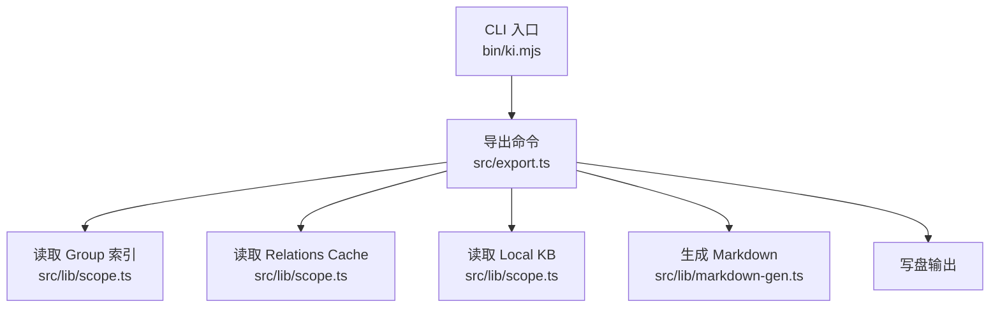
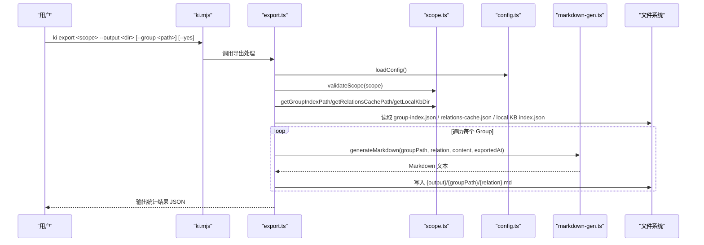
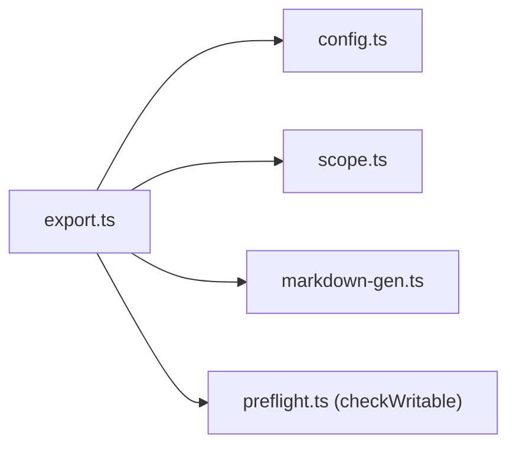

# 知识库导出

<cite>
**本文引用的文件**
- [bin/ki.mjs](file://bin/ki.mjs)
- [src/export.ts](file://src/export.ts)
- [src/lib/markdown-gen.ts](file://src/lib/markdown-gen.ts)
- [src/lib/scope.ts](file://src/lib/scope.ts)
- [src/lib/config.ts](file://src/lib/config.ts)
- [src/lib/relation-map.ts](file://src/lib/relation-map.ts)
- [src/lib/group-resolve.ts](file://src/lib/group-resolve.ts)
- [docs/cli.md](file://docs/cli.md)
- [.requirements/2026-06-16-ki-config-enhancement/design/S05_export_DESIGN.md](file://.requirements/2026-06-16-ki-config-enhancement/design/S05_export_DESIGN.md)
</cite>

## 目录
1. [简介](#简介)
2. [项目结构](#项目结构)
3. [核心组件](#核心组件)
4. [架构总览](#架构总览)
5. [详细组件分析](#详细组件分析)
6. [依赖关系分析](#依赖关系分析)
7. [性能与扩展性](#性能与扩展性)
8. [故障排查指南](#故障排查指南)
9. [结论](#结论)
10. [附录：命令、格式与迁移实践](#附录命令格式与迁移实践)

## 简介
本章节面向需要将内部知识索引（KB）导出为标准 Markdown Wiki 的用户与集成方。导出功能将 KB scope 中的结构化数据（Group 树、Relation 列表、本地 KB 原文）转换为标准 Markdown 文件目录，保留 Group 层级与 Relation 元数据，便于与其他 Wiki 系统对接或离线归档。

- 仅使用 scope 本地数据（group-index.json、relations-cache.json、local KB index.json），不依赖向量库与外部服务。
- 支持选择性导出特定 Group 或全量导出。
- 输出为带 YAML frontmatter 的 Markdown 文件，包含 groupPath、relation、exportedAt 等元信息。

## 项目结构
导出能力由 CLI 入口分发到具体实现模块，核心文件如下：
- 命令行入口：bin/ki.mjs
- 导出主逻辑：src/export.ts
- Markdown 生成：src/lib/markdown-gen.ts
- Scope/路径/配置：src/lib/scope.ts、src/lib/config.ts
- 关系映射辅助：src/lib/relation-map.ts（用于搜索场景，导出本身不依赖）
- Group 解析工具：src/lib/group-resolve.ts（用于查询/导入等场景，导出本身不依赖）

图表来源
- [bin/ki.mjs:29-49](file://bin/ki.mjs#L29-L49)
- [src/export.ts:13-25](file://src/export.ts#L13-L25)
- [src/lib/scope.ts:45-77](file://src/lib/scope.ts#L45-L77)
- [src/lib/markdown-gen.ts:22-41](file://src/lib/markdown-gen.ts#L22-L41)

章节来源
- [bin/ki.mjs:29-49](file://bin/ki.mjs#L29-L49)
- [src/export.ts:196-322](file://src/export.ts#L196-L322)

## 核心组件
- 导出命令处理器：负责参数校验、数据源读取、Group 遍历、Markdown 生成与落盘。
- Markdown 生成器：统一生成带 YAML frontmatter 的 Markdown 内容，确保导出与 Wiki 写回格式一致。
- Scope/配置/路径：提供 scope 校验、数据目录定位、group-index.json、relations-cache.json、local KB 路径构造。
- 关系映射与 Group 解析：在导出流程中不直接参与，但为其他命令提供复用能力。

章节来源
- [src/export.ts:196-322](file://src/export.ts#L196-L322)
- [src/lib/markdown-gen.ts:22-41](file://src/lib/markdown-gen.ts#L22-L41)
- [src/lib/scope.ts:45-77](file://src/lib/scope.ts#L45-L77)
- [src/lib/config.ts:382-386](file://src/lib/config.ts#L382-L386)

## 架构总览
导出流程从 CLI 进入，解析参数后读取三类数据源，按 Group 树组织并生成 Markdown 文件。

图表来源
- [bin/ki.mjs:29-49](file://bin/ki.mjs#L29-L49)
- [src/export.ts:196-322](file://src/export.ts#L196-L322)
- [src/lib/scope.ts:45-77](file://src/lib/scope.ts#L45-L77)
- [src/lib/markdown-gen.ts:22-41](file://src/lib/markdown-gen.ts#L22-L41)

## 详细组件分析

### 导出命令与参数解析
- 命令入口：ki export
- 必填参数：
  - scope：知识范围标识
  - --output：导出目标目录
- 可选参数：
  - --group：指定导出的 Group 路径（父目录名取 group 最后一段；缺省全量导出，顶层名 = scope name）
  - --yes：确认覆盖已存在的非空输出目录
- 帮助与未知参数检测：内置帮助文本与未知 flag 拦截，避免误用。

章节来源
- [src/export.ts:324-399](file://src/export.ts#L324-L399)
- [bin/ki.mjs:29-49](file://bin/ki.mjs#L29-L49)

### Group 树结构与路径映射
- 数据来源：group-index.json 中的 groups 树。
- 全量导出：顶层目录名为 scope name，后续拼接完整 groupPath。
- 选择性导出：当指定 --group A/B 时，父目录名取 B，groupPath 去掉 A/B 前缀后接其后。
- 路径存在性校验：导出前检查 group 是否存在于 Group 树中，不存在则失败。

章节来源
- [src/export.ts:70-132](file://src/export.ts#L70-L132)
- [src/export.ts:214-253](file://src/export.ts#L214-L253)

### Relation 关系与元数据转换
- 数据来源：relations-cache.json 中每个 groupPath 下的 hot_relations 列表。
- 元数据保留：导出文件的 YAML frontmatter 包含 groupPath、relation、exportedAt。
- 正文来源：local KB 中 kb/{scope}/{groupPath}/index.json，键为 relation 名称，值为字符串或对象（优先 moduleInfo/content）。
- 无正文处理：若 local KB 中无对应内容，仍生成仅含 frontmatter 的空文件，并在统计中标记 empty。

章节来源
- [src/export.ts:134-194](file://src/export.ts#L134-L194)
- [src/export.ts:264-312](file://src/export.ts#L264-L312)
- [src/lib/markdown-gen.ts:22-41](file://src/lib/markdown-gen.ts#L22-L41)

### Markdown 文件格式规范
- 文件命名：{relation}.md
- 目录结构：
  - 全量导出：{output}/{scope}/{groupPath}/{relation}.md
  - 选择性导出：{output}/{groupLastSegment}/{restOfGroupPath}/{relation}.md
- Frontmatter 字段：
  - groupPath：Group 路径
  - relation：Relation 名称
  - exportedAt：导出时间戳（ISO 8601）
- 正文：来自 local KB 的原始 Markdown 内容（若存在）

章节来源
- [src/export.ts:235-253](file://src/export.ts#L235-L253)
- [src/lib/markdown-gen.ts:22-41](file://src/lib/markdown-gen.ts#L22-L41)
- [.requirements/2026-06-16-ki-config-enhancement/design/S05_export_DESIGN.md:31-66](file://.requirements/2026-06-16-ki-config-enhancement/design/S05_export_DESIGN.md#L31-L66)

### 批量导出与增量导出
- 批量导出：通过 --group 指定不同 Group 路径多次执行导出，或使用脚本循环多个 scope/group 组合。
- 增量导出：当前实现为“按 Group 集合”的全量导出；增量策略可通过：
  - 仅对变更的 Group 重复导出并覆盖目标文件
  - 结合外部版本控制（如 Git）对比导出产物差异
  - 利用 exportedAt 字段判断文件是否需更新

章节来源
- [src/export.ts:214-253](file://src/export.ts#L214-L253)
- [src/export.ts:255-322](file://src/export.ts#L255-L322)

### 导出结果验证与质量检查
- 统计信息：返回 total、exported、empty 计数，便于评估导出完整性。
- 空文件检查：empty > 0 表示部分 Relation 无正文，需检查 local KB 数据。
- 目录结构校验：核对输出目录是否符合预期命名规则。
- Frontmatter 校验：确保 groupPath、relation、exportedAt 字段存在且合法。
- 与 source 一致性：可对比 group-index.json 与 relations-cache.json 的 Group 与 Relation 数量。

章节来源
- [src/export.ts:255-322](file://src/export.ts#L255-L322)
- [src/lib/markdown-gen.ts:22-41](file://src/lib/markdown-gen.ts#L22-L41)

### 与其他 Wiki 系统的集成方案
- 直接导入：将导出产物作为外部 Wiki 的 Markdown 源，保持 Group 目录结构。
- 元数据同步：根据 frontmatter 中的 groupPath/relation 建立反向索引或导航。
- 自动化流水线：CI/CD 中定时触发导出，产出静态站点或推送至 Wiki 仓库。
- 迁移工具：编写脚本将导出产物转换为目标 Wiki 的特定格式（如 Confluence、Notion 等）。

章节来源
- [src/lib/markdown-gen.ts:22-41](file://src/lib/markdown-gen.ts#L22-L41)
- [docs/cli.md:682-700](file://docs/cli.md#L682-L700)

## 依赖关系分析
导出模块依赖以下基础能力：
- 配置加载：loadConfig、getScopeDataDir
- Scope 路径：validateScope、getGroupIndexPath、getRelationsCachePath、getLocalKbDir
- Markdown 生成：generateMarkdown
- 预检：checkWritable（写盘前检查输出目录可写）

图表来源
- [src/export.ts:13-25](file://src/export.ts#L13-L25)
- [src/lib/config.ts:382-386](file://src/lib/config.ts#L382-L386)
- [src/lib/scope.ts:45-77](file://src/lib/scope.ts#L45-L77)
- [src/lib/markdown-gen.ts:22-41](file://src/lib/markdown-gen.ts#L22-L41)

章节来源
- [src/export.ts:13-25](file://src/export.ts#L13-L25)
- [src/lib/config.ts:382-386](file://src/lib/config.ts#L382-L386)
- [src/lib/scope.ts:45-77](file://src/lib/scope.ts#L45-L77)

## 性能与扩展性
- I/O 密集：导出过程以文件读写为主，建议：
  - 批量导出时合并目录创建与文件写入
  - 使用并行化（如 Promise.all）提升吞吐，注意磁盘并发限制
- 内存占用：仅加载必要数据（group-index、relations-cache、单个 group 的 local KB），内存占用较低。
- 可扩展点：
  - 增加过滤条件（如按标签、时间范围）
  - 支持自定义 frontmatter 字段
  - 增加导出报告（JSON/HTML）

[本节为通用指导，无需代码引用]

## 故障排查指南
- 常见错误：
  - scope 数据目录不存在：检查 config 与 scope 配置
  - relations-cache.json 不存在：先执行 import 导入数据
  - group 路径不存在：检查 group-index.json 中的 Group 树
  - 输出目录不可写：检查权限或磁盘空间
- 诊断步骤：
  - 查看导出返回的统计信息（total/exported/empty）
  - 检查 local KB 中对应 groupPath 的 index.json 是否存在
  - 验证 frontmatter 字段是否完整
- 日志与调试：
  - 使用 --help 查看命令用法
  - 逐步缩小 --group 范围定位问题

章节来源
- [src/export.ts:134-194](file://src/export.ts#L134-L194)
- [src/export.ts:200-222](file://src/export.ts#L200-L222)
- [src/export.ts:375-387](file://src/export.ts#L375-L387)

## 结论
导出功能提供了从内部 KB 到标准 Markdown Wiki 的稳定转换能力，支持选择性导出、元数据保留与结构化目录组织。通过合理的批量与增量策略，可满足不同规模的知识管理需求。结合外部 Wiki 系统与 CI/CD 流水线，可实现自动化知识维护与交付。

[本节为总结，无需代码引用]

## 附录：命令、格式与迁移实践

### 命令用法
- 基本用法：ki export <scope> --output <dir>
- 选择性导出：ki export <scope> --output <dir> --group <groupPath>
- 覆盖确认：ki export <scope> --output <dir> --yes

章节来源
- [src/export.ts:324-399](file://src/export.ts#L324-L399)
- [bin/ki.mjs:29-49](file://bin/ki.mjs#L29-L49)

### 输出目录结构示例
- 全量导出：
  - {output}/{scope}/{groupPath}/{relation}.md
- 选择性导出：
  - {output}/{groupLastSegment}/{restOfGroupPath}/{relation}.md

章节来源
- [src/export.ts:235-253](file://src/export.ts#L235-L253)

### Frontmatter 字段说明
- groupPath：Group 路径（如 "项目/API"）
- relation：Relation 名称（如 "用户登录接口"）
- exportedAt：导出时间戳（ISO 8601）

章节来源
- [src/lib/markdown-gen.ts:22-41](file://src/lib/markdown-gen.ts#L22-L41)

### 迁移工具使用指南
- 将导出产物作为源，编写脚本转换为目标 Wiki 格式（如添加模板、调整标题层级、插入导航）。
- 使用 Git 对比导出前后差异，识别新增/修改/删除的文档。
- 结合 CI/CD 定期执行导出与转换，确保 Wiki 与 KB 同步。

[本节为通用指导，无需代码引用]