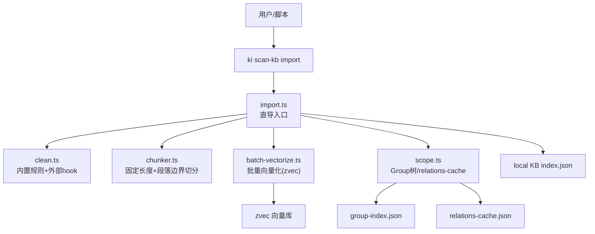
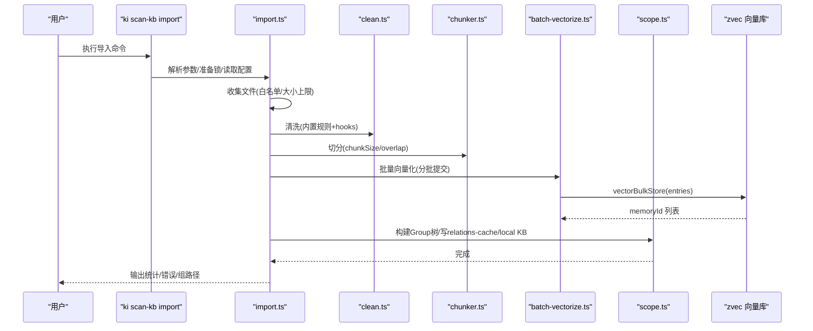
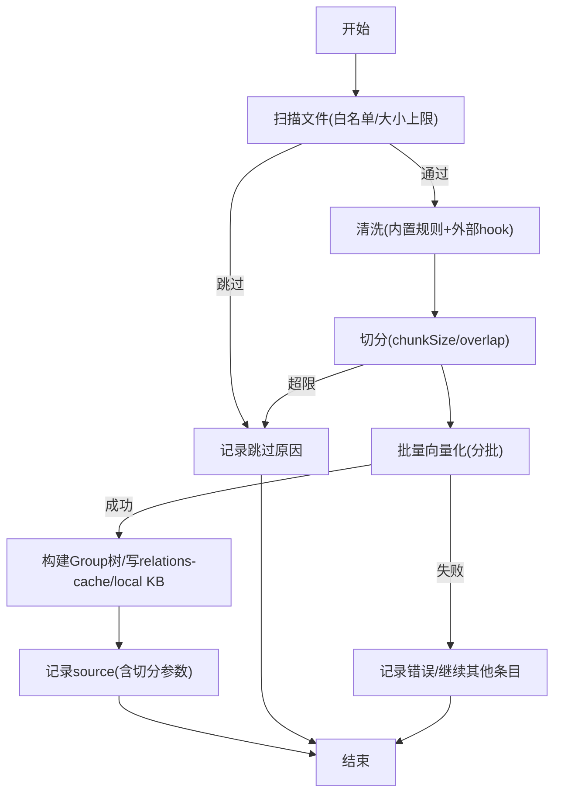
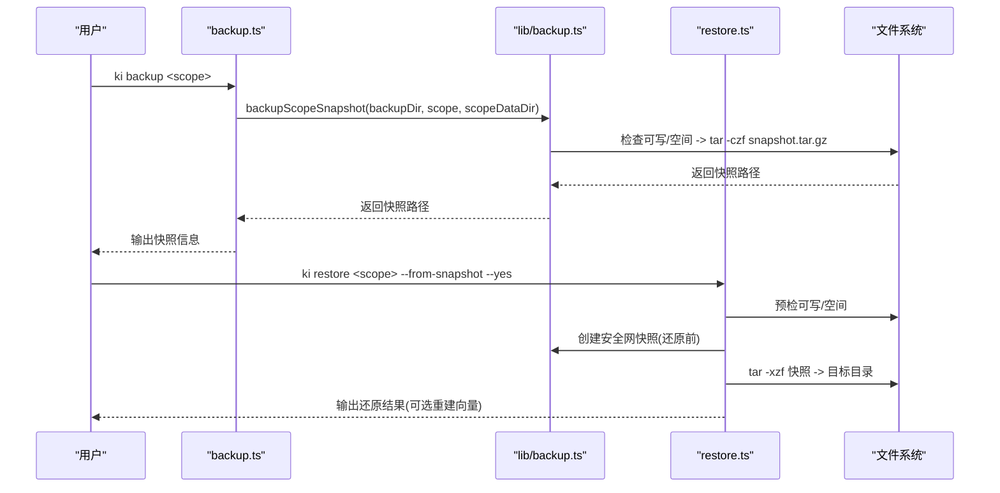
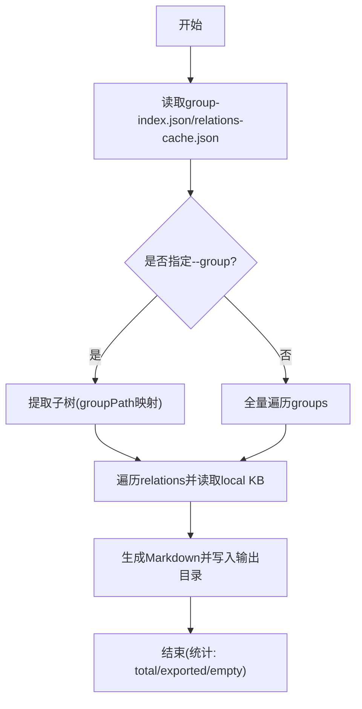
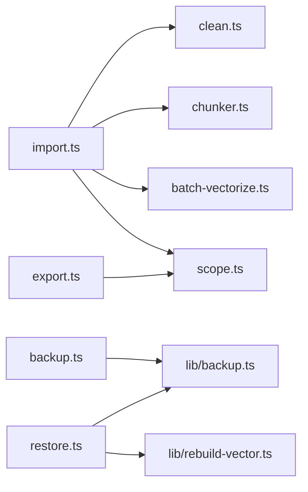

# 知识库管理

<cite>
**本文引用的文件**
- [README.md](file://README.md)
- [src/lib/import.ts](file://src/lib/import.ts)
- [src/lib/batch-vectorize.ts](file://src/lib/batch-vectorize.ts)
- [src/backup.ts](file://src/backup.ts)
- [src/export.ts](file://src/export.ts)
- [src/restore.ts](file://src/restore.ts)
- [docs/build-kb.md](file://docs/build-kb.md)
- [docs/backup-restore.md](file://docs/backup-restore.md)
- [docs/configuration.md](file://docs/configuration.md)
- [src/lib/chunker.ts](file://src/lib/chunker.ts)
- [src/lib/clean.ts](file://src/lib/clean.ts)
- [src/lib/scope.ts](file://src/lib/scope.ts)
- [src/lib/backup.ts](file://src/lib/backup.ts)
- [src/lib/rebuild-vector.ts](file://src/lib/rebuild-vector.ts)
</cite>

## 目录
1. [简介](#简介)
2. [项目结构](#项目结构)
3. [核心组件](#核心组件)
4. [架构总览](#架构总览)
5. [详细组件分析](#详细组件分析)
6. [依赖关系分析](#依赖关系分析)
7. [性能与大规模构建优化](#性能与大规模构建优化)
8. [故障恢复与排错指南](#故障恢复与排错指南)
9. [结论](#结论)
10. [附录：操作示例与最佳实践](#附录操作示例与最佳实践)

## 简介
本指南面向“知识库管理”的完整生命周期，覆盖外部 Wiki 导入、格式校验、自动切分、批量向量化、增量更新、备份与恢复（快照与版本控制）、导出为标准 Markdown Wiki、大规模构建策略、数据迁移与故障恢复，以及实际使用场景的操作示例与最佳实践。系统基于结构化知识索引与向量检索双通道能力，支持幂等导入、断点保护、WAL 原子写入与可观测进度反馈。

## 项目结构
- 入口与命令：CLI 命令封装在 src/*.ts（如 backup.ts、export.ts、restore.ts），库逻辑集中在 src/lib/*。
- 导入链路：scan-kb import → 直导模式（import.ts）→ 清洗（clean.ts）→ 切分（chunker.ts）→ 批量向量化（batch-vectorize.ts）→ Group 树与 relations-cache 写入（scope.ts）。
- 备份与恢复：backup.ts + lib/backup.ts 提供快照；restore.ts 负责从 tar.gz 快照还原并可选重建向量。
- 导出：export.ts 将内部 KB 反向导出为 Markdown 目录。
- 配置：docs/configuration.md 说明 dataDir、vectorDir、embedding、scopes、clean/import 等。

**图表来源**
- [src/lib/import.ts:214-559](file://src/lib/import.ts#L214-L559)
- [src/lib/clean.ts:48-130](file://src/lib/clean.ts#L48-L130)
- [src/lib/chunker.ts:57-92](file://src/lib/chunker.ts#L57-L92)
- [src/lib/batch-vectorize.ts:132-182](file://src/lib/batch-vectorize.ts#L132-L182)
- [src/lib/scope.ts:151-167](file://src/lib/scope.ts#L151-L167)

**章节来源**
- [README.md:143-166](file://README.md#L143-L166)
- [docs/build-kb.md:95-162](file://docs/build-kb.md#L95-L162)

## 核心组件
- 统一导入（直导模式）：支持 .md 白名单、大小上限、relation 冲突检测、清洗、切分、批量向量化、Group 树创建、relations-cache 写入、source 块记录。
- 批量向量化：分批提交（默认每批 200 条），共享一次引擎，失败条目不中断整体。
- 备份与恢复：tar.gz 快照、安全网快照、列出/选择/还原、还原后重建向量。
- 导出：按 Group 树与 local KB 生成标准 Markdown 目录，支持指定 group 子树导出。
- 配置：dataDir/vectorDir/embedding/scopes/clean/import/mcp 等集中管理。

**章节来源**
- [src/lib/import.ts:160-283](file://src/lib/import.ts#L160-L283)
- [src/lib/batch-vectorize.ts:129-182](file://src/lib/batch-vectorize.ts#L129-L182)
- [src/backup.ts:63-103](file://src/backup.ts#L63-L103)
- [src/export.ts:198-322](file://src/export.ts#L198-L322)
- [docs/configuration.md:41-177](file://docs/configuration.md#L41-L177)

## 架构总览
系统由“导入管线”、“向量层”、“本地 KB”、“索引与缓存”、“备份恢复”、“导出”六大部分组成。导入管线负责格式校验、清洗、切分、向量化；向量层持久化语义向量；本地 KB 保存原文；索引与缓存维护 Group 树与 Relation 元数据；备份恢复提供快照与还原；导出将内部结构转换为标准 Markdown。

**图表来源**
- [src/lib/import.ts:214-559](file://src/lib/import.ts#L214-L559)
- [src/lib/batch-vectorize.ts:132-182](file://src/lib/batch-vectorize.ts#L132-L182)
- [src/lib/scope.ts:151-167](file://src/lib/scope.ts#L151-L167)

## 详细组件分析

### 外部 Wiki 导入流程（格式校验、自动切分、批量向量化、增量更新）
- 格式校验：仅允许 .md（或配置的 extensions），单文件大小上限（默认 1MB），非白名单文件跳过并汇总提示。
- 自动切分：超过 chunkSize 的文件按“固定长度 + 段落边界优先”切分，重叠 overlap 保留上下文；单文件 chunk 数上限防止向量爆炸。
- 批量向量化：分批提交（默认 200 条/批），共享一次引擎；失败条目记录但不中断整体；支持 --no-vector 仅写 KB 层。
- 增量更新：幂等追加，同 sourcePath 覆盖、同名不同 sourcePath 跳过；重复执行同命令即同步变更；source 块持久化切分参数保证一致性。
- 中断保护：SIGINT/SIGTERM 捕获写中断标记，清理锁；支持后续恢复。

**图表来源**
- [src/lib/import.ts:160-283](file://src/lib/import.ts#L160-L283)
- [src/lib/chunker.ts:57-92](file://src/lib/chunker.ts#L57-L92)
- [src/lib/batch-vectorize.ts:132-182](file://src/lib/batch-vectorize.ts#L132-L182)

**章节来源**
- [src/lib/import.ts:214-559](file://src/lib/import.ts#L214-L559)
- [src/lib/chunker.ts:25-92](file://src/lib/chunker.ts#L25-L92)
- [src/lib/clean.ts:48-130](file://src/lib/clean.ts#L48-L130)
- [docs/build-kb.md:111-162](file://docs/build-kb.md#L111-L162)

### 备份与恢复机制（快照管理与版本控制）
- 快照备份：打包 scope 目录为 tar.gz，时间戳命名，防覆盖序号；预检可写性与磁盘空间；失败清理半截产物。
- 列出备份：按 <backupDir>/<scope>/snapshots 布局查找并按时间排序。
- 还原流程：从 tar.gz 解压到目标父目录；还原前创建安全网快照；若 tar 失败尝试自动从安全网恢复；支持 --rebuild-vector 重建内容/关系/路径三类向量。
- 版本控制：时间戳快照 + 可选 timestamp 选择；还原前展示影响范围（Group/Relation 数量、目录体积、修改时间）。

**图表来源**
- [src/backup.ts:63-103](file://src/backup.ts#L63-L103)
- [src/lib/backup.ts:87-117](file://src/lib/backup.ts#L87-L117)
- [src/restore.ts:123-283](file://src/restore.ts#L123-L283)

**章节来源**
- [src/backup.ts:63-103](file://src/backup.ts#L63-L103)
- [src/lib/backup.ts:87-178](file://src/lib/backup.ts#L87-L178)
- [src/restore.ts:123-283](file://src/restore.ts#L123-L283)
- [docs/backup-restore.md:72-163](file://docs/backup-restore.md#L72-L163)

### 知识库导出（内部格式转标准 Markdown Wiki）
- 数据源：group-index.json + relations-cache.json + local KB index.json。
- 导出规则：按 Group 树遍历，每个 relation 生成 .md；支持 --group 导出子树；顶层目录名 = scope name（或 group 最后一段）。
- 安全写盘：输出目录存在且非空时拒绝覆盖，需 --yes 确认；写前预检可写性。

**图表来源**
- [src/export.ts:198-322](file://src/export.ts#L198-L322)

**章节来源**
- [src/export.ts:198-322](file://src/export.ts#L198-L322)

### 大规模知识库构建与优化策略
- 批量向量化分批提交：默认 200 条/批，避免一次性提交导致无中间态；多批时输出进度。
- 切分参数调优：chunkSize 平衡检索粒度与规模；默认 1000 字符；overlap 150 保留上下文。
- 大文件防护：单文件大小上限（默认 1MB），超限跳过；单文件 chunk 数上限（500）防止向量爆炸。
- 并发与锁：同 scope 并发导入拒绝（import.lock），避免竞争；SIGINT/SIGTERM 中断保护。
- 向量重建：还原后使用 rebuild-vector 重建内容/关系/路径三类向量，并回写 memoryId。

**章节来源**
- [src/lib/batch-vectorize.ts:129-182](file://src/lib/batch-vectorize.ts#L129-L182)
- [src/lib/chunker.ts:25-92](file://src/lib/chunker.ts#L25-L92)
- [src/lib/import.ts:311-357](file://src/lib/import.ts#L311-L357)
- [src/lib/rebuild-vector.ts:246-323](file://src/lib/rebuild-vector.ts#L246-L323)

### 数据迁移工具与故障恢复方法
- 数据迁移：旧格式 group-index.json（roots）自动迁移为 groups；source 块记录 dir/chunkSize/chunkOverlap。
- 故障恢复：
  - 损坏文件：从快照恢复整个 scope。
  - 向量不一致：执行 --rebuild-vector 重建并回写 memoryId。
  - 本地 KB 缺失：从快照恢复或重新导入（幂等追加）。
  - 中断恢复：SIGINT/SIGTERM 写中断标记，清理锁；rebuild-vector 成功后清除中断标记。

**章节来源**
- [src/lib/scope.ts:117-146](file://src/lib/scope.ts#L117-L146)
- [src/lib/scope.ts:205-229](file://src/lib/scope.ts#L205-L229)
- [src/restore.ts:185-283](file://src/restore.ts#L185-L283)
- [src/lib/rebuild-vector.ts:246-323](file://src/lib/rebuild-vector.ts#L246-L323)

## 依赖关系分析
- 导入依赖：import.ts 依赖 clean.ts（清洗）、chunker.ts（切分）、batch-vectorize.ts（向量化）、scope.ts（Group树/relations-cache）。
- 备份恢复依赖：backup.ts 调用 lib/backup.ts；restore.ts 调用 lib/backup.ts 与 lib/rebuild-vector.ts。
- 导出依赖：export.ts 读取 scope.ts 提供的路径函数与 JSON 结构。
- 配置依赖：所有模块通过 config.js 读取 dataDir/vectorDir/embedding/scopes 等。

**图表来源**
- [src/lib/import.ts:214-559](file://src/lib/import.ts#L214-L559)
- [src/backup.ts:63-103](file://src/backup.ts#L63-L103)
- [src/restore.ts:123-283](file://src/restore.ts#L123-L283)
- [src/export.ts:198-322](file://src/export.ts#L198-L322)

**章节来源**
- [src/lib/import.ts:214-559](file://src/lib/import.ts#L214-L559)
- [src/backup.ts:63-103](file://src/backup.ts#L63-L103)
- [src/restore.ts:123-283](file://src/restore.ts#L123-L283)
- [src/export.ts:198-322](file://src/export.ts#L198-L322)

## 性能与大规模构建优化
- 向量化分批：200 条/批，减少单次提交压力；多批输出进度。
- 切分策略：固定长度 + 段落边界优先，避免硬切破坏语义；overlap 保留上下文。
- 大文件与 chunk 上限：防止单文件向量爆炸；超限跳过并告警。
- 并发与锁：同 scope 并发导入拒绝，避免资源竞争；中断保护提升鲁棒性。
- 向量重建：还原后重建内容/关系/路径三类向量，确保检索一致性。

**章节来源**
- [src/lib/batch-vectorize.ts:129-182](file://src/lib/batch-vectorize.ts#L129-L182)
- [src/lib/chunker.ts:57-92](file://src/lib/chunker.ts#L57-L92)
- [src/lib/import.ts:311-357](file://src/lib/import.ts#L311-L357)
- [src/lib/rebuild-vector.ts:246-323](file://src/lib/rebuild-vector.ts#L246-L323)

## 故障恢复与排错指南
- 常见错误：
  - 未注册 scope：在配置中注册或切换 scopeMode。
  - 向量维度不匹配：检查 embedding.dimension 与 collection.dimension。
  - tar 不可用：安装 tar（Linux/macOS 内置，Windows 请安装 Git for Windows）。
  - 输出目录已存在：导出时需 --yes 确认覆盖。
- 恢复步骤：
  - 从快照恢复：ki restore <scope> --from-snapshot --timestamp <ts> --yes。
  - 重建向量：ki restore <scope> --rebuild-vector。
  - 重新导入：幂等追加，重复执行同命令即可同步变更。

**章节来源**
- [docs/backup-restore.md:183-229](file://docs/backup-restore.md#L183-L229)
- [src/restore.ts:313-342](file://src/restore.ts#L313-L342)
- [docs/configuration.md:67-88](file://docs/configuration.md#L67-L88)

## 结论
本系统提供了完整的知识库管理能力：从外部 Wiki 导入（格式校验、清洗、切分、批量向量化、增量更新）到备份恢复（快照与版本控制）、导出为标准 Markdown、大规模构建优化、数据迁移与故障恢复。通过结构化索引与向量检索双通道，既保证精准定位又支持语义召回，适合企业级知识资产管理与 AI Agent 集成。

## 附录：操作示例与最佳实践
- 首次导入（外部 Wiki 原文直导，无 AI 依赖）：
  - 命令：ki scan-kb import --scope <scope> --source <wiki目录> --group <目标Group>
  - 行为：递归扫描 .md → 自动切分 → 批量向量化 → 写 cache + local KB → 记录 source
- 增量更新：
  - 修改/新增 source 目录文件后，重新执行同一条 import 命令（幂等追加）
- 备份与恢复：
  - 备份：ki backup <scope>
  - 列出备份：ki restore <scope>
  - 从快照恢复：ki restore <scope> --from-snapshot --timestamp <ts> --yes
  - 重建向量：ki restore <scope> --rebuild-vector
- 导出为 Markdown Wiki：
  - 命令：ki export <scope> --output <dir> [--group <path>] [--yes]
- 最佳实践：
  - 合理设置 chunkSize/overlap 平衡检索粒度与规模
  - 对大型知识库启用分批向量化与中断保护
  - 定期备份并使用快照进行版本控制
  - 使用 --rebuild-vector 确保向量与 KB 一致

**章节来源**
- [README.md:143-166](file://README.md#L143-L166)
- [docs/build-kb.md:111-162](file://docs/build-kb.md#L111-L162)
- [docs/backup-restore.md:72-163](file://docs/backup-restore.md#L72-L163)
- [src/export.ts:329-338](file://src/export.ts#L329-L338)