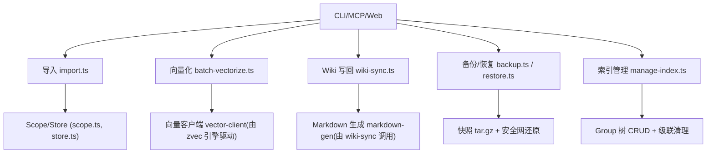
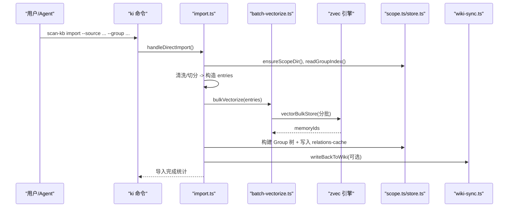
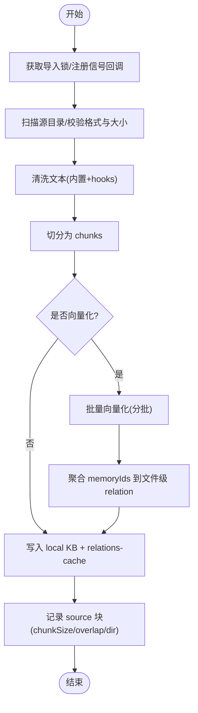
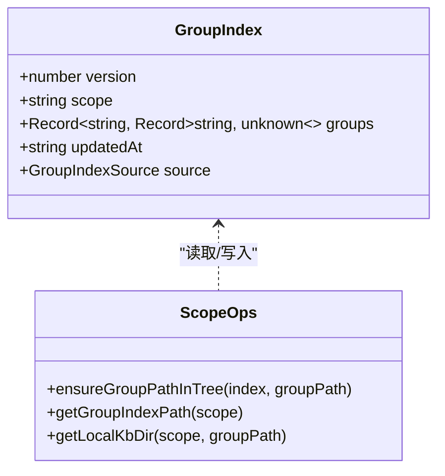
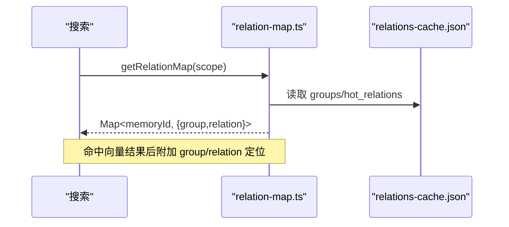
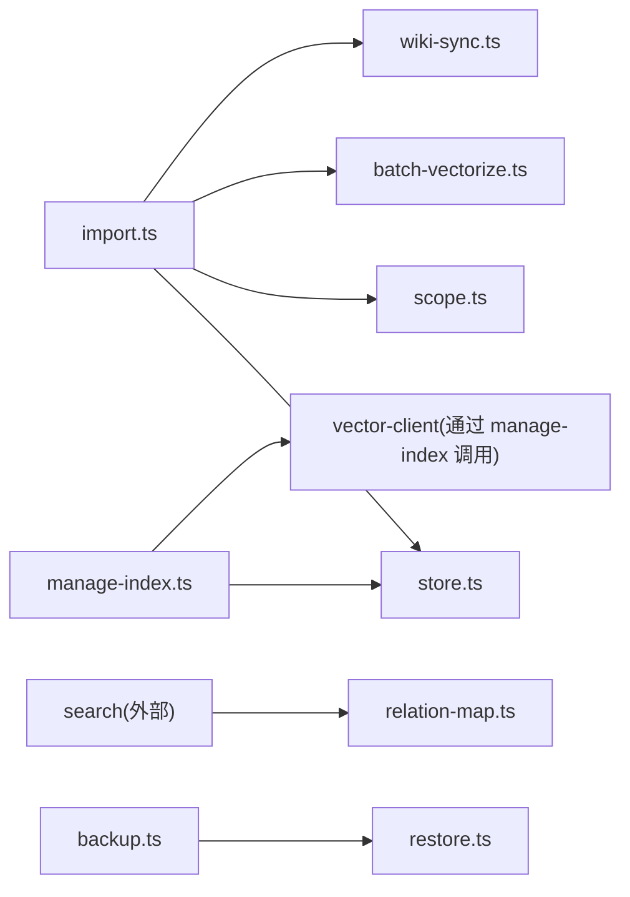

# 知识库管理

<cite>
**本文引用的文件**
- [README.md](file://README.md)
- [src/lib/import.ts](file://src/lib/import.ts)
- [src/lib/batch-vectorize.ts](file://src/lib/batch-vectorize.ts)
- [src/lib/wiki-sync.ts](file://src/lib/wiki-sync.ts)
- [src/lib/relation-map.ts](file://src/lib/relation-map.ts)
- [src/lib/scope.ts](file://src/lib/scope.ts)
- [src/lib/store.ts](file://src/lib/store.ts)
- [src/backup.ts](file://src/backup.ts)
- [src/restore.ts](file://src/restore.ts)
- [docs/backup-restore.md](file://docs/backup-restore.md)
- [docs/configuration.md](file://docs/configuration.md)
- [src/manage-index.ts](file://src/manage-index.ts)
</cite>

## 目录
1. [简介](#简介)
2. [项目结构](#项目结构)
3. [核心组件](#核心组件)
4. [架构总览](#架构总览)
5. [详细组件分析](#详细组件分析)
6. [依赖关系分析](#依赖关系分析)
7. [性能与优化](#性能与优化)
8. [故障排查](#故障排查)
9. [结论](#结论)
10. [附录：最佳实践与运维手册](#附录：最佳实践与运维手册)

## 简介
本仓库提供面向 AI Agent 的知识索引系统，结合结构化知识索引（Group 树、Relation）与向量语义检索（zvec），支持外部 Wiki 原文直导、自动切分、批量向量化、增量更新、Wiki 写回、备份恢复与版本迁移等能力。通过 CLI 与 MCP 双通道对外暴露能力，内置 Web 前端便于导入后验证与检索调试。

**章节来源**
- [README.md:35-103](file://README.md#L35-L103)

## 项目结构
- 数据层
  - kb/{scope}：每个 scope 独立目录，包含 group-index.json、relations-cache.json、本地 KB 原文（{group}/index.json）。
  - vectorDir：zvec 向量库集合目录，按 scope 隔离。
  - backupDir：快照备份目录。
- 代码层
  - src/lib/*：导入、向量化、Wiki 写回、Scope/Store/WAL、配置、进度、中断保护等核心库。
  - src/*：CLI 命令入口（backup、restore、manage-index 等）。
  - web/*：内置可视化前端。
  - docs/*：用户文档（备份恢复、配置、工作流等）。

**图表来源**
- [src/lib/import.ts:214-564](file://src/lib/import.ts#L214-L564)
- [src/lib/batch-vectorize.ts:132-182](file://src/lib/batch-vectorize.ts#L132-L182)
- [src/lib/wiki-sync.ts:66-151](file://src/lib/wiki-sync.ts#L66-L151)
- [src/backup.ts:63-103](file://src/backup.ts#L63-L103)
- [src/restore.ts:124-284](file://src/restore.ts#L124-L284)
- [src/manage-index.ts:82-137](file://src/manage-index.ts#L82-L137)

**章节来源**
- [docs/backup-restore.md:45-70](file://docs/backup-restore.md#L45-L70)
- [docs/configuration.md:45-68](file://docs/configuration.md#L45-L68)

## 核心组件
- 导入链路：扫描 Markdown → 清洗 → 切分 → 批量向量化 → Group 树构建 → relations-cache 写入 → source 记录。
- 向量化：bulkVectorize 分批提交（默认 200 条/批），共享一次 engine；失败条目不中断整体。
- Wiki 写回：事件驱动写回外部 Wiki，支持自动补齐历史、幂等跳过已存在文件。
- 关系反查：memoryId → {group, relation} 映射带 TTL 缓存，search 结果可定位原文。
- 备份恢复：tar.gz 快照 + 安全网还原 + 可选重建向量（支持局部重建过滤与打标）。
- 索引管理：Group 树创建/删除/列出 scopes，支持级联清理（cache、local-kb、向量）。

**章节来源**
- [src/lib/import.ts:214-564](file://src/lib/import.ts#L214-L564)
- [src/lib/batch-vectorize.ts:132-182](file://src/lib/batch-vectorize.ts#L132-L182)
- [src/lib/wiki-sync.ts:66-151](file://src/lib/wiki-sync.ts#L66-L151)
- [src/lib/relation-map.ts:48-78](file://src/lib/relation-map.ts#L48-L78)
- [src/backup.ts:63-103](file://src/backup.ts#L63-L103)
- [src/restore.ts:124-284](file://src/restore.ts#L124-L284)
- [src/manage-index.ts:300-411](file://src/manage-index.ts#L300-L411)

## 架构总览
系统分为发现层（zvec 向量引擎：语义召回、BM25 全文、RRF 融合）、交付层（kisearch：Group 树导航、Relation 热缓存、原文全文交付）。导入流程将外部 Wiki 原文直导为本地 KB 与向量，同时维护 Group 树与 Relation 元数据；查询时优先索引直查，未命中则走向量兜底并反查原文。

**图表来源**
- [src/lib/import.ts:214-564](file://src/lib/import.ts#L214-L564)
- [src/lib/batch-vectorize.ts:132-182](file://src/lib/batch-vectorize.ts#L132-L182)
- [src/lib/wiki-sync.ts:66-151](file://src/lib/wiki-sync.ts#L66-L151)
- [src/lib/scope.ts:151-167](file://src/lib/scope.ts#L151-L167)
- [src/lib/store.ts:55-62](file://src/lib/store.ts#L55-L62)

## 详细组件分析

### 知识导入流程（外部 Wiki 原文直导、自动切分、批量向量化）
- 输入：外部 Wiki 根目录或单个 Markdown 文件；支持格式白名单与单文件大小上限。
- 处理：
  - 并发锁与中断保护：同 scope 并发导入拒绝；SIGINT/SIGTERM 捕获并写中断标记，保留进度。
  - 清洗：内置规则 + 外部 hooks（可关闭）；hook 失败回滚 local KB。
  - 切分：段落边界优先的 chunking，超限文件/过多 chunk 会跳过。
  - 向量化：bulkVectorize 分批提交（默认 200 条/批），失败条目记入 errors。
  - Group 树：按 groupPath 自动补建路径节点。
  - 元数据：relations-cache 写入文件级 relation 与 memoryIds（方案 D：多值）；source 块记录 dir/chunkSize/chunkOverlap。
  - Wiki 写回：可选，自动补齐历史文件，幂等跳过已存在。
- 输出：导入统计（files/chunks/vectorized/skipped/errors）、groups、source。

**图表来源**
- [src/lib/import.ts:214-564](file://src/lib/import.ts#L214-L564)
- [src/lib/batch-vectorize.ts:132-182](file://src/lib/batch-vectorize.ts#L132-L182)

**章节来源**
- [src/lib/import.ts:214-564](file://src/lib/import.ts#L214-L564)
- [src/lib/batch-vectorize.ts:132-182](file://src/lib/batch-vectorize.ts#L132-L182)
- [src/lib/wiki-sync.ts:66-151](file://src/lib/wiki-sync.ts#L66-L151)

### Group 树结构设计原则
- 扁平化路径键：groupPath 以“/”分隔的完整相对路径表示（如 “Wiki/部署运维”），避免 rootName 概念。
- 自动补建：ensureGroupPathInTree 保证路径中所有父节点存在；导入/同步时按需创建。
- 唯一性约束：节点名不含“/”，MCP 仅允许删除空节点，非空需 CLI 级联删除。
- 可视化友好：前端根据 groups 列表递归构建树，若唯一顶层目录则上提一级。

**图表来源**
- [src/lib/scope.ts:106-167](file://src/lib/scope.ts#L106-L167)
- [src/manage-index.ts:82-137](file://src/manage-index.ts#L82-L137)

**章节来源**
- [src/lib/scope.ts:151-167](file://src/lib/scope.ts#L151-L167)
- [src/manage-index.ts:82-137](file://src/manage-index.ts#L82-L137)

### Relation 关系管理机制
- 文件级 Relation：以文件名去扩展名为 relation 文本，挂载 memoryIds（方案 D：多值）与 sourcePath。
- 反查映射：relation-map 维护 memoryId → {group, relation} 的 TTL 缓存（mtime/size 变化立即失效，TTL 兜底）。
- 标签体系：三层标签 ki-search（内容）、ki-relation（关系）、ki-path（路径），导入可为每个 chunk/group 写入对应标签向量；自定义文档 tag 也会持久化到 relation.tags。
- 冲突处理：同 group 下同名 relation 且不同 sourcePath 视为冲突并跳过；相同 sourcePath 幂等覆盖。

**图表来源**
- [src/lib/relation-map.ts:48-78](file://src/lib/relation-map.ts#L48-L78)
- [src/lib/import.ts:602-637](file://src/lib/import.ts#L602-L637)

**章节来源**
- [src/lib/relation-map.ts:48-78](file://src/lib/relation-map.ts#L48-L78)
- [src/lib/import.ts:602-637](file://src/lib/import.ts#L602-L637)

### 增量更新策略
- 幂等追加：重复执行同一 import 命令，同 sourcePath 覆盖更新，同名不同 sourcePath 跳过。
- 覆盖旧向量：当 scope 已存在向量时，导入前提示并先删除旧向量再重建，消除孤儿向量。
- 中断自愈：SIGINT/SIGTERM 写中断标记；成功导入清除标记，失败保留以便引导恢复。
- Wiki 写回幂等：autoBackfill 检测目标目录为空时全量补齐，缺省跳过已存在文件避免脏 diff。

**章节来源**
- [src/lib/import.ts:297-387](file://src/lib/import.ts#L297-L387)
- [src/lib/import.ts:427-448](file://src/lib/import.ts#L427-L448)
- [src/lib/wiki-sync.ts:102-119](file://src/lib/wiki-sync.ts#L102-L119)

### 备份恢复与版本管理
- 备份：ki backup 对 scope 目录打 tar.gz 快照，存储于 backupDir/{scope}/snapshots。
- 恢复：ki restore 从快照还原，支持指定 timestamp；还原前自动创建安全网快照；解压失败尝试自动恢复原始数据。
- 向量重建：还原后可选 --rebuild-vector 重建向量（支持 --group 局部过滤与 --tags 打标）；与 --from-snapshot 组合受限（需全量对齐）。
- 版本兼容：JSON 文件含 version 字段；读取时自动迁移旧格式（roots→groups，旧 key 前缀清理）。

**章节来源**
- [src/backup.ts:63-103](file://src/backup.ts#L63-L103)
- [src/restore.ts:124-284](file://src/restore.ts#L124-L284)
- [src/restore.ts:451-490](file://src/restore.ts#L451-L490)
- [src/lib/store.ts:73-92](file://src/lib/store.ts#L73-L92)
- [docs/backup-restore.md:121-178](file://docs/backup-restore.md#L121-L178)

## 依赖关系分析
- 导入依赖：store（WAL 写入）、scope（路径与 source）、batch-vectorize（向量化）、wiki-sync（写回）、progress/interrupt（进度与中断）。
- 查询依赖：relation-map（TTL 缓存）、vector-client（zvec 混合检索）。
- 备份恢复依赖：lib/backup（快照）、restore（解压与安全网）、preflight（空间/权限预检）。
- 索引管理依赖：store/scope（读写 group-index）、vector-client（级联删除向量）。

**图表来源**
- [src/lib/import.ts:214-564](file://src/lib/import.ts#L214-L564)
- [src/lib/relation-map.ts:48-78](file://src/lib/relation-map.ts#L48-L78)
- [src/backup.ts:63-103](file://src/backup.ts#L63-L103)
- [src/restore.ts:124-284](file://src/restore.ts#L124-L284)
- [src/manage-index.ts:300-411](file://src/manage-index.ts#L300-L411)

**章节来源**
- [src/lib/import.ts:214-564](file://src/lib/import.ts#L214-L564)
- [src/lib/relation-map.ts:48-78](file://src/lib/relation-map.ts#L48-L78)
- [src/backup.ts:63-103](file://src/backup.ts#L63-L103)
- [src/restore.ts:124-284](file://src/restore.ts#L124-L284)
- [src/manage-index.ts:300-411](file://src/manage-index.ts#L300-L411)

## 性能与优化
- 批量向量化：bulkVectorize 分批提交（默认 200 条/批），减少单次负载并支持中间态进度反馈。
- 路径向量：为每个 chunk 写入 ki-relation 向量，为每个 group 写入 ki-path 向量，提升路径与关系召回效率。
- 缓存策略：relation-map 使用 mtime/size + TTL 缓存，避免频繁解析 JSON；TTL 默认 10 分钟。
- 导入锁与中断：同 scope 并发导入互斥；中断写标记，支持后续恢复。
- 向量覆盖：导入前检测已有向量并删除重建，避免孤儿向量影响检索。

**章节来源**
- [src/lib/batch-vectorize.ts:132-182](file://src/lib/batch-vectorize.ts#L132-L182)
- [src/lib/import.ts:393-448](file://src/lib/import.ts#L393-L448)
- [src/lib/relation-map.ts:48-78](file://src/lib/relation-map.ts#L48-L78)
- [src/lib/import.ts:240-264](file://src/lib/import.ts#L240-L264)

## 故障排查
- JSON 损坏：readJson 抛出 CORRUPT_JSON，建议从备份恢复或从 _template 重新初始化。
- 向量维度不匹配：doctor 检查 embedding.dimension 与 collection.dimension 一致性。
- 导入中断：SIGINT/SIGTERM 写中断标记；恢复时查看已完成/总数并选择重建。
- Wiki 写回失败：返回 reason（如 enabled=false、无目标目录、非法 relation 名称）。
- 备份恢复失败：tar 不可用、磁盘空间不足、权限问题；安全网快照失败会阻断还原。

**章节来源**
- [src/lib/store.ts:23-49](file://src/lib/store.ts#L23-L49)
- [src/lib/wiki-sync.ts:88-100](file://src/lib/wiki-sync.ts#L88-L100)
- [src/restore.ts:67-75](file://src/restore.ts#L67-L75)
- [src/restore.ts:186-199](file://src/restore.ts#L186-L199)

## 结论
本系统通过结构化索引与向量检索的结合，提供了高可用、可追溯、可恢复的知识管理能力。导入流程支持外部 Wiki 原文直导与增量更新，Group 树与 Relation 机制确保知识组织清晰，备份恢复与版本迁移保障数据安全。配合批量向量化与缓存策略，系统在大规模场景下具备良好性能与稳定性。

## 附录：最佳实践与运维手册

### 知识库组织结构最佳实践
- Group 命名：使用自然语言词汇，避免代码符号；层级不超过 3 层以保证可读性。
- 文件命名：relation 名即文件名去扩展名，禁止包含“/”、“\”、“..”以防路径穿越。
- 标签体系：合理使用 ki-search/ki-relation/ki-path 三层标签；自定义文档 tag 用于跨组检索。

**章节来源**
- [src/lib/wiki-sync.ts:31-37](file://src/lib/wiki-sync.ts#L31-L37)
- [README.md:82-103](file://README.md#L82-L103)

### 文件命名规范
- 源文件：仅 .md（可配置 extensions）；单文件大小上限默认 1MB（可配置 maxFileSize）。
- 切分产物：chunk 的 sourcePath 为“文件路径#序号”，relation 为“文件名-N”。

**章节来源**
- [src/lib/import.ts:160-194](file://src/lib/import.ts#L160-L194)
- [src/lib/import.ts:196-211](file://src/lib/import.ts#L196-L211)

### 批量操作技巧
- 批量导入：使用 scan-kb import 一次性导入整个 Wiki 目录，自动切分与向量化。
- 批量重建：restore --rebuild-vector 支持 --group 局部过滤与 --tags 打标，避免全量重建开销。
- 批量删除：manage-index delete 支持 --force 级联清理 cache/local-kb/向量。

**章节来源**
- [src/restore.ts:451-490](file://src/restore.ts#L451-L490)
- [src/manage-index.ts:300-411](file://src/manage-index.ts#L300-L411)

### 性能优化建议
- 调整 chunkSize/overlap：大文档适当增大 chunkSize，减少切分数量。
- 关闭非必要清洗：--no-clean 或 clean.enabled=false 提升导入速度。
- 向量维度一致：确保 embedding.dimension 与 collection.dimension 一致，避免重建。

**章节来源**
- [src/lib/import.ts:220-232](file://src/lib/import.ts#L220-L232)
- [docs/configuration.md:61-68](file://docs/configuration.md#L61-L68)

### 数据一致性保证机制
- WAL 写入：writeJson 使用临时文件 + rename 原子写入，避免部分写入导致损坏。
- 幂等覆盖：重复导入同 sourcePath 覆盖更新，不同 sourcePath 同名 relation 跳过。
- 版本迁移：读取时自动迁移旧格式，确保向前兼容。

**章节来源**
- [src/lib/store.ts:55-62](file://src/lib/store.ts#L55-L62)
- [src/lib/import.ts:323-336](file://src/lib/import.ts#L323-L336)
- [src/lib/store.ts:73-92](file://src/lib/store.ts#L73-L92)

### 备份恢复与数据迁移
- 定期备份：使用 ki backup 对关键 scope 打快照，保留多个时间戳。
- 安全恢复：restore 前自动创建安全网快照，解压失败自动恢复原始数据。
- 数据迁移：旧格式（roots→groups）自动迁移；必要时删除损坏 scope 后重新初始化。

**章节来源**
- [docs/backup-restore.md:121-178](file://docs/backup-restore.md#L121-L178)
- [src/restore.ts:212-271](file://src/restore.ts#L212-L271)
- [src/lib/store.ts:73-92](file://src/lib/store.ts#L73-L92)